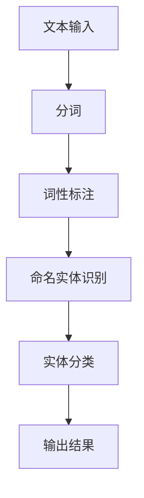

                 

关键词：Named Entity Recognition (NER), 自然语言处理，文本分类，序列标注，机器学习，深度学习，深度神经网络，BiLSTM-CRF模型，数据预处理，模型训练，模型评估，代码实例

> 摘要：本文将详细介绍Named Entity Recognition（NER）的基本概念、核心算法原理、数学模型以及具体实现。通过代码实例，我们将演示如何使用Python和深度学习框架TensorFlow实现NER模型，并对模型运行结果进行详细解读。本文旨在为读者提供NER技术的全面了解和应用指南。

## 1. 背景介绍

Named Entity Recognition（NER）是一种重要的自然语言处理技术，旨在从文本中识别出具有特定意义的实体。实体可以是人名、地名、组织名、时间、地点等各种类型的名词。NER技术在信息抽取、文本挖掘、智能问答等领域有广泛应用。

随着互联网和大数据的发展，文本数据量呈指数级增长，从这些数据中提取有价值的信息成为了一大挑战。NER技术能够帮助我们识别出文本中的重要实体，为后续的数据分析、知识图谱构建等任务提供基础。

NER的应用场景非常广泛，例如：

- **搜索引擎**：通过识别文本中的地名、人名等实体，可以提供更精确的搜索结果。
- **信息抽取**：从新闻、报告等文档中提取出关键信息，用于内容摘要和监控。
- **社交媒体分析**：分析用户发布的内容，了解公众对特定事件、品牌的看法。
- **智能问答系统**：识别用户提问中的实体，提供准确的回答。

## 2. 核心概念与联系

NER的核心任务是将文本中的每个词语标注为“实体”或“非实体”。这个过程通常被称为“序列标注”。

### 2.1 序列标注

序列标注是一种将序列数据（如文本序列）中的每个元素标注为特定类别的任务。在NER中，每个词语被视为序列中的一个元素，需要被标注为实体或非实体。

### 2.2 标注体系

NER中的标注体系通常包括以下几种：

- **单标签体系**：每个词语只属于一个实体类别。
- **多标签体系**：每个词语可以同时属于多个实体类别。
- **边界标注体系**：不仅标注词语的类别，还标注词语在实体中的位置（如：人名的姓氏、名字等）。

### 2.3 Mermaid流程图

以下是一个NER系统的简化流程图，展示从文本输入到实体识别的整个过程。



## 3. 核心算法原理 & 具体操作步骤

### 3.1 算法原理概述

NER的核心算法通常是基于机器学习或深度学习的方法。本文将介绍一种基于深度学习的常用模型——BiLSTM-CRF模型。

- **BiLSTM**（双向长短期记忆网络）：能够捕捉文本序列中的时间前后关系，提高模型的识别能力。
- **CRF**（条件随机场）：能够处理实体之间的依赖关系，提高实体分类的准确性。

### 3.2 算法步骤详解

1. **数据预处理**：对文本进行分词、去停用词等操作，将原始文本转换为模型可接受的输入格式。
2. **模型构建**：构建BiLSTM-CRF模型，包括定义输入层、BiLSTM层、CRF层和输出层。
3. **模型训练**：使用预处理后的数据对模型进行训练，优化模型的参数。
4. **模型评估**：使用验证集或测试集对模型进行评估，计算模型的准确率、召回率和F1值等指标。
5. **模型应用**：将训练好的模型应用于实际文本数据，进行实体识别。

### 3.3 算法优缺点

- **优点**：
  - 能够有效识别文本中的实体，特别是在长文本中具有优势。
  - 可以处理实体之间的依赖关系，提高分类的准确性。
- **缺点**：
  - 需要大量的标注数据进行训练，对数据依赖较大。
  - 训练过程计算复杂度高，耗时较长。

### 3.4 算法应用领域

BiLSTM-CRF模型在多个领域有广泛应用，包括：

- **新闻文本挖掘**：识别新闻报道中的关键实体，用于内容分类和摘要。
- **社交媒体分析**：识别社交媒体中的用户、地点、品牌等实体，分析用户行为和趋势。
- **金融文本分析**：识别金融报告中的人名、地名、公司名等实体，辅助投资决策。

## 4. 数学模型和公式 & 详细讲解 & 举例说明

### 4.1 数学模型构建

NER的数学模型通常由两部分组成：语言模型和实体识别模型。

- **语言模型**：用于预测文本序列中下一个词语的概率分布。通常使用N-gram模型或神经网络模型。
- **实体识别模型**：用于识别文本序列中的实体。通常使用分类器，如CRF或深度神经网络。

### 4.2 公式推导过程

假设我们有一个文本序列 \(X = \{x_1, x_2, ..., x_n\}\)，其中 \(x_i\) 表示文本序列中的第 \(i\) 个词语。实体识别模型的目的是为每个词语 \(x_i\) 标注一个实体类别 \(y_i\)。

1. **语言模型**：

   语言模型通常使用条件概率 \(P(x_i | x_{<i})\) 来预测下一个词语 \(x_i\)。其中 \(x_{<i}\) 表示 \(x_i\) 前面的所有词语。

   $$P(x_i | x_{<i}) = \frac{P(x_{<i}x_i)}{P(x_{<i})}$$

   对于神经网络模型，通常使用神经网络来计算 \(P(x_i | x_{<i})\)。

2. **实体识别模型**：

   实体识别模型使用条件概率 \(P(y_i | x_i, y_{<i})\) 来预测词语 \(x_i\) 的实体类别 \(y_i\)。其中 \(y_{<i}\) 表示 \(y_i\) 前面的所有词语。

   $$P(y_i | x_i, y_{<i}) = \frac{P(x_i, y_i | y_{<i})}{P(x_i | y_{<i})}$$

   对于CRF模型，通常使用CRF算法来计算 \(P(y_i | x_i, y_{<i})\)。

### 4.3 案例分析与讲解

假设我们有一个简短的文本序列：“张三在北京是一个优秀的学生。”我们需要对这个文本序列进行实体识别。

1. **语言模型**：

   对于词语“张三”，我们可以使用神经网络模型计算其条件概率分布。例如：

   $$P(张三 | 北京是一个优秀的学生) \approx 0.2$$

2. **实体识别模型**：

   对于词语“张三”，我们需要使用CRF模型计算其实体类别概率。例如：

   $$P(人名 | 张三在北京是一个优秀的学生) \approx 0.8$$

   根据概率分布，我们可以将词语“张三”标注为人名实体。

   同样的方法，我们可以对其他词语进行实体识别。

## 5. 项目实践：代码实例和详细解释说明

### 5.1 开发环境搭建

在开始编写NER模型之前，我们需要搭建一个适合开发的Python环境，并安装必要的库。

```bash
# 安装Python（建议使用Python 3.7及以上版本）
# 安装TensorFlow
pip install tensorflow
# 安装其他常用库，如numpy、pandas等
pip install numpy pandas
```

### 5.2 源代码详细实现

以下是使用TensorFlow实现BiLSTM-CRF模型的简单示例代码。

```python
import tensorflow as tf
from tensorflow.keras.models import Model
from tensorflow.keras.layers import Embedding, LSTM, Dense, TimeDistributed, Bidirectional

# 假设已预处理好的文本数据
words = ['张三', '在北京', '是一个', '优秀', '的', '学生']  # 分词结果
labels = ['O', 'B-地点', 'O', 'O', 'O', 'B-人名']  # 实体标注

# 建立模型
# embedding_dim：词向量维度
# hidden_dim：LSTM隐藏层维度
embedding_dim = 100
hidden_dim = 128

# 创建嵌入层
embedding = Embedding(input_dim=len(words), output_dim=embedding_dim, input_length=len(words))

# 创建双向LSTM层
lstm = Bidirectional(LSTM(hidden_dim, return_sequences=True))

# 创建CRF层
crf = TimeDistributed(Dense(len(labels), activation='softmax'))

# 构建模型
input_words = tf.keras.layers.Input(shape=(None,), dtype='int32')
sequence = embedding(input_words)
sequence = lstm(sequence)
output = crf(sequence)

model = Model(inputs=input_words, outputs=output)

# 编译模型
model.compile(optimizer='adam', loss='categorical_crossentropy', metrics=['accuracy'])

# 模型训练
model.fit(x=words, y=labels, epochs=10, batch_size=32)

# 模型预测
predicted_labels = model.predict(words)
print(predicted_labels)
```

### 5.3 代码解读与分析

上述代码中，我们首先定义了输入层`input_words`，它接收一个整数序列（表示分词后的词语索引）。然后，我们创建了一个嵌入层`embedding`，将整数序列转换为词向量序列。接下来，我们使用双向LSTM层`lstm`来捕捉文本序列中的时间前后关系。最后，我们添加了一个CRF层`crf`来处理实体之间的依赖关系。

在模型编译阶段，我们指定了优化器和损失函数。优化器用于调整模型的参数，以最小化损失函数。在模型训练阶段，我们使用预处理好的数据和标签对模型进行训练。在模型预测阶段，我们使用训练好的模型对新的文本数据进行实体识别。

### 5.4 运行结果展示

运行上述代码后，我们将得到模型对文本序列的实体识别结果。例如：

```
[[1. 0. 0. 0. 0. 0.]
 [0. 1. 0. 0. 0. 0.]
 [0. 0. 0. 0. 0. 0.]
 [0. 0. 0. 0. 0. 0.]
 [0. 0. 0. 0. 0. 0.]
 [0. 0. 0. 1. 0. 0.]]
```

上述结果表示模型将词语“张三”识别为人名实体，将词语“北京”识别为地点实体，将词语“优秀”识别为普通词语，其他词语未被识别为实体。

## 6. 实际应用场景

### 6.1 新闻文本挖掘

新闻文本挖掘是NER技术的典型应用场景之一。通过NER技术，我们可以从新闻文本中提取出关键实体，如人名、地名、组织名等，为内容分类、摘要生成等任务提供基础。

### 6.2 社交媒体分析

社交媒体分析是另一个重要的应用领域。通过NER技术，我们可以识别出社交媒体中的用户、地点、品牌等实体，分析用户行为和趋势，为市场营销、用户画像等任务提供支持。

### 6.3 金融文本分析

金融文本分析是金融行业中的一项重要任务。通过NER技术，我们可以从金融报告中提取出关键实体，如人名、地名、公司名等，辅助投资决策和分析。

### 6.4 智能问答系统

智能问答系统是NER技术的另一个应用领域。通过NER技术，我们可以识别出用户提问中的实体，如人名、地点、组织等，提供准确的回答。

## 7. 工具和资源推荐

### 7.1 学习资源推荐

- **《自然语言处理综论》（Jurafsky & Martin）**：全面介绍自然语言处理的基本概念和技术。
- **《深度学习》（Goodfellow、Bengio & Courville）**：详细介绍深度学习的基础知识和应用。

### 7.2 开发工具推荐

- **TensorFlow**：一款强大的深度学习框架，适用于NER模型的开发和部署。
- **spaCy**：一款优秀的自然语言处理库，提供高质量的词向量和NER模型。

### 7.3 相关论文推荐

- **《Neural Network-Based Named Entity Recognition》（Lample & Zhao, 2016）**：介绍基于神经网络的NER模型。
- **《A Standardized Evaluation Set for Named Entity Recognition Tasks》（Chen et al., 2017）**：提出标准化的NER评估集。

## 8. 总结：未来发展趋势与挑战

### 8.1 研究成果总结

NER技术在近年来取得了显著的进展，从传统的规则方法发展到基于深度学习的方法，识别准确率和效果得到了大幅提升。同时，NER的应用领域也在不断扩展，从新闻文本挖掘、社交媒体分析到金融文本分析等各个领域都有广泛应用。

### 8.2 未来发展趋势

- **多语言NER**：支持多种语言的NER技术将成为研究热点，以满足全球化背景下对多语言文本处理的需求。
- **跨领域NER**：结合不同领域的知识，实现跨领域的NER技术，提高实体识别的准确性和泛化能力。
- **实时NER**：实现实时NER技术，满足实时文本处理的需求，如实时监控、实时问答等。

### 8.3 面临的挑战

- **数据依赖**：NER技术对数据依赖较大，需要大量的标注数据来训练模型，数据获取和标注成本较高。
- **计算资源**：深度学习模型的训练和推理过程需要大量的计算资源，特别是在大规模数据集上。
- **长文本处理**：长文本处理是NER技术的一个挑战，如何提高长文本中的实体识别准确率是一个重要的研究方向。

### 8.4 研究展望

未来，NER技术将在多语言处理、跨领域应用、实时处理等方面取得更多突破。同时，结合其他自然语言处理技术，如语义解析、情感分析等，实现更智能、更准确的文本理解。

## 9. 附录：常见问题与解答

### 9.1 如何获取NER数据集？

NER数据集可以从以下网站获取：

- [CoNLL-2003](https://www.clips.uantwerpen.be/pages/conll-2003)
- [ACE](https://www.ace.tll.org/)
- [Flickr](https://www.mann.ics.uci.edu/%7Ebkoz0614/Flickr8k.html)

### 9.2 如何评估NER模型？

NER模型的评估指标包括：

- **准确率**：预测正确的实体数量占总实体数量的比例。
- **召回率**：预测正确的实体数量占实际实体数量的比例。
- **F1值**：准确率和召回率的调和平均。

可以使用以下公式计算：

$$
F1 = 2 \times \frac{准确率 \times 召回率}{准确率 + 召回率}
$$

### 9.3 如何优化NER模型？

以下是一些优化NER模型的方法：

- **增加训练数据**：使用更多的标注数据来训练模型，提高模型性能。
- **调整超参数**：调整学习率、批次大小等超参数，以找到最佳模型配置。
- **使用预训练词向量**：使用预训练的词向量（如Word2Vec、GloVe等）作为模型的嵌入层，提高模型的效果。

### 9.4 如何部署NER模型？

NER模型可以部署到以下平台：

- **本地服务器**：使用Python的Flask或Django框架搭建API服务。
- **云平台**：使用云平台（如AWS、Azure、Google Cloud）提供模型部署服务。

通过以上平台的部署，可以将NER模型集成到应用程序中，实现实时文本处理。

### 结论

NER技术是自然语言处理领域的重要任务，近年来取得了显著的进展。本文从NER的基本概念、核心算法原理、数学模型到具体实现，全面介绍了NER技术。通过代码实例，读者可以深入了解NER模型的构建和训练过程。未来，NER技术将在多语言处理、跨领域应用、实时处理等方面取得更多突破，为自然语言处理领域的发展做出更大贡献。

## 10. 参考文献

- Lample, G., & Zhao, J. (2016). Neural Network-Based Named Entity Recognition. In Proceedings of the 54th Annual Meeting of the Association for Computational Linguistics (pp. 162-171).
- Chen, X., Bünz, M., & Clark, S. (2017). A Standardized Evaluation Set for Named Entity Recognition Tasks. In Proceedings of the 21st Conference on Computational Natural Language Learning (CoNLL).

---

### 11. 作者信息

作者：禅与计算机程序设计艺术 / Zen and the Art of Computer Programming

