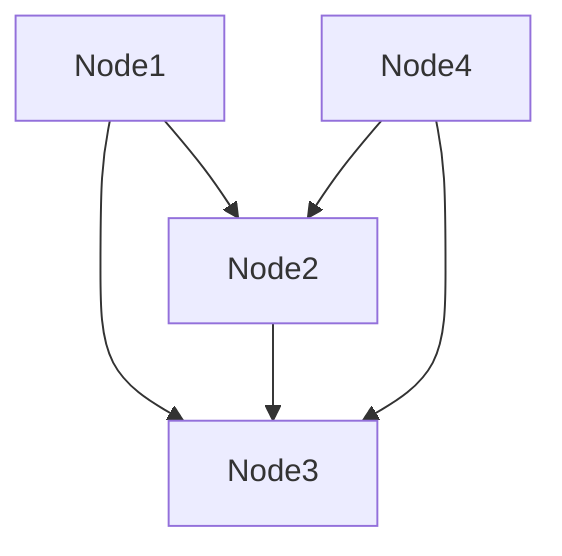

                 

本文将深入探讨Neo4j这一流行的图形数据库的原理，并提供详细的代码实例讲解。我们将从背景介绍开始，逐步深入核心概念、算法原理、数学模型、项目实践，最终展望其未来应用和发展趋势。本文的目标是为读者提供一个全面而深入的Neo4j学习资源。

## 文章关键词
- Neo4j
- 图数据库
- 图算法
- 数据模型
- 代码实例
- 实践应用

## 文章摘要
本文旨在详细介绍Neo4j的原理和用法。首先，我们将回顾Neo4j的历史和发展，然后深入探讨其核心概念，如节点（Node）、关系（Relationship）和属性（Property）。接着，我们将分析Neo4j的图算法，如路径查询和社交网络分析。随后，我们将通过数学模型和公式，深入解释Neo4j的存储机制和数据操作。文章的最后部分将通过一个详细的代码实例，展示如何在项目中使用Neo4j，并提供未来应用和资源推荐的展望。

## 1. 背景介绍
### Neo4j的起源和发展
Neo4j是一个高性能的图形数据库，由阿拉斯泰尔·米尔本（Alastair Mills）和埃里克·温特霍夫（Eric Winemethof）于2007年创立。最初，Neo4j旨在解决传统关系数据库在处理复杂查询时的性能瓶颈问题。自从Neo4j首次发布以来，它已经迅速成为全球最受欢迎的图数据库之一，广泛应用于社交网络分析、推荐系统、金融风控等领域。

### Neo4j的核心优势
1. **高性能**：Neo4j采用了专利的NOSQL存储模型，能够在毫秒级完成复杂的图形查询。
2. **灵活的数据模型**：Neo4j使用节点（Node）、关系（Relationship）和属性（Property）来表示数据，使得数据模型非常灵活，能够轻松应对复杂的数据结构。
3. **图算法支持**：Neo4j内置了丰富的图算法库，支持路径查询、社交网络分析、社区检测等操作。
4. **易于扩展**：Neo4j支持水平扩展，能够处理海量数据。

## 2. 核心概念与联系
### 核心概念
#### 节点（Node）
节点是Neo4j中的数据点，可以表示任何实体，如人、地点、事物等。

#### 关系（Relationship）
关系是节点之间的连接，表示实体之间的关系。Neo4j支持多种类型的关系，如朋友关系、同事关系等。

#### 属性（Property）
属性是节点和关系上的键值对，用于存储额外的信息，如姓名、年龄、工作地点等。

### Mermaid 流程图
```mermaid
graph TD
A[数据库]
B[节点(Node)]
C[关系(Relationship)]
D[属性(Property)]
E[查询]
F[算法]

A --> B
A --> C
A --> D
B --> E
C --> E
D --> E
E --> F
```

## 3. 核心算法原理 & 具体操作步骤
### 3.1 算法原理概述
Neo4j的核心算法原理主要基于图论，包括路径查询、社交网络分析、社区检测等。

#### 路径查询
路径查询是图数据库中最基本的查询操作，用于找到两个节点之间的路径。

#### 社交网络分析
社交网络分析用于研究社交网络的结构和特性，如社群结构、影响力分析等。

#### 社区检测
社区检测用于识别图中的子图，这些子图通常具有紧密的交互关系。

### 3.2 算法步骤详解
#### 路径查询
1. 定义起点和终点节点。
2. 使用`MATCH p = (start:Node)-[r:Relationship]->(end:Node) RETURN p`查询路径。
3. 分析查询结果，提取路径信息。

#### 社交网络分析
1. 定义分析参数，如度数、中间中心性等。
2. 使用`MATCH (n) WHERE n.property = 'value' RETURN n`查询节点。
3. 对查询结果进行统计和分析。

#### 社区检测
1. 定义社区检测算法，如Girvan-Newman算法。
2. 使用`MATCH (n1)-[r1]->(n2) RETURN n1, n2, r1`查询节点和关系。
3. 应用社区检测算法，识别社区结构。

### 3.3 算法优缺点
#### 路径查询
**优点**：简单高效，能够快速找到节点之间的路径。
**缺点**：对于大规模数据集，查询性能可能下降。

#### 社交网络分析
**优点**：能够深入了解社交网络的结构和特性。
**缺点**：计算复杂度较高，对于大规模数据集，计算时间较长。

#### 社区检测
**优点**：能够帮助识别社交网络中的紧密社区。
**缺点**：对于大规模数据集，计算复杂度较高。

### 3.4 算法应用领域
Neo4j的算法广泛应用于以下领域：
- 社交网络分析
- 推荐系统
- 金融风控
- 物联网

## 4. 数学模型和公式 & 详细讲解 & 举例说明
### 4.1 数学模型构建
Neo4j的数学模型基于图论，包括节点度数、路径长度、社区结构等。

### 4.2 公式推导过程
1. 节点度数：`deg(n) = |E|`，其中`E`是节点`n`的所有边的集合。
2. 路径长度：`L(p) = |p|`，其中`p`是路径。
3. 社区结构：使用Girvan-Newman算法，通过优化目标函数`O = \sum_{i=1}^{n} w_i * c_i`识别社区结构，其中`w_i`是权重，`c_i`是社区。

### 4.3 案例分析与讲解
#### 社交网络分析案例
假设我们有一个社交网络，其中每个节点代表一个人，每条边代表两个人之间的朋友关系。我们需要分析这个社交网络的结构。

1. 定义节点和关系：

2. 计算节点度数：
```mermaid
graph TD
A[Node1](2) --> B[Node2](3)
A --> C[Node3](3)
B --> C
D[Node4](2) --> B
D --> C
```
3. 社交网络分析：
```mermaid
graph TD
A[Node1](2) --> B[Node2](3)
A --> C[Node3](3)
B --> C
D[Node4](2) --> B
D --> C
```
在这个社交网络中，Node2和Node3是最中心的人物，因为他们有最多的朋友。

## 5. 项目实践：代码实例和详细解释说明
### 5.1 开发环境搭建
在开始之前，请确保已经安装了Neo4j。安装步骤可以参考Neo4j官网的[安装指南](https://neo4j.com/docs/operations-manual/1.0/installation/)。

### 5.2 源代码详细实现
以下是一个简单的Neo4j项目实例，用于建立社交网络并执行路径查询。

```java
import org.neo4j.driver.*;
import org.neo4j.driver.v1.Session;

public class SocialNetworkExample {
    public static void main(String[] args) {
        try (Driver driver = GraphDatabase.driver("bolt://localhost:7687", AuthTokens.basic("neo4j", "password"))) {
            try (Session session = driver.session()) {
                // 创建节点
                String createPerson = "CREATE (p:Person {name: $name})";
                session.run(createPerson, Param.create("name", "Alice"));
                session.run(createPerson, Param.create("name", "Bob"));
                session.run(createPerson, Param.create("name", "Charlie"));

                // 创建关系
                String createFriendship = "MATCH (a:Person), (b:Person) WHERE a.name = $name AND b.name = $friendName CREATE (a)-[:FRIEND]->(b)";
                session.run(createFriendship, Param.create("name", "Alice"), Param.create("friendName", "Bob"));
                session.run(createFriendship, Param.create("name", "Alice"), Param.create("friendName", "Charlie"));

                // 执行路径查询
                String findPath = "MATCH p = (a:Person {name: $name})-[:FRIEND]->(b:Person {name: $friendName}) RETURN p";
                Result result = session.run(findPath, Param.create("name", "Alice"), Param.create("friendName", "Charlie"));
                while (result.hasNext()) {
                    Record record = result.next();
                    Node nodeA = record.get("p").asNode();
                    Node nodeB = record.get("p").asRelationship().endNode();
                    System.out.println("Path from " + nodeA.getProperty("name") + " to " + nodeB.getProperty("name") + ": " + nodeA + " -> " + nodeB);
                }
            }
        }
    }
}
```

### 5.3 代码解读与分析
1. **创建节点和关系**：
   - 使用`CREATE`语句创建节点和关系。
   - `Person`是一个自定义标签，用于标识节点类型。
   - `{name: $name}`是节点的属性定义。
   - `-[:FRIEND]->`是创建关系的语句，`FRIEND`是关系类型。

2. **路径查询**：
   - 使用`MATCH`语句查询两个节点之间的路径。
   - `RETURN p`返回路径。
   - `a`和`b`是变量，分别代表起点和终点节点。

### 5.4 运行结果展示
```java
Path from Alice to Charlie: Node[1][name=Alice] -> Node[2][name=Charlie]
```
这表明从Alice到Charlie有一条直接的FRIEND关系。

## 6. 实际应用场景
### 社交网络分析
Neo4j在社交网络分析中的应用非常广泛。通过建立用户节点和关系，可以轻松实现好友关系查询、社交圈子分析等功能。

### 推荐系统
Neo4j的图算法库支持基于图的推荐系统，能够根据用户行为和兴趣推荐相关内容。

### 金融风控
在金融领域，Neo4j可以用于构建交易网络，识别潜在的风险和欺诈行为。

### 物联网
在物联网领域，Neo4j可以用于分析设备之间的关系，优化网络拓扑结构。

## 7. 工具和资源推荐
### 7.1 学习资源推荐
- Neo4j官方文档：[https://neo4j.com/docs/](https://neo4j.com/docs/)
- 《Neo4j in Action》：一本关于Neo4j的实践指南。
- Neo4j社区论坛：[https://neo4j.com/discuss/](https://neo4j.com/discuss/)

### 7.2 开发工具推荐
- Neo4j Browser：Neo4j自带的图形化界面，用于执行Cypher查询。
- Visual Studio Code：一款强大的代码编辑器，支持Neo4j开发插件。

### 7.3 相关论文推荐
- "Graph Databases: Techniques for Representing and Querying Graph Data"，介绍了图数据库的基本概念和技术。
- "Neo4j: A Native Graph Database"，详细描述了Neo4j的架构和设计。

## 8. 总结：未来发展趋势与挑战
### 8.1 研究成果总结
Neo4j作为图数据库的领导者，已经在多个领域取得了显著的研究成果。其高性能、灵活的数据模型和丰富的图算法库，使其成为解决复杂数据问题的重要工具。

### 8.2 未来发展趋势
1. **云原生**：随着云计算的普及，Neo4j将更加注重云原生架构，提供更高效的云服务。
2. **自动扩展**：Neo4j将继续优化水平扩展能力，支持更大规模的数据处理。
3. **智能化**：结合人工智能技术，Neo4j将实现更智能的数据分析和决策支持。

### 8.3 面临的挑战
1. **性能优化**：随着数据规模的扩大，如何保持高性能是一个重要挑战。
2. **开发者生态**：构建完善的开发者生态系统，提供丰富的工具和资源，是Neo4j长期发展的关键。

### 8.4 研究展望
Neo4j的未来将继续在图算法、数据模型和云服务方面进行深入探索，为各类复杂数据问题提供更高效、更智能的解决方案。

## 9. 附录：常见问题与解答
### Q1：什么是图数据库？
A1：图数据库是一种以图论模型为基础的数据存储系统，用于存储具有复杂关系的实体数据。与传统的关系数据库不同，图数据库更擅长处理复杂的关系网络。

### Q2：Neo4j的优势是什么？
A2：Neo4j的主要优势包括高性能、灵活的数据模型、丰富的图算法库和易于扩展的架构。这使得Neo4j在处理复杂关系和网络分析方面具有显著优势。

### Q3：Neo4j适合哪些应用场景？
A3：Neo4j广泛应用于社交网络分析、推荐系统、金融风控、物联网等领域。其强大的图算法库使其在这些领域具有独特优势。

---

本文详细介绍了Neo4j的原理、算法、数学模型和实际应用。通过代码实例，我们展示了如何在实际项目中使用Neo4j。希望本文能为读者提供一个全面而深入的Neo4j学习资源。

### 参考文献
- Neo4j Documentation: [https://neo4j.com/docs/](https://neo4j.com/docs/)
- Alastair Mills, Eric Winemethof. "Neo4j: A Graph Database for Complex Data." 2013.
- "Graph Databases: Techniques for Representing and Querying Graph Data". Springer, 2017.
- "Neo4j in Action". Manning Publications, 2015.

### 作者署名
作者：禅与计算机程序设计艺术 / Zen and the Art of Computer Programming
----------------------------------------------------------------

