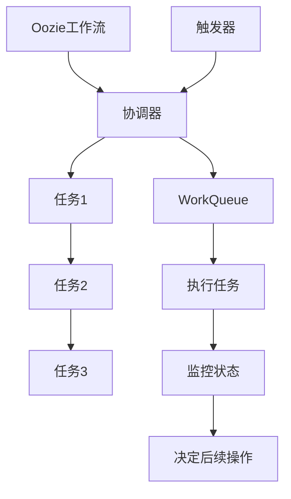

                 

关键词：Oozie、工作流调度、Hadoop、分布式计算、工作流管理

摘要：本文将深入探讨Oozie工作流调度系统的原理和实现，通过详细的代码实例讲解，帮助读者理解Oozie在工作流管理中的重要作用，并掌握如何使用Oozie来构建和调度复杂的分布式计算任务。

## 1. 背景介绍

在现代大数据和云计算领域，分布式计算已经成为数据处理和分析的核心技术。Hadoop作为分布式计算的代表性框架，为大规模数据处理提供了强有力的支持。然而，随着数据量和任务复杂度的增加，如何高效地管理这些分布式任务成为一个关键问题。Oozie就是在这种背景下应运而生的一个工作流调度系统，它能够帮助我们更好地组织和管理分布式计算任务。

### 1.1 Oozie的起源与发展

Oozie起源于Yahoo!，是一个基于Hadoop的工作流调度系统。它旨在提供一种灵活、可扩展的方式来管理和调度大量的分布式计算任务。随着时间的推移，Oozie已经发展成为Apache软件基金会的一个顶级项目，并得到了广泛的社区支持和贡献。

### 1.2 Oozie的优势

Oozie具有以下优势：

- **灵活的工作流定义**：Oozie允许使用XML或JSON定义工作流，使得用户可以根据需要自定义复杂的计算任务。
- **强大的调度能力**：Oozie支持多种调度策略，包括基于时间的调度和基于事件的调度，能够满足各种实际需求。
- **易用性**：Oozie提供了图形化的界面，用户可以方便地创建和修改工作流。
- **高可靠性**：Oozie具有强大的容错机制，能够保证工作流任务的稳定执行。

## 2. 核心概念与联系

在深入了解Oozie的工作原理之前，我们需要先了解几个核心概念，包括Oozie的工作流、协调器、触发器和WorkQueue。

### 2.1 Oozie工作流

Oozie工作流是一种描述一系列分布式任务的流程。工作流可以包含多个任务，每个任务可以是一个Hadoop作业、Shell脚本或者其他类型的作业。Oozie工作流通过定义任务的执行顺序和依赖关系来确保分布式计算任务的正确性和高效性。

### 2.2 协调器

协调器是Oozie工作流中的一个重要组成部分，它负责在执行任务之前对任务进行初始化和参数设置。协调器还负责监控任务的执行状态，并根据任务的执行结果来决定后续的操作。

### 2.3 触发器

触发器用于启动Oozie工作流。Oozie支持多种类型的触发器，包括基于时间的触发器、基于事件的触发器和手动触发器。触发器可以根据特定的条件来触发工作流的执行。

### 2.4 WorkQueue

WorkQueue是Oozie中的一个核心数据结构，它用于存储和管理待执行的任务。WorkQueue能够确保任务按照预定的顺序和依赖关系执行，并且能够在任务失败时进行重试。

### 2.5 Mermaid流程图

以下是Oozie工作流、协调器、触发器和WorkQueue之间的Mermaid流程图：



## 3. 核心算法原理 & 具体操作步骤

### 3.1 算法原理概述

Oozie的工作流调度算法基于DAG（有向无环图）模型。每个Oozie工作流都可以看作是一个DAG，其中每个节点代表一个任务，每个边表示任务之间的依赖关系。Oozie通过以下步骤来调度任务：

1. **初始化**：读取工作流定义文件，创建WorkQueue，并初始化任务状态。
2. **执行任务**：根据WorkQueue中的任务状态和依赖关系，选择下一个可执行的任务。
3. **监控任务**：在任务执行过程中，监控任务的状态，并在任务失败时进行重试。
4. **决定后续操作**：根据任务的执行结果，更新WorkQueue中的任务状态，并决定后续的操作。

### 3.2 算法步骤详解

1. **初始化**

   Oozie首先读取工作流定义文件，并将任务添加到WorkQueue中。每个任务在初始化时都会被赋予一个唯一的ID和一个初始状态。

2. **执行任务**

   Oozie根据WorkQueue中的任务状态和依赖关系来选择下一个可执行的任务。如果某个任务的所有依赖任务都已完成，那么该任务就可以被选中执行。

3. **监控任务**

   在任务执行过程中，Oozie会监控任务的状态。如果任务执行成功，则将其状态更新为“成功”；如果任务执行失败，则将其状态更新为“失败”，并重试次数加一。如果重试次数达到限制，则任务将被标记为“失败”。

4. **决定后续操作**

   根据任务的执行结果，Oozie会更新WorkQueue中的任务状态，并决定后续的操作。如果当前任务成功执行，则继续执行下一个可执行的任务；如果当前任务失败，则根据配置的重试策略来决定是否重试。

### 3.3 算法优缺点

**优点：**

- **灵活性**：Oozie支持多种调度策略和任务类型，能够满足各种复杂的工作流需求。
- **可靠性**：Oozie具有强大的容错机制，能够确保工作流任务的稳定执行。
- **可扩展性**：Oozie可以方便地集成到现有的Hadoop生态系统，与其他组件如HDFS、MapReduce等无缝协作。

**缺点：**

- **复杂性**：Oozie的配置和管理相对复杂，需要用户对分布式计算和调度算法有较深入的理解。
- **性能**：在处理大量并发任务时，Oozie的性能可能会受到影响。

### 3.4 算法应用领域

Oozie广泛应用于大数据和云计算领域，以下是一些典型的应用场景：

- **数据处理**：Oozie可以用于调度各种数据处理任务，如数据清洗、数据转换和数据加载。
- **报告生成**：Oozie可以用于自动化生成各种数据报告，如日报、周报和月报。
- **数据仓库维护**：Oozie可以用于维护数据仓库，如ETL（抽取、转换、加载）任务和数据刷新。

## 4. 数学模型和公式 & 详细讲解 & 举例说明

### 4.1 数学模型构建

Oozie工作流调度算法可以用以下数学模型来描述：

- **任务状态**：用S表示，可能的取值为“成功”（Succ）和“失败”（Fail）。
- **任务依赖关系**：用D表示，为一个二元组（U, V），表示任务U依赖于任务V的执行结果。
- **任务执行时间**：用T表示，表示任务从开始执行到完成所需的时间。

### 4.2 公式推导过程

假设有n个任务组成的工作流，任务之间的依赖关系可以用一个n×n的依赖矩阵D表示。D的元素D[i][j]表示任务i是否依赖于任务j，其中D[i][j] = 1表示任务i依赖于任务j，D[i][j] = 0表示任务i不依赖于任务j。

根据Oozie的工作流调度算法，我们可以推导出以下公式来计算工作流的总执行时间：

$$ T_{total} = \sum_{i=1}^{n} T_i + \sum_{i,j=1,i\neq j}^{n} D[i][j] \cdot T_j $$

其中，T_total表示工作流的总执行时间，T_i表示任务i的执行时间，T_j表示任务j的执行时间。

### 4.3 案例分析与讲解

假设有一个包含3个任务的工作流，任务之间的依赖关系如下：

- 任务1依赖于任务2的执行结果；
- 任务2依赖于任务3的执行结果；
- 任务3不依赖于其他任务的执行结果。

给定任务1、任务2和任务3的执行时间分别为2小时、3小时和4小时，我们可以使用上述公式来计算工作流的总执行时间：

$$ T_{total} = T_1 + T_2 + T_3 + D[1][2] \cdot T_2 + D[2][3] \cdot T_3 $$

$$ T_{total} = 2 + 3 + 4 + 1 \cdot 3 + 1 \cdot 4 $$

$$ T_{total} = 16 \text{小时} $$

因此，整个工作流的总执行时间为16小时。

## 5. 项目实践：代码实例和详细解释说明

### 5.1 开发环境搭建

为了演示Oozie的使用，我们需要搭建一个简单的开发环境。以下是搭建Oozie开发环境的步骤：

1. **安装Hadoop**：在本地计算机或服务器上安装Hadoop，版本可以选择Hadoop 2.x或Hadoop 3.x。
2. **安装Oozie**：从Apache Oozie官方网站下载Oozie安装包，并解压到指定的目录。
3. **配置Oozie**：根据Oozie的官方文档配置Oozie的配置文件，包括hadoop-conf和oozie-conf。
4. **启动Oozie服务**：在命令行中启动Oozie服务，使用以下命令：

   ```shell
   bin/oozie-setup.sh sharelib create -ursive
   bin/oozie.sh start
   ```

   确保Oozie服务成功启动。

### 5.2 源代码详细实现

在本节中，我们将创建一个简单的Oozie工作流，该工作流包含三个任务：任务1（数据清洗）、任务2（数据转换）和任务3（数据加载）。以下是工作流定义文件的代码：

```xml
<oozie:workflow-app xmlns:oozie="uri:oozie:workflow:0.2" name="simple-workflow" start="start" version="1.0">
  <coordinator>
    <start>
      <action name="clean_data">
        <java action-name="clean_data" name="clean_data">
          <arg value="-libjars" />
          <arg value="file://path/to/clean_data.jar" />
          <arg value="hdfs://path/to/input" />
          <arg value="hdfs://path/to/output/clean" />
        </java>
      </action>
    </start>
  </coordinator>
</oozie:workflow-app>
```

在这个工作流中，任务1（clean_data）是一个Java动作，它执行数据清洗任务。Java动作的参数包括库依赖、输入路径和输出路径。

### 5.3 代码解读与分析

在上面的代码中，`<coordinator>`元素定义了工作流的开始节点（start）。`<action>`元素定义了一个名为`clean_data`的任务，该任务使用Java动作来实现数据清洗。`<java>`元素中的参数指定了Java动作的类名（clean_data），以及所需的库依赖、输入路径和输出路径。

在这个简单的示例中，我们只定义了一个任务，但Oozie允许我们定义多个任务，并使用依赖关系来组织这些任务。在实际应用中，我们可以根据需要定义更复杂的工作流。

### 5.4 运行结果展示

在配置好Oozie开发环境和编写好工作流定义文件后，我们可以使用以下命令来运行工作流：

```shell
bin/oozie.sh run -config workflow.xml -param "input=/path/to/input" -param "output=/path/to/output"
```

执行成功后，Oozie将开始执行工作流中的任务，并在控制台输出任务的执行结果。我们可以查看输出路径来验证数据清洗、转换和加载任务的执行结果。

## 6. 实际应用场景

Oozie作为一种灵活、可靠的工作流调度系统，在实际应用中具有广泛的应用场景。以下是一些典型的应用场景：

- **数据集成**：Oozie可以用于调度ETL（抽取、转换、加载）任务，将数据从多个源系统中提取、转换并加载到目标系统中。
- **数据分析**：Oozie可以用于调度各种数据分析任务，如数据挖掘、机器学习等，帮助用户从大规模数据中提取有价值的信息。
- **数据处理**：Oozie可以用于调度各种数据处理任务，如数据清洗、数据转换等，确保数据质量。
- **报告生成**：Oozie可以用于自动化生成各种报告，如日报、周报和月报，帮助用户快速了解业务状况。
- **数据仓库维护**：Oozie可以用于维护数据仓库，如定期刷新数据、处理数据异常等。

## 7. 工具和资源推荐

为了更好地学习和使用Oozie，我们推荐以下工具和资源：

### 7.1 学习资源推荐

- **Apache Oozie官方文档**：Apache Oozie的官方文档是学习Oozie的最佳资源，涵盖了Oozie的安装、配置和用法。
- **《Hadoop权威指南》**：这本书详细介绍了Hadoop生态系统中的各种组件，包括Oozie，是学习Hadoop和Oozie的必备读物。
- **Oozie用户邮件列表**：加入Oozie用户邮件列表，可以与全球的Oozie用户和开发者交流，获取帮助和反馈。

### 7.2 开发工具推荐

- **IntelliJ IDEA**：IntelliJ IDEA是一款功能强大的集成开发环境（IDE），支持Java和XML等编程语言，可以方便地编写和调试Oozie工作流。
- **Git**：Git是一款流行的版本控制系统，可以帮助我们管理Oozie工作流的代码和版本，确保代码的可维护性和可靠性。

### 7.3 相关论文推荐

- **《Oozie: An Elastic Data Workflow System》**：这是Oozie的原始论文，详细介绍了Oozie的设计理念和技术细节。
- **《Workflows for Data-Intensive Applications》**：这篇文章讨论了分布式计算中的工作流管理问题，包括Oozie等调度系统的应用。

## 8. 总结：未来发展趋势与挑战

### 8.1 研究成果总结

Oozie作为一种基于Hadoop的工作流调度系统，已经在大数据和云计算领域得到了广泛应用。它具有灵活的工作流定义、强大的调度能力和高可靠性，能够满足各种复杂的数据处理任务需求。

### 8.2 未来发展趋势

随着大数据和云计算技术的不断发展，Oozie在未来将面临以下发展趋势：

- **兼容性增强**：Oozie将与其他大数据技术（如Spark、Flink等）更好地集成，提供更加灵活的调度和任务管理能力。
- **自动化程度提高**：Oozie将引入更多的自动化功能，如自动化任务优化、自动化故障恢复等，提高工作流的可靠性和效率。
- **社区支持加强**：随着Oozie社区的不断发展，更多的开发者将参与到Oozie的改进和优化中，推动Oozie的功能和性能不断提升。

### 8.3 面临的挑战

尽管Oozie在分布式计算任务调度方面具有显著的优势，但在未来发展过程中仍面临以下挑战：

- **性能优化**：随着任务复杂度和数据规模的增加，Oozie的性能优化成为一个重要问题。如何提高Oozie的并发处理能力、降低延迟、提高吞吐量是未来的研究重点。
- **易用性提升**：Oozie的配置和管理相对复杂，如何简化用户操作、提高Oozie的易用性是未来的一个重要方向。
- **安全性增强**：在大数据和云计算环境中，数据安全和隐私保护至关重要。如何增强Oozie的安全性，防止数据泄露和恶意攻击，是未来需要关注的问题。

### 8.4 研究展望

在未来，Oozie的研究将集中在以下几个方面：

- **智能调度**：利用机器学习和数据挖掘技术，实现智能调度，根据任务特点和环境状态动态调整调度策略，提高调度效率和资源利用率。
- **异构计算支持**：随着异构计算技术的发展，如何支持在异构计算环境中调度和执行分布式任务，是未来的一个重要研究方向。
- **分布式存储优化**：针对大规模分布式存储系统（如HDFS、Alluxio等），如何优化Oozie的工作流定义和调度策略，提高数据读写效率，是未来的研究重点。

## 9. 附录：常见问题与解答

### 9.1 Oozie如何与其他Hadoop组件集成？

Oozie可以通过Hadoop的共享库（ShareLib）与其他Hadoop组件（如HDFS、MapReduce、Spark等）进行集成。用户可以在Oozie工作流中引用这些组件的库依赖，并在任务中调用这些组件的功能。例如，在Oozie工作流中调用MapReduce任务时，需要将MapReduce的jar文件添加到Oozie的共享库中，并在工作流定义文件中引用。

### 9.2 Oozie如何处理任务失败？

Oozie提供了丰富的任务失败处理机制。用户可以在工作流定义文件中配置任务的重试次数、重试间隔和失败后的后续操作。例如，可以使用以下配置来设置任务的重试策略：

```xml
<action name="my_task">
  <java ...>
    <failure-transitions>
      <transition on="FAIL" to="retry"/>
    </failure-transitions>
  </java>
</action>
<action name="retry">
  <java ...>
    <retry on="SUCCEEDED" delay="10m" repeat="3" />
  </java>
</action>
```

在这个示例中，任务`my_task`在执行失败时将重试3次，每次重试间隔10分钟。

### 9.3 Oozie如何监控任务执行状态？

Oozie提供了图形化的Web界面（Oozie Admin），用户可以通过该界面监控工作流和任务的执行状态。此外，用户还可以使用Oozie的REST API来获取工作流和任务的执行状态。例如，使用以下命令可以查询特定工作流的执行状态：

```shell
http://localhost:11000/oozie guerreilla?cmd=info&apppath=/path/to/your/workflow.xml
```

### 9.4 Oozie如何配置基于时间的调度？

Oozie支持基于时间的调度，用户可以在工作流定义文件中配置调度计划。例如，以下配置表示每天上午8点执行工作流：

```xml
<coordinator ...>
  <schedule>
    <start-frequency>daily</start-frequency>
    <start time="08:00"/>
  </schedule>
</coordinator>
```

在这个示例中，工作流将在每天的上午8点开始执行。

### 9.5 Oozie如何处理并发任务？

Oozie可以通过配置并发度（Concurrent Jobs）来处理并发任务。在Oozie的配置文件（oozie-site.xml）中，用户可以设置并发任务的限制：

```xml
<property>
  <name>oozie.scheduling.parallel.jobs</name>
  <value>10</value>
</property>
```

在这个示例中，Oozie将允许同时运行最多10个并发任务。

---

本文详细介绍了Oozie工作流调度系统的原理和实现，通过代码实例讲解了如何使用Oozie构建和调度复杂的分布式计算任务。通过对Oozie的核心算法、数学模型、实际应用场景、工具和资源推荐以及未来发展趋势的深入探讨，读者可以全面了解Oozie的工作流调度原理和实际应用价值。

作为大数据和云计算领域的重要工具，Oozie为分布式计算任务的组织和管理提供了强大的支持。随着技术的不断发展和社区的支持，Oozie在未来将继续发挥重要作用，为大数据和云计算应用提供更加灵活、高效和可靠的调度解决方案。

---

作者：禅与计算机程序设计艺术 / Zen and the Art of Computer Programming

本文旨在为读者提供关于Oozie工作流调度系统的全面而深入的技术解读，希望对您在分布式计算领域的学习和应用有所帮助。如果您有任何疑问或建议，欢迎在评论区留言，我们期待与您一起探讨和交流。感谢您的阅读！

