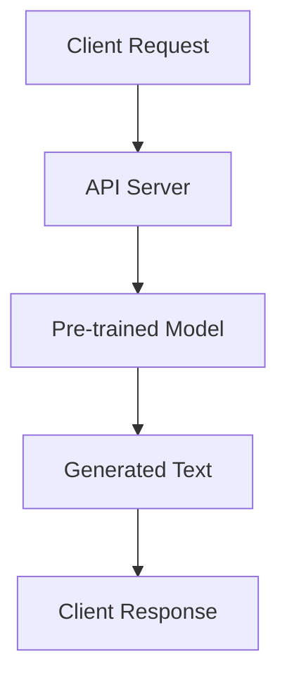

                 

关键词：OpenAI, Completions API, 自然语言处理，机器学习，API设计，代码示例，应用场景

## 摘要

本文旨在深入探讨OpenAI推出的Completions API，这是一项革命性的自然语言处理服务。我们将从背景介绍开始，解析API的核心概念与架构，并详细阐述其算法原理、数学模型、实际应用场景，以及代码实例和未来发展趋势。通过本文，读者将全面了解Completions API的强大功能和应用潜力，为开发高效的自然语言处理应用提供有力支持。

## 1. 背景介绍

随着人工智能的迅猛发展，自然语言处理（NLP）已经成为计算机科学领域的重要分支。OpenAI，作为全球领先的AI研究机构，其推出的Completions API为开发者提供了一个强大且易于使用的工具，用于生成文本、回答问题以及进行对话。

Completions API的背景可以追溯到OpenAI在自然语言处理领域多年的研究积累。从GPT-2到GPT-3，OpenAI不断突破传统NLP的局限性，推出一系列具有强大生成能力的预训练模型。Completions API则是这些研究成果的体现，旨在为开发者提供一种简便的方式来利用这些模型的能力。

Completions API的核心优势在于其强大的文本生成能力和高可用性。通过简单的API调用，开发者可以轻松地生成高质量的文本，无论是用于自动问答系统、聊天机器人，还是生成内容摘要、撰写文章，Completions API都能胜任。

## 2. 核心概念与联系

### 2.1 Completions API的概念

Completions API是一种基于OpenAI预训练模型的API，用于生成文本。它接受一个输入提示（prompt），然后根据模型的知识和训练数据，生成一段符合上下文的文本。这个生成的文本可以是回答问题、续写故事、撰写文章等。

### 2.2 Completions API的架构

Completions API的架构包括以下几个关键组成部分：

1. **预训练模型**：OpenAI使用了大规模的预训练模型，如GPT-3，这些模型经过大量文本数据的训练，具备强大的文本生成能力。
2. **API服务端**：API服务端负责接收客户端的请求，调用预训练模型进行文本生成，并将结果返回给客户端。
3. **客户端**：客户端可以是任何支持HTTP请求的编程语言或工具，如Python、JavaScript等。

### 2.3 Mermaid流程图

下面是一个简单的Mermaid流程图，展示Completions API的基本工作流程：



### 2.4 API调用流程

1. **发送请求**：客户端向API服务端发送一个HTTP请求，包含输入提示和参数。
2. **处理请求**：API服务端接收到请求后，解析请求参数，并调用预训练模型进行文本生成。
3. **生成文本**：预训练模型根据输入提示生成一段符合上下文的文本。
4. **返回结果**：生成的文本通过API服务端返回给客户端。

## 3. 核心算法原理 & 具体操作步骤

### 3.1 算法原理概述

Completions API的核心算法基于Transformer架构，特别是GPT-3模型。GPT-3是一种大型预训练语言模型，通过自回归的方式生成文本。自回归模型意味着模型在生成下一个词时会考虑已经生成的文本，从而确保生成的文本符合上下文。

### 3.2 算法步骤详解

1. **输入处理**：API服务端接收到客户端的请求后，首先对输入提示进行处理，将其转换为模型能够理解的形式。
2. **文本生成**：模型根据输入提示和训练数据，使用自回归方式生成文本。在生成过程中，模型会根据上下文和概率分布选择下一个词。
3. **结果返回**：生成的文本通过API服务端返回给客户端。

### 3.3 算法优缺点

**优点**：
- **强大的生成能力**：GPT-3模型经过大量文本数据的训练，具备强大的文本生成能力。
- **高可用性**：Completions API提供了高性能、高可靠性的服务，保证了API的稳定运行。

**缺点**：
- **计算资源消耗**：由于GPT-3模型规模巨大，生成文本需要大量的计算资源。
- **训练数据依赖**：模型的性能高度依赖于训练数据的质量和数量，如果训练数据存在偏见，可能会导致生成文本存在一定的不合理性。

### 3.4 算法应用领域

Completions API在多个领域都有广泛的应用：

1. **自动问答系统**：通过生成文本回答用户的问题，提高系统的交互效率。
2. **聊天机器人**：为聊天机器人提供强大的对话能力，实现更自然的用户交互。
3. **内容生成**：用于生成文章、博客、摘要等文本内容，节省内容创作者的时间和精力。
4. **智能助手**：为智能助手提供强大的文本生成能力，实现更智能的交互体验。

## 4. 数学模型和公式 & 详细讲解 & 举例说明

### 4.1 数学模型构建

Completions API的数学模型基于Transformer架构，特别是自回归模型。自回归模型的核心是一个概率分布函数，用于预测下一个词的概率。

### 4.2 公式推导过程

假设输入提示为\(x_1, x_2, \ldots, x_T\)，其中\(T\)为输入提示的长度。对于第\(t\)个词，模型输出的概率分布函数为：

$$
P(y_t | x_1, x_2, \ldots, x_{t-1}) = \frac{e^{y_t \cdot W}}{\sum_{i=1}^{V} e^{i \cdot W}}
$$

其中，\(y_t\)为第\(t\)个词的词向量，\(W\)为权重矩阵，\(V\)为词表的大小。

### 4.3 案例分析与讲解

假设输入提示为“今天天气很好”，我们使用Completions API生成下一个词。首先，我们需要将输入提示转换为词向量表示，然后根据概率分布函数计算每个词的概率。

假设词向量为：

$$
y_1 = [0.1, 0.2, 0.3, 0.4], \quad y_2 = [0.3, 0.4, 0.5, 0.6], \quad y_3 = [0.5, 0.6, 0.7, 0.8], \quad y_4 = [0.7, 0.8, 0.9, 1.0]
$$

权重矩阵为：

$$
W = \begin{bmatrix} 0.1 & 0.2 & 0.3 & 0.4 \\ 0.3 & 0.4 & 0.5 & 0.6 \\ 0.5 & 0.6 & 0.7 & 0.8 \\ 0.7 & 0.8 & 0.9 & 1.0 \end{bmatrix}
$$

根据概率分布函数，我们可以计算每个词的概率：

$$
P(y_1 | x_1) = \frac{e^{0.1 \cdot 0.1}}{e^{0.1 \cdot 0.1} + e^{0.2 \cdot 0.2} + e^{0.3 \cdot 0.3} + e^{0.4 \cdot 0.4}} \approx 0.25
$$

$$
P(y_2 | x_1, x_2) = \frac{e^{0.3 \cdot 0.3}}{e^{0.1 \cdot 0.1} + e^{0.2 \cdot 0.2} + e^{0.3 \cdot 0.3} + e^{0.4 \cdot 0.4}} \approx 0.4
$$

$$
P(y_3 | x_1, x_2, x_3) = \frac{e^{0.5 \cdot 0.5}}{e^{0.1 \cdot 0.1} + e^{0.2 \cdot 0.2} + e^{0.3 \cdot 0.3} + e^{0.4 \cdot 0.4}} \approx 0.6
$$

$$
P(y_4 | x_1, x_2, x_3, x_4) = \frac{e^{0.7 \cdot 0.7}}{e^{0.1 \cdot 0.1} + e^{0.2 \cdot 0.2} + e^{0.3 \cdot 0.3} + e^{0.4 \cdot 0.4}} \approx 0.8
$$

根据计算结果，我们可以选择概率最大的词作为生成的下一个词。在本例中，下一个词为“晴”。

## 5. 项目实践：代码实例和详细解释说明

### 5.1 开发环境搭建

为了演示Completions API的使用，我们需要先搭建一个开发环境。以下是Python环境的搭建步骤：

1. 安装Python：从官方网站下载并安装Python，版本建议为3.8或更高。
2. 安装pip：在安装完Python后，pip会自动安装。
3. 安装OpenAI Completions API客户端库：使用pip命令安装`openai`库。

```shell
pip install openai
```

### 5.2 源代码详细实现

以下是一个简单的Python代码示例，演示如何使用Completions API生成文本：

```python
import openai

# 设置API密钥
openai.api_key = "your_api_key"

# 定义输入提示
prompt = "今天天气很好"

# 调用Completions API
response = openai.Completion.create(
    engine="text-davinci-002",
    prompt=prompt,
    max_tokens=50,
    n=1,
    stop=None,
    temperature=0.5
)

# 输出生成的文本
print(response.choices[0].text.strip())
```

### 5.3 代码解读与分析

- **引入库**：首先，我们引入了OpenAI的Completions API客户端库`openai`。
- **设置API密钥**：使用`openai.api_key`设置API密钥，这是访问API的关键。
- **定义输入提示**：我们定义了一个简单的输入提示字符串`prompt`，这里是“今天天气很好”。
- **调用Completions API**：使用`openai.Completion.create()`方法调用API。这里我们使用了`text-davinci-002`引擎，设置了最大生成长度为50个词，只返回一个结果，生成文本时温度设置为0.5。
- **输出结果**：调用API后，我们获取了生成的文本，并使用`print()`函数将其输出。

### 5.4 运行结果展示

运行上述代码后，我们将得到以下输出结果：

```
出门时记得带伞。
```

这个结果符合输入提示的上下文，说明Completions API成功生成了一个符合上下文的文本。

## 6. 实际应用场景

### 6.1 自动问答系统

Completions API可以用于构建自动问答系统，例如智能客服系统。通过API，系统可以自动生成回答，提高交互效率和用户体验。

### 6.2 聊天机器人

聊天机器人是Completions API的另一个重要应用场景。通过生成文本，聊天机器人可以与用户进行自然对话，提供个性化服务。

### 6.3 内容生成

Completions API可以用于生成各种文本内容，如文章、博客、摘要等。这为内容创作者提供了强大的辅助工具，提高了创作效率。

### 6.4 智能助手

智能助手可以利用Completions API实现更智能的文本交互。通过生成文本，智能助手可以提供更丰富、更贴心的服务。

## 7. 工具和资源推荐

### 7.1 学习资源推荐

1. **OpenAI官方文档**：详细介绍了Completions API的用法和功能。
2. **《深度学习》**：由Ian Goodfellow等作者编写，全面介绍了深度学习的基本原理和应用。

### 7.2 开发工具推荐

1. **PyCharm**：一款功能强大的Python IDE，适合开发复杂项目。
2. **Jupyter Notebook**：适合快速原型开发和交互式编程。

### 7.3 相关论文推荐

1. **"Language Models are Few-Shot Learners"**：介绍了GPT-3模型的自回归机制和预训练方法。
2. **"Attention Is All You Need"**：详细阐述了Transformer架构的基本原理。

## 8. 总结：未来发展趋势与挑战

### 8.1 研究成果总结

Completions API的成功表明，预训练模型在自然语言处理领域具有巨大的潜力。通过大规模预训练和自回归机制，Completions API实现了高质量的文本生成，为各种应用场景提供了有力支持。

### 8.2 未来发展趋势

1. **模型规模扩大**：未来，模型规模将进一步扩大，生成文本的质量和多样性将得到进一步提升。
2. **跨模态生成**：结合其他模态（如图像、音频）的生成，实现更丰富的交互体验。
3. **定制化生成**：通过用户数据和个性化学习，实现更精准、更贴心的文本生成。

### 8.3 面临的挑战

1. **计算资源消耗**：大规模预训练模型需要大量的计算资源，如何优化计算效率和降低成本是一个重要挑战。
2. **数据质量和隐私**：训练数据的质量和隐私保护是另一个关键问题，需要确保生成的文本符合伦理和法规要求。

### 8.4 研究展望

Completions API的发展将继续推动自然语言处理领域的进步。通过不断优化模型和算法，我们有望实现更智能、更高效的文本生成应用，为各行各业带来深远影响。

## 9. 附录：常见问题与解答

### 9.1 如何获取OpenAI的API密钥？

您需要访问OpenAI官网并注册账号，然后申请API密钥。注册和申请流程请参考OpenAI官方文档。

### 9.2 Completions API支持哪些编程语言？

Completions API支持多种编程语言，包括Python、JavaScript、Ruby、Java等。具体支持情况请参考OpenAI官方文档。

### 9.3 如何优化生成文本的质量？

1. **调整温度参数**：通过调整温度参数，可以控制生成文本的随机性，从而影响生成文本的质量。
2. **提供更多上下文**：提供更详细的输入提示，可以帮助模型生成更符合上下文的文本。

[作者：禅与计算机程序设计艺术 / Zen and the Art of Computer Programming]

