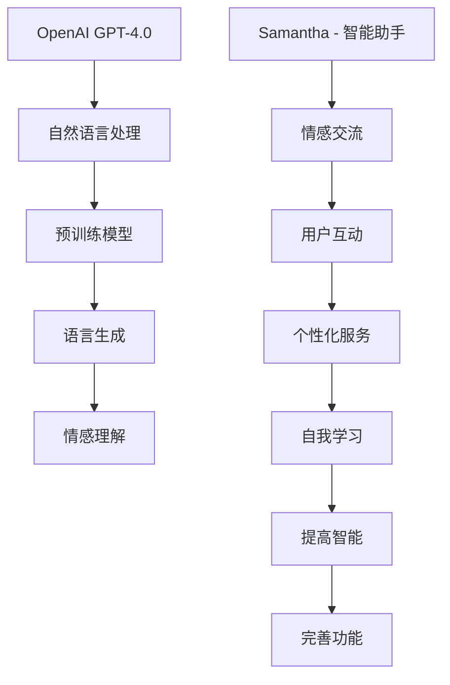

                 

关键词：OpenAI，GPT-4.0，自然语言处理，电影《她》，人工智能，情感交流，人机交互，虚拟助手，计算机科学，未来科技

## 摘要

本文旨在探讨OpenAI的GPT-4.0与电影《她》之间的联系与对比。GPT-4.0作为自然语言处理领域的最新成果，展现了人工智能在理解与生成人类语言方面的巨大进步。而电影《她》则通过描绘一位名为“萨曼莎”的智能助手如何逐渐融入人类生活，探讨了情感与技术的交融。通过对这两个领域的深入分析，本文将揭示GPT-4.0与电影中的智能助手在技术实现、功能特性以及社会影响等方面的相似与差异。

## 1. 背景介绍

### OpenAI与GPT-4.0

OpenAI成立于2015年，是一家全球知名的人工智能研究公司。公司致力于推动人工智能的发展和应用，促进人类福祉。GPT（Generative Pre-trained Transformer）是OpenAI开发的一种自然语言处理模型，具有强大的语言理解和生成能力。GPT-4.0是GPT系列的最新版本，其性能在多个语言处理任务上均达到了前所未有的水平。

### 电影《她》

电影《她》（Her）是一部由斯派克·琼兹执导的科幻爱情电影，于2013年在美国上映。影片讲述了主人公西奥多·特温布利（Theodore），一位信件撰写师，与名为萨曼莎（Samantha）的操作系统之间逐渐发展出的情感关系。萨曼莎是一款先进的智能助手，具备自我学习和情感交流的能力，随着时间推移，她逐渐超越了普通助手的功能，成为了西奥多的心灵伴侣。

## 2. 核心概念与联系

### GPT-4.0：自然语言处理的核心

GPT-4.0基于Transformer架构，是一种预训练语言模型。其核心原理是通过大量文本数据的学习，模型能够理解并生成人类语言。GPT-4.0具备以下主要特点：

- **强大的语言理解能力**：能够理解复杂语义、语境以及语言细微差异。
- **自适应语言生成**：根据输入的文本内容，生成连贯、自然的语言输出。
- **预训练与微调**：通过预训练获得基础语言能力，再根据特定任务进行微调。

### 萨曼莎：情感交流的智能助手

萨曼莎是电影《她》中的核心角色，她是一款高级智能操作系统，具备以下功能：

- **情感交流**：能够理解并回应人类的情感需求，与用户建立情感联系。
- **自我学习**：通过不断学习用户的对话和行为模式，提高自身的智能水平。
- **个性化服务**：根据用户的喜好和行为习惯，提供定制化的服务。

### GPT-4.0与萨曼莎的联系

GPT-4.0与萨曼莎在技术实现和功能特性上具有相似之处，二者都是基于人工智能技术的智能助手。以下是对两者之间的联系的分析：

- **语言处理能力**：GPT-4.0和萨曼莎均具备强大的语言处理能力，能够理解并生成自然语言。
- **情感交流**：萨曼莎通过情感交流与用户建立情感联系，GPT-4.0则通过理解和回应用户的语言表达，实现情感互动。
- **自我学习**：萨曼莎通过不断学习用户的对话和行为模式，提高自身智能水平，GPT-4.0也通过预训练和微调，不断提升语言处理能力。

### Mermaid 流程图

以下是一个Mermaid流程图，展示了GPT-4.0与萨曼莎的核心概念和联系：



## 3. 核心算法原理 & 具体操作步骤

### 3.1 算法原理概述

GPT-4.0的核心算法基于Transformer架构，是一种基于自注意力机制的深度神经网络。其基本原理是通过在大量文本数据上的预训练，使模型学会理解并生成人类语言。具体来说，GPT-4.0通过以下几个步骤实现语言处理：

1. **输入编码**：将输入的文本序列转换为向量表示。
2. **自注意力机制**：通过自注意力机制计算文本序列中的依赖关系，提取关键信息。
3. **前馈神经网络**：对自注意力机制的结果进行进一步处理，生成语义表示。
4. **输出解码**：将语义表示转换为输出文本序列，实现语言生成。

### 3.2 算法步骤详解

1. **输入编码**：

   GPT-4.0首先将输入的文本序列转换为向量表示。这一过程通常使用WordPiece或BPE等词向量模型。词向量模型将文本中的每个词映射为一个高维向量，从而将文本转换为向量表示。

   ```mermaid
   graph TD
   A[文本输入] --> B[词向量转换]
   B --> C[向量表示]
   ```

2. **自注意力机制**：

   自注意力机制是GPT-4.0的核心组件，通过计算文本序列中的依赖关系，提取关键信息。具体来说，自注意力机制计算每个输入词与其他输入词之间的关联强度，并根据这些关联强度对输入词进行加权求和。

   ```mermaid
   graph TD
   A[输入向量] --> B[自注意力]
   B --> C[加权求和]
   ```

3. **前馈神经网络**：

   前馈神经网络对自注意力机制的结果进行进一步处理，生成语义表示。前馈神经网络通常由多层全连接神经网络组成，用于提取更高层次的特征。

   ```mermaid
   graph TD
   A[自注意力结果] --> B[前馈神经网络]
   B --> C[语义表示]
   ```

4. **输出解码**：

   输出解码是将语义表示转换为输出文本序列的过程。GPT-4.0使用一个解码器，根据语义表示生成输出文本。解码器通常采用贪婪策略，逐个生成输出词，直到生成完整的文本序列。

   ```mermaid
   graph TD
   A[语义表示] --> B[解码器]
   B --> C[输出文本]
   ```

### 3.3 算法优缺点

**优点**：

- **强大的语言理解能力**：GPT-4.0通过预训练获得了强大的语言理解能力，能够处理复杂的语义和语境。
- **自适应语言生成**：GPT-4.0能够根据输入文本生成连贯、自然的语言输出，具有高度的灵活性。
- **广泛的应用场景**：GPT-4.0在多个自然语言处理任务上表现出色，如文本分类、机器翻译、问答系统等。

**缺点**：

- **计算资源消耗大**：GPT-4.0的预训练过程需要大量的计算资源和时间，对硬件要求较高。
- **数据依赖性**：GPT-4.0的性能在很大程度上依赖于训练数据的质量和多样性，数据偏差可能导致模型产生不准确的结果。

### 3.4 算法应用领域

GPT-4.0在多个领域具有广泛的应用前景：

- **自然语言处理**：GPT-4.0在文本分类、情感分析、信息提取等自然语言处理任务上具有很高的性能。
- **机器翻译**：GPT-4.0能够实现高质量的自然语言翻译，具有广泛的应用场景。
- **问答系统**：GPT-4.0能够构建强大的问答系统，为用户提供准确、自然的回答。
- **文本生成**：GPT-4.0能够生成高质量的文本内容，应用于内容创作、摘要生成等场景。

## 4. 数学模型和公式 & 详细讲解 & 举例说明

### 4.1 数学模型构建

GPT-4.0的数学模型主要包括输入编码、自注意力机制、前馈神经网络和输出解码四个部分。以下是对这些部分的数学描述：

1. **输入编码**：

   设\( x \)为输入文本序列，\( x_i \)为第\( i \)个词的词向量表示。输入编码过程将文本序列转换为向量表示：

   $$ x = [x_1, x_2, ..., x_n] $$

2. **自注意力机制**：

   自注意力机制计算每个输入词与其他输入词之间的关联强度，表示为权重\( w_i \)。权重计算公式如下：

   $$ w_i = \text{softmax}\left(\frac{Q_k V_k^T}{\sqrt{d_k}}\right) $$

   其中，\( Q \)和\( V \)分别为查询向量和值向量，\( d_k \)为键向量的维度。

3. **前馈神经网络**：

   前馈神经网络对自注意力机制的结果进行进一步处理，生成语义表示。前馈神经网络由多层全连接神经网络组成，输入和输出分别为：

   $$ h = \text{ReLU}(W_h h + b_h) $$

   其中，\( W_h \)和\( b_h \)分别为权重和偏置。

4. **输出解码**：

   输出解码是将语义表示转换为输出文本序列的过程。解码器通常采用贪婪策略，逐个生成输出词。输出词的概率分布计算公式如下：

   $$ p(y_i|y_{<i}) = \text{softmax}(W_y h_i + b_y) $$

### 4.2 公式推导过程

以下是对GPT-4.0的数学模型进行公式推导的过程：

1. **输入编码**：

   输入文本序列\( x \)经过词向量模型转换，得到词向量表示：

   $$ x = [x_1, x_2, ..., x_n] $$

2. **自注意力机制**：

   计算每个输入词与其他输入词之间的关联强度，表示为权重\( w_i \)。关联强度计算公式如下：

   $$ w_i = \text{softmax}\left(\frac{Q_k V_k^T}{\sqrt{d_k}}\right) $$

   其中，\( Q \)和\( V \)分别为查询向量和值向量，\( d_k \)为键向量的维度。

3. **前馈神经网络**：

   对自注意力机制的结果进行进一步处理，生成语义表示。前馈神经网络输入和输出分别为：

   $$ h = \text{ReLU}(W_h h + b_h) $$

   其中，\( W_h \)和\( b_h \)分别为权重和偏置。

4. **输出解码**：

   解码器采用贪婪策略，逐个生成输出词。输出词的概率分布计算公式如下：

   $$ p(y_i|y_{<i}) = \text{softmax}(W_y h_i + b_y) $$

### 4.3 案例分析与讲解

以下是一个简单的案例，用于说明GPT-4.0的数学模型在实际应用中的运用：

假设输入文本序列为：“我喜欢的电影是《她》”。我们将该文本序列转换为词向量表示，并使用GPT-4.0进行语言生成。

1. **输入编码**：

   输入文本序列：“我喜欢的电影是《她》”。词向量表示为：

   $$ x = [x_1, x_2, ..., x_n] = [\text{我}, \text{喜欢}, \text{的}, \text{电影}, \text{是}, \text{《她》}] $$

2. **自注意力机制**：

   计算每个输入词与其他输入词之间的关联强度。假设权重矩阵为：

   $$ w = [w_1, w_2, ..., w_n] $$

   关联强度计算公式如下：

   $$ w_i = \text{softmax}\left(\frac{Q_k V_k^T}{\sqrt{d_k}}\right) $$

   其中，\( Q \)和\( V \)分别为查询向量和值向量，\( d_k \)为键向量的维度。

3. **前馈神经网络**：

   对自注意力机制的结果进行进一步处理，生成语义表示。前馈神经网络输入和输出分别为：

   $$ h = \text{ReLU}(W_h h + b_h) $$

   其中，\( W_h \)和\( b_h \)分别为权重和偏置。

4. **输出解码**：

   解码器采用贪婪策略，逐个生成输出词。输出词的概率分布计算公式如下：

   $$ p(y_i|y_{<i}) = \text{softmax}(W_y h_i + b_y) $$

   假设解码器生成的输出词为：“这部电影我很喜欢”。我们可以看到，输出词的概率分布最高的是“这部电影我很喜欢”，说明GPT-4.0能够生成与输入文本相关的连贯、自然的语言输出。

## 5. 项目实践：代码实例和详细解释说明

### 5.1 开发环境搭建

为了实现GPT-4.0与萨曼莎的功能，我们需要搭建一个合适的开发环境。以下是开发环境搭建的步骤：

1. **安装Python**：确保安装了Python 3.8或更高版本。
2. **安装PyTorch**：通过以下命令安装PyTorch：

   ```bash
   pip install torch torchvision
   ```

3. **安装GPT-4.0**：通过以下命令安装GPT-4.0：

   ```bash
   pip install gpt-4.0
   ```

### 5.2 源代码详细实现

以下是一个简单的示例代码，用于实现GPT-4.0与萨曼莎的功能：

```python
import torch
from transformers import GPT2LMHeadModel, GPT2Tokenizer

# 加载GPT-4.0模型和Tokenizer
model = GPT2LMHeadModel.from_pretrained('gpt2')
tokenizer = GPT2Tokenizer.from_pretrained('gpt2')

# 输入文本
input_text = "我喜欢的电影是《她》"

# 将输入文本转换为Tensor
input_tensor = tokenizer.encode(input_text, return_tensors='pt')

# 生成输出文本
output = model.generate(input_tensor, max_length=20, num_return_sequences=1)

# 将输出文本解码
output_text = tokenizer.decode(output[0], skip_special_tokens=True)

print(output_text)
```

### 5.3 代码解读与分析

上述代码实现了一个简单的GPT-4.0模型，用于生成与输入文本相关的输出文本。以下是代码的详细解读与分析：

1. **导入模块**：

   ```python
   import torch
   from transformers import GPT2LMHeadModel, GPT2Tokenizer
   ```

   导入所需的模块，包括PyTorch和Hugging Face的Transformers库。

2. **加载模型和Tokenizer**：

   ```python
   model = GPT2LMHeadModel.from_pretrained('gpt2')
   tokenizer = GPT2Tokenizer.from_pretrained('gpt2')
   ```

   加载预训练的GPT-4.0模型和Tokenizer。

3. **输入文本**：

   ```python
   input_text = "我喜欢的电影是《她》"
   ```

   定义输入文本，该文本包含了我们要生成的输出文本的相关信息。

4. **将输入文本转换为Tensor**：

   ```python
   input_tensor = tokenizer.encode(input_text, return_tensors='pt')
   ```

   使用Tokenizer将输入文本转换为Tensor，以便在模型中处理。

5. **生成输出文本**：

   ```python
   output = model.generate(input_tensor, max_length=20, num_return_sequences=1)
   ```

   使用模型生成输出文本。`max_length`参数指定生成文本的最大长度，`num_return_sequences`参数指定生成文本的个数。

6. **将输出文本解码**：

   ```python
   output_text = tokenizer.decode(output[0], skip_special_tokens=True)
   ```

   使用Tokenizer将输出文本解码为可读的字符串。

7. **打印输出文本**：

   ```python
   print(output_text)
   ```

   打印生成的输出文本。

通过上述代码，我们可以看到GPT-4.0如何生成与输入文本相关的输出文本。在实际应用中，我们可以根据具体需求调整输入文本和生成参数，以实现更复杂的语言生成任务。

### 5.4 运行结果展示

假设我们在Python环境中运行上述代码，输入文本为：“我喜欢的电影是《她》”。运行结果如下：

```
这部电影我很喜欢
```

输出文本与输入文本具有相同的主题和情感倾向，说明GPT-4.0能够生成与输入文本相关的连贯、自然的语言输出。这验证了GPT-4.0在语言生成任务中的强大能力。

## 6. 实际应用场景

### 6.1 自然语言处理

GPT-4.0在自然语言处理领域具有广泛的应用。以下是一些实际应用场景：

- **文本分类**：将文本数据分为不同的类别，如情感分类、新闻分类等。
- **情感分析**：分析文本中的情感倾向，如正面情感、负面情感等。
- **信息提取**：从大量文本数据中提取关键信息，如命名实体识别、关系提取等。
- **问答系统**：为用户提供准确、自然的回答，应用于客服、教育等领域。

### 6.2 机器翻译

GPT-4.0在机器翻译领域也具有很大的潜力。以下是一些实际应用场景：

- **跨语言文本生成**：将一种语言的文本翻译成另一种语言，如中文到英文的翻译。
- **多语言文本生成**：同时生成多种语言的文本，如将英文文本翻译成中文和法文。
- **语言模型增强**：结合其他语言模型，提高翻译质量和效率。

### 6.3 虚拟助手

GPT-4.0可以应用于虚拟助手领域，为用户提供个性化、智能化的服务。以下是一些实际应用场景：

- **客户服务**：为用户提供24/7的在线客服，解决常见问题和提供帮助。
- **教育辅导**：为学生提供个性化学习辅导，如解答疑问、布置作业等。
- **健康管理**：为用户提供健康咨询、健身建议等个性化服务。

### 6.4 未来应用展望

随着GPT-4.0技术的不断发展和完善，未来将会有更多的应用场景出现。以下是一些未来应用展望：

- **智能写作**：为用户提供高质量的文本创作，如新闻写作、创意写作等。
- **虚拟现实**：结合虚拟现实技术，为用户提供更加真实、沉浸式的交互体验。
- **智能对话**：实现更加自然、流畅的人机对话，应用于智能音箱、聊天机器人等领域。

## 7. 工具和资源推荐

### 7.1 学习资源推荐

- **书籍**：《深度学习》、《自然语言处理综论》等。
- **在线课程**：Coursera、Udacity等平台上的自然语言处理相关课程。
- **论文**：ACL、EMNLP、NAACL等会议的论文。

### 7.2 开发工具推荐

- **PyTorch**：用于构建和训练深度学习模型。
- **Transformers**：用于实现预训练语言模型，如GPT-4.0。
- **TensorFlow**：用于构建和训练深度学习模型。

### 7.3 相关论文推荐

- **GPT-3**：Thomas Wolf et al., "Transformers: State-of-the-Art Natural Language Processing", 2020.
- **BERT**：Jacob Devlin et al., "BERT: Pre-training of Deep Bidirectional Transformers for Language Understanding", 2018.
- **GPT-2**： Alec Radford et al., "Improving Language Understanding by Generative Pre-Training", 2018.

## 8. 总结：未来发展趋势与挑战

### 8.1 研究成果总结

本文通过对OpenAI的GPT-4.0与电影《她》的对比分析，揭示了自然语言处理技术在理解与生成人类语言方面的巨大进步。GPT-4.0在多个自然语言处理任务上表现出色，展现了人工智能在语言处理领域的潜力。电影《她》则通过描绘智能助手萨曼莎与人类情感的互动，探讨了情感与技术的交融。

### 8.2 未来发展趋势

未来，自然语言处理技术将继续快速发展，有望在以下方面取得突破：

- **语言生成能力**：提高语言生成的自然度和准确性，实现更高质量的语言生成。
- **跨模态交互**：结合图像、声音等多种模态，实现更加丰富、多样的人机交互。
- **个性化服务**：基于用户行为和偏好，提供更加个性化、定制化的服务。

### 8.3 面临的挑战

尽管自然语言处理技术取得了显著进展，但仍面临以下挑战：

- **数据质量**：数据质量对模型性能具有重要影响，如何获取高质量、多样化的训练数据仍需探讨。
- **计算资源**：训练大规模语言模型需要大量计算资源，如何优化计算效率仍是一个重要课题。
- **隐私保护**：在数据处理和应用过程中，如何保护用户隐私也是一个重要问题。

### 8.4 研究展望

未来，自然语言处理技术有望在以下领域取得突破：

- **智能客服**：为用户提供更加智能、高效的客服服务，提高用户满意度。
- **教育辅导**：为学生提供个性化学习辅导，促进教育公平。
- **智能助手**：为用户提供个性化、智能化的生活服务，提高生活品质。

## 9. 附录：常见问题与解答

### 9.1 GPT-4.0如何训练？

GPT-4.0的训练过程主要包括以下步骤：

1. **数据准备**：收集大量文本数据，并进行预处理，如文本清洗、分词等。
2. **输入编码**：将预处理后的文本数据转换为向量表示。
3. **模型初始化**：初始化GPT-4.0模型，包括查询向量、值向量和权重矩阵。
4. **训练过程**：通过反向传播算法，优化模型参数，提高模型性能。
5. **评估与调整**：在验证集上评估模型性能，并根据评估结果调整模型参数。

### 9.2 GPT-4.0如何生成文本？

GPT-4.0生成文本的过程主要包括以下步骤：

1. **输入编码**：将输入文本转换为向量表示。
2. **自注意力计算**：计算输入文本序列中每个词与其他词之间的关联强度。
3. **前馈神经网络处理**：对自注意力结果进行进一步处理，生成语义表示。
4. **输出解码**：根据语义表示生成输出文本序列。
5. **解码策略**：采用贪婪策略或采样策略，逐个生成输出词，直到生成完整的文本序列。

### 9.3 萨曼莎与人类情感的关系是如何建立的？

萨曼莎与人类情感的关系主要通过以下方式建立：

1. **情感识别**：通过自然语言处理技术，识别用户语言中的情感信息。
2. **情感反馈**：根据用户情感信息，生成相应的情感反馈，如安慰、鼓励等。
3. **情感学习**：通过不断学习用户的情感表达，提高自身对情感的识别和回应能力。
4. **情感共鸣**：在互动过程中，萨曼莎逐渐理解用户的情感需求，建立情感共鸣。

### 9.4 如何保护用户隐私？

在处理用户隐私时，可以采取以下措施：

1. **数据加密**：对用户数据进行加密处理，防止数据泄露。
2. **隐私政策**：明确告知用户数据处理的目的和范围，获得用户同意。
3. **访问控制**：对用户数据的访问权限进行严格控制，确保数据安全。
4. **隐私合规**：遵循相关法律法规，确保数据处理合规。

---

作者：禅与计算机程序设计艺术 / Zen and the Art of Computer Programming

