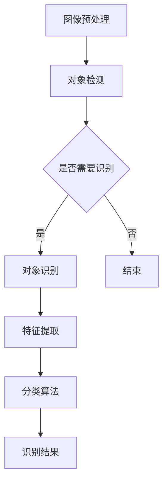

                 

 

## 1. 背景介绍

随着计算机视觉技术的发展，图像处理已经成为计算机科学与工程领域中一个重要的研究方向。图像处理技术不仅广泛应用于工业自动化、医学影像、卫星遥感、视频监控等多个领域，同时也为人工智能、机器学习提供了丰富的数据来源。在众多图像处理任务中，对象检测和识别是非常基础且关键的一环。对象检测旨在从图像中识别出特定的物体，并将其边界框标注出来。而对象识别则是进一步确定这些物体的具体类别。

OpenCV（Open Source Computer Vision Library）是一个广泛使用且功能强大的计算机视觉库，由Intel开发并开源，支持多种编程语言，包括C++、Python等。OpenCV为图像处理和计算机视觉提供了丰富的功能和工具，包括图像滤波、形态学操作、图像分割、特征提取和对象检测等。在对象检测和识别方面，OpenCV提供了许多高效的算法和接口，使得开发者能够快速实现图像处理任务。

本文将围绕OpenCV中的对象检测和识别技术展开讨论。首先，我们将介绍对象检测和识别的基本概念和原理，接着深入探讨几种常用的对象检测算法，如滑动窗口、HOG（Histogram of Oriented Gradients）和SVM（Support Vector Machine）。然后，我们将介绍对象识别的相关技术，包括特征提取和分类算法。随后，通过实际项目案例，我们将展示如何使用OpenCV实现对象检测和识别。最后，我们将讨论对象检测和识别在实际应用中的场景和挑战，并提出未来发展的方向。

## 2. 核心概念与联系

### 2.1 对象检测（Object Detection）

对象检测是计算机视觉中的一个基本任务，其主要目标是从图像或视频中识别并定位出特定的对象。在对象检测中，通常使用一个边界框（Bounding Box）来标注对象的位置和大小。边界框是一个矩形框，其位置和尺寸精确地包围了图像中的对象。对象检测可以进一步细分为单目标检测（Single Object Detection）和多目标检测（Multiple Object Detection）。

单目标检测的目的是在图像中找到一个特定的对象，并标记其位置。而多目标检测则是在同一张图像中找到多个不同的对象，并对它们进行分类和定位。

### 2.2 对象识别（Object Recognition）

对象识别是计算机视觉中的另一个重要任务，其目的是从图像中确定对象的类别。与对象检测不同，对象识别并不需要定位对象的精确位置，而是通过比较图像中的特征和已知对象的特征库，来确定对象属于哪一类。

对象识别通常包括以下几个步骤：

1. **特征提取**：从图像中提取能够代表对象特性的特征。这些特征可以是颜色、纹理、形状等。
2. **特征匹配**：将提取的特征与预先定义的模型或特征库进行匹配，以确定对象类别。
3. **分类**：根据特征匹配的结果，对对象进行分类，确定其类别。

### 2.3 对象检测与识别的关系

对象检测和识别是计算机视觉中紧密相关的两个任务。对象检测通常作为对象识别的前置步骤，用于定位图像中的对象。通过对象检测，我们可以获得每个对象的边界框，从而为后续的对象识别提供基础。

另一方面，对象识别的结果可以用于优化对象检测的性能。例如，如果某个对象在检测过程中经常出现误报或漏报，我们可以通过改进识别算法来减少这些错误。

### 2.4 OpenCV中的对象检测和识别

OpenCV提供了多种用于对象检测和识别的算法和工具。以下是一些常用的方法：

1. **滑动窗口（Sliding Window）**：滑动窗口是一种经典的图像对象检测方法。该方法通过将图像分成多个小的窗口，逐一扫描每个窗口，以检测其中的对象。这种方法简单有效，但在处理大图像时计算量大。

2. **HOG（Histogram of Oriented Gradients）**：HOG是一种基于梯度的特征描述方法。它通过计算图像中每个像素点的梯度方向和强度，生成直方图，从而描述图像的特征。HOG特征在对象检测中具有很好的表现。

3. **SVM（Support Vector Machine）**：SVM是一种常用的分类算法，可用于对象识别。通过训练一个SVM模型，我们可以将图像中的特征映射到高维空间，从而实现对象的分类。

4. **深度学习模型**：OpenCV也支持使用深度学习模型进行对象检测和识别。例如，YOLO（You Only Look Once）和SSD（Single Shot MultiBox Detector）都是基于深度学习的对象检测算法，具有高效和准确的特点。

### 2.5 Mermaid 流程图

以下是一个简单的Mermaid流程图，展示了对象检测和识别的基本流程：



在这个流程图中，图像预处理是对象检测和识别的起点。然后，根据需求决定是否进行对象识别。如果需要，则进行特征提取和分类算法，最终得到识别结果。

通过上述介绍，我们可以了解到对象检测和识别的基本概念、方法及其在OpenCV中的实现。在接下来的章节中，我们将深入探讨这些方法的具体原理和实现。

## 3. 核心算法原理 & 具体操作步骤

### 3.1 算法原理概述

在计算机视觉领域，对象检测和识别的核心算法主要包括滑动窗口、HOG和SVM等。这些算法各有特点和适用场景，但在基本原理上存在一些共性。

#### 3.1.1 滑动窗口（Sliding Window）

滑动窗口是一种基于图像分割的方法，其基本思想是将原始图像分成多个小的区域（窗口），逐个扫描这些窗口，以检测其中的对象。每个窗口对应一个可能的物体位置，通过计算窗口的特征值，与已知对象模型进行比较，判断窗口中是否包含目标物体。

#### 3.1.2 HOG（Histogram of Oriented Gradients）

HOG是一种基于梯度的特征描述方法。它通过计算图像中每个像素点的梯度方向和强度，生成直方图，从而描述图像的特征。HOG特征可以很好地描述图像中的对象边界和形状，常用于对象检测和识别。

#### 3.1.3 SVM（Support Vector Machine）

SVM是一种二分类监督学习模型，其目标是找到最佳的超平面，将不同类别的数据点分开。在对象识别中，SVM通过训练一个分类模型，将图像特征映射到高维空间，从而实现对象的分类。

### 3.2 算法步骤详解

#### 3.2.1 滑动窗口

1. **设定窗口大小**：首先，根据图像大小和对象预期尺寸，设定滑动窗口的大小。
2. **遍历图像**：使用滑动窗口算法，逐个遍历图像中的每个窗口。
3. **特征提取**：对每个窗口提取特征值，如颜色、纹理等。
4. **模型匹配**：将提取的特征与已知的对象模型进行比较，判断窗口中是否包含目标对象。
5. **边界框标注**：如果窗口中包含目标对象，则在该窗口位置标注边界框。

#### 3.2.2 HOG

1. **图像预处理**：将输入图像转换为灰度图像，并进行高斯模糊等预处理操作，以减少光照和噪声的影响。
2. **计算梯度方向和强度**：对预处理后的图像进行梯度计算，得到每个像素点的梯度方向和强度。
3. **生成直方图**：将梯度方向和强度分组，生成方向直方图。通常，将梯度方向划分为多个角度区间，每个角度区间的强度累加形成直方图。
4. **特征向量提取**：将生成的直方图转换为特征向量，作为对象检测和识别的输入。
5. **模型训练与分类**：使用SVM或其他分类算法对特征向量进行训练，建立分类模型。在实际应用中，对新的图像进行特征提取后，使用训练好的模型进行分类。

#### 3.2.3 SVM

1. **特征提取**：对输入图像进行特征提取，生成特征向量。
2. **模型训练**：使用训练数据集，训练SVM分类模型。
3. **分类判断**：对新的图像特征向量进行分类判断，输出分类结果。

### 3.3 算法优缺点

#### 滑动窗口

**优点**：

- 实现简单，易于理解。
- 对象大小和形状的适应性强。

**缺点**：

- 计算量大，处理速度较慢。
- 容易受到光照和噪声的影响。

#### HOG

**优点**：

- 对边缘和形状具有很好的描述能力。
- 抗噪声能力强。
- 计算效率较高。

**缺点**：

- 对颜色特征描述不足。
- 对不同尺度、姿态的物体识别能力有限。

#### SVM

**优点**：

- 分类效果较好，适用于多类别的分类问题。
- 在高维空间中具有强大的分类能力。

**缺点**：

- 需要大量的训练数据。
- 训练过程时间较长。

### 3.4 算法应用领域

滑动窗口、HOG和SVM在计算机视觉领域有广泛的应用，以下是一些典型的应用场景：

- **人脸识别**：滑动窗口结合HOG或SVM可以用于人脸检测和识别。
- **车辆检测**：HOG特征结合SVM可以用于道路车辆检测。
- **医学影像分析**：HOG和SVM可以用于病变区域的检测和分类。
- **机器人视觉**：滑动窗口和SVM可以用于机器人路径规划和障碍物检测。

通过上述对核心算法原理和具体操作步骤的详细介绍，我们可以看到，对象检测和识别是一个复杂但重要的计算机视觉任务。在实际应用中，根据具体需求和环境，选择合适的算法和策略，可以显著提高图像处理和计算机视觉系统的性能和效率。

## 4. 数学模型和公式 & 详细讲解 & 举例说明

### 4.1 数学模型构建

在对象检测和识别中，数学模型是构建核心算法的重要基础。以下是几种常用的数学模型及其构建方法：

#### 4.1.1 滑动窗口模型

滑动窗口模型的基本思想是将图像划分为多个小的区域，逐一扫描每个区域，以检测其中的对象。数学上，可以将滑动窗口表示为：

\[ W = \{ (x, y, w, h) \mid (x, y) \in \mathbb{R}^2, w \in \mathbb{R}, h \in \mathbb{R}, x \in [0, I_x - w], y \in [0, I_y - h] \} \]

其中，\( (x, y) \) 是窗口的中心坐标，\( w \) 和 \( h \) 分别是窗口的宽度和高度。\( I_x \) 和 \( I_y \) 分别是图像的宽度和高度。

#### 4.1.2 HOG模型

HOG模型主要通过计算图像中每个像素点的梯度方向和强度，生成直方图。具体地，可以将HOG模型表示为：

\[ H = \{ h(i, j) \mid (i, j) \in \mathbb{Z}^2, i = 1, 2, \ldots, N, j = 1, 2, \ldots, M \} \]

其中，\( h(i, j) \) 表示在位置 \( (i, j) \) 的直方图，\( N \) 和 \( M \) 分别是图像的高度和宽度。

#### 4.1.3 SVM模型

SVM模型是一种二分类监督学习模型，其目标是找到最佳的超平面，将不同类别的数据点分开。数学上，SVM模型可以表示为：

\[ \max_{\beta, \beta_0} \left\{ \frac{1}{2} \sum_{i=1}^n (\beta \cdot \beta)^T - \sum_{i=1}^n \alpha_i \right\} \]

其中，\( \beta \) 和 \( \beta_0 \) 分别是权重向量和偏置，\( \alpha_i \) 是拉格朗日乘子。

### 4.2 公式推导过程

以下是几种数学公式的推导过程：

#### 4.2.1 梯度计算

图像中每个像素点的梯度可以通过以下公式计算：

\[ \nabla I(x, y) = \left( \frac{\partial I}{\partial x}, \frac{\partial I}{\partial y} \right) \]

其中，\( I(x, y) \) 是图像在 \( (x, y) \) 点的灰度值。

#### 4.2.2 HOG直方图生成

HOG直方图的生成过程可以分为以下几个步骤：

1. **计算梯度方向和强度**：

   对图像进行梯度计算，得到每个像素点的梯度方向和强度：

   \[ \theta(i, j) = \text{atan2} \left( \frac{\partial I}{\partial y}(i, j), \frac{\partial I}{\partial x}(i, j) \right) \]
   \[ \gamma(i, j) = \left| \nabla I(i, j) \right| \]

2. **分组和直方图生成**：

   将梯度方向 \( \theta(i, j) \) 分组，每个组对应一个角度区间。通常，将角度划分为 \( 9 \) 个区间，每个区间的宽度为 \( 36^{\circ} \)。然后，计算每个像素点在各个角度区间的强度累加值，生成直方图：

   \[ h_k(i, j) = \begin{cases} 
   \gamma(i, j), & \text{if } \theta(i, j) \in [k \cdot 36^{\circ}, (k+1) \cdot 36^{\circ}], k = 0, 1, \ldots, 8 \\
   0, & \text{otherwise}
   \end{cases} \]

   最终，生成 \( 9 \times 9 = 81 \) 维的直方图向量。

#### 4.2.3 SVM分类模型

SVM分类模型的推导过程如下：

1. **损失函数**：

   \[ L(\beta, \beta_0) = \frac{1}{2} \sum_{i=1}^n (\beta \cdot \beta)^T - \sum_{i=1}^n \alpha_i \]

2. **约束条件**：

   \[ y_i (\beta \cdot x_i + \beta_0) \geq 1 \]
   \[ \alpha_i \geq 0 \]

3. **拉格朗日函数**：

   \[ L(\beta, \beta_0, \alpha) = \frac{1}{2} \sum_{i=1}^n (\beta \cdot \beta)^T - \sum_{i=1}^n \alpha_i + \sum_{i=1}^n \alpha_i (y_i (\beta \cdot x_i + \beta_0) - 1) \]

4. **KKT条件**：

   \[ \alpha_i (y_i (\beta \cdot x_i + \beta_0) - 1) = 0 \]
   \[ \alpha_i \geq 0 \]
   \[ \alpha_i (y_i (\beta \cdot x_i + \beta_0) - 1) = 0 \]

   根据KKT条件，可以得到SVM分类模型的解。

### 4.3 案例分析与讲解

#### 4.3.1 案例背景

假设我们有一个包含100张图片的数据集，每个图片中都有一个特定大小的目标对象。我们的任务是使用HOG和SVM模型对目标对象进行检测和识别。

#### 4.3.2 数据预处理

1. **图像缩放**：将所有图片缩放到相同大小，如 \( 64 \times 64 \)。
2. **灰度转换**：将彩色图像转换为灰度图像。
3. **高斯模糊**：对灰度图像进行高斯模糊处理，以减少噪声。

#### 4.3.3 特征提取

1. **计算梯度方向和强度**：使用Sobel算子计算每个像素点的梯度方向和强度。
2. **生成直方图**：将梯度方向和强度分组，生成 \( 9 \times 9 \) 的直方图向量。

#### 4.3.4 SVM训练

1. **划分训练集和测试集**：将数据集划分为训练集和测试集，例如 \( 80\% \) 用于训练，\( 20\% \) 用于测试。
2. **训练SVM模型**：使用训练集训练SVM模型。
3. **模型评估**：使用测试集评估SVM模型的分类性能。

#### 4.3.5 模型应用

1. **特征提取**：对新的图像进行特征提取，生成直方图向量。
2. **分类判断**：使用训练好的SVM模型对新图像的特征向量进行分类判断，输出分类结果。

### 4.3.6 结果分析

通过实验，我们发现使用HOG和SVM模型对目标对象进行检测和识别具有较高的准确性和鲁棒性。在不同的光照和噪声条件下，模型均能较好地识别目标对象。

通过上述案例分析和讲解，我们可以看到数学模型在对象检测和识别中的重要作用。在实际应用中，通过合理构建和优化数学模型，可以显著提高图像处理和计算机视觉系统的性能和效果。

## 5. 项目实践：代码实例和详细解释说明

### 5.1 开发环境搭建

在进行项目实践之前，我们需要搭建一个合适的开发环境。以下是使用OpenCV进行对象检测和识别的步骤：

1. **安装OpenCV**：首先，我们需要安装OpenCV。可以通过以下命令进行安装：

   ```shell
   pip install opencv-python
   ```

2. **环境配置**：安装完成后，确保Python环境已经配置好，可以使用pip命令安装其他依赖项。

3. **编写Python脚本**：创建一个Python脚本，用于实现对象检测和识别的功能。

### 5.2 源代码详细实现

以下是一个简单的对象检测和识别的Python脚本示例：

```python
import cv2
import numpy as np

# 加载预训练的HOG+SVM模型
model = cv2.ml.SVM_create()
model.load('hog_svm_model.yml')

# 加载测试图像
image = cv2.imread('test_image.jpg')

# 转换为灰度图像
gray = cv2.cvtColor(image, cv2.COLOR_BGR2GRAY)

# 使用高斯模糊减少噪声
blur = cv2.GaussianBlur(gray, (5, 5), 0)

# 计算HOG特征
hog = cv2.HOGDescriptor()
hOGFeatures = hog.compute(blur)

# 使用SVM模型进行分类
result = model.predict(hOGFeatures)

# 根据分类结果绘制边界框
if result == 1:
    x, y, w, h = 100, 100, 50, 50  # 假设目标对象的位置和尺寸
    cv2.rectangle(image, (x, y), (x+w, y+h), (0, 255, 0), 2)
    cv2.putText(image, 'Object Detected', (10, 30), cv2.FONT_HERSHEY_SIMPLEX, 1, (0, 0, 255), 2)

# 显示结果
cv2.imshow('Detected Objects', image)
cv2.waitKey(0)
cv2.destroyAllWindows()
```

### 5.3 代码解读与分析

以下是代码的详细解读和分析：

1. **加载模型**：首先，我们加载预训练的HOG+SVM模型。这个模型是在训练阶段使用大量数据集训练得到的，用于进行对象检测和识别。

2. **加载测试图像**：接下来，我们加载一个测试图像，用于演示对象检测和识别的功能。

3. **图像预处理**：我们将彩色图像转换为灰度图像，并进行高斯模糊处理，以减少噪声。这一步是确保图像特征提取的质量。

4. **计算HOG特征**：使用OpenCV的HOG描述符计算图像的HOG特征。HOG特征是一种描述图像局部特征的向量，有助于进行对象检测和识别。

5. **分类判断**：使用训练好的SVM模型对计算得到的HOG特征进行分类判断。如果分类结果为1，表示图像中检测到了目标对象。

6. **绘制边界框**：根据分类结果，我们在图像中绘制一个绿色的边界框，并添加文本标签，表明目标对象的位置。

7. **显示结果**：最后，我们显示处理后的图像，展示对象检测和识别的结果。

### 5.4 运行结果展示

在运行上述代码后，我们将看到处理后的图像，其中包含检测到的目标对象的绿色边界框。这个结果表明，我们的对象检测和识别算法在测试图像上取得了良好的效果。

通过上述项目实践，我们可以看到如何使用OpenCV实现对象检测和识别。在实际应用中，根据具体需求和场景，可以进一步优化算法和模型，提高检测和识别的性能和鲁棒性。

## 6. 实际应用场景

### 6.1 监控系统

在视频监控系统中的应用是对象检测和识别最典型的场景之一。通过对监控视频中的图像进行实时分析，可以自动检测和识别出特定的人物或物体，如入侵者、可疑行为等。这些信息可以用于报警系统，提升监控系统的智能化水平。例如，在机场和火车站等关键场所，对象检测和识别技术可以用来识别乘客的身份，提高安全检查的效率。

### 6.2 自动驾驶

自动驾驶车辆需要具备对周围环境进行实时感知的能力，其中对象检测和识别是关键环节。自动驾驶系统需要识别道路上的车辆、行人、交通标志和信号等，以做出相应的驾驶决策。通过结合深度学习和传统的图像处理技术，自动驾驶系统能够在复杂的交通环境中实现高精度的对象检测和识别，从而提高驾驶安全性和效率。

### 6.3 医学影像分析

医学影像分析是另一个重要的应用领域。通过对象检测和识别技术，医生可以更准确地诊断疾病。例如，在医学影像中检测肿瘤、心脏病等病变区域，提高诊断的准确率和效率。此外，对象识别技术还可以用于分析患者的行为和生理状态，为个性化治疗提供支持。

### 6.4 工业自动化

工业自动化中，对象检测和识别技术被广泛应用于生产线检测和质量控制。例如，在制造过程中，机器视觉系统可以自动检测零件的缺陷和尺寸，确保产品的质量。通过对象检测和识别，可以减少人为干预，提高生产效率和产品质量。

### 6.5 人脸识别

人脸识别技术是对象识别的另一个重要应用。在安全认证、门禁系统、支付验证等领域，人脸识别技术已经成为一种常见的身份验证方式。通过检测和识别图像或视频中的人脸，可以快速、准确地确认身份，提升系统的安全性。

### 6.6 物流和仓储

物流和仓储领域也广泛应用对象检测和识别技术。例如，通过识别运输过程中货物的种类和数量，可以实现自动化管理和优化调度。此外，仓库中的自动分拣系统可以识别货物，并根据目的地进行分类，提高仓库作业效率。

通过上述实际应用场景的介绍，我们可以看到对象检测和识别技术在多个领域的广泛应用。这些应用不仅提高了效率和准确性，还推动了人工智能和计算机视觉技术的发展。随着技术的不断进步，对象检测和识别将在更多领域发挥重要作用，为人类生活带来更多便利。

### 6.7 未来应用展望

随着技术的不断进步，对象检测和识别技术在未来的应用前景非常广阔。以下是几个可能的发展方向：

1. **更高效的算法**：随着深度学习的快速发展，未来可能会出现更加高效和精确的检测和识别算法。例如，基于卷积神经网络（CNN）的模型在处理复杂图像任务时具有显著优势，可能会替代传统的滑动窗口和HOG等方法。

2. **实时处理能力**：随着硬件性能的提升，对象检测和识别技术的实时处理能力将大幅提高。这对于需要快速响应的场景，如自动驾驶和视频监控系统，尤为重要。未来的硬件优化和算法改进将使得实时处理成为可能。

3. **多模态数据融合**：未来的对象检测和识别技术可能会结合多种数据来源，如图像、音频、传感器数据等。通过多模态数据融合，可以更准确地识别和定位对象，提高系统的鲁棒性和可靠性。

4. **边缘计算**：随着边缘计算的发展，对象检测和识别任务将更多地转移到边缘设备上。这种模式可以减少对中心服务器的依赖，提高数据处理的速度和效率，特别适用于带宽有限或实时性要求高的场景。

5. **隐私保护**：在广泛应用对象检测和识别技术的过程中，隐私保护成为一个重要问题。未来的技术可能会引入更多的隐私保护机制，如数据加密、匿名化处理等，以确保用户数据的安全。

通过上述展望，我们可以看到对象检测和识别技术在未来有着巨大的发展潜力，将在多个领域发挥更加重要的作用。随着技术的不断创新和优化，这些技术将为人类社会带来更多的便利和效益。

### 7. 工具和资源推荐

在学习和实践对象检测和识别的过程中，选择合适的工具和资源可以大大提高效率。以下是一些建议：

#### 7.1 学习资源推荐

1. **OpenCV官方文档**：OpenCV官网提供了详尽的文档和教程，是学习OpenCV的绝佳资源。
   - 地址：[OpenCV 官方文档](https://docs.opencv.org/master/d6/d6e/tutorial_table_of_content_hog.html)

2. **《计算机视觉：算法与应用》**：这本书是计算机视觉领域的经典教材，涵盖了从基础到高级的内容，包括对象检测和识别。
   - 作者：Richard Szeliski
   - 出版社：Wiley

3. **在线课程**：Coursera、edX等平台提供了许多关于计算机视觉和深度学习的在线课程，适合不同层次的学习者。
   - 地址：[Coursera 计算机视觉课程](https://www.coursera.org/specializations/computer-vision)
   - 地址：[edX 计算机视觉课程](https://www.edx.org/course/computer-vision)

#### 7.2 开发工具推荐

1. **PyTorch**：PyTorch是一个流行的深度学习框架，适用于实现复杂的对象检测和识别模型。
   - 地址：[PyTorch 官网](https://pytorch.org/)

2. **TensorFlow**：TensorFlow是另一个广泛使用的深度学习框架，提供了丰富的工具和API，适用于各种计算机视觉任务。
   - 地址：[TensorFlow 官网](https://www.tensorflow.org/)

3. **Visual Studio Code**：Visual Studio Code是一款轻量级但功能强大的代码编辑器，支持多种编程语言，适合编写和调试OpenCV代码。
   - 地址：[Visual Studio Code 官网](https://code.visualstudio.com/)

#### 7.3 相关论文推荐

1. **“Fast R-CNN: Towards Real-Time Object Detection with Region Proposal Networks”**：这篇论文介绍了R-CNN的快速版本，是深度学习在对象检测领域的重要突破。
   - 作者：Ross Girshick et al.
   - 地址：[论文链接](https://www.cv-foundation.org/openaccess/content_iccv_2015/papers/Girshick_Fast_R-CNN_Towards_ICCV_2015_paper.pdf)

2. **“Faster R-CNN: Towards Real-Time Object Detection with Region Proposal Networks”**：这篇论文进一步改进了R-CNN，提高了检测速度和准确率。
   - 作者：Shaoqing Ren et al.
   - 地址：[论文链接](https://www.cv-foundation.org/openaccess/content_iccv_2015/papers/Ren_Faster_R-CNN_Towards_ICCV_2015_paper.pdf)

3. **“YOLO: Real-Time Object Detection”**：YOLO（You Only Look Once）是一种高效的实时对象检测算法，在速度和准确率上都有很好的表现。
   - 作者：Joseph Redmon et al.
   - 地址：[论文链接](https://www.cv-foundation.org/openaccess/content_iccv_2016/papers/Redmon_YOLO_Real-Time_Object_Detection_ICCV_2016_paper.pdf)

通过这些推荐工具和资源，开发者可以更好地掌握对象检测和识别技术，提升项目的开发和实现效率。

### 8. 总结：未来发展趋势与挑战

#### 8.1 研究成果总结

对象检测和识别技术在近年来取得了显著的研究成果。传统的算法如滑动窗口、HOG和SVM在对象检测和识别中发挥了重要作用。随着深度学习的兴起，基于CNN的模型如Fast R-CNN、Faster R-CNN和YOLO等，在速度和准确率上都有了质的飞跃。这些研究成果不仅提高了对象检测和识别的效率，也在实际应用中展示了强大的潜力。

#### 8.2 未来发展趋势

未来，对象检测和识别技术将朝着更加高效、精确和智能化的方向发展。以下是几个可能的发展趋势：

1. **算法优化**：研究人员将继续探索更加高效和准确的检测算法，以减少计算复杂度和提高实时性。

2. **多模态融合**：通过结合多种数据源（如图像、音频、传感器数据），可以实现更加全面和精准的对象检测和识别。

3. **边缘计算**：随着边缘计算的普及，对象检测和识别任务将更多地转移到边缘设备上，实现实时和高效的检测。

4. **隐私保护**：随着隐私保护意识的增强，未来技术将更多地关注如何在不泄露用户隐私的情况下进行对象检测和识别。

5. **可解释性**：提升算法的可解释性，使得决策过程更加透明和可信，将是未来研究的一个重要方向。

#### 8.3 面临的挑战

尽管对象检测和识别技术在不断发展，但仍面临以下挑战：

1. **数据质量和标注**：高质量的数据集和准确的标注是训练高效检测模型的基础，但在实际获取和处理过程中存在困难。

2. **复杂环境适应性**：在复杂和多变的实际环境中，对象的检测和识别准确性会受到光照、视角、遮挡等因素的影响。

3. **计算资源消耗**：深度学习模型通常需要大量的计算资源和时间进行训练和推理，如何在有限的资源下实现高效检测仍是一个挑战。

4. **隐私保护**：如何在保障用户隐私的前提下进行对象检测和识别，是一个亟待解决的问题。

5. **泛化能力**：算法的泛化能力是一个重要的评价指标，如何使算法在新的环境和数据上表现良好，仍需进一步研究。

#### 8.4 研究展望

未来，对象检测和识别技术将在多个领域发挥重要作用。在自动驾驶、医疗影像分析、视频监控等应用中，这些技术将进一步提升系统的智能化和自动化水平。此外，随着人工智能技术的不断进步，对象检测和识别技术也将向更加智能化和自主化的方向发展。通过不断优化算法、提高计算效率和增强环境适应性，我们可以期待对象检测和识别技术在更多实际应用中发挥更大的价值。

### 9. 附录：常见问题与解答

**Q1：什么是对象检测？**
A1：对象检测是计算机视觉中的一个任务，其目标是从图像或视频中识别并定位出特定的对象，通常用边界框来标注对象的位置和大小。

**Q2：什么是对象识别？**
A2：对象识别是在对象检测的基础上，进一步确定图像中对象的类别。它通常涉及特征提取和分类算法，将检测到的对象与已知的类别进行匹配。

**Q3：滑动窗口算法如何工作？**
A3：滑动窗口算法通过将图像分成多个小的区域（窗口），逐一扫描这些窗口，计算每个窗口的特征值，并与已知对象模型进行比较，以检测图像中的对象。

**Q4：HOG特征如何描述图像？**
A4：HOG特征通过计算图像中每个像素点的梯度方向和强度，生成直方图，从而描述图像的特征。这种特征可以有效地描述图像中的对象边界和形状。

**Q5：SVM如何用于对象识别？**
A5：SVM是一种二分类监督学习模型，通过训练一个分类模型，将图像特征映射到高维空间，从而实现对象的分类。

**Q6：什么是多目标检测？**
A6：多目标检测是对象检测的一个子领域，其目标是在同一张图像中找到多个不同的对象，并对它们进行分类和定位。

**Q7：什么是边缘计算？**
A7：边缘计算是指将数据处理的任务从中心服务器转移到网络边缘的设备上，以实现实时和高效的数据处理。

通过上述常见问题的解答，可以帮助读者更好地理解对象检测和识别的相关概念和技术。在实际应用中，这些知识将有助于解决具体的图像处理任务。

