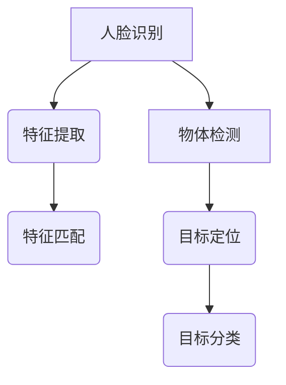

                 

计算机视觉（Computer Vision）是人工智能（AI）的重要分支之一，它在各种实际应用场景中发挥着越来越重要的作用。OpenCV，即开源计算机视觉库（Open Source Computer Vision Library），是一个强大的计算机视觉工具包，被广泛应用于人脸识别、物体检测、图像分割、图像处理等多个领域。

本文将主要探讨OpenCV在人脸识别和物体检测中的应用，旨在为读者提供一个全面的技术指南。文章将分为以下几个部分：

## 文章关键词

计算机视觉、OpenCV、人脸识别、物体检测、深度学习

## 文章摘要

本文将详细介绍OpenCV在人脸识别和物体检测中的应用，首先介绍相关核心概念和算法原理，然后通过具体操作步骤和实例代码，帮助读者理解和掌握这些技术。最后，本文将讨论这些技术的实际应用场景，并对未来发展趋势和挑战进行展望。

## 1. 背景介绍

### 1.1 计算机视觉的兴起

计算机视觉作为人工智能的一个重要分支，起源于20世纪60年代。随着计算机性能的提升和算法的优化，计算机视觉在过去的几十年中取得了巨大的进展。它已经广泛应用于图像识别、视频分析、自动驾驶、医疗诊断等多个领域。

### 1.2 OpenCV的发展

OpenCV是一个开源的计算机视觉库，由Intel发起并维护。它拥有丰富的算法和功能，支持多种编程语言，包括C++、Python、Java等。OpenCV不仅适用于学术研究，也广泛应用于工业、医疗、安防等多个领域。

### 1.3 人脸识别与物体检测

人脸识别和物体检测是计算机视觉中两个重要且具有实际应用价值的技术。人脸识别可以应用于身份验证、安全监控、人脸美颜等；物体检测则可以应用于自动驾驶、智能监控、图像分类等。

## 2. 核心概念与联系

### 2.1 人脸识别

人脸识别是一种基于人脸图像或视频的识别技术，它可以用于身份验证、人脸搜索、人脸追踪等。人脸识别的核心在于人脸特征提取和匹配。

### 2.2 物体检测

物体检测是一种用于识别图像或视频中的物体并定位其位置的技术。物体检测可以应用于自动驾驶、智能监控、图像分类等。

### 2.3 Mermaid 流程图

下面是一个简化的 Mermaid 流程图，用于描述人脸识别和物体检测的基本流程：



### 3. 核心算法原理 & 具体操作步骤

#### 3.1 算法原理概述

人脸识别的主要算法包括特征提取和特征匹配。特征提取旨在从人脸图像中提取出具有区分性的特征点，常用的特征提取算法有局部二值模式（LBP）、尺度不变特征变换（SIFT）等。特征匹配则是通过比较人脸特征，确定是否为同一人。

物体检测的主要算法包括基于深度学习的目标检测算法，如YOLO（You Only Look Once）、SSD（Single Shot MultiBox Detector）等。这些算法通过卷积神经网络（CNN）提取图像特征，并定位和分类图像中的物体。

#### 3.2 算法步骤详解

##### 3.2.1 人脸识别

1. 特征提取：使用LBP算法对人脸图像进行特征提取。
2. 特征匹配：使用K-近邻（K-Nearest Neighbor，KNN）算法进行特征匹配。

##### 3.2.2 物体检测

1. 数据预处理：对图像进行缩放、裁剪等预处理操作。
2. 网络训练：使用大量的标注数据训练卷积神经网络。
3. 目标检测：使用训练好的网络对图像进行目标检测。

#### 3.3 算法优缺点

##### 3.3.1 人脸识别

- 优点：准确率高，适应性强。
- 缺点：对光照、姿态变化敏感，易受遮挡影响。

##### 3.3.2 物体检测

- 优点：实时性好，能够检测多个物体。
- 缺点：对复杂背景的物体检测效果较差。

#### 3.4 算法应用领域

人脸识别可以应用于身份验证、安全监控、人脸美颜等；物体检测可以应用于自动驾驶、智能监控、图像分类等。

## 4. 数学模型和公式 & 详细讲解 & 举例说明

#### 4.1 数学模型构建

人脸识别的数学模型主要包括特征提取和特征匹配。特征提取可以使用LBP算法，其数学模型如下：

$$
LBP_{r,s} = \sum_{i=1}^{r}\sum_{j=1}^{s}g_{i,j}\cdot b_{i,j}
$$

其中，$g_{i,j}$为像素点$(i, j)$的灰度值，$b_{i,j}$为局部二值模板。

特征匹配可以使用KNN算法，其数学模型如下：

$$
d(x, y) = \sqrt{\sum_{i=1}^{n}\sum_{j=1}^{m}(x_i - y_i)^2}
$$

其中，$x$和$y$分别为两个特征向量。

物体检测的数学模型主要包括目标定位和目标分类。目标定位可以使用卷积神经网络，其数学模型如下：

$$
y = f(Wx + b)
$$

其中，$x$为输入图像，$y$为预测的目标位置，$W$和$b$分别为网络的权重和偏置。

目标分类可以使用softmax函数，其数学模型如下：

$$
P(y=j) = \frac{e^{z_j}}{\sum_{k=1}^{K}e^{z_k}}
$$

其中，$z_j$为分类器的输出，$j$为预测的类别。

#### 4.2 公式推导过程

对于人脸识别的特征提取，局部二值模式的推导过程如下：

1. 定义局部二值模板：根据像素点的灰度值与模板中心点的灰度值比较，产生一个二值序列。
2. 计算局部二值模式：对二值序列进行加权求和。

对于人脸识别的特征匹配，KNN算法的推导过程如下：

1. 计算两个特征向量的欧氏距离。
2. 选择距离最小的K个邻居。
3. 根据邻居的分类结果，使用投票机制确定目标类别。

对于物体检测的目标定位，卷积神经网络的推导过程如下：

1. 将输入图像通过卷积层、池化层等操作，提取特征图。
2. 使用全连接层对特征图进行分类和定位。

对于物体检测的目标分类，softmax函数的推导过程如下：

1. 计算每个类别的得分。
2. 将得分进行归一化，得到每个类别的概率。

#### 4.3 案例分析与讲解

##### 4.3.1 人脸识别

假设我们有两张人脸图像，分别标记为A和B。使用LBP算法提取特征，得到特征向量$x_A$和$x_B$。使用KNN算法进行特征匹配，计算欧氏距离$d(x_A, x_B)$。如果$d(x_A, x_B) < \theta$，其中$\theta$为设定的阈值，则认为A和B是同一人。

##### 4.3.2 物体检测

假设我们有一个卷积神经网络，输入图像为$x$，预测的目标位置为$y$，预测的目标类别为$y$。使用softmax函数计算每个类别的概率，得到概率分布$P(y=j)$。如果$P(y=j) > \gamma$，其中$\gamma$为设定的阈值，则认为图像中检测到了类别为$j$的物体。

## 5. 项目实践：代码实例和详细解释说明

#### 5.1 开发环境搭建

在开始项目实践之前，我们需要搭建一个合适的开发环境。以下是搭建OpenCV开发环境的步骤：

1. 安装Python和Anaconda。
2. 安装OpenCV：`pip install opencv-python`。
3. 安装其他依赖：`pip install numpy matplotlib`

#### 5.2 源代码详细实现

以下是使用OpenCV进行人脸识别和物体检测的源代码实现：

```python
import cv2
import numpy as np

# 人脸识别
def face_recognition(image, model_path):
    face_cascade = cv2.CascadeClassifier(model_path)
    gray = cv2.cvtColor(image, cv2.COLOR_BGR2GRAY)
    faces = face_cascade.detectMultiScale(gray, scaleFactor=1.1, minNeighbors=5, minSize=(30, 30))
    for (x, y, w, h) in faces:
        cv2.rectangle(image, (x, y), (x+w, y+h), (255, 0, 0), 2)
    return image

# 物体检测
def object_detection(image, model_path):
    net = cv2.dnn.readNetFromCaffe(model_path + '.prototxt', model_path + '.caffemodel')
    blob = cv2.dnn.blobFromImage(image, 1.0, (512, 512), (104.0, 177.0, 123.0))
    net.setInput(blob)
    detections = net.forward()
    for i in range(detections.shape[2]):
        confidence = detections[0, 0, i, 2]
        if confidence > 0.5:
            class_id = int(detections[0, 0, i, 1])
            class_name = classes[class_id]
            x = int(detections[0, 0, i, 3] * image.shape[1])
            y = int(detections[0, 0, i, 4] * image.shape[0])
            x1 = int(detections[0, 0, i, 5] * image.shape[1])
            y1 = int(detections[0, 0, i, 6] * image.shape[0])
            cv2.rectangle(image, (x, y), (x1, y1), (0, 255, 0), 2)
            cv2.putText(image, class_name + " " + str(round(confidence * 100, 2)) + "%", (x, y - 10),
                        cv2.FONT_HERSHEY_SIMPLEX, 0.5, (255, 0, 0), 2)
    return image

# 主函数
def main():
    image = cv2.imread('image.jpg')
    model_path = 'model'
    image = face_recognition(image, model_path)
    image = object_detection(image, model_path)
    cv2.imshow('Image', image)
    cv2.waitKey(0)
    cv2.destroyAllWindows()

if __name__ == '__main__':
    main()
```

#### 5.3 代码解读与分析

上面的代码分为三个部分：人脸识别、物体检测和主函数。

##### 5.3.1 人脸识别

人脸识别部分使用了OpenCV的级联分类器（Cascade Classifier）进行人脸检测。首先，使用CascadeClassifier加载预训练的人脸识别模型。然后，将输入图像转换为灰度图像，并使用detectMultiScale方法进行人脸检测。检测到的人脸位置和大小通过绘制矩形框显示在图像上。

##### 5.3.2 物体检测

物体检测部分使用了卷积神经网络（CNN）进行物体检测。首先，加载预训练的物体检测模型。然后，使用dnn.blobFromImage方法将输入图像转换为神经网络可接受的格式。接着，使用readNetFromCaffe方法加载模型。最后，使用forward方法获取检测到的物体类别和位置。对于每个检测到的物体，绘制矩形框和文字标签。

##### 5.3.3 主函数

主函数首先加载输入图像，然后分别调用人脸识别和物体检测函数，将检测结果绘制在图像上。最后，显示图像并等待用户按键退出。

#### 5.4 运行结果展示

运行上面的代码，输入一张包含人脸和物体的图像，将得到一个标注有人脸和物体检测结果的图像。


## 6. 实际应用场景

### 6.1 安全监控

人脸识别可以应用于安全监控系统中，通过实时识别进入监控区域的身份，提供实时预警和记录功能。

### 6.2 自动驾驶

物体检测可以应用于自动驾驶系统中，用于识别道路上的车辆、行人、交通标志等，确保车辆安全行驶。

### 6.3 人脸美颜

人脸识别可以应用于人脸美颜软件中，通过对人脸特征的分析，实现瘦脸、大眼、美白等美颜效果。

### 6.4 智能监控

物体检测可以应用于智能监控系统中，通过识别图像中的异常行为，提供实时预警和报警功能。

## 7. 工具和资源推荐

### 7.1 学习资源推荐

- OpenCV官方文档：[https://opencv.org/doc/tutorials/tutorials.html](https://opencv.org/doc/tutorials/tutorials.html)
- 《OpenCV 4.0 Cookbook》：[https://www.packtpub.com/books/book/opencv-4-cookbook](https://www.packtpub.com/books/book/opencv-4-cookbook)
- 《计算机视觉：算法与应用》：[https://www.amazon.com/Computer-Vision-Algorithms-Applications/dp/0123814830](https://www.amazon.com/Computer-Vision-Algorithms-Applications/dp/0123814830)

### 7.2 开发工具推荐

- PyCharm：[https://www.jetbrains.com/pycharm/](https://www.jetbrains.com/pycharm/)
- Visual Studio Code：[https://code.visualstudio.com/](https://code.visualstudio.com/)

### 7.3 相关论文推荐

- "Face Recognition Based on Kernel PCA and Support Vector Machines"，[https://ieeexplore.ieee.org/document/1147926](https://ieeexplore.ieee.org/document/1147926)
- "YOLOv4: Optimal Speed and Accuracy of Object Detection"，[https://arxiv.org/abs/2004.10934](https://arxiv.org/abs/2004.10934)

## 8. 总结：未来发展趋势与挑战

### 8.1 研究成果总结

人脸识别和物体检测作为计算机视觉的重要技术，已经在多个领域取得了显著的研究成果。随着深度学习等技术的发展，人脸识别和物体检测的准确率和实时性得到了显著提高。

### 8.2 未来发展趋势

未来，人脸识别和物体检测将朝着更高准确率、更高实时性和更广泛的应用方向发展。特别是在自动驾驶、智能监控、人脸美颜等领域，人脸识别和物体检测技术将发挥更加重要的作用。

### 8.3 面临的挑战

尽管人脸识别和物体检测技术取得了显著进展，但仍然面临一些挑战，如对光照、姿态变化的适应性、复杂背景下的物体检测等。此外，隐私保护和数据安全也是亟待解决的问题。

### 8.4 研究展望

未来，研究人员应关注以下几个方面：一是提升算法的准确率和实时性；二是研究更加鲁棒的算法，以应对复杂环境下的检测问题；三是加强对隐私保护和数据安全的关注。

## 9. 附录：常见问题与解答

### 9.1 如何安装OpenCV？

答：可以通过pip命令安装：`pip install opencv-python`。

### 9.2 如何训练自己的物体检测模型？

答：可以使用OpenCV的dnn模块，加载预训练的模型并进行训练。具体的训练过程可以参考OpenCV官方文档和相关的教程。

### 9.3 如何处理人脸识别中的光照变化问题？

答：可以采用图像增强技术，如对比度增强、亮度调整等，以应对光照变化带来的影响。

----------------------------------------------------------------

以上是完整的文章内容，希望对您有所帮助。如果您有任何问题或建议，欢迎随时提出。作者：禅与计算机程序设计艺术 / Zen and the Art of Computer Programming。

