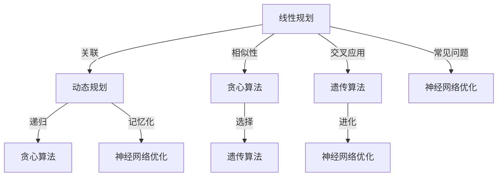

                 

在当今高度复杂和不断变化的技术世界中，优化算法（Optimization Algorithms）发挥着至关重要的作用。从工业生产线的自动化控制到人工智能决策系统的设计，优化算法几乎无处不在，它们帮助我们解决了一系列复杂的问题，从资源分配到问题求解，从数据处理到机器学习。然而，许多工程师和研究人员在面对优化问题时，往往感到无从下手。本文旨在系统地介绍几种核心的优化算法，从理论原理到实际应用，通过代码实战案例，帮助读者深入理解这些算法的工作机制，并掌握如何在实际项目中应用它们。

## 文章关键词
- 优化算法
- 理论原理
- 代码实战
- 问题求解
- 资源分配
- 人工智能

## 文章摘要
本文将首先介绍优化算法的基本概念和重要性，然后深入探讨几种经典的优化算法，包括线性规划、动态规划、贪心算法、遗传算法和神经网络优化。我们将详细讲解每种算法的原理、步骤、优缺点及其应用领域。此外，文章将通过具体的代码实例，对算法进行实战演示，帮助读者更好地理解和应用这些算法。最后，文章将对优化算法的未来发展趋势和挑战进行展望，并提供相关的学习资源和工具推荐。

### 背景介绍

优化算法是一种寻找在给定约束条件下最优解的计算方法。这些算法广泛应用于许多领域，如工业制造、交通运输、经济管理、生物信息学等。优化算法的核心目标是在众多可能的解决方案中找到一个最优解，或是一个足够好的近似解。在工业生产中，优化算法可用于优化生产流程，提高生产效率，减少成本。例如，线性规划可以用于制定生产计划，确定最佳的原材料使用量和生产量。在交通运输领域，优化算法可以帮助设计最优的路线规划，提高运输效率。在经济管理领域，优化算法可以用于投资组合优化，风险控制等。

优化算法的重要性在于它们能够帮助我们在复杂问题中找到最优解或近似解，从而提高决策的质量和效率。例如，在人工智能领域中，优化算法是训练神经网络模型的核心技术，通过调整模型的参数来提高预测准确性。在数据分析领域，优化算法可以帮助我们找到数据中的模式，从而进行有效的数据挖掘。

然而，优化算法的应用并非一帆风顺。首先，优化算法需要处理大量数据和复杂的约束条件，这可能导致计算时间过长。其次，不同的问题可能需要不同的优化算法，这增加了算法选择的复杂性。最后，优化算法的结果可能受到初始值的影响，即“局部最优”问题，这使得找到全局最优解变得困难。

本文旨在解决上述问题，通过系统地介绍几种核心的优化算法，从理论原理到实际应用，帮助读者理解这些算法的工作机制，掌握如何在实际项目中应用它们。我们将通过具体的代码实例，演示如何使用这些算法解决实际问题，从而提高读者的实践能力。

### 核心概念与联系

要深入理解优化算法，我们首先需要了解几个核心概念，包括线性规划、动态规划、贪心算法、遗传算法和神经网络优化。这些算法各自具有独特的原理和应用场景，但它们之间也存在一些联系和交叉应用。

#### 线性规划（Linear Programming，LP）

线性规划是一种用于解决在给定线性约束条件下最大化或最小化线性目标函数的问题。线性规划的基本概念包括决策变量、目标函数和约束条件。

**决策变量（Decision Variables）**：决策变量是线性规划中需要确定的变量，它们通常用 \( x_1, x_2, \ldots, x_n \) 表示。

**目标函数（Objective Function）**：目标函数是优化问题的目标，通常表示为最大化或最小化的线性函数，形式为：
\[ \max_{x} c^T x \]
或
\[ \min_{x} c^T x \]
其中，\( c \) 是一个向量，表示各个决策变量的系数。

**约束条件（Constraints）**：约束条件是决策变量需要满足的限制条件，它们通常用线性不等式或等式表示，形式为：
\[ a_1^T x \leq b_1 \]
\[ a_2^T x \leq b_2 \]
\[ \vdots \]
\[ a_m^T x \leq b_m \]
或者
\[ a_1^T x = b_1 \]
\[ a_2^T x = b_2 \]
\[ \vdots \]
\[ a_m^T x = b_m \]

线性规划问题可以通过单纯形法（Simplex Method）、内点法（Interior Point Method）等算法求解。单纯形法是一种迭代算法，通过在可行解的边界上移动，逐步逼近最优解。内点法是一种更高级的算法，可以在较短时间内找到最优解，特别适用于大规模线性规划问题。

#### 动态规划（Dynamic Programming，DP）

动态规划是一种用于解决多阶段决策问题的方法，它通过将问题分解为若干个阶段，递归地求解每个阶段的最优解，从而得到整个问题的最优解。

**状态（State）**：动态规划中的状态是每个阶段需要考虑的信息，通常用 \( s_t \) 表示。

**状态转移方程（State Transition Equation）**：状态转移方程描述了状态之间的转换关系，通常用 \( s_{t+1} = f(s_t, x_t) \) 表示，其中 \( x_t \) 是在当前阶段所做的决策。

**价值函数（Value Function）**：价值函数是每个状态下的最优价值，通常用 \( v(s_t) \) 表示。

动态规划可以通过自底向上（Bottom-Up）或自顶向下（Top-Down）的方式进行求解。自底向上方法从最基本的子问题开始，逐步构建出整个问题的解。自顶向下方法则通过递归地求解子问题，并将中间结果进行存储，以避免重复计算。

动态规划广泛应用于最短路径问题、背包问题、序列对齐等。例如，在背包问题中，动态规划可以通过构建一个二维数组，记录每个子问题的最优解，从而求解整个问题的最优解。

#### 贪心算法（Greedy Algorithm）

贪心算法是一种在每一步选择当前最优解的算法，它通过局部最优决策逐步构建出全局最优解。

**贪婪选择（Greedy Choice）**：在每一步决策中，选择当前最优的方案，不考虑后续的影响。

贪心算法广泛应用于路径规划、资源分配、调度问题等。例如，在背包问题中，贪心算法可以通过每次选择价值最大的物品，逐步构建出一个近似最优解。

#### 遗传算法（Genetic Algorithm，GA）

遗传算法是一种模拟生物进化的搜索算法，通过遗传、变异和交叉等操作，逐步优化问题的解。

**个体（Individual）**：遗传算法中的个体是问题的解，通常用染色体编码。

**适应度函数（Fitness Function）**：适应度函数用于评估个体的适应度，通常与问题的目标函数相关。

遗传算法通过选择、交叉、变异等操作，生成新的个体，逐步优化解的质量。遗传算法广泛应用于函数优化、组合优化、机器学习等领域。

#### 神经网络优化（Neural Network Optimization）

神经网络优化是指通过优化算法调整神经网络模型的参数，以改善模型的性能。常见的神经网络优化算法包括随机梯度下降（SGD）、Adam、RMSprop等。

**损失函数（Loss Function）**：损失函数用于衡量模型预测值与实际值之间的差距，是优化神经网络模型的关键。

神经网络优化广泛应用于图像识别、自然语言处理、推荐系统等。通过优化算法，我们可以调整神经网络的参数，提高模型的预测准确性和泛化能力。

#### Mermaid 流程图

以下是一个简化的 Mermaid 流程图，展示了优化算法之间的联系：



通过这个流程图，我们可以更直观地理解各种优化算法之间的联系和区别。接下来，我们将详细探讨每种优化算法的原理和操作步骤。

### 核心算法原理 & 具体操作步骤

#### 3.1 算法原理概述

在这一部分，我们将详细探讨线性规划、动态规划、贪心算法、遗传算法和神经网络优化的原理，解释它们如何工作，以及它们在优化问题中的应用。

**线性规划（Linear Programming，LP）**

线性规划是一种用于解决在给定线性约束条件下最大化或最小化线性目标函数的问题。线性规划的核心在于其目标函数和约束条件均为线性函数。线性规划可以通过单纯形法（Simplex Method）或内点法（Interior Point Method）进行求解。

**单纯形法（Simplex Method）**

单纯形法是一种迭代算法，其基本思想是从一个初始可行解开始，通过在可行解的边界上移动，逐步逼近最优解。具体步骤如下：

1. **初始可行解**：选择一个初始可行解，通常是原点。
2. **确定进入变量**：根据目标函数的系数和约束条件，选择一个进入变量，使其最大化（或最小化）目标函数。
3. **确定离开变量**：根据进入变量，通过最小比率测试确定离开变量。
4. **更新可行解**：通过行变换，将可行解从离开变量更新到进入变量。
5. **迭代**：重复步骤2-4，直到无法找到进入变量，此时得到最优解。

**内点法（Interior Point Method）**

内点法是一种更高级的算法，它通过求解一个对偶问题来找到最优解。内点法的主要优点是可以处理大规模线性规划问题，计算时间更短。内点法的具体步骤包括：

1. **初始迭代**：选择一个初始内点解。
2. **求解对偶问题**：通过求解对偶问题，确定新解的方向。
3. **更新内点解**：根据对偶问题的解，更新内点解。
4. **迭代**：重复步骤2-3，直到满足终止条件，如目标函数值不再变化。

**动态规划（Dynamic Programming，DP）**

动态规划是一种用于解决多阶段决策问题的方法，其核心思想是将问题分解为若干个阶段，递归地求解每个阶段的最优解，从而得到整个问题的最优解。动态规划的基本步骤包括：

1. **定义状态**：确定每个阶段的状态。
2. **定义状态转移方程**：描述状态之间的转换关系。
3. **定义价值函数**：定义每个状态的最优价值。
4. **自底向上或自顶向下求解**：根据状态转移方程和价值函数，自底向上或自顶向下求解最优解。

**贪心算法（Greedy Algorithm）**

贪心算法是一种在每一步选择当前最优解的算法，它通过局部最优决策逐步构建出全局最优解。贪心算法的基本步骤如下：

1. **初始状态**：确定初始状态。
2. **选择最优解**：在当前状态下，选择当前最优的决策。
3. **更新状态**：根据选择的决策，更新当前状态。
4. **迭代**：重复步骤2-3，直到达到终止条件，如所有状态都访问过。

**遗传算法（Genetic Algorithm，GA）**

遗传算法是一种模拟生物进化的搜索算法，其核心思想是通过遗传、变异和交叉等操作，逐步优化问题的解。遗传算法的基本步骤包括：

1. **初始化种群**：生成一组初始解，即种群。
2. **适应度评估**：计算每个个体的适应度。
3. **选择**：根据适应度，选择适应度较高的个体进行繁殖。
4. **交叉**：选择两个个体进行交叉操作，生成新的个体。
5. **变异**：对个体进行变异操作，增加种群的多样性。
6. **迭代**：重复步骤3-5，直到满足终止条件，如达到最大迭代次数或找到足够好的解。

**神经网络优化（Neural Network Optimization）**

神经网络优化是指通过优化算法调整神经网络模型的参数，以改善模型的性能。常见的神经网络优化算法包括随机梯度下降（SGD）、Adam、RMSprop等。随机梯度下降的基本步骤如下：

1. **初始化参数**：随机初始化神经网络的权重和偏置。
2. **前向传播**：根据当前参数，计算预测值和损失函数。
3. **后向传播**：计算每个参数的梯度。
4. **更新参数**：根据梯度，更新参数。
5. **迭代**：重复步骤2-4，直到满足终止条件，如损失函数值不再变化或达到最大迭代次数。

#### 3.2 算法步骤详解

**线性规划（Linear Programming，LP）**

1. **定义决策变量、目标函数和约束条件**：确定需要优化的决策变量，以及目标函数和约束条件。
2. **选择求解算法**：根据问题的规模和性质，选择合适的求解算法，如单纯形法或内点法。
3. **初始可行解**：选择一个初始可行解，如原点。
4. **迭代求解**：
   - 确定进入变量：根据目标函数的系数和约束条件，选择一个进入变量。
   - 确定离开变量：通过最小比率测试，确定离开变量。
   - 更新可行解：通过行变换，将可行解从离开变量更新到进入变量。
   - 重复步骤2-3，直到无法找到进入变量，得到最优解。

**动态规划（Dynamic Programming，DP）**

1. **定义状态**：根据问题的性质，确定每个阶段的状态。
2. **定义状态转移方程**：描述状态之间的转换关系。
3. **定义价值函数**：定义每个状态的最优价值。
4. **自底向上或自顶向下求解**：
   - 自底向上求解：从最基本的子问题开始，逐步构建出整个问题的解。
   - 自顶向下求解：通过递归地求解子问题，并将中间结果进行存储，以避免重复计算。

**贪心算法（Greedy Algorithm）**

1. **初始状态**：确定初始状态。
2. **选择最优解**：在当前状态下，选择当前最优的决策。
3. **更新状态**：根据选择的决策，更新当前状态。
4. **迭代**：重复步骤2-3，直到达到终止条件，如所有状态都访问过。

**遗传算法（Genetic Algorithm，GA）**

1. **初始化种群**：生成一组初始解，即种群。
2. **适应度评估**：计算每个个体的适应度。
3. **选择**：根据适应度，选择适应度较高的个体进行繁殖。
4. **交叉**：选择两个个体进行交叉操作，生成新的个体。
5. **变异**：对个体进行变异操作，增加种群的多样性。
6. **迭代**：重复步骤3-5，直到满足终止条件，如达到最大迭代次数或找到足够好的解。

**神经网络优化（Neural Network Optimization）**

1. **初始化参数**：随机初始化神经网络的权重和偏置。
2. **前向传播**：根据当前参数，计算预测值和损失函数。
3. **后向传播**：计算每个参数的梯度。
4. **更新参数**：根据梯度，更新参数。
5. **迭代**：重复步骤2-4，直到满足终止条件，如损失函数值不再变化或达到最大迭代次数。

#### 3.3 算法优缺点

**线性规划（Linear Programming，LP）**

**优点**：

- 线性规划的目标函数和约束条件均为线性函数，易于求解。
- 单纯形法和内点法等算法求解效率较高，适用于大规模问题。

**缺点**：

- 线性规划的约束条件必须是线性的，无法处理非线性问题。
- 在某些情况下，单纯形法可能陷入局部最优。

**动态规划（Dynamic Programming，DP）**

**优点**：

- 动态规划可以将复杂问题分解为多个子问题，递归求解。
- 动态规划可以通过记忆化避免重复计算，提高求解效率。

**缺点**：

- 动态规划的求解过程可能涉及大量计算和存储资源。
- 动态规划的实现相对复杂，需要明确的状态转移方程和价值函数。

**贪心算法（Greedy Algorithm）**

**优点**：

- 贪心算法实现简单，易于理解。
- 贪心算法在许多情况下可以找到近似最优解。

**缺点**：

- 贪心算法无法保证找到全局最优解。
- 贪心算法在处理复杂问题时，可能需要大量的调整和优化。

**遗传算法（Genetic Algorithm，GA）**

**优点**：

- 遗传算法可以处理复杂、非线性、多维度的优化问题。
- 遗传算法具有较强的鲁棒性和全局搜索能力。

**缺点**：

- 遗传算法的计算成本较高，需要大量的计算资源。
- 遗传算法的收敛速度相对较慢。

**神经网络优化（Neural Network Optimization）**

**优点**：

- 神经网络优化可以自动调整模型参数，提高模型性能。
- 神经网络优化可以处理大规模、高维数据。

**缺点**：

- 神经网络优化需要大量的计算资源和时间。
- 神经网络优化对参数初始化敏感，可能陷入局部最优。

#### 3.4 算法应用领域

**线性规划（Linear Programming，LP）**

线性规划广泛应用于工业制造、交通运输、经济管理等领域。例如，在工业制造中，线性规划可以用于制定生产计划，优化原材料的使用和产品的生产量。在交通运输中，线性规划可以用于设计最优的路线规划，提高运输效率。在经济管理中，线性规划可以用于投资组合优化，风险控制等。

**动态规划（Dynamic Programming，DP）**

动态规划广泛应用于最短路径问题、背包问题、序列对齐等领域。例如，在背包问题中，动态规划可以帮助确定每个物品是否放入背包，从而实现价值最大化。在序列对齐中，动态规划可以帮助找到两个序列之间的最佳匹配，从而实现序列比对。

**贪心算法（Greedy Algorithm）**

贪心算法广泛应用于路径规划、资源分配、调度问题等领域。例如，在路径规划中，贪心算法可以用于找到从起点到终点的最优路径。在资源分配中，贪心算法可以用于分配资源，以最大化利用率。在调度问题中，贪心算法可以用于调度任务，以最小化完成时间。

**遗传算法（Genetic Algorithm，GA）**

遗传算法广泛应用于函数优化、组合优化、机器学习等领域。例如，在函数优化中，遗传算法可以帮助找到函数的最优值。在组合优化中，遗传算法可以用于解决旅行商问题、调度问题等。在机器学习中，遗传算法可以用于优化神经网络模型。

**神经网络优化（Neural Network Optimization）**

神经网络优化广泛应用于图像识别、自然语言处理、推荐系统等领域。例如，在图像识别中，神经网络优化可以用于调整模型参数，提高识别准确率。在自然语言处理中，神经网络优化可以用于优化模型，提高文本分类和翻译的准确性。在推荐系统中，神经网络优化可以用于优化推荐算法，提高推荐质量。

### 数学模型和公式 & 详细讲解 & 举例说明

#### 4.1 数学模型构建

优化问题通常可以通过以下数学模型表示：

**目标函数（Objective Function）**：\( \max_{x} f(x) \) 或 \( \min_{x} f(x) \)

**约束条件（Constraints）**：

- 等式约束：\( g(x) = 0 \)
- 不等式约束：\( h(x) \leq 0 \)

其中，\( x \) 是决策变量，\( f(x) \)，\( g(x) \) 和 \( h(x) \) 是函数。

**拉格朗日函数（Lagrange Function）**：用于将等式约束引入目标函数

\[ L(x, \lambda) = f(x) + \lambda g(x) \]

**KKT条件（Kuhn-Tucker Conditions）**：用于求解最优解

- \( \nabla_x L(x, \lambda) = 0 \)
- \( \lambda \geq 0 \)
- \( h(x) \leq 0 \)
- \( \lambda h(x) = 0 \)

#### 4.2 公式推导过程

以下是一个简单的线性规划问题，目标是最小化 \( c^T x \)，约束条件为 \( A x \leq b \)。

**目标函数**：

\[ \min_{x} c^T x \]

**约束条件**：

\[ A x \leq b \]

**拉格朗日函数**：

\[ L(x, \lambda) = c^T x + \lambda^T (b - A x) \]

**KKT条件**：

\[ \nabla_x L(x, \lambda) = c - A^T \lambda = 0 \]
\[ \lambda \geq 0 \]
\[ b - A x \leq 0 \]
\[ \lambda (b - A x) = 0 \]

通过求解上述KKT条件，可以得到最优解 \( x^* \)。

#### 4.3 案例分析与讲解

假设有一个线性规划问题，目标是最小化 \( x_1 + x_2 \)，约束条件为 \( x_1 + x_2 \leq 4 \)，\( x_1 \geq 0 \)，\( x_2 \geq 0 \)。

**目标函数**：

\[ \min_{x} x_1 + x_2 \]

**约束条件**：

\[ x_1 + x_2 \leq 4 \]
\[ x_1 \geq 0 \]
\[ x_2 \geq 0 \]

**拉格朗日函数**：

\[ L(x, \lambda) = x_1 + x_2 + \lambda (4 - x_1 - x_2) \]

**KKT条件**：

\[ 1 - \lambda = 0 \]
\[ \lambda \geq 0 \]
\[ 4 - x_1 - x_2 \leq 0 \]
\[ \lambda (4 - x_1 - x_2) = 0 \]

通过求解上述KKT条件，可以得到最优解 \( x^* = (0, 4) \)。

这个例子展示了如何通过构建数学模型和求解KKT条件，解决一个简单的线性规划问题。在实际应用中，线性规划问题可能更加复杂，需要使用更高级的求解算法，如单纯形法或内点法。

### 项目实践：代码实例和详细解释说明

#### 5.1 开发环境搭建

在本节中，我们将使用 Python 和相关库来演示线性规划和动态规划算法的应用。首先，需要安装以下 Python 库：

- `numpy`：用于数学计算。
- `matplotlib`：用于数据可视化。
- `scipy`：包含线性规划和动态规划算法。

您可以使用以下命令进行安装：

```bash
pip install numpy matplotlib scipy
```

#### 5.2 源代码详细实现

以下是一个简单的线性规划问题的代码实现，目标是最小化 \( x_1 + x_2 \)，约束条件为 \( x_1 + x_2 \leq 4 \)，\( x_1 \geq 0 \)，\( x_2 \geq 0 \)。

```python
import numpy as np
from scipy.optimize import linprog

# 目标函数系数
c = np.array([-1, -1])

# 约束条件系数矩阵和右侧常数向量
A = np.array([[1, 1], [-1, -1]])
b = np.array([4, 0])

# 约束条件上下限
x0 = np.array([0, 0])
x1 = np.array([np.inf, np.inf])

# 求解线性规划问题
result = linprog(c, A_ub=A, b_ub=b, x0=x0, bounds=(x0, x1))

# 输出结果
print("最优解：", result.x)
print("最小值：", -result.fun)
```

以下是一个动态规划问题的代码实现，使用自底向上方法解决最短路径问题。

```python
def shortest_path(graph, start, end):
    # 初始化距离数组
    distances = { (start, start): 0 }
    unvisited = set(graph)

    # 自底向上求解
    while unvisited:
        current = min(unvisited, key=lambda x: distances[x])
        unvisited.remove(current)

        for neighbor, weight in graph[current].items():
            distance = distances[current] + weight
            if (neighbor, neighbor) not in distances or distance < distances[(neighbor, neighbor)]:
                distances[(current, neighbor)] = distance

    return distances[(start, end)]

# 定义图
graph = {
    'A': {'B': 1, 'C': 4},
    'B': {'A': 1, 'C': 2, 'D': 5},
    'C': {'A': 4, 'B': 2, 'D': 1},
    'D': {'B': 5, 'C': 1}
}

# 计算最短路径
start = 'A'
end = 'D'
print("最短路径长度：", shortest_path(graph, start, end))
```

#### 5.3 代码解读与分析

**5.3.1 线性规划代码解读**

在第一个代码示例中，我们使用了 `scipy.optimize.lins

