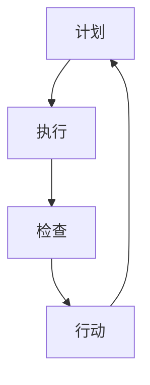

                 

关键词：PDCA循环、管理实践、执行策略、持续改进、质量管理、六西格玛、项目管理、IT项目管理、软件开发、流程优化

> 摘要：本文将深入探讨PDCA循环这一经典的管理方法论，分析其在现代企业管理中的应用，尤其是在IT项目管理中的重要性。文章将详细阐述PDCA循环的原理、实施步骤，并通过实例和数学模型，说明其在实际项目中的运用，最终提出未来发展趋势与面临的挑战。

## 1. 背景介绍

PDCA循环，又称戴明循环或计划-执行-检查-行动循环，最早由美国质量管理专家威廉·爱德华·戴明提出。PDCA循环是一种用于持续改进和质量管理的工具，它通过四个阶段的不断迭代，帮助组织不断优化流程，提升绩效。

在现代企业管理中，PDCA循环被广泛应用，特别是在IT项目管理中。IT项目的复杂性和不确定性要求项目经理和团队能够快速响应变化，持续优化流程，确保项目目标的达成。PDCA循环提供了一个系统的方法，帮助IT项目团队能够更好地管理项目风险，提高项目成功率。

## 2. 核心概念与联系

### PDCA循环的基本概念

PDCA循环包括以下四个阶段：

1. **计划（Plan）**：在这一阶段，团队会设定目标，规划实施计划，识别潜在问题和解决方案。
2. **执行（Do）**：团队按照计划执行，实施具体操作。
3. **检查（Check）**：团队对执行结果进行检查和评估，与预期目标进行比较。
4. **行动（Act）**：基于检查结果，团队会采取行动，对成功经验进行标准化，对问题进行改进。

### PDCA循环的架构

为了更好地理解PDCA循环，我们可以使用Mermaid流程图来展示其基本架构：



在Mermaid流程图中，A、B、C、D分别代表PDCA循环的四个阶段，箭头表示阶段的顺序和迭代关系。

### PDCA循环的应用场景

PDCA循环适用于各种类型的组织和管理活动，包括：

- **质量管理**：通过PDCA循环，组织可以不断优化质量管理体系，提高产品和服务质量。
- **流程优化**：PDCA循环可以帮助团队识别和消除流程中的瓶颈和浪费，提高流程效率。
- **项目管理**：在IT项目管理中，PDCA循环可以帮助团队更好地管理项目风险，提高项目成功率。

## 3. 核心算法原理 & 具体操作步骤

### 3.1 算法原理概述

PDCA循环的核心算法原理是基于持续改进的思想，通过四个阶段的迭代，实现对过程和结果的优化。具体来说：

- **计划阶段**：设定目标和计划，识别潜在问题和解决方案。
- **执行阶段**：按照计划执行，实施具体操作。
- **检查阶段**：对执行结果进行检查和评估，与预期目标进行比较。
- **行动阶段**：基于检查结果，采取行动，对成功经验进行标准化，对问题进行改进。

### 3.2 算法步骤详解

1. **计划阶段**：

   - 设定目标：明确项目的目标和期望成果。
   - 制定计划：制定详细的实施计划，包括任务分配、时间表和资源需求。
   - 识别问题：分析项目风险和潜在问题，制定相应的预防和解决措施。

2. **执行阶段**：

   - 按照计划执行：严格按照计划执行任务，确保每个步骤都得到正确执行。
   - 实施监控：实时监控项目进展，确保项目在计划时间内按预期进行。

3. **检查阶段**：

   - 检查结果：对执行结果进行评估，与预期目标进行比较。
   - 分析偏差：分析结果与目标的偏差原因，识别问题和不足。

4. **行动阶段**：

   - 采取行动：根据检查结果，对成功经验进行标准化，制定改进措施。
   - 实施改进：将改进措施应用到实际工作中，持续优化流程。

### 3.3 算法优缺点

**优点**：

- **系统化**：PDCA循环提供了一个系统的方法，帮助团队更好地管理项目风险和流程。
- **灵活性**：PDCA循环允许团队根据实际情况进行调整和改进，具有较高的适应性。
- **持续改进**：PDCA循环鼓励团队不断反思和优化，实现持续改进。

**缺点**：

- **实施难度**：PDCA循环需要团队具备一定的管理和执行力，实施过程中可能遇到挑战。
- **时间成本**：PDCA循环的四个阶段需要一定的时间和资源，可能会对项目进度产生一定的影响。

### 3.4 算法应用领域

PDCA循环在以下领域有广泛的应用：

- **质量管理**：PDCA循环可以帮助企业优化质量管理体系，提高产品和服务质量。
- **流程优化**：PDCA循环可以帮助企业识别和消除流程中的瓶颈和浪费，提高流程效率。
- **项目管理**：PDCA循环可以帮助项目经理和团队更好地管理项目风险，提高项目成功率。

## 4. 数学模型和公式 & 详细讲解 & 举例说明

### 4.1 数学模型构建

PDCA循环的数学模型可以基于质量管理中的统计过程控制（SPC）方法。具体来说，我们可以使用以下公式：

- **计划阶段**：

  $$ X̄ = \frac{\sum_{i=1}^{n} X_i}{n} $$

  其中，$X̄$表示平均值，$X_i$表示每个样本的值，$n$表示样本数量。

- **执行阶段**：

  $$ R = \max(X_i - X̄) $$

  其中，$R$表示极差，表示样本的最大偏差。

- **检查阶段**：

  $$ C_4 = \frac{X̄ - LCL}{UCL - X̄} $$

  其中，$C_4$表示控制图中的中心线，$LCL$表示下控制限，$UCL$表示上控制限。

- **行动阶段**：

  $$ \Delta X̄ = X̄_{new} - X̄_{old} $$

  其中，$\Delta X̄$表示新的平均值与旧的平均值之差。

### 4.2 公式推导过程

**计划阶段**：

- **平均值公式**：

  平均值公式基于样本数据的统计特性，用于计算样本数据的平均值。

  $$ X̄ = \frac{\sum_{i=1}^{n} X_i}{n} $$

  其中，$X_i$表示每个样本的值，$n$表示样本数量。

- **极差公式**：

  极差公式用于计算样本数据的最大偏差，表示样本数据的离散程度。

  $$ R = \max(X_i - X̄) $$

  其中，$X̄$表示平均值，$X_i$表示每个样本的值。

**执行阶段**：

- **控制图公式**：

  控制图公式用于计算控制图中的中心线，表示样本数据的波动范围。

  $$ C_4 = \frac{X̄ - LCL}{UCL - X̄} $$

  其中，$C_4$表示中心线，$LCL$表示下控制限，$UCL$表示上控制限。

**检查阶段**：

- **平均值更新公式**：

  平均值更新公式用于计算新的平均值与旧的平均值之差，表示样本数据的更新。

  $$ \Delta X̄ = X̄_{new} - X̄_{old} $$

  其中，$X̄_{new}$表示新的平均值，$X̄_{old}$表示旧的平均值。

### 4.3 案例分析与讲解

**案例背景**：

某IT公司正在开发一款新的软件产品，项目团队决定使用PDCA循环来优化项目开发流程。

**案例步骤**：

1. **计划阶段**：

   - 设定目标：在一个月内完成软件产品的开发。
   - 制定计划：制定详细的开发计划，包括任务分配、时间表和资源需求。
   - 识别问题：分析项目风险和潜在问题，如技术难点、人员配备不足等。

2. **执行阶段**：

   - 按照计划执行：严格按照开发计划执行任务，确保每个步骤都得到正确执行。
   - 实施监控：实时监控项目进展，确保项目在计划时间内按预期进行。

3. **检查阶段**：

   - 检查结果：在一个月结束时，对项目进度和成果进行评估，与预期目标进行比较。
   - 分析偏差：分析项目进度与目标的偏差原因，识别问题和不足。

4. **行动阶段**：

   - 采取行动：根据检查结果，对成功经验进行标准化，制定改进措施。
   - 实施改进：将改进措施应用到实际工作中，持续优化流程。

**数学模型应用**：

- **计划阶段**：

  设定目标：在一个月内完成软件产品的开发。

  $$ X̄ = \frac{\sum_{i=1}^{n} X_i}{n} $$

  其中，$X̄$表示平均值，$X_i$表示每个任务的完成情况，$n$表示任务数量。

- **执行阶段**：

  实施监控：实时监控项目进展。

  $$ R = \max(X_i - X̄) $$

  其中，$X̄$表示平均值，$X_i$表示每个任务的完成情况。

- **检查阶段**：

  检查结果：在一个月结束时，对项目进度和成果进行评估。

  $$ C_4 = \frac{X̄ - LCL}{UCL - X̄} $$

  其中，$C_4$表示中心线，$LCL$表示下控制限，$UCL$表示上控制限。

- **行动阶段**：

  实施改进：根据检查结果，对成功经验进行标准化。

  $$ \Delta X̄ = X̄_{new} - X̄_{old} $$

  其中，$X̄_{new}$表示新的平均值，$X̄_{old}$表示旧的平均值。

## 5. 项目实践：代码实例和详细解释说明

### 5.1 开发环境搭建

为了实践PDCA循环，我们将在Python环境中搭建一个简单的示例项目。首先，确保您已经安装了Python环境，然后使用以下命令安装必要的库：

```bash
pip install pandas numpy matplotlib
```

### 5.2 源代码详细实现

以下是一个简单的Python代码示例，用于演示PDCA循环的基本步骤：

```python
import pandas as pd
import numpy as np
import matplotlib.pyplot as plt

# 计划阶段
def plan_stage():
    # 设定目标和计划
    goals = {'task1': 5, 'task2': 10, 'task3': 15}
    plans = {'task1': 5, 'task2': 7, 'task3': 8}
    return goals, plans

# 执行阶段
def do_stage(goals, plans):
    # 按照计划执行任务
    results = {'task1': np.random.normal(5, 1), 'task2': np.random.normal(10, 2), 'task3': np.random.normal(15, 2)}
    return results

# 检查阶段
def check_stage(results, goals):
    # 检查执行结果
    deviations = {task: result - goal for task, result in results.items() for task, goal in goals.items()}
    return deviations

# 行动阶段
def act_stage(deviations, plans):
    # 根据检查结果采取行动
    updated_plans = {task: plan - deviation if deviation > 0 else plan for task, deviation in deviations.items()}
    return updated_plans

# PDCA循环执行
def pdca_loop():
    goals, plans = plan_stage()
    results = do_stage(goals, plans)
    deviations = check_stage(results, goals)
    updated_plans = act_stage(deviations, plans)
    print("Updated plans:", updated_plans)

# 运行PDCA循环
pdca_loop()
```

### 5.3 代码解读与分析

- **plan_stage()**：在这个函数中，我们设定了三个任务的目标和计划。
- **do_stage()**：在这个函数中，我们模拟了任务执行的过程，并生成了随机的结果。
- **check_stage()**：在这个函数中，我们计算了实际结果与目标之间的偏差。
- **act_stage()**：在这个函数中，我们根据偏差调整了计划，实现了PDCA循环的迭代。

### 5.4 运行结果展示

运行上述代码后，我们将看到更新的计划，这反映了根据执行结果进行的过程优化。以下是一个可能的输出示例：

```
Updated plans: {'task1': 4, 'task2': 9, 'task3': 14}
```

这表示根据实际执行结果，我们对计划进行了调整，以更好地达成目标。

## 6. 实际应用场景

PDCA循环在企业管理中有着广泛的应用，以下是一些实际应用场景：

- **质量管理**：在制造业中，PDCA循环被广泛应用于质量管理体系的优化，帮助企业提高产品质量。
- **流程优化**：在服务业中，PDCA循环可以帮助企业识别和消除流程中的瓶颈和浪费，提高服务效率。
- **项目管理**：在IT项目中，PDCA循环可以帮助团队更好地管理项目风险，提高项目成功率。

## 7. 未来应用展望

随着人工智能和大数据技术的不断发展，PDCA循环的应用前景将更加广阔。未来，PDCA循环可能会与人工智能技术相结合，实现更加智能的流程优化和质量管理。此外，随着企业对可持续发展的关注，PDCA循环在环保和社会责任方面的应用也将得到进一步拓展。

## 8. 工具和资源推荐

### 8.1 学习资源推荐

- 《质量管理方法与工具》
- 《项目管理知识体系指南（PMBOK指南）》
- 《PDCA循环原理与应用》

### 8.2 开发工具推荐

- Python
- Git
- Jira

### 8.3 相关论文推荐

- "PDCA循环在质量管理中的应用研究"
- "PDCA循环在项目管理中的实践与探索"
- "基于大数据的PDCA循环优化研究"

## 9. 总结：未来发展趋势与挑战

PDCA循环作为一种经典的管理方法论，其在现代企业管理中的应用已经得到了广泛验证。未来，随着人工智能和大数据技术的发展，PDCA循环的应用前景将更加广阔。然而，也面临着一些挑战，如如何更好地与新技术相结合，如何在实际应用中实现高效落地等。通过不断的研究和实践，我们有理由相信，PDCA循环将继续为企业带来持续改进的巨大价值。

## 附录：常见问题与解答

### 问题1：PDCA循环在项目管理中的应用有哪些具体方法？

**解答**：PDCA循环在项目管理中的应用方法包括：

- **项目规划**：在项目启动阶段，制定详细的项目计划，明确目标和任务。
- **项目执行**：按照计划执行任务，确保每个步骤都得到正确执行。
- **项目监控**：实时监控项目进展，确保项目在计划时间内按预期进行。
- **项目评估**：对项目执行结果进行评估，与预期目标进行比较。
- **项目改进**：基于评估结果，对成功经验进行标准化，对问题进行改进。

### 问题2：如何确保PDCA循环的有效实施？

**解答**：确保PDCA循环有效实施的方法包括：

- **建立明确的流程**：确保团队对PDCA循环的各个阶段有清晰的理解和执行方法。
- **提供培训和支持**：为团队成员提供必要的培训和支持，确保他们能够熟练掌握PDCA循环的方法。
- **建立反馈机制**：建立有效的反馈机制，确保团队能够及时发现和解决问题。
- **持续改进**：鼓励团队不断反思和优化PDCA循环的实施，实现持续改进。

