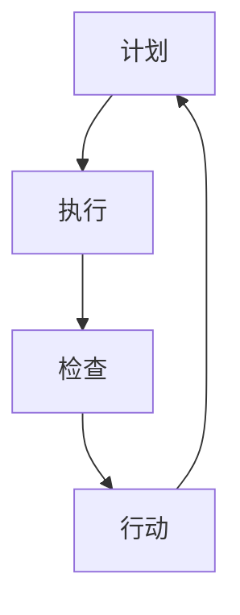

                 

关键词：PDCA循环，质量管理，持续改进，项目管理，过程控制，IT领域实践

摘要：本文将探讨PDCA（计划-执行-检查-行动）循环在IT领域的应用，通过详细解析PDCA循环的四个阶段，为IT从业者提供一套有效的持续改进方法。文章将结合实际案例，阐述PDCA循环如何帮助IT团队提升产品质量、优化项目管理和提高工作效率。

## 1. 背景介绍

在IT行业，随着技术的快速发展，项目管理的复杂性日益增加。如何在保证项目进度和质量的前提下，实现持续改进成为了众多企业和团队面临的重要课题。PDCA循环，作为一种经典的持续改进工具，被广泛应用于各种领域，包括IT行业。它通过计划、执行、检查和行动四个阶段，帮助团队不断优化流程、提高效率。

本文将详细解读PDCA循环在IT领域的应用，通过实例分析，展示如何在实际项目中运用PDCA循环，实现持续改进。

## 2. 核心概念与联系

### 2.1 PDCA循环原理

PDCA循环是质量管理的核心工具，它由四个阶段组成：

1. **计划（Plan）**：确定目标和制定计划，包括资源分配、任务分解和时间规划。
2. **执行（Do）**：执行计划，实施具体操作，收集数据。
3. **检查（Check）**：对执行结果进行评估，检查是否达成目标，分析数据。
4. **行动（Act）**：根据检查结果，采取行动，持续改进。

### 2.2 PDCA循环与IT领域的联系

在IT领域，PDCA循环的应用主要表现在以下几个方面：

- **项目规划**：通过计划阶段，明确项目目标、需求和预期成果。
- **软件开发**：在执行阶段，开发团队按照计划进行编码和测试。
- **质量保证**：通过检查阶段，评估软件的质量，识别潜在问题。
- **持续优化**：在行动阶段，对项目过程和产品质量进行改进。

### 2.3 Mermaid 流程图



## 3. 核心算法原理 & 具体操作步骤

### 3.1 算法原理概述

PDCA循环的核心在于其循环性，每个阶段都是相互联系、相互影响的。通过循环，团队可以不断优化流程、提高质量。

### 3.2 算法步骤详解

1. **计划阶段**：确定项目目标和计划，包括需求分析、资源分配、任务分解和时间规划。
2. **执行阶段**：按照计划进行操作，包括软件开发、测试和部署。
3. **检查阶段**：对执行结果进行评估，包括质量检查、性能测试和用户反馈。
4. **行动阶段**：根据检查结果，采取行动，包括问题修复、流程优化和团队培训。

### 3.3 算法优缺点

**优点**：

- 简单易用，易于理解。
- 强调循环性，持续改进。
- 系统性强，涵盖项目管理的各个阶段。

**缺点**：

- 对团队协作要求较高。
- 检查和行动阶段可能耗时较长。

### 3.4 算法应用领域

PDCA循环在IT领域的应用广泛，包括：

- **软件开发**：用于项目规划和质量保证。
- **运维管理**：用于流程优化和问题解决。
- **项目管理**：用于进度控制和资源分配。

## 4. 数学模型和公式 & 详细讲解 & 举例说明

### 4.1 数学模型构建

PDCA循环可以看作是一个闭环反馈系统，其基本数学模型可以表示为：

\[ \text{输出} = \text{输入} \times \text{过程效率} \]

### 4.2 公式推导过程

\[ \text{过程效率} = \frac{\text{输出}}{\text{输入}} \]

### 4.3 案例分析与讲解

假设一个软件开发团队，其每月交付的软件功能点为1000个，投入的人力资源为10人月。为了提高过程效率，团队决定优化开发流程。

通过PDCA循环，团队首先分析了现有流程，发现了瓶颈和低效环节。在计划阶段，团队制定了优化方案，包括改进代码评审流程、引入自动化测试等。

在执行阶段，团队按照优化方案进行操作，并记录了每个环节的效率提升情况。在检查阶段，团队分析了数据，发现代码评审环节的效率提高了20%，自动化测试覆盖率达到了80%。

在行动阶段，团队根据检查结果，进一步优化了流程，并进行了团队培训。

通过PDCA循环，团队成功提高了过程效率，缩短了项目周期。

## 5. 项目实践：代码实例和详细解释说明

### 5.1 开发环境搭建

为了展示PDCA循环在项目中的应用，我们以一个简单的Web应用程序开发为例。

1. **安装Python开发环境**：在本地电脑上安装Python 3.8版本。
2. **安装Web框架**：使用pip安装Flask框架。
3. **创建项目文件夹**：在终端中执行 `mkdir myproject` 命令，创建项目文件夹。

### 5.2 源代码详细实现

```python
# app.py
from flask import Flask, render_template

app = Flask(__name__)

@app.route('/')
def index():
    return render_template('index.html')

if __name__ == '__main__':
    app.run(debug=True)
```

### 5.3 代码解读与分析

这个简单的Web应用程序由一个Python文件 `app.py` 组成，它使用了Flask框架来实现。

- **Flask**：一个轻量级的Web应用框架，用于创建Web应用程序。
- **@app.route('/')**：定义了应用程序的根路由，当访问应用程序的主页时，会返回一个HTML模板。
- **render_template('index.html')**：渲染名为 `index.html` 的HTML模板。

### 5.4 运行结果展示

在终端中执行 `python app.py` 命令，应用程序将启动并运行在本地服务器上。

在浏览器中访问 `http://127.0.0.1:5000/`，可以看到应用程序的首页。

## 6. 实际应用场景

### 6.1 软件开发

在软件开发过程中，PDCA循环可以帮助团队：

- **确定目标和计划**：明确项目需求和预期成果。
- **执行和检查**：按照计划进行开发，并定期检查代码质量和性能。
- **行动**：根据检查结果，修复问题、优化代码。

### 6.2 运维管理

在运维管理中，PDCA循环可以帮助团队：

- **规划运维流程**：确定运维目标和计划。
- **执行和检查**：执行运维操作，并定期检查系统状态。
- **行动**：根据检查结果，优化运维流程、提升系统稳定性。

### 6.4 未来应用展望

随着技术的不断进步，PDCA循环在IT领域的应用前景广阔。例如：

- **人工智能**：利用PDCA循环优化机器学习模型的训练和部署。
- **云计算**：通过PDCA循环优化云计算资源的使用和管理。

## 7. 工具和资源推荐

### 7.1 学习资源推荐

- 《PDCA循环实践指南》
- 《质量管理：理论与实践》

### 7.2 开发工具推荐

- Python
- Flask

### 7.3 相关论文推荐

- "PDCA循环在软件开发中的应用研究"
- "基于PDCA的运维管理策略研究"

## 8. 总结：未来发展趋势与挑战

### 8.1 研究成果总结

PDCA循环作为一种经典的持续改进工具，在IT领域得到了广泛应用。通过本文的探讨，我们看到了PDCA循环在软件开

