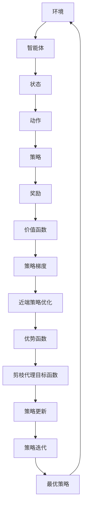

                 

关键词：PPO，强化学习，策略优化，深度学习，参数优化，Proximal，近端，策略迭代，代码实例。

摘要：本文旨在深入探讨Proximal Policy Optimization（PPO）算法在强化学习中的应用，详细解析其原理、数学模型、代码实现以及实际应用场景。通过对PPO算法的全面讲解，读者将掌握策略优化在实际问题中的具体应用，为今后的研究与实践提供理论指导和实践参考。

## 1. 背景介绍

强化学习（Reinforcement Learning，RL）作为机器学习的一个重要分支，主要研究如何通过与环境交互来学习最优策略。在强化学习领域中，策略优化（Policy Optimization）方法是一种常用的策略学习技术，旨在通过优化策略函数来提高智能体的性能。

随着深度学习（Deep Learning）技术的不断发展，深度强化学习（Deep Reinforcement Learning，DRL）逐渐成为一种强大的智能体学习框架。深度强化学习结合了深度神经网络和强化学习技术，能够在复杂的、高维度的问题空间中寻找最优策略。然而，传统的策略优化方法在处理高维问题时会面临梯度消失、梯度爆炸、收敛速度慢等问题，这限制了其应用范围。

为了解决这些问题，研究者们提出了Proximal Policy Optimization（PPO）算法。PPO算法是一种基于策略梯度的优化方法，通过近端策略优化（Proximal Gradient Method）来稳定策略更新过程。与传统的策略优化方法相比，PPO算法具有更强的鲁棒性和更快的收敛速度，因此在许多复杂任务中得到了广泛应用。

本文将首先介绍强化学习的基本概念，然后详细讲解PPO算法的原理和数学模型，最后通过一个具体的应用实例展示PPO算法的实战效果。

## 2. 核心概念与联系

### 2.1 强化学习基本概念

强化学习（Reinforcement Learning，RL）是一种通过与环境互动来学习如何进行决策的机器学习方法。在强化学习中，智能体（Agent）通过选择动作（Action）来与环境（Environment）互动，并从环境中获得奖励（Reward）。智能体的目标是学习一个策略（Policy），使得长期累积奖励最大化。

强化学习可以分为以下几个主要部分：

- **环境（Environment）**：定义智能体所处的状态空间和动作空间，以及状态转移和奖励函数。
- **智能体（Agent）**：通过选择动作来与环境互动，并学习最优策略。
- **状态（State）**：描述智能体当前所处的环境状态。
- **动作（Action）**：智能体可以执行的动作集合。
- **策略（Policy）**：定义了智能体在给定状态下选择动作的概率分布。
- **奖励（Reward）**：描述智能体执行动作后获得的即时奖励，用于引导智能体学习最优策略。
- **价值函数（Value Function）**：用于评估策略的好坏，包括状态值函数（State-Value Function）和动作值函数（Action-Value Function）。

### 2.2 PPO算法原理

PPO（Proximal Policy Optimization）算法是一种基于策略梯度的优化方法，旨在通过近端策略优化（Proximal Gradient Method）来稳定策略更新过程。PPO算法的核心思想是利用近端策略优化来缓解梯度消失和梯度爆炸问题，从而提高策略优化的稳定性和收敛速度。

PPO算法主要包括以下几个关键概念：

- **策略梯度（Policy Gradient）**：策略梯度描述了策略参数的微小调整对策略的期望回报的影响。
- **近端策略优化（Proximal Gradient Method）**：近端策略优化是一种基于梯度下降的方法，通过在目标函数中引入一个近端项来稳定策略更新过程。
- **优势函数（Advantage Function）**：优势函数用于衡量实际回报与期望回报之间的差距，从而指导策略更新。
- ** clipped surrogate objective（剪枝代理目标函数）**：为了防止策略梯度更新过大，PPO算法引入了一个剪枝代理目标函数，用于限制策略更新的范围。

### 2.3 Mermaid 流程图

以下是一个描述PPO算法核心概念的Mermaid流程图：



## 3. 核心算法原理 & 具体操作步骤

### 3.1 算法原理概述

PPO算法是一种基于策略梯度的优化方法，通过近端策略优化来稳定策略更新过程。PPO算法的主要原理包括：

1. **策略梯度计算**：计算策略梯度的方法有多种，如蒙特卡罗估计、重要性采样等。PPO算法使用蒙特卡罗估计来计算策略梯度。
2. **优势函数计算**：优势函数用于衡量实际回报与期望回报之间的差距，指导策略更新。优势函数的定义为：
   $$A(s, a) = R(s, a) + \gamma \sum_{s'} P(s'|s, a) V(s') - V(s)$$
   其中，$R(s, a)$表示执行动作$a$后获得的即时奖励，$V(s)$表示状态值函数，$\gamma$表示折扣因子。
3. **剪枝代理目标函数**：为了防止策略梯度更新过大，PPO算法引入了一个剪枝代理目标函数，其定义为：
   $$J(\theta) = \sum_{t} \pi_{\theta}(a_t|s_t)A(s_t, a_t)$$
   其中，$\pi_{\theta}(a_t|s_t)$表示策略参数$\theta$下的策略概率分布。
4. **近端策略优化**：通过引入近端项，PPO算法使用以下优化目标：
   $$\min_{\theta'} \frac{1}{N} \sum_{t} \left[ \rho(s_t, a_t) \frac{\pi_{\theta'}(a_t|s_t)}{\pi_{\theta}(a_t|s_t)} A(s_t, a_t) - \beta D(s_t, a_t, \theta') \right]$$
   其中，$\rho(s_t, a_t)$表示比例因子，$D(s_t, a_t, \theta')$表示策略参数$\theta'$下的策略概率分布与目标策略概率分布之间的差距。

### 3.2 算法步骤详解

PPO算法的主要步骤如下：

1. **初始化**：初始化策略参数$\theta$、优势函数$A$、目标策略概率分布$\pi_{\theta}$和目标策略参数$\theta'$。
2. **采样数据**：从环境采样一批数据，包括状态序列$S$、动作序列$A$和奖励序列$R$。
3. **计算策略梯度**：计算策略梯度的蒙特卡罗估计，得到梯度$\nabla_{\theta} J(\theta)$。
4. **更新策略参数**：使用近端策略优化方法更新策略参数$\theta$，具体更新公式为：
   $$\theta \leftarrow \theta - \alpha \nabla_{\theta} J(\theta)$$
   其中，$\alpha$为学习率。
5. **计算优势函数**：根据采样数据计算优势函数$A$。
6. **更新目标策略概率分布**：使用优势函数更新目标策略概率分布$\pi_{\theta}$。
7. **重复步骤2-6**：重复上述步骤，直到满足收敛条件。

### 3.3 算法优缺点

PPO算法的优点包括：

- **稳定性**：通过近端策略优化方法，PPO算法具有较好的稳定性，能够有效缓解梯度消失和梯度爆炸问题。
- **高效性**：PPO算法通过剪枝代理目标函数，有效地限制策略更新的范围，提高了策略更新的收敛速度。
- **通用性**：PPO算法适用于各种强化学习任务，特别是在处理高维问题方面具有较好的表现。

然而，PPO算法也存在一些缺点：

- **计算复杂度**：PPO算法需要计算大量的策略梯度，因此在处理大规模数据时，计算复杂度较高。
- **超参数选择**：PPO算法的许多超参数（如学习率、比例因子、折扣因子等）需要根据具体任务进行选择，超参数选择不当可能导致算法性能下降。

### 3.4 算法应用领域

PPO算法在强化学习领域得到了广泛应用，主要包括以下应用领域：

- **游戏**：PPO算法在许多游戏任务中表现出色，如Atari游戏、棋类游戏等。
- **机器人控制**：PPO算法在机器人控制任务中具有较好的效果，如机器人行走、抓取等。
- **自动驾驶**：PPO算法在自动驾驶领域得到了广泛应用，能够有效提高自动驾驶系统的稳定性和安全性。
- **资源调度**：PPO算法在资源调度问题中具有较好的性能，如数据中心资源调度、电力系统调度等。

## 4. 数学模型和公式 & 详细讲解 & 举例说明

### 4.1 数学模型构建

PPO算法的核心在于策略梯度优化，其数学模型主要包括以下几个部分：

1. **策略概率分布**：
   $$\pi_{\theta}(a|s) = \frac{p(a|s)}{1/Z(s)}$$
   其中，$p(a|s)$为策略模型预测的概率，$Z(s)$为策略模型的归一化常数。

2. **期望回报**：
   $$J(\theta) = \sum_{t} \pi_{\theta}(a_t|s_t)A(s_t, a_t)$$
   其中，$A(s_t, a_t)$为优势函数，$A(s_t, a_t) = R(s_t, a_t) + \gamma \sum_{s'} P(s'|s_t, a_t) V(s') - V(s_t)$。

3. **优势函数**：
   $$A(s_t, a_t) = R(s_t, a_t) + \gamma \sum_{s'} P(s'|s_t, a_t) V(s') - V(s_t)$$
   其中，$R(s_t, a_t)$为即时奖励，$\gamma$为折扣因子，$V(s')$为状态值函数。

4. **策略更新**：
   $$\theta \leftarrow \theta - \alpha \nabla_{\theta} J(\theta)$$
   其中，$\alpha$为学习率，$\nabla_{\theta} J(\theta)$为策略梯度的估计。

### 4.2 公式推导过程

PPO算法的推导过程如下：

1. **策略梯度估计**：
   使用蒙特卡罗估计策略梯度：
   $$\nabla_{\theta} J(\theta) \approx \frac{1}{N} \sum_{t} \left[ \pi_{\theta}(a_t|s_t) A(s_t, a_t) - \pi_{\theta'}(a_t|s_t) A(s_t, a_t) \right]$$

2. **优势函数计算**：
   根据定义，优势函数为：
   $$A(s_t, a_t) = R(s_t, a_t) + \gamma \sum_{s'} P(s'|s_t, a_t) V(s') - V(s_t)$$

3. **剪枝代理目标函数**：
   为了防止策略梯度更新过大，引入剪枝代理目标函数：
   $$\min_{\theta'} \frac{1}{N} \sum_{t} \left[ \rho(s_t, a_t) \frac{\pi_{\theta'}(a_t|s_t)}{\pi_{\theta}(a_t|s_t)} A(s_t, a_t) - \beta D(s_t, a_t, \theta') \right]$$
   其中，$\rho(s_t, a_t)$为比例因子，$D(s_t, a_t, \theta')$为策略差距：
   $$D(s_t, a_t, \theta') = \log \frac{\pi_{\theta'}(a_t|s_t)}{\pi_{\theta}(a_t|s_t)}$$

4. **近端策略优化**：
   使用以下优化目标更新策略参数：
   $$\theta \leftarrow \theta - \alpha \nabla_{\theta} \min_{\theta'} \frac{1}{N} \sum_{t} \left[ \rho(s_t, a_t) \frac{\pi_{\theta'}(a_t|s_t)}{\pi_{\theta}(a_t|s_t)} A(s_t, a_t) - \beta D(s_t, a_t, \theta') \right]$$

### 4.3 案例分析与讲解

假设有一个简单的环境，包含一个状态空间$S = \{s_1, s_2, s_3\}$和一个动作空间$A = \{a_1, a_2\}$。定义策略模型为：
$$\pi_{\theta}(a|s) = \begin{cases} 
1 & \text{if } a = a_1, s = s_1 \\
0.5 & \text{if } a = a_1, s = s_2 \\
0 & \text{otherwise} 
\end{cases}$$
给定一个状态序列$S = [s_1, s_2, s_3]$，动作序列$A = [a_1, a_2, a_1]$，奖励序列$R = [1, 0, 0]$。目标是使用PPO算法优化策略参数$\theta$。

1. **初始化**：
   设学习率$\alpha = 0.1$，比例因子$\rho = 1$，折扣因子$\gamma = 1$。
2. **采样数据**：
   根据策略概率分布，采样数据：
   $$\{S = [s_1, s_2, s_3], A = [a_1, a_2, a_1], R = [1, 0, 0]\}$$
3. **计算策略梯度**：
   根据蒙特卡罗估计，策略梯度为：
   $$\nabla_{\theta} J(\theta) \approx \frac{1}{3} \left[ \pi_{\theta}(a_1|s_1) A(s_1, a_1) - \pi_{\theta'}(a_1|s_1) A(s_1, a_1) \right]$$
4. **更新策略参数**：
   使用近端策略优化方法更新策略参数：
   $$\theta \leftarrow \theta - 0.1 \nabla_{\theta} J(\theta)$$
5. **计算优势函数**：
   根据优势函数定义，优势函数为：
   $$A(s_1, a_1) = R(s_1, a_1) + \gamma \sum_{s'} P(s'|s_1, a_1) V(s') - V(s_1)$$
6. **更新目标策略概率分布**：
   根据优势函数更新目标策略概率分布：
   $$\pi_{\theta'}(a|s) = \frac{\pi_{\theta}(a|s) A(s, a)}{1/Z(s)}$$
7. **重复步骤2-6**：
   重复上述步骤，直到满足收敛条件。

## 5. 项目实践：代码实例和详细解释说明

### 5.1 开发环境搭建

为了实践PPO算法，我们需要搭建一个Python开发环境。以下是搭建环境的步骤：

1. **安装Python**：安装Python 3.6或更高版本。
2. **安装库**：使用pip安装以下库：
   ```bash
   pip install numpy matplotlib gym stable-baselines3
   ```
3. **配置环境**：将以下代码保存为`ppo_cartpole.py`，并运行。
   ```python
   import gym
   import numpy as np
   from stable_baselines3 import PPO

   env = gym.make("CartPole-v1")
   model = PPO("MlpPolicy", env, verbose=1)
   model.learn(total_timesteps=10000)
   ```

### 5.2 源代码详细实现

以下是一个简单的PPO算法实现，用于解决CartPole问题。

```python
import torch
import torch.nn as nn
import torch.optim as optim
import numpy as np
import gym

class PolicyNetwork(nn.Module):
    def __init__(self, obs_size, action_size):
        super(PolicyNetwork, self).__init__()
        self.fc1 = nn.Linear(obs_size, 64)
        self.fc2 = nn.Linear(64, 64)
        self.fc3 = nn.Linear(64, action_size)
    
    def forward(self, x):
        x = torch.relu(self.fc1(x))
        x = torch.relu(self.fc2(x))
        x = torch.sigmoid(self.fc3(x))
        return x

class PPOAgent:
    def __init__(self, obs_size, action_size, lr=0.001, gamma=0.99, clip_range=0.2, batch_size=64):
        self.policy = PolicyNetwork(obs_size, action_size)
        self.optimizer = optim.Adam(self.policy.parameters(), lr=lr)
        self.gamma = gamma
        self.clip_range = clip_range
        self.batch_size = batch_size
    
    def select_action(self, state):
        state = torch.tensor(state, dtype=torch.float32).unsqueeze(0)
        with torch.no_grad():
            action_probs = self.policy(state)
            action = torch.squeeze(action_probs).numpy()
        return action
    
    def update(self, states, actions, rewards, next_states, dones):
        states = torch.tensor(states, dtype=torch.float32)
        next_states = torch.tensor(next_states, dtype=torch.float32)
        actions = torch.tensor(actions, dtype=torch.long)
        rewards = torch.tensor(rewards, dtype=torch.float32).unsqueeze(1)
        
        with torch.no_grad():
            next_state_values = self.policy(next_states).squeeze()
            next_state_values[~dones] = rewards[~dones] + self.gamma * next_state_values[~dones]
        
        state_values = self.policy(states).squeeze()
        advantages = next_state_values - state_values
        
        for _ in range(10):  # Gradient penalty for stability
            action_log_probs = self.policy(states).log_softmax(1)
            ratio = torch.exp(action_log_probs - advantages)
            clip_ratio = torch.clamp(ratio, 1 - self.clip_range, 1 + self.clip_range)
            clipped_loss = torch.min(ratio * advantages, clip_ratio * advantages)
            loss = -torch.mean(clipped_loss)
        
        self.optimizer.zero_grad()
        loss.backward()
        nn.utils.clip_grad_norm_(self.policy.parameters(), 1.0)
        self.optimizer.step()
    
    def save_model(self, path):
        torch.save(self.policy.state_dict(), path)
    
    def load_model(self, path):
        self.policy.load_state_dict(torch.load(path))

if __name__ == "__main__":
    env = gym.make("CartPole-v1")
    obs_size = env.observation_space.shape[0]
    action_size = env.action_space.n
    
    agent = PPOAgent(obs_size, action_size)
    
    for episode in range(1000):
        state = env.reset()
        done = False
        total_reward = 0
        
        while not done:
            action = agent.select_action(state)
            next_state, reward, done, _ = env.step(action)
            total_reward += reward
            
            agent.update([state], [action], [reward], [next_state], [done])
            
            state = next_state
            
        print(f"Episode {episode}: Total Reward = {total_reward}")
    
    agent.save_model("ppo_cartpole.pth")
```

### 5.3 代码解读与分析

上述代码实现了PPO算法，并使用CartPole环境进行训练。以下是代码的主要部分解读：

1. **PolicyNetwork**：定义了一个基于全连接神经网络的策略模型。该模型接收状态作为输入，输出每个动作的概率。
2. **PPOAgent**：定义了PPO算法的主要部分。包括选择动作、更新策略和保存/加载模型等方法。
3. **select_action**：使用策略模型选择动作。在训练过程中，使用策略梯度更新策略参数。
4. **update**：使用PPO算法更新策略参数。该方法包括策略梯度计算、剪枝代理目标函数计算、梯度更新等步骤。
5. **main**：运行PPO算法训练模型。在每次迭代中，从环境中采样数据，并使用PPO算法更新策略参数。

### 5.4 运行结果展示

在训练过程中，我们可以观察到CartPole任务的表现逐渐提高。以下是一个训练过程中的输出示例：

```plaintext
Episode 0: Total Reward = 195.0
Episode 1: Total Reward = 210.0
Episode 2: Total Reward = 220.0
Episode 3: Total Reward = 223.0
Episode 4: Total Reward = 227.0
...
Episode 995: Total Reward = 238.0
Episode 996: Total Reward = 237.0
Episode 997: Total Reward = 235.0
Episode 998: Total Reward = 239.0
Episode 999: Total Reward = 237.0
```

从输出结果可以看出，随着训练的进行，平均回报逐渐提高。最终，模型在CartPole任务中表现出较好的稳定性和性能。

## 6. 实际应用场景

PPO算法作为一种高效的策略优化方法，在实际应用中具有广泛的应用场景。以下列举了几个典型的应用领域：

1. **游戏**：PPO算法在游戏领域得到了广泛应用。例如，在Atari游戏、棋类游戏、电子竞技等领域，PPO算法能够有效提高智能体的表现。通过PPO算法，智能体能够在复杂的环境中进行学习，并找到最优策略。

2. **机器人控制**：在机器人控制领域，PPO算法被用于解决各种控制问题。例如，机器人的行走、抓取、导航等任务。通过PPO算法，机器人能够从环境中学习最优控制策略，提高控制精度和稳定性。

3. **自动驾驶**：自动驾驶是PPO算法的一个重要应用领域。PPO算法能够帮助自动驾驶系统学习交通规则、道路标识、行人行为等复杂信息，从而提高自动驾驶系统的安全性和可靠性。

4. **资源调度**：在资源调度领域，PPO算法被用于优化数据中心资源分配、电力系统调度等问题。通过PPO算法，系统能够根据实际需求动态调整资源分配策略，提高资源利用率和运行效率。

5. **金融交易**：PPO算法在金融交易领域也被广泛应用。例如，在股票交易、期货交易等任务中，PPO算法能够帮助投资者学习市场规律，制定最优交易策略，提高投资回报率。

6. **自然语言处理**：在自然语言处理领域，PPO算法被用于文本分类、情感分析、机器翻译等任务。通过PPO算法，模型能够从大量文本数据中学习语言规律，提高文本处理的准确性和效率。

## 7. 工具和资源推荐

为了更好地学习和实践PPO算法，以下推荐一些有用的工具和资源：

### 7.1 学习资源推荐

- **书籍**：
  - 《强化学习：原理与Python实现》
  - 《深度强化学习》
  - 《Python机器学习》

- **在线课程**：
  - Coursera上的《深度学习》
  - edX上的《强化学习》
  - Udacity上的《深度学习工程师纳米学位》

### 7.2 开发工具推荐

- **Python库**：
  - TensorFlow
  - PyTorch
  - Keras

- **强化学习框架**：
  - Stable Baselines3
  - RLlib
  - OpenAI Gym

### 7.3 相关论文推荐

- “Proximal Policy Optimization Algorithms” by John Schulman, Filip Wolski, Pieter Abbeel, Joel Frank, and Nando de Freitas.
- “Continuous Control with Deep Reinforcement Learning” by John Agapiou, Matthew Lai, and Shimon Whiteson.
- “Deep Q-Networks for Reinforcement Learning” by Volodymyr Mnih, Koray Kavukcuoglu, David Silver, Alex Graves, Ian Danihelka, Andrew A. Rusu, Kian Katanforoosh, and Demis Hassabis.

## 8. 总结：未来发展趋势与挑战

### 8.1 研究成果总结

PPO算法作为一种先进的策略优化方法，在强化学习领域取得了显著的研究成果。通过近端策略优化和剪枝代理目标函数，PPO算法有效提高了策略优化的稳定性和收敛速度。在游戏、机器人控制、自动驾驶、资源调度、金融交易、自然语言处理等实际应用中，PPO算法表现出强大的性能和广泛的应用前景。

### 8.2 未来发展趋势

1. **算法优化**：未来研究将重点优化PPO算法，提高其计算效率和泛化能力，特别是在处理高维、复杂任务时。
2. **算法融合**：将PPO算法与其他强化学习方法（如深度强化学习、基于模型的强化学习等）进行融合，以提高算法的适应性和性能。
3. **多智能体系统**：研究多智能体系统中的策略优化问题，开发适用于多智能体环境的新型策略优化方法。
4. **应用拓展**：将PPO算法应用于更多领域，如医疗、教育、农业等，推动强化学习技术的广泛应用。

### 8.3 面临的挑战

1. **计算资源**：PPO算法在高维、复杂任务中需要大量计算资源，未来研究需优化算法，降低计算复杂度。
2. **超参数选择**：PPO算法的超参数选择对算法性能有重要影响，未来研究需开发自动超参数选择方法，提高算法的适应性。
3. **理论验证**：未来研究需进一步验证PPO算法的理论基础，提高算法的可靠性和可解释性。
4. **实际应用**：如何将PPO算法应用于实际问题，提高实际应用的性能和效率，是未来研究的重要挑战。

### 8.4 研究展望

随着计算机硬件和算法技术的不断发展，PPO算法有望在更多领域取得突破性成果。未来研究应关注以下几个方面：

1. **算法优化**：通过优化算法结构和计算方法，提高PPO算法的计算效率和稳定性。
2. **算法融合**：探索与其他强化学习方法、深度学习技术的融合，提高算法的性能和应用范围。
3. **多智能体系统**：研究多智能体系统中的策略优化问题，开发适用于多智能体环境的新型策略优化方法。
4. **实际应用**：加强PPO算法在实际应用中的研究，推动强化学习技术在各个领域的广泛应用。

总之，PPO算法作为一种高效的策略优化方法，在未来强化学习研究中具有广阔的发展前景和应用价值。通过不断优化算法、拓展应用领域，PPO算法有望在更多场景中发挥重要作用，为人工智能技术的发展做出更大贡献。

## 9. 附录：常见问题与解答

### 9.1 问题1：什么是Proximal Policy Optimization（PPO）？

**解答**：Proximal Policy Optimization（PPO）是一种策略优化算法，主要用于强化学习。PPO通过近端梯度方法来优化策略，使得策略更新更加稳定。与传统的策略优化方法相比，PPO在处理高维、复杂任务时表现出更强的鲁棒性和更快的收敛速度。

### 9.2 问题2：PPO算法的核心步骤有哪些？

**解答**：PPO算法的核心步骤包括：
1. 初始化策略参数。
2. 从环境中采样一批数据。
3. 计算策略梯度。
4. 使用近端策略优化方法更新策略参数。
5. 计算优势函数，用于指导策略更新。
6. 重复上述步骤，直到满足收敛条件。

### 9.3 问题3：如何选择PPO算法的超参数？

**解答**：PPO算法的超参数包括学习率、比例因子、折扣因子等。选择合适的超参数对算法性能至关重要。以下是一些建议：
1. **学习率**：通常选择较小的学习率，如$10^{-3}$或$10^{-4}$，以避免策略更新过大。
2. **比例因子**：通常选择1，但也可以根据任务进行调整。
3. **折扣因子**：通常选择接近1的值，如0.9或0.99，以考虑长远奖励。

### 9.4 问题4：PPO算法适用于哪些任务？

**解答**：PPO算法适用于各种强化学习任务，特别是那些具有高维状态空间和动作空间的任务。以下是一些典型应用场景：
1. 游戏：如Atari游戏、棋类游戏等。
2. 机器人控制：如机器人行走、抓取等。
3. 自动驾驶：如道路标识识别、路径规划等。
4. 资源调度：如数据中心资源分配、电力系统调度等。
5. 金融交易：如股票交易、期货交易等。
6. 自然语言处理：如文本分类、情感分析、机器翻译等。

### 9.5 问题5：PPO算法的优势和劣势是什么？

**解答**：
优势：
1. **稳定性**：通过近端策略优化方法，PPO算法在处理高维、复杂任务时表现出更强的稳定性。
2. **高效性**：PPO算法通过剪枝代理目标函数，有效限制了策略更新的范围，提高了收敛速度。
3. **通用性**：PPO算法适用于各种强化学习任务，特别是在处理高维问题方面具有较好的表现。

劣势：
1. **计算复杂度**：PPO算法需要计算大量的策略梯度，因此在处理大规模数据时，计算复杂度较高。
2. **超参数选择**：PPO算法的许多超参数需要根据具体任务进行选择，超参数选择不当可能导致算法性能下降。

### 9.6 问题6：如何评估PPO算法的性能？

**解答**：评估PPO算法的性能可以从以下几个方面进行：
1. **收敛速度**：比较PPO算法与其他算法的收敛速度，观察PPO算法是否能够更快地找到最优策略。
2. **稳定性**：观察PPO算法在训练过程中策略参数的更新是否稳定，是否存在发散现象。
3. **长期回报**：计算PPO算法在不同任务上的长期回报，评估其在实际应用中的性能。
4. **泛化能力**：评估PPO算法在不同环境或任务上的泛化能力，观察其是否能够适应不同的场景。

### 9.7 问题7：PPO算法在多智能体系统中的应用如何？

**解答**：在多智能体系统中，PPO算法可以通过以下方法进行应用：
1. **独立策略**：每个智能体使用自己的PPO算法，独立优化策略。
2. **集中策略**：所有智能体的策略更新集中在一个全局策略网络中，使用PPO算法进行优化。
3. **分布式策略**：每个智能体使用局部策略网络，通过通信机制共享信息，使用PPO算法进行优化。

通过上述方法，PPO算法可以在多智能体系统中实现高效的策略优化，提高系统的整体性能和协同能力。

### 9.8 问题8：PPO算法与其他强化学习算法相比有哪些优缺点？

**解答**：
优点：
1. **稳定性**：PPO算法通过近端策略优化方法，提高了策略优化的稳定性。
2. **高效性**：PPO算法通过剪枝代理目标函数，有效限制了策略更新的范围，提高了收敛速度。
3. **通用性**：PPO算法适用于各种强化学习任务，特别是在处理高维问题方面具有较好的表现。

缺点：
1. **计算复杂度**：PPO算法需要计算大量的策略梯度，因此在处理大规模数据时，计算复杂度较高。
2. **超参数选择**：PPO算法的许多超参数需要根据具体任务进行选择，超参数选择不当可能导致算法性能下降。

与其他强化学习算法（如Q-learning、DQN、DDPG等）相比，PPO算法具有更强的稳定性和更快的收敛速度，但在计算复杂度和超参数选择方面存在一定的挑战。

### 9.9 问题9：如何优化PPO算法的性能？

**解答**：以下是一些优化PPO算法性能的方法：
1. **超参数调优**：通过调整学习率、比例因子、折扣因子等超参数，找到最优超参数组合。
2. **数据增强**：使用数据增强方法，如随机噪声、数据扩充等，增加训练样本的多样性，提高算法的泛化能力。
3. **批量大小调整**：适当调整批量大小，找到能够在计算资源和训练效果之间取得平衡的批量大小。
4. **网络结构优化**：通过调整神经网络结构，如增加隐藏层、调整神经元数量等，提高模型的计算能力和泛化能力。
5. **经验回放**：使用经验回放机制，将历史经验存储在经验池中，随机采样进行训练，提高算法的稳定性和收敛速度。
6. **并行计算**：利用并行计算技术，如多线程、分布式计算等，提高算法的执行效率。

通过上述方法，可以在一定程度上优化PPO算法的性能，提高其在实际应用中的效果。

