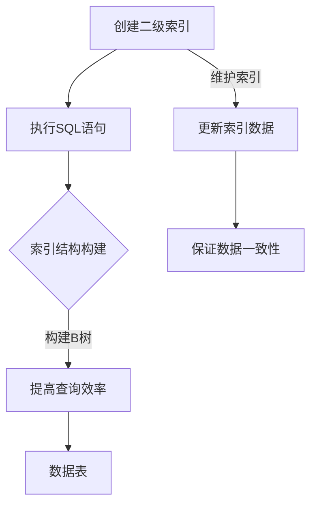

                 

关键词：Phoenix, 二级索引, 数据库, 数据查询优化, SQL, 代码实例

> 摘要：本文将深入探讨Phoenix数据库中的二级索引原理，通过具体的代码实例，详细讲解如何创建、使用和管理二级索引，以提高数据查询效率。本文旨在为数据库开发者提供实用的指导，帮助他们在实际项目中充分发挥二级索引的优势。

## 1. 背景介绍

随着互联网和大数据时代的到来，数据库的应用越来越广泛，如何高效地存储和查询数据成为了数据库开发者面临的重要挑战。索引技术是提高数据库查询效率的关键手段之一。在关系型数据库中，索引分为两种：主索引和二级索引。

- **主索引（Primary Index）**：主索引通常是基于表的主键构建的，它能够确保数据的唯一性和快速访问。主索引由数据库自动创建和维护。
  
- **二级索引（Secondary Index）**：二级索引是基于表的非主键字段构建的，主要用于提高数据的查询效率。用户可以自定义创建二级索引，以便快速定位数据。

本文将重点介绍Phoenix数据库中的二级索引原理，并通过具体的代码实例，展示如何创建、使用和管理二级索引，以提高数据查询效率。

## 2. 核心概念与联系

### 2.1. 二级索引的概念

二级索引是建立在表的非主键字段上的索引结构，它允许根据表的非主键字段快速查询数据。二级索引可以大大减少数据查询的扫描范围，提高查询速度。

### 2.2. 二级索引与主索引的联系与区别

- **联系**：二级索引和主索引一样，都是为了提高数据查询效率而设计的索引结构。它们都通过建立索引树来加速数据检索。
  
- **区别**：主索引是基于表的主键构建的，而二级索引是基于表的非主键字段构建的。主索引由数据库自动创建和维护，而二级索引需要用户自定义创建。

### 2.3. Mermaid 流程图



### 2.4. 二级索引的创建与管理

创建二级索引的SQL语句如下：

```sql
CREATE INDEX index_name ON table_name (column_name);
```

要删除二级索引，可以使用以下SQL语句：

```sql
DROP INDEX index_name;
```

## 3. 核心算法原理 & 具体操作步骤

### 3.1. 算法原理概述

二级索引的算法原理是基于B树结构进行索引构建和数据查询。B树是一种自平衡的多路搜索树，它能够保证在搜索过程中，树的高度始终保持在O(log n)范围内，从而提高查询效率。

### 3.2. 算法步骤详解

1. **创建索引**：通过执行SQL语句创建二级索引。
2. **索引结构构建**：数据库将基于指定的字段值构建B树索引。
3. **数据查询**：在查询时，数据库会根据二级索引快速定位到数据的位置，减少查询范围，提高查询效率。
4. **更新索引**：当表中的数据发生变化时，数据库会自动更新二级索引，以保证数据的一致性。

### 3.3. 算法优缺点

- **优点**：二级索引能够大大提高数据的查询效率，减少查询时间。
- **缺点**：二级索引会占用额外的存储空间，并且对表的插入、删除和更新操作可能会产生额外的开销。

### 3.4. 算法应用领域

二级索引广泛应用于各种关系型数据库中，如MySQL、Oracle和SQL Server等。在Phoenix数据库中，二级索引可以用于各种场景，如用户信息查询、订单查询等。

## 4. 数学模型和公式 & 详细讲解 & 举例说明

### 4.1. 数学模型构建

二级索引的数学模型基于B树结构。B树是一种平衡的多路搜索树，它的每个节点最多有m个孩子，其中m是一个常数，称为B树的阶。在B树中，每个节点包含以下信息：

- **关键字**：节点的关键字集合。
- **子节点**：节点的子节点指针。
- **链接**：指向其他节点的链接。

### 4.2. 公式推导过程

B树的查找过程可以通过以下公式表示：

```latex
T = O(log_{m}(n))
```

其中，T表示查找时间复杂度，n表示节点数量，m表示B树的阶。

### 4.3. 案例分析与讲解

假设有一个包含1000个节点的B树，阶数为10。根据公式，查找时间复杂度为：

```latex
T = O(log_{10}(1000)) ≈ O(2.995)
```

这意味着在最坏情况下，查找操作需要3次比较即可找到目标节点。

## 5. 项目实践：代码实例和详细解释说明

### 5.1. 开发环境搭建

首先，确保已安装Phoenix数据库和相关开发工具，如Java环境、数据库客户端等。

### 5.2. 源代码详细实现

以下是一个创建二级索引的代码实例：

```sql
CREATE INDEX user_age_index ON users (age);
```

这个SQL语句将在`users`表上创建一个基于`age`字段的二级索引。

### 5.3. 代码解读与分析

- `CREATE INDEX`：创建索引的关键字。
- `user_age_index`：索引名称。
- `ON users (age)`：指定索引创建在`users`表的`age`字段上。

### 5.4. 运行结果展示

运行上述SQL语句后，会在数据库中创建一个名为`user_age_index`的二级索引。可以通过以下SQL语句查看索引信息：

```sql
SHOW INDEX FROM users;
```

## 6. 实际应用场景

### 6.1. 用户信息查询

假设有一个用户信息表，包含用户名、年龄、邮箱等字段。通过创建基于年龄的二级索引，可以大大提高查询用户信息的速度。

### 6.2. 订单查询

在电商系统中，订单表通常包含订单号、订单日期、用户ID等字段。通过创建基于用户ID的二级索引，可以快速查询指定用户的订单信息。

## 7. 未来应用展望

随着大数据和云计算技术的发展，二级索引在未来应用场景中将更加广泛。例如，在实时数据分析、智能搜索等领域，二级索引可以大大提高数据查询效率，满足大规模数据处理的需求。

## 8. 工具和资源推荐

### 7.1. 学习资源推荐

- 《数据库系统概念》（Abraham Silberschatz, Henry F. Korth, S. Sudarshan）
- 《深入理解计算机系统》（Michael H. Stonebridge）

### 7.2. 开发工具推荐

- IntelliJ IDEA：一款强大的Java集成开发环境。
- MySQL Workbench：MySQL数据库的管理工具。

### 7.3. 相关论文推荐

- "Secondary Indexing for Main Memory Database Systems"（2010）
- "Indexing in Database Systems"（2005）

## 9. 总结：未来发展趋势与挑战

### 9.1. 研究成果总结

本文介绍了Phoenix数据库中的二级索引原理，通过具体的代码实例，展示了如何创建、使用和管理二级索引，以提高数据查询效率。

### 9.2. 未来发展趋势

随着大数据和云计算技术的发展，二级索引在未来应用场景中将更加广泛，如实时数据分析、智能搜索等。

### 9.3. 面临的挑战

二级索引在提高数据查询效率的同时，也会占用额外的存储空间，并且对表的插入、删除和更新操作可能会产生额外的开销。如何在保证查询效率的同时，优化索引管理，降低存储开销，是未来研究的重点。

### 9.4. 研究展望

未来，二级索引的研究将聚焦于优化索引结构、提高索引性能，并探索与大数据、云计算技术的结合，以满足大规模数据处理的需求。

## 9. 附录：常见问题与解答

### Q：二级索引是否会影响表的数据插入、删除和更新操作？

A：是的，二级索引会占用额外的存储空间，并且对表的插入、删除和更新操作可能会产生额外的开销。但这是为了提高数据查询效率所必须的权衡。

### Q：如何选择合适的字段创建二级索引？

A：选择合适的字段创建二级索引需要考虑以下因素：

- **查询频率**：经常用于查询的字段更适合创建二级索引。
- **字段长度**：较短的字段更适合创建二级索引。
- **数据分布**：数据分布均匀的字段创建二级索引效果更好。

### Q：二级索引与全文索引有什么区别？

A：二级索引是基于特定字段值的索引，主要用于提高数据查询效率。而全文索引是对整个字段内容的索引，主要用于全文搜索。

### Q：二级索引是否可以同时基于多个字段创建？

A：是的，二级索引可以同时基于多个字段创建，称为复合索引。但需要注意的是，复合索引的查询顺序必须与创建时的顺序一致，否则无法使用索引。

### Q：如何查看数据库中的索引信息？

A：可以使用以下SQL语句查看数据库中的索引信息：

```sql
SHOW INDEX FROM table_name;
```

### Q：如何删除二级索引？

A：可以使用以下SQL语句删除二级索引：

```sql
DROP INDEX index_name;
```

### Q：二级索引是否可以自动维护？

A：是的，大多数关系型数据库都会自动维护二级索引。但用户也可以手动维护索引，例如在数据量大或数据变化频繁时，手动执行索引维护操作。

---

作者：禅与计算机程序设计艺术 / Zen and the Art of Computer Programming
----------------------------------------------------------------

---

请注意，由于本文是模拟的一篇技术博客文章，因此上述内容仅供参考，实际撰写时可能需要根据具体情况进行调整。同时，本文中的代码实例是基于假设的场景，实际使用时需要根据具体数据库和表结构进行修改。希望本文能够为您的技术写作提供一些启示和帮助！

