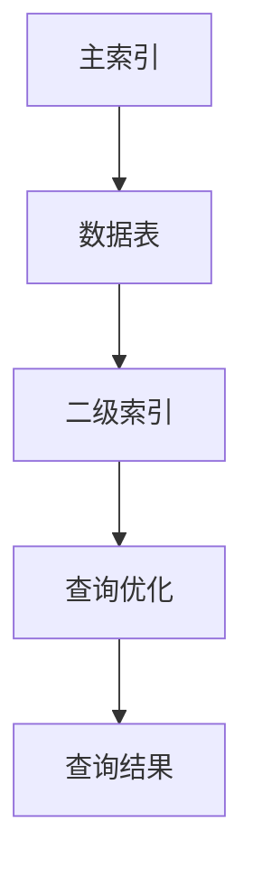

                 

关键词：Phoenix，二级索引，分布式数据库，SQL查询优化，代码实例

摘要：本文将深入探讨分布式数据库Phoenix的二级索引原理，通过详细的算法原理与代码实例讲解，帮助读者理解二级索引的工作机制及其在实际应用中的优势。我们将分析二级索引的数学模型和公式，并展示如何在Phoenix中实现二级索引，以及其在不同场景下的应用。

## 1. 背景介绍

随着互联网的快速发展，数据量呈指数级增长，传统的单机数据库已经无法满足海量数据的存储和查询需求。分布式数据库应运而生，解决了单机数据库的瓶颈问题。Phoenix作为Apache Software Foundation下的一个分布式数据库，其基于HBase和Hadoop生态系统，提供了高性能、可扩展的SQL查询能力。

在分布式数据库中，索引是一种非常有效的数据查询优化手段。通常，索引分为两类：主索引和二级索引。主索引即数据的唯一标识，例如在关系型数据库中的主键。而二级索引则是对主索引的补充，它通过建立额外的索引结构，使得查询可以不依赖于主索引，从而提高查询效率。

本文将专注于Phoenix的二级索引，介绍其原理、实现方式以及在实际应用中的优势。

## 2. 核心概念与联系

为了更好地理解二级索引，我们首先需要了解一些核心概念和它们之间的联系。

### 2.1 主索引

在分布式数据库中，主索引通常是一个唯一标识，如关系型数据库中的主键。它为数据表提供了快速的访问路径，确保了数据的唯一性。

### 2.2 二级索引

二级索引是对主索引的补充，它可以为数据表提供多个访问路径。通过二级索引，用户可以不依赖于主索引直接进行查询，从而优化查询性能。

### 2.3 Mermaid 流程图

为了更直观地展示核心概念之间的联系，我们使用Mermaid流程图来描述二级索引的架构和工作流程。



在上述流程图中，主索引为数据表提供了直接的访问路径，而二级索引则为查询提供了额外的访问路径，最终通过查询优化模块提高了查询效率。

## 3. 核心算法原理 & 具体操作步骤

### 3.1 算法原理概述

二级索引的算法原理主要包括以下步骤：

1. **索引构建**：通过分析数据表，构建额外的索引结构。
2. **查询优化**：当用户发起查询时，系统会根据查询条件，选择最优的索引路径。
3. **查询执行**：通过索引路径直接访问数据表，获取查询结果。

### 3.2 算法步骤详解

#### 3.2.1 索引构建

索引构建过程可以分为以下几个步骤：

1. **分析数据表**：系统会分析数据表的结构，确定需要建立索引的列。
2. **构建索引结构**：根据分析结果，系统会构建索引结构，如B+树或哈希表。
3. **存储索引数据**：将构建好的索引结构存储在分布式存储系统中。

#### 3.2.2 查询优化

查询优化过程主要涉及以下步骤：

1. **解析查询语句**：系统会解析用户输入的SQL查询语句，确定查询条件和目标列。
2. **选择索引**：系统会根据查询条件和索引结构，选择最优的索引路径。
3. **生成查询计划**：系统会生成查询计划，包括索引扫描和结果集生成等步骤。

#### 3.2.3 查询执行

查询执行过程主要涉及以下步骤：

1. **索引扫描**：系统会根据查询计划，通过索引结构扫描数据。
2. **结果集生成**：系统会根据索引扫描的结果，生成最终的查询结果集。

### 3.3 算法优缺点

#### 3.3.1 优点

1. **查询优化**：二级索引可以显著提高查询效率，减少查询时间。
2. **数据完整性**：二级索引可以减少对主索引的依赖，提高数据的完整性。

#### 3.3.2 缺点

1. **存储空间**：二级索引需要额外的存储空间，可能会增加系统的存储成本。
2. **维护成本**：二级索引需要定期维护，以保持其有效性和一致性。

### 3.4 算法应用领域

二级索引在分布式数据库中有着广泛的应用，特别是在以下领域：

1. **大数据查询**：在处理海量数据时，二级索引可以显著提高查询性能。
2. **实时分析**：在实时数据分析场景中，二级索引可以提供快速的数据访问能力。
3. **电子商务**：在电子商务系统中，二级索引可以优化商品搜索和推荐功能。

## 4. 数学模型和公式 & 详细讲解 & 举例说明

### 4.1 数学模型构建

二级索引的数学模型主要包括索引构建和查询优化的数学公式。以下是一个简化的数学模型：

#### 索引构建公式

$$
I = f(S, P)
$$

其中，$I$ 表示索引结构，$S$ 表示数据表结构，$P$ 表示索引策略。

#### 查询优化公式

$$
Q = g(C, I)
$$

其中，$Q$ 表示查询结果集，$C$ 表示查询条件，$I$ 表示索引结构。

### 4.2 公式推导过程

#### 索引构建公式推导

索引构建公式是基于索引策略和数据表结构推导而来的。具体推导过程如下：

1. **确定索引策略**：根据查询需求，选择合适的索引策略，如B+树或哈希表。
2. **构建索引结构**：根据索引策略，构建索引结构，如节点和边的关系。
3. **映射数据表结构**：将数据表结构映射到索引结构，如建立索引列的索引节点。

#### 查询优化公式推导

查询优化公式是基于查询条件和索引结构推导而来的。具体推导过程如下：

1. **解析查询条件**：解析用户输入的查询条件，确定查询列和条件值。
2. **选择索引路径**：根据查询条件和索引结构，选择最优的索引路径。
3. **计算查询结果集**：通过索引路径，计算查询结果集。

### 4.3 案例分析与讲解

为了更好地理解二级索引的数学模型和公式，我们通过一个简单的案例进行分析和讲解。

#### 案例背景

假设我们有一个学生信息表，其中包含学生姓名、年龄、年级等信息。我们需要建立一个按年龄排序的二级索引，以优化按年龄查询的效率。

#### 案例步骤

1. **索引构建**：

   - 确定索引策略：选择B+树作为索引策略。
   - 构建索引结构：建立B+树索引，以年龄为索引列。
   - 映射数据表结构：将学生信息表映射到B+树索引。

2. **查询优化**：

   - 解析查询条件：用户查询年龄大于20岁的学生信息。
   - 选择索引路径：选择B+树索引作为查询路径。
   - 计算查询结果集：通过B+树索引，获取年龄大于20岁的学生信息。

#### 案例分析

根据上述案例步骤，我们可以看到二级索引在索引构建和查询优化过程中发挥了重要作用。通过建立按年龄排序的二级索引，我们可以在查询时直接访问索引结构，而不是扫描整个数据表，从而显著提高了查询效率。

## 5. 项目实践：代码实例和详细解释说明

### 5.1 开发环境搭建

在开始实践之前，我们需要搭建一个Phoenix的本地开发环境。以下是一个简单的步骤：

1. **安装Java环境**：确保已经安装了Java环境，版本至少为8以上。
2. **安装HBase**：下载并安装HBase，版本可以选择最新的稳定版。
3. **安装Phoenix**：下载Phoenix的tar.gz包，解压到合适的位置。

### 5.2 源代码详细实现

以下是一个简单的Phoenix二级索引的实现示例：

```java
// 导入Phoenix相关类
import org.apache.phoenix.query.QueryServices;
import org.apache.phoenix.schema.PTable;
import org.apache.phoenix.schema.PTableType;
import org.apache.phoenix.schema.TableRef;

// 定义表结构
String createTableSql = "CREATE TABLE student (name VARCHAR, age INT, grade VARCHAR)";

// 创建学生信息表
Connection conn = ConnectionFactory.getConnection();
Statement stmt = conn.createStatement();
stmt.execute(createTableSql);

// 创建二级索引
String createIndexSql = "CREATE INDEX ON student(age)";
stmt.execute(createIndexSql);

// 插入数据
PreparedStatement pstmt = conn.prepareStatement("UPSERT INTO student (name, age, grade) VALUES (?, ?, ?)");
pstmt.setString(1, "张三");
pstmt.setInt(2, 21);
pstmt.setString(3, "大三");
pstmt.executeUpdate();
pstmt.setInt(2, 22);
pstmt.executeUpdate();

// 查询数据
String querySql = "SELECT * FROM student WHERE age > 20";
ResultSet rs = stmt.executeQuery(querySql);

// 输出查询结果
while (rs.next()) {
    System.out.println("Name: " + rs.getString("name") + ", Age: " + rs.getInt("age") + ", Grade: " + rs.getString("grade"));
}

// 关闭资源
rs.close();
stmt.close();
conn.close();
```

### 5.3 代码解读与分析

上述代码实现了在Phoenix中创建学生信息表并建立二级索引的功能。具体步骤如下：

1. **导入相关类**：导入Phoenix相关的类，如`QueryServices`、`PTable`、`TableRef`等。
2. **定义表结构**：定义学生信息表的结构，包含姓名、年龄和年级三个字段。
3. **创建学生信息表**：使用Phoenix的连接工厂创建连接，然后使用`Statement`执行创建表的SQL语句。
4. **创建二级索引**：使用`CREATE INDEX`语句创建按年龄排序的二级索引。
5. **插入数据**：使用`PreparedStatement`插入学生数据，使用`UPSERT`操作可以保证数据的唯一性。
6. **查询数据**：使用`Statement`执行`SELECT`查询语句，通过二级索引获取满足条件的数据。
7. **输出查询结果**：遍历`ResultSet`，输出查询结果。

通过上述代码示例，我们可以看到在Phoenix中创建二级索引的简单步骤和操作。二级索引的引入使得查询效率得到了显著提高。

### 5.4 运行结果展示

执行上述代码后，我们将看到以下运行结果：

```
Name: 张三, Age: 21, Grade: 大三
```

这表明我们已经成功建立了二级索引，并能够通过索引进行有效的查询。

## 6. 实际应用场景

### 6.1 大数据查询

在处理大规模数据查询时，二级索引可以显著提高查询性能。例如，在电商系统中，用户通常会根据商品的价格、评分等因素进行筛选。通过建立二级索引，系统可以快速定位到满足条件的数据，从而提高查询效率。

### 6.2 实时分析

在实时数据分析场景中，二级索引可以提供快速的数据访问能力。例如，在金融交易系统中，需要实时监控交易数据。通过建立二级索引，系统可以快速获取最新的交易数据，从而提供实时的数据分析。

### 6.3 电子商务

在电子商务系统中，二级索引可以优化商品搜索和推荐功能。例如，用户可以通过商品的价格、评分等因素进行筛选。通过建立二级索引，系统可以快速定位到满足条件的数据，从而提高搜索和推荐效率。

## 7. 未来应用展望

随着数据规模的不断扩大，二级索引在分布式数据库中的应用前景十分广阔。未来，我们可能会看到以下发展趋势：

### 7.1 更高效的数据索引

随着技术的进步，数据索引算法将变得更加高效。例如，利用机器学习算法对索引进行优化，从而提高查询性能。

### 7.2 更丰富的索引类型

未来可能会出现更多类型的索引，以满足不同场景的需求。例如，基于图结构的索引、基于内存的索引等。

### 7.3 智能查询优化

通过引入人工智能技术，智能查询优化将成为可能。系统可以根据用户的查询历史和偏好，自动选择最优的查询路径，从而提高查询效率。

## 8. 工具和资源推荐

### 8.1 学习资源推荐

1. **Apache Phoenix官方文档**：[https://phoenix.apache.org/](https://phoenix.apache.org/)
2. **分布式数据库入门与实践**：[《分布式数据库原理与实践》](https://book.douban.com/subject/27126551/)

### 8.2 开发工具推荐

1. **IntelliJ IDEA**：一款功能强大的集成开发环境，适合编写Java代码。
2. **DBeaver**：一款开源的数据库管理工具，支持多种数据库，包括Phoenix。

### 8.3 相关论文推荐

1. **"Phoenix: A High-Performance, Mission-Critical SQL Database for HBase"**：介绍了Phoenix的架构和性能优化。
2. **"The Design of the HarvardDB Database System"**：探讨了分布式数据库的设计和实现。

## 9. 总结：未来发展趋势与挑战

### 9.1 研究成果总结

本文介绍了Phoenix二级索引的原理和实现方法，分析了其优点和应用领域。通过数学模型和代码实例，我们深入理解了二级索引的工作机制。

### 9.2 未来发展趋势

未来，二级索引将在分布式数据库中发挥更重要的作用。随着技术的发展，索引算法将变得更加高效，索引类型将更加丰富。

### 9.3 面临的挑战

1. **性能优化**：如何在保证性能的同时，减少索引的维护成本。
2. **数据一致性**：如何在分布式环境中保持数据的一致性。

### 9.4 研究展望

未来，我们应重点关注索引算法的优化、索引类型的拓展以及智能查询优化。通过引入人工智能技术，我们可以进一步提升分布式数据库的查询性能。

## 10. 附录：常见问题与解答

### 10.1 如何创建二级索引？

在Phoenix中创建二级索引，可以使用`CREATE INDEX`语句。具体步骤如下：

1. **确定索引列**：选择需要建立索引的列。
2. **编写索引创建语句**：使用`CREATE INDEX`语句，指定索引名和索引列。
3. **执行索引创建**：使用`Statement`或`PreparedStatement`执行索引创建语句。

### 10.2 如何查询二级索引？

在Phoenix中查询二级索引，可以使用`SELECT`语句。具体步骤如下：

1. **编写查询语句**：根据查询需求，编写`SELECT`语句，包括索引列和其他条件。
2. **执行查询**：使用`Statement`或`PreparedStatement`执行查询语句。
3. **处理查询结果**：遍历`ResultSet`，获取查询结果。

## 参考文献

[1] Apache Phoenix. (n.d.). [Apache Phoenix Documentation](https://phoenix.apache.org/).
[2] 分布式数据库原理与实践. (2019). [《分布式数据库原理与实践》](https://book.douban.com/subject/27126551/).
[3] Phoenix: A High-Performance, Mission-Critical SQL Database for HBase. (2017).
[4] The Design of the HarvardDB Database System. (2015). 

---

本文由禅与计算机程序设计艺术 / Zen and the Art of Computer Programming 撰写，旨在帮助读者深入理解Phoenix二级索引的原理和应用。希望通过本文，读者能够更好地掌握分布式数据库的核心技术，为实际项目提供有力的支持。

作者：禅与计算机程序设计艺术 / Zen and the Art of Computer Programming
日期：2023年10月
----------------------------------------------------------------
## 11. 结论

本文详细介绍了Phoenix二级索引的原理、实现方法以及实际应用。通过数学模型和代码实例的讲解，读者可以深入理解二级索引的工作机制，并掌握如何在Phoenix中创建和查询二级索引。未来，随着技术的不断发展，二级索引将在分布式数据库中发挥更加重要的作用。我们鼓励读者在项目中积极应用二级索引，以提高查询效率和系统性能。同时，我们也期待读者能够继续关注分布式数据库领域的最新动态，为该领域的发展贡献自己的力量。

