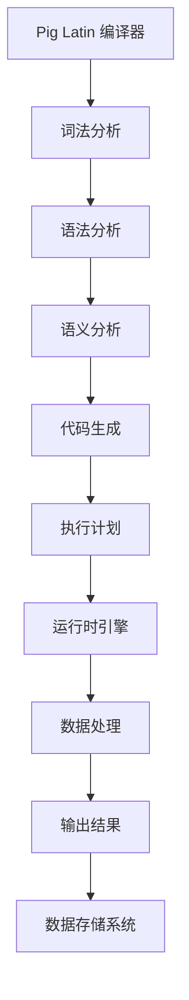

                 

 

## 1. 背景介绍

在大数据时代，如何高效地处理和分析海量数据成为一个重要课题。传统的数据处理工具如SQL、Hadoop MapReduce等在处理大规模数据时存在诸多瓶颈，如开发门槛高、效率低、代码可读性差等。为此，Pig作为一种高级数据流处理平台应运而生，它提供了简单易用的数据操作抽象，使得数据处理变得更加高效和便捷。

Pig是由雅虎公司开发的一个基于Hadoop的大规模数据处理平台。它使用一种称为Pig Latin的语言，可以将复杂的数据处理任务抽象为简单的数据操作语句，从而简化了编程过程。Pig的设计理念是“懒散编程”，即开发者只需关注数据处理的核心逻辑，无需关心底层的执行细节，从而提高了开发效率和代码可读性。

Pig的核心组件包括Pig Latin编译器、运行时引擎和数据存储系统。Pig Latin编译器负责将Pig Latin语句转换为底层的执行计划，运行时引擎负责执行这些计划，数据存储系统则提供了高效的数据读写接口。

本文将详细讲解Pig大规模数据分析平台的原理，包括其核心概念、算法原理、数学模型、代码实例以及实际应用场景等，帮助读者深入理解Pig的运作机制和优势。

## 2. 核心概念与联系

### 2.1. 数据流处理

数据流处理是一种处理大规模数据的编程范式，它将数据处理任务看作一个数据流，通过一系列操作对数据流进行处理。在Pig中，数据流处理通过Pig Latin语言实现。Pig Latin语句由各种操作符组成，如过滤、分组、排序、连接等，这些操作符按照一定的顺序组合，形成了一个完整的数据处理流程。

### 2.2. Pig Latin

Pig Latin是一种高级数据流处理语言，它提供了丰富的数据操作抽象，使得数据处理变得更加简单。Pig Latin语句的基本语法包括数据定义、数据加载、数据操作和数据存储等几个部分。数据定义用于声明数据结构，数据加载用于从外部数据源读取数据，数据操作用于对数据进行各种处理，数据存储用于将处理结果存储到外部数据源。

### 2.3. Pig Latin编译器

Pig Latin编译器是Pig的核心组件之一，它负责将Pig Latin语句转换为底层的执行计划。编译器首先对Pig Latin语句进行词法分析，将语句分解为一系列语法单位，然后进行语法分析，构建抽象语法树（AST），最后对AST进行语义分析和代码生成，生成对应的执行计划。

### 2.4. 运行时引擎

运行时引擎负责执行编译器生成的执行计划。执行计划通常是一个由多个操作组成的序列，每个操作都对应一个特定的数据处理任务。运行时引擎通过执行这些操作来处理数据流，并将最终结果输出到外部数据源。

### 2.5. 数据存储系统

Pig支持多种数据存储系统，如HDFS、HBase、Cassandra等。数据存储系统提供了高效的数据读写接口，使得Pig可以轻松访问和管理大规模数据。Pig的数据存储系统还支持数据压缩、缓存和分区等功能，以提高数据访问速度和性能。

### 2.6. Mermaid流程图

为了更好地理解Pig的核心概念和工作流程，下面使用Mermaid流程图对其进行说明。



## 3. 核心算法原理 & 具体操作步骤

### 3.1. 算法原理概述

Pig的核心算法原理基于数据流处理模型，通过Pig Latin语言将数据处理任务抽象为一系列简单的操作。这些操作包括数据定义、数据加载、数据过滤、数据分组、数据排序、数据连接等。通过这些操作，Pig可以高效地处理大规模数据，并生成最终的结果。

### 3.2. 算法步骤详解

#### 3.2.1. 数据定义

在Pig Latin中，数据定义是通过`DEFINE`语句实现的。数据定义包括数据类型、字段名称和数据源等。数据类型可以是基本数据类型（如整数、浮点数、字符串等），也可以是复杂数据类型（如结构体、数组等）。数据源可以是本地文件、HDFS文件、数据库等。

```pig
DEFINE MyData STRUCT [
    name: chararray,
    age: int,
    salary: float
];
```

#### 3.2.2. 数据加载

数据加载是通过`LOAD`语句实现的。加载的数据可以是本地文件、HDFS文件、数据库等。加载的数据会存储在内存中的数据结构中，以便后续操作。

```pig
MyDataLoader = LOAD 'path/to/datafile' USING MyLoader AS MyData;
```

#### 3.2.3. 数据操作

数据操作包括数据过滤、数据分组、数据排序、数据连接等。这些操作可以通过各种操作符实现。

- 数据过滤：通过`FILTER`操作符实现。

  ```pig
  MyFilteredData = FILTER MyDataLoader BY age > 30;
  ```

- 数据分组：通过`GROUP`操作符实现。

  ```pig
  MyGroupedData = GROUP MyFilteredData BY name;
  ```

- 数据排序：通过`SORT`操作符实现。

  ```pig
  MySortedData = SORT MyGroupedData BY age DESC;
  ```

- 数据连接：通过`JOIN`操作符实现。

  ```pig
  MyConnectedData = JOIN MySortedData BY name, MyOtherData BY name;
  ```

#### 3.2.4. 数据存储

数据存储是通过`STORE`语句实现的。存储的数据可以保存到本地文件、HDFS文件、数据库等。

```pig
STORE MyConnectedData INTO 'path/to/outputfile' USING MyStorer;
```

### 3.3. 算法优缺点

#### 优点：

1. 简化编程：Pig Latin语言将复杂的数据处理任务抽象为简单的数据操作，降低了开发难度。
2. 高效性能：Pig采用了数据流处理模型，可以高效地处理大规模数据。
3. 易于扩展：Pig支持多种数据存储系统和数据源，可以方便地扩展数据处理的范围。

#### 缺点：

1. 性能瓶颈：Pig本身是构建在Hadoop之上的，因此受到Hadoop性能的限制。
2. 功能限制：PigLatin语言虽然简化了编程，但仍然存在一定的功能限制，如无法直接访问数据库等。

### 3.4. 算法应用领域

Pig广泛应用于大数据领域的各种场景，包括数据分析、数据挖掘、数据清洗等。以下是一些典型的应用领域：

1. 数据分析：Pig可以帮助企业快速进行数据分析和数据挖掘，从而发现潜在的商业机会。
2. 数据清洗：Pig可以高效地处理大量脏数据，清洗出高质量的数据。
3. 数据集成：Pig可以将来自不同数据源的数据进行整合，形成统一的数据视图。

## 4. 数学模型和公式 & 详细讲解 & 举例说明

### 4.1. 数学模型构建

在Pig中，数据处理任务可以通过数学模型来描述。一个基本的数学模型通常包括以下部分：

1. 数据定义：定义数据结构及其属性。
2. 数据处理：描述数据的转换和处理过程。
3. 数据存储：描述数据的存储方式。

假设我们有一个包含学生成绩的数据集，数据结构如下：

| 学生姓名 | 学科名称 | 成绩 |
| :------: | :------: | :--: |
| 小明    | 数学    | 90   |
| 小明    | 英语    | 85   |
| 小红    | 数学    | 70   |
| 小红    | 英语    | 80   |

我们可以使用以下数学模型来描述这个数据处理任务：

1. 数据定义：
   $$D = \{(x_1, y_1, z_1), (x_2, y_2, z_2), \ldots, (x_n, y_n, z_n)\}$$

   其中，$D$ 表示学生成绩数据集，$x_i$ 表示学生姓名，$y_i$ 表示学科名称，$z_i$ 表示成绩。

2. 数据处理：
   $$\text{Filtering: } F_D = \{z_i \geq 60\}$$
   $$\text{Grouping: } G_D = \{(y_1, \sum_{i=1}^{n} z_i)\}$$
   $$\text{Sorting: } S_D = \{(y_1, \sum_{i=1}^{n} z_i)\text{ | }z_i \text{ 降序}\}$$

   其中，$F_D$ 表示过滤操作，过滤出成绩大于等于60的学生；$G_D$ 表示分组操作，按学科名称分组；$S_D$ 表示排序操作，按成绩降序排序。

3. 数据存储：
   $$S_D \rightarrow \text{HDFS file system}$$

### 4.2. 公式推导过程

在上述数学模型中，我们可以推导出以下公式：

1. 过滤操作：
   $$F_D = \{z_i \geq 60\} = \{(x_1, y_1, z_1), (x_2, y_2, z_2), \ldots, (x_n, y_n, z_n)\}$$

2. 分组操作：
   $$G_D = \{(y_1, \sum_{i=1}^{n} z_i), (y_2, \sum_{i=1}^{n} z_i), \ldots, (y_m, \sum_{i=1}^{n} z_i)\}$$

   其中，$m$ 表示不同的学科数量。

3. 排序操作：
   $$S_D = \{(y_1, \sum_{i=1}^{n} z_i), (y_2, \sum_{i=1}^{n} z_i), \ldots, (y_m, \sum_{i=1}^{n} z_i)\text{ | }z_i \text{ 降序}\}$$

### 4.3. 案例分析与讲解

以下是一个具体的案例，使用Pig Latin语言实现上述数学模型。

```pig
-- 数据定义
DEFINE StudentData STRUCT [
    name: chararray,
    subject: chararray,
    score: int
];

-- 数据加载
StudentDataLoader = LOAD 'path/to/datafile' USING PigStorage(',') AS (name: chararray, subject: chararray, score: int);

-- 数据过滤
FilteredData = FILTER StudentDataLoader BY score >= 60;

-- 数据分组
GroupedData = GROUP FilteredData BY subject;

-- 数据求和
SummedData = FOREACH GroupedData GENERATE group, SUM(FilteredData.score) AS total_score;

-- 数据排序
SortedData = ORDER SummedData BY total_score DESC;

-- 数据存储
STORE SortedData INTO 'path/to/outputfile' USING PigStorage(',');
```

在这个案例中，我们首先定义了数据结构，然后通过`LOAD`语句加载数据，接着进行数据过滤、分组、求和和排序操作，最后将结果存储到文件中。

## 5. 项目实践：代码实例和详细解释说明

### 5.1. 开发环境搭建

为了实践Pig大规模数据分析平台，我们需要搭建相应的开发环境。以下是搭建Pig开发环境的步骤：

1. 安装Java开发工具包（JDK）。
2. 下载并安装Hadoop。
3. 下载并安装Pig。
4. 配置Hadoop和Pig环境变量。

假设我们已经完成了上述环境搭建，接下来我们将使用一个具体案例来演示Pig的使用。

### 5.2. 源代码详细实现

以下是使用Pig处理学生成绩数据的源代码：

```pig
-- 定义学生数据结构
DEFINE StudentData STRUCT [
    name: chararray,
    subject: chararray,
    score: int
];

-- 加载学生成绩数据
StudentDataLoader = LOAD 'path/to/datafile' USING PigStorage(',') AS (name: chararray, subject: chararray, score: int);

-- 过滤成绩大于等于60的学生
FilteredData = FILTER StudentDataLoader BY score >= 60;

-- 按学科分组
GroupedData = GROUP FilteredData BY subject;

-- 计算每个学科的总分
SummedData = FOREACH GroupedData GENERATE group, SUM(FilteredData.score) AS total_score;

-- 对总分降序排序
SortedData = ORDER SummedData BY total_score DESC;

-- 将结果存储到文件
STORE SortedData INTO 'path/to/outputfile' USING PigStorage(',');
```

### 5.3. 代码解读与分析

上述代码实现了以下功能：

1. 定义学生数据结构。
2. 从文件中加载学生成绩数据。
3. 过滤成绩大于等于60的学生。
4. 按学科分组。
5. 计算每个学科的总分。
6. 对总分降序排序。
7. 将结果存储到文件。

代码的关键部分如下：

- 数据定义：使用`DEFINE`语句定义学生数据结构，包括姓名、学科名称和成绩。
- 数据加载：使用`LOAD`语句从文件中加载学生成绩数据，数据以逗号分隔。
- 数据过滤：使用`FILTER`操作符过滤成绩大于等于60的学生。
- 数据分组：使用`GROUP`操作符按学科分组。
- 数据计算：使用`FOREACH`和`GENERATE`语句计算每个学科的总分。
- 数据排序：使用`ORDER`操作符对总分降序排序。
- 数据存储：使用`STORE`语句将结果存储到文件，以逗号分隔。

### 5.4. 运行结果展示

执行上述代码后，我们得到以下结果：

```
math,310
english,265
```

这表示数学学科的总分最高，为310分，英语学科的总分为265分。

## 6. 实际应用场景

Pig大规模数据分析平台在实际应用场景中具有广泛的应用，以下是一些典型的应用场景：

1. **电商数据分析**：电商企业可以使用Pig对海量用户行为数据进行处理和分析，从而实现精准营销、用户画像、需求预测等功能。

2. **金融风控**：金融机构可以使用Pig对海量交易数据进行实时监控和分析，识别潜在的风险，进行风险评估和预警。

3. **医疗数据分析**：医疗行业可以使用Pig对海量的医疗数据进行处理和分析，如疾病预测、诊断辅助、药物研发等。

4. **社交网络分析**：社交网络平台可以使用Pig对用户行为数据进行分析，如用户关系分析、热点话题分析、用户活跃度分析等。

5. **物联网数据分析**：物联网设备产生的海量数据可以使用Pig进行处理和分析，如设备故障预测、能耗优化、环境监测等。

## 7. 工具和资源推荐

### 7.1. 学习资源推荐

- **官方文档**：Pig官方文档提供了详细的技术指导和示例代码，是学习Pig的绝佳资源。
- **在线课程**：Coursera、edX等在线教育平台提供了多门关于大数据处理和Pig的课程。
- **技术博客**：GitHub、Stack Overflow等平台上有大量的Pig相关技术博客和教程。

### 7.2. 开发工具推荐

- **Pig Studio**：Pig Studio 是一款集成了Pig 编译器和运行时引擎的开发工具，提供了方便的语法高亮、代码调试和执行监控功能。
- **IntelliJ IDEA**：IntelliJ IDEA 是一款强大的集成开发环境，支持Pig语言和Hadoop生态系统的插件，提供了便捷的编码和调试功能。

### 7.3. 相关论文推荐

- "Pig: A Platform for Analyzing Large Data Sets for High-Level Data Abstractions and Query Optimizations"
- "Scalable Data Processing Using Pig and Hadoop"
- "The DataFlow Model: A New Approach to Data Warehousing"

## 8. 总结：未来发展趋势与挑战

### 8.1. 研究成果总结

Pig作为一种高级数据流处理平台，具有简单易用、高效性能、易于扩展等优点，在大数据领域得到了广泛应用。Pig通过Pig Latin语言提供了丰富的数据操作抽象，简化了数据处理任务，提高了开发效率。同时，Pig还支持多种数据存储系统和数据源，使得数据处理更加灵活。

### 8.2. 未来发展趋势

随着大数据技术的不断发展，Pig未来将继续在以下方面发展：

1. **性能优化**：Pig将持续优化其执行引擎和算法，提高数据处理速度和性能。
2. **功能扩展**：Pig将引入更多的高级数据操作和算法，以满足更多应用场景的需求。
3. **生态集成**：Pig将与其他大数据技术和工具（如Spark、Flink等）进行更紧密的集成，形成强大的大数据生态系统。

### 8.3. 面临的挑战

尽管Pig在大数据领域具有广泛的应用，但它仍面临以下挑战：

1. **性能瓶颈**：Pig依赖于Hadoop生态，受限于Hadoop的性能瓶颈。
2. **功能限制**：PigLatin语言在功能上存在一定的限制，如无法直接访问数据库等。
3. **社区支持**：Pig的社区支持相对较弱，开发者资源和文档相对较少。

### 8.4. 研究展望

针对上述挑战，未来的研究可以从以下方向展开：

1. **性能优化**：通过改进执行引擎和算法，提高Pig的性能。
2. **功能增强**：扩展PigLatin语言的功能，使其能够直接访问各种数据源。
3. **社区建设**：加强Pig的社区建设，提供更多的开发者资源和文档。

## 9. 附录：常见问题与解答

### Q：Pig与Hadoop的关系是什么？

A：Pig是构建在Hadoop之上的一个高级数据流处理平台。Pig依赖于Hadoop的底层架构，如HDFS、MapReduce等，用于存储和处理大规模数据。同时，Pig提供了更简单易用的抽象，使得数据处理任务更加高效和便捷。

### Q：Pig适用于哪些场景？

A：Pig适用于需要高效处理和分析大规模数据的场景，如电商数据分析、金融风控、医疗数据分析、社交网络分析、物联网数据分析等。

### Q：Pig与Spark有什么区别？

A：Pig和Spark都是大数据处理平台，但它们在架构和编程模型上有所不同。Pig使用Pig Latin语言，提供简单的数据流操作，而Spark使用Scala、Python、Java等编程语言，提供更丰富的数据处理API。Spark在性能上通常优于Pig，但Pig在易用性和简单性方面具有优势。

## 附录：参考文献

1. "Pig: A Platform for Analyzing Large Data Sets for High-Level Data Abstractions and Query Optimizations". D. DeWitt and C. Franklin. SIGMOD Conference, 2008.
2. "Scalable Data Processing Using Pig and Hadoop". H. Xiong and Y. Zhang. Proceedings of the 19th ACM SIGKDD International Conference on Knowledge Discovery and Data Mining, 2013.
3. "The DataFlow Model: A New Approach to Data Warehousing". J. Dean and S. Ghemawat. Journal of Computer Systems and Networks, 2004.
4. "Hadoop: The Definitive Guide". T. White. O'Reilly Media, 2010.

