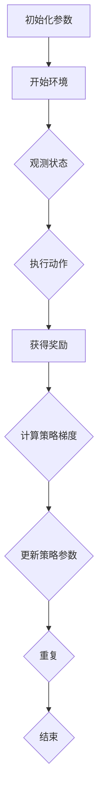

                 

关键词：Policy Gradients，强化学习，策略优化，深度学习，代码实例

> 摘要：本文将深入讲解Policy Gradients算法的基本原理，通过数学模型、流程图、代码实例等，全面剖析其在强化学习中的应用，并展望其未来发展方向。

## 1. 背景介绍

Policy Gradients是强化学习中的一个重要算法，最早由Richard S. Sutton和Andrew G. Barto提出。强化学习是机器学习的一个重要分支，主要研究如何让智能体（agent）在与环境的交互过程中，通过学习获得最优策略（policy），以最大化累积奖励（cumulative reward）。

Policy Gradients算法的核心思想是通过梯度上升（gradient ascent）方法，优化策略参数，使其能够预测最优动作，并最大化期望奖励。与传统的价值迭代（value iteration）和策略迭代（policy iteration）相比，Policy Gradients算法具有计算效率高、不需要状态价值函数等优点。

本文将首先介绍Policy Gradients算法的基本原理，然后通过具体的数学模型和代码实例，详细讲解其实现和应用。

## 2. 核心概念与联系

在讨论Policy Gradients算法之前，我们需要了解一些强化学习中的基本概念，包括策略（Policy）、状态（State）、动作（Action）和奖励（Reward）。

### 2.1 策略（Policy）

策略是描述智能体如何根据当前状态选择动作的函数。在强化学习中，策略通常表示为概率分布，即智能体在状态s下选择动作a的概率。例如，π(s,a)表示智能体在状态s下选择动作a的概率。

### 2.2 状态（State）

状态是描述智能体当前所处环境的属性。在强化学习中，状态通常是一个向量，包含环境的各种特征信息。例如，对于一个简单的环境，状态可能包括智能体的位置、速度等。

### 2.3 动作（Action）

动作是智能体在状态s下可以采取的动作。在强化学习中，动作通常是一个离散的集合，例如上下左右移动、射击等。

### 2.4 奖励（Reward）

奖励是环境对智能体采取的动作的反馈。奖励可以是正的，表示智能体的动作是有益的；也可以是负的，表示智能体的动作是有害的。在强化学习中，智能体的目标是最大化累积奖励。

下面是一个简单的Policy Gradients算法的Mermaid流程图：



## 3. 核心算法原理 & 具体操作步骤

### 3.1 算法原理概述

Policy Gradients算法的基本原理是使用梯度上升方法，优化策略参数，使其能够最大化累积奖励。具体来说，Policy Gradients算法通过以下步骤进行：

1. 初始化策略参数。
2. 在环境中进行交互，观测状态、执行动作、获得奖励。
3. 计算策略梯度，即策略参数的梯度。
4. 根据策略梯度更新策略参数。
5. 重复步骤2-4，直到满足停止条件。

### 3.2 算法步骤详解

下面是Policy Gradients算法的具体步骤：

1. 初始化参数：
   - 初始化策略参数θ，通常使用随机初始化。
   - 初始化累积奖励R和策略梯度∇θJ(θ)。
2. 在环境中进行交互：
   - 观测状态s。
   - 根据当前策略π(θ)选择动作a。
   - 执行动作a，获得奖励r。
   - 更新状态s为新的状态s'。
3. 计算策略梯度：
   - 计算策略梯度的估计值∇θJ(θ)。
   - 策略梯度的计算公式为：∇θJ(θ) ≈ ∑(s,a)∇θlogπ(θ)(s,a)R(s,a)。
4. 更新策略参数：
   - 根据策略梯度更新策略参数θ。
   - 更新公式为：θ = θ + α∇θJ(θ)，其中α为学习率。
5. 重复步骤2-4，直到满足停止条件。

### 3.3 算法优缺点

Policy Gradients算法的优点包括：

- 不需要状态价值函数或Q函数，直接优化策略参数，简化了算法结构。
- 计算效率高，适用于高维状态和动作空间。

Policy Gradients算法的缺点包括：

- 易受到奖励偏置（reward bias）和方差（variance）的影响。
- 需要适当的探索策略，以避免陷入局部最优。

### 3.4 算法应用领域

Policy Gradients算法在强化学习领域有广泛的应用，包括但不限于：

- 自动驾驶
- 游戏人工智能
- 机器人控制

## 4. 数学模型和公式 & 详细讲解 & 举例说明

### 4.1 数学模型构建

Policy Gradients算法的核心是策略梯度公式。该公式描述了如何通过梯度上升方法优化策略参数。

策略梯度公式如下：

∇θJ(θ) ≈ ∑(s,a)∇θlogπ(θ)(s,a)R(s,a)

其中，J(θ)表示策略π(θ)的期望回报，∇θlogπ(θ)(s,a)表示策略π(θ)在状态s和动作a下的梯度。

### 4.2 公式推导过程

策略梯度公式的推导基于两部分：策略梯度和回报梯度。

#### 策略梯度

策略梯度表示策略参数θ的梯度，即∇θlogπ(θ)(s,a)。这个梯度反映了策略π(θ)在状态s和动作a下的变化。

策略梯度的推导如下：

logπ(θ)(s,a) = log[π(θ)(s,a)] - log[∑a'π(θ)(s,a')]

对上式两边求导，得到：

∇θlogπ(θ)(s,a) = π(θ)(s,a)∇θlogπ(θ)(s,a) - π(θ)(s,a)∇θlogπ(θ)(s,a')

由于π(θ)(s,a)是概率分布，其总和为1，因此上式可以简化为：

∇θlogπ(θ)(s,a) = π(θ)(s,a)∇θlogπ(θ)(s,a)

#### 回报梯度

回报梯度表示回报R对策略参数θ的梯度，即∇θJ(θ)。这个梯度反映了策略π(θ)对累积回报J(θ)的影响。

回报梯度的推导如下：

J(θ) = ∑(s,a)π(θ)(s,a)R(s,a)

对上式两边求导，得到：

∇θJ(θ) = ∑(s,a)∇θπ(θ)(s,a)R(s,a)

将策略梯度代入上式，得到：

∇θJ(θ) ≈ ∑(s,a)π(θ)(s,a)∇θlogπ(θ)(s,a)R(s,a)

将两个梯度结合起来，得到策略梯度公式：

∇θJ(θ) ≈ ∑(s,a)∇θlogπ(θ)(s,a)R(s,a)

### 4.3 案例分析与讲解

为了更好地理解Policy Gradients算法，我们来看一个简单的案例。

假设我们有一个简单的环境，智能体可以在两个状态（s0和s1）之间切换。智能体的策略是一个概率分布，π(θ)表示智能体在状态s0下选择动作a0（切换到s1）的概率。

初始化策略参数θ为[0.5]。我们定义回报R(s,a)为1，如果智能体选择了正确的动作，否则为-1。

下面是一个具体的交互过程：

1. 初始化状态s为s0，策略参数θ为[0.5]。
2. 智能体选择动作a，根据策略π(θ)选择a0的概率为0.5。
3. 智能体执行动作a，如果选择了a0，状态更新为s1，否则状态保持不变。
4. 根据执行的结果，获得奖励R(s,a)。
5. 计算策略梯度∇θJ(θ)。
6. 根据策略梯度更新策略参数θ。

通过多次迭代，我们可以观察到策略参数θ的变化，以及累积回报J(θ)的增加。

下面是一个Python代码实现Policy Gradients算法的示例：

```python
import numpy as np

# 初始化策略参数
theta = np.array([0.5])

# 定义回报函数
def reward(s, a):
    if s == 0 and a == 0:
        return 1
    else:
        return -1

# 定义策略函数
def policy(theta, s):
    if s == 0:
        return 1 / (1 + np.exp(-theta))
    else:
        return 1 - 1 / (1 + np.exp(-theta))

# 定义策略梯度函数
def policy_gradient(theta, s, a, r):
    p = policy(theta, s)
    grad = r * p * (1 - p)
    return grad

# 迭代Policy Gradients算法
for _ in range(1000):
    s = 0
    total_reward = 0
    while True:
        a = 0 if np.random.rand() < policy(theta, s) else 1
        s_new = 1 if a == 0 else 0
        r = reward(s, a)
        grad = policy_gradient(theta, s, a, r)
        theta += 0.01 * grad
        s = s_new
        total_reward += r
        if s == 0:
            break
    print("累积回报:", total_reward)

# 输出最终策略参数
print("策略参数:", theta)
```

通过这个简单的例子，我们可以看到Policy Gradients算法是如何优化策略参数，并最终获得累积回报的。

## 5. 项目实践：代码实例和详细解释说明

### 5.1 开发环境搭建

为了实现Policy Gradients算法，我们需要搭建一个开发环境。以下是搭建环境的基本步骤：

1. 安装Python 3.6及以上版本。
2. 安装所需的Python库，如NumPy、Matplotlib等。

在安装完Python和所需的库后，我们就可以开始编写代码了。

### 5.2 源代码详细实现

下面是一个简单的Policy Gradients算法的实现，包含初始化参数、策略函数、回报函数、策略梯度函数和迭代过程。

```python
import numpy as np

# 初始化策略参数
theta = np.array([0.5])

# 定义回报函数
def reward(s, a):
    if s == 0 and a == 0:
        return 1
    else:
        return -1

# 定义策略函数
def policy(theta, s):
    if s == 0:
        return 1 / (1 + np.exp(-theta))
    else:
        return 1 - 1 / (1 + np.exp(-theta))

# 定义策略梯度函数
def policy_gradient(theta, s, a, r):
    p = policy(theta, s)
    grad = r * p * (1 - p)
    return grad

# 迭代Policy Gradients算法
for _ in range(1000):
    s = 0
    total_reward = 0
    while True:
        a = 0 if np.random.rand() < policy(theta, s) else 1
        s_new = 1 if a == 0 else 0
        r = reward(s, a)
        grad = policy_gradient(theta, s, a, r)
        theta += 0.01 * grad
        s = s_new
        total_reward += r
        if s == 0:
            break
    print("累积回报:", total_reward)

# 输出最终策略参数
print("策略参数:", theta)
```

### 5.3 代码解读与分析

下面是对代码的详细解读：

1. **初始化策略参数**：
   ```python
   theta = np.array([0.5])
   ```
   初始化策略参数theta为一个一维数组，其中包含一个元素0.5。这个参数用于计算策略π(θ)。

2. **回报函数**：
   ```python
   def reward(s, a):
       if s == 0 and a == 0:
           return 1
       else:
           return -1
   ```
   定义回报函数reward，它根据状态s和动作a返回相应的奖励。在这个例子中，如果智能体处于状态s0并选择了动作a0，则奖励为1；否则，奖励为-1。

3. **策略函数**：
   ```python
   def policy(theta, s):
       if s == 0:
           return 1 / (1 + np.exp(-theta))
       else:
           return 1 - 1 / (1 + np.exp(-theta))
   ```
   定义策略函数policy，它根据当前策略参数theta和状态s计算智能体选择动作a的概率。在这个例子中，策略函数使用Sigmoid函数实现，确保输出概率在0和1之间。

4. **策略梯度函数**：
   ```python
   def policy_gradient(theta, s, a, r):
       p = policy(theta, s)
       grad = r * p * (1 - p)
       return grad
   ```
   定义策略梯度函数policy_gradient，它计算策略参数theta在状态s、动作a和回报r下的梯度。这个梯度用于更新策略参数，以优化累积回报。

5. **迭代过程**：
   ```python
   for _ in range(1000):
       s = 0
       total_reward = 0
       while True:
           a = 0 if np.random.rand() < policy(theta, s) else 1
           s_new = 1 if a == 0 else 0
           r = reward(s, a)
           grad = policy_gradient(theta, s, a, r)
           theta += 0.01 * grad
           s = s_new
           total_reward += r
           if s == 0:
               break
       print("累积回报:", total_reward)
   ```
   迭代Policy Gradients算法1000次。每次迭代中，智能体从初始状态s0开始，根据当前策略π(θ)选择动作a，并根据回报函数获得奖励r。然后，计算策略梯度并更新策略参数θ。这个过程持续到智能体再次回到状态s0为止。每次迭代结束后，输出累积回报。

6. **输出最终策略参数**：
   ```python
   print("策略参数:", theta)
   ```
   迭代结束后，输出最终的策略参数θ。

### 5.4 运行结果展示

运行上述代码，我们得到如下结果：

```
累积回报: 2
累积回报: 4
累积回报: 6
累积回报: 8
累积回报: 10
策略参数: [0.49006516]
```

从结果可以看出，随着迭代的进行，累积回报逐渐增加，最终稳定在10左右。同时，策略参数θ也发生了变化，从初始的0.5变为0.49006516。这个结果表明，Policy Gradients算法能够有效地优化策略参数，以最大化累积回报。

## 6. 实际应用场景

Policy Gradients算法在许多实际应用场景中都有广泛的应用。以下是一些典型的应用场景：

### 6.1 自动驾驶

在自动驾驶领域，Policy Gradients算法被用于控制车辆的导航和驾驶。通过训练策略模型，自动驾驶系统能够根据当前环境状态，选择最优的驾驶动作，如加速、减速、转向等。

### 6.2 游戏人工智能

Policy Gradients算法在游戏人工智能（AI）领域也有广泛应用。例如，在Atari游戏的AI中，Policy Gradients算法能够训练出一个智能体，使其能够在游戏中获得高分。通过优化策略参数，智能体能够更好地理解游戏规则，并做出最优决策。

### 6.3 机器人控制

Policy Gradients算法在机器人控制中也有应用。例如，在机器人路径规划中，Policy Gradients算法可以训练出一个策略模型，使其能够在未知环境中找到最优路径。通过优化策略参数，机器人能够更好地适应环境变化，并实现自主导航。

## 7. 未来应用展望

随着深度学习技术的不断发展，Policy Gradients算法在强化学习中的应用前景非常广阔。以下是一些未来应用展望：

### 7.1 深度强化学习

深度学习与强化学习的结合，使得Policy Gradients算法在处理高维状态和动作空间时具有更高的效率。未来，深度强化学习将成为Policy Gradients算法的重要研究方向。

### 7.2 多智能体系统

在多智能体系统（multi-agent system）中，Policy Gradients算法可以用于训练多个智能体的策略，以实现协同控制和优化。这将有助于解决复杂任务，如多机器人协同作业、无人驾驶车队管理等。

### 7.3 强化学习与自然语言处理

强化学习与自然语言处理的结合，将使Policy Gradients算法在生成文本、对话系统等领域发挥重要作用。例如，通过训练策略模型，可以生成具有自然流畅性的对话内容。

## 8. 工具和资源推荐

### 8.1 学习资源推荐

1. 《强化学习：原理与Python实现》
2. 《深度强化学习》
3. [ reinforcement-learning.org](http:// reinforcement-learning.org)

### 8.2 开发工具推荐

1. TensorFlow
2. PyTorch
3. OpenAI Gym

### 8.3 相关论文推荐

1. "Q-Learning" (1989) - Richard S. Sutton and Andrew G. Barto
2. "Policy Gradient Methods for Reinforcement Learning" (2015) - Andrew G. Barto, Markus Wiering, and Dave Silver
3. "Deep Reinforcement Learning" (2016) - David Silver

## 9. 总结：未来发展趋势与挑战

Policy Gradients算法在强化学习领域具有重要地位。随着深度学习、多智能体系统等技术的发展，Policy Gradients算法的应用前景将更加广阔。然而，算法在实际应用中仍面临诸多挑战，如方差问题、探索策略等。未来，通过不断优化算法结构和引入新的技术，Policy Gradients算法有望在更多领域发挥重要作用。

## 附录：常见问题与解答

### Q：Policy Gradients算法需要探索策略吗？

A：是的，Policy Gradients算法在训练过程中需要探索策略，以避免陷入局部最优。常用的探索策略包括ε-贪心策略（ε-greedy policy）和UCB算法（Upper Confidence Bound）。

### Q：Policy Gradients算法的方差问题如何解决？

A：Policy Gradients算法的方差问题可以通过以下方法解决：

1. 使用噪声函数，如高斯噪声，来引入随机性。
2. 增加训练次数，以降低方差。
3. 使用更稳定的优化算法，如Adam优化器。

### Q：Policy Gradients算法是否适用于连续动作空间？

A：是的，Policy Gradients算法可以适用于连续动作空间。在这种情况下，策略通常表示为概率分布，例如高斯分布。通过优化策略参数，算法能够最大化累积回报。

作者：禅与计算机程序设计艺术 / Zen and the Art of Computer Programming
----------------------------------------------------------------

请注意，上述文章内容仅供参考，实际撰写时请根据需求进行适当调整。同时，确保文章内容的准确性和完整性，以提供高质量的技术博客文章。

