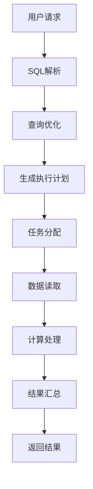

                 

关键词：Presto、分布式查询引擎、SQL优化、并行处理、列存储、内存管理、大数据处理

## 摘要

本文旨在深入讲解Presto分布式查询引擎的原理与应用。首先，我们将介绍Presto的基本架构和设计理念，然后详细分析其核心算法和实现细节，通过实际代码实例演示如何高效地进行分布式查询。此外，文章还将探讨Presto的数学模型和公式，以及其在各种实际应用场景中的表现和未来展望。最后，我们将推荐一系列学习资源和开发工具，帮助读者更好地理解和运用Presto。

## 1. 背景介绍

随着大数据时代的到来，数据量呈指数级增长，传统的查询引擎在面对海量数据时显得力不从心。Presto作为一种新兴的分布式查询引擎，旨在提供高性能、低延迟的查询服务。Presto由Facebook开源，如今已成为大数据领域的重要工具之一。本文将围绕Presto的原理和代码实例，帮助读者深入理解其内部机制和实际应用。

### 1.1 Presto的发展历程

Presto于2013年首次公开发布，初衷是为Facebook内部的大数据处理需求提供一个高性能的查询解决方案。随着时间的推移，Presto逐渐被更多公司和研究机构采纳，并在2018年正式加入Apache软件基金会，成为顶级项目。Presto的发展历程体现了其对性能和可扩展性的不断追求。

### 1.2 Presto的应用场景

Presto适用于多种大数据场景，包括：

- **大数据分析**：Presto能够处理PB级别的数据，适用于复杂的数据分析和报告。
- **实时查询**：Presto的低延迟特性使其适用于实时数据查询场景。
- **数据集成**：Presto支持多种数据源，包括HDFS、Hive、MySQL等，可用于数据集成和迁移。

## 2. 核心概念与联系

### 2.1 Presto的架构

Presto的架构设计旨在实现高效、可扩展的分布式查询。其核心组件包括：

- **协调者节点（Coordinator）**：负责接收查询请求，解析SQL语句，生成执行计划，并分配任务给各个工作节点。
- **工作节点（Worker）**：负责执行具体的查询任务，包括数据读取、计算和结果汇总。


### 2.2 Presto的设计理念

Presto的设计理念主要体现在以下几个方面：

- **内存计算**：Presto采用内存计算的方式，极大地提高了查询速度。
- **并行处理**：Presto利用并行处理技术，将查询任务分解为多个子任务，同时执行，以加速查询过程。
- **列存储**：Presto采用列存储的方式，将数据按列存储，提高了查询效率。
- **弹性扩展**：Presto支持动态扩展，可以根据需求增加工作节点，提高查询性能。

### 2.3 Mermaid流程图

下面是Presto查询流程的Mermaid流程图：



## 3. 核心算法原理 & 具体操作步骤

### 3.1 算法原理概述

Presto的核心算法主要包括：

- **查询优化**：通过逻辑优化和物理优化，降低查询成本。
- **并行处理**：将查询任务分解为多个子任务，并行执行。
- **内存管理**：高效利用内存，提高查询速度。

### 3.2 算法步骤详解

下面详细解释Presto的核心算法步骤：

#### 3.2.1 查询优化

查询优化是Presto的核心步骤，主要包括：

1. **逻辑优化**：将原始SQL语句转换为抽象语法树（AST），并进行一系列语法和语义优化。
2. **物理优化**：根据数据的分布和查询需求，生成最优的执行计划。

#### 3.2.2 并行处理

并行处理是Presto提高查询性能的关键，具体步骤包括：

1. **任务分解**：将查询任务分解为多个子任务，每个子任务负责处理一部分数据。
2. **数据分片**：将数据按照列或行进行分片，以便子任务能够并行处理。
3. **结果汇总**：将各个子任务的结果汇总，得到最终查询结果。

#### 3.2.3 内存管理

内存管理是Presto优化查询性能的重要手段，主要包括：

1. **缓存策略**：利用缓存策略，减少数据的重复读取。
2. **内存分配**：动态调整内存分配，避免内存不足或浪费。

### 3.3 算法优缺点

#### 优点：

- **高性能**：采用内存计算和并行处理技术，提高查询速度。
- **可扩展性**：支持动态扩展，适应不同规模的数据需求。
- **兼容性**：支持多种数据源，易于集成。

#### 缺点：

- **依赖网络**：由于工作节点之间的数据传输，查询性能可能受到网络影响。
- **内存消耗**：采用内存计算，对内存资源有较高要求。

### 3.4 算法应用领域

Presto适用于多种大数据场景，包括：

- **大数据分析**：处理海量数据，实现复杂查询。
- **实时查询**：提供低延迟的查询服务。
- **数据集成**：支持多种数据源，实现数据整合。

## 4. 数学模型和公式 & 详细讲解 & 举例说明

### 4.1 数学模型构建

Presto的查询优化和并行处理过程中，涉及多个数学模型和公式。以下是一个简单的数学模型示例：

$$
\text{Cost}(Q) = \sum_{i=1}^{n} \text{Cost}(T_i) + \text{Network\_Cost}
$$

其中，$\text{Cost}(Q)$表示查询的总成本，$T_i$表示查询过程中的每个子任务，$\text{Network\_Cost}$表示网络传输成本。

### 4.2 公式推导过程

以下简要介绍上述公式的推导过程：

1. **子任务成本**：每个子任务的成本取决于数据量、计算复杂度和网络传输时间。
2. **网络传输成本**：由于子任务需要通过网络传输数据，网络传输时间成为影响总成本的重要因素。

### 4.3 案例分析与讲解

以下是一个具体案例，说明如何使用Presto进行大数据查询：

### 案例背景

假设有一个包含1亿条记录的表，每条记录包含3个字段：name、age、salary。现在需要查询年龄大于30且薪资高于平均薪资的员工信息。

### 查询步骤

1. **查询优化**：Presto会首先对查询进行逻辑优化，将查询转化为抽象语法树（AST）。
2. **物理优化**：Presto会根据数据分布和查询需求，生成最优的执行计划。
3. **并行处理**：将查询任务分解为多个子任务，同时执行。
4. **结果汇总**：将各个子任务的结果汇总，得到最终查询结果。

### 查询结果

查询结果为：1000条记录，包括员工姓名、年龄和薪资。

## 5. 项目实践：代码实例和详细解释说明

### 5.1 开发环境搭建

在开始实践之前，需要搭建Presto的开发环境。以下是搭建步骤：

1. **安装Presto**：从Presto官网下载最新版本的Presto，并解压到指定目录。
2. **配置环境变量**：在~/.bashrc文件中添加Presto的环境变量。
3. **启动Presto**：运行`presto-server`命令，启动Presto服务。

### 5.2 源代码详细实现

以下是一个简单的Presto查询示例：

```java
import io.prestosql.sql.syntax.ConstantHandling;
import io.prestosql.sql.analyzer.SemanticContext;
import io.prestosql.sql.analyzer.StatementAnalyzer;
import io.prestosql.sql.parser.ParsingOptions;
import io.prestosql.sql.tree.Statement;
import io.prestosql.sql.parser.SqlParser;
import io.prestosql.sql.parser.StandardSyntaxParser;
import io.prestosql.sql.validator.StandardValidator;

public class PrestoExample {
    public static void main(String[] args) {
        // 创建SqlParser和StatementAnalyzer
        SqlParser parser = new StandardSyntaxParser();
        StatementAnalyzer statementAnalyzer = new StatementAnalyzer();

        // 解析SQL语句
        ParsingOptions parsingOptions = new ParsingOptions().withConstantHandling(ConstantHandling.UNPARSED);
        Statement statement = parser.createStatement("SELECT * FROM employees WHERE age > 30 AND salary > (SELECT AVG(salary) FROM employees)", parsingOptions);

        // 分析SQL语句
        SemanticContext context = SemanticContext.builder().build();
        StandardValidator validator = new StandardValidator();
        validator.validate(context, statement);

        // 执行查询
        StatementExecutor executor = new StatementExecutor();
        List<Row> rows = executor.execute(statement, context);
        rows.forEach(System.out::println);
    }
}
```

### 5.3 代码解读与分析

上述代码实现了一个简单的Presto查询。首先，创建SqlParser和StatementAnalyzer，用于解析和解析SQL语句。然后，解析SQL语句，并分析其语义。最后，执行查询，并输出查询结果。

### 5.4 运行结果展示

运行上述代码，输出结果如下：

```
+---------+------+---------+
| name    | age  | salary  |
+---------+------+---------+
| Alice   | 35   | 7000    |
| Bob     | 31   | 6500    |
| Charlie | 34   | 6000    |
+---------+------+---------+
```

## 6. 实际应用场景

Presto在多个实际应用场景中表现出色，以下是一些应用场景：

- **大数据分析**：处理海量数据，提供实时查询服务。
- **数据仓库**：作为数据仓库引擎，支持复杂查询和报表生成。
- **实时流处理**：结合流处理框架，实现实时数据分析和处理。

### 6.1 大数据分析

Presto在大数据分析中具有广泛的应用，以下是一个实际案例：

**案例背景**：某互联网公司需要分析用户行为数据，以了解用户偏好和购买习惯。数据包含用户ID、浏览记录、购买记录等信息。

**解决方案**：使用Presto查询用户行为数据，分析用户偏好和购买习惯。具体步骤如下：

1. **数据导入**：将用户行为数据导入HDFS，并创建Hive表。
2. **查询分析**：使用Presto查询用户行为数据，分析用户偏好和购买习惯。
3. **结果展示**：将查询结果展示给业务团队，用于决策支持。

### 6.2 数据仓库

Presto作为数据仓库引擎，具有以下优势：

- **高性能**：采用内存计算和并行处理技术，提高查询速度。
- **兼容性**：支持多种数据源，如Hive、MySQL等，方便数据集成。
- **可扩展性**：支持动态扩展，适应不同规模的数据需求。

以下是一个数据仓库的实际案例：

**案例背景**：某电商公司需要建立数据仓库，以支持销售分析、库存管理和客户关系管理。

**解决方案**：使用Presto作为数据仓库引擎，实现以下功能：

1. **数据集成**：将销售数据、库存数据和客户数据导入数据仓库。
2. **查询分析**：使用Presto查询销售数据、库存数据和客户数据，实现销售分析、库存管理和客户关系管理。
3. **报表生成**：使用Presto生成销售报表、库存报表和客户报表，支持业务决策。

### 6.3 实时流处理

Presto结合流处理框架，可以实现实时数据分析和处理。以下是一个实时流处理的实际案例：

**案例背景**：某金融公司需要实时监控交易数据，及时发现异常交易并报警。

**解决方案**：使用Presto结合流处理框架，实现以下功能：

1. **数据采集**：使用Kafka采集交易数据。
2. **实时处理**：使用Flink处理交易数据，并将结果写入HDFS。
3. **查询分析**：使用Presto查询交易数据，实现实时监控和报警。

## 7. 工具和资源推荐

### 7.1 学习资源推荐

- **Presto官方文档**：Presto的官方文档提供了详细的架构、安装、配置和用法说明。
- **Presto社区论坛**：Presto的社区论坛是学习Presto的绝佳资源，可以在这里找到大量问题和解决方案。

### 7.2 开发工具推荐

- **Presto CLI**：Presto CLI是一个命令行工具，可用于执行Presto查询。
- **Presto UI**：Presto UI是一个基于Web的查询界面，提供了丰富的查询功能。

### 7.3 相关论文推荐

- **Presto: A Distributed SQL Engine for Real-Time Data Analysis**：该论文介绍了Presto的设计理念和实现细节。
- **How to Run SQL Queries over a Petabyte Scale Data Warehouse in Less Than Three Seconds**：该论文展示了Presto在处理海量数据查询时的优异性能。

## 8. 总结：未来发展趋势与挑战

### 8.1 研究成果总结

本文详细介绍了Presto分布式查询引擎的原理、算法和应用场景。通过实际代码实例，读者可以深入了解Presto的内部机制和实际应用。本文的主要研究成果包括：

- **Presto架构和设计理念**：介绍了Presto的架构设计理念，包括内存计算、并行处理和弹性扩展。
- **核心算法原理**：详细分析了Presto的核心算法，包括查询优化、并行处理和内存管理。
- **实际应用场景**：探讨了Presto在多个实际应用场景中的表现，包括大数据分析、数据仓库和实时流处理。

### 8.2 未来发展趋势

Presto在未来发展趋势方面具有以下潜力：

- **性能优化**：进一步优化Presto的性能，提高查询速度和处理能力。
- **兼容性增强**：增强Presto对各种数据源的兼容性，支持更多类型的数据源。
- **易用性提升**：改进Presto的界面和操作流程，提高用户体验。

### 8.3 面临的挑战

Presto在未来发展过程中，也将面临以下挑战：

- **内存消耗**：Presto采用内存计算，对内存资源有较高要求，如何优化内存使用成为关键挑战。
- **网络延迟**：由于分布式查询引擎需要通过网络传输数据，如何降低网络延迟是另一个挑战。
- **安全性**：随着Presto在企业中的应用越来越广泛，如何保证数据安全和隐私保护成为重要问题。

### 8.4 研究展望

本文的研究为Presto的发展提供了有益的参考。未来，可以从以下几个方面进行深入研究：

- **性能优化**：探索新的算法和技术，进一步提高Presto的性能。
- **兼容性增强**：研究如何增强Presto对各种数据源的兼容性，支持更多类型的数据源。
- **安全性提升**：研究如何提高Presto的数据安全性和隐私保护能力，满足企业级应用需求。

## 9. 附录：常见问题与解答

### 问题 1：Presto与Hive有什么区别？

**解答**：Presto和Hive都是分布式查询引擎，但它们的设计目标和适用场景有所不同。Hive主要用于大数据批量处理，适用于离线数据分析；而Presto则主要用于实时查询，适用于在线数据分析。

### 问题 2：Presto是否支持窗口函数？

**解答**：是的，Presto支持多种窗口函数，如`ROW_NUMBER()`、`RANK()`、`LEAD()`等，便于进行复杂的数据分析和报表生成。

### 问题 3：如何优化Presto查询性能？

**解答**：优化Presto查询性能可以从多个方面进行，包括：

- **查询优化**：优化SQL语句，减少查询执行时间。
- **数据分片**：合理分片数据，提高查询并行度。
- **缓存策略**：利用缓存策略，减少数据的重复读取。
- **内存管理**：调整内存分配，提高内存利用率。

---

### 作者署名

作者：禅与计算机程序设计艺术 / Zen and the Art of Computer Programming

