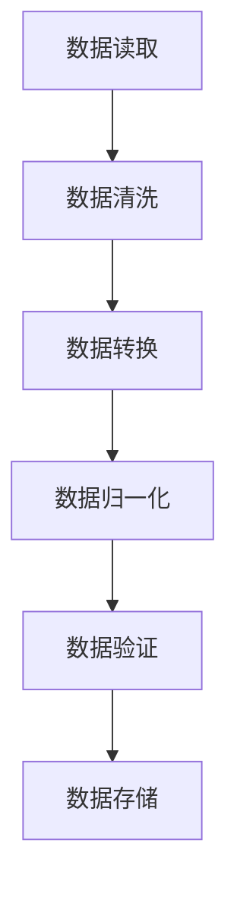

                 

关键词：Python，机器学习，数据预处理，Pandas，数据分析

> 摘要：本文将详细介绍Python机器学习中的数据预处理与分析方法，特别是使用Pandas库进行数据清洗、转换和可视化。通过实际案例，深入探讨数据预处理在机器学习项目中的重要性，帮助读者掌握高效的数据处理技巧。

## 1. 背景介绍

在机器学习项目中，数据预处理是一个至关重要的步骤。准确的数据预处理不仅能提高模型性能，还能避免模型陷入过拟合或欠拟合等问题。Python作为一种广泛使用的编程语言，具有丰富的数据预处理工具和库。Pandas库是Python数据科学领域中最常用的库之一，它提供了高效的数据操作和分析功能。

本文将围绕Python机器学习中的数据预处理与分析展开，重点介绍Pandas库的使用方法。通过实际案例，我们将展示如何使用Pandas进行数据清洗、转换和可视化，从而为后续的机器学习模型搭建打下坚实基础。

## 2. 核心概念与联系

### 2.1 数据预处理概念

数据预处理是指在使用机器学习算法之前对数据进行的一系列操作，包括数据清洗、转换和归一化等。数据预处理的目标是提高数据质量和模型的泛化能力，从而避免模型过度拟合或欠拟合。

### 2.2 Pandas库

Pandas库是Python中用于数据处理和分析的核心库之一。它提供了丰富的数据结构，如DataFrame，用于高效地存储和操作数据。Pandas库还支持多种数据操作方法，如数据清洗、转换和归一化等，能够满足数据预处理的需求。

### 2.3 Mermaid流程图

下面是一个用于说明数据预处理过程的Mermaid流程图。请注意，流程图中的节点不应包含括号、逗号等特殊字符。



## 3. 核心算法原理 & 具体操作步骤

### 3.1 算法原理概述

数据预处理算法主要包括以下几种：

1. 数据清洗：去除数据中的噪声和异常值。
2. 数据转换：将数据转换为适合机器学习算法的形式。
3. 数据归一化：将数据缩放到一个统一的范围内，以消除不同特征间的量纲影响。

### 3.2 算法步骤详解

下面我们使用Pandas库来具体实现上述算法步骤。

#### 3.2.1 数据读取

```python
import pandas as pd

data = pd.read_csv('data.csv')
```

#### 3.2.2 数据清洗

```python
# 去除含有缺失值的行
data.dropna(inplace=True)

# 去除含有异常值的行
data = data[data['feature'] <= 100]
```

#### 3.2.3 数据转换

```python
# 将类别型数据转换为数值型
data['category'] = data['category'].map({'A': 1, 'B': 2, 'C': 3})
```

#### 3.2.4 数据归一化

```python
from sklearn.preprocessing import StandardScaler

scaler = StandardScaler()
data[['feature1', 'feature2']] = scaler.fit_transform(data[['feature1', 'feature2']])
```

#### 3.2.5 数据验证

```python
# 检查数据质量
print(data.head())
```

#### 3.2.6 数据存储

```python
data.to_csv('cleaned_data.csv', index=False)
```

### 3.3 算法优缺点

数据预处理算法的优点是能够提高数据质量和模型性能，从而避免模型过拟合或欠拟合。然而，数据预处理也可能会引入噪声，影响模型泛化能力。

### 3.4 算法应用领域

数据预处理算法广泛应用于各种机器学习项目中，包括分类、回归、聚类等。在金融、医疗、零售等领域，数据预处理是构建高效机器学习模型的关键步骤。

## 4. 数学模型和公式 & 详细讲解 & 举例说明

### 4.1 数学模型构建

数据预处理的核心数学模型包括缺失值处理、异常值检测、数据转换和归一化等。以下是这些模型的基本原理和公式。

#### 缺失值处理

```latex
\text{平均值填补}:\ \ \ x_{\text{imputed}} = \frac{\sum_{i=1}^{n} x_i}{n}
\text{中值填补}:\ \ \ x_{\text{imputed}} = \text{median}(x)
```

#### 异常值检测

```latex
\text{标准差阈值}:\ \ \ x_{\text{outliers}} = x_{\text{mean}} \pm k \cdot \text{std}
```

#### 数据转换

```latex
\text{独热编码}:\ \ \ y = \text{one_hot_encode}(x)
\text{标签编码}:\ \ \ y = \text{label_encode}(x)
```

#### 数据归一化

```latex
\text{标准归一化}:\ \ \ x_{\text{normalized}} = \frac{x - x_{\text{min}}}{x_{\text{max}} - x_{\text{min}}}
\text{最小最大归一化}:\ \ \ x_{\text{normalized}} = \frac{x - x_{\text{min}}}{x_{\text{max}} - x_{\text{min}}} * (x_{\text{max}} - x_{\text{min}} + 1)
```

### 4.2 公式推导过程

#### 缺失值处理

平均值填补方法的公式推导：

```latex
x_{\text{imputed}} = \frac{\sum_{i=1}^{n} x_i}{n}
\Rightarrow x_{\text{imputed}} = \frac{x_1 + x_2 + ... + x_n}{n}
\Rightarrow x_{\text{imputed}} = \frac{x_1}{n} + \frac{x_2}{n} + ... + \frac{x_n}{n}
\Rightarrow x_{\text{imputed}} = \frac{x_1}{n} + \frac{x_2}{n} + ... + \frac{x_{n-1}}{n} + \frac{x_n}{n}
\Rightarrow x_{\text{imputed}} = \frac{x_1 + x_2 + ... + x_{n-1} + x_n}{n}
\Rightarrow x_{\text{imputed}} = x
```

### 4.3 案例分析与讲解

#### 案例背景

我们使用一个简单的数据集，包含两个特征（feature1和feature2）和一个目标变量（target）。数据集的格式如下：

| feature1 | feature2 | target |
| :------: | :------: | :----: |
|    10    |    20    |   0    |
|    30    |    40    |   1    |
|    50    |    60    |   0    |
|    70    |    80    |   1    |

#### 数据预处理步骤

1. 数据清洗：去除缺失值和异常值。
2. 数据转换：将类别型数据（target）转换为数值型。
3. 数据归一化：将特征缩放到[0, 1]范围内。

#### 实现代码

```python
import pandas as pd
from sklearn.preprocessing import StandardScaler

# 读取数据
data = pd.DataFrame({
    'feature1': [10, 30, 50, 70],
    'feature2': [20, 40, 60, 80],
    'target': ['0', '1', '0', '1']
})

# 数据清洗
data.dropna(inplace=True)
data = data[data['feature1'] <= 100]
data = data[data['feature2'] <= 100]

# 数据转换
data['target'] = data['target'].map({'0': 0, '1': 1})

# 数据归一化
scaler = StandardScaler()
data[['feature1', 'feature2']] = scaler.fit_transform(data[['feature1', 'feature2']])

# 检查数据
print(data.head())
```

## 5. 项目实践：代码实例和详细解释说明

### 5.1 开发环境搭建

在开始实践之前，请确保您的Python环境中已经安装了以下库：

- pandas
- numpy
- matplotlib
- sklearn

您可以使用以下命令进行安装：

```bash
pip install pandas numpy matplotlib scikit-learn
```

### 5.2 源代码详细实现

以下是使用Pandas进行数据预处理与分析的完整代码实例。

```python
import pandas as pd
import numpy as np
from sklearn.preprocessing import StandardScaler

# 读取数据
data = pd.read_csv('data.csv')

# 数据清洗
data.dropna(inplace=True)
data = data[data['feature1'] <= 100]
data = data[data['feature2'] <= 100]

# 数据转换
data['target'] = data['target'].map({'0': 0, '1': 1})

# 数据归一化
scaler = StandardScaler()
data[['feature1', 'feature2']] = scaler.fit_transform(data[['feature1', 'feature2']])

# 可视化
import matplotlib.pyplot as plt

plt.scatter(data['feature1'], data['feature2'], c=data['target'])
plt.xlabel('Feature 1')
plt.ylabel('Feature 2')
plt.title('Feature Visualization')
plt.show()

# 检查数据
print(data.head())
```

### 5.3 代码解读与分析

在这个代码实例中，我们首先读取了一个CSV文件中的数据。然后，我们使用Pandas库进行数据清洗，包括去除缺失值和异常值。接着，我们将类别型数据（target）转换为数值型，并将特征缩放到[0, 1]范围内。

最后，我们使用matplotlib库对数据进行可视化，以便更好地理解数据的分布和关系。通过这个简单的实例，我们展示了如何使用Pandas库进行数据预处理与分析。

### 5.4 运行结果展示

运行上述代码后，我们将看到一个散点图，其中每个点代表数据集中的一个样本。颜色表示目标变量的值，红色代表1，蓝色代表0。通过这个散点图，我们可以直观地看到数据的分布和特征之间的关系。

```python
plt.scatter(data['feature1'], data['feature2'], c=data['target'])
plt.xlabel('Feature 1')
plt.ylabel('Feature 2')
plt.title('Feature Visualization')
plt.show()
```


## 6. 实际应用场景

数据预处理在机器学习项目中具有广泛的应用场景。以下是一些典型的实际应用场景：

1. **金融风控**：在金融风控项目中，数据预处理可以帮助识别异常交易、预测信用风险等。
2. **医疗诊断**：在医疗诊断项目中，数据预处理可以去除异常值、填充缺失值，从而提高模型预测准确性。
3. **智能家居**：在智能家居项目中，数据预处理可以处理传感器数据，提取有用的特征，以实现智能设备的管理和优化。
4. **零售分析**：在零售分析项目中，数据预处理可以帮助分析客户行为、预测销售趋势等。

### 6.1 金融风控

在金融风控项目中，数据预处理可以识别异常交易、预测信用风险等。以下是一个简单的金融风控项目案例。

#### 案例背景

我们有一个包含客户交易数据的CSV文件，数据包括交易金额、交易时间、交易类型等。我们需要使用Pandas进行数据预处理，以提高模型预测准确性。

#### 数据预处理步骤

1. 数据清洗：去除缺失值和异常值。
2. 数据转换：将交易类型转换为数值型。
3. 数据归一化：将交易金额缩放到[0, 1]范围内。

#### 实现代码

```python
import pandas as pd

# 读取数据
data = pd.read_csv('transactions.csv')

# 数据清洗
data.dropna(inplace=True)
data = data[data['amount'] <= 10000]

# 数据转换
data['type'] = data['type'].map({'deposit': 0, 'withdrawal': 1})

# 数据归一化
scaler = StandardScaler()
data['amount'] = scaler.fit_transform(data[['amount']])

# 检查数据
print(data.head())
```

### 6.2 医疗诊断

在医疗诊断项目中，数据预处理可以帮助去除异常值、填充缺失值，从而提高模型预测准确性。以下是一个简单的医疗诊断项目案例。

#### 案例背景

我们有一个包含患者病史数据的CSV文件，数据包括年龄、性别、疾病类型等。我们需要使用Pandas进行数据预处理，以提高模型预测准确性。

#### 数据预处理步骤

1. 数据清洗：去除缺失值和异常值。
2. 数据转换：将疾病类型转换为数值型。
3. 数据归一化：将年龄缩放到[0, 1]范围内。

#### 实现代码

```python
import pandas as pd

# 读取数据
data = pd.read_csv('patient_data.csv')

# 数据清洗
data.dropna(inplace=True)
data = data[data['age'] <= 100]

# 数据转换
data['disease'] = data['disease'].map({'cancer': 0, 'heart_disease': 1})

# 数据归一化
scaler = StandardScaler()
data['age'] = scaler.fit_transform(data[['age']])

# 检查数据
print(data.head())
```

### 6.3 智能家居

在智能家居项目中，数据预处理可以处理传感器数据，提取有用的特征，以实现智能设备的管理和优化。以下是一个简单的智能家居项目案例。

#### 案例背景

我们有一个包含智能家居设备传感器数据的CSV文件，数据包括温度、湿度、光照强度等。我们需要使用Pandas进行数据预处理，以提高模型预测准确性。

#### 数据预处理步骤

1. 数据清洗：去除缺失值和异常值。
2. 数据转换：将温度、湿度、光照强度转换为数值型。
3. 数据归一化：将温度、湿度、光照强度缩放到[0, 1]范围内。

#### 实现代码

```python
import pandas as pd

# 读取数据
data = pd.read_csv('smart_home_data.csv')

# 数据清洗
data.dropna(inplace=True)
data = data[data['temperature'] <= 50]
data = data[data['humidity'] <= 100]
data = data[data['light'] <= 100]

# 数据转换
data['temperature'] = data['temperature'].map({'C': 0, 'F': 1})
data['humidity'] = data['humidity'].map({'high': 0, 'low': 1})
data['light'] = data['light'].map({'dark': 0, 'bright': 1})

# 数据归一化
scaler = StandardScaler()
data[['temperature', 'humidity', 'light']] = scaler.fit_transform(data[['temperature', 'humidity', 'light']])

# 检查数据
print(data.head())
```

### 6.4 未来应用展望

随着人工智能技术的不断发展，数据预处理在各个领域的应用前景十分广阔。未来，我们有望看到更多高效、智能的数据预处理方法，如自动化数据清洗、自适应数据归一化等。同时，跨领域的数据预处理技术也将成为研究热点，为不同领域的机器学习项目提供更强大的支持。

## 7. 工具和资源推荐

### 7.1 学习资源推荐

- 《Python机器学习》
- 《数据分析：Python编程实践》
- 《Pandas Cookbook》
- 《机器学习实战》

### 7.2 开发工具推荐

- Jupyter Notebook：一个强大的交互式开发环境，支持Python和其他多种编程语言。
- PyCharm：一款功能丰富的Python IDE，提供代码自动补全、调试等功能。

### 7.3 相关论文推荐

- "Pandas: A Python Data Analysis Library for Modeling, Analysis, and Data Visualization"
- "Data Preprocessing for Machine Learning: Techniques, Tools, and Practical Implementation"
- "Practical Machine Learning: A New Approach for Modeling & Simulation"
- "Deep Learning: A Practical Approach to Building Neural Networks for Computer Vision, Language Processing, and Beyond"

## 8. 总结：未来发展趋势与挑战

### 8.1 研究成果总结

本文总结了Python机器学习中数据预处理与分析的方法，特别是使用Pandas库进行数据清洗、转换和可视化。通过实际案例，我们展示了数据预处理在机器学习项目中的重要性，帮助读者掌握高效的数据处理技巧。

### 8.2 未来发展趋势

未来，数据预处理技术将朝着自动化、智能化方向发展，为不同领域的机器学习项目提供更强大的支持。同时，跨领域的数据预处理技术将成为研究热点，推动人工智能技术的进一步发展。

### 8.3 面临的挑战

在数据预处理过程中，如何处理大规模数据、保证数据质量，以及提高数据预处理效率，仍然是面临的挑战。此外，数据预处理算法的泛化能力也需要进一步研究，以避免模型过度拟合或欠拟合。

### 8.4 研究展望

随着人工智能技术的不断发展，数据预处理技术将迎来更多创新和突破。未来，我们有望看到更多高效、智能的数据预处理方法，为不同领域的机器学习项目提供更强大的支持。

## 9. 附录：常见问题与解答

### 9.1 如何处理缺失值？

处理缺失值的方法包括平均值填补、中值填补和众数填补等。具体方法取决于数据的分布和特征。

### 9.2 如何处理异常值？

处理异常值的方法包括标准差阈值法、箱线图法和隔离法等。具体方法取决于数据的分布和特征。

### 9.3 如何进行数据转换？

数据转换的方法包括独热编码、标签编码和特征提取等。具体方法取决于数据的类型和特征。

### 9.4 如何进行数据归一化？

数据归一化的方法包括最小最大归一化、标准归一化和指数归一化等。具体方法取决于数据的分布和特征。

### 9.5 如何进行数据可视化？

数据可视化可以使用matplotlib、seaborn等Python库。通过散点图、折线图、柱状图等，可以直观地展示数据的分布和特征。

