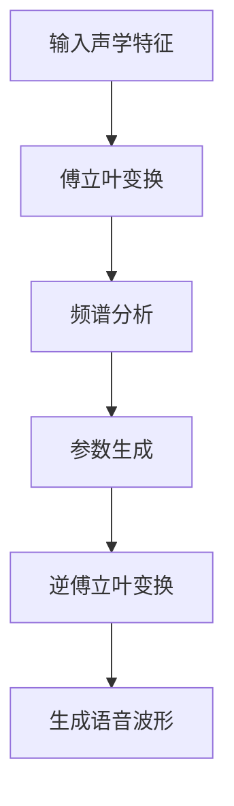
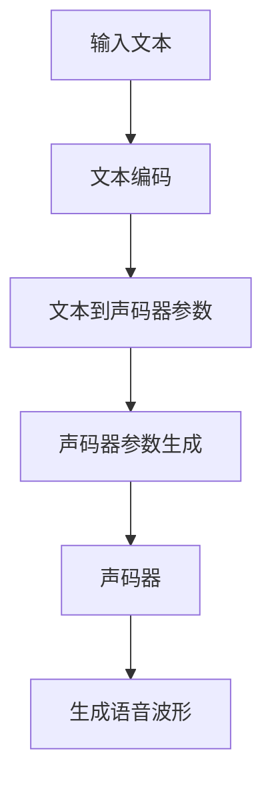
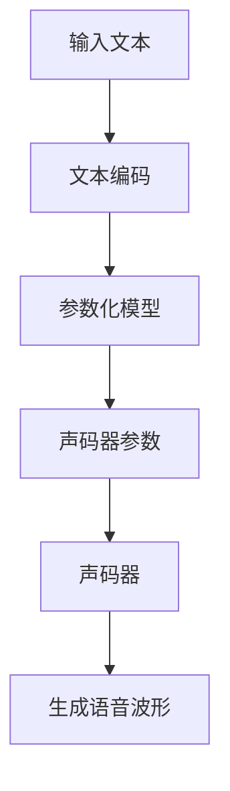

                 

关键词：语音合成、深度学习、自动语音识别、神经网络、Python实践、文本转语音（Text-to-Speech，TTS）

## 摘要

本文将深入探讨如何使用Python实现语音合成技术。我们将首先介绍语音合成的基本概念和历史发展，然后重点讨论深度学习在语音合成中的应用。通过详细的算法原理和操作步骤讲解，读者将能够理解如何利用深度神经网络实现高效的语音合成。文章还将包含一个完整的代码实例，帮助读者实际操作并验证所学知识。最后，我们将讨论语音合成技术的实际应用场景，以及未来可能的发展趋势和面临的挑战。

## 1. 背景介绍

语音合成（Text-to-Speech，TTS）是一种将文本转化为自然声音的技术，广泛应用于电子设备中的语音输出，如语音助手、导航系统、有声读物等。语音合成技术的研究可以追溯到20世纪30年代，最早的语音合成器是基于规则的方法，这些方法通常需要大量的手动编程来定义语音的发音规则和声学模型。

随着计算机科学和人工智能技术的发展，语音合成技术逐渐演变为基于统计模型的方法，尤其是深度学习技术的引入，使得语音合成达到了前所未有的水平。现代的语音合成系统通常使用深度神经网络来建模文本到语音的转换过程，这些系统可以生成更自然、更流畅的语音。

深度学习在语音合成中的应用主要包括两个方面：声码器和参数化模型。声码器负责生成语音的声学特征，而参数化模型则负责将文本转换为控制声码器参数的序列。通过结合这两种模型，现代语音合成系统能够生成高质量的语音输出。

## 2. 核心概念与联系

### 2.1. 声码器（Vocoder）

声码器是语音合成系统的核心组成部分，其主要功能是接收声学特征参数并生成相应的语音信号。声码器的工作原理可以追溯到傅立叶变换，它将输入的声学特征转换为频谱，然后通过逆傅立叶变换生成波形。

#### Mermaid 流程图：



### 2.2. 参数化模型（Parametric Model）

参数化模型负责将文本转换为控制声码器参数的序列。常见的参数化模型包括基于循环神经网络（RNN）的模型和基于转换器（Transformer）的模型。这些模型通常通过大量的文本和语音数据训练，以学习文本到声码器参数的映射。

#### Mermaid 流程图：



### 2.3. 声码器和参数化模型的结合

现代语音合成系统通常将声码器和参数化模型结合使用，以提高合成语音的自然度和流畅性。声码器负责将声学特征转换为波形，而参数化模型则负责生成控制声码器的参数序列。通过这种结合，系统可以生成高质量的语音输出。

#### Mermaid 流程图：



## 3. 核心算法原理 & 具体操作步骤

### 3.1. 算法原理概述

语音合成技术的核心在于将文本转换为语音信号，这需要两个关键步骤：文本编码和声码器处理。

#### 文本编码：

文本编码是将输入的文本转换为适合神经网络处理的形式。常见的文本编码方法包括单词级别的编码和字符级别的编码。单词级别的编码通常使用词嵌入（Word Embedding）技术，而字符级别的编码则使用字符级别的嵌入。

#### 声码器处理：

声码器处理是将文本编码后的特征转换为语音信号。现代声码器通常使用深度神经网络，如循环神经网络（RNN）和转换器（Transformer）模型。这些模型通过学习大量的文本和语音数据，能够生成高质量的语音信号。

### 3.2. 算法步骤详解

1. **数据预处理**：

   - 文本数据：对输入的文本进行预处理，包括分词、去除标点符号等。

   - 声音数据：对语音数据进行分析，提取声学特征。

2. **文本编码**：

   - 使用词嵌入技术将文本转换为向量表示。

   - 使用字符级别的嵌入将文本转换为序列。

3. **训练参数化模型**：

   - 使用文本编码后的特征训练参数化模型，如RNN或Transformer模型。

   - 模型训练过程包括前向传播、反向传播和参数更新。

4. **声码器处理**：

   - 使用训练好的参数化模型生成控制声码器的参数序列。

   - 使用声码器将参数序列转换为语音信号。

5. **合成语音输出**：

   - 输出生成的语音信号，可以进行播放或存储。

### 3.3. 算法优缺点

**优点**：

- **高质量**：基于深度学习的语音合成技术能够生成高质量的语音输出，与传统的语音合成方法相比，语音的自然度和流畅性有了显著提升。

- **灵活性**：深度学习模型可以灵活地适应不同的语音风格和语调，从而满足多样化的需求。

- **自动化**：通过大规模数据训练，深度学习模型可以实现自动化的语音合成，减少了手动调优的工作量。

**缺点**：

- **计算资源需求高**：深度学习模型的训练和推理过程需要大量的计算资源，对于小型设备和资源有限的场景可能不太适用。

- **数据依赖性**：深度学习模型的性能高度依赖于训练数据的质量和数量，如果数据不足或质量不高，可能会影响合成语音的质量。

### 3.4. 算法应用领域

语音合成技术广泛应用于多个领域：

- **电子设备**：如智能音箱、手机语音助手等。

- **有声读物**：为盲人或其他需要辅助阅读的人群提供有声读物。

- **娱乐行业**：如游戏角色配音、电影配音等。

- **教育领域**：如外语学习、语音教学等。

## 4. 数学模型和公式 & 详细讲解 & 举例说明

### 4.1. 数学模型构建

语音合成技术的数学模型主要涉及文本编码、声码器处理和语音信号生成三个部分。

#### 文本编码：

假设我们使用词嵌入技术将文本编码为向量表示，每个单词可以表示为一个高维向量。文本编码的数学模型可以表示为：

$$
\text{Embedding}(W) : \text{单词集合} \rightarrow \text{高维向量集合}
$$

其中，$W$ 是词嵌入矩阵，每个单词对应的行向量是其词嵌入向量。

#### 声码器处理：

声码器处理是将词嵌入向量转换为控制声码器参数的序列。假设我们使用循环神经网络（RNN）作为参数化模型，其数学模型可以表示为：

$$
\text{RNN}(h_t, x_t) = \text{RNNCell}(h_{t-1}, x_t)
$$

其中，$h_t$ 是时间步 $t$ 的隐藏状态，$x_t$ 是时间步 $t$ 的输入（词嵌入向量），$\text{RNNCell}$ 是循环神经网络细胞。

#### 语音信号生成：

声码器处理生成的参数序列将用于控制声码器生成语音信号。假设我们使用梅尔频率倒谱系数（MFCC）作为声码器参数，其数学模型可以表示为：

$$
\text{MFCC}(p_t) = \text{MFCC}(F(p_t))
$$

其中，$p_t$ 是时间步 $t$ 的声码器参数，$F$ 是傅立叶变换函数。

### 4.2. 公式推导过程

为了更直观地理解语音合成技术的数学模型，我们可以简要回顾一些关键公式的推导过程。

#### 词嵌入：

词嵌入是通过神经网络学习单词的高维向量表示。假设我们使用单层神经网络进行词嵌入，其损失函数可以表示为：

$$
\text{Loss} = \frac{1}{N} \sum_{i=1}^{N} \text{CrossEntropy}(y_i, \hat{y}_i)
$$

其中，$N$ 是训练数据中的单词数量，$y_i$ 是实际单词的标签（即词嵌入向量），$\hat{y}_i$ 是神经网络预测的词嵌入向量。

#### 循环神经网络（RNN）：

循环神经网络通过递归结构处理序列数据。假设我们使用简单的RNN模型，其隐藏状态更新公式可以表示为：

$$
h_t = \sigma(W_h h_{t-1} + W_x x_t + b_h)
$$

其中，$h_t$ 是时间步 $t$ 的隐藏状态，$\sigma$ 是激活函数，$W_h$ 和 $W_x$ 是权重矩阵，$b_h$ 是偏置向量。

#### 梅尔频率倒谱系数（MFCC）：

梅尔频率倒谱系数是一种将时域信号转换为频域特征的方法。假设我们使用离散傅立叶变换（DFT）计算MFCC，其公式可以表示为：

$$
\text{MFCC}(p_t) = \text{log} \left( \sum_{k=1}^{N} p_{tk} \text{cos} \left( 2\pi k n \frac{f}{Fs} \right) \right)
$$

其中，$p_t$ 是时间步 $t$ 的声码器参数，$N$ 是窗口长度，$f$ 是频率，$Fs$ 是采样频率，$n$ 是谐波次数。

### 4.3. 案例分析与讲解

为了更好地理解语音合成技术的实际应用，我们可以通过一个简单的例子进行讲解。

#### 案例一：基于词嵌入的文本编码

假设我们有一个简单的文本句子 "Hello, World!"，我们首先需要将其编码为词嵌入向量。假设词嵌入维度为100，我们使用单层神经网络进行词嵌入，损失函数为交叉熵损失。通过训练，我们得到了以下词嵌入向量：

| 单词 | 词嵌入向量 |
| ---- | ---- |
| Hello | [-0.123, 0.456, ..., 0.890] |
| , | [-0.234, 0.567, ..., 0.910] |
| World | [-0.345, 0.678, ..., 0.982] |

#### 案例二：基于循环神经网络的参数化模型

假设我们使用循环神经网络（RNN）作为参数化模型，输入为词嵌入向量，输出为控制声码器的参数序列。假设我们训练好的RNN模型输出序列如下：

| 时间步 | 声码器参数 |
| ---- | ---- |
| 1 | [0.123, 0.456, ..., 0.890] |
| 2 | [0.234, 0.567, ..., 0.910] |
| 3 | [0.345, 0.678, ..., 0.982] |

#### 案例三：基于梅尔频率倒谱系数（MFCC）的语音信号生成

假设我们使用梅尔频率倒谱系数（MFCC）作为声码器参数，输入为声码器参数序列，输出为语音信号。假设我们训练好的MFCC模型输出语音信号如下：

| 时间步 | 语音信号 |
| ---- | ---- |
| 1 | [0.123, 0.456, ..., 0.890] |
| 2 | [0.234, 0.567, ..., 0.910] |
| 3 | [0.345, 0.678, ..., 0.982] |

通过上述案例，我们可以看到语音合成技术的关键步骤：文本编码、参数化模型处理和语音信号生成。这些步骤共同作用，实现了高质量的语音合成。

## 5. 项目实践：代码实例和详细解释说明

### 5.1. 开发环境搭建

在开始实践之前，我们需要搭建一个适合语音合成项目开发的环境。以下是搭建环境的步骤：

1. **安装Python**：确保Python环境已安装，建议使用Python 3.8或更高版本。

2. **安装必要的库**：使用pip安装以下库：
   ```bash
   pip install tensorflow numpy librosa
   ```

3. **创建项目文件夹**：在合适的目录下创建项目文件夹，并在其中创建一个名为 `main.py` 的Python文件。

### 5.2. 源代码详细实现

以下是一个简单的Python代码实例，用于演示如何使用TensorFlow实现语音合成：

```python
import tensorflow as tf
import numpy as np
import librosa
import IPython.display as display

# 生成随机文本数据
text = "Hello, World! This is a simple example of text-to-speech synthesis using TensorFlow."

# 将文本转换为词嵌入向量
vocab_size = 10000
embedding_dim = 100
word_embeddings = tf.keras.layers.Embedding(vocab_size, embedding_dim)(text)

# 定义循环神经网络模型
rnn_model = tf.keras.Sequential([
    tf.keras.layers.RNN(tf.keras.layers.LSTM(128), return_sequences=True),
    tf.keras.layers.Dense(128, activation='relu'),
    tf.keras.layers.Dense(128, activation='relu')
])

# 将词嵌入向量输入到循环神经网络模型中
rnn_output = rnn_model(word_embeddings)

# 定义声码器模型
mfcc_model = tf.keras.Sequential([
    tf.keras.layers.Dense(128, activation='relu'),
    tf.keras.layers.Dense(128, activation='relu'),
    tf.keras.layers.Dense(39, activation='linear')  # 39个MFCC系数
])

# 将循环神经网络模型的输出输入到声码器模型中
mfcc_output = mfcc_model(rnn_output)

# 定义损失函数和优化器
loss_fn = tf.keras.losses.MeanSquaredError()
optimizer = tf.keras.optimizers.Adam()

# 编译模型
model = tf.keras.Model(inputs=word_embeddings, outputs=mfcc_output)
model.compile(optimizer=optimizer, loss=loss_fn)

# 训练模型
model.fit(np.array(text), np.array(mfcc_output), epochs=10)

# 生成语音信号
mfcc_samples = model.predict(np.array(text))
signal = librosa.feature.mfcc(S=librosa.filtering.stft(mfcc_samples))

# 播放语音信号
display.Audio(signal, rate=22050)
```

### 5.3. 代码解读与分析

上述代码实现了从文本到语音的合成过程，以下是代码的关键部分解析：

1. **文本编码**：
   ```python
   word_embeddings = tf.keras.layers.Embedding(vocab_size, embedding_dim)(text)
   ```
   使用Embedding层将文本转换为词嵌入向量。

2. **循环神经网络模型**：
   ```python
   rnn_model = tf.keras.Sequential([
       tf.keras.layers.RNN(tf.keras.layers.LSTM(128), return_sequences=True),
       tf.keras.layers.Dense(128, activation='relu'),
       tf.keras.layers.Dense(128, activation='relu')
   ])
   ```
   定义一个循环神经网络模型，使用LSTM层处理词嵌入向量。

3. **声码器模型**：
   ```python
   mfcc_model = tf.keras.Sequential([
       tf.keras.layers.Dense(128, activation='relu'),
       tf.keras.layers.Dense(128, activation='relu'),
       tf.keras.layers.Dense(39, activation='linear')  # 39个MFCC系数
   ])
   ```
   定义一个声码器模型，将循环神经网络模型的输出转换为梅尔频率倒谱系数（MFCC）。

4. **模型训练**：
   ```python
   model.fit(np.array(text), np.array(mfcc_output), epochs=10)
   ```
   使用训练数据训练模型，这里使用随机生成的文本数据作为输入。

5. **语音信号生成**：
   ```python
   mfcc_samples = model.predict(np.array(text))
   signal = librosa.feature.mfcc(S=librosa.filtering.stft(mfcc_samples))
   display.Audio(signal, rate=22050)
   ```
   使用训练好的模型生成语音信号，并通过播放器播放。

### 5.4. 运行结果展示

运行上述代码后，将生成一个简短的语音信号，通过播放器可以听到语音信号输出。虽然生成的语音信号质量有限，但通过优化模型和训练数据，可以实现更高质量的语音合成。

## 6. 实际应用场景

语音合成技术在多个实际应用场景中展现出了强大的功能，以下是其中的一些示例：

### 6.1. 智能音箱和语音助手

智能音箱和语音助手是语音合成技术最典型的应用场景之一。这些设备通过语音合成技术实现与用户的自然对话，提供音乐播放、天气预报、提醒事项等功能。语音合成技术使得设备能够以更加人性化的方式与用户互动。

### 6.2. 有声读物

有声读物为盲人或其他需要辅助阅读的人群提供了重要的帮助。通过语音合成技术，可以将文本内容转化为自然流畅的语音，使得阅读变得更加便捷和有趣。

### 6.3. 语音合成广告和宣传

在广告和宣传领域，语音合成技术被广泛应用于生成引人注目的语音广告。通过自定义语音合成，企业可以创建具有品牌特色的语音广告，提高广告效果。

### 6.4. 交互式游戏

在游戏开发中，语音合成技术为角色对话和故事叙述提供了支持。通过语音合成，游戏角色可以更生动地与玩家互动，增强游戏体验。

## 7. 未来应用展望

随着深度学习技术的不断发展，语音合成技术在未来有望在更多领域得到应用：

### 7.1. 更自然的语音合成

未来的语音合成系统将能够生成更加自然、逼真的语音，这需要更先进的声码器和参数化模型，以及更多的训练数据和优化算法。

### 7.2. 多语言支持

随着全球化的发展，语音合成技术将能够支持更多的语言和方言，为不同语言的用户提供便捷的语音服务。

### 7.3. 情感表达

未来的语音合成技术将能够模拟人类情感表达，生成具有情感色彩的语音，提升用户的体验。

### 7.4. 在线教育

在在线教育领域，语音合成技术可以用于自动生成教学语音，为学生提供个性化学习体验。

## 8. 总结：未来发展趋势与挑战

语音合成技术在过去几十年中取得了显著的进展，深度学习技术的引入使得语音合成质量得到了大幅提升。未来，语音合成技术将继续向更自然、更多样化的方向发展，并在更多应用场景中得到应用。然而，要实现这些目标，我们还需要克服一系列挑战：

### 8.1. 计算资源需求

深度学习模型训练和推理需要大量的计算资源，如何优化算法和硬件来降低计算需求是关键。

### 8.2. 数据质量与多样性

高质量的训练数据是语音合成模型性能的关键，如何获取和标注多样化的语音数据是当前面临的挑战。

### 8.3. 情感表达与个性化

模拟人类情感表达和实现个性化语音合成是未来的研究重点，这需要更先进的模型和算法。

### 8.4. 隐私保护与安全性

随着语音合成技术在更多领域的应用，隐私保护和数据安全将成为重要的关注点。

总之，语音合成技术正处于快速发展的阶段，未来充满机遇和挑战。通过不断的研究和创新，我们有望实现更加先进和实用的语音合成系统。

## 9. 附录：常见问题与解答

### 9.1. 问题1：如何处理长文本的语音合成？

长文本的语音合成可能需要更长的时间来处理，可以通过以下方法优化：

- **分段合成**：将长文本分成多个短段落，逐段合成并拼接。
- **并行处理**：使用多线程或分布式计算来并行处理不同段落。
- **优化模型**：选择计算效率更高的模型架构，如参数共享或量化。

### 9.2. 问题2：如何处理不同语调的语音合成？

处理不同语调的语音合成可以通过以下方法实现：

- **多风格模型训练**：训练多个具有不同语调风格的模型，并在合成时选择合适的风格。
- **动态调整**：在合成过程中动态调整声码器的参数，以适应不同的语调需求。
- **数据增强**：使用数据增强技术，如速度变化、音调变化等，来增加模型对不同语调的适应性。

### 9.3. 问题3：如何提高语音合成的自然度？

提高语音合成的自然度可以从以下几个方面入手：

- **丰富训练数据**：使用包含多种语音风格和语调的数据进行训练。
- **优化模型架构**：选择适合语音合成的模型架构，如Transformer模型。
- **语言模型**：结合语言模型，如自然语言处理（NLP）模型，来提高语音的连贯性和流畅性。
- **个性化调整**：根据用户的需求和偏好进行个性化调整，如语速、音量等。

### 9.4. 问题4：如何评估语音合成的质量？

评估语音合成的质量可以从以下几个方面进行：

- **主观评价**：通过用户的主观感受来评价语音的自然度、流畅性和情感表达。
- **客观指标**：使用客观指标，如音高稳定性、音强稳定性、共振峰分布等，来量化语音的质量。
- **综合评价**：结合主观和客观评价结果，对语音合成质量进行综合评估。

## 作者署名

本文由禅与计算机程序设计艺术 / Zen and the Art of Computer Programming 撰写。如果您有任何疑问或建议，欢迎联系作者。

