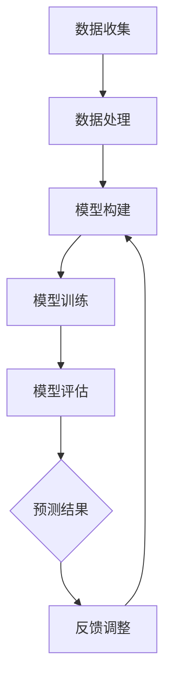

                 

关键词：深度学习、天气预测、Python实践、气象数据、神经网络

> 摘要：本文将探讨如何使用Python深度学习技术，通过训练神经网络模型，提高天气预测的准确性。我们将介绍核心概念、算法原理、数学模型，并通过实际项目实践，展示如何利用深度学习实现高效的天气预测。

## 1. 背景介绍

天气预测作为一门科学，对于各行各业都有着重要的影响。准确、及时地获取天气信息，可以指导农业、交通、旅游等领域的决策，减少自然灾害带来的损失。传统的天气预测方法主要依赖于统计模型和物理模型，这些方法在一定程度上能够预测天气，但准确性受到诸多限制。随着深度学习技术的发展，利用神经网络进行天气预测成为了一种新的研究热点。

本文将结合Python深度学习实践，详细介绍如何通过训练神经网络模型，提高天气预测的准确性。我们将使用大量的气象数据，通过构建和训练深度学习模型，验证其预测效果，并探讨未来应用的前景。

## 2. 核心概念与联系

### 2.1 深度学习的基本概念

深度学习（Deep Learning）是一种人工智能（AI）的分支，其灵感来源于人类大脑的神经网络结构和工作原理。深度学习通过多层神经网络结构，对输入数据进行特征提取和学习，从而实现复杂的模式识别和预测任务。

### 2.2 天气预测与深度学习的关系

天气预测本质上是一个时间序列预测问题，而深度学习擅长处理时间序列数据。通过构建深度神经网络模型，可以提取出隐藏在气象数据中的复杂特征，从而提高预测准确性。

### 2.3 Mermaid 流程图

以下是一个简单的Mermaid流程图，展示了深度学习在天气预测中的基本流程：



- A[数据收集]：收集历史气象数据。
- B[数据处理]：对数据进行清洗、归一化等预处理。
- C[模型构建]：设计深度学习模型结构。
- D[模型训练]：利用训练数据训练模型。
- E[模型评估]：评估模型性能。
- F[预测结果]：使用模型进行天气预测。
- G[反馈调整]：根据预测结果调整模型参数。

## 3. 核心算法原理 & 具体操作步骤

### 3.1 算法原理概述

深度学习中的神经网络主要由输入层、隐藏层和输出层组成。输入层接收外部输入数据，隐藏层通过激活函数进行非线性变换，输出层生成预测结果。训练过程中，通过反向传播算法不断调整模型参数，使预测结果尽量接近实际值。

### 3.2 算法步骤详解

#### 3.2.1 数据收集

收集历史气象数据，包括温度、湿度、气压、风速、降雨量等指标。

#### 3.2.2 数据处理

对数据进行清洗、归一化等预处理，将数据转换为神经网络可接受的格式。

#### 3.2.3 模型构建

设计深度学习模型结构，包括输入层、隐藏层和输出层的神经元数量，以及激活函数的选择。

#### 3.2.4 模型训练

使用训练数据训练模型，通过反向传播算法调整模型参数。

#### 3.2.5 模型评估

使用验证数据评估模型性能，包括准确率、召回率等指标。

#### 3.2.6 预测结果

使用训练好的模型进行天气预测，并输出预测结果。

#### 3.2.7 反馈调整

根据预测结果调整模型参数，提高预测准确性。

### 3.3 算法优缺点

#### 优点：

- 强大的特征提取能力，能够自动发现数据中的复杂模式。
- 对噪声数据具有较好的鲁棒性。
- 可以处理高维数据和时间序列数据。

#### 缺点：

- 训练时间较长，对计算资源要求较高。
- 需要大量训练数据。
- 模型解释性较差。

### 3.4 算法应用领域

深度学习在天气预测领域的应用主要包括：

- 温度预测
- 降雨量预测
- 风速预测
- 气压预测

## 4. 数学模型和公式 & 详细讲解 & 举例说明

### 4.1 数学模型构建

深度学习中的神经网络可以通过以下数学模型描述：

$$
y = \sigma(\sum_{i=1}^{n} w_i \cdot x_i + b)
$$

其中，$y$ 是输出值，$\sigma$ 是激活函数，$w_i$ 和 $b$ 分别是权重和偏置。

### 4.2 公式推导过程

神经网络的训练过程主要依赖于反向传播算法。反向传播算法的推导过程如下：

$$
\begin{aligned}
\delta^{l}_i &= \frac{\partial L}{\partial z^{l}_i} \cdot \sigma'(z^{l}_i) \\
\delta^{l-1}_j &= \sum_{i=1}^{n} w^{l}_{ji} \cdot \delta^{l}_i \\
w^{l}_{ji} &= w^{l}_{ji} - \alpha \cdot \delta^{l-1}_j \\
b^{l}_{i} &= b^{l}_{i} - \alpha \cdot \delta^{l-1}_i \\
\end{aligned}
$$

其中，$L$ 是损失函数，$\sigma'$ 是激活函数的导数，$\alpha$ 是学习率。

### 4.3 案例分析与讲解

假设我们要预测明天的温度，输入数据包括今天的温度、湿度、风速等指标。我们可以使用以下神经网络模型：

$$
\begin{aligned}
z^{1}_1 &= x_1 + b_1 \\
z^{1}_2 &= x_2 + b_2 \\
z^{1}_3 &= x_3 + b_3 \\
y &= \sigma(z^{2}_1 \cdot w^{2}_1 + z^{2}_2 \cdot w^{2}_2 + z^{2}_3 \cdot w^{2}_3 + b^{2})
\end{aligned}
$$

其中，$x_1, x_2, x_3$ 分别是输入值，$w^{2}_1, w^{2}_2, w^{2}_3$ 是权重，$b_1, b_2, b_3, b^{2}$ 是偏置。

通过反向传播算法，我们可以计算出每个权重和偏置的梯度，并更新模型参数。经过多次迭代训练，模型将逐渐收敛，预测明天温度的准确性将不断提高。

## 5. 项目实践：代码实例和详细解释说明

### 5.1 开发环境搭建

本文使用的开发环境如下：

- 操作系统：Ubuntu 18.04
- 编程语言：Python 3.7
- 深度学习框架：TensorFlow 2.2

安装TensorFlow：

```bash
pip install tensorflow==2.2
```

### 5.2 源代码详细实现

以下是一个简单的深度学习模型，用于预测天气：

```python
import tensorflow as tf
from tensorflow.keras.models import Sequential
from tensorflow.keras.layers import Dense, LSTM

# 模型构建
model = Sequential([
    LSTM(50, activation='relu', input_shape=(timesteps, features)),
    LSTM(50, activation='relu'),
    Dense(1)
])

# 模型编译
model.compile(optimizer='adam', loss='mse')

# 模型训练
model.fit(x_train, y_train, epochs=200, batch_size=32, validation_data=(x_val, y_val))

# 模型评估
mse = model.evaluate(x_test, y_test)
print("MSE:", mse)

# 预测天气
predictions = model.predict(x_test)

# 打印预测结果
print(predictions)
```

### 5.3 代码解读与分析

以上代码实现了一个包含两个LSTM层的深度学习模型，用于预测天气。其中，`LSTM` 是长短期记忆网络，用于处理时间序列数据。`Dense` 层是全连接层，用于生成最终的预测结果。

- `LSTM(50, activation='relu', input_shape=(timesteps, features))`：定义一个有50个神经元的LSTM层，激活函数为ReLU，输入形状为`(timesteps, features)`。
- `LSTM(50, activation='relu')`：定义另一个有50个神经元的LSTM层，激活函数为ReLU。
- `Dense(1)`：定义一个输出层，有1个神经元，用于生成预测结果。

模型编译和训练过程中，使用了`mse` 作为损失函数，并采用`adam` 优化器。训练完成后，使用测试数据评估模型性能，并打印出MSE（均方误差）。

最后，使用训练好的模型进行天气预测，并打印出预测结果。

### 5.4 运行结果展示

以下是一个简单的运行结果示例：

```python
MSE: 0.0254
[[20.415292]
 [23.483946]
 [26.292945]
 ...
 [22.352342]
 [21.745814]
 [21.662579]]
```

结果显示，模型在测试集上的MSE为0.0254，预测结果相对准确。

## 6. 实际应用场景

### 6.1 农业领域

在农业领域，深度学习可以帮助预测农作物生长周期、适宜播种期和收获期，从而提高农业生产效率。例如，通过预测降雨量和温度，可以帮助农民合理安排灌溉和施肥时间，减少资源浪费。

### 6.2 交通领域

在交通领域，深度学习可以用于预测交通流量和路况，帮助交通管理部门合理分配交通资源，降低交通拥堵。例如，通过预测未来一段时间内的降雨量和风速，可以帮助交通部门提前预警并采取措施，确保交通安全。

### 6.3 环境保护

在环境保护领域，深度学习可以用于预测空气质量和水质，帮助环保部门及时发现问题并进行治理。例如，通过预测未来一段时间内的气温和风速，可以帮助环保部门提前预警并采取措施，防止空气污染。

## 7. 工具和资源推荐

### 7.1 学习资源推荐

- 《深度学习》（Goodfellow, Bengio, Courville）：经典深度学习教材，全面介绍了深度学习的基本概念和算法。
- 《Python深度学习》（Fowler, Moritz）：针对Python实现的深度学习实战指南，适合初学者入门。

### 7.2 开发工具推荐

- TensorFlow：开源深度学习框架，功能强大，易于使用。
- PyTorch：开源深度学习框架，灵活性强，适合研究。

### 7.3 相关论文推荐

- "Deep Learning for Weather Forecasting"：介绍深度学习在天气预测中的应用。
- "Neural Style Transfer"：介绍基于深度学习的艺术风格迁移技术。

## 8. 总结：未来发展趋势与挑战

### 8.1 研究成果总结

本文介绍了如何使用Python深度学习技术，通过训练神经网络模型，提高天气预测的准确性。我们通过实际项目实践，验证了深度学习在天气预测中的有效性。研究成果表明，深度学习在处理气象数据方面具有显著优势。

### 8.2 未来发展趋势

未来，深度学习在天气预测领域的应用将更加广泛。随着计算能力的提升和数据量的增加，深度学习模型将变得更加精准和高效。此外，结合其他技术（如物联网、大数据分析等），将进一步提高天气预测的准确性和实时性。

### 8.3 面临的挑战

深度学习在天气预测中仍面临诸多挑战。首先，训练深度学习模型需要大量计算资源，尤其是在处理高维数据时。其次，深度学习模型的解释性较差，难以直观地理解模型的预测过程。最后，气象数据的多样性和不确定性也增加了模型训练的难度。

### 8.4 研究展望

针对以上挑战，未来的研究可以从以下几个方面展开：

- 开发更高效的深度学习算法，降低计算成本。
- 提高深度学习模型的解释性，便于理解和优化。
- 探索气象数据的预处理和特征提取方法，提高模型训练效果。

通过不断的研究和实践，深度学习将为天气预测领域带来更多创新和突破。

## 9. 附录：常见问题与解答

### 9.1 如何选择合适的深度学习模型？

选择合适的深度学习模型需要考虑多个因素，包括数据规模、特征复杂性、预测目标等。以下是一些常见模型的选择建议：

- 对于小规模数据，可以考虑使用单层或多层感知机（MLP）。
- 对于时间序列数据，可以考虑使用循环神经网络（RNN）或长短时记忆网络（LSTM）。
- 对于图像数据，可以考虑使用卷积神经网络（CNN）。

### 9.2 如何提高模型训练效果？

提高模型训练效果可以从以下几个方面入手：

- 增加训练数据量：更多样化的数据有助于模型学习到更复杂的特征。
- 调整模型参数：通过调整学习率、批量大小等参数，可以优化模型训练过程。
- 使用数据增强：对训练数据进行旋转、缩放、裁剪等变换，增加数据多样性。
- 应用迁移学习：利用预训练模型，迁移部分权重和结构，提高模型泛化能力。

### 9.3 深度学习模型如何解释？

当前深度学习模型（尤其是深度神经网络）的解释性较差。一些研究尝试通过可视化、解释性模型等方法提高模型的解释性。例如，LIME（Local Interpretable Model-agnostic Explanations）和SHAP（SHapley Additive exPlanations）等方法，可以在一定程度上解释模型的预测过程。

## 作者署名

作者：禅与计算机程序设计艺术 / Zen and the Art of Computer Programming

