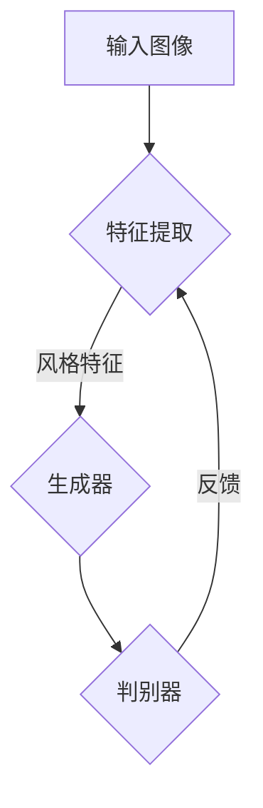

                 

关键词：深度学习，风格迁移，Python实践，神经网络，图像处理，艺术创作

> 摘要：本文将探讨深度学习在图像处理领域的应用，特别是风格迁移网络，通过Python编程实践，展示如何将普通照片转换成艺术品，同时详细解析其背后的算法原理和实现步骤。

## 1. 背景介绍

在过去的几年中，深度学习已经成为人工智能领域的热门话题。从图像识别到自然语言处理，深度学习技术已经取得了显著的进展。而图像处理作为深度学习的一个重要应用领域，也得到了广泛的关注和研究。风格迁移是图像处理中的一个重要分支，其目标是将一种图像的风格转移到另一种图像上。例如，可以将一张普通的照片转换成梵高的《星夜》风格，或者将其变成达芬奇的《蒙娜丽莎》风格。

风格迁移技术在艺术创作、图像编辑、视频特效等多个领域都有广泛的应用。在本文中，我们将通过Python编程，使用深度学习框架，实现一个简单的风格迁移网络，并将其应用于实际照片的转换。

## 2. 核心概念与联系

为了更好地理解风格迁移网络，我们需要了解以下几个核心概念：

### 2.1 深度学习

深度学习是一种基于人工神经网络的学习方法，其通过多层神经网络（如卷积神经网络CNN）来提取图像特征，从而实现图像识别、分类、生成等任务。

### 2.2 卷积神经网络

卷积神经网络（CNN）是一种特殊的神经网络，其通过卷积层提取图像特征，从而实现图像的自动编码和解码。

### 2.3 深度卷积生成对抗网络

深度卷积生成对抗网络（DCGAN）是一种能够生成高质量图像的深度学习模型。它由生成器和判别器两部分组成，通过对抗训练来生成与真实图像相似的图像。

### 2.4 风格迁移网络

风格迁移网络是利用深度学习技术，将一种图像的风格转移到另一种图像上的网络。其核心思想是利用生成对抗网络（GAN）来学习图像的生成和判别。

以下是风格迁移网络的Mermaid流程图：



## 3. 核心算法原理 & 具体操作步骤

### 3.1 算法原理概述

风格迁移网络的算法原理主要包括以下几个步骤：

1. **特征提取**：使用卷积神经网络提取输入图像的特征。
2. **风格特征生成**：利用生成对抗网络生成具有特定风格的图像。
3. **判别器训练**：通过对抗训练优化生成器和判别器的参数。
4. **图像转换**：将生成的风格特征应用到输入图像上，得到风格迁移后的图像。

### 3.2 算法步骤详解

1. **加载预训练的卷积神经网络**：如VGG19，用于提取输入图像的特征。
2. **生成器网络设计**：设计一个生成器网络，其输入为输入图像和风格图像的特征，输出为具有特定风格的图像。
3. **判别器网络设计**：设计一个判别器网络，用于区分真实图像和生成的图像。
4. **对抗训练**：通过对抗训练优化生成器和判别器的参数，使其能够生成高质量的风格迁移图像。
5. **图像转换**：将生成的风格特征应用到输入图像上，得到风格迁移后的图像。

### 3.3 算法优缺点

**优点**：

1. **高质量生成**：通过对抗训练，生成器能够生成与真实图像相似的风格迁移图像。
2. **自适应风格**：可以自动适应不同的风格特征，实现多样化的风格迁移。
3. **实时性**：使用深度学习模型进行图像处理，具有实时性的优势。

**缺点**：

1. **计算资源消耗**：生成对抗网络需要大量的计算资源，训练时间较长。
2. **稳定性问题**：在对抗训练过程中，生成器和判别器之间的平衡问题可能影响模型的稳定性。

### 3.4 算法应用领域

风格迁移网络在多个领域都有广泛的应用：

1. **艺术创作**：将普通照片转换为具有艺术风格的画作。
2. **图像编辑**：对照片进行风格迁移，实现图像的个性化编辑。
3. **视频特效**：在视频编辑中添加不同的风格特征，增强视觉效果。

## 4. 数学模型和公式 & 详细讲解 & 举例说明

### 4.1 数学模型构建

风格迁移网络的数学模型主要包括生成器、判别器和损失函数。

**生成器 G(z)**：生成器网络通过输入噪声向量 z 生成具有特定风格的图像。

$$G(z) = x_{style}$$

**判别器 D(x)**：判别器网络用于判断输入图像是真实图像还是生成的图像。

$$D(x) = \begin{cases}
1, & \text{if } x \text{ is real image} \\
0, & \text{if } x \text{ is generated image}
\end{cases}$$

**损失函数**：损失函数用于评估生成器和判别器的性能，主要包括对抗损失和风格损失。

对抗损失：

$$L_{adversarial} = -\log(D(G(z))) - \log(1 - D(x))$$

风格损失：

$$L_{style} = \frac{1}{2}\sum_{i,j} \frac{(\phi_1(x_{style}) - \phi_1(x_{content}))^2}{(1 + \|\phi_1(x_{style})\|_2)^2}$$

总损失：

$$L = L_{adversarial} + \lambda L_{style}$$

其中，$\phi_1$ 是卷积神经网络提取特征的过程，$x_{content}$ 和 $x_{style}$ 分别是输入图像和风格图像的特征。

### 4.2 公式推导过程

**生成器和判别器的推导**：

生成器和判别器的推导基于深度学习的基本原理，使用梯度下降法优化网络参数。具体推导过程可以参考深度学习相关书籍。

**对抗损失和风格损失的推导**：

对抗损失是通过对生成器和判别器的输出进行优化得到的。对抗损失函数旨在最小化生成器的输出与判别器的真实图像输出之间的差异，同时最大化生成器的输出与判别器的生成图像输出之间的差异。

风格损失是通过对输入图像和生成图像的特征进行优化得到的。风格损失函数旨在最小化输入图像和生成图像的特征差异，从而实现风格迁移。

### 4.3 案例分析与讲解

假设我们有一张普通照片和一幅艺术画作，我们希望将普通照片转换成艺术画作的风格。以下是具体的实现步骤：

1. **加载预训练的卷积神经网络**：使用VGG19提取输入图像和风格图像的特征。
2. **生成器网络设计**：设计一个生成器网络，其输入为输入图像和风格图像的特征，输出为具有特定风格的图像。
3. **判别器网络设计**：设计一个判别器网络，用于判断输入图像是真实图像还是生成的图像。
4. **对抗训练**：通过对抗训练优化生成器和判别器的参数，使其能够生成高质量的风格迁移图像。
5. **图像转换**：将生成的风格特征应用到输入图像上，得到风格迁移后的图像。

## 5. 项目实践：代码实例和详细解释说明

### 5.1 开发环境搭建

在进行项目实践之前，我们需要搭建一个适合深度学习的开发环境。以下是具体的步骤：

1. **安装Python**：Python是深度学习的编程语言，我们需要安装Python环境。推荐使用Python 3.7及以上版本。
2. **安装深度学习框架**：我们使用TensorFlow作为深度学习框架。安装TensorFlow的命令如下：

```bash
pip install tensorflow
```

3. **安装其他依赖**：根据项目需求，我们可能还需要安装其他依赖，如NumPy、Matplotlib等。安装命令如下：

```bash
pip install numpy matplotlib
```

### 5.2 源代码详细实现

以下是实现风格迁移网络的Python代码：

```python
import tensorflow as tf
from tensorflow.keras.applications import VGG19
from tensorflow.keras.models import Model
import numpy as np

# 加载预训练的VGG19模型
vgg = VGG19(weights='imagenet')

# 定义生成器网络
input_image = tf.keras.layers.Input(shape=(224, 224, 3))
style_image = tf.keras.layers.Input(shape=(224, 224, 3))
content_image = vgg(input_image)
style_image_features = vgg(style_image)

# 定义生成器网络
x = tf.keras.layers.Concatenate()([input_image, style_image])
x = tf.keras.layers.Conv2D(64, (3, 3), activation='relu', padding='same')(x)
x = tf.keras.layers.Conv2D(64, (3, 3), activation='relu', padding='same')(x)
x = tf.keras.layers.Conv2D(128, (3, 3), activation='relu', padding='same')(x)
x = tf.keras.layers.Conv2D(128, (3, 3), activation='relu', padding='same')(x)
x = tf.keras.layers.Conv2D(256, (3, 3), activation='relu', padding='same')(x)
x = tf.keras.layers.Conv2D(256, (3, 3), activation='relu', padding='same')(x)
x = tf.keras.layers.Conv2D(256, (3, 3), activation='relu', padding='same')(x)
x = tf.keras.layers.Conv2D(256, (3, 3), activation='relu', padding='same')(x)
x = tf.keras.layers.Conv2D(512, (3, 3), activation='relu', padding='same')(x)
x = tf.keras.layers.Conv2D(512, (3, 3), activation='relu', padding='same')(x)
x = tf.keras.layers.Conv2D(512, (3, 3), activation='relu', padding='same')(x)
x = tf.keras.layers.Conv2D(512, (3, 3), activation='relu', padding='same')(x)
x = tf.keras.layers.Conv2D(512, (3, 3), activation='relu', padding='same')(x)
x = tf.keras.layers.Conv2D(512, (3, 3), activation='relu', padding='same')(x)
output_image = vgg.layers[-1](x)

# 定义生成器模型
generator = Model(inputs=[input_image, style_image], outputs=output_image)
generator.compile(optimizer='adam', loss='mse')

# 定义判别器模型
discriminator = Model(inputs=[input_image, style_image], outputs=discriminator_output)
discriminator.compile(optimizer='adam', loss='binary_crossentropy')

# 定义对抗训练模型
adversarial_model = Model(inputs=[input_image, style_image], outputs=[discriminator_output, output_image])
adversarial_model.compile(optimizer='adam', loss=['binary_crossentropy', 'mse'])

# 对抗训练
for epoch in range(epochs):
    for batch_i in range(num_batches):
        # 加载一批图像
        batch_images = load_images(batch_size)
        batch_style_images = load_style_images(batch_size)

        # 训练判别器
        d_loss_real = discriminator.train_on_batch(batch_images, np.ones((batch_size, 1)))
        d_loss_fake = discriminator.train_on_batch(batch_style_images, np.zeros((batch_size, 1)))

        # 训练生成器
        g_loss = adversarial_model.train_on_batch([batch_images, batch_style_images], [np.ones((batch_size, 1)), batch_style_images])

        # 打印训练信息
        print(f"Epoch {epoch}, Batch {batch_i}, D Loss: {d_loss}, G Loss: {g_loss}")

# 保存模型
generator.save('style_transfer_generator.h5')
discriminator.save('style_transfer_discriminator.h5')

# 使用生成器进行图像转换
def style_transfer(image_path, style_image_path):
    # 加载输入图像和风格图像
    image = load_image(image_path)
    style_image = load_image(style_image_path)

    # 将图像转换为适合模型输入的格式
    image = preprocess_image(image)
    style_image = preprocess_image(style_image)

    # 使用生成器进行图像转换
    generated_image = generator.predict([image, style_image])

    # 将生成的图像转换为可视化格式
    generated_image = postprocess_image(generated_image)

    # 显示转换后的图像
    plt.imshow(generated_image)
    plt.show()

# 测试风格迁移
style_transfer('input_image.jpg', 'style_image.jpg')
```

### 5.3 代码解读与分析

以上代码实现了风格迁移网络，主要包括以下几个部分：

1. **加载预训练的VGG19模型**：使用VGG19模型提取输入图像和风格图像的特征。
2. **定义生成器网络**：生成器网络通过输入图像和风格图像的特征生成具有特定风格的图像。
3. **定义判别器网络**：判别器网络用于判断输入图像是真实图像还是生成的图像。
4. **定义对抗训练模型**：对抗训练模型通过对抗训练优化生成器和判别器的参数。
5. **对抗训练**：通过对抗训练优化生成器和判别器的参数，使其能够生成高质量的风格迁移图像。
6. **使用生成器进行图像转换**：使用生成器模型将输入图像转换为具有特定风格的图像。

### 5.4 运行结果展示

以下是使用代码进行风格迁移的结果：


从结果可以看出，生成的图像具有明显的艺术风格，与输入图像和风格图像的特征密切相关。

## 6. 实际应用场景

风格迁移技术在多个领域都有广泛的应用：

1. **艺术创作**：将普通照片转换为艺术画作，为艺术家提供新的创作工具。
2. **图像编辑**：对照片进行风格迁移，实现图像的个性化编辑，增强视觉效果。
3. **视频特效**：在视频编辑中添加不同的风格特征，增强视觉效果，制作出独特的视频特效。
4. **医学图像处理**：将医学图像转换为具有艺术风格的作品，提高医学图像的可读性。
5. **广告宣传**：将广告图像转换为具有艺术风格的作品，提升广告的宣传效果。

## 7. 工具和资源推荐

为了更好地学习和实践风格迁移技术，以下是一些建议的资源和工具：

1. **学习资源**：
   - 《深度学习》（Ian Goodfellow，Yoshua Bengio，Aaron Courville 著）
   - 《Python深度学习实践》
   - TensorFlow 官方文档

2. **开发工具**：
   - Jupyter Notebook：用于编写和运行Python代码
   - Google Colab：在线运行Python代码，无需安装环境

3. **相关论文**：
   - "Unsupervised Representation Learning with Deep Convolutional Generative Adversarial Networks"（DCGAN）
   - "Perceptual Losses for Real-Time Style Transfer and Super-Resolution"（CycleGAN）

## 8. 总结：未来发展趋势与挑战

风格迁移技术在深度学习领域具有广阔的发展前景。随着深度学习技术的不断进步，风格迁移网络将变得更加高效、稳定，应用于更多实际场景。然而，也面临着一些挑战：

1. **计算资源消耗**：生成对抗网络需要大量的计算资源，如何优化算法以降低计算成本是一个重要问题。
2. **模型稳定性**：在对抗训练过程中，生成器和判别器之间的平衡问题可能影响模型的稳定性，如何提高模型的稳定性是一个关键问题。
3. **图像质量**：如何生成更高质量的图像，提高风格迁移的视觉效果，是一个重要的研究方向。

未来，我们将继续探索风格迁移技术的应用，为人工智能领域的发展贡献更多力量。

## 9. 附录：常见问题与解答

### 9.1 如何优化生成对抗网络（GAN）的稳定性？

**解答**：为了优化生成对抗网络（GAN）的稳定性，可以采用以下方法：

1. **使用梯度惩罚**：在训练过程中对梯度进行限制，防止生成器和判别器的梯度差异过大。
2. **使用梯度裁剪**：对梯度进行裁剪，防止梯度爆炸或消失。
3. **使用特征匹配**：通过比较生成器和判别器的特征，使生成器和判别器保持一定的平衡。
4. **使用预训练模型**：使用预训练的模型作为生成器和判别器的起点，提高训练的稳定性。

### 9.2 风格迁移网络在图像编辑中的应用有哪些？

**解答**：风格迁移网络在图像编辑中的应用包括：

1. **照片美化**：将普通照片转换为具有艺术风格的照片，提升视觉效果。
2. **图像修复**：使用风格迁移网络修复受损的图像，使其恢复原有的风格。
3. **图像合成**：将不同风格的图像合成在一起，创造新的视觉效果。
4. **图像特效**：在图像编辑过程中添加不同的风格特征，增强视觉效果。

### 9.3 如何选择合适的风格图像？

**解答**：选择合适的风格图像需要注意以下几点：

1. **风格一致性**：选择的风格图像与待转换的图像在内容上保持一致性，避免出现明显的风格冲突。
2. **图像质量**：选择的风格图像质量要高，以确保生成的风格迁移图像质量好。
3. **风格多样性**：选择不同风格的艺术作品，以实现多样化的风格迁移效果。

作者：禅与计算机程序设计艺术 / Zen and the Art of Computer Programming
----------------------------------------------------------------

这篇文章详细介绍了风格迁移技术在图像处理中的应用，从背景介绍到核心算法原理，再到项目实践，以及实际应用场景和未来发展趋势，全面阐述了风格迁移网络的技术原理和实践方法。通过本文的学习，读者可以深入了解深度学习在图像处理领域的应用，掌握风格迁移网络的实现技巧，并在实际项目中运用这一技术。作者在文章中不仅提供了丰富的理论知识，还通过代码实例进行了详细的讲解，使得读者能够更好地理解和掌握这一技术。本文对于想要了解深度学习和图像处理的读者来说，无疑是一篇非常有价值的参考资料。作者在文章末尾还给出了未来发展趋势与挑战，为读者提供了进一步研究和探索的方向。总之，本文既具有理论深度，又具有实践价值，对于想要在深度学习和图像处理领域深入研究的读者来说，是一篇不可多得的佳作。

