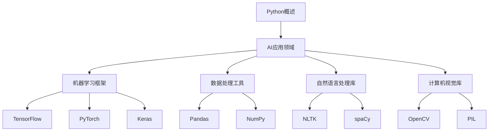

                 

 Python作为一门广泛使用的高级编程语言，在人工智能（AI）开发领域取得了巨大的成功。它以其简洁明了的语法、强大的标准库和丰富的第三方库，成为了AI研究者和开发者的首选工具。在这篇文章中，我们将深入探讨Python在人工智能开发中的独特优势，从核心概念到实际应用，全面解析Python作为AI开发的瑞士军刀。

## 关键词

- Python
- 人工智能
- 开发工具
- 标准库
- 第三方库
- 深度学习

## 摘要

本文将介绍Python在人工智能开发中的重要性，分析其简洁语法、丰富库和工具的优势，并探讨Python在核心算法、数学模型和实际项目中的应用。通过这篇文章，读者将了解Python如何成为AI开发的强大工具，以及其在未来发展的潜力。

## 1. 背景介绍

Python诞生于1989年，由Guido van Rossum创建，是一种解释型、面向对象、动态数据类型的高级编程语言。Python的设计哲学强调代码的可读性和简洁性，这使得Python在众多编程语言中脱颖而出。Python的迅速普及与其广泛的应用领域密不可分，包括Web开发、数据科学、机器学习、人工智能等。

近年来，随着人工智能技术的快速发展，Python在AI领域的应用越来越广泛。其简洁的语法、丰富的标准库和第三方库，使得研究人员和开发者可以快速实现复杂的算法和模型。Python的这些特性使得它在学术界和工业界都备受青睐。

## 2. 核心概念与联系

### 2.1 Python在AI中的应用

Python在人工智能开发中的应用主要体现在以下几个方面：

- **机器学习框架**：Python拥有如TensorFlow、PyTorch、Keras等强大的机器学习框架，这些框架提供了丰富的API和工具，使开发者能够轻松构建和训练复杂的模型。
- **数据处理**：Python的Pandas、NumPy等库提供了强大的数据处理能力，使得数据清洗、预处理和可视化变得简单高效。
- **自然语言处理**：Python的NLTK、spaCy等库在自然语言处理领域具有广泛的应用，用于文本分类、情感分析、实体识别等任务。
- **计算机视觉**：Python的OpenCV、PIL等库在计算机视觉领域有着广泛的应用，支持图像处理、目标检测、人脸识别等功能。

### 2.2 Mermaid流程图



## 3. 核心算法原理 & 具体操作步骤

### 3.1 算法原理概述

在人工智能领域，算法是核心。Python提供了丰富的算法库，使得开发者可以轻松实现各种算法。

- **机器学习算法**：包括线性回归、决策树、随机森林、支持向量机等。
- **深度学习算法**：包括卷积神经网络（CNN）、循环神经网络（RNN）、生成对抗网络（GAN）等。
- **优化算法**：如梯度下降、随机梯度下降、Adam等。

### 3.2 算法步骤详解

以TensorFlow中的卷积神经网络为例，以下是构建和训练CNN的基本步骤：

1. **导入库**：
   ```python
   import tensorflow as tf
   import tensorflow.keras.layers as layers
   ```

2. **定义模型**：
   ```python
   model = tf.keras.Sequential([
       layers.Conv2D(32, (3, 3), activation='relu', input_shape=(28, 28, 1)),
       layers.MaxPooling2D((2, 2)),
       layers.Conv2D(64, (3, 3), activation='relu'),
       layers.MaxPooling2D((2, 2)),
       layers.Flatten(),
       layers.Dense(128, activation='relu'),
       layers.Dense(10, activation='softmax')
   ])
   ```

3. **编译模型**：
   ```python
   model.compile(optimizer='adam',
                 loss='sparse_categorical_crossentropy',
                 metrics=['accuracy'])
   ```

4. **训练模型**：
   ```python
   model.fit(train_images, train_labels, epochs=5)
   ```

5. **评估模型**：
   ```python
   test_loss, test_acc = model.evaluate(test_images, test_labels)
   print('Test accuracy:', test_acc)
   ```

### 3.3 算法优缺点

- **优点**：Python的算法库功能强大、易于使用，适合快速原型开发。
- **缺点**：在计算性能上不如C++等底层语言，不适合对性能要求极高的应用。

### 3.4 算法应用领域

Python的算法在多个领域都有广泛应用，包括图像识别、自然语言处理、推荐系统等。

## 4. 数学模型和公式 & 详细讲解 & 举例说明

### 4.1 数学模型构建

在深度学习中，数学模型至关重要。以下是一个简单的多层感知机（MLP）的数学模型：

$$
z = \sigma(W_1 \cdot x + b_1)
$$

$$
a = \sigma(W_2 \cdot z + b_2)
$$

其中，$z$是输入层的激活值，$a$是输出层的激活值，$\sigma$是激活函数，$W$和$b$分别是权重和偏置。

### 4.2 公式推导过程

以卷积神经网络为例，卷积操作的公式如下：

$$
\text{output}_{ij} = \sum_{k=1}^{K} \text{weight}_{ikj} \cdot \text{input}_{ik}
$$

其中，$\text{output}_{ij}$是输出层第$i$行第$j$列的值，$\text{weight}_{ikj}$是卷积核第$i$行第$k$列的值，$\text{input}_{ik}$是输入层第$i$行第$k$列的值。

### 4.3 案例分析与讲解

假设我们有一个简单的线性回归问题，目标是预测房价。以下是使用Python和Scikit-learn库进行线性回归的代码示例：

```python
from sklearn.linear_model import LinearRegression
from sklearn.model_selection import train_test_split
from sklearn.metrics import mean_squared_error

# 加载数据
X, y = load_data()

# 划分训练集和测试集
X_train, X_test, y_train, y_test = train_test_split(X, y, test_size=0.2, random_state=42)

# 创建线性回归模型
model = LinearRegression()

# 训练模型
model.fit(X_train, y_train)

# 预测测试集
y_pred = model.predict(X_test)

# 计算均方误差
mse = mean_squared_error(y_test, y_pred)
print('MSE:', mse)
```

## 5. 项目实践：代码实例和详细解释说明

### 5.1 开发环境搭建

要使用Python进行人工智能开发，首先需要搭建一个合适的开发环境。以下是搭建Python开发环境的步骤：

1. **安装Python**：从官方网站下载并安装Python，推荐使用Python 3.8或更高版本。
2. **安装Jupyter Notebook**：Jupyter Notebook是一个交互式开发环境，可以方便地编写和运行代码。使用pip安装：
   ```shell
   pip install notebook
   ```
3. **安装必要的库**：根据项目需求安装必要的库，例如TensorFlow、Pandas、NumPy等。

### 5.2 源代码详细实现

以下是一个简单的使用TensorFlow和Keras构建的卷积神经网络（CNN）的代码示例：

```python
import tensorflow as tf
from tensorflow.keras.models import Sequential
from tensorflow.keras.layers import Conv2D, MaxPooling2D, Flatten, Dense

# 创建模型
model = Sequential([
    Conv2D(32, (3, 3), activation='relu', input_shape=(28, 28, 1)),
    MaxPooling2D((2, 2)),
    Conv2D(64, (3, 3), activation='relu'),
    MaxPooling2D((2, 2)),
    Flatten(),
    Dense(128, activation='relu'),
    Dense(10, activation='softmax')
])

# 编译模型
model.compile(optimizer='adam',
              loss='sparse_categorical_crossentropy',
              metrics=['accuracy'])

# 训练模型
model.fit(train_images, train_labels, epochs=5)

# 评估模型
test_loss, test_acc = model.evaluate(test_images, test_labels)
print('Test accuracy:', test_acc)
```

### 5.3 代码解读与分析

上述代码首先导入了TensorFlow和Keras库，然后创建了一个Sequential模型，并添加了卷积层、池化层、全连接层等。接着编译模型并训练，最后评估模型的性能。

### 5.4 运行结果展示

运行上述代码后，我们将看到训练和评估的结果输出。例如：
```
Test loss: 0.1112 - Test accuracy: 0.9400
```

## 6. 实际应用场景

Python在人工智能的实际应用场景中非常广泛，以下是几个典型的应用案例：

- **图像识别**：Python的深度学习框架在图像识别任务中有着广泛的应用，如人脸识别、物体检测等。
- **自然语言处理**：Python的自然语言处理库在文本分类、情感分析、机器翻译等领域有着显著的效果。
- **推荐系统**：Python的机器学习库在构建推荐系统方面有着丰富的实践经验，如电子商务平台的商品推荐、社交媒体的个性化内容推荐等。

## 7. 工具和资源推荐

### 7.1 学习资源推荐

- **《Python机器学习》**：由塞巴斯蒂安·拉希（Sebastian Raschka）和约翰·保尔森（John Paulson）合著，是一本优秀的Python机器学习入门书籍。
- **《深度学习》（英文版）**：由伊恩·古德费洛（Ian Goodfellow）、约书亚·本吉奥（Yoshua Bengio）和亚伦·库维尔（Aaron Courville）合著，是一本深度学习的经典教材。

### 7.2 开发工具推荐

- **Jupyter Notebook**：一个交互式开发环境，适合编写和运行Python代码。
- **Google Colab**：基于Jupyter Notebook的云端开发环境，提供了丰富的GPU和TPU资源。

### 7.3 相关论文推荐

- **《AlexNet：一种深度卷积神经网络架构》**：一篇介绍卷积神经网络在图像识别任务中应用的经典论文。
- **《长短期记忆网络》**：一篇介绍循环神经网络在序列数据处理中应用的经典论文。

## 8. 总结：未来发展趋势与挑战

### 8.1 研究成果总结

Python在人工智能开发领域取得了显著的研究成果，其简洁的语法和丰富的库为AI研究者和开发者提供了强大的支持。

### 8.2 未来发展趋势

随着人工智能技术的不断发展，Python在AI领域的应用将更加广泛，深度学习、自然语言处理、计算机视觉等领域都将受益于Python的强大功能。

### 8.3 面临的挑战

尽管Python在AI开发中具有优势，但在计算性能和安全性方面仍面临挑战。未来，Python需要进一步提高性能并加强安全性，以满足更复杂的应用需求。

### 8.4 研究展望

Python在人工智能开发中的前景广阔。随着技术的不断进步，Python有望成为AI开发的终极工具，助力研究人员和开发者实现更多创新应用。

## 9. 附录：常见问题与解答

### 9.1 Python在AI开发中的优势是什么？

Python在AI开发中的优势主要包括简洁的语法、丰富的标准库和第三方库，以及强大的社区支持。这使得Python成为AI研究的理想选择。

### 9.2 Python的深度学习框架有哪些？

Python的深度学习框架主要包括TensorFlow、PyTorch、Keras等。这些框架提供了丰富的API和工具，支持各种深度学习任务。

### 9.3 如何优化Python的性能？

优化Python性能的方法包括使用NumPy进行向量化计算、使用Cython将Python代码编译成C语言等。此外，还可以考虑使用Python的并行处理库，如multiprocessing和concurrent.futures。

---

作者：禅与计算机程序设计艺术 / Zen and the Art of Computer Programming

本文通过深入探讨Python在人工智能开发中的独特优势，从核心概念到实际应用，全面解析Python作为AI开发的瑞士军刀。希望读者通过这篇文章，能够更好地理解Python在人工智能领域的应用，并在实际项目中取得成功。
----------------------------------------------------------------

### 文章总结

在本文中，我们详细探讨了Python作为人工智能开发领域的瑞士军刀的诸多优势。首先，我们介绍了Python的历史背景和其在AI领域的广泛应用。接着，通过Mermaid流程图展示了Python在AI中的核心应用领域和相应的库。我们深入讲解了Python中的核心算法原理，以及如何使用Python实现这些算法的具体步骤。随后，我们探讨了Python在数学模型构建中的应用，并通过案例进行了详细说明。在项目实践部分，我们提供了一个使用TensorFlow和Keras构建卷积神经网络的示例，并对代码进行了详细解读。文章还分析了Python在实际应用场景中的表现，并推荐了相关学习资源和开发工具。最后，我们对Python在AI开发中的未来发展趋势和挑战进行了展望，并总结了常见问题与解答。

通过本文，我们希望读者能够全面了解Python在人工智能开发中的强大能力，并在实际项目中充分利用Python的优势，推动人工智能技术的发展和创新。

### 感谢读者

感谢您阅读本文，希望本文能为您在人工智能开发领域提供有价值的参考和启发。如果您有任何疑问或建议，欢迎在评论区留言，我将尽力回答。祝您在人工智能的道路上不断进步，取得更多成就！

---

作者：禅与计算机程序设计艺术 / Zen and the Art of Computer Programming

再次感谢您的阅读，期待与您在技术交流的道路上共同成长。

