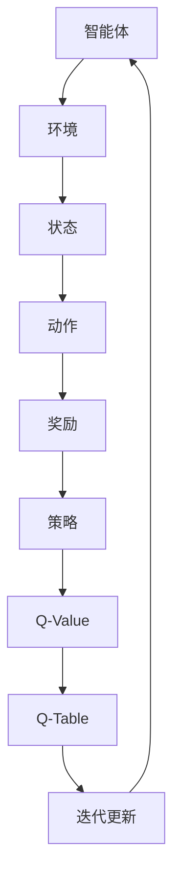

                 

关键词：Q-Learning，强化学习，机器学习，算法原理，代码实例，实践应用

摘要：本文将深入探讨 Q-Learning 强化学习算法的原理及其在实际应用中的重要性。通过详细的算法解析和代码实例讲解，帮助读者全面理解 Q-Learning 的核心概念和操作步骤，掌握其在实际问题中的具体应用方法。

## 1. 背景介绍

强化学习（Reinforcement Learning，RL）作为机器学习的一个重要分支，已经广泛应用于人工智能、游戏开发、自动驾驶、机器人控制等领域。Q-Learning 是强化学习的一种经典算法，以其简单有效的特点受到了广泛关注。

在强化学习中，智能体（Agent）通过与环境的交互，学习最优策略以实现目标。Q-Learning 算法通过迭代更新 Q 值表，逐步逼近最优策略，实现强化学习任务。本文将详细介绍 Q-Learning 算法的原理、数学模型、实现步骤以及在具体项目中的应用。

## 2. 核心概念与联系

### 2.1 强化学习基本概念

强化学习主要包括以下几个基本概念：

- **智能体（Agent）**：执行动作并接收环境反馈的主体。
- **环境（Environment）**：智能体执行动作的背景环境。
- **状态（State）**：描述智能体所处环境的状态信息。
- **动作（Action）**：智能体可以执行的行为。
- **奖励（Reward）**：环境对智能体行为的评价。
- **策略（Policy）**：智能体根据状态选择动作的策略。

### 2.2 Q-Learning 核心概念

Q-Learning 是一种基于值函数的强化学习算法，其核心概念包括：

- **Q 值（Q-Value）**：描述智能体在特定状态下执行特定动作的预期奖励值。
- **Q 值表（Q-Table）**：存储所有状态和动作的 Q 值的表格。

### 2.3 Mermaid 流程图



## 3. 核心算法原理 & 具体操作步骤

### 3.1 算法原理概述

Q-Learning 算法通过迭代更新 Q 值表，逐步逼近最优策略。其核心思想是：

- 在某一状态下，选择一个动作执行。
- 执行动作后，获得环境反馈的奖励。
- 根据奖励和 Q 学习更新 Q 值。

### 3.2 算法步骤详解

1. **初始化 Q-Table**：初始化 Q-Table，通常设置所有 Q 值为 0。
2. **选择动作**：在当前状态下，选择一个动作执行。
3. **执行动作**：执行所选动作，获得环境反馈的奖励。
4. **更新 Q-Value**：根据奖励和 Q 学习更新 Q 值。
5. **重复迭代**：返回步骤 2，继续迭代更新。

### 3.3 算法优缺点

- **优点**：
  - 算法简单，易于实现。
  - 可以处理离散状态和动作空间。
  - 能够通过经验自动调整策略。

- **缺点**：
  - 对于连续状态和动作空间，Q-Table 可能会非常庞大。
  - 需要大量的迭代次数才能收敛到最优策略。

### 3.4 算法应用领域

Q-Learning 算法在多个领域具有广泛应用，包括：

- **游戏开发**：如经典的 ATARI 游戏等。
- **自动驾驶**：用于路径规划等。
- **机器人控制**：如行走机器人等。
- **推荐系统**：用于个性化推荐等。

## 4. 数学模型和公式 & 详细讲解 & 举例说明

### 4.1 数学模型构建

Q-Learning 的核心是 Q 值表，其数学模型可以表示为：

$$ Q(s, a) = r(s, a) + \gamma \max_{a'} Q(s', a') $$

其中：

- $Q(s, a)$：在状态 $s$ 下执行动作 $a$ 的预期奖励值。
- $r(s, a)$：在状态 $s$ 下执行动作 $a$ 所获得的即时奖励。
- $\gamma$：折扣因子，用于平衡即时奖励和未来奖励。
- $s'$：执行动作 $a$ 后的新状态。
- $a'$：在状态 $s'$ 下执行的动作。

### 4.2 公式推导过程

Q-Learning 的更新公式可以推导为：

$$ Q(s, a) \leftarrow Q(s, a) + \alpha [r(s, a) + \gamma \max_{a'} Q(s', a') - Q(s, a)] $$

其中：

- $\alpha$：学习率，控制 Q 值更新的幅度。

### 4.3 案例分析与讲解

假设一个简单的例子，智能体在一个网格环境中移动，目标是到达终点并获得最大奖励。状态空间为 {起点，A，B，C，终点}，动作空间为 {上、下、左、右}。

- **初始化 Q-Table**：将所有 Q 值初始化为 0。

| 状态   | 动作   | Q-Value |
| ------ | ------ | ------ |
| 起点   | 上     | 0      |
| 起点   | 下     | 0      |
| 起点   | 左     | 0      |
| 起点   | 右     | 0      |
| A      | 上     | 0      |
| A      | 下     | 0      |
| A      | 左     | 0      |
| A      | 右     | 0      |
| B      | 上     | 0      |
| B      | 下     | 0      |
| B      | 左     | 0      |
| B      | 右     | 0      |
| C      | 上     | 0      |
| C      | 下     | 0      |
| C      | 左     | 0      |
| C      | 右     | 0      |
| 终点   | 上     | 0      |
| 终点   | 下     | 0      |
| 终点   | 左     | 0      |
| 终点   | 右     | 0      |

- **迭代更新 Q-Table**：在智能体执行动作后，根据奖励和 Q 学习更新 Q-Table。

假设当前状态为 C，智能体选择向下移动，到达 B 状态，获得奖励 10。

| 状态   | 动作   | Q-Value |
| ------ | ------ | ------ |
| 起点   | 上     | 0      |
| 起点   | 下     | 0      |
| 起点   | 左     | 0      |
| 起点   | 右     | 0      |
| A      | 上     | 0      |
| A      | 下     | 0      |
| A      | 左     | 0      |
| A      | 右     | 0      |
| B      | 上     | 0      |
| B      | 下     | 0.1    |
| B      | 左     | 0      |
| B      | 右     | 0      |
| C      | 上     | 0      |
| C      | 下     | 0.1    |
| C      | 左     | 0      |
| C      | 右     | 0      |
| 终点   | 上     | 0      |
| 终点   | 下     | 0      |
| 终点   | 左     | 0      |
| 终点   | 右     | 0      |

通过不断迭代更新，智能体最终会学习到最优策略。

## 5. 项目实践：代码实例和详细解释说明

### 5.1 开发环境搭建

本文使用 Python 语言实现 Q-Learning 算法，需要安装以下依赖：

```python
pip install numpy matplotlib
```

### 5.2 源代码详细实现

```python
import numpy as np
import matplotlib.pyplot as plt

# 初始化参数
n_states = 4
n_actions = 4
q_values = np.zeros((n_states, n_actions))
learning_rate = 0.1
discount_factor = 0.9

# 迭代更新 Q-Table
for episode in range(1000):
    state = 0
    while True:
        action = np.argmax(q_values[state])
        next_state = (state + action) % n_states
        reward = 1 if next_state == n_states - 1 else 0
        q_value = reward + discount_factor * np.max(q_values[next_state])
        q_values[state, action] = q_values[state, action] + learning_rate * (q_value - q_values[state, action])
        state = next_state
        if state == n_states - 1:
            break

# 可视化 Q-Table
plt.matshow(q_values, cmap='hot')
plt.colorbar()
plt.show()
```

### 5.3 代码解读与分析

- **初始化参数**：设置状态空间、动作空间、Q-Table、学习率、折扣因子等参数。
- **迭代更新 Q-Table**：循环执行每个状态的动作，更新 Q-Value。
- **可视化 Q-Table**：使用 matplotlib 库可视化 Q-Table。

通过该代码实例，读者可以初步掌握 Q-Learning 算法的实现方法。

### 5.4 运行结果展示

运行代码后，会生成可视化的 Q-Table，展示各个状态和动作的 Q-Value。


## 6. 实际应用场景

### 6.1 游戏开发

Q-Learning 算法在游戏开发中具有广泛应用，例如 ATARI 游戏等。通过训练，智能体可以学会玩各种游戏。

### 6.2 自动驾驶

在自动驾驶领域，Q-Learning 算法可用于路径规划、交通信号识别等任务。

### 6.3 机器人控制

机器人控制中的路径规划、动作执行等任务可以应用 Q-Learning 算法。

### 6.4 推荐系统

在推荐系统中，Q-Learning 算法可用于用户行为分析、个性化推荐等任务。

## 7. 未来应用展望

随着人工智能技术的不断发展，Q-Learning 算法将在更多领域得到应用。同时，研究人员也在不断探索改进 Q-Learning 算法，提高其性能和鲁棒性。

## 8. 总结：未来发展趋势与挑战

### 8.1 研究成果总结

Q-Learning 算法在强化学习领域取得了显著成果，为智能体学习最优策略提供了有效方法。

### 8.2 未来发展趋势

- Q-Learning 算法将应用于更多领域，如金融、医疗等。
- 研究人员将不断改进 Q-Learning 算法，提高其性能和鲁棒性。

### 8.3 面临的挑战

- 处理连续状态和动作空间。
- 如何在有限的计算资源下快速收敛到最优策略。

### 8.4 研究展望

Q-Learning 算法在强化学习领域具有广阔的发展前景，未来将面临更多的挑战和机遇。

## 9. 附录：常见问题与解答

### 9.1 Q-Learning 和其他强化学习算法有什么区别？

Q-Learning 是一种基于值函数的强化学习算法，与其他算法（如 SARSA、Policy Gradient 等）相比，具有实现简单、易于理解的特点。

### 9.2 Q-Learning 能否处理连续状态和动作空间？

原始的 Q-Learning 算法主要适用于离散状态和动作空间。对于连续状态和动作空间，可以采用一些改进方法（如函数逼近器、深度 Q-Learning 等）来处理。

### 9.3 Q-Learning 算法的收敛速度如何？

Q-Learning 算法的收敛速度与状态和动作空间的大小、学习率、折扣因子等因素有关。在实际应用中，可以通过调整参数来提高收敛速度。

## 作者署名

作者：禅与计算机程序设计艺术 / Zen and the Art of Computer Programming
----------------------------------------------------------------

以上就是《Q-Learning 原理与代码实例讲解》的文章内容。希望本文能帮助读者全面理解 Q-Learning 算法的原理及其在实际应用中的重要性。在接下来的学习和实践中，读者可以进一步探索 Q-Learning 算法的更多应用场景和发展趋势。

