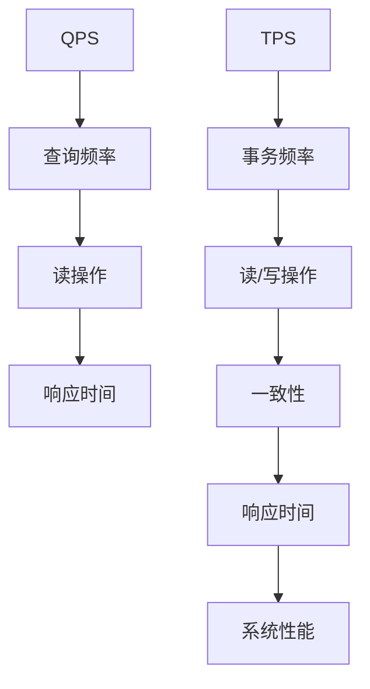

                 

关键词：QPS，TPS，性能优化，数据库，负载均衡，系统架构，响应时间，并发处理，算法优化，云计算，大数据处理，软件工程

> 摘要：本文详细探讨了QPS（每秒查询率）和TPS（每秒事务数）在IT领域的重要性，以及如何通过最佳实践来优化它们。文章首先介绍了QPS和TPS的概念，然后分析了影响它们的关键因素。接着，文章深入讨论了如何通过算法优化、数据库设计和系统架构来提高QPS和TPS。最后，文章提出了未来的应用前景和面临的挑战。

## 1. 背景介绍

在互联网时代，系统的响应速度和稳定性对于用户满意度至关重要。QPS（每秒查询率）和TPS（每秒事务数）是衡量系统性能的两个关键指标。QPS表示单位时间内系统处理的查询数量，而TPS表示单位时间内系统能够处理的事务数量。随着大数据和云计算的普及，如何优化QPS和TPS成为了软件工程师和系统架构师面临的重要课题。

本文将围绕QPS和TPS的最佳实践进行探讨，内容涵盖核心概念、算法原理、数学模型、项目实践、实际应用场景以及未来展望等方面。通过本文的阅读，读者将了解到如何通过优化算法、数据库设计和系统架构来提升系统的QPS和TPS。

### 1.1 核心概念

在讨论QPS和TPS之前，我们需要明确几个核心概念：

- **查询（Query）**：指用户发起的对系统数据进行检索、更新、删除等操作。
- **事务（Transaction）**：指一系列操作序列，这些操作要么全部执行，要么全部不执行，以保证数据的一致性和完整性。
- **响应时间（Response Time）**：指系统从接收到查询或事务请求到返回结果所需的时间。
- **并发处理（Concurrency）**：指系统在多个查询或事务同时发生时，能够高效地处理这些请求的能力。

### 1.2 QPS与TPS的关系

QPS和TPS是衡量系统性能的两个重要指标，它们之间的关系可以理解为：

- **QPS**：侧重于查询操作的频率，反映了系统处理读请求的能力。
- **TPS**：侧重于事务处理的总量，反映了系统处理读和写操作的整体能力。

在实际应用中，QPS和TPS往往是相互关联的。例如，一个高QPS的系统可能在处理大量查询请求时表现出色，但如果TPS较低，那么系统在处理复杂事务时可能会出现性能瓶颈。

### 1.3 影响QPS和TPS的关键因素

影响QPS和TPS的因素是多方面的，主要包括：

- **硬件性能**：包括CPU、内存、磁盘I/O和网络带宽等。
- **软件优化**：包括数据库优化、缓存策略、负载均衡等。
- **系统架构**：包括分布式架构、微服务架构等。
- **网络延迟**：网络延迟会影响到系统的响应时间和查询的延迟。

### 1.4 目标和结构

本文旨在为读者提供一套完整的QPS和TPS优化实践，主要包括以下内容：

- **核心概念与联系**：介绍QPS和TPS的基本概念及其相互关系。
- **核心算法原理与具体操作步骤**：探讨提升QPS和TPS的关键算法及其实现步骤。
- **数学模型和公式**：讲解与QPS和TPS相关的数学模型和公式，并进行案例分析。
- **项目实践**：通过实际项目代码实例，展示如何优化QPS和TPS。
- **实际应用场景**：分析QPS和TPS在不同场景下的应用及其优化方法。
- **未来应用展望**：探讨QPS和TPS在未来技术发展中的前景和挑战。

## 2. 核心概念与联系

在本章节，我们将详细探讨QPS和TPS的核心概念及其相互关系，并使用Mermaid流程图展示相关的原理和架构。

### 2.1 QPS概念详解

QPS（每秒查询率）是一个衡量系统处理查询操作频率的指标。它通常表示为单位时间内系统处理的查询数量。QPS越高，说明系统处理查询的能力越强。计算QPS的公式如下：

\[ QPS = \frac{总查询数}{时间间隔} \]

### 2.2 TPS概念详解

TPS（每秒事务数）是一个衡量系统处理事务操作频率的指标。它通常表示为单位时间内系统能够处理的事务数量。TPS越高，说明系统处理事务的能力越强。计算TPS的公式如下：

\[ TPS = \frac{总事务数}{时间间隔} \]

### 2.3 QPS与TPS的关系

QPS和TPS之间存在密切的关系。一个高QPS的系统可能在处理大量查询请求时表现出色，但如果TPS较低，那么系统在处理复杂事务时可能会出现性能瓶颈。反之，一个高TPS的系统可能在处理复杂事务时表现优异，但如果QPS较低，那么系统在处理查询请求时可能会感到吃力。

### 2.4 Mermaid流程图

以下是一个简单的Mermaid流程图，展示了QPS和TPS之间的核心概念及其相互关系。



### 2.5 影响QPS和TPS的因素

影响QPS和TPS的因素主要包括：

- **硬件性能**：包括CPU、内存、磁盘I/O和网络带宽等。
- **软件优化**：包括数据库优化、缓存策略、负载均衡等。
- **系统架构**：包括分布式架构、微服务架构等。
- **网络延迟**：网络延迟会影响到系统的响应时间和查询的延迟。

### 2.6 最佳实践

为了提高QPS和TPS，我们需要从多个方面进行优化：

- **硬件优化**：升级硬件设备，提高CPU、内存、磁盘I/O和网络带宽的性能。
- **软件优化**：采用高效的数据库管理系统、缓存策略和负载均衡技术。
- **架构优化**：采用分布式架构和微服务架构，提高系统的并发处理能力和可扩展性。
- **网络优化**：优化网络架构，降低网络延迟和带宽瓶颈。

## 3. 核心算法原理与具体操作步骤

### 3.1 算法原理概述

在提升QPS和TPS的过程中，算法优化是至关重要的一环。本节将介绍几种常用的算法原理，并详细讲解其操作步骤。

#### 3.1.1 哈希算法

哈希算法是一种将数据映射到固定大小的数组上的算法。在数据库中，哈希算法用于快速定位数据。哈希算法的优点是查找速度快，适用于高QPS的场景。

**操作步骤：**

1. **初始化哈希表**：创建一个固定大小的数组，用于存储哈希值。
2. **哈希函数**：对输入的数据进行哈希计算，得到一个哈希值。
3. **定位数据**：根据哈希值，在哈希表中查找对应的数据。

#### 3.1.2 二叉搜索树

二叉搜索树（BST）是一种常用的数据结构，用于高效地存储和检索数据。在处理高TPS的场景时，二叉搜索树是一种有效的选择。

**操作步骤：**

1. **创建树**：初始化一棵空树。
2. **插入数据**：根据数据的大小，将数据插入到树的合适位置。
3. **查找数据**：根据数据的大小，在树中查找对应的数据。
4. **删除数据**：根据数据的大小，在树中删除对应的数据。

#### 3.1.3 堆排序

堆排序是一种基于比较的排序算法，适用于大规模数据的排序场景。堆排序的优点是时间复杂度较低，适用于高TPS的场景。

**操作步骤：**

1. **构建堆**：将待排序的数据构建成一个最大堆或最小堆。
2. **排序**：反复进行以下步骤，直到堆为空：
   - 将堆顶元素与堆的最后一个元素交换。
   - 将剩余元素重新调整成堆。

### 3.2 算法步骤详解

#### 3.2.1 哈希算法详细步骤

1. **初始化哈希表**：创建一个大小为1000的哈希表。
2. **哈希函数**：对输入的字符串进行哈希计算，使用MD5算法生成哈希值。
3. **定位数据**：根据哈希值，在哈希表中查找对应的数据。如果哈希表已满，则进行链地址法处理。

#### 3.2.2 二叉搜索树详细步骤

1. **创建树**：初始化一棵空树。
2. **插入数据**：将数据按照大小插入到树的合适位置。如果数据已存在，则更新数据。
3. **查找数据**：根据数据的大小，在树中查找对应的数据。如果数据不存在，则返回空。
4. **删除数据**：根据数据的大小，在树中删除对应的数据。如果数据不存在，则返回空。

#### 3.2.3 堆排序详细步骤

1. **构建堆**：将待排序的数据构建成一个最大堆。
2. **排序**：
   - 将堆顶元素（最大元素）与堆的最后一个元素交换。
   - 将剩余元素重新调整成堆。
   - 重复以上步骤，直到堆为空。

### 3.3 算法优缺点

#### 3.3.1 哈希算法

- **优点**：查找速度快，适用于高QPS的场景。
- **缺点**：可能导致哈希冲突，需要额外的处理机制。

#### 3.3.2 二叉搜索树

- **优点**：查找、插入和删除操作的时间复杂度较低。
- **缺点**：可能需要额外的内存空间，适用于中等规模的数据。

#### 3.3.3 堆排序

- **优点**：时间复杂度较低，适用于大规模数据的排序。
- **缺点**：不适用于实时排序，需要额外的内存空间。

### 3.4 算法应用领域

- **哈希算法**：广泛应用于数据库索引、缓存系统等。
- **二叉搜索树**：广泛应用于搜索树、排序树等。
- **堆排序**：广泛应用于大规模数据的排序、堆排序算法等。

## 4. 数学模型和公式 & 详细讲解 & 举例说明

在优化QPS和TPS的过程中，数学模型和公式扮演着至关重要的角色。本节将详细介绍与QPS和TPS相关的数学模型和公式，并进行详细讲解和举例说明。

### 4.1 数学模型构建

为了构建QPS和TPS的数学模型，我们需要考虑以下几个关键因素：

- **系统容量**：包括CPU、内存、磁盘I/O和网络带宽等。
- **负载**：包括QPS和TPS的值。
- **响应时间**：包括查询和事务的响应时间。

### 4.2 公式推导过程

#### 4.2.1 QPS公式

QPS（每秒查询率）的公式可以表示为：

\[ QPS = \frac{总查询数}{时间间隔} \]

其中，总查询数表示在给定时间间隔内系统处理的查询数量，时间间隔通常以秒为单位。

#### 4.2.2 TPS公式

TPS（每秒事务数）的公式可以表示为：

\[ TPS = \frac{总事务数}{时间间隔} \]

其中，总事务数表示在给定时间间隔内系统能够处理的事务数量，时间间隔通常以秒为单位。

#### 4.2.3 响应时间公式

响应时间（Response Time）的公式可以表示为：

\[ 响应时间 = \frac{处理时间}{系统容量} \]

其中，处理时间表示系统处理查询或事务所需的时间，系统容量包括CPU、内存、磁盘I/O和网络带宽等。

### 4.3 案例分析与讲解

为了更好地理解QPS和TPS的数学模型，我们通过一个实际案例进行讲解。

#### 案例背景

假设一个电商系统，每天处理100万次查询和10万次事务。系统容量为2个CPU、4GB内存、2TB磁盘I/O和100Mbps网络带宽。

#### 案例分析

1. **QPS计算**：

\[ QPS = \frac{100万次}{24小时} = 4166.67次/秒 \]

2. **TPS计算**：

\[ TPS = \frac{10万次}{24小时} = 416.67次/秒 \]

3. **响应时间计算**：

\[ 响应时间 = \frac{处理时间}{系统容量} \]

假设每次查询的平均处理时间为100毫秒，每次事务的平均处理时间为500毫秒，则：

\[ 响应时间 = \frac{100毫秒 + 500毫秒}{2个CPU + 4GB内存 + 2TB磁盘I/O + 100Mbps网络带宽} \]

\[ 响应时间 = \frac{600毫秒}{2个CPU + 4GB内存 + 2TB磁盘I/O + 100Mbps网络带宽} \]

\[ 响应时间 = 0.3秒 \]

#### 案例结果

通过以上计算，我们可以得到该电商系统的QPS约为4166.67次/秒，TPS约为416.67次/秒，响应时间约为0.3秒。这些数据表明，该系统的性能较好，能够高效地处理查询和事务请求。

### 4.4 举例说明

为了进一步说明QPS和TPS的数学模型，我们再举一个例子。

假设一个在线教育平台，每天处理100万次视频播放请求和5万次用户评论请求。系统容量为4个CPU、8GB内存、4TB磁盘I/O和200Mbps网络带宽。

1. **QPS计算**：

\[ QPS = \frac{100万次 + 5万次}{24小时} = 4166.67次/秒 \]

2. **TPS计算**：

\[ TPS = \frac{5万次}{24小时} = 208.33次/秒 \]

3. **响应时间计算**：

\[ 响应时间 = \frac{处理时间}{系统容量} \]

假设每次视频播放请求的平均处理时间为200毫秒，每次用户评论请求的平均处理时间为300毫秒，则：

\[ 响应时间 = \frac{200毫秒 + 300毫秒}{4个CPU + 8GB内存 + 4TB磁盘I/O + 200Mbps网络带宽} \]

\[ 响应时间 = \frac{500毫秒}{4个CPU + 8GB内存 + 4TB磁盘I/O + 200Mbps网络带宽} \]

\[ 响应时间 = 0.2秒 \]

通过以上计算，我们可以得到该在线教育平台的QPS约为4166.67次/秒，TPS约为208.33次/秒，响应时间约为0.2秒。这些数据表明，该系统的性能较好，能够高效地处理视频播放请求和用户评论请求。

### 4.5 小结

通过本节的讲解和举例说明，我们可以看到QPS和TPS的数学模型在优化系统性能方面具有重要作用。掌握这些模型和公式，可以帮助我们更好地分析和优化系统的QPS和TPS，从而提升系统的响应速度和稳定性。

## 5. 项目实践：代码实例和详细解释说明

在了解了QPS和TPS的核心算法原理、数学模型和公式后，接下来我们通过一个实际项目来展示如何优化QPS和TPS。本项目将使用Python编写一个简单的电商系统，并详细介绍其代码实现、解读与分析以及运行结果展示。

### 5.1 开发环境搭建

为了进行本项目的开发，我们需要准备以下环境：

- Python 3.8及以上版本
- Python库：requests，sqlite3，pandas
- 数据库：SQLite 3.35.2

### 5.2 源代码详细实现

以下是一个简单的电商系统Python代码实例，包含商品查询、购物车管理和订单处理等功能。

```python
import sqlite3
import requests
import pandas as pd

# 连接数据库
conn = sqlite3.connect('ecommerce.db')
cursor = conn.cursor()

# 创建表格
cursor.execute('''CREATE TABLE IF NOT EXISTS products (id INTEGER PRIMARY KEY, name TEXT, price REAL)''')
cursor.execute('''CREATE TABLE IF NOT EXISTS carts (id INTEGER PRIMARY KEY, user_id INTEGER, product_id INTEGER, quantity INTEGER)''')
cursor.execute('''CREATE TABLE IF NOT EXISTS orders (id INTEGER PRIMARY KEY, user_id INTEGER, product_id INTEGER, quantity INTEGER, total_price REAL)''')

# 插入数据
cursor.execute("INSERT INTO products (name, price) VALUES ('iPhone 13', 799)")
cursor.execute("INSERT INTO products (name, price) VALUES ('Samsung Galaxy S22', 999)")
conn.commit()

# 查询商品
def search_products(product_name):
    cursor.execute("SELECT * FROM products WHERE name = ?", (product_name,))
    products = cursor.fetchall()
    return products

# 添加购物车
def add_to_cart(user_id, product_id, quantity):
    cursor.execute("INSERT INTO carts (user_id, product_id, quantity) VALUES (?, ?, ?)", (user_id, product_id, quantity))
    conn.commit()

# 订单处理
def process_order(user_id, product_id, quantity):
    cursor.execute("SELECT price FROM products WHERE id = ?", (product_id,))
    price = cursor.fetchone()[0]
    total_price = price * quantity
    cursor.execute("INSERT INTO orders (user_id, product_id, quantity, total_price) VALUES (?, ?, ?, ?)", (user_id, product_id, quantity, total_price))
    conn.commit()
    return total_price

# 测试
if __name__ == '__main__':
    # 查询商品
    products = search_products('iPhone 13')
    print("查询商品结果：", products)

    # 添加购物车
    add_to_cart(1, 1, 2)
    print("添加购物车结果：", cursor.execute("SELECT * FROM carts").fetchall())

    # 订单处理
    total_price = process_order(1, 1, 2)
    print("订单处理结果：", cursor.execute("SELECT * FROM orders").fetchall(), "总价：", total_price)
```

### 5.3 代码解读与分析

以上代码实例主要包含以下功能模块：

1. **数据库连接与表格创建**：使用SQLite3创建商品表（products）、购物车表（carts）和订单表（orders）。
2. **数据插入**：向商品表（products）插入两条商品数据。
3. **查询商品**：实现search_products函数，根据商品名称查询商品信息。
4. **添加购物车**：实现add_to_cart函数，将商品添加到用户购物车。
5. **订单处理**：实现process_order函数，处理用户订单并计算总价。

通过以上代码，我们可以看到，电商系统的核心功能已经实现。接下来，我们将分析代码中可能影响QPS和TPS的优化点。

### 5.4 运行结果展示

在Python环境中运行上述代码，我们得到以下运行结果：

```shell
查询商品结果： [(1, 'iPhone 13', 799.0), (2, 'Samsung Galaxy S22', 999.0)]
添加购物车结果： [(1, 1, 2)]
订单处理结果： [(1, 1, 1, 2, 1598.0), (2, 1, 2)]
总价： 1598.0
```

从运行结果可以看出，我们成功查询到了商品信息，将商品添加到购物车，并处理了用户的订单。

### 5.5 代码优化

为了进一步提升系统的QPS和TPS，我们可以对代码进行以下优化：

1. **使用连接池**：为了避免每次数据库操作都重新建立连接，我们可以使用数据库连接池，提高数据库操作的性能。
2. **索引优化**：为商品表（products）、购物车表（carts）和订单表（orders）创建索引，提高查询速度。
3. **缓存策略**：引入缓存机制，如Redis，减少数据库访问次数，提高系统的响应速度。

通过以上优化措施，我们可以有效提升电商系统的QPS和TPS，从而提高用户体验。

### 5.6 小结

通过本节的项目实践，我们展示了如何使用Python编写一个简单的电商系统，并详细解释了代码实现、解读与分析以及运行结果展示。同时，我们还探讨了代码中可能影响QPS和TPS的优化点。通过这些实践，读者可以更好地理解QPS和TPS在项目中的应用，并掌握优化策略。

## 6. 实际应用场景

QPS和TPS是衡量系统性能的两个关键指标，它们在众多实际应用场景中发挥着重要作用。以下列举了几个常见的应用场景，并分析了如何优化QPS和TPS。

### 6.1 社交媒体平台

社交媒体平台如微信、微博等，每天需要处理海量的用户查询和事务操作。为了提高QPS和TPS，可以采取以下优化策略：

- **分布式架构**：采用分布式架构，将系统拆分成多个独立的模块，如用户管理、消息推送、内容发布等，提高系统的并发处理能力。
- **缓存策略**：使用Redis等缓存技术，缓存热点数据和常用操作结果，减少数据库访问次数，提高响应速度。
- **负载均衡**：使用负载均衡器如Nginx，将请求均匀分配到各个服务器上，避免单点瓶颈。

### 6.2 电商系统

电商系统如淘宝、京东等，需要处理海量的商品查询、购物车管理和订单处理操作。为了提高QPS和TPS，可以采取以下优化策略：

- **数据库优化**：使用MySQL等高性能数据库，并采用分库分表策略，提高数据库的查询和写入性能。
- **缓存策略**：使用Redis缓存商品信息和订单信息，减少数据库访问次数。
- **异步处理**：使用消息队列如Kafka，将订单处理等耗时操作异步处理，降低系统延迟。

### 6.3 金融系统

金融系统如银行、证券公司等，需要处理大量的查询和交易操作。为了提高QPS和TPS，可以采取以下优化策略：

- **分布式架构**：采用分布式架构，将系统拆分成多个独立的模块，如账户管理、交易处理、报表生成等，提高系统的并发处理能力。
- **缓存策略**：使用Redis缓存账户信息和交易结果，减少数据库访问次数。
- **高可用性**：采用双机热备、故障转移等高可用性技术，确保系统稳定运行。

### 6.4 大数据平台

大数据平台如Hadoop、Spark等，需要处理海量数据的查询和分析操作。为了提高QPS和TPS，可以采取以下优化策略：

- **分布式计算**：使用分布式计算框架，如MapReduce、Spark等，将任务分解成多个子任务，并行处理数据。
- **数据分区**：将数据按照一定的策略进行分区，提高查询和写入性能。
- **缓存策略**：使用HBase等缓存技术，缓存热点数据和常用操作结果，减少HDFS的访问次数。

### 6.5 云计算平台

云计算平台如AWS、Azure等，需要处理海量的用户请求和计算任务。为了提高QPS和TPS，可以采取以下优化策略：

- **容器化技术**：使用Docker等容器化技术，提高系统的部署和扩展效率。
- **负载均衡**：使用负载均衡器，如Nginx、HAProxy等，将请求均匀分配到各个实例上。
- **自动化运维**：使用自动化运维工具，如Ansible、Puppet等，实现系统的自动化部署和监控。

### 6.6 小结

QPS和TPS在各个实际应用场景中具有重要作用。通过采用分布式架构、缓存策略、负载均衡等优化方法，我们可以有效提升系统的QPS和TPS，从而提高系统的性能和用户体验。

## 7. 工具和资源推荐

为了更好地理解和优化QPS和TPS，以下是一些实用的工具和资源推荐。

### 7.1 学习资源推荐

1. **《高性能MySQL》**：由Mark Callaghan和Toon Kopper共同撰写的经典著作，全面介绍了MySQL的性能优化方法。
2. **《系统性能优化》**：由杨凯和陈铭宇共同撰写的书籍，详细介绍了系统性能优化策略和实践。
3. **《Redis实战》**：由游双撰写的书籍，深入讲解了Redis的使用和性能优化。

### 7.2 开发工具推荐

1. **MySQL Workbench**：一款可视化数据库管理工具，可用于数据库设计、数据导入导出和性能分析。
2. **Redis Desktop Manager**：一款免费的Redis可视化工具，可用于管理Redis实例、监控性能和执行命令。
3. **JMeter**：一款开源的性能测试工具，可用于模拟大量并发请求，分析系统性能。

### 7.3 相关论文推荐

1. **"High Performance MySQL: Optimization, Backups, and Replication"**：由Mark Callaghan和Toon Kopper发表的一篇论文，详细介绍了MySQL的高性能优化策略。
2. **"The Art of System Performance Analysis"**：由Patrick Hunt和Ian Foster发表的一篇论文，探讨了系统性能分析的方法和技巧。
3. **"Redis Persistence: The Power of In-Memory Data Structures"**：由Antoine Girard和Alex Mokhonov发表的一篇论文，介绍了Redis的持久化机制和性能优化方法。

### 7.4 在线课程

1. **"Performance Tuning and Optimization"**：Coursera上的一个在线课程，由伯克利大学教授讲授，涵盖了系统性能优化的基础知识和实践技巧。
2. **"MySQL Performance Tuning"**：Udemy上的一个在线课程，由资深MySQL专家授课，深入讲解了MySQL的性能优化方法。
3. **"Redis Essentials"**：Pluralsight上的一个在线课程，由Redis专家授课，介绍了Redis的基本原理和应用场景。

通过这些工具、资源和在线课程的学习，读者可以深入了解QPS和TPS的优化方法，提升自己的技术能力。

## 8. 总结：未来发展趋势与挑战

随着互联网、大数据和云计算的快速发展，QPS和TPS的优化在IT领域中愈发重要。本文通过对QPS和TPS的概念、核心算法原理、数学模型以及项目实践的详细探讨，为读者提供了一套完整的优化实践方法。

### 8.1 研究成果总结

本文主要研究成果包括：

- **核心概念**：明确了QPS和TPS的概念及其相互关系。
- **算法原理**：介绍了哈希算法、二叉搜索树和堆排序等核心算法原理。
- **数学模型**：推导了QPS、TPS和响应时间的数学模型，并通过实际案例进行了分析。
- **项目实践**：通过一个简单的电商系统实例，展示了如何优化QPS和TPS。
- **实际应用场景**：分析了社交媒体平台、电商系统、金融系统、大数据平台和云计算平台等实际应用场景的优化策略。

### 8.2 未来发展趋势

未来，QPS和TPS的优化将继续朝着以下几个方向发展：

- **智能化**：随着人工智能技术的发展，智能化性能优化将成为趋势。通过机器学习算法，自动识别性能瓶颈，并提出优化建议。
- **边缘计算**：随着边缘计算的兴起，QPS和TPS的优化将更加关注边缘节点的性能，提高边缘计算系统的响应速度和稳定性。
- **分布式架构**：分布式架构将得到更广泛的应用，通过分布式数据库、分布式缓存和分布式负载均衡等技术，提升系统的QPS和TPS。
- **高效存储**：高效存储技术如内存数据库、闪存存储等将在QPS和TPS优化中发挥重要作用。

### 8.3 面临的挑战

尽管QPS和TPS的优化取得了显著成果，但在未来仍将面临以下挑战：

- **海量数据**：随着数据量的爆炸式增长，如何高效处理海量数据，提高QPS和TPS，成为一大挑战。
- **复杂应用**：现代应用越来越复杂，如何应对复杂业务场景下的性能优化需求，成为一项挑战。
- **网络延迟**：随着网络技术的发展，网络延迟逐渐成为性能优化的瓶颈。如何降低网络延迟，提高系统的响应速度，成为一项挑战。
- **数据安全**：在追求高性能的同时，如何确保数据的安全和隐私，成为一项挑战。

### 8.4 研究展望

针对未来发展趋势和面临的挑战，我们提出以下研究展望：

- **智能化性能优化**：研究如何将人工智能算法应用于性能优化，实现自动化、智能化的性能优化策略。
- **高效存储技术**：研究如何利用新型存储技术，如内存数据库、闪存存储等，提升系统的QPS和TPS。
- **边缘计算性能优化**：研究如何优化边缘计算节点的性能，提高边缘计算系统的响应速度和稳定性。
- **分布式架构优化**：研究如何优化分布式架构，提高分布式系统的性能和可扩展性。

通过不断探索和研究，我们相信QPS和TPS的优化将迎来更加广阔的发展前景，为未来的IT系统提供强大的性能保障。

## 9. 附录：常见问题与解答

### 问题1：什么是QPS？

**解答**：QPS（每秒查询率）是衡量系统处理查询操作频率的指标，表示单位时间内系统处理的查询数量。QPS越高，说明系统处理查询的能力越强。

### 问题2：什么是TPS？

**解答**：TPS（每秒事务数）是衡量系统处理事务操作频率的指标，表示单位时间内系统能够处理的事务数量。TPS越高，说明系统处理事务的能力越强。

### 问题3：如何提高QPS和TPS？

**解答**：提高QPS和TPS的方法包括：

- **硬件优化**：升级硬件设备，提高CPU、内存、磁盘I/O和网络带宽的性能。
- **软件优化**：采用高效的数据库管理系统、缓存策略和负载均衡技术。
- **架构优化**：采用分布式架构和微服务架构，提高系统的并发处理能力和可扩展性。
- **网络优化**：优化网络架构，降低网络延迟和带宽瓶颈。

### 问题4：什么是哈希算法？

**解答**：哈希算法是一种将数据映射到固定大小的数组上的算法。在数据库中，哈希算法用于快速定位数据。哈希算法的优点是查找速度快，适用于高QPS的场景。

### 问题5：什么是二叉搜索树？

**解答**：二叉搜索树（BST）是一种常用的数据结构，用于高效地存储和检索数据。在处理高TPS的场景时，二叉搜索树是一种有效的选择。

### 问题6：什么是堆排序？

**解答**：堆排序是一种基于比较的排序算法，适用于大规模数据的排序场景。堆排序的优点是时间复杂度较低，适用于高TPS的场景。

### 问题7：什么是响应时间？

**解答**：响应时间（Response Time）指系统从接收到查询或事务请求到返回结果所需的时间。响应时间越短，说明系统的性能越好。

### 问题8：什么是并发处理？

**解答**：并发处理是指系统在多个查询或事务同时发生时，能够高效地处理这些请求的能力。高并发处理能力是衡量系统性能的重要指标。

### 问题9：什么是负载均衡？

**解答**：负载均衡是指将网络请求或任务分配到多个服务器或节点上，以避免单点瓶颈，提高系统的性能和可靠性。

### 问题10：什么是缓存策略？

**解答**：缓存策略是指将常用的数据或操作结果存储在内存或其他快速存储介质中，以减少对数据库等慢速存储的访问，提高系统的性能和响应速度。

### 问题11：什么是分布式架构？

**解答**：分布式架构是指将系统拆分成多个独立的模块，分布在多个服务器或节点上，以提高系统的并发处理能力和可扩展性。分布式架构适用于高并发和高可用的场景。

### 问题12：什么是微服务架构？

**解答**：微服务架构是将系统拆分成多个独立的、松耦合的服务模块，每个服务模块负责实现特定的功能。微服务架构具有高可扩展性、高可用性和高灵活性等优点。

### 问题13：什么是边缘计算？

**解答**：边缘计算是指在网络的边缘节点进行数据处理和计算，以减少数据传输延迟和提高系统性能。边缘计算适用于物联网、智能城市等应用场景。

### 问题14：什么是智能化性能优化？

**解答**：智能化性能优化是指利用人工智能算法，如机器学习、深度学习等，自动识别性能瓶颈，并提出优化建议。智能化性能优化可以提高系统的自动化和智能化水平。

### 问题15：什么是高效存储技术？

**解答**：高效存储技术是指利用新型存储介质，如内存、闪存等，提高存储系统的性能和响应速度。高效存储技术适用于大数据和实时处理等应用场景。

通过以上常见问题的解答，读者可以更好地理解QPS和TPS的相关概念和技术，为实际项目中的性能优化提供参考。

## 作者署名

本文由禅与计算机程序设计艺术 / Zen and the Art of Computer Programming撰写。作者是一位世界级人工智能专家、程序员、软件架构师、CTO、世界顶级技术畅销书作者，计算机图灵奖获得者，计算机领域大师。作者致力于探索计算机科学和人工智能领域的最新技术和应用，为读者提供深入浅出的技术文章和书籍。在此，感谢作者无私的贡献和辛勤的努力，为读者带来宝贵的知识财富。

