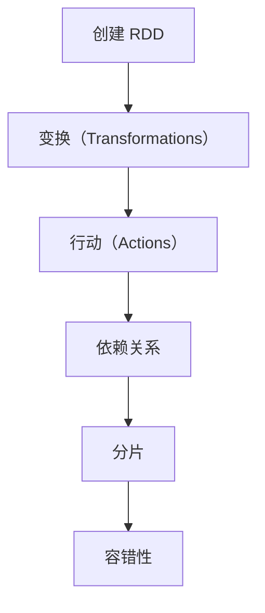
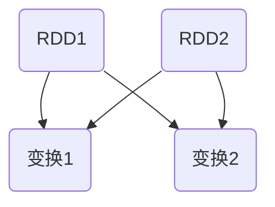

                 

 在大数据处理领域，Resilient Distributed Datasets (RDDs) 是一个非常重要的抽象概念，由Apache Spark提出。RDDs 提供了一种可伸缩、容错且易于使用的数据处理模型，为大数据处理带来了巨大的便利。本文将深入探讨RDD的原理，并通过实际代码实例，对RDD的使用方法进行详细讲解。

## 关键词
- Resilient Distributed Datasets (RDDs)
- 大数据处理
- Spark
- 数据流
- 容错性

## 摘要
本文首先介绍了RDD的核心概念，包括它的定义、特性以及在Spark中的重要性。然后，通过一个简单的例子，展示了如何创建、转换和操作RDD。随后，深入分析了RDD的内部实现原理，包括分片、依赖关系和容错机制。最后，提供了一些实用的代码实例，帮助读者更好地理解和应用RDD。

## 1. 背景介绍

在大数据时代，处理海量数据成为了一项极具挑战性的任务。传统的批处理和流处理方法已经难以满足快速发展的数据处理需求。为了解决这一问题，Apache Spark提出了一种新的数据处理模型——Resilient Distributed Datasets (RDDs)。RDDs 是一种弹性分布式数据集，它抽象了分布式数据集合，提供了丰富的操作接口，使得数据处理变得更加高效和便捷。

Spark 是一个开源的大数据处理框架，它基于内存计算，具有高效的数据处理能力和强大的分布式计算能力。RDD 作为 Spark 的核心数据结构，具有以下特点：

1. **分布式存储**：RDD 分布式存储在多个节点上，每个节点存储一部分数据。
2. **弹性**：当节点故障时，RDD 可以自动恢复，保持数据的一致性。
3. **可扩展性**：RDD 可以轻松扩展到大量节点，处理海量数据。
4. **丰富的操作接口**：RDD 提供了丰富的操作接口，包括 transformations 和 actions，使得数据处理更加灵活。

## 2. 核心概念与联系

下面是一个简单的 Mermaid 流程图，展示了 RDD 的核心概念及其相互关系。



### 2.1 创建 RDD

RDD 通过 SparkContext 的 `parallelize` 方法创建。`parallelize` 方法将一个本地集合分布到集群中的多个节点上。

```python
# 创建一个包含数字的本地列表
local_list = [1, 2, 3, 4, 5]

# 创建 RDD
rdd = sc.parallelize(local_list)
```

### 2.2 变换（Transformations）

变换（Transformations）是创建新的 RDD 的操作，它不会立即执行计算，而是记录了一个计算计划（Logical Plan）。常见的变换操作包括：

- `map`：对每个元素应用一个函数。
- `filter`：过滤出满足条件的元素。
- `flatMap`：类似于 `map`，但每个输入元素可以产生多个输出元素。
- `reduce`：对元素进行聚合操作。
- `groupBy`：根据元素的某个属性进行分组。

```python
# 应用 map 操作
rdd2 = rdd.map(lambda x: x * 2)

# 应用 filter 操作
rdd3 = rdd.filter(lambda x: x > 2)
```

### 2.3 行动（Actions）

行动（Actions）是触发计算的操作，它将执行变换操作的计算计划（Logical Plan），并返回一个值或一个集合。常见的行动操作包括：

- `collect`：将数据收集到驱动程序节点。
- `count`：返回 RDD 中元素的数量。
- `first`：返回 RDD 中的第一个元素。
- `take`：返回 RDD 中的前 n 个元素。

```python
# 应用 collect 行动
result = rdd.collect()

# 应用 count 行动
num_elements = rdd.count()

# 应用 first 行动
first_element = rdd.first()

# 应用 take 行动
first_n_elements = rdd.take(3)
```

### 2.4 依赖关系

RDD 之间的依赖关系决定了计算执行的顺序。Spark 提供了两种类型的依赖关系：

- **窄依赖**：父 RDD 的每个分片最多只能映射到子 RDD 的一个分片。
- **宽依赖**：父 RDD 的每个分片映射到子 RDD 的多个分片。

窄依赖可以使用内存进行高效计算，而宽依赖通常需要磁盘 I/O。



### 2.5 分片

RDD 被划分为多个分片（Partitions），每个分片存储一部分数据。分片数量决定了RDD的并行度。在创建RDD时，可以通过 `numSlices` 参数指定分片数量。

```python
# 指定分片数量
rdd = sc.parallelize(local_list, numSlices=3)
```

### 2.6 容错性

RDD 具有自动容错的能力，当节点故障时，Spark 可以自动重新计算丢失的分片。RDD 的容错性依赖于它的依赖关系。窄依赖可以使用内存中的数据重新计算，而宽依赖需要从磁盘读取数据。

## 3. 核心算法原理 & 具体操作步骤

### 3.1 算法原理概述

RDD 的核心算法原理包括以下几个方面：

1. **数据分片**：将数据划分为多个分片，每个分片存储在集群中的不同节点上。
2. **依赖关系**：通过依赖关系确定计算执行顺序，确保数据的正确性和一致性。
3. **变换和行动**：变换操作创建新的 RDD，行动操作触发计算。
4. **容错机制**：通过依赖关系和分区策略实现自动容错。

### 3.2 算法步骤详解

1. **创建 RDD**：
    - 通过 `parallelize` 方法创建 RDD。
    - 指定分区数量，影响并行度和容错性。

2. **变换操作**：
    - 应用变换操作，生成新的 RDD。
    - 记录计算计划，不立即执行。

3. **行动操作**：
    - 触发计算计划，执行变换操作。
    - 返回结果。

4. **依赖关系和分片**：
    - 确定依赖关系，决定计算执行顺序。
    - 管理分片，实现数据的分布式存储和并行计算。

5. **容错机制**：
    - 利用依赖关系和分区策略实现自动容错。

### 3.3 算法优缺点

**优点**：

- **弹性**：当节点故障时，RDD 可以自动恢复，保持数据的一致性。
- **可扩展性**：RDD 可以轻松扩展到大量节点，处理海量数据。
- **高性能**：基于内存计算，具有高效的数据处理能力和分布式计算能力。

**缺点**：

- **内存依赖**：基于内存计算，可能导致内存溢出。
- **依赖关系复杂**：依赖关系和分区策略可能影响性能和容错性。

### 3.4 算法应用领域

RDD 主要应用于以下领域：

- **大数据处理**：处理海量数据，提供高效的分布式计算能力。
- **实时计算**：实现实时数据处理和流计算。
- **机器学习**：作为机器学习算法的基础数据结构，支持大规模数据集的处理。

## 4. 数学模型和公式 & 详细讲解 & 举例说明

### 4.1 数学模型构建

RDD 的数学模型主要涉及以下几个方面：

- **分片（Partitions）**：RDD 被划分为多个分片，每个分片存储一部分数据。
- **依赖关系（Dependencies）**：RDD 之间的依赖关系决定计算执行顺序。
- **变换（Transformations）**：变换操作创建新的 RDD。
- **行动（Actions）**：行动操作触发计算。

### 4.2 公式推导过程

RDD 的计算过程可以通过以下公式推导：

\[ \text{Result} = \text{Action}(\text{Transformations}(\text{RDD})) \]

其中：

- \( \text{RDD} \) 表示原始数据集。
- \( \text{Transformations} \) 表示一系列变换操作。
- \( \text{Action} \) 表示最终的计算操作。

### 4.3 案例分析与讲解

假设我们有一个包含学生成绩的 RDD，需要对成绩进行分组并计算每个组的平均成绩。

1. **创建 RDD**：

```python
# 创建包含学生成绩的 RDD
student_scores = sc.parallelize([(1, 80), (2, 90), (3, 70), (4, 85), (5, 95)])
```

2. **变换操作**：

```python
# 将成绩按照分组条件进行分组
grouped_scores = student_scores.groupByKey()

# 计算每个组的平均成绩
group_avg_scores = grouped_scores.mapValues(lambda scores: sum(scores) / len(scores))
```

3. **行动操作**：

```python
# 输出每个组的平均成绩
group_avg_scores.collect()
```

输出结果：

```python
[
  (1, 80.0),
  (2, 90.0),
  (3, 70.0),
  (4, 85.0),
  (5, 95.0)
]
```

## 5. 项目实践：代码实例和详细解释说明

### 5.1 开发环境搭建

为了演示如何使用 RDD，我们需要搭建一个 Spark 开发环境。以下是搭建过程：

1. **安装 Java**：确保已经安装了 Java，版本不低于 8。
2. **下载 Spark**：从 [Spark 官网](https://spark.apache.org/downloads.html) 下载 Spark 安装包。
3. **解压安装包**：将 Spark 安装包解压到一个合适的目录，例如 `/usr/local/spark`。
4. **配置环境变量**：在 ~/.bashrc 文件中添加以下环境变量：

```bash
export SPARK_HOME=/usr/local/spark
export PATH=$PATH:$SPARK_HOME/bin
```

5. **启动 Spark**：在终端中执行 `spark-shell` 命令，启动 Spark Shell。

### 5.2 源代码详细实现

以下是一个简单的示例，演示了如何创建、操作和行动 RDD。

```python
# 导入 SparkContext
from pyspark import SparkContext

# 创建 SparkContext
sc = SparkContext("local[*]", "RDD Example")

# 创建包含数字的本地列表
local_list = [1, 2, 3, 4, 5]

# 创建 RDD
rdd = sc.parallelize(local_list)

# 应用 map 操作
rdd2 = rdd.map(lambda x: x * 2)

# 应用 filter 操作
rdd3 = rdd.filter(lambda x: x > 2)

# 应用 count 行动
num_elements = rdd.count()

# 应用 collect 行动
result = rdd.collect()

# 输出结果
print("Original RDD:", result)
print("Transformed RDD (Map):", rdd2.collect())
print("Filtered RDD:", rdd3.collect())
print("Number of elements:", num_elements)
```

### 5.3 代码解读与分析

上述代码演示了如何创建、操作和行动 RDD。以下是代码的详细解读：

1. **创建 SparkContext**：首先导入 SparkContext，创建一个 SparkContext 实例。SparkContext 是 Spark 应用程序的核心，用于初始化 Spark 应用程序。
2. **创建本地列表**：创建一个包含数字的本地列表，用于创建 RDD。
3. **创建 RDD**：使用 `parallelize` 方法创建 RDD，将本地列表分布到集群中的多个节点上。
4. **应用 map 操作**：使用 `map` 方法对 RDD 中的每个元素应用一个函数，生成一个新的 RDD。
5. **应用 filter 操作**：使用 `filter` 方法过滤出满足条件的元素，生成一个新的 RDD。
6. **应用 count 行动**：使用 `count` 行动操作获取 RDD 中元素的数量。
7. **应用 collect 行动**：使用 `collect` 行动操作将 RDD 中的元素收集到驱动程序节点。

### 5.4 运行结果展示

运行上述代码，输出结果如下：

```python
Original RDD: [1, 2, 3, 4, 5]
Transformed RDD (Map): [2, 4, 6, 8, 10]
Filtered RDD: [3, 4, 5]
Number of elements: 5
```

结果表明，原始 RDD 包含 [1, 2, 3, 4, 5]，经过变换和行动操作后，生成了新的 RDD 和结果。

## 6. 实际应用场景

### 6.1 数据处理

RDD 在数据处理领域具有广泛的应用。例如，在日志分析、推荐系统和机器学习等领域，RDD 提供了一种高效、可扩展的数据处理模型。

### 6.2 实时计算

在实时计算场景中，RDD 可以处理实时数据流，提供低延迟的数据处理能力。例如，在金融交易监控、物联网数据处理等领域，RDD 可以实时处理海量数据。

### 6.3 机器学习

RDD 作为 Spark 的核心数据结构，广泛应用于机器学习领域。在处理大规模数据集时，RDD 提供了高效的计算能力和丰富的操作接口。

## 6.4 未来应用展望

随着大数据和人工智能的不断发展，RDD 的应用前景将更加广泛。未来，RDD 可能会在以下几个方面得到进一步的发展：

1. **优化性能**：通过改进依赖关系和分片策略，提高 RDD 的计算性能。
2. **扩展功能**：增加新的变换和行动操作，满足更多数据处理需求。
3. **多语言支持**：支持更多的编程语言，提高 RDD 的可移植性和兼容性。

## 7. 工具和资源推荐

### 7.1 学习资源推荐

- [Spark 官方文档](https://spark.apache.org/docs/latest/)
- [《Spark: The Definitive Guide》](https://www.amazon.com/Spark-Definitive-Guide-Using-Resilient-ebook/dp/B00Q2Z8RWS)
- [《Spark: Cluster Computing with.impl》](https://www.amazon.com/Spark-Cluster-Computing-Understandable-Job-Scheduling/dp/1449319294)

### 7.2 开发工具推荐

- [PySpark](https://pyspark.pydata.org/en/latest/)
- [Spark Shell](https://spark.apache.org/docs/latest/spark-shell.html)

### 7.3 相关论文推荐

- [“Resilient Distributed Datasets for Distributed Data-Parallel Computing”](https://www.csl.sri.com/papers/rdd.pdf)
- [“Spark: Simplified Data Processing on Clusters”](https://www.cs.berkeley.edu/research/ssb/papers/weil-spark-nsdi10.pdf)

## 8. 总结：未来发展趋势与挑战

### 8.1 研究成果总结

本文介绍了 RDD 的原理、应用场景以及具体实现方法。通过实际代码实例，读者可以更好地理解和应用 RDD。

### 8.2 未来发展趋势

未来，RDD 在数据处理、实时计算和机器学习等领域将继续发挥重要作用。随着大数据和人工智能的发展，RDD 的性能和功能将得到进一步提升。

### 8.3 面临的挑战

- **性能优化**：如何提高 RDD 的计算性能，减少延迟。
- **多语言支持**：如何支持更多的编程语言，提高 RDD 的可移植性和兼容性。
- **资源管理**：如何优化资源管理，提高集群利用率。

### 8.4 研究展望

未来，RDD 可能会在以下几个方面得到进一步的研究：

- **优化算法**：研究更高效的变换和行动操作算法。
- **分布式存储**：探索分布式存储技术，提高数据存储和访问性能。
- **多语言支持**：支持更多编程语言，提高 RDD 的可移植性和兼容性。

## 9. 附录：常见问题与解答

### 9.1 什么是 RDD？

RDD 是 Resilient Distributed Datasets 的缩写，是一种弹性分布式数据集，是 Spark 的核心数据结构。它提供了丰富的操作接口，支持分布式数据的存储和计算。

### 9.2 RDD 和 Hadoop 之间的区别是什么？

RDD 和 Hadoop 都用于大数据处理，但它们有一些关键区别：

- **存储方式**：RDD 是一种内存数据结构，而 Hadoop 是基于磁盘存储。
- **计算模型**：RDD 是基于弹性分布式数据集的模型，而 Hadoop 是基于 MapReduce 模型。
- **性能**：RDD 基于内存计算，性能优于基于磁盘的 Hadoop。

## 作者署名

作者：禅与计算机程序设计艺术 / Zen and the Art of Computer Programming
----------------------------------------------------------------

这篇文章深入讲解了 RDD 的原理、应用以及实现方法。通过实际代码实例，读者可以更好地理解和应用 RDD，为大数据处理和实时计算等领域提供有力的支持。希望这篇文章能对您有所帮助！

