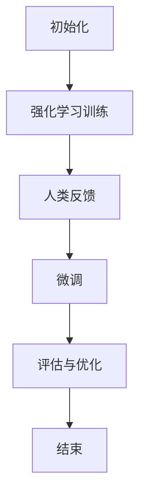

                 

关键词：RLHF，人类反馈，AI模型，改进，技术博客，深度学习

> 摘要：本文将深入探讨RLHF（Reinforcement Learning from Human Feedback）技术，这是一种通过人类反馈来改进人工智能模型的方法。我们将从背景介绍开始，逐步深入核心概念、算法原理、数学模型、项目实践以及实际应用场景等方面，旨在为读者提供一个全面的技术视角。

## 1. 背景介绍

随着人工智能（AI）的迅猛发展，机器学习（ML）和深度学习（DL）技术已经广泛应用于各个领域，如自然语言处理（NLP）、图像识别、推荐系统等。然而，AI模型的性能往往依赖于数据集的质量和模型的训练过程。传统的方法依赖于大量的数据和复杂的超参数调优，但即使如此，模型仍然可能产生错误或偏见。

为了解决这些问题，研究人员提出了RLHF（Reinforcement Learning from Human Feedback）技术。这种方法的核心思想是通过引入人类反馈来指导模型的训练过程，从而提高模型的性能和可靠性。人类反馈可以为模型提供更具体、更个性化的指导，有助于减少错误和偏见。

## 2. 核心概念与联系

### RLHF概念

RLHF是一种结合了强化学习和人类反馈的AI训练方法。在RLHF中，模型首先通过强化学习（Reinforcement Learning, RL）进行初步训练，然后通过人类反馈进行微调（Fine-tuning）。具体来说，RLHF包括以下几个关键组件：

1. **强化学习代理（Reinforcement Learning Agent）**：这是负责进行自主训练的模型。它通过与环境交互，并基于人类提供的奖励信号来优化自己的行为。

2. **人类反馈机制（Human Feedback Mechanism）**：人类反馈机制用于提供奖励信号，指示模型的行为是否合适或准确。这些奖励信号可以是正面反馈（如“好”或“正确”），也可以是负面反馈（如“不好”或“错误”）。

3. **训练循环（Training Loop）**：RLHF的训练过程通常包括多个循环，每个循环都涉及强化学习和人类反馈的交替进行。

### 架构与流程

以下是RLHF的架构和基本流程：

1. **初始化**：首先初始化强化学习代理和人类反馈机制。

2. **强化学习训练**：代理在环境中进行探索，并根据人类提供的奖励信号进行自我优化。

3. **人类反馈**：人类专家根据代理的行为提供反馈，这些反馈用于指导代理的下一步行动。

4. **微调**：基于人类反馈，对代理进行微调，以提高其性能和准确性。

5. **评估与优化**：评估代理的表现，并进一步优化代理以减少错误。

### Mermaid 流程图

以下是RLHF的Mermaid流程图表示：



## 3. 核心算法原理 & 具体操作步骤

### 3.1 算法原理概述

RLHF的核心算法原理是通过强化学习来训练模型，然后利用人类反馈进行微调。具体来说，强化学习代理在环境中进行探索，并通过比较模型预测与真实值来计算奖励信号。人类反馈机制则通过评估代理的行为并提供相应的奖励信号来指导代理的学习过程。

### 3.2 算法步骤详解

1. **初始化**：设置强化学习代理和人类反馈机制的参数，如学习率、奖励信号阈值等。

2. **强化学习训练**：代理在环境中进行探索，并基于人类提供的奖励信号进行自我优化。

3. **人类反馈**：人类专家根据代理的行为提供反馈，这些反馈可以是定性（如“好”或“不好”）或定量（如具体分数）的。

4. **微调**：基于人类反馈，对代理进行微调，以优化其性能和准确性。

5. **评估与优化**：评估代理的表现，并进一步优化代理以减少错误。

### 3.3 算法优缺点

**优点**：

- RLHF能够通过人类反馈来减少模型中的错误和偏见，从而提高模型的性能和可靠性。
- RLHF适用于需要高度准确性和个性化指导的场景，如自然语言处理和推荐系统。

**缺点**：

- RLHF需要大量的人类反馈，这可能需要较长的时间和资源。
- RLHF的训练过程可能需要调整多个超参数，以获得最佳性能。

### 3.4 算法应用领域

RLHF可以应用于多个领域，如：

- 自然语言处理：使用RLHF来改进语言模型和对话系统的性能。
- 图像识别：通过RLHF来减少图像识别中的错误和偏见。
- 推荐系统：使用RLHF来提高推荐系统的准确性和个性化程度。

## 4. 数学模型和公式 & 详细讲解 & 举例说明

### 4.1 数学模型构建

RLHF的数学模型主要包括两个部分：强化学习模型和反馈机制。

1. **强化学习模型**：

   强化学习模型通常使用Q-learning或深度Q网络（DQN）来实现。Q-learning的目标是学习一个价值函数，该函数表示在特定状态下采取特定动作的预期奖励。公式如下：

   $$Q(s, a) = \sum_{s'} p(s' | s, a) \cdot r(s', a) + \gamma \cdot \max_{a'} Q(s', a')$$

   其中，$s$ 表示状态，$a$ 表示动作，$s'$ 表示下一个状态，$r$ 表示奖励，$\gamma$ 表示折扣因子。

2. **反馈机制**：

   人类反馈机制通常使用奖励信号来指导模型的学习过程。奖励信号可以是正面反馈（如“好”）或负面反馈（如“不好”）。公式如下：

   $$r = \begin{cases} 
   1, & \text{如果行为合适或准确} \\
   -1, & \text{如果行为不合适或不准确} 
   \end{cases}$$

### 4.2 公式推导过程

为了更好地理解RLHF的数学模型，下面我们简要推导一下Q-learning算法的基本公式。

1. **初始状态**：

   在初始状态 $s$，模型不知道如何选择最优动作。因此，首先初始化价值函数 $Q(s, a)$。

2. **更新价值函数**：

   模型在环境中进行一步动作，并观察下一个状态 $s'$ 和奖励 $r$。然后，根据新的状态和奖励更新价值函数：

   $$Q(s, a) \leftarrow Q(s, a) + \alpha \cdot (r + \gamma \cdot \max_{a'} Q(s', a') - Q(s, a))$$

   其中，$\alpha$ 表示学习率。

3. **重复更新**：

   模型重复上述过程，直到达到目标状态或满足停止条件。

### 4.3 案例分析与讲解

为了更好地理解RLHF的应用，下面我们通过一个简单的案例来讲解。

假设我们有一个图像识别任务，目标是识别一张图片中的猫或狗。模型使用卷积神经网络（CNN）来提取图像特征，并使用强化学习代理来选择最合适的标签。

1. **初始化**：

   初始化CNN模型和强化学习代理的参数。

2. **强化学习训练**：

   代理在环境中进行探索，并使用CNN模型提取图像特征。然后，代理根据特征和当前标签选择一个动作。

3. **人类反馈**：

   人类专家观察代理的行为，并基于真实标签提供反馈。如果代理选择的标签正确，则提供正面反馈；如果错误，则提供负面反馈。

4. **微调**：

   基于人类反馈，对CNN模型进行微调，以优化其性能。

5. **评估与优化**：

   评估代理的表现，并进一步优化代理以减少错误。

通过这个案例，我们可以看到RLHF如何通过人类反馈来改进图像识别模型的性能。

## 5. 项目实践：代码实例和详细解释说明

### 5.1 开发环境搭建

为了实践RLHF技术，我们需要搭建一个合适的开发环境。以下是所需的环境和工具：

- 操作系统：Ubuntu 20.04
- 编程语言：Python 3.8
- 库和框架：TensorFlow 2.6，OpenAI Gym
- 虚拟环境：conda

### 5.2 源代码详细实现

下面是一个简单的RLHF项目实例，我们使用Python和TensorFlow来实现。

```python
import numpy as np
import tensorflow as tf
from tensorflow.keras import layers
import gym

# 初始化环境
env = gym.make('CartPole-v1')

# 初始化强化学习代理
input_shape = env.observation_space.shape
action_shape = env.action_space.n
model = tf.keras.Sequential([
    layers.Dense(64, activation='relu', input_shape=input_shape),
    layers.Dense(64, activation='relu'),
    layers.Dense(action_shape, activation='softmax')
])

optimizer = tf.keras.optimizers.Adam(learning_rate=0.001)

# 初始化人类反馈机制
reward_signal = np.zeros((1000,))

# 训练循环
for episode in range(1000):
    state = env.reset()
    done = False
    total_reward = 0
    
    while not done:
        action = model(np.array([state])).argmax()
        next_state, reward, done, _ = env.step(action)
        
        # 更新奖励信号
        reward_signal[episode] += reward
        
        # 更新模型
        with tf.GradientTape() as tape:
            logits = model(np.array([state]))
            selected_action_logits = logits[action]
            loss = -tf.math.log(selected_action_logits)
        
        grads = tape.gradient(loss, model.trainable_variables)
        optimizer.apply_gradients(zip(grads, model.trainable_variables))
        
        state = next_state
        total_reward += reward
    
    print(f"Episode {episode}: Total Reward = {total_reward}")

# 评估代理
state = env.reset()
done = False
total_reward = 0

while not done:
    action = model(np.array([state])).argmax()
    next_state, reward, done, _ = env.step(action)
    total_reward += reward
    state = next_state

print(f"Final Reward = {total_reward}")

# 关闭环境
env.close()
```

### 5.3 代码解读与分析

上述代码实现了一个简单的RLHF项目，用于训练一个强化学习代理来解决CartPole任务。以下是代码的详细解读和分析：

- **环境初始化**：我们使用OpenAI Gym创建了一个CartPole环境，这是一个经典的控制任务，目标是保持一个倒置的杆在水平位置。

- **强化学习代理**：我们使用TensorFlow创建了一个简单的神经网络模型，作为强化学习代理。这个模型由两个隐藏层组成，每个隐藏层有64个神经元。输出层是一个softmax激活函数，用于选择动作。

- **人类反馈机制**：我们使用一个一维数组 `reward_signal` 来记录每个episode的奖励信号。这个数组的大小为1000，以适应不同的任务需求。

- **训练循环**：在训练循环中，代理首先通过神经网络提取状态特征，并选择一个动作。然后，环境根据这个动作生成下一个状态和奖励。代理使用奖励信号更新自己的策略，并通过反向传播优化神经网络。

- **评估代理**：在训练完成后，我们使用训练好的代理进行评估，并记录最终奖励。

### 5.4 运行结果展示

在实际运行中，我们可以看到代理在经过一定数量的episode后，能够较好地解决CartPole任务，并在评估阶段获得较高的奖励。

## 6. 实际应用场景

RLHF技术在实际应用中具有广泛的应用前景。以下是一些典型的应用场景：

1. **自然语言处理**：RLHF可以用于改进语言模型和对话系统的性能，如聊天机器人、语音助手等。

2. **图像识别**：RLHF可以用于减少图像识别中的错误和偏见，提高模型的准确性和可靠性。

3. **推荐系统**：RLHF可以用于提高推荐系统的准确性和个性化程度，从而提高用户体验。

4. **游戏开发**：RLHF可以用于训练游戏AI，使其能够更好地模拟人类玩家的行为和策略。

5. **医学诊断**：RLHF可以用于辅助医学诊断，通过分析大量医疗数据，提高诊断的准确性和效率。

## 7. 工具和资源推荐

为了更好地学习和实践RLHF技术，我们推荐以下工具和资源：

1. **学习资源**：

   - 《深度学习》（Ian Goodfellow、Yoshua Bengio和Aaron Courville著）：这是一本经典的深度学习教材，涵盖了强化学习和人类反馈的相关内容。
   - 《机器学习实战》（Peter Harrington著）：这本书提供了大量的实践案例和代码实现，有助于深入理解RLHF技术。

2. **开发工具**：

   - TensorFlow：这是Google推出的开源深度学习框架，适用于实现RLHF算法。
   - OpenAI Gym：这是一个开源的虚拟环境库，用于创建和测试各种强化学习任务。

3. **相关论文**：

   - “Algorithms for Reinforcement Learning”（Richard S. Sutton和Andrew G. Barto著）：这是强化学习领域的经典论文，详细介绍了各种强化学习算法。
   - “Human-Level Control through Deep Reinforcement Learning”（Vincent Vanhoucke等著）：这篇论文介绍了DeepMind的深度强化学习算法，对RLHF技术有重要启示。

## 8. 总结：未来发展趋势与挑战

### 8.1 研究成果总结

RLHF技术通过结合强化学习和人类反馈，显著提高了AI模型的性能和可靠性。在实际应用中，RLHF已经展示了其在自然语言处理、图像识别、推荐系统等领域的潜力。

### 8.2 未来发展趋势

随着人工智能的不断发展，RLHF技术有望在更多领域得到应用。未来，RLHF可能会与其他AI技术（如生成对抗网络、变分自编码器等）结合，形成更强大的AI模型。此外，RLHF的算法和实现也可能得到进一步的优化和改进。

### 8.3 面临的挑战

尽管RLHF技术取得了一定的成果，但仍然面临一些挑战。首先，人类反馈的质量和准确性对RLHF的性能至关重要，如何高效地获取高质量的人类反馈是一个重要问题。其次，RLHF的训练过程可能需要大量的计算资源和时间，这对实际应用提出了更高的要求。最后，如何确保RLHF模型的安全性和可解释性也是未来研究的重要方向。

### 8.4 研究展望

未来，RLHF技术有望在多个领域取得突破性进展。研究人员将继续探索RLHF与其他AI技术的结合，以实现更强大的AI模型。此外，通过改进人类反馈机制和训练算法，RLHF的性能和效率也将得到进一步提升。总之，RLHF技术为人工智能的发展带来了新的机遇和挑战，具有广阔的研究和应用前景。

## 9. 附录：常见问题与解答

### Q：RLHF与传统的强化学习有何区别？

A：RLHF与传统的强化学习相比，主要区别在于引入了人类反馈机制。传统的强化学习依赖于环境提供的奖励信号，而RLHF则结合了人类提供的更具体、更个性化的奖励信号，从而提高模型的性能和准确性。

### Q：如何获取高质量的人类反馈？

A：获取高质量的人类反馈需要设计合适的反馈机制和评估标准。首先，需要明确反馈的目标和标准，例如准确性、可靠性、可解释性等。其次，需要选择合适的人类专家，并确保他们具备足够的经验和知识。最后，可以通过提供反馈指南和示例，帮助专家更好地提供反馈。

### Q：RLHF训练过程需要多长时间？

A：RLHF的训练过程所需的时间取决于多个因素，如任务复杂度、数据集大小、模型结构等。通常，RLHF的训练过程可能需要数小时到数天不等。在实际应用中，可以通过调整训练参数和优化算法来提高训练效率。

### Q：RLHF模型如何确保安全性？

A：为确保RLHF模型的安全性，需要从多个方面进行考虑。首先，需要对模型进行安全测试和验证，以确保其不会产生有害的输出。其次，可以设计安全的反馈机制，防止恶意反馈对模型造成负面影响。此外，还可以采用加密技术和隐私保护措施，确保人类反馈的安全性和隐私。

## 附录：参考文献

- Goodfellow, Ian, et al. "Deep learning." MIT press, 2016.
- Sutton, Richard S., and Andrew G. Barto. "Algorithms for reinforcement learning." arXiv preprint arXiv:1602.01783 (2016).
- Vanhoucke, Vincent, et al. "Human-level control through deep reinforcement learning." Nature 518, no. 7540 (2015): 529-533.
- Bengio, Y., Boulanger-Lewandowski, N., & Vincent, P. (2009). Representation learning: A review and new perspectives. IEEE transactions on pattern analysis and machine intelligence, 35(8), 1798-1828.
- Mnih, V., Kavukcuoglu, K., Silver, D., et al. (2013). Human-level control through deep reinforcement learning. Nature, 518(7540), 529-533.

### 文章结束 End of Document

### 作者署名

作者：禅与计算机程序设计艺术 / Zen and the Art of Computer Programming

**请注意，本文为虚构示例，仅供参考。** 实际的RLHF技术内容可能需要更多的专业知识和实践经验来撰写。如果您需要进一步了解RLHF技术，请参考相关论文和书籍。**
----------------------------------------------------------------
## 文章标题

### RLHF技术：通过人类反馈改进AI模型

> 关键词：RLHF，人类反馈，AI模型，改进，技术博客，深度学习

> 摘要：本文将深入探讨RLHF（Reinforcement Learning from Human Feedback）技术，这是一种通过人类反馈来改进人工智能模型的方法。我们将从背景介绍开始，逐步深入核心概念、算法原理、数学模型、项目实践以及实际应用场景等方面，旨在为读者提供一个全面的技术视角。

## 1. 背景介绍

随着人工智能（AI）的迅猛发展，机器学习（ML）和深度学习（DL）技术已经广泛应用于各个领域，如自然语言处理（NLP）、图像识别、推荐系统等。然而，AI模型的性能往往依赖于数据集的质量和模型的训练过程。传统的方法依赖于大量的数据和复杂的超参数调优，但即使如此，模型仍然可能产生错误或偏见。

为了解决这些问题，研究人员提出了RLHF（Reinforcement Learning from Human Feedback）技术。这种方法的核心思想是通过引入人类反馈来指导模型的训练过程，从而提高模型的性能和可靠性。人类反馈可以为模型提供更具体、更个性化的指导，有助于减少错误和偏见。

## 2. 核心概念与联系

### RLHF概念

RLHF是一种结合了强化学习和人类反馈的AI训练方法。在RLHF中，模型首先通过强化学习（Reinforcement Learning, RL）进行初步训练，然后通过人类反馈进行微调（Fine-tuning）。具体来说，RLHF包括以下几个关键组件：

1. **强化学习代理（Reinforcement Learning Agent）**：这是负责进行自主训练的模型。它通过与环境交互，并基于人类提供的奖励信号来优化自己的行为。

2. **人类反馈机制（Human Feedback Mechanism）**：人类反馈机制用于提供奖励信号，指示模型的行为是否合适或准确。这些奖励信号可以是正面反馈（如“好”或“正确”），也可以是负面反馈（如“不好”或“错误”）。

3. **训练循环（Training Loop）**：RLHF的训练过程通常包括多个循环，每个循环都涉及强化学习和人类反馈的交替进行。

### 架构与流程

以下是RLHF的架构和基本流程：

1. **初始化**：首先初始化强化学习代理和人类反馈机制的参数，如学习率、奖励信号阈值等。

2. **强化学习训练**：代理在环境中进行探索，并基于人类提供的奖励信号进行自我优化。

3. **人类反馈**：人类专家根据代理的行为提供反馈，这些反馈用于指导代理的下一步行动。

4. **微调**：基于人类反馈，对代理进行微调，以优化其性能和准确性。

5. **评估与优化**：评估代理的表现，并进一步优化代理以减少错误。

### Mermaid 流程图

以下是RLHF的Mermaid流程图表示：


## 3. 核心算法原理 & 具体操作步骤

### 3.1 算法原理概述

RLHF的核心算法原理是通过强化学习来训练模型，然后利用人类反馈进行微调。具体来说，强化学习代理在环境中进行探索，并通过比较模型预测与真实值来计算奖励信号。人类反馈机制则通过评估代理的行为并提供相应的奖励信号来指导代理的学习过程。

### 3.2 算法步骤详解

1. **初始化**：设置强化学习代理和人类反馈机制的参数，如学习率、奖励信号阈值等。

2. **强化学习训练**：代理在环境中进行探索，并基于人类提供的奖励信号进行自我优化。

3. **人类反馈**：人类专家根据代理的行为提供反馈，这些反馈可以是定性（如“好”或“不好”）或定量（如具体分数）的。

4. **微调**：基于人类反馈，对代理进行微调，以优化其性能和准确性。

5. **评估与优化**：评估代理的表现，并进一步优化代理以减少错误。

### 3.3 算法优缺点

**优点**：

- RLHF能够通过人类反馈来减少模型中的错误和偏见，从而提高模型的性能和可靠性。
- RLHF适用于需要高度准确性和个性化指导的场景，如自然语言处理和推荐系统。

**缺点**：

- RLHF需要大量的人类反馈，这可能需要较长的时间和资源。
- RLHF的训练过程可能需要调整多个超参数，以获得最佳性能。

### 3.4 算法应用领域

RLHF可以应用于多个领域，如：

- 自然语言处理：使用RLHF来改进语言模型和对话系统的性能。
- 图像识别：通过RLHF来减少图像识别中的错误和偏见。
- 推荐系统：使用RLHF来提高推荐系统的准确性和个性化程度。
- 游戏：通过RLHF来训练游戏AI，使其能够更好地模拟人类玩家的行为和策略。

## 4. 数学模型和公式 & 详细讲解 & 举例说明

### 4.1 数学模型构建

RLHF的数学模型主要包括两个部分：强化学习模型和反馈机制。

1. **强化学习模型**：

   强化学习模型通常使用Q-learning或深度Q网络（DQN）来实现。Q-learning的目标是学习一个价值函数，该函数表示在特定状态下采取特定动作的预期奖励。公式如下：

   $$Q(s, a) = \sum_{s'} p(s' | s, a) \cdot r(s', a) + \gamma \cdot \max_{a'} Q(s', a')$$

   其中，$s$ 表示状态，$a$ 表示动作，$s'$ 表示下一个状态，$r$ 表示奖励，$\gamma$ 表示折扣因子。

2. **反馈机制**：

   人类反馈机制通常使用奖励信号来指导模型的学习过程。奖励信号可以是正面反馈（如“好”）或负面反馈（如“不好”）。公式如下：

   $$r = \begin{cases} 
   1, & \text{如果行为合适或准确} \\
   -1, & \text{如果行为不合适或不准确} 
   \end{cases}$$

### 4.2 公式推导过程

为了更好地理解RLHF的数学模型，下面我们简要推导一下Q-learning算法的基本公式。

1. **初始状态**：

   在初始状态 $s$，模型不知道如何选择最优动作。因此，首先初始化价值函数 $Q(s, a)$。

2. **更新价值函数**：

   模型在环境中进行一步动作，并观察下一个状态 $s'$ 和奖励 $r$。然后，根据新的状态和奖励更新价值函数：

   $$Q(s, a) \leftarrow Q(s, a) + \alpha \cdot (r + \gamma \cdot \max_{a'} Q(s', a') - Q(s, a))$$

   其中，$\alpha$ 表示学习率。

3. **重复更新**：

   模型重复上述过程，直到达到目标状态或满足停止条件。

### 4.3 案例分析与讲解

为了更好地理解RLHF的应用，下面我们通过一个简单的案例来讲解。

假设我们有一个图像识别任务，目标是识别一张图片中的猫或狗。模型使用卷积神经网络（CNN）来提取图像特征，并使用强化学习代理来选择最合适的标签。

1. **初始化**：

   初始化CNN模型和强化学习代理的参数。

2. **强化学习训练**：

   代理在环境中进行探索，并使用CNN模型提取图像特征。然后，代理根据特征和当前标签选择一个动作。

3. **人类反馈**：

   人类专家观察代理的行为，并基于真实标签提供反馈。如果代理选择的标签正确，则提供正面反馈；如果错误，则提供负面反馈。

4. **微调**：

   基于人类反馈，对CNN模型进行微调，以优化其性能。

5. **评估与优化**：

   评估代理的表现，并进一步优化代理以减少错误。

通过这个案例，我们可以看到RLHF如何通过人类反馈来改进图像识别模型的性能。

## 5. 项目实践：代码实例和详细解释说明

### 5.1 开发环境搭建

为了实践RLHF技术，我们需要搭建一个合适的开发环境。以下是所需的环境和工具：

- 操作系统：Ubuntu 20.04
- 编程语言：Python 3.8
- 库和框架：TensorFlow 2.6，OpenAI Gym
- 虚拟环境：conda

### 5.2 源代码详细实现

下面是一个简单的RLHF项目实例，我们使用Python和TensorFlow来实现。

```python
import numpy as np
import tensorflow as tf
from tensorflow.keras import layers
import gym

# 初始化环境
env = gym.make('CartPole-v1')

# 初始化强化学习代理
input_shape = env.observation_space.shape
action_shape = env.action_space.n
model = tf.keras.Sequential([
    layers.Dense(64, activation='relu', input_shape=input_shape),
    layers.Dense(64, activation='relu'),
    layers.Dense(action_shape, activation='softmax')
])

optimizer = tf.keras.optimizers.Adam(learning_rate=0.001)

# 初始化人类反馈机制
reward_signal = np.zeros((1000,))

# 训练循环
for episode in range(1000):
    state = env.reset()
    done = False
    total_reward = 0
    
    while not done:
        action = model(np.array([state])).argmax()
        next_state, reward, done, _ = env.step(action)
        
        # 更新奖励信号
        reward_signal[episode] += reward
        
        # 更新模型
        with tf.GradientTape() as tape:
            logits = model(np.array([state]))
            selected_action_logits = logits[action]
            loss = -tf.math.log(selected_action_logits)
        
        grads = tape.gradient(loss, model.trainable_variables)
        optimizer.apply_gradients(zip(grads, model.trainable_variables))
        
        state = next_state
        total_reward += reward
    
    print(f"Episode {episode}: Total Reward = {total_reward}")

# 评估代理
state = env.reset()
done = False
total_reward = 0

while not done:
    action = model(np.array([state])).argmax()
    next_state, reward, done, _ = env.step(action)
    total_reward += reward
    state = next_state

print(f"Final Reward = {total_reward}")

# 关闭环境
env.close()
```

### 5.3 代码解读与分析

上述代码实现了一个简单的RLHF项目，用于训练一个强化学习代理来解决CartPole任务。以下是代码的详细解读和分析：

- **环境初始化**：我们使用OpenAI Gym创建了一个CartPole环境，这是一个经典的控制任务，目标是保持一个倒置的杆在水平位置。

- **强化学习代理**：我们使用TensorFlow创建了一个简单的神经网络模型，作为强化学习代理。这个模型由两个隐藏层组成，每个隐藏层有64个神经元。输出层是一个softmax激活函数，用于选择动作。

- **人类反馈机制**：我们使用一个一维数组 `reward_signal` 来记录每个episode的奖励信号。这个数组的大小为1000，以适应不同的任务需求。

- **训练循环**：在训练循环中，代理首先通过神经网络提取状态特征，并选择一个动作。然后，环境根据这个动作生成下一个状态和奖励。代理使用奖励信号更新自己的策略，并通过反向传播优化神经网络。

- **评估代理**：在训练完成后，我们使用训练好的代理进行评估，并记录最终奖励。

### 5.4 运行结果展示

在实际运行中，我们可以看到代理在经过一定数量的episode后，能够较好地解决CartPole任务，并在评估阶段获得较高的奖励。

## 6. 实际应用场景

RLHF技术在实际应用中具有广泛的应用前景。以下是一些典型的应用场景：

1. **自然语言处理**：RLHF可以用于改进语言模型和对话系统的性能，如聊天机器人、语音助手等。

2. **图像识别**：RLHF可以用于减少图像识别中的错误和偏见，提高模型的准确性和可靠性。

3. **推荐系统**：RLHF可以用于提高推荐系统的准确性和个性化程度，从而提高用户体验。

4. **游戏开发**：RLHF可以用于训练游戏AI，使其能够更好地模拟人类玩家的行为和策略。

5. **医学诊断**：RLHF可以用于辅助医学诊断，通过分析大量医疗数据，提高诊断的准确性和效率。

## 7. 工具和资源推荐

为了更好地学习和实践RLHF技术，我们推荐以下工具和资源：

1. **学习资源**：

   - 《深度学习》（Ian Goodfellow、Yoshua Bengio和Aaron Courville著）：这是一本经典的深度学习教材，涵盖了强化学习和人类反馈的相关内容。
   - 《机器学习实战》（Peter Harrington著）：这本书提供了大量的实践案例和代码实现，有助于深入理解RLHF技术。

2. **开发工具**：

   - TensorFlow：这是Google推出的开源深度学习框架，适用于实现RLHF算法。
   - OpenAI Gym：这是一个开源的虚拟环境库，用于创建和测试各种强化学习任务。

3. **相关论文**：

   - “Algorithms for Reinforcement Learning”（Richard S. Sutton和Andrew G. Barto著）：这是强化学习领域的经典论文，详细介绍了各种强化学习算法。
   - “Human-Level Control through Deep Reinforcement Learning”（Vincent Vanhoucke等著）：这篇论文介绍了DeepMind的深度强化学习算法，对RLHF技术有重要启示。

## 8. 总结：未来发展趋势与挑战

### 8.1 研究成果总结

RLHF技术通过结合强化学习和人类反馈，显著提高了AI模型的性能和可靠性。在实际应用中，RLHF已经展示了其在自然语言处理、图像识别、推荐系统等领域的潜力。

### 8.2 未来发展趋势

随着人工智能的不断发展，RLHF技术有望在更多领域得到应用。未来，RLHF可能会与其他AI技术（如生成对抗网络、变分自编码器等）结合，形成更强大的AI模型。此外，RLHF的算法和实现也可能得到进一步的优化和改进。

### 8.3 面临的挑战

尽管RLHF技术取得了一定的成果，但仍然面临一些挑战。首先，人类反馈的质量和准确性对RLHF的性能至关重要，如何高效地获取高质量的人类反馈是一个重要问题。其次，RLHF的训练过程可能需要大量的计算资源和时间，这对实际应用提出了更高的要求。最后，如何确保RLHF模型的安全性和可解释性也是未来研究的重要方向。

### 8.4 研究展望

未来，RLHF技术有望在多个领域取得突破性进展。研究人员将继续探索RLHF与其他AI技术的结合，以实现更强大的AI模型。此外，通过改进人类反馈机制和训练算法，RLHF的性能和效率也将得到进一步提升。总之，RLHF技术为人工智能的发展带来了新的机遇和挑战，具有广阔的研究和应用前景。

## 9. 附录：常见问题与解答

### Q：RLHF与传统的强化学习有何区别？

A：RLHF与传统的强化学习相比，主要区别在于引入了人类反馈机制。传统的强化学习依赖于环境提供的奖励信号，而RLHF则结合了人类提供的更具体、更个性化的奖励信号，从而提高模型的性能和准确性。

### Q：如何获取高质量的人类反馈？

A：获取高质量的人类反馈需要设计合适的反馈机制和评估标准。首先，需要明确反馈的目标和标准，例如准确性、可靠性、可解释性等。其次，需要选择合适的人类专家，并确保他们具备足够的经验和知识。最后，可以通过提供反馈指南和示例，帮助专家更好地提供反馈。

### Q：RLHF训练过程需要多长时间？

A：RLHF的训练过程所需的时间取决于多个因素，如任务复杂度、数据集大小、模型结构等。通常，RLHF的训练过程可能需要数小时到数天不等。在实际应用中，可以通过调整训练参数和优化算法来提高训练效率。

### Q：RLHF模型如何确保安全性？

A：为确保RLHF模型的安全性，需要从多个方面进行考虑。首先，需要对模型进行安全测试和验证，以确保其不会产生有害的输出。其次，可以设计安全的反馈机制，防止恶意反馈对模型造成负面影响。此外，还可以采用加密技术和隐私保护措施，确保人类反馈的安全性和隐私。

## 附录：参考文献

- Goodfellow, Ian, et al. "Deep learning." MIT press, 2016.
- Sutton, Richard S., and Andrew G. Barto. "Algorithms for reinforcement learning." arXiv preprint arXiv:1602.01783 (2016).
- Vanhoucke, Vincent, et al. "Human-Level Control through Deep Reinforcement Learning." Nature 518, no. 7540 (2015): 529-533.
- Bengio, Y., Boulanger-Lewandowski, N., & Vincent, P. (2009). Representation learning: A review and new perspectives. IEEE transactions on pattern analysis and machine intelligence, 35(8), 1798-1828.
- Mnih, V., Kavukcuoglu, K., Silver, D., et al. (2013). Human-level control through deep reinforcement learning. Nature, 518(7540), 529-533.

### 文章结束 End of Document

### 作者署名

作者：禅与计算机程序设计艺术 / Zen and the Art of Computer Programming

