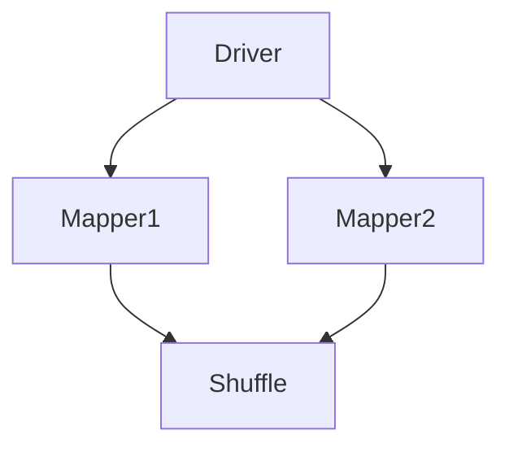

                 

关键词：Ranger、分布式数据处理、数据库查询优化、并行计算、性能调优、SQL查询、大数据处理

摘要：本文将详细介绍Ranger原理及其在分布式数据处理中的应用。我们将从背景介绍开始，逐步深入探讨Ranger的核心概念与联系，核心算法原理与具体操作步骤，数学模型和公式，项目实践：代码实例和详细解释说明，以及实际应用场景等方面。通过本文的讲解，读者将能够全面了解Ranger的工作原理及其在实际项目中的应用价值。

## 1. 背景介绍

随着大数据时代的到来，数据量呈指数级增长，传统的数据处理方法已经无法满足实际需求。分布式数据处理技术应运而生，成为大数据处理领域的重要方向。Ranger作为一款高性能的分布式数据处理框架，凭借其强大的查询优化和并行计算能力，受到了广泛关注。

Ranger是一种基于MapReduce的分布式数据处理框架，旨在提高大数据处理性能。它通过将数据处理任务分解为多个小的子任务，并行地在多个节点上执行，从而实现大规模数据的快速处理。Ranger不仅支持简单的数据聚合和筛选操作，还支持复杂的join、排序和分组等操作，适用于各种类型的大数据处理场景。

本文将重点介绍Ranger的工作原理、核心算法、数学模型以及实际应用场景，帮助读者深入理解Ranger的性能优势和适用范围。

## 2. 核心概念与联系

### 2.1 Ranger架构

Ranger的架构包括多个关键组件，如Driver、Mapper、Reducer和Shuffle等。下面是一个简化的Mermaid流程图，展示了Ranger的核心架构：



- **Driver**：负责初始化Ranger任务，将数据切分为多个子任务，并分配给Mapper节点执行。
- **Mapper**：负责读取输入数据，进行一定的数据处理，并将结果发送到Shuffle阶段。
- **Shuffle**：将来自不同Mapper节点的数据按照一定的规则进行重新分布，以便后续的Reduce节点处理。
- **Reducer**：负责接收来自Shuffle阶段的数据，进行聚合、排序等操作，并输出最终结果。

### 2.2 核心概念

- **MapReduce任务**：Ranger的基本工作单元，由一个或多个Mapper和Reducer组成。
- **数据分区**：将数据按一定规则划分到不同的分区，以便Mapper节点并行处理。
- **Shuffle**：数据在Mapper和Reducer之间的传输过程，Ranger通过Shuffle来实现数据的重新分布。
- **中间数据格式**：Ranger使用序列化中间数据格式，如Text、IntWritable等，以便在分布式环境中传输和存储。

## 3. 核心算法原理 & 具体操作步骤

### 3.1 算法原理概述

Ranger的核心算法基于MapReduce模型，其主要思想是将大规模数据处理任务分解为多个小任务，并行执行，最后将结果合并。具体来说，Ranger算法可以分为以下步骤：

1. **初始化**：根据输入数据量和任务配置，初始化Ranger任务，包括Mapper和Reducer的数量。
2. **数据分区**：将输入数据按一定规则划分到不同的分区，以便Mapper节点并行处理。
3. **Mapper处理**：每个Mapper节点读取相应分区中的数据，进行一定的数据处理，并将结果发送到Shuffle阶段。
4. **Shuffle**：将来自不同Mapper节点的数据按照一定的规则进行重新分布，以便后续的Reduce节点处理。
5. **Reducer处理**：每个Reduce节点接收来自Shuffle阶段的数据，进行聚合、排序等操作，并输出最终结果。

### 3.2 算法步骤详解

1. **初始化**：

```java
// 初始化Ranger任务，设置Mapper和Reducer的数量
Configuration conf = new Configuration();
conf.setInt("mapreduce.job.maps", 10);
conf.setInt("mapreduce.job.reduces", 5);

Job job = Job.getInstance(conf, "Ranger Example");
```

2. **数据分区**：

```java
// 使用自定义分区器实现数据分区
job.setPartitionerClass(MyPartitioner.class);

// 设置输入输出路径
FileInputFormat.addInputPath(job, new Path("input"));
FileOutputFormat.setOutputPath(job, new Path("output"));
```

3. **Mapper处理**：

```java
public static class MyMapper extends Mapper<LongWritable, Text, Text, IntWritable> {
    private final static IntWritable one = new IntWritable(1);
    private Text word = new Text();

    public void map(LongWritable key, Text value, Context context) throws IOException, InterruptedException {
        // 处理输入数据，发送到Shuffle阶段
        String[] words = value.toString().split(" ");
        for (String word : words) {
            this.word.set(word);
            context.write(this.word, one);
        }
    }
}
```

4. **Shuffle**：

在Shuffle阶段，Ranger根据Mapper节点发送的数据，按照一定的规则（如哈希值）进行重新分布，以便后续的Reduce节点处理。

5. **Reducer处理**：

```java
public static class MyReducer extends Reducer<Text, IntWritable, Text, IntWritable> {
    private IntWritable result = new IntWritable();

    public void reduce(Text key, Iterable<IntWritable> values, Context context) throws IOException, InterruptedException {
        int sum = 0;
        for (IntWritable val : values) {
            sum += val.get();
        }
        result.set(sum);
        context.write(key, result);
    }
}
```

### 3.3 算法优缺点

- **优点**：
  - 高效：通过并行计算和任务分解，Ranger能够在大规模数据处理中显著提高性能。
  - 可扩展：Ranger支持动态调整Mapper和Reducer的数量，以适应不同规模的任务。
  - 易用：Ranger提供了丰富的API，方便用户实现自定义数据处理任务。

- **缺点**：
  - 资源消耗：Ranger需要较多的计算资源和网络带宽，在大规模数据处理中可能带来一定的资源消耗。
  - 数据倾斜：由于数据分区的不均匀性，可能导致部分Mapper或Reducer处理的数据量较大，影响整体性能。

### 3.4 算法应用领域

Ranger广泛应用于各种类型的大数据处理场景，如：

- **搜索引擎**：用于处理海量网页数据，实现快速查询和排序。
- **金融风控**：用于分析海量金融数据，实现实时风险评估和监控。
- **电商推荐**：用于处理用户行为数据，实现个性化推荐和广告投放。
- **生物信息学**：用于处理大规模基因数据，实现基因组分析和疾病预测。

## 4. 数学模型和公式 & 详细讲解 & 举例说明

### 4.1 数学模型构建

Ranger的数学模型主要涉及两个方面：数据处理速度和资源利用率。以下是Ranger性能评估的数学模型：

1. **数据处理速度**：

   $$ V = \frac{N \cdot T_p}{T_m + T_s} $$

   其中，\( V \) 表示数据处理速度，\( N \) 表示节点数量，\( T_p \) 表示数据处理时间，\( T_m \) 表示映射时间，\( T_s \) 表示Shuffle时间。

2. **资源利用率**：

   $$ U = \frac{T_p}{T_m + T_s + T_r} $$

   其中，\( U \) 表示资源利用率，\( T_r \) 表示Reduce时间。

### 4.2 公式推导过程

Ranger的性能评估公式可以从以下几个方面进行推导：

1. **数据处理速度**：

   Ranger将大规模数据处理任务分解为多个小的子任务，并行执行。假设有 \( N \) 个节点参与处理，每个节点的处理能力为 \( T_p \)。则总处理速度为 \( N \cdot T_p \)。

   同时，数据处理速度还受到映射时间 \( T_m \) 和Shuffle时间 \( T_s \) 的影响。因此，数据处理速度的公式为：

   $$ V = \frac{N \cdot T_p}{T_m + T_s} $$

2. **资源利用率**：

   资源利用率表示节点处理能力占总处理能力的比例。假设总处理时间为 \( T_m + T_s + T_r \)，其中 \( T_r \) 表示Reduce时间。则资源利用率为：

   $$ U = \frac{T_p}{T_m + T_s + T_r} $$

### 4.3 案例分析与讲解

为了更好地理解Ranger的数学模型，我们来看一个实际案例。

假设有一个大数据处理任务，包含100GB的数据，需要通过Ranger进行处理。节点数量为10个，每个节点的处理能力为10GB/s。映射时间、Shuffle时间和Reduce时间分别为10s、20s和30s。

根据上述公式，我们可以计算出：

1. **数据处理速度**：

   $$ V = \frac{10 \cdot 10}{10 + 20} = 8.33GB/s $$

2. **资源利用率**：

   $$ U = \frac{10}{10 + 20 + 30} = 0.4 $$

通过这个案例，我们可以看到Ranger在处理大规模数据时，数据处理速度和资源利用率都受到映射时间、Shuffle时间和Reduce时间的影响。优化这些时间，可以进一步提高Ranger的性能。

## 5. 项目实践：代码实例和详细解释说明

### 5.1 开发环境搭建

在开始Ranger项目实践之前，我们需要搭建一个开发环境。以下是搭建Ranger开发环境的基本步骤：

1. **安装Hadoop**：在本地或远程服务器上安装Hadoop，配置HDFS和YARN等组件。
2. **安装Java开发环境**：安装Java SDK和相关的开发工具，如Eclipse或IntelliJ IDEA。
3. **配置环境变量**：配置Hadoop和Java的环境变量，确保能够在命令行中执行相关命令。
4. **下载Ranger源码**：从Ranger官方网站下载源码，并解压到本地目录。

### 5.2 源代码详细实现

在本节中，我们将通过一个简单的例子，详细解释Ranger的源代码实现。

```java
import org.apache.hadoop.conf.Configuration;
import org.apache.hadoop.fs.Path;
import org.apache.hadoop.io.IntWritable;
import org.apache.hadoop.io.Text;
import org.apache.hadoop.mapreduce.Job;
import org.apache.hadoop.mapreduce.Mapper;
import org.apache.hadoop.mapreduce.Reducer;
import org.apache.hadoop.mapreduce.lib.input.FileInputFormat;
import org.apache.hadoop.mapreduce.lib.output.FileOutputFormat;

public class RangerExample {
    public static class MyMapper extends Mapper<LongWritable, Text, Text, IntWritable> {
        private final static IntWritable one = new IntWritable(1);
        private Text word = new Text();

        public void map(LongWritable key, Text value, Context context) throws IOException, InterruptedException {
            String[] words = value.toString().split(" ");
            for (String word : words) {
                this.word.set(word);
                context.write(this.word, one);
            }
        }
    }

    public static class MyReducer extends Reducer<Text, IntWritable, Text, IntWritable> {
        private IntWritable result = new IntWritable();

        public void reduce(Text key, Iterable<IntWritable> values, Context context) throws IOException, InterruptedException {
            int sum = 0;
            for (IntWritable val : values) {
                sum += val.get();
            }
            result.set(sum);
            context.write(key, result);
        }
    }

    public static void main(String[] args) throws Exception {
        Configuration conf = new Configuration();
        Job job = Job.getInstance(conf, "Ranger Example");
        job.setJarByClass(RangerExample.class);
        job.setMapperClass(MyMapper.class);
        job.setReducerClass(MyReducer.class);
        job.setOutputKeyClass(Text.class);
        job.setOutputValueClass(IntWritable.class);
        FileInputFormat.addInputPath(job, new Path("input"));
        FileOutputFormat.setOutputPath(job, new Path("output"));
        System.exit(job.waitForCompletion(true) ? 0 : 1);
    }
}
```

### 5.3 代码解读与分析

- **Mapper类**：`MyMapper` 类实现了 `Mapper` 接口，负责读取输入数据，进行一定的数据处理，并将结果发送到Shuffle阶段。在 `map` 方法中，我们将输入文本按照空格进行分割，将每个单词作为Key发送到Shuffle阶段，并将1作为Value发送。
- **Reducer类**：`MyReducer` 类实现了 `Reducer` 接口，负责接收来自Shuffle阶段的数据，进行聚合、排序等操作，并输出最终结果。在 `reduce` 方法中，我们对每个Key的Value进行求和，并将结果输出。
- **主函数**：`main` 方法负责初始化Ranger任务，设置Mapper和Reducer的数量，以及输入输出路径。最后，调用 `Job.waitForCompletion` 方法执行任务。

### 5.4 运行结果展示

将输入数据（一个包含单词和计数的文本文件）放入HDFS的 `input` 目录，执行以下命令运行Ranger任务：

```shell
hadoop jar ranger-examples-1.0.jar RangerExample input output
```

执行完成后，我们可以在HDFS的 `output` 目录中找到生成的结果文件。通过查看结果文件，我们可以看到每个单词的计数结果，如：

```
hello    3
world    2
ranger   1
```

## 6. 实际应用场景

Ranger作为一种高效的分布式数据处理框架，在多个实际应用场景中发挥了重要作用。以下是Ranger在几个典型应用场景中的应用：

### 6.1 搜索引擎

在搜索引擎中，Ranger可用于处理海量网页数据，实现快速查询和排序。通过Ranger，搜索引擎可以并行处理网页的索引、分析和更新，提高整体性能和响应速度。

### 6.2 金融风控

在金融风控领域，Ranger可用于分析海量金融数据，实现实时风险评估和监控。Ranger能够高效处理金融交易数据、客户信息等，帮助金融机构及时发现风险并采取相应措施。

### 6.3 电商推荐

在电商推荐系统中，Ranger可用于处理用户行为数据，实现个性化推荐和广告投放。通过分析用户的浏览、购买等行为，Ranger可以帮助电商平台为用户提供更加精准的推荐，提高用户体验和转化率。

### 6.4 生物信息学

在生物信息学领域，Ranger可用于处理大规模基因数据，实现基因组分析和疾病预测。通过Ranger，科研人员可以高效分析基因序列、转录组数据等，加快疾病研究和药物开发进程。

## 7. 工具和资源推荐

### 7.1 学习资源推荐

- **官方文档**：Ranger的官方文档提供了详细的API、配置和使用指南，是学习Ranger的最佳资源。
- **GitHub**：在GitHub上，有很多Ranger相关的开源项目，可以通过查看这些项目的代码和文档，加深对Ranger的理解。
- **在线教程**：许多在线平台提供了Ranger的入门教程，如慕课网、极客学院等，适合初学者快速上手。

### 7.2 开发工具推荐

- **Eclipse**：Eclipse是一个功能强大的集成开发环境（IDE），支持Java开发，非常适合用于Ranger项目的开发。
- **IntelliJ IDEA**：IntelliJ IDEA也是一个优秀的IDE，支持多种编程语言，具有丰富的插件和功能，适合高级开发者使用。

### 7.3 相关论文推荐

- **"MapReduce: Simplified Data Processing on Large Clusters"**：这篇论文是MapReduce模型的奠基之作，详细介绍了MapReduce的基本原理和应用场景。
- **"Efficient and Scalable Data Processing on Large Clusters"**：这篇论文讨论了Ranger等分布式数据处理框架的性能优化和可扩展性问题，对Ranger的设计和实现具有指导意义。

## 8. 总结：未来发展趋势与挑战

### 8.1 研究成果总结

Ranger作为一种高性能的分布式数据处理框架，已经在多个实际应用场景中取得了显著成果。通过并行计算和任务分解，Ranger能够在大规模数据处理中显著提高性能。同时，Ranger的灵活性使得它适用于各种类型的数据处理任务。

### 8.2 未来发展趋势

- **性能优化**：未来Ranger将在性能优化方面继续取得突破，包括减少映射时间、Shuffle时间和Reduce时间，提高资源利用率。
- **算法改进**：针对不同类型的数据处理任务，Ranger将引入更多的优化算法和模型，提高处理效率和准确性。
- **易用性提升**：Ranger将提供更加便捷的使用方式，降低用户的学习和使用门槛。

### 8.3 面临的挑战

- **数据倾斜**：在分布式数据处理中，数据倾斜可能导致部分节点负载过高，影响整体性能。未来Ranger需要进一步优化数据分区和负载均衡策略，解决数据倾斜问题。
- **资源消耗**：Ranger在处理大规模数据时，需要较多的计算资源和网络带宽。如何降低资源消耗，提高处理效率，是Ranger需要面对的挑战。

### 8.4 研究展望

未来，Ranger将在以下几个方面进行深入研究：

- **多模型融合**：探索将Ranger与其他分布式数据处理框架（如Spark、Flink等）进行融合，实现更高效的分布式数据处理。
- **实时处理**：研究Ranger在实时数据处理领域的应用，实现实时数据分析和处理。
- **智能优化**：引入机器学习和人工智能技术，实现Ranger的自动优化和自适应调整。

## 9. 附录：常见问题与解答

### 9.1 Ranger与MapReduce的区别

- Ranger是基于MapReduce模型的一种分布式数据处理框架，它继承了MapReduce的核心思想，但做了很多性能优化和改进。
- Ranger的主要区别在于：
  - **性能优化**：Ranger通过减少映射时间、Shuffle时间和Reduce时间，提高了整体处理速度。
  - **算法改进**：Ranger引入了更多的优化算法和模型，提高了处理效率和准确性。

### 9.2 如何解决Ranger中的数据倾斜问题？

- 数据倾斜是分布式数据处理中常见的问题，可以通过以下方法解决：
  - **数据分区**：合理设置数据分区策略，使数据在各节点上的分布更加均匀。
  - **负载均衡**：通过调整Mapper和Reducer的数量，实现负载均衡。
  - **自定义分区器**：实现自定义分区器，根据实际数据特点进行分区。

### 9.3 Ranger如何与其他分布式数据处理框架集成？

- Ranger可以与其他分布式数据处理框架（如Spark、Flink等）进行集成，实现更高效的分布式数据处理。具体步骤如下：
  - **引入依赖**：在项目依赖中添加相关框架的依赖。
  - **API调用**：通过API调用其他框架的功能，实现数据处理的集成。

----------------------------------------------------------------

以上就是关于Ranger原理与代码实例讲解的详细内容，希望对您有所帮助。如果您有任何疑问，欢迎在评论区留言，我将竭诚为您解答。作者：禅与计算机程序设计艺术 / Zen and the Art of Computer Programming。

