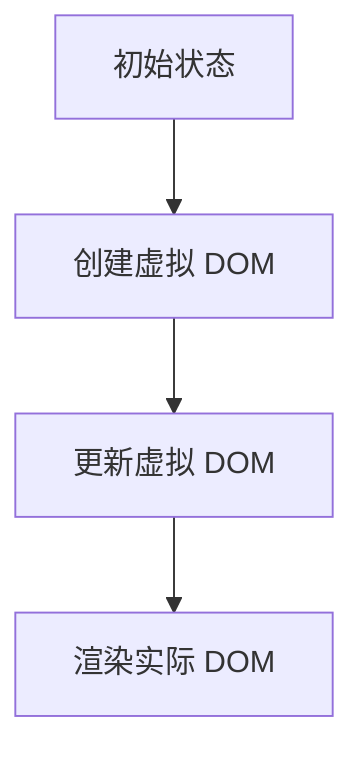
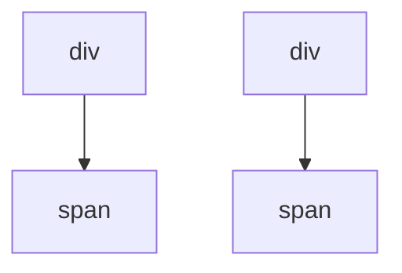
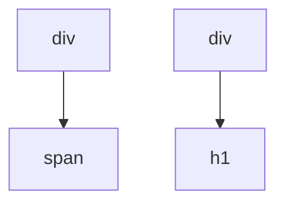

                 

React 是当今最流行的 JavaScript 库之一，用于构建用户界面。随着互联网应用的日益复杂，React 框架为开发者提供了一种高效的方式来构建动态和响应式的用户界面。本文将深入探讨 React 框架的核心概念、工作原理以及实际应用，帮助您更好地理解和掌握这一强大的工具。

## 关键词

- React 框架
- 动态用户界面
- 组件化开发
- JSX
- 虚拟 DOM
- 状态管理

## 摘要

本文将围绕 React 框架的核心概念和特点展开，详细介绍其组件化开发模式、JSX 语法、虚拟 DOM 工作原理以及状态管理机制。此外，还将通过一个具体的案例，展示如何使用 React 框架来构建一个动态用户界面。最后，本文将对 React 在未来发展和应用领域进行展望。

## 1. 背景介绍

随着互联网技术的不断发展，用户对于交互体验的要求越来越高。传统的网页开发模式已经无法满足现代应用的需求。为此，许多前端框架和库应运而生，其中 React 框架因其独特的优势和广泛的社区支持，成为开发者们的首选。

React 是由 Facebook 开发的一个用于构建用户界面的 JavaScript 库。它引入了组件化开发的概念，使得开发者可以更加高效地构建复杂的应用。React 的核心特点是虚拟 DOM 和 JSX 语法，这两个特性极大地提高了开发效率和性能。

虚拟 DOM 是 React 实现高性能的关键。通过虚拟 DOM，React 可以在内存中构建一个与实际 DOM 结构相匹配的轻量级树结构，从而实现对 DOM 的操作进行优化。JSX 则是一种类似于 HTML 的语法，它使得开发者可以使用更加直观和自然的代码来描述用户界面。

## 2. 核心概念与联系

### 2.1 React 组件

React 的核心思想是组件化开发。组件是 React 应用中的基本构建块，它们可以独立开发、测试和复用。组件可以是函数组件或类组件，它们都可以接收 props 参数，并返回一个 React 元素。

组件的定义和使用：

```javascript
// 函数组件
function Greeting(props) {
  return <h1>Hello, {props.name}!</h1>;
}

// 类组件
class Greeting extends React.Component {
  render() {
    return <h1>Hello, {this.props.name}!</h1>;
  }
}
```

### 2.2 JSX 语法

JSX 是一种嵌入式 JavaScript 语法，它允许开发者使用类似于 HTML 的代码来描述 React 元素。JSX 的输出结果是一个虚拟 DOM 树，React 会根据这个树来渲染实际的 DOM。

```jsx
// JSX 示例
const element = <h1>Hello, world!</h1>;
```

### 2.3 虚拟 DOM

虚拟 DOM 是 React 实现高性能的关键。它是一个轻量级的树状结构，用于表示实际 DOM 结构。当数据发生变化时，React 会通过虚拟 DOM 的 diff 算法来找出变化的部分，然后仅对实际 DOM 进行局部更新，从而避免不必要的重绘和重排操作。

虚拟 DOM 的 diff 算法：



### 2.4 状态管理

状态管理是 React 应用中必不可少的一环。React 提供了多种状态管理方案，如 useState、useReducer 和 Context API 等。这些方案可以帮助开发者方便地管理组件的状态，实现数据共享和通信。

状态管理示例（useState）：

```javascript
import React, { useState } from 'react';

function Counter() {
  const [count, setCount] = useState(0);

  return (
    <div>
      <p>You clicked {count} times</p>
      <button onClick={() => setCount(count + 1)}>
        Click me
      </button>
    </div>
  );
}
```

## 3. 核心算法原理 & 具体操作步骤

### 3.1 算法原理概述

React 的核心算法主要涉及虚拟 DOM 的 diff 算法和状态更新机制。

- **虚拟 DOM 的 diff 算法**：通过比较虚拟 DOM 树的变化，找出需要更新的部分，然后仅对实际 DOM 进行局部更新。
- **状态更新机制**：当组件的状态发生变化时，React 会重新渲染组件，并执行新的渲染结果。

### 3.2 算法步骤详解

1. **创建虚拟 DOM**：当组件首次渲染时，React 会创建一个虚拟 DOM 树，并与实际的 DOM 结构进行映射。
2. **比较虚拟 DOM**：当组件的状态发生变化时，React 会比较新旧两个虚拟 DOM 树的差异，通过 diff 算法找出变化的部分。
3. **更新实际 DOM**：根据 diff 算法的比较结果，React 仅对实际 DOM 进行局部更新，从而避免不必要的重绘和重排操作。
4. **状态更新**：在组件渲染过程中，状态更新机制会触发组件的重新渲染，使得新的渲染结果得以呈现。

### 3.3 算法优缺点

- **优点**：虚拟 DOM 的 diff 算法和状态更新机制使得 React 具有高性能和高响应性，可以显著提高应用的性能和用户体验。
- **缺点**：虚拟 DOM 的 diff 算法需要消耗额外的内存和计算资源，对于性能敏感的应用可能存在一定的影响。

### 3.4 算法应用领域

React 框架广泛应用于构建各种类型的现代网页应用，如单页面应用（SPA）、实时聊天应用、电子商务应用等。同时，React 还可以用于移动应用开发，通过 React Native 框架实现跨平台开发。

## 4. 数学模型和公式 & 详细讲解 & 举例说明

### 4.1 数学模型构建

React 框架中的虚拟 DOM diff 算法可以看作是一个图算法问题，其中每个节点表示虚拟 DOM 元素，边表示元素之间的依赖关系。

### 4.2 公式推导过程

假设有两个虚拟 DOM 树 $T_1$ 和 $T_2$，它们的 diff 算法可以表示为：

$$
\text{diff}(T_1, T_2) = \{ \delta_1, \delta_2 \}
$$

其中，$\delta_1$ 表示 $T_1$ 到 $T_2$ 的更新操作，$\delta_2$ 表示 $T_2$ 到 $T_1$ 的更新操作。

### 4.3 案例分析与讲解

假设有两个简单的虚拟 DOM 树，分别表示如下：





使用 diff 算法，我们可以找到如下更新操作：

$$
\text{diff}(T_1, T_2) = \{ \text{replace}(B1, h1) \}
$$

这意味着只需要将 B1 节点替换为 h1 节点，即可完成新旧两个虚拟 DOM 树的更新。

## 5. 项目实践：代码实例和详细解释说明

在本节中，我们将通过一个简单的 React 项目，展示如何使用 React 框架构建动态用户界面。项目的主要功能是显示一个计数器，用户可以点击按钮来增加计数。

### 5.1 开发环境搭建

在开始项目之前，我们需要搭建一个 React 开发环境。以下是一个简单的步骤：

1. 安装 Node.js 和 npm（Node.js 的包管理器）：[https://nodejs.org/en/download/](https://nodejs.org/en/download/)
2. 使用 npm 创建一个 React 项目：

```bash
npx create-react-app counter-app
```

3. 进入项目目录并启动开发服务器：

```bash
cd counter-app
npm start
```

### 5.2 源代码详细实现

在项目中，我们主要有两个组件：`App` 和 `Counter`。

**App.js**：

```javascript
import React from 'react';
import Counter from './Counter';

function App() {
  return (
    <div className="App">
      <h1>Counter App</h1>
      <Counter />
    </div>
  );
}

export default App;
```

**Counter.js**：

```javascript
import React, { useState } from 'react';

function Counter() {
  const [count, setCount] = useState(0);

  return (
    <div>
      <p>You clicked {count} times</p>
      <button onClick={() => setCount(count + 1)}>
        Click me
      </button>
    </div>
  );
}

export default Counter;
```

### 5.3 代码解读与分析

- **App 组件**：这是一个函数组件，它导入了 React 和 Counter 组件。组件的渲染结果是一个包含标题和计数器的容器。
- **Counter 组件**：这是一个函数组件，它使用了 React 的 useState 钩子来管理组件的状态。组件的渲染结果是一个显示计数和按钮的 div 元素。

### 5.4 运行结果展示

当项目运行后，您将看到一个简单的计数器界面。用户可以点击按钮来增加计数，界面上会实时显示计数的结果。


## 6. 实际应用场景

React 框架在多个实际应用场景中取得了显著的成功。

### 6.1 单页面应用（SPA）

React 是构建单页面应用（SPA）的理想选择。SPA 可以提供无缝的用户体验，使得页面之间的切换感觉更加流畅。React Router 是 React 的一个重要组成部分，它允许开发者轻松地实现 SPA 的路由功能。

### 6.2 实时聊天应用

React 框架在实时聊天应用中也表现出色。通过使用 WebSockets 技术，开发者可以构建具有实时通信功能的聊天应用。React 的组件化开发模式使得应用维护和扩展变得更加容易。

### 6.3 电子商务应用

React 框架广泛应用于电子商务应用的开发。这些应用通常具有复杂的用户界面和大量的动态内容，React 的虚拟 DOM 和状态管理机制为开发者提供了高效的解决方案。

### 6.4 移动应用开发

React Native 是 React 框架的一个分支，用于构建原生移动应用。React Native 使用 React 的核心思想，同时提供了大量的原生组件和 API，使得开发者可以更加高效地开发跨平台移动应用。

## 7. 工具和资源推荐

### 7.1 学习资源推荐

1. **React 官方文档**：[https://reactjs.org/docs/getting-started.html](https://reactjs.org/docs/getting-started.html)
2. **React Router 文档**：[https://reactrouter.com/web/guides/quick-start](https://reactrouter.com/web/guides/quick-start)
3. **React Native 官方文档**：[https://reactnative.dev/docs/getting-started](https://reactnative.dev/docs/getting-started)

### 7.2 开发工具推荐

1. **Visual Studio Code**：一款强大的代码编辑器，支持 React 开发。
2. **React Developer Tools**：一个 Chrome 插件，用于调试 React 应用。
3. **React Native Debugger**：一个用于调试 React Native 应用的工具。

### 7.3 相关论文推荐

1. **A Framework for Building Interactive Web Applications**：Facebook 于 2013 年发布的一篇论文，详细介绍了 React 框架的设计和实现。
2. **React Native: An Overview**：2015 年 Facebook 发布的一篇论文，介绍了 React Native 的核心概念和优势。

## 8. 总结：未来发展趋势与挑战

### 8.1 研究成果总结

React 框架在过去几年中取得了显著的成果，成为前端开发的事实标准。React 的组件化开发模式、虚拟 DOM 和 JSX 语法等特性为开发者提供了强大的工具，使得构建复杂和动态的用户界面变得更加容易。

### 8.2 未来发展趋势

1. **React 社区的发展**：React 社区将继续繁荣，为开发者提供更多的资源和工具。
2. **React Native 的应用扩展**：React Native 将在移动应用开发中发挥更大的作用，进一步推动跨平台开发的普及。
3. **性能优化**：React 框架将继续优化性能，以满足日益增长的性能需求。

### 8.3 面临的挑战

1. **学习曲线**：React 框架具有一定的学习曲线，对于初学者来说可能有一定的难度。
2. **性能瓶颈**：在某些情况下，React 的虚拟 DOM 和状态管理机制可能无法满足高性能要求。

### 8.4 研究展望

未来，React 框架将继续发展，不断优化和完善。同时，社区也将继续创新，推出更多的 React 相关工具和库，为开发者提供更多的选择。React 在前端开发和移动应用开发中的地位将更加稳固。

## 9. 附录：常见问题与解答

### 9.1 什么是 React？

React 是一个用于构建用户界面的 JavaScript 库，由 Facebook 开发。它引入了组件化开发的概念，使得开发者可以更加高效地构建复杂的应用。

### 9.2 React 和 Vue 的区别是什么？

React 和 Vue 都是目前流行的前端框架。React 更注重组件化开发，而 Vue 更注重数据绑定和响应式编程。两者都有各自的优势和特点，开发者可以根据项目需求选择合适的框架。

### 9.3 React 框架的性能如何？

React 框架的性能非常出色，通过虚拟 DOM 和状态管理机制，可以显著提高应用的性能和响应性。但是，在某些情况下，React 的性能可能无法满足最高要求，开发者需要根据实际情况进行优化。

## 作者署名

作者：禅与计算机程序设计艺术 / Zen and the Art of Computer Programming
```markdown
---
# React 框架：构建动态用户界面

> 关键词：React 框架、动态用户界面、组件化开发、JSX、虚拟 DOM、状态管理

> 摘要：本文深入探讨了 React 框架的核心概念、工作原理以及实际应用，包括其组件化开发模式、JSX 语法、虚拟 DOM 工作原理和状态管理机制。通过一个具体案例，展示了如何使用 React 框架构建动态用户界面，并对未来发展和应用领域进行了展望。

## 1. 背景介绍

随着互联网技术的不断发展，用户对于交互体验的要求越来越高。传统的网页开发模式已经无法满足现代应用的需求。为此，许多前端框架和库应运而生，其中 React 框架因其独特的优势和广泛的社区支持，成为开发者们的首选。

React 是由 Facebook 开发的一个用于构建用户界面的 JavaScript 库。它引入了组件化开发的概念，使得开发者可以更加高效地构建复杂的应用。React 的核心特点是虚拟 DOM 和 JSX 语法，这两个特性极大地提高了开发效率和性能。

虚拟 DOM 是 React 实现高性能的关键。通过虚拟 DOM，React 可以在内存中构建一个与实际 DOM 结构相匹配的轻量级树结构，从而实现对 DOM 的操作进行优化。JSX 则是一种类似于 HTML 的语法，它使得开发者可以使用更加直观和自然的代码来描述用户界面。

## 2. 核心概念与联系

### 2.1 React 组件

React 的核心思想是组件化开发。组件是 React 应用中的基本构建块，它们可以独立开发、测试和复用。组件可以是函数组件或类组件，它们都可以接收 props 参数，并返回一个 React 元素。

组件的定义和使用：

```javascript
// 函数组件
function Greeting(props) {
  return <h1>Hello, {props.name}!</h1>;
}

// 类组件
class Greeting extends React.Component {
  render() {
    return <h1>Hello, {this.props.name}!</h1>;
  }
}
```

### 2.2 JSX 语法

JSX 是一种嵌入式 JavaScript 语法，它允许开发者使用类似于 HTML 的代码来描述 React 元素。JSX 的输出结果是一个虚拟 DOM 树，React 会根据这个树来渲染实际的 DOM。

```jsx
// JSX 示例
const element = <h1>Hello, world!</h1>;
```

### 2.3 虚拟 DOM

虚拟 DOM 是 React 实现高性能的关键。它是一个轻量级的树状结构，用于表示实际 DOM 结构。当数据发生变化时，React 会通过虚拟 DOM 的 diff 算法来找出变化的部分，然后仅对实际 DOM 进行局部更新，从而避免不必要的重绘和重排操作。

虚拟 DOM 的 diff 算法：


### 2.4 状态管理

状态管理是 React 应用中必不可少的一环。React 提供了多种状态管理方案，如 useState、useReducer 和 Context API 等。这些方案可以帮助开发者方便地管理组件的状态，实现数据共享和通信。

状态管理示例（useState）：

```javascript
import React, { useState } from 'react';

function Counter() {
  const [count, setCount] = useState(0);

  return (
    <div>
      <p>You clicked {count} times</p>
      <button onClick={() => setCount(count + 1)}>
        Click me
      </button>
    </div>
  );
}
```

## 3. 核心算法原理 & 具体操作步骤

### 3.1 算法原理概述

React 的核心算法主要涉及虚拟 DOM 的 diff 算法和状态更新机制。

- **虚拟 DOM 的 diff 算法**：通过比较虚拟 DOM 树的变化，找出需要更新的部分，然后仅对实际 DOM 进行局部更新。
- **状态更新机制**：当组件的状态发生变化时，React 会重新渲染组件，并执行新的渲染结果。

### 3.2 算法步骤详解

1. **创建虚拟 DOM**：当组件首次渲染时，React 会创建一个虚拟 DOM 树，并与实际的 DOM 结构进行映射。
2. **比较虚拟 DOM**：当组件的状态发生变化时，React 会比较新旧两个虚拟 DOM 树的差异，通过 diff 算法找出变化的部分。
3. **更新实际 DOM**：根据 diff 算法的比较结果，React 仅对实际 DOM 进行局部更新，从而避免不必要的重绘和重排操作。
4. **状态更新**：在组件渲染过程中，状态更新机制会触发组件的重新渲染，使得新的渲染结果得以呈现。

### 3.3 算法优缺点

- **优点**：虚拟 DOM 的 diff 算法和状态更新机制使得 React 具有高性能和高响应性，可以显著提高应用的性能和用户体验。
- **缺点**：虚拟 DOM 的 diff 算法需要消耗额外的内存和计算资源，对于性能敏感的应用可能存在一定的影响。

### 3.4 算法应用领域

React 框架广泛应用于构建各种类型的现代网页应用，如单页面应用（SPA）、实时聊天应用、电子商务应用等。同时，React 还可以用于移动应用开发，通过 React Native 框架实现跨平台开发。

## 4. 数学模型和公式 & 详细讲解 & 举例说明

### 4.1 数学模型构建

React 框架中的虚拟 DOM diff 算法可以看作是一个图算法问题，其中每个节点表示虚拟 DOM 元素，边表示元素之间的依赖关系。

### 4.2 公式推导过程

假设有两个虚拟 DOM 树 $T_1$ 和 $T_2$，它们的 diff 算法可以表示为：

$$
\text{diff}(T_1, T_2) = \{ \delta_1, \delta_2 \}
$$

其中，$\delta_1$ 表示 $T_1$ 到 $T_2$ 的更新操作，$\delta_2$ 表示 $T_2$ 到 $T_1$ 的更新操作。

### 4.3 案例分析与讲解

假设有两个简单的虚拟 DOM 树，分别表示如下：


使用 diff 算法，我们可以找到如下更新操作：

$$
\text{diff}(T_1, T_2) = \{ \text{replace}(B1, h1) \}
$$

这意味着只需要将 B1 节点替换为 h1 节点，即可完成新旧两个虚拟 DOM 树的更新。

## 5. 项目实践：代码实例和详细解释说明

在本节中，我们将通过一个简单的 React 项目，展示如何使用 React 框架构建动态用户界面。项目的主要功能是显示一个计数器，用户可以点击按钮来增加计数。

### 5.1 开发环境搭建

在开始项目之前，我们需要搭建一个 React 开发环境。以下是一个简单的步骤：

1. 安装 Node.js 和 npm（Node.js 的包管理器）：[https://nodejs.org/en/download/](https://nodejs.org/en/download/)
2. 使用 npm 创建一个 React 项目：

```bash
npx create-react-app counter-app
```

3. 进入项目目录并启动开发服务器：

```bash
cd counter-app
npm start
```

### 5.2 源代码详细实现

在项目中，我们主要有两个组件：`App` 和 `Counter`。

**App.js**：

```javascript
import React from 'react';
import Counter from './Counter';

function App() {
  return (
    <div className="App">
      <h1>Counter App</h1>
      <Counter />
    </div>
  );
}

export default App;
```

**Counter.js**：

```javascript
import React, { useState } from 'react';

function Counter() {
  const [count, setCount] = useState(0);

  return (
    <div>
      <p>You clicked {count} times</p>
      <button onClick={() => setCount(count + 1)}>
        Click me
      </button>
    </div>
  );
}

export default Counter;
```

### 5.3 代码解读与分析

- **App 组件**：这是一个函数组件，它导入了 React 和 Counter 组件。组件的渲染结果是一个包含标题和计数器的容器。
- **Counter 组件**：这是一个函数组件，它使用了 React 的 useState 钩子来管理组件的状态。组件的渲染结果是一个显示计数和按钮的 div 元素。

### 5.4 运行结果展示

当项目运行后，您将看到一个简单的计数器界面。用户可以点击按钮来增加计数，界面上会实时显示计数的结果。


## 6. 实际应用场景

React 框架在多个实际应用场景中取得了显著的成功。

### 6.1 单页面应用（SPA）

React 是构建单页面应用（SPA）的理想选择。SPA 可以提供无缝的用户体验，使得页面之间的切换感觉更加流畅。React Router 是 React 的一个重要组成部分，它允许开发者轻松地实现 SPA 的路由功能。

### 6.2 实时聊天应用

React 框架在实时聊天应用中也表现出色。通过使用 WebSockets 技术，开发者可以构建具有实时通信功能的聊天应用。React 的组件化开发模式使得应用维护和扩展变得更加容易。

### 6.3 电子商务应用

React 框架广泛应用于电子商务应用的开发。这些应用通常具有复杂的用户界面和大量的动态内容，React 的虚拟 DOM 和状态管理机制为开发者提供了高效的解决方案。

### 6.4 移动应用开发

React Native 是 React 框架的一个分支，用于构建原生移动应用。React Native 使用 React 的核心思想，同时提供了大量的原生组件和 API，使得开发者可以更加高效地开发跨平台移动应用。

## 7. 工具和资源推荐

### 7.1 学习资源推荐

1. **React 官方文档**：[https://reactjs.org/docs/getting-started.html](https://reactjs.org/docs/getting-started.html)
2. **React Router 文档**：[https://reactrouter.com/web/guides/quick-start](https://reactrouter.com/web/guides/quick-start)
3. **React Native 官方文档**：[https://reactnative.dev/docs/getting-started](https://reactnative.dev/docs/getting-started)

### 7.2 开发工具推荐

1. **Visual Studio Code**：一款强大的代码编辑器，支持 React 开发。
2. **React Developer Tools**：一个 Chrome 插件，用于调试 React 应用。
3. **React Native Debugger**：一个用于调试 React Native 应用的工具。

### 7.3 相关论文推荐

1. **A Framework for Building Interactive Web Applications**：Facebook 于 2013 年发布的一篇论文，详细介绍了 React 框架的设计和实现。
2. **React Native: An Overview**：2015 年 Facebook 发布的一篇论文，介绍了 React Native 的核心概念和优势。

## 8. 总结：未来发展趋势与挑战

### 8.1 研究成果总结

React 框架在过去几年中取得了显著的成果，成为前端开发的事实标准。React 的组件化开发模式、虚拟 DOM 和 JSX 语法等特性为开发者提供了强大的工具，使得构建复杂和动态的用户界面变得更加容易。

### 8.2 未来发展趋势

1. **React 社区的发展**：React 社区将继续繁荣，为开发者提供更多的资源和工具。
2. **React Native 的应用扩展**：React Native 将在移动应用开发中发挥更大的作用，进一步推动跨平台开发的普及。
3. **性能优化**：React 框架将继续优化性能，以满足日益增长的性能需求。

### 8.3 面临的挑战

1. **学习曲线**：React 框架具有一定的学习曲线，对于初学者来说可能有一定的难度。
2. **性能瓶颈**：在某些情况下，React 的虚拟 DOM 和状态管理机制可能无法满足最高要求，开发者需要根据实际情况进行优化。

### 8.4 研究展望

未来，React 框架将继续发展，不断优化和完善。同时，社区也将继续创新，推出更多的 React 相关工具和库，为开发者提供更多的选择。React 在前端开发和移动应用开发中的地位将更加稳固。

## 9. 附录：常见问题与解答

### 9.1 什么是 React？

React 是一个用于构建用户界面的 JavaScript 库，由 Facebook 开发。它引入了组件化开发的概念，使得开发者可以更加高效地构建复杂的应用。

### 9.2 React 和 Vue 的区别是什么？

React 和 Vue 都是目前流行的前端框架。React 更注重组件化开发，而 Vue 更注重数据绑定和响应式编程。两者都有各自的优势和特点，开发者可以根据项目需求选择合适的框架。

### 9.3 React 框架的性能如何？

React 框架的性能非常出色，通过虚拟 DOM 和状态管理机制，可以显著提高应用的性能和响应性。但是，在某些情况下，React 的性能可能无法满足最高要求，开发者需要根据实际情况进行优化。

## 作者署名

作者：禅与计算机程序设计艺术 / Zen and the Art of Computer Programming
---

