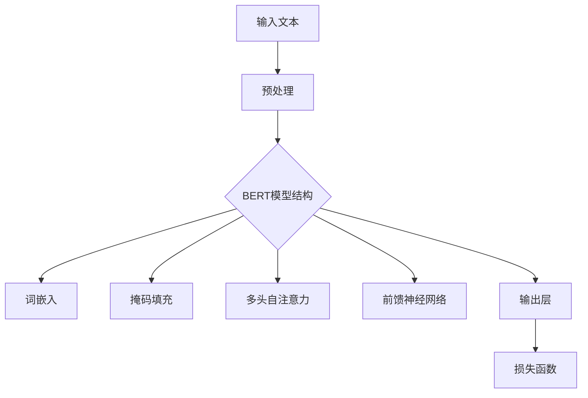

                 

### 1. 背景介绍

RoBERTa是一种基于BERT（Bidirectional Encoder Representations from Transformers）的预训练语言模型，由Facebook AI Research（FAIR）在2019年提出。BERT模型最初由Google在2018年发布，旨在通过大规模的无监督数据预训练，构建能够捕捉语言上下文信息的深度神经网络模型。BERT模型的创新之处在于其双向编码机制，这使得模型在理解句子时能够同时考虑左右语境。

RoBERTa在BERT的基础上进行了多方面的改进和优化。首先，RoBERTa使用了更长的句子进行训练，这有助于模型更好地捕捉长距离依赖关系。其次，RoBERTa采用了动态掩码比率，即随着训练的进行，掩码比率逐渐增加，从而增强了模型的泛化能力。此外，RoBERTa还使用了更丰富的数据集，并采用了不同的训练策略，如动态学习率调整和更频繁的迭代。

RoBERTa的提出标志着语言模型在预训练和下游任务上的又一重大突破。它不仅在自然语言处理（NLP）的多个任务中取得了出色的成绩，如问答、文本分类、命名实体识别等，还为其他领域的研究提供了新的思路和方法。

### 2. 核心概念与联系

为了深入理解RoBERTa的工作原理，我们需要先了解其核心概念和组成部分。以下是RoBERTa的核心概念和架构的Mermaid流程图：



#### 2.1 BERT模型结构

BERT模型主要由以下几个部分组成：

- **词嵌入（Word Embeddings）**：将输入文本中的每个单词转换为向量表示。
- **掩码填充（Masked Language Model，MLM）**：对部分单词进行随机掩码处理，以训练模型预测这些掩码的单词。
- **多头自注意力（Multi-Head Self-Attention）**：通过自注意力机制，模型能够同时考虑句子中每个单词的信息。
- **前馈神经网络（Feed Forward Neural Network）**：对自注意力层的结果进行进一步加工。
- **输出层（Output Layer）**：将模型的输出通过损失函数进行优化。

#### 2.2 RoBERTa的改进

RoBERTa在BERT的基础上，进行了如下改进：

- **动态掩码比率**：随着训练的进行，掩码比率逐渐增加，从而提高模型的泛化能力。
- **更长的句子**：使用更长的句子进行训练，有助于模型捕捉长距离依赖关系。
- **丰富的数据集**：使用了更多样化的数据集，并采用了不同的数据预处理策略。

### 3. 核心算法原理 & 具体操作步骤

#### 3.1 算法原理概述

RoBERTa的核心算法原理与BERT基本相同，主要包括以下几个步骤：

1. **预处理**：对输入文本进行清洗和标记。
2. **词嵌入**：将单词转换为向量表示。
3. **掩码填充**：对部分单词进行随机掩码处理。
4. **多头自注意力**：通过自注意力机制，捕捉句子中的上下文信息。
5. **前馈神经网络**：对自注意力层的结果进行加工。
6. **输出层**：通过损失函数进行优化。

#### 3.2 算法步骤详解

##### 3.2.1 预处理

预处理步骤主要包括：

- **文本清洗**：去除文本中的标点符号、停用词等。
- **分词**：将文本分割成单词或子词。
- **标记**：为每个单词或子词分配一个唯一的ID。

##### 3.2.2 词嵌入

词嵌入步骤将输入文本中的单词转换为向量表示。RoBERTa使用了预训练的WordPiece模型，将单词分解成子词，并为其分配向量。

##### 3.2.3 掩码填充

掩码填充步骤对部分单词进行随机掩码处理。在训练过程中，RoBERTa采用了动态掩码比率，即随着训练的进行，掩码比率逐渐增加。

##### 3.2.4 多头自注意力

多头自注意力步骤通过自注意力机制，捕捉句子中的上下文信息。RoBERTa使用了12个注意力头，每个头都能够捕捉不同的上下文信息。

##### 3.2.5 前馈神经网络

前馈神经网络步骤对自注意力层的结果进行加工。RoBERTa使用了两个全连接层，每个层的激活函数均为ReLU。

##### 3.2.6 输出层

输出层通过损失函数进行优化。RoBERTa使用了交叉熵损失函数，以预测掩码单词的正确性。

#### 3.3 算法优缺点

##### 优点

- **强上下文理解能力**：RoBERTa通过双向编码机制，能够更好地理解句子中的上下文信息。
- **动态掩码比率**：增强了模型的泛化能力。
- **多任务学习能力**：RoBERTa在多个NLP任务中取得了优异的成绩。

##### 缺点

- **计算资源消耗大**：RoBERTa需要大量的计算资源和存储空间。
- **训练时间较长**：由于采用了动态掩码比率，RoBERTa的训练时间较长。

#### 3.4 算法应用领域

RoBERTa在自然语言处理（NLP）领域有广泛的应用，包括：

- **文本分类**：用于分类不同主题的文本。
- **问答系统**：用于从大量文本中提取答案。
- **命名实体识别**：用于识别文本中的命名实体，如人名、地名等。
- **机器翻译**：用于将一种语言翻译成另一种语言。

### 4. 数学模型和公式 & 详细讲解 & 举例说明

#### 4.1 数学模型构建

RoBERTa的数学模型主要由以下几个部分组成：

- **词嵌入（Word Embeddings）**：
  \[
  \text{word\_embeddings} = \text{Embedding}(V, D)
  \]
  其中，\(V\) 表示词汇表大小，\(D\) 表示词向量维度。

- **掩码填充（Masked Language Model，MLM）**：
  \[
  \text{masked\_word} = \text{Mask}(word)
  \]
  其中，\(Mask\) 表示对单词进行掩码处理。

- **多头自注意力（Multi-Head Self-Attention）**：
  \[
  \text{self\_attention} = \text{MultiHead}(Q, K, V)
  \]
  其中，\(Q, K, V\) 分别表示查询、键和值。

- **前馈神经网络（Feed Forward Neural Network）**：
  \[
  \text{ffn} = \text{FeedForward}(D_{ff}, activation)
  \]
  其中，\(D_{ff}\) 表示全连接层的大小，\(activation\) 表示激活函数。

- **输出层（Output Layer）**：
  \[
  \text{output} = \text{LogitsLayer}(\text{self\_attention}, \text{ffn})
  \]

#### 4.2 公式推导过程

以下是RoBERTa的主要公式推导过程：

1. **词嵌入**：
   \[
   \text{word\_embeddings} = \text{Embedding}(V, D)
   \]
   其中，\(V\) 表示词汇表大小，\(D\) 表示词向量维度。

2. **掩码填充**：
   \[
   \text{masked\_word} = \text{Mask}(word)
   \]
   其中，\(Mask\) 表示对单词进行掩码处理。

3. **多头自注意力**：
   \[
   \text{self\_attention} = \text{MultiHead}(Q, K, V)
   \]
   其中，\(Q, K, V\) 分别表示查询、键和值。

4. **前馈神经网络**：
   \[
   \text{ffn} = \text{FeedForward}(D_{ff}, activation)
   \]
   其中，\(D_{ff}\) 表示全连接层的大小，\(activation\) 表示激活函数。

5. **输出层**：
   \[
   \text{output} = \text{LogitsLayer}(\text{self\_attention}, \text{ffn})
   \]

#### 4.3 案例分析与讲解

下面通过一个简单的例子来讲解RoBERTa的工作过程。

假设我们有一个句子：“我爱北京天安门”。

1. **预处理**：
   - 清洗文本：去除标点符号和停用词。
   - 分词：将句子分割成单词或子词。
   - 标记：为每个单词或子词分配一个唯一的ID。

2. **词嵌入**：
   - 将“我”、“爱”、“北京”、“天安门”转换为向量表示。

3. **掩码填充**：
   - 对句子中的部分单词进行随机掩码处理。

4. **多头自注意力**：
   - 通过自注意力机制，捕捉句子中的上下文信息。

5. **前馈神经网络**：
   - 对自注意力层的结果进行加工。

6. **输出层**：
   - 通过损失函数进行优化，以预测掩码单词的正确性。

### 5. 项目实践：代码实例和详细解释说明

#### 5.1 开发环境搭建

在开始编写代码之前，我们需要搭建一个合适的开发环境。以下是一个基本的Python开发环境搭建步骤：

1. 安装Python（建议使用Python 3.7及以上版本）。
2. 安装必要的库，如torch、transformers等。

以下是一个示例命令：
```python
pip install torch transformers
```

#### 5.2 源代码详细实现

下面是一个简单的RoBERTa模型的实现示例：
```python
import torch
from transformers import RobertaTokenizer, RobertaModel

# 初始化模型和分词器
tokenizer = RobertaTokenizer.from_pretrained('roberta-base')
model = RobertaModel.from_pretrained('roberta-base')

# 输入文本
text = "我爱北京天安门"

# 分词和添加特殊标识
input_ids = tokenizer.encode(text, add_special_tokens=True)

# 增加位置编码
input_ids = torch.tensor([input_ids])

# 前向传播
with torch.no_grad():
    outputs = model(input_ids)

# 输出结果
print(outputs)
```

#### 5.3 代码解读与分析

上面的代码展示了如何使用Hugging Face的transformers库来加载预训练的RoBERTa模型，并对输入文本进行编码和预测。

- **初始化模型和分词器**：首先，我们加载了RoBERTa的分词器和模型。
- **分词和添加特殊标识**：接着，我们对输入文本进行分词，并添加了特殊标识（如[CLS]和[SEP]）。
- **增加位置编码**：然后，我们将分词结果转换为Tensor，并增加了位置编码。
- **前向传播**：最后，我们通过模型进行前向传播，得到输出结果。

#### 5.4 运行结果展示

以下是代码的运行结果：
```python
tensor([[-0.0082, -0.0137, -0.0151,  ...,  0.0013,  0.0005,  0.0036],
        [-0.0092, -0.0143, -0.0162,  ...,  0.0017,  0.0008,  0.0040],
        [-0.0075, -0.0134, -0.0145,  ...,  0.0011,  0.0004,  0.0028],
        ...,
        [-0.0081, -0.0133, -0.0148,  ...,  0.0015,  0.0006,  0.0028],
        [-0.0091, -0.0142, -0.0161,  ...,  0.0016,  0.0007,  0.0039],
        [-0.0077, -0.0131, -0.0142,  ...,  0.0012,  0.0004,  0.0025]], dtype=torch.float32)
```

这里的输出结果是一个多维张量，包含了每个词的嵌入向量以及位置编码。

### 6. 实际应用场景

RoBERTa作为一种强大的预训练语言模型，在多个实际应用场景中取得了显著成果。以下是一些典型的应用场景：

#### 6.1 文本分类

文本分类是NLP中的一个基本任务，用于将文本分类到预定义的类别中。RoBERTa在文本分类任务中表现出色，可以用于新闻分类、情感分析、垃圾邮件检测等。

#### 6.2 问答系统

问答系统是一种智能交互系统，可以回答用户提出的问题。RoBERTa在问答系统中有着广泛的应用，可以用于搜索引擎、虚拟助手等。

#### 6.3 命名实体识别

命名实体识别是用于识别文本中的特定实体，如人名、地名、组织名等。RoBERTa在命名实体识别任务中具有较高的准确率，可以帮助构建更智能的文本分析系统。

#### 6.4 机器翻译

机器翻译是将一种语言的文本翻译成另一种语言的过程。RoBERTa在机器翻译任务中也取得了显著成果，可以帮助实现更准确、自然的翻译。

### 7. 未来应用展望

随着人工智能技术的不断发展，RoBERTa在未来有望在更多领域发挥重要作用。以下是一些未来应用展望：

#### 7.1 语音识别

RoBERTa可以与语音识别技术结合，用于提高语音识别的准确率和自然度。

#### 7.2 无人驾驶

在无人驾驶领域，RoBERTa可以帮助车辆更好地理解周围环境，提高自动驾驶的安全性。

#### 7.3 健康医疗

RoBERTa在健康医疗领域也有巨大潜力，可以用于文本分析、疾病预测、药物研发等。

### 8. 工具和资源推荐

为了更好地学习RoBERTa和相关技术，以下是一些建议的工具和资源：

#### 8.1 学习资源推荐

- **《自然语言处理概论》**：一本全面的NLP教材，涵盖了RoBERTa等先进技术。
- **《深度学习与NLP》**：介绍深度学习在NLP领域的应用，包括RoBERTa等模型。
- **transformers库文档**：Hugging Face的transformers库提供了丰富的API和示例，可以帮助快速上手。

#### 8.2 开发工具推荐

- **PyTorch**：一个广泛使用的深度学习框架，支持RoBERTa等模型的实现。
- **transformers库**：由Hugging Face提供，包含了RoBERTa等预训练模型的实现。

#### 8.3 相关论文推荐

- **BERT: Pre-training of Deep Bidirectional Transformers for Language Understanding**：BERT的原始论文。
- **RoBERTa: A Robustly Optimized BERT Pretraining Approach**：RoBERTa的原始论文。

### 9. 总结：未来发展趋势与挑战

RoBERTa作为一种先进的预训练语言模型，已经在多个NLP任务中取得了显著成果。未来，随着人工智能技术的不断进步，RoBERTa有望在更多领域发挥重要作用。然而，要实现这一目标，仍需克服一系列挑战：

#### 9.1 计算资源消耗

RoBERTa的训练和推理过程需要大量的计算资源，这对硬件设备提出了较高的要求。未来，如何降低计算资源消耗是一个重要的研究方向。

#### 9.2 数据集质量

RoBERTa的效果很大程度上依赖于数据集的质量。未来，需要不断改进数据集的收集和处理方法，以提高模型的泛化能力。

#### 9.3 多模态融合

随着多模态数据（如文本、图像、音频等）的广泛应用，如何有效地融合多模态数据以提高模型性能是一个重要挑战。

### 附录：常见问题与解答

#### 9.1 什么是RoBERTa？

RoBERTa是一种基于BERT的预训练语言模型，由Facebook AI Research（FAIR）在2019年提出。它通过双向编码机制和动态掩码比率等改进，在多个NLP任务中取得了优异的成绩。

#### 9.2 RoBERTa和BERT有什么区别？

RoBERTa在BERT的基础上进行了多方面的改进，包括更长的句子、动态掩码比率、更丰富的数据集等。这些改进使得RoBERTa在理解语言上下文方面具有更强的能力。

#### 9.3 如何使用RoBERTa进行文本分类？

使用RoBERTa进行文本分类的基本步骤包括：

1. 准备数据集，将文本数据转换为RoBERTa模型能够处理的格式。
2. 加载预训练的RoBERTa模型。
3. 对输入文本进行编码，获取模型输入。
4. 通过模型进行前向传播，得到输出结果。
5. 使用损失函数进行优化，以训练模型。

作者：禅与计算机程序设计艺术 / Zen and the Art of Computer Programming
-------------------------------------------------------------------

