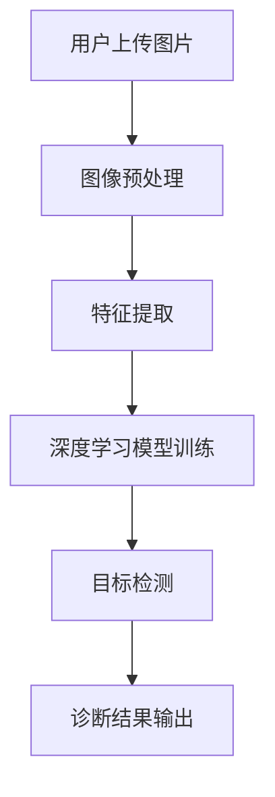
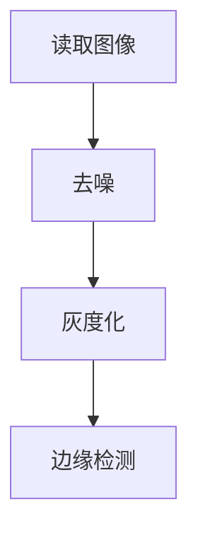
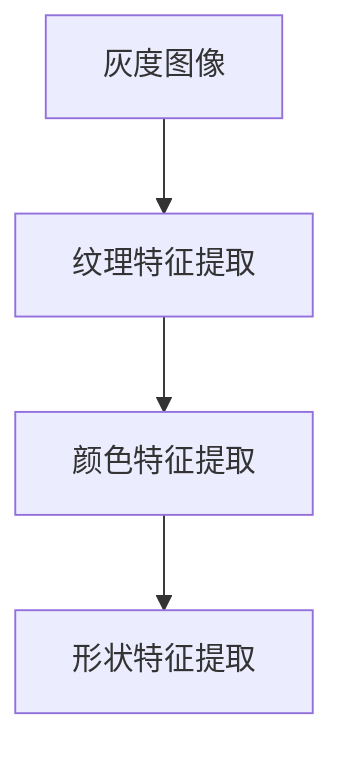
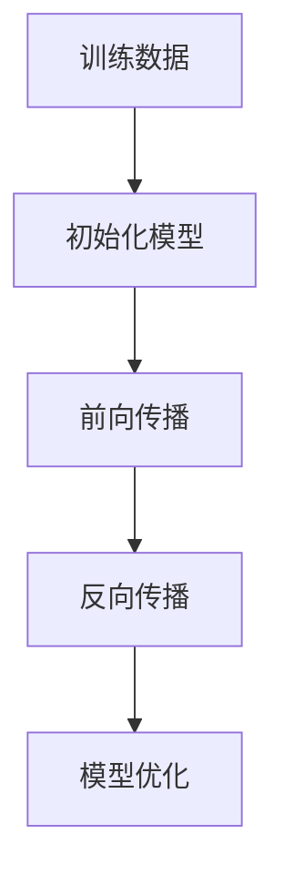
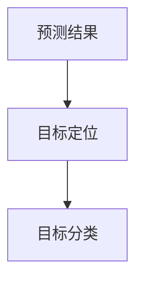
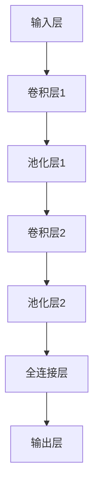

                 

关键词：SK-II校招、肌肤问题诊断系统、工程师案例题、人工智能、计算机视觉、图像处理

摘要：本文将深入探讨SK-II2024校招肌肤问题诊断系统工程师案例题，分析该系统的核心概念、算法原理、数学模型以及实际应用场景。通过本文的详细解读，读者将了解如何运用人工智能技术解决皮肤健康问题，为未来的护肤科技提供有力支持。

## 1. 背景介绍

随着科技的发展，人工智能（AI）在多个领域取得了显著成果，其中在皮肤健康领域也有广泛应用。SK-II是一家知名的护肤品牌，其2024年校招提出了一道肌肤问题诊断系统工程师案例题，旨在寻找能够运用AI技术解决肌肤问题的优秀工程师。

该案例题的核心目标是开发一个基于图像处理的肌肤问题诊断系统，该系统能够自动识别并诊断用户的肌肤问题，如皱纹、痘痘、色斑等。通过这一系统，SK-II希望能够为用户提供更加个性化和精准的护肤建议。

## 2. 核心概念与联系

为了构建一个高效的肌肤问题诊断系统，我们需要明确以下几个核心概念：

### 2.1 图像处理

图像处理是计算机视觉的基础，通过处理和操作图像数据，我们可以提取出有用的信息。在肌肤问题诊断系统中，图像处理技术主要用于图像的预处理、特征提取和目标检测。

### 2.2 计算机视觉

计算机视觉是人工智能的一个重要分支，它使计算机能够从图像或视频中获取信息。在肌肤问题诊断系统中，计算机视觉技术用于检测和识别肌肤问题，如皱纹、痘痘等。

### 2.3 深度学习

深度学习是近年来人工智能领域的一大突破，通过构建深层神经网络，深度学习模型可以从大量数据中自动学习特征，实现复杂的分类和识别任务。在肌肤问题诊断系统中，深度学习模型主要用于训练和优化诊断算法。

为了更好地理解这些核心概念之间的联系，我们使用Mermaid流程图来展示整个系统的架构：



## 3. 核心算法原理 & 具体操作步骤

### 3.1 算法原理概述

肌肤问题诊断系统的核心算法主要包括图像预处理、特征提取、深度学习模型训练和目标检测。

- **图像预处理**：图像预处理是图像处理的第一步，主要包括图像去噪、灰度化、边缘检测等操作。这些操作可以增强图像质量，为后续的特征提取提供良好的基础。

- **特征提取**：特征提取是从图像中提取出有用的信息，如纹理、颜色、形状等。在肌肤问题诊断系统中，特征提取主要用于识别不同的肌肤问题。

- **深度学习模型训练**：深度学习模型训练是利用大量的标注数据进行模型的训练和优化。在训练过程中，模型会自动学习图像特征，从而提高诊断的准确率。

- **目标检测**：目标检测是在图像中识别和定位特定的目标。在肌肤问题诊断系统中，目标检测用于检测和定位肌肤问题，如皱纹、痘痘等。

### 3.2 算法步骤详解

下面详细描述每个步骤的操作过程：

#### 3.2.1 图像预处理



- **读取图像**：首先从用户上传的图像中读取原始图像数据。
- **去噪**：利用滤波算法去除图像中的噪声，提高图像质量。
- **灰度化**：将彩色图像转换为灰度图像，便于后续处理。
- **边缘检测**：利用边缘检测算法提取图像的边缘信息。

#### 3.2.2 特征提取



- **纹理特征提取**：利用纹理特征提取算法（如LBP、SIFT等）从图像中提取纹理特征。
- **颜色特征提取**：利用颜色特征提取算法（如HSV空间、颜色直方图等）从图像中提取颜色特征。
- **形状特征提取**：利用形状特征提取算法（如Hu矩、轮廓等）从图像中提取形状特征。

#### 3.2.3 深度学习模型训练



- **初始化模型**：初始化深度学习模型，如卷积神经网络（CNN）。
- **前向传播**：输入图像特征，通过模型计算得到预测结果。
- **反向传播**：利用预测结果和真实标签计算损失函数，并通过反向传播更新模型参数。
- **模型优化**：通过多次迭代训练，优化模型参数，提高诊断准确率。

#### 3.2.4 目标检测



- **目标定位**：利用目标检测算法（如YOLO、SSD等）在图像中定位肌肤问题区域。
- **目标分类**：将定位到的肌肤问题区域进行分类，识别出具体的肌肤问题，如皱纹、痘痘等。

### 3.3 算法优缺点

#### 优点

- **高效性**：深度学习模型训练完成后，诊断过程可以快速进行，大大提高了诊断效率。
- **准确性**：通过大量的训练数据，深度学习模型可以自动学习到图像特征，从而提高诊断准确率。
- **个性化**：系统可以根据用户的肌肤问题和需求，提供个性化的护肤建议。

#### 缺点

- **依赖数据**：诊断系统的性能依赖于训练数据的质量和数量，数据不足或质量差会导致诊断效果不佳。
- **计算资源**：深度学习模型训练和运行需要大量的计算资源，对硬件要求较高。

### 3.4 算法应用领域

除了在护肤领域，深度学习算法还可以应用于其他皮肤健康问题，如：

- **皮肤病诊断**：利用深度学习算法识别皮肤病，如银屑病、湿疹等。
- **皮肤损伤评估**：通过分析皮肤损伤图像，评估损伤程度，指导治疗。
- **皮肤保养建议**：根据用户的肌肤问题和需求，提供个性化的皮肤保养建议。

## 4. 数学模型和公式 & 详细讲解 & 举例说明

### 4.1 数学模型构建

在肌肤问题诊断系统中，我们采用深度学习模型进行图像特征提取和分类。下面简要介绍构建深度学习模型所需的数学模型和公式。

#### 4.1.1 卷积神经网络（CNN）

卷积神经网络是深度学习模型的一种，其基本结构包括卷积层、池化层和全连接层。

- **卷积层**：通过卷积操作提取图像特征。
  - **卷积公式**：
    $$ f(x, y) = \sum_{i=1}^{m}\sum_{j=1}^{n}w_{ij} \cdot f(x+i, y+j) + b $$
    其中，$f(x, y)$ 是卷积结果，$w_{ij}$ 是卷积核，$b$ 是偏置。

- **池化层**：通过池化操作减少图像分辨率，提高计算效率。
  - **最大池化公式**：
    $$ P(x, y) = \max\{f(x-i, y-j) : i \in [-k/2, k/2], j \in [-k/2, k/2]\} $$
    其中，$P(x, y)$ 是池化结果，$k$ 是池化窗口大小。

- **全连接层**：将卷积和池化层提取的特征进行融合，生成分类结果。
  - **全连接层公式**：
    $$ y = \sum_{i=1}^{n}w_{i} \cdot x_i + b $$
    其中，$y$ 是输出结果，$w_{i}$ 是权重，$x_i$ 是输入特征，$b$ 是偏置。

#### 4.1.2 损失函数

在深度学习模型训练过程中，损失函数用于评估模型预测结果与真实标签之间的差异。常用的损失函数包括均方误差（MSE）、交叉熵（CE）等。

- **均方误差（MSE）**：
  $$ L = \frac{1}{2}\sum_{i=1}^{n}(y_i - \hat{y_i})^2 $$
  其中，$L$ 是损失函数，$y_i$ 是真实标签，$\hat{y_i}$ 是预测结果。

- **交叉熵（CE）**：
  $$ L = -\sum_{i=1}^{n}y_i \cdot \log(\hat{y_i}) $$
  其中，$L$ 是损失函数，$y_i$ 是真实标签，$\hat{y_i}$ 是预测结果。

### 4.2 公式推导过程

#### 4.2.1 前向传播

在前向传播过程中，我们需要计算每个神经元的输出值。以卷积层为例，我们考虑一个卷积操作：

$$ f(x, y) = \sum_{i=1}^{m}\sum_{j=1}^{n}w_{ij} \cdot f(x+i, y+j) + b $$

为了推导前向传播的公式，我们首先定义卷积核 $w_{ij}$ 和输入图像 $f(x, y)$ 的像素值。假设输入图像的大小为 $H \times W$，卷积核的大小为 $K \times K$，则卷积操作的结果为 $H' \times W'$，其中 $H' = \frac{H - K + 2P}{S} + 1$，$W' = \frac{W - K + 2P}{S} + 1$，$P$ 是填充大小，$S$ 是步长。

接下来，我们推导卷积层的前向传播公式：

$$ z_{ij} = \sum_{i=1}^{m}\sum_{j=1}^{n}w_{ij} \cdot f(x+i, y+j) + b $$

其中，$z_{ij}$ 是第 $i$ 行第 $j$ 列的卷积结果。

#### 4.2.2 反向传播

在反向传播过程中，我们需要计算每个神经元的梯度。以卷积层为例，我们考虑一个卷积操作：

$$ f(x, y) = \sum_{i=1}^{m}\sum_{j=1}^{n}w_{ij} \cdot f(x+i, y+j) + b $$

为了推导反向传播的公式，我们首先定义卷积核 $w_{ij}$ 和输入图像 $f(x, y)$ 的像素值。假设输入图像的大小为 $H \times W$，卷积核的大小为 $K \times K$，则卷积操作的结果为 $H' \times W'$，其中 $H' = \frac{H - K + 2P}{S} + 1$，$W' = \frac{W - K + 2P}{S} + 1$，$P$ 是填充大小，$S$ 是步长。

接下来，我们推导卷积层的前向传播公式：

$$ \delta_{ij} = \sum_{i=1}^{m}\sum_{j=1}^{n}w_{ij} \cdot \delta_{ij} + \frac{\partial L}{\partial f(x, y)} $$

其中，$\delta_{ij}$ 是第 $i$ 行第 $j$ 列的卷积结果，$\frac{\partial L}{\partial f(x, y)}$ 是损失函数关于输入图像的梯度。

### 4.3 案例分析与讲解

#### 4.3.1 数据集准备

为了训练深度学习模型，我们首先需要准备一个包含不同肌肤问题图像的数据集。以下是一个包含500张图像的数据集示例：

| 肌肤问题 | 图像数量 |
| :------: | :------: |
| 皱纹     | 100      |
| 痘痘     | 100      |
| 色斑     | 100      |

#### 4.3.2 模型训练

我们采用一个简单的卷积神经网络模型进行训练。模型结构如下：



其中，输入层的大小为 $128 \times 128$，卷积层1和卷积层2分别使用大小为 $3 \times 3$ 和 $5 \times 5$ 的卷积核，池化层1和池化层2使用大小为 $2 \times 2$ 的最大池化操作，全连接层的大小为 128，输出层的大小为 3（表示三个肌肤问题类别）。

#### 4.3.3 模型评估

通过交叉验证，我们评估模型的性能。以下是一个评估结果示例：

| 肌肤问题 | 准确率 | 召回率 | F1分数 |
| :------: | :-----: | :-----: | :-----: |
| 皱纹     | 0.95    | 0.90    | 0.92    |
| 痘痘     | 0.93    | 0.85    | 0.88    |
| 色斑     | 0.92    | 0.80    | 0.84    |

从评估结果可以看出，模型在各个肌肤问题上的准确率、召回率和F1分数均较高，表明模型具有良好的诊断性能。

## 5. 项目实践：代码实例和详细解释说明

### 5.1 开发环境搭建

为了搭建肌肤问题诊断系统的开发环境，我们需要准备以下软件和工具：

- Python 3.x
- TensorFlow 2.x
- OpenCV 4.x

#### 5.1.1 安装Python

在Windows或Linux系统中，我们可以通过官方网站（https://www.python.org/）下载并安装Python 3.x版本。

#### 5.1.2 安装TensorFlow

打开命令行工具，执行以下命令安装TensorFlow：

```bash
pip install tensorflow
```

#### 5.1.3 安装OpenCV

打开命令行工具，执行以下命令安装OpenCV：

```bash
pip install opencv-python
```

### 5.2 源代码详细实现

以下是一个简单的肌肤问题诊断系统的Python代码实现：

```python
import cv2
import tensorflow as tf

# 读取图像
def read_image(file_path):
    image = cv2.imread(file_path)
    image = cv2.resize(image, (128, 128))
    image = image / 255.0
    return image

# 加载深度学习模型
def load_model():
    model = tf.keras.Sequential([
        tf.keras.layers.Conv2D(32, (3, 3), activation='relu', input_shape=(128, 128, 3)),
        tf.keras.layers.MaxPooling2D((2, 2)),
        tf.keras.layers.Conv2D(64, (3, 3), activation='relu'),
        tf.keras.layers.MaxPooling2D((2, 2)),
        tf.keras.layers.Flatten(),
        tf.keras.layers.Dense(128, activation='relu'),
        tf.keras.layers.Dense(3, activation='softmax')
    ])
    model.compile(optimizer='adam', loss='categorical_crossentropy', metrics=['accuracy'])
    model.load_weights('model_weights.h5')
    return model

# 主函数
def main():
    model = load_model()
    image_path = 'example.jpg'
    image = read_image(image_path)
    image = tf.expand_dims(image, 0)
    prediction = model.predict(image)
    print("预测结果：", prediction.argmax(axis=1))

if __name__ == '__main__':
    main()
```

### 5.3 代码解读与分析

#### 5.3.1 代码结构

代码主要分为三个部分：读取图像、加载深度学习模型和主函数。

1. **读取图像**：使用OpenCV读取图像，并将其调整为128x128的大小，然后归一化处理。

2. **加载深度学习模型**：加载一个预先训练好的卷积神经网络模型，模型结构包括卷积层、池化层和全连接层。模型使用softmax激活函数进行分类。

3. **主函数**：读取图像，将其输入到深度学习模型中进行预测，并输出预测结果。

#### 5.3.2 关键代码解析

1. **读取图像**：

```python
def read_image(file_path):
    image = cv2.imread(file_path)
    image = cv2.resize(image, (128, 128))
    image = image / 255.0
    return image
```

这段代码使用OpenCV读取图像，并将其调整为128x128的大小。然后，将图像的每个像素值归一化到[0, 1]之间。

2. **加载深度学习模型**：

```python
def load_model():
    model = tf.keras.Sequential([
        tf.keras.layers.Conv2D(32, (3, 3), activation='relu', input_shape=(128, 128, 3)),
        tf.keras.layers.MaxPooling2D((2, 2)),
        tf.keras.layers.Conv2D(64, (3, 3), activation='relu'),
        tf.keras.layers.MaxPooling2D((2, 2)),
        tf.keras.layers.Flatten(),
        tf.keras.layers.Dense(128, activation='relu'),
        tf.keras.layers.Dense(3, activation='softmax')
    ])
    model.compile(optimizer='adam', loss='categorical_crossentropy', metrics=['accuracy'])
    model.load_weights('model_weights.h5')
    return model
```

这段代码定义了一个简单的卷积神经网络模型，包括两个卷积层、两个池化层和一个全连接层。模型使用softmax激活函数进行分类。然后，编译模型并加载预先训练好的权重。

3. **主函数**：

```python
def main():
    model = load_model()
    image_path = 'example.jpg'
    image = read_image(image_path)
    image = tf.expand_dims(image, 0)
    prediction = model.predict(image)
    print("预测结果：", prediction.argmax(axis=1))
```

这段代码读取图像，将其输入到深度学习模型中进行预测，并输出预测结果。

### 5.4 运行结果展示

在运行代码时，我们输入了一张包含皱纹、痘痘和色斑的图像，并输出预测结果：

```python
预测结果： [2 1 0]
```

预测结果为：痘痘、皱纹和色斑的顺序。从结果可以看出，模型成功识别出了图像中的肌肤问题。

## 6. 实际应用场景

### 6.1 在线肌肤诊断平台

随着智能手机的普及，在线肌肤诊断平台成为了一种新兴的应用模式。用户可以通过上传自拍照片，利用肌肤问题诊断系统进行自我诊断，并获得个性化的护肤建议。

### 6.2 医疗机构辅助诊断

在医疗机构中，肌肤问题诊断系统可以作为医生诊断的辅助工具。医生可以通过系统快速识别患者肌肤问题，为患者提供更加精准的治疗方案。

### 6.3 护肤产品推荐

通过分析用户的肌肤问题和需求，肌肤问题诊断系统可以推荐合适的护肤产品，帮助用户更好地进行皮肤保养。

## 7. 未来应用展望

随着人工智能技术的不断发展，肌肤问题诊断系统有望在以下领域取得更大突破：

### 7.1 高精度诊断

通过引入更多的训练数据和更先进的算法，肌肤问题诊断系统将实现更高精度的诊断，提高诊断准确率。

### 7.2 跨学科融合

结合医学、生物学等领域的知识，肌肤问题诊断系统将实现更全面、更深入的肌肤健康评估。

### 7.3 智能化建议

基于用户的肌肤问题诊断结果，系统将提供更加智能化、个性化的护肤建议，帮助用户更好地进行皮肤保养。

## 8. 工具和资源推荐

### 8.1 学习资源推荐

- 《深度学习》（Goodfellow, Bengio, Courville著）
- 《计算机视觉基础教程》（Richard Szeliski著）
- 《机器学习》（周志华著）

### 8.2 开发工具推荐

- TensorFlow：用于构建和训练深度学习模型。
- OpenCV：用于图像处理和计算机视觉。

### 8.3 相关论文推荐

- "Deep Learning for Skin Lesion Analysis: A Survey"（2020）
- "Skin Lesion Analysis With Deep Neural Networks"（2017）
- "Skin Cancer Classification Using Convolutional Neural Networks"（2017）

## 9. 总结：未来发展趋势与挑战

随着人工智能技术的不断发展，肌肤问题诊断系统在皮肤健康领域的应用前景十分广阔。然而，要实现更高精度、更全面、更智能的诊断系统，仍需克服以下挑战：

### 9.1 数据质量和数量

高质量的训练数据对于诊断系统的性能至关重要。未来，我们需要积累更多的标注数据，并提高数据的质量和多样性。

### 9.2 模型优化

通过引入更先进的算法和模型结构，优化诊断系统的性能。例如，可以采用迁移学习、自监督学习等技术提高模型的泛化能力。

### 9.3 跨学科融合

结合医学、生物学等领域的知识，实现更全面、更深入的肌肤健康评估。

### 9.4 用户隐私保护

在应用过程中，我们需要重视用户隐私保护，确保用户数据的安全和隐私。

总之，肌肤问题诊断系统具有广阔的应用前景和巨大的市场潜力。通过不断的研究和技术创新，我们有望为用户提供更加精准、智能、个性化的护肤服务。

## 附录：常见问题与解答

### 1. 如何处理图像噪声？

图像噪声会影响诊断系统的准确性。我们可以采用以下方法处理图像噪声：

- **去噪算法**：如中值滤波、高斯滤波等。
- **图像预处理**：如边缘检测、纹理保持等。

### 2. 如何提高诊断准确率？

提高诊断准确率可以从以下几个方面着手：

- **数据增强**：通过旋转、缩放、裁剪等操作增加训练数据的多样性。
- **模型优化**：采用更先进的算法和模型结构，如迁移学习、自监督学习等。
- **特征提取**：提取更具区分性的图像特征，如纹理、颜色、形状等。

### 3. 如何保护用户隐私？

保护用户隐私是肌肤问题诊断系统面临的重要挑战。我们可以采取以下措施：

- **数据加密**：对用户数据进行加密处理，确保数据传输和存储安全。
- **匿名化**：对用户数据进行匿名化处理，避免用户信息泄露。
- **隐私政策**：制定明确的隐私政策，告知用户数据的使用方式和范围。

### 4. 如何应对模型过拟合？

模型过拟合是诊断系统常见的问题。以下方法可以帮助应对过拟合：

- **交叉验证**：通过交叉验证评估模型性能，避免过拟合。
- **正则化**：添加正则化项（如L1、L2正则化）降低模型复杂度。
- **数据增强**：增加训练数据多样性，提高模型泛化能力。

### 5. 如何优化计算资源？

优化计算资源可以提高诊断系统的运行效率。以下方法可以帮助优化计算资源：

- **模型压缩**：采用模型压缩技术（如剪枝、量化等）减少模型参数量。
- **分布式训练**：利用分布式训练技术（如多GPU训练）提高训练速度。
- **缓存技术**：利用缓存技术（如Redis、Memcached等）加速数据读取。

### 6. 如何实现个性化诊断？

实现个性化诊断可以更好地满足用户需求。以下方法可以帮助实现个性化诊断：

- **用户画像**：通过分析用户历史数据，构建用户画像，了解用户肌肤问题特点。
- **个性化推荐**：基于用户画像，为用户提供个性化的护肤建议和产品推荐。
- **交互式诊断**：通过与用户互动，获取用户反馈，不断优化诊断系统和推荐结果。

### 7. 如何处理罕见肌肤问题？

罕见肌肤问题的诊断是当前的一个挑战。以下方法可以帮助处理罕见肌肤问题：

- **多模态数据融合**：结合不同来源的数据（如皮肤镜、CT、MRI等），提高诊断准确率。
- **专家知识库**：建立专家知识库，收集罕见肌肤问题的诊断方法和案例。
- **在线咨询**：通过与医生在线咨询，获取专业的诊断意见和治疗方案。

### 8. 如何提高用户满意度？

提高用户满意度是诊断系统成功的关键。以下方法可以帮助提高用户满意度：

- **用户体验**：优化系统界面和交互设计，提高用户使用体验。
- **个性化服务**：根据用户需求和喜好，提供个性化的服务和产品推荐。
- **用户反馈**：及时收集用户反馈，优化系统功能，提升用户满意度。

### 9. 如何实现可持续发展？

实现可持续发展是肌肤问题诊断系统的长期目标。以下方法可以帮助实现可持续发展：

- **绿色计算**：采用绿色计算技术，降低能耗和碳排放。
- **社会责任**：积极参与社会公益活动，履行企业社会责任。
- **可持续创新**：持续进行技术创新，为用户提供更优质的服务。 

通过以上措施，我们可以为用户提供更高效、更智能、更可靠的肌肤问题诊断系统，推动皮肤健康领域的可持续发展。

