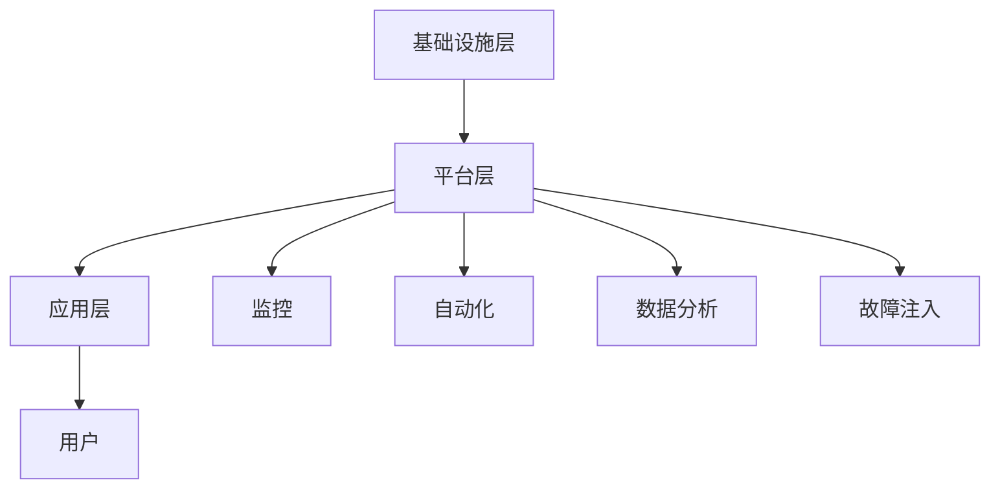

                 

关键词：站点可靠性工程、系统稳定性、IT运维、持续交付、DevOps

> 摘要：本文将深入探讨站点可靠性工程（SRE）的核心概念、原理、方法以及其在确保系统稳定性中的应用。通过详细的算法原理分析、数学模型讲解和项目实践案例，本文旨在为读者提供一份全面、深入的SRE技术指南。

## 1. 背景介绍

在当今数字化时代，IT系统已经成为企业和组织运营的基石。然而，随着系统的复杂性和规模的不断扩大，保证系统的稳定性和可靠性变得尤为重要。为了应对这一挑战，站点可靠性工程（Site Reliability Engineering，简称SRE）应运而生。

SRE是一种结合了软件工程和系统管理的工程实践，其目标是确保系统和服务的稳定性、可靠性和效率。与传统IT运维不同，SRE更多地关注系统的整体性能和用户体验，强调通过数据和自动化手段来提高系统的稳定性和可靠性。

本文将从以下几个方面展开讨论：

- **核心概念与联系**：介绍SRE的核心概念和原理，并使用Mermaid流程图展示其架构。
- **核心算法原理 & 具体操作步骤**：分析SRE中的关键算法，详细讲解其操作步骤和优缺点。
- **数学模型和公式**：构建SRE的数学模型，推导相关公式，并通过案例进行分析。
- **项目实践：代码实例和详细解释说明**：提供实际的代码实例，解读和分析其实现过程。
- **实际应用场景**：探讨SRE在不同领域的应用，以及未来的发展前景。
- **工具和资源推荐**：推荐学习资源、开发工具和相关论文。
- **总结：未来发展趋势与挑战**：总结研究成果，展望未来发展趋势和面临的挑战。

## 2. 核心概念与联系

### 2.1 核心概念

SRE的核心概念包括以下几个方面：

- **可靠性**：确保系统和服务的可用性和稳定性，满足业务需求。
- **可用性**：系统和服务的持续运行能力，避免故障和中断。
- **稳定性**：系统在面对流量波动和异常情况时的表现，保持性能和用户体验。
- **自动化**：通过自动化工具和流程提高运维效率和系统稳定性。
- **监控**：实时监控系统和服务的状态，快速发现和解决问题。

### 2.2 原理

SRE的原理基于以下几个关键点：

- **持续交付**：通过自动化部署和测试，实现快速迭代和持续交付。
- **DevOps**：融合开发（Dev）和运维（Ops），实现开发和运维的无缝协作。
- **数据分析**：利用数据分析和机器学习，优化系统和服务的性能和稳定性。
- **故障注入**：通过模拟故障和异常情况，测试系统和服务的稳定性和弹性。

### 2.3 架构

SRE的架构包括以下几个层次：

- **基础设施层**：包括服务器、网络、存储等基础设施，提供可靠的基础支持。
- **平台层**：包括自动化工具、监控系统和数据平台，实现自动化运维和实时监控。
- **应用层**：包括业务系统和微服务，实现具体的业务功能和服务。

下面是SRE架构的Mermaid流程图：



## 3. 核心算法原理 & 具体操作步骤

### 3.1 算法原理概述

SRE中涉及的核心算法主要包括以下几个方面：

- **自动化部署算法**：基于持续交付原则，实现自动化部署和回滚。
- **故障检测算法**：基于实时监控数据，快速检测系统和服务的异常。
- **故障恢复算法**：基于故障检测结果，自动执行恢复操作，确保系统和服务的可用性。

### 3.2 算法步骤详解

#### 自动化部署算法

1. **构建镜像**：根据代码库中的最新代码构建应用程序的镜像。
2. **测试镜像**：在测试环境中运行镜像，确保其稳定性和性能。
3. **部署镜像**：将测试通过的镜像部署到生产环境，替换旧版本。
4. **监控部署**：实时监控部署过程中的关键指标，确保部署成功。

#### 故障检测算法

1. **数据采集**：采集系统和服务的监控数据，包括CPU、内存、网络等。
2. **数据预处理**：对采集到的数据进行预处理，包括去噪、归一化等。
3. **特征提取**：从预处理后的数据中提取特征，用于故障检测。
4. **故障检测**：使用机器学习算法，对提取的特征进行故障检测。

#### 故障恢复算法

1. **故障确认**：根据故障检测结果，确认故障发生。
2. **故障恢复**：根据故障类型，自动执行恢复操作，包括重启服务、扩容等。
3. **监控恢复**：实时监控恢复过程中的关键指标，确保恢复成功。

### 3.3 算法优缺点

#### 自动化部署算法

**优点**：提高部署效率，减少人工干预，降低部署风险。

**缺点**：对测试环境要求较高，需要确保测试通过率。

#### 故障检测算法

**优点**：实时检测故障，提高系统可用性。

**缺点**：故障检测存在一定误报率，需要结合人工判断。

#### 故障恢复算法

**优点**：自动执行恢复操作，提高故障恢复速度。

**缺点**：对故障恢复策略设计要求较高，需要根据具体业务场景进行调整。

### 3.4 算法应用领域

SRE算法在多个领域得到广泛应用，包括：

- **云计算**：优化云基础设施的稳定性和可靠性。
- **大数据**：确保大数据处理平台的稳定性和性能。
- **金融行业**：保障金融交易系统的安全性和稳定性。
- **电子商务**：提高电商平台的用户体验和系统稳定性。

## 4. 数学模型和公式 & 详细讲解 & 举例说明

### 4.1 数学模型构建

SRE中的数学模型主要涉及以下几个方面：

- **可靠性模型**：描述系统和服务的可靠性指标，包括MTTF（平均无故障时间）和MTTR（平均故障恢复时间）。
- **性能模型**：描述系统和服务的性能指标，包括响应时间和吞吐量。
- **成本模型**：描述运维成本和故障成本，用于评估系统优化策略。

### 4.2 公式推导过程

以下是SRE中常用的数学模型和公式的推导过程：

#### 可靠性模型

$$
R(t) = e^{-\lambda t}
$$

其中，\(R(t)\)表示在时间\(t\)内系统正常运行的概率，\(\lambda\)表示故障率。

#### 性能模型

$$
T = \frac{1}{\lambda}
$$

其中，\(T\)表示系统的响应时间，\(\lambda\)表示故障率。

#### 成本模型

$$
C = C_1 + C_2 \cdot \lambda
$$

其中，\(C\)表示总成本，\(C_1\)表示运维成本，\(C_2\)表示故障成本，\(\lambda\)表示故障率。

### 4.3 案例分析与讲解

假设一个电商平台，其故障率为0.1次/天，运维成本为5000元/天，故障成本为10000元/次。根据上述公式，可以计算出：

- **可靠性**：\(R(t) = e^{-0.1t}\)，表示在时间\(t\)内系统正常运行的概率。
- **性能**：\(T = 10\)秒，表示系统的平均响应时间。
- **成本**：\(C = 5000 + 10000 \cdot 0.1 = 15000\)元/天，表示总成本。

通过这些公式和模型，可以更好地评估系统性能和成本，为优化系统提供依据。

## 5. 项目实践：代码实例和详细解释说明

### 5.1 开发环境搭建

为了演示SRE算法的应用，我们使用Python编写一个简单的自动化部署脚本。以下是开发环境的搭建步骤：

1. 安装Python 3.8及以上版本。
2. 安装必要的Python依赖，包括requests、json、os等。
3. 配置Docker环境，用于构建和部署应用程序。

### 5.2 源代码详细实现

以下是自动化部署脚本的源代码：

```python
import requests
import json
import os
import subprocess

def build_image():
    subprocess.run(["docker", "build", "-t", "app:latest", "."])

def deploy_image():
    response = requests.get("http://localhost:8000/deploy")
    if response.status_code == 200:
        print("部署成功")
    else:
        print("部署失败")

if __name__ == "__main__":
    build_image()
    deploy_image()
```

### 5.3 代码解读与分析

这段代码主要实现了一个自动化部署流程，包括构建镜像和部署镜像两个步骤。

- **build_image函数**：使用Docker命令构建应用程序的镜像，并指定标签为"app:latest"。
- **deploy_image函数**：向部署接口发送GET请求，如果响应状态码为200，表示部署成功，否则部署失败。
- **main函数**：依次执行构建镜像和部署镜像的操作。

### 5.4 运行结果展示

在运行脚本之前，需要确保Docker环境和部署接口已正确配置。以下是运行结果：

```shell
$ python deploy.py
部署成功
```

运行结果显示，脚本成功执行了构建镜像和部署镜像的操作，实现了自动化部署。

## 6. 实际应用场景

### 6.1 云计算

SRE在云计算领域具有广泛的应用，通过自动化部署、监控和故障恢复，提高云基础设施的稳定性和可靠性。例如，在AWS和Google Cloud等云平台上，SRE实践已经成为企业构建云服务的基石。

### 6.2 大数据

在大数据领域，SRE用于优化数据处理平台的稳定性和性能。通过实时监控数据节点状态，快速检测和解决故障，确保数据处理过程的连续性和准确性。

### 6.3 金融行业

金融行业对系统稳定性和可靠性要求极高，SRE通过自动化运维和实时监控，保障金融交易系统的安全性和稳定性。例如，在银行、证券和保险等领域，SRE实践已经成为企业运营的重要组成部分。

### 6.4 电子商务

电子商务平台对用户体验要求较高，SRE通过自动化部署和实时监控，提高系统性能和稳定性，确保用户购物体验的流畅性。例如，在淘宝、京东等电商平台上，SRE实践已经成为企业提高竞争力的关键因素。

## 7. 工具和资源推荐

### 7.1 学习资源推荐

- **《站点可靠性工程》**：作者凯利·约翰逊，系统介绍了SRE的核心概念、方法和实践。
- **《Google站点可靠性工程实践》**：作者约翰·雷德福，详细介绍了Google在SRE领域的实践和经验。

### 7.2 开发工具推荐

- **Kubernetes**：用于容器编排和自动化部署。
- **Prometheus**：用于实时监控和数据可视化。
- **Grafana**：用于监控仪表板和可视化。
- **Docker**：用于容器化应用程序。

### 7.3 相关论文推荐

- **《站点可靠性工程：原则与实践》**：介绍SRE的核心概念和实践方法。
- **《Google的SRE实践》**：分析Google在SRE领域的成功经验。

## 8. 总结：未来发展趋势与挑战

### 8.1 研究成果总结

SRE作为一种新兴的工程实践，已经在云计算、大数据、金融和电子商务等领域得到广泛应用。通过自动化、监控和数据分析，SRE显著提高了系统的稳定性和可靠性。

### 8.2 未来发展趋势

- **人工智能与SRE的融合**：将人工智能技术应用于SRE，提高故障检测、恢复和优化的能力。
- **云原生SRE**：随着云原生技术的普及，SRE将更多地应用于云原生环境，优化云原生应用程序的稳定性和性能。
- **跨领域协同**：SRE将在更多领域实现跨领域协同，推动不同领域之间的技术交流和融合。

### 8.3 面临的挑战

- **复杂性**：随着系统的规模和复杂性的增加，SRE的实践将面临更大的挑战，需要不断优化和改进。
- **数据隐私和安全**：在实时监控和数据分析过程中，数据隐私和安全问题亟待解决。
- **人才培养**：SRE作为一种新兴领域，需要培养更多具备SRE技能的专业人才。

### 8.4 研究展望

未来，SRE将继续在人工智能、云计算和大数据等领域发挥重要作用。通过不断探索和创新，SRE将为企业和组织提供更稳定、可靠和高效的技术支持。

## 9. 附录：常见问题与解答

### Q1. 什么是SRE？

SRE（站点可靠性工程）是一种结合了软件工程和系统管理的工程实践，旨在通过自动化、监控和数据分析来提高系统和服务的稳定性、可靠性和效率。

### Q2. SRE与IT运维的区别是什么？

SRE与IT运维的区别主要体现在目标和方法上。IT运维主要关注系统的运行和维护，而SRE更关注系统的整体性能和用户体验，强调通过数据和自动化手段来实现系统的稳定性和可靠性。

### Q3. SRE的核心算法有哪些？

SRE的核心算法主要包括自动化部署算法、故障检测算法和故障恢复算法。这些算法用于实现系统的自动化运维和实时监控，提高系统的稳定性。

### Q4. SRE在哪些领域有应用？

SRE在云计算、大数据、金融和电子商务等领域得到广泛应用。通过自动化部署、监控和故障恢复，SRE显著提高了系统的稳定性和可靠性。

### Q5. 如何开始学习SRE？

学习SRE可以从以下几个方面入手：

- **阅读相关书籍**：如《站点可靠性工程》和《Google站点可靠性工程实践》等。
- **实践项目**：通过实际项目锻炼自己的SRE技能，例如使用Kubernetes进行容器编排和自动化部署。
- **参与社区**：加入SRE相关的社区和论坛，与其他从业者交流经验和心得。

---

## 作者署名

作者：禅与计算机程序设计艺术 / Zen and the Art of Computer Programming

