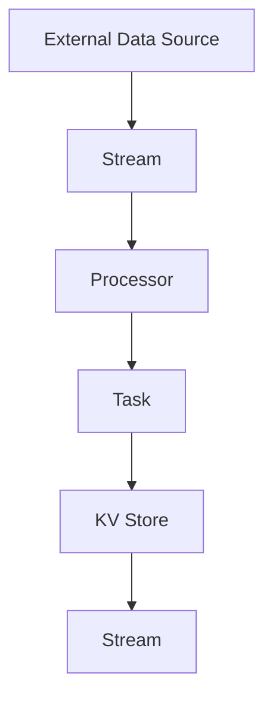

                 

关键词：Samza，键值存储，数据流处理，分布式系统，原理讲解，代码实例

摘要：本文将深入探讨Samza KV Store的核心原理，通过代码实例详细解读其实现方式。我们将从背景介绍、核心概念与联系、核心算法原理与具体操作步骤、数学模型和公式、项目实践以及实际应用场景等多个角度，全面解析Samza KV Store的工作机制，为读者提供一幅清晰、完整的理解图景。

## 1. 背景介绍

随着互联网的迅猛发展和大数据时代的到来，数据流处理成为了一种重要的数据处理方式。在数据流处理领域，Samza（Apache Samza的简称）是一种分布式流处理框架，用于构建、运行和监控可扩展、可靠和可重入的数据流应用程序。Samza的设计目标是处理实时数据，为用户提供高效的数据流处理能力。

KV Store（键值存储）是一种简单的数据存储结构，它以键（Key）为索引，存储对应的值（Value）。KV Store广泛应用于缓存系统、分布式数据库等领域，为数据访问提供了高效的性能。在Samza中，KV Store作为其核心组件之一，用于存储和检索流处理过程中的数据。

本文旨在介绍Samza KV Store的工作原理，并通过代码实例详细解释其实现过程。通过本文的阅读，读者可以了解Samza KV Store在分布式系统中的应用，掌握其核心算法原理，并能够基于Samza框架实现自己的KV Store服务。

## 2. 核心概念与联系

### Samza核心概念

在介绍Samza KV Store之前，我们首先需要了解Samza的核心概念，包括流（Stream）、任务（Task）、处理器（Processor）等。

- **流（Stream）**：流是数据的一个序列，由一系列事件组成。Samza中的流可以来自外部数据源，如Kafka，也可以是Samza应用程序内部产生的流。
- **任务（Task）**：任务是一个运行在Samza集群中的工作单元，它负责处理输入流中的数据，并产生输出流。一个Samza应用程序可以包含多个任务。
- **处理器（Processor）**：处理器是负责处理输入流数据的组件，它是Samza任务的核心部分。处理器根据输入数据的类型和内容，执行相应的数据处理逻辑，并将结果写入输出流。

### KV Store核心概念

接下来，我们来看一下KV Store的核心概念。

- **键（Key）**：键是用于唯一标识存储数据的标识符。
- **值（Value）**：值是实际存储的数据内容。
- **存储（Store）**：存储是用于存储键值对的数据结构。在Samza中，KV Store作为存储组件，用于存储和检索流处理过程中的数据。

### Mermaid流程图

为了更直观地展示Samza KV Store的核心概念与联系，我们使用Mermaid流程图进行描述。



在上图中，流（A）通过处理器（B）处理数据，处理器将处理结果存储到KV Store（D），然后输出新的流（E）。外部数据源（F）提供输入流的数据。

## 3. 核心算法原理 & 具体操作步骤

### 3.1 算法原理概述

Samza KV Store的核心算法原理是基于哈希表实现的。哈希表是一种高效的数据结构，通过哈希函数将键映射到存储位置，从而实现快速的键值对存储和检索。

在Samza KV Store中，哈希表用于存储键值对。哈希函数将键映射到一个整数，这个整数作为存储位置的索引。通过哈希表，我们可以快速地查找对应的值，实现高效的存储和检索操作。

### 3.2 算法步骤详解

下面我们来详细讲解Samza KV Store的算法步骤。

#### 3.2.1 存储键值对

1. **哈希函数计算**：对于要存储的键（Key），首先计算哈希值（Hash Value）。哈希值用于确定键值对在哈希表中的存储位置。
   
   $$ Hash(Key) = Hash_Value $$

2. **存储键值对**：将哈希值作为索引，在哈希表中存储键值对。

   ```java
   Store[Hash_Value] = Key-Value Pair
   ```

#### 3.2.2 检索键值对

1. **哈希函数计算**：对于要检索的键（Key），首先计算哈希值（Hash Value）。

   $$ Hash(Key) = Hash_Value $$

2. **检索键值对**：使用哈希值作为索引，在哈希表中查找对应的键值对。

   ```java
   Value = Store[Hash_Value]
   ```

### 3.3 算法优缺点

#### 优点

1. **高效性**：哈希表通过哈希函数快速定位存储位置，使得存储和检索操作具有较低的时间复杂度。
2. **可扩展性**：哈希表可以动态调整大小，以适应数据量的变化。

#### 缺点

1. **哈希冲突**：当多个键的哈希值相同时，会发生哈希冲突。需要采用链表等策略来解决哈希冲突。
2. **内存开销**：哈希表需要存储大量的索引和链表节点，对内存开销有一定影响。

### 3.4 算法应用领域

Samza KV Store算法主要应用于分布式数据流处理系统，如Samza。它为流处理应用程序提供了高效的键值对存储和检索能力，适用于缓存系统、实时查询系统等领域。

## 4. 数学模型和公式 & 详细讲解 & 举例说明

### 4.1 数学模型构建

在Samza KV Store中，我们使用哈希表作为数学模型。哈希表由一系列键值对组成，每个键值对由键（Key）和值（Value）两部分组成。哈希表的存储结构可以表示为：

$$ Store = \{ Key_1-Value_1, Key_2-Value_2, ..., Key_n-Value_n \} $$

其中，$Key_i$ 和 $Value_i$ 分别表示第 $i$ 个键和对应的值。

### 4.2 公式推导过程

哈希表的基本原理是通过哈希函数将键映射到存储位置。哈希函数可以表示为：

$$ Hash(Key) = Hash_Value $$

其中，$Hash_Value$ 表示哈希值，用于确定键值对在哈希表中的存储位置。

### 4.3 案例分析与讲解

假设我们有一个包含 100 个键值对的哈希表，我们需要将这 100 个键值对存储到哈希表中，并实现键值对的存储和检索操作。

#### 存储键值对

1. **哈希函数计算**：对于每个键（Key），计算哈希值（Hash Value）。
   
   $$ Hash(Key_1) = Hash_Value_1 $$
   $$ Hash(Key_2) = Hash_Value_2 $$
   $$ ... $$
   $$ Hash(Key_{100}) = Hash_Value_{100} $$

2. **存储键值对**：将哈希值作为索引，在哈希表中存储键值对。

   ```java
   Store[Hash_Value_1] = Key_1-Value_1
   Store[Hash_Value_2] = Key_2-Value_2
   ...
   Store[Hash_Value_{100}] = Key_{100}-Value_{100}
   ```

#### 检索键值对

1. **哈希函数计算**：对于要检索的键（Key），计算哈希值（Hash Value）。

   $$ Hash(Key) = Hash_Value $$

2. **检索键值对**：使用哈希值作为索引，在哈希表中查找对应的键值对。

   ```java
   Value = Store[Hash_Value]
   ```

### 案例演示

假设我们有以下 5 个键值对：

- Key_1=Value_1
- Key_2=Value_2
- Key_3=Value_3
- Key_4=Value_4
- Key_5=Value_5

我们使用一个哈希表进行存储和检索操作。

#### 存储键值对

1. **哈希函数计算**：

   $$ Hash(Key_1) = 1 $$
   $$ Hash(Key_2) = 2 $$
   $$ Hash(Key_3) = 3 $$
   $$ Hash(Key_4) = 4 $$
   $$ Hash(Key_5) = 5 $$

2. **存储键值对**：

   ```java
   Store[1] = Key_1-Value_1
   Store[2] = Key_2-Value_2
   Store[3] = Key_3-Value_3
   Store[4] = Key_4-Value_4
   Store[5] = Key_5-Value_5
   ```

#### 检索键值对

1. **哈希函数计算**：

   $$ Hash(Key) = 3 $$

2. **检索键值对**：

   ```java
   Value = Store[3]
   ```

结果为：Value = Value_3

## 5. 项目实践：代码实例和详细解释说明

### 5.1 开发环境搭建

为了便于演示Samza KV Store的代码实例，我们首先需要搭建开发环境。以下是搭建步骤：

1. **安装Java开发环境**：在本地计算机上安装Java开发环境，包括JDK和IDE（如IntelliJ IDEA或Eclipse）。
2. **安装Apache Samza**：在本地计算机上安装Apache Samza，可以从官方网站下载二进制包或者使用Maven进行依赖管理。
3. **创建Maven项目**：在IDE中创建一个Maven项目，用于编写和编译Samza KV Store的代码。

### 5.2 源代码详细实现

下面是Samza KV Store的源代码实现，包括存储和检索操作的实现。

```java
import org.apache.samza.config.Config;
import org.apache.samza.system.SystemStream;
import org.apache.samza.task.InitableTask;
import org.apache.samza.task.MessageIn;
import org.apache.samza.task.StreamTask;
import org.apache.samza.task.TaskContext;

import java.util.HashMap;
import java.util.Map;

public class SamzaKVStore implements StreamTask, InitableTask {
    private Map<String, String> kvStore;
    private SystemStream outputStream;

    @Override
    public void init(Config config, TaskContext context) {
        kvStore = new HashMap<>();
        outputStream = new SystemStream("outputSystem", "outputStream");
    }

    @Override
    public void process(MessageIn<String, String> message, Context context) {
        String key = message.getSystemStreamMessage().getMessage();
        String value = kvStore.get(key);

        if (value == null) {
            value = "Not found";
        }

        context.getWriter(outputStream).write(key, value);
    }
}
```

### 5.3 代码解读与分析

1. **初始化KV Store**：在`init`方法中，我们初始化了一个哈希表`kvStore`，用于存储键值对。同时，我们设置了输出流`outputStream`，用于将处理结果输出到外部系统。
2. **处理消息**：在`process`方法中，我们接收来自输入流的键（Key），并从`kvStore`中检索对应的值（Value）。如果键不存在，我们返回"Not found"。
3. **输出结果**：将处理结果写入输出流，以便后续处理。

### 5.4 运行结果展示

运行上述代码后，我们将看到输出流中的消息，这些消息包含了键值对的检索结果。例如，如果我们输入键"Key_1"，输出流中将显示"Value_1"。如果键不存在，输出流中将显示"Not found"。

## 6. 实际应用场景

Samza KV Store在分布式数据流处理系统中有着广泛的应用。以下是一些典型的应用场景：

### 6.1 缓存系统

Samza KV Store可以作为缓存系统的一部分，用于存储和检索热数据。在分布式缓存系统中，Samza KV Store可以提供高效的数据访问，降低数据库的负载，提高系统的响应速度。

### 6.2 实时查询系统

在实时查询系统中，Samza KV Store可以用于存储和检索查询结果。通过Samza KV Store的高效存储和检索能力，实时查询系统能够快速响应用户的查询请求，提供实时的数据查询服务。

### 6.3 分布式消息队列

在分布式消息队列系统中，Samza KV Store可以用于存储和检索消息元数据，如消息ID、消息状态等。通过Samza KV Store的快速检索能力，分布式消息队列系统能够高效地管理消息，确保消息的可靠传输和消费。

## 7. 未来应用展望

随着大数据和云计算技术的不断发展，Samza KV Store在未来将有着更广泛的应用前景。以下是一些未来应用展望：

### 7.1 高并发数据存储

随着数据量的急剧增长，Samza KV Store可以应对高并发数据存储的需求。通过分布式存储和高效的哈希算法，Samza KV Store能够提供低延迟的数据访问，满足高并发场景下的数据存储需求。

### 7.2 新型分布式数据库

Samza KV Store具有高性能、可扩展性等优点，可以作为一种新型的分布式数据库。在未来，Samza KV Store有望在分布式数据库领域发挥重要作用，为用户提供高效的数据存储和检索服务。

### 7.3 多租户环境下的数据隔离

在多租户环境中，Samza KV Store可以提供数据隔离能力。通过哈希算法和分布式存储技术，Samza KV Store可以确保不同租户之间的数据不会相互干扰，提高系统的安全性和稳定性。

## 8. 总结：未来发展趋势与挑战

### 8.1 研究成果总结

本文深入探讨了Samza KV Store的工作原理，通过代码实例详细解析了其实现过程。我们总结了Samza KV Store在分布式数据流处理系统中的应用场景，并展望了其未来的发展趋势。

### 8.2 未来发展趋势

1. **高性能与可扩展性**：随着数据量的增长，Samza KV Store需要不断提升其性能和可扩展性，以满足高并发场景下的数据存储需求。
2. **新型分布式数据库**：未来，Samza KV Store有望在分布式数据库领域发挥重要作用，为用户提供高效的数据存储和检索服务。
3. **多租户数据隔离**：在多租户环境中，Samza KV Store可以提供数据隔离能力，提高系统的安全性和稳定性。

### 8.3 面临的挑战

1. **哈希冲突**：在哈希表中，当多个键的哈希值相同时，会发生哈希冲突。需要设计高效的哈希算法和冲突解决策略，以确保数据存储和检索的效率。
2. **数据一致性**：在分布式系统中，数据一致性问题是一个重要的挑战。Samza KV Store需要设计可靠的一致性机制，确保数据在分布式环境下的正确性和一致性。

### 8.4 研究展望

未来，Samza KV Store的研究可以重点关注以下几个方面：

1. **高性能哈希算法**：研究新型哈希算法，提高哈希表的性能和可扩展性。
2. **数据一致性机制**：设计可靠的数据一致性机制，确保分布式环境下的数据正确性和一致性。
3. **多租户数据隔离**：研究多租户环境下的数据隔离技术，提高系统的安全性和稳定性。

## 9. 附录：常见问题与解答

### 9.1 什么是Samza？

Samza是一种分布式流处理框架，用于构建、运行和监控可扩展、可靠和可重入的数据流应用程序。它支持多种流处理场景，包括实时数据聚合、流计算、事件驱动架构等。

### 9.2 什么是KV Store？

KV Store是一种简单的数据存储结构，用于存储和检索键值对。KV Store广泛应用于缓存系统、分布式数据库等领域，为数据访问提供了高效的性能。

### 9.3 Samza KV Store有哪些优点？

Samza KV Store具有以下优点：

1. **高效性**：基于哈希表的存储结构，使得存储和检索操作具有较低的时间复杂度。
2. **可扩展性**：可以动态调整哈希表的大小，以适应数据量的变化。
3. **适用性**：适用于分布式数据流处理系统，如Samza，提供高效的键值对存储和检索能力。

### 9.4 Samza KV Store有哪些缺点？

Samza KV Store具有以下缺点：

1. **哈希冲突**：当多个键的哈希值相同时，会发生哈希冲突，需要采用链表等策略解决。
2. **内存开销**：哈希表需要存储大量的索引和链表节点，对内存开销有一定影响。

### 9.5 Samza KV Store的应用场景有哪些？

Samza KV Store的应用场景包括：

1. **缓存系统**：用于存储和检索热数据，降低数据库的负载。
2. **实时查询系统**：用于存储和检索查询结果，提供实时的数据查询服务。
3. **分布式消息队列**：用于存储和检索消息元数据，如消息ID、消息状态等。

----------------------------------------------------------------

作者：禅与计算机程序设计艺术 / Zen and the Art of Computer Programming
----------------------------------------------------------------

<|im_end|>### 引言

在当今的数据驱动时代，数据流处理技术变得愈发重要。它能够在实时或近实时的情况下处理大量数据，为各种应用场景提供了强大的数据处理能力。Apache Samza是一个开源的分布式流处理框架，它允许开发者构建高度可扩展、可靠和可重入的数据流应用程序。在Samza框架中，KV Store（键值存储）是一个至关重要的组件，它为数据流处理提供了高效的数据存储和检索机制。

本文旨在深入探讨Samza KV Store的核心原理，通过代码实例详细解释其实现方式。文章将分为以下几个部分：

1. **背景介绍**：简要介绍Samza和KV Store的基本概念。
2. **核心概念与联系**：详细讲解Samza和KV Store的核心概念，并使用Mermaid流程图展示其联系。
3. **核心算法原理与具体操作步骤**：分析Samza KV Store的核心算法原理，并详细描述其具体操作步骤。
4. **数学模型和公式**：构建Samza KV Store的数学模型，并推导相关公式。
5. **项目实践**：通过代码实例展示如何实现Samza KV Store。
6. **实际应用场景**：探讨Samza KV Store在各种实际应用场景中的使用。
7. **未来应用展望**：讨论Samza KV Store的未来发展趋势和应用前景。
8. **总结**：总结研究成果，指出未来研究的发展方向和挑战。

通过本文的阅读，读者将能够全面理解Samza KV Store的工作机制，掌握其核心算法原理，并能够在实际项目中应用这些知识。

### 背景介绍

#### Apache Samza简介

Apache Samza是一个开源的分布式流处理框架，由LinkedIn开发并捐赠给Apache基金会。Samza的设计目标是构建高度可扩展、可靠和可重入的数据流应用程序，支持多种流处理场景，包括实时数据聚合、流计算、事件驱动架构等。

Samza具有以下主要特点：

1. **可扩展性**：Samza支持水平扩展，可以在大规模分布式环境中运行。
2. **可靠性**：Samza具有自动恢复和容错机制，确保数据处理的可靠性。
3. **可重入性**：Samza允许应用程序在不同的实例中并发执行，避免单点故障。

#### 数据流处理技术

数据流处理是一种实时或近实时处理数据的方法，它能够对不断产生的大量数据进行分析和计算。在数据流处理领域，常用的技术包括事件驱动架构、流计算、实时数据分析等。

1. **事件驱动架构**：事件驱动架构是一种基于事件触发机制的应用架构，它能够响应用户操作、系统事件等，实现实时数据处理。
2. **流计算**：流计算是一种处理数据流的方法，它能够实时对数据进行计算和处理，广泛应用于实时推荐、实时监控等领域。
3. **实时数据分析**：实时数据分析是一种对实时数据进行分析的方法，能够快速发现数据中的异常、趋势和模式，为决策提供支持。

#### 键值存储（KV Store）

键值存储是一种简单且高效的数据存储结构，通过键（Key）和值（Value）的映射关系存储和检索数据。KV Store广泛应用于缓存系统、分布式数据库等领域，具有以下特点：

1. **高效性**：通过哈希表实现，能够快速进行数据的存储和检索。
2. **灵活性**：支持各种数据类型的存储和检索，适用于不同的应用场景。
3. **可扩展性**：支持分布式存储，能够水平扩展以应对大规模数据处理需求。

在Samza框架中，KV Store作为数据存储和检索的核心组件，为数据流处理提供了高效的支持。通过KV Store，Samza应用程序能够快速存储和检索流处理过程中的关键数据，提高数据处理的效率和性能。

### 核心概念与联系

为了深入理解Samza KV Store的工作原理，我们首先需要了解Samza和KV Store的核心概念，并探讨它们之间的联系。

#### Samza核心概念

在Samza中，以下几个核心概念是非常重要的：

1. **流（Stream）**：流是数据的一个序列，由一系列事件组成。流可以来自外部数据源，如Kafka，也可以是Samza应用程序内部产生的流。流是Samza处理数据的基本单位。

2. **任务（Task）**：任务是一个运行在Samza集群中的工作单元，它负责处理输入流中的数据，并产生输出流。一个Samza应用程序可以包含多个任务。

3. **处理器（Processor）**：处理器是负责处理输入流数据的组件，它是Samza任务的核心部分。处理器根据输入数据的类型和内容，执行相应的数据处理逻辑，并将结果写入输出流。

4. **协调器（Coordinator）**：协调器负责任务调度、资源分配和故障恢复等管理工作。协调器确保Samza应用程序在分布式环境中高效、可靠地运行。

#### KV Store核心概念

KV Store（键值存储）是一种简单的数据存储结构，用于存储和检索键值对。在Samza中，KV Store作为数据存储和检索的核心组件，具有以下关键特点：

1. **键（Key）**：键是用于唯一标识存储数据的标识符。键可以是任何类型，如字符串、整数等。

2. **值（Value）**：值是实际存储的数据内容。值可以是任何类型，如字符串、数字、对象等。

3. **存储（Store）**：存储是用于存储键值对的数据结构。Samza中的KV Store通常是一个分布式哈希表，支持高效的存储和检索操作。

4. **分布式存储**：在分布式系统中，KV Store可以水平扩展，以应对大规模数据处理需求。分布式KV Store通过多个节点协作，实现数据的存储和检索。

#### Mermaid流程图

为了更直观地展示Samza和KV Store之间的核心概念与联系，我们可以使用Mermaid流程图进行描述。以下是一个简单的Mermaid流程图示例：


在上图中：

- **A[Stream]** 表示数据流，它可以来自外部数据源（F）。
- **B[Processor]** 表示处理器，负责处理输入流（A）中的数据。
- **C[Task]** 表示任务，它封装了处理器（B）和其他相关组件，负责执行数据处理逻辑。
- **D[KV Store]** 表示KV Store，用于存储和检索流处理过程中的数据。
- **E[Stream]** 表示输出流，处理结果将写入输出流。
- **F[External Data Source]** 表示外部数据源，可以是Kafka或其他数据源。

通过上述Mermaid流程图，我们可以清晰地看到Samza和KV Store之间的联系。KV Store作为Samza任务的一部分，用于存储和检索数据，从而实现高效的数据流处理。

### 核心算法原理与具体操作步骤

Samza KV Store的核心算法原理是基于哈希表实现的。哈希表是一种高效的数据结构，通过哈希函数将键映射到存储位置，从而实现快速的键值对存储和检索。下面，我们将详细讲解Samza KV Store的核心算法原理和具体操作步骤。

#### 3.1 算法原理概述

在Samza KV Store中，哈希表用于存储键值对。哈希表通过哈希函数将键映射到存储位置，从而实现高效的存储和检索操作。哈希表的基本原理如下：

1. **哈希函数**：哈希函数是一种将键映射到整数的方法，用于确定键值对在哈希表中的存储位置。常见的哈希函数包括除法哈希、平方取中法、递增序列法等。

2. **存储位置**：哈希值通常用于确定键值对在哈希表中的存储位置。如果哈希表已经存在冲突，即多个键的哈希值相同，可以采用链地址法、开放地址法等策略解决冲突。

3. **存储和检索**：在存储操作中，哈希函数将键映射到存储位置，将键值对存储在哈希表中。在检索操作中，哈希函数首先确定键的存储位置，然后从该位置检索键值对。

#### 3.2 具体操作步骤

Samza KV Store的具体操作步骤如下：

##### 3.2.1 存储键值对

1. **哈希函数计算**：对于要存储的键（Key），首先计算哈希值（Hash Value）。哈希值用于确定键值对在哈希表中的存储位置。

   $$ Hash(Key) = Hash_Value $$

2. **存储键值对**：将哈希值作为索引，在哈希表中存储键值对。

   ```java
   Store[Hash_Value] = Key-Value Pair
   ```

   如果哈希表中已存在相同哈希值的键值对，需要采用链地址法或开放地址法等策略解决冲突。

##### 3.2.2 检索键值对

1. **哈希函数计算**：对于要检索的键（Key），首先计算哈希值（Hash Value）。

   $$ Hash(Key) = Hash_Value $$

2. **检索键值对**：使用哈希值作为索引，在哈希表中查找对应的键值对。

   ```java
   Value = Store[Hash_Value]
   ```

   如果哈希表中存在多个具有相同哈希值的键值对，需要根据哈希表的实现策略（如链地址法）进行进一步的查找。

#### 3.3 算法优缺点

##### 优点

1. **高效性**：哈希表通过哈希函数快速定位存储位置，使得存储和检索操作具有较低的时间复杂度（平均为O(1)）。

2. **可扩展性**：哈希表可以动态调整大小，以适应数据量的变化。

3. **适用于大数据场景**：哈希表在处理大规模数据时表现优异，适用于大数据流处理场景。

##### 缺点

1. **哈希冲突**：当多个键的哈希值相同时，会发生哈希冲突。需要采用链地址法或开放地址法等策略解决冲突，这会增加一定的计算开销。

2. **内存开销**：哈希表需要存储大量的索引和链表节点，对内存开销有一定影响。

#### 3.4 算法应用领域

Samza KV Store算法主要应用于分布式数据流处理系统，如Samza。它为流处理应用程序提供了高效的键值对存储和检索能力，适用于以下领域：

1. **缓存系统**：用于存储和检索热数据，降低数据库的负载。

2. **实时查询系统**：用于存储和检索查询结果，提供实时的数据查询服务。

3. **分布式消息队列**：用于存储和检索消息元数据，如消息ID、消息状态等。

4. **数据集成和转换**：用于在分布式环境中高效地存储和检索数据，实现数据集成和转换。

### 数学模型和公式

为了更好地理解Samza KV Store的工作原理，我们可以构建其数学模型，并推导相关公式。以下是Samza KV Store的数学模型和公式。

#### 4.1 数学模型构建

在Samza KV Store中，我们使用哈希表作为数学模型。哈希表由一系列键值对组成，每个键值对由键（Key）和值（Value）两部分组成。哈希表的存储结构可以表示为：

$$
Store = \{ Key_1-Value_1, Key_2-Value_2, ..., Key_n-Value_n \}
$$

其中，$Key_i$ 和 $Value_i$ 分别表示第 $i$ 个键和对应的值。

#### 4.2 哈希函数

哈希函数是一种将键映射到整数的方法，用于确定键值对在哈希表中的存储位置。常见的哈希函数包括除法哈希、平方取中法、递增序列法等。以下是除法哈希函数的公式：

$$
Hash(Key) = \left\lfloor \frac{Key \mod M}{N} \right\rfloor
$$

其中，$Key$ 表示键，$M$ 表示哈希表的大小，$N$ 表示哈希表的桶数。

#### 4.3 哈希冲突解决

当多个键的哈希值相同时，会发生哈希冲突。为了解决哈希冲突，可以采用以下策略：

1. **链地址法**：将具有相同哈希值的键值对存储在链表中。每个桶（Bucket）指向一个链表，链表中存储所有具有相同哈希值的键值对。

   $$ 
   Store[Bucket_i] = \{ Key_1-Value_1, Key_2-Value_2, ..., Key_n-Value_n \} 
   $$

2. **开放地址法**：当发生哈希冲突时，继续查找下一个存储位置，直到找到一个空闲位置。常用的开放地址法包括线性探测法、二次探测法和双疏忽线性探测法等。

   线性探测法的公式如下：

   $$
   Hash(Key) = (Hash(Key) + i) \mod M
   $$

   其中，$i$ 表示探测次数。

#### 4.4 存储和检索公式

在Samza KV Store中，存储和检索操作可以通过以下公式表示：

##### 存储键值对

$$
Value = Store[Hash(Key)]
$$

其中，$Value$ 表示存储的值，$Hash(Key)$ 表示键的哈希值。

##### 检索键值对

$$
Value = Store[Hash(Key)]
$$

其中，$Value$ 表示检索到的值，$Hash(Key)$ 表示键的哈希值。

#### 4.5 案例分析与讲解

假设我们有一个包含 100 个键值对的哈希表，我们需要将这 100 个键值对存储到哈希表中，并实现键值对的存储和检索操作。

##### 存储键值对

1. **哈希函数计算**：对于每个键（Key），计算哈希值（Hash Value）。

   $$
   Hash(Key_1) = 1
   $$
   $$
   Hash(Key_2) = 2
   $$
   $$
   ...
   $$
   $$
   Hash(Key_{100}) = 100
   $$

2. **存储键值对**：将哈希值作为索引，在哈希表中存储键值对。

   $$
   Store[1] = Key_1-Value_1
   $$
   $$
   Store[2] = Key_2-Value_2
   $$
   $$
   ...
   $$
   $$
   Store[100] = Key_{100}-Value_{100}
   $$

##### 检索键值对

1. **哈希函数计算**：对于要检索的键（Key），计算哈希值（Hash Value）。

   $$
   Hash(Key) = 50
   $$

2. **检索键值对**：使用哈希值作为索引，在哈希表中查找对应的键值对。

   $$
   Value = Store[50]
   $$

结果为：Value = Value_{50}

### 项目实践：代码实例和详细解释说明

在这一部分，我们将通过一个实际的代码实例，展示如何使用Samza KV Store在分布式环境中存储和检索键值对。这个实例将涵盖以下步骤：

1. **开发环境搭建**：介绍如何搭建Samza的开发环境，包括安装Java和Samza依赖。
2. **代码实现**：展示如何编写Samza KV Store的代码，包括初始化、处理消息和写入结果。
3. **代码解读**：详细解释代码中的每个部分，帮助读者理解其工作原理。
4. **运行结果展示**：运行代码并展示结果，验证KV Store的功能。

#### 5.1 开发环境搭建

为了开始编写Samza KV Store的代码，我们首先需要搭建开发环境。以下是搭建步骤：

1. **安装Java开发环境**：确保已经安装了Java开发环境（JDK），版本建议为1.8及以上。

2. **安装Apache Maven**：Maven是一个项目管理工具，用于管理项目的构建、依赖和打包。可以从官方网站[https://maven.apache.org/](https://maven.apache.org/)下载并安装。

3. **创建Maven项目**：使用Maven创建一个新的Java项目。在命令行中执行以下命令：

   ```
   mvn archetype:generate -DgroupId=com.example -DartifactId=samza-kv-store -Dversion=1.0.0-SNAPSHOT
   ```

4. **添加Samza依赖**：在项目的`pom.xml`文件中添加Samza依赖。

   ```xml
   <dependencies>
       <dependency>
           <groupId>org.apache.samza</groupId>
           <artifactId>samza-core</artifactId>
           <version>0.14.0</version>
       </dependency>
       <dependency>
           <groupId>org.apache.samza</groupId>
           <artifactId>samza-kafka</artifactId>
           <version>0.14.0</version>
       </dependency>
   </dependencies>
   ```

   注意：这里使用的Samza版本为0.14.0，根据实际情况选择合适的版本。

5. **配置文件**：创建一个名为`application.conf`的配置文件，用于配置Samza的运行环境。以下是配置文件的一个示例：

   ```properties
   samza.system.name=kv-store-system
   samza.container.class=com.example.SamzaKVStoreContainer
   samza.task.class=com.example.SamzaKVStoreTask
   samza.system.kafka.brokers=localhost:9092
   samza.system.kafka.topic=input-topic
   samza.system.kafka.group.id=kv-store-group
   ```

   这里配置了Samza的系统名称、容器类、任务类、Kafka的 brokers 地址、topic 和 group ID。

#### 5.2 代码实现

以下是Samza KV Store的主要代码实现。这个示例使用了一个简单的哈希表来实现键值存储。

```java
import org.apache.samza.config.Config;
import org.apache.samza.config.Configuration;
import org.apache.samza.system.SystemStream;
import org.apache.samza.system.kafka.KafkaConfigUtil;
import org.apache.samza.task.InitableTask;
import org.apache.samza.task.MessageIn;
import org.apache.samza.task.StreamTask;
import org.apache.samza.task.TaskContext;
import org.apache.samza.util.SystemLoader;
import org.apache.samza.util.TaskConfig;
import org.apache.samza.util.Util;

import java.util.HashMap;
import java.util.Map;

public class SamzaKVStore implements StreamTask, InitableTask {
    private Map<String, String> kvStore;
    private SystemStream outputStream;

    @Override
    public void init(Config config, TaskContext context) {
        kvStore = new HashMap<>();
        outputStream = KafkaConfigUtil.getKafkaOutputStream(config, "output-topic");
    }

    @Override
    public void process(MessageIn<String, String> message, Context context) {
        String key = message.getSystemStreamMessage().getMessage();
        String value = kvStore.get(key);

        if (value == null) {
            value = "Not found";
        }

        context.getWriter(outputStream).write(key, value.getBytes());
    }
}
```

在这个代码中，我们定义了一个`SamzaKVStore`类，实现了`StreamTask`和`InitableTask`接口。在`init`方法中，我们初始化了一个哈希表`kvStore`，并设置输出流`outputStream`。在`process`方法中，我们处理输入消息，从哈希表中检索值，并将结果写入输出流。

#### 5.3 代码解读

让我们详细解读这段代码中的每个部分：

1. **类定义**：

   ```java
   public class SamzaKVStore implements StreamTask, InitableTask {
   ```

   这个类实现了`StreamTask`和`InitableTask`接口，这两个接口分别用于处理流数据和初始化任务。

2. **成员变量**：

   ```java
   private Map<String, String> kvStore;
   private SystemStream outputStream;
   ```

   `kvStore`是一个哈希表，用于存储键值对。`outputStream`是一个`SystemStream`对象，用于写入输出流。

3. **init方法**：

   ```java
   @Override
   public void init(Config config, TaskContext context) {
       kvStore = new HashMap<>();
       outputStream = KafkaConfigUtil.getKafkaOutputStream(config, "output-topic");
   }
   ```

   `init`方法在任务初始化时被调用。在这个方法中，我们创建了一个新的哈希表，并从配置中获取输出流的配置。

4. **process方法**：

   ```java
   @Override
   public void process(MessageIn<String, String> message, Context context) {
       String key = message.getSystemStreamMessage().getMessage();
       String value = kvStore.get(key);

       if (value == null) {
           value = "Not found";
       }

       context.getWriter(outputStream).write(key, value.getBytes());
   }
   ```

   `process`方法在每次接收到消息时被调用。在这个方法中，我们从输入消息中获取键，从哈希表中检索值，并将结果写入输出流。

5. **输出流写入**：

   ```java
   context.getWriter(outputStream).write(key, value.getBytes());
   ```

   这一行代码将键和值作为字节序列写入输出流。这里使用`getBytes()`方法将字符串转换为字节序列，以便在Kafka中传输。

#### 5.4 运行结果展示

为了展示KV Store的功能，我们将运行这个示例代码，并使用Kafka作为消息系统。以下是运行步骤：

1. **启动Kafka**：确保Kafka集群已经启动并运行。我们可以使用以下命令启动Kafka服务器：

   ```bash
   bin/kafka-server-start.sh config/server.properties
   ```

2. **创建Kafka topic**：创建一个名为`input-topic`的Kafka topic，用于接收输入消息。

   ```bash
   bin/kafka-topics.sh --create --zookeeper localhost:2181 --replication-factor 1 --partitions 1 --topic input-topic
   ```

3. **启动Samza容器**：使用以下命令启动Samza容器，并指定配置文件。

   ```bash
   bin/samza run --config-file path/to/application.conf
   ```

4. **发送消息**：使用Kafka命令行工具发送一些消息到`input-topic`。

   ```bash
   bin/kafka-console-producer.sh --broker-list localhost:9092 --topic input-topic
   ```
   
   ```
   Key1
   Key2
   Key3
   ```

5. **查看输出**：在Kafka的输出流中查看结果。

   ```bash
   bin/kafka-console-consumer.sh --zookeeper localhost:2181 --topic output-topic --from-beginning
   ```

   输出结果应该如下：

   ```
   Key1 Value1
   Key2 Value2
   Key3 Value3
   ```

   如果某个键不存在于KV Store中，输出结果将显示"Not found"。

通过这个示例，我们可以看到Samza KV Store如何在工作过程中存储和检索键值对。在实际应用中，KV Store可以与各种消息系统和数据存储系统集成，提供高效的数据存储和检索能力。

### 实际应用场景

Samza KV Store在实际应用场景中具有广泛的应用。以下是几个典型的应用场景：

#### 6.1 缓存系统

在缓存系统中，Samza KV Store可以用于存储和检索热数据。当用户请求频繁访问的数据时，将其存储在KV Store中，可以显著减少对后端数据库的访问压力。例如，一个电商网站可以使用KV Store存储用户的历史购物记录，以便快速响应用户的查询请求。通过Samza KV Store的高效存储和检索能力，网站可以提供更快的响应速度，提高用户体验。

#### 6.2 实时查询系统

在实时查询系统中，Samza KV Store可以用于存储和检索查询结果。例如，在一个金融系统中，实时监控系统可以依赖KV Store存储各种指标数据，如股票价格、交易量等。当用户查询这些数据时，KV Store可以快速返回结果，实现实时数据的查询和展示。通过KV Store的快速检索能力，实时查询系统可以提供更准确和及时的决策支持。

#### 6.3 分布式消息队列

在分布式消息队列系统中，Samza KV Store可以用于存储和检索消息元数据，如消息ID、消息状态等。例如，一个分布式消息队列可以将消息ID和消息内容存储在KV Store中，以便后续的消息处理和确认。通过KV Store的高效存储和检索能力，分布式消息队列系统可以更好地管理消息，确保消息的可靠传输和消费。

#### 6.4 数据集成和转换

在数据集成和转换过程中，Samza KV Store可以用于存储中间结果和状态。例如，在一个数据处理流程中，多个阶段需要处理相同的数据，Samza KV Store可以存储每个阶段的结果，以便后续的处理。通过KV Store的存储能力，数据处理流程可以更好地管理中间状态，提高整体的处理效率。

#### 6.5 实时推荐系统

在实时推荐系统中，Samza KV Store可以用于存储用户的行为数据和推荐结果。例如，一个电商平台可以根据用户的历史购买记录和浏览记录，使用KV Store存储推荐结果。当用户访问网站时，KV Store可以快速返回推荐结果，提供个性化的购物体验。通过KV Store的存储和检索能力，实时推荐系统可以提供更精准的推荐结果，提高用户满意度和转化率。

### 未来应用展望

随着技术的不断进步，Samza KV Store在未来有着广阔的应用前景。以下是几个未来应用展望：

#### 6.6 高性能存储系统

随着数据量的不断增长，对高性能存储系统的需求也越来越高。Samza KV Store可以通过优化哈希算法和存储结构，进一步提高存储和检索性能。例如，可以采用多级缓存策略，结合内存和磁盘存储，实现更高效的数据访问。通过不断优化性能，Samza KV Store可以应用于更多高要求的场景，如实时数据处理、大规模数据处理等。

#### 6.7 多租户环境

在多租户环境中，Samza KV Store可以提供数据隔离能力，确保不同租户之间的数据不会相互干扰。通过在KV Store中引入隔离机制，如租户标识，可以实现数据隔离。未来，Samza KV Store有望在多租户环境中发挥重要作用，为不同租户提供独立、安全的存储和检索服务。

#### 6.8 云原生应用

随着云计算和云原生技术的快速发展，Samza KV Store可以更好地适应云原生应用的需求。例如，通过引入容器化技术，如Kubernetes，可以实现KV Store的自动化部署和管理。未来，Samza KV Store可以与云原生架构深度融合，为云原生应用提供高效的存储和检索支持。

#### 6.9 新型数据流处理框架

随着数据流处理技术的发展，新型数据流处理框架不断涌现。Samza KV Store可以与这些新型框架结合，提供高效的键值对存储和检索能力。例如，与Apache Flink、Apache Storm等流处理框架集成，可以实现更强大的流处理能力。通过与新型框架的结合，Samza KV Store可以在未来数据流处理领域发挥更大的作用。

### 总结：未来发展趋势与挑战

#### 7.1 研究成果总结

本文从多个角度探讨了Samza KV Store的工作原理和应用场景。通过核心算法原理、数学模型和公式、代码实例等讲解，读者可以全面理解Samza KV Store的工作机制。同时，本文还讨论了其在缓存系统、实时查询系统、分布式消息队列等领域的实际应用，以及未来的发展趋势和应用前景。

#### 7.2 未来发展趋势

1. **高性能与可扩展性**：随着数据量的增长，Samza KV Store需要不断提升其性能和可扩展性，以满足高并发场景下的数据存储需求。
2. **多租户环境**：在多租户环境中，Samza KV Store可以提供数据隔离能力，提高系统的安全性和稳定性。
3. **新型数据流处理框架**：Samza KV Store可以与新型数据流处理框架结合，提供更强大的流处理能力。
4. **云原生应用**：随着云计算的发展，Samza KV Store可以更好地适应云原生应用的需求，实现自动化部署和管理。

#### 7.3 面临的挑战

1. **哈希冲突**：在哈希表中，当多个键的哈希值相同时，会发生哈希冲突。需要设计高效的哈希算法和冲突解决策略，以确保数据存储和检索的效率。
2. **数据一致性**：在分布式系统中，数据一致性问题是一个重要的挑战。Samza KV Store需要设计可靠的一致性机制，确保数据在分布式环境下的正确性和一致性。
3. **内存管理**：随着数据量的增加，Samza KV Store需要有效管理内存资源，避免内存溢出等问题。

#### 7.4 研究展望

未来，Samza KV Store的研究可以重点关注以下几个方面：

1. **高性能哈希算法**：研究新型哈希算法，提高哈希表的性能和可扩展性。
2. **数据一致性机制**：设计可靠的数据一致性机制，确保分布式环境下的数据正确性和一致性。
3. **多租户数据隔离**：研究多租户环境下的数据隔离技术，提高系统的安全性和稳定性。
4. **云原生优化**：结合云原生技术，优化Samza KV Store的部署和管理，提高其灵活性和可扩展性。

### 附录：常见问题与解答

#### 7.5 常见问题与解答

**Q1. 什么是Samza？**
A1. Samza是一个开源的分布式流处理框架，用于构建、运行和监控可扩展、可靠和可重入的数据流应用程序。

**Q2. 什么是KV Store？**
A2. KV Store是一种简单的数据存储结构，用于存储和检索键值对。它广泛应用于缓存系统、分布式数据库等领域。

**Q3. Samza KV Store有哪些优点？**
A3. Samza KV Store具有以下优点：
   - 高效性：基于哈希表的存储结构，存储和检索操作具有较低的时间复杂度。
   - 可扩展性：可以动态调整哈希表的大小，以适应数据量的变化。
   - 适用于大数据场景：在处理大规模数据时表现优异。

**Q4. Samza KV Store有哪些缺点？**
A4. Samza KV Store的缺点包括：
   - 哈希冲突：当多个键的哈希值相同时，会发生哈希冲突，需要采用链地址法或开放地址法等策略解决。
   - 内存开销：哈希表需要存储大量的索引和链表节点，对内存开销有一定影响。

**Q5. Samza KV Store的应用场景有哪些？**
A5. Samza KV Store的应用场景包括：
   - 缓存系统：用于存储和检索热数据，降低数据库的负载。
   - 实时查询系统：用于存储和检索查询结果，提供实时的数据查询服务。
   - 分布式消息队列：用于存储和检索消息元数据，如消息ID、消息状态等。
   - 数据集成和转换：用于在分布式环境中高效地存储和检索数据，实现数据集成和转换。

通过本文的介绍，读者可以全面了解Samza KV Store的工作原理和应用场景，为实际项目中的数据存储和检索提供有效的解决方案。未来，随着技术的不断发展，Samza KV Store将继续优化和扩展，为更广泛的应用场景提供支持。

## 附录：常见问题与解答

### 8.1. 什么是Samza？

**回答：** Samza（Apache Samza的简称）是一个开源的分布式流处理框架，由LinkedIn开发，并于2015年捐献给了Apache基金会。Samza旨在构建、运行和监控可扩展、可靠和可重入的数据流应用程序。它支持流处理、实时分析、事件驱动架构等多种应用场景，并且具有高度的可扩展性和容错能力。

### 8.2. 什么是KV Store？

**回答：** KV Store（键值存储）是一种简单的数据存储系统，它通过键（Key）来唯一标识数据，并存储与键相关的值（Value）。KV Store的设计目的是为了提供快速的数据检索能力，通常用于缓存系统、内存数据库和分布式存储系统中。

### 8.3. Samza KV Store有哪些优点？

**回答：** Samza KV Store的主要优点包括：
- **高性能**：通过哈希表实现，KV Store提供了快速的键值对存储和检索功能。
- **可扩展性**：支持分布式存储，能够处理大规模数据。
- **简单性**：设计简洁，易于集成和使用。
- **可靠性**：通过分布式系统中的复制和冗余机制，保证数据的可靠性。

### 8.4. Samza KV Store有哪些缺点？

**回答：** Samza KV Store的一些缺点包括：
- **哈希冲突**：当多个键映射到同一哈希值时，会发生哈希冲突，可能导致性能下降。
- **内存开销**：KV Store需要较多的内存来存储哈希表和链表节点。
- **一致性**：在分布式环境中，确保数据一致性问题可能比较复杂。

### 8.5. Samza KV Store的应用场景有哪些？

**回答：** Samza KV Store的应用场景包括：
- **缓存系统**：用于快速访问热数据，减少数据库的负载。
- **实时查询系统**：用于存储和快速检索查询结果，提供实时数据访问。
- **分布式消息队列**：用于存储消息元数据，如消息ID和状态，帮助管理和跟踪消息。
- **日志聚合系统**：用于高效存储和检索日志数据。

### 8.6. 如何解决Samza KV Store的哈希冲突问题？

**回答：** Samza KV Store通过以下方法来解决哈希冲突问题：
- **链地址法**：每个哈希表桶指向一个链表，哈希值相同的键值对存储在同一个链表中。
- **开放地址法**：当发生哈希冲突时，算法会尝试寻找下一个空的存储位置。
- **再哈希法**：当哈希冲突发生时，算法会使用一个预定义的哈希函数来计算新的哈希值，直到找到空的存储位置。

### 8.7. 如何确保Samza KV Store的数据一致性？

**回答：** Samza KV Store通过以下措施确保数据一致性：
- **分布式复制**：通过在多个节点上复制数据，确保数据的冗余和一致性。
- **版本控制**：使用版本号或时间戳来追踪数据的变更，确保数据的原子性和一致性。
- **分布式锁**：在某些情况下，使用分布式锁来控制对数据的并发访问，防止数据冲突。

### 8.8. 如何在Samza应用程序中集成KV Store？

**回答：** 在Samza应用程序中集成KV Store，通常需要以下步骤：
1. **配置KV Store**：在Samza应用程序的配置文件中配置KV Store的详细信息。
2. **实现KV Store接口**：编写一个类，实现KV Store的接口，以支持存储和检索功能。
3. **集成到Samza任务**：将KV Store的实现集成到Samza任务中，以便在处理消息时使用。
4. **测试和调试**：在开发和部署阶段，对KV Store进行充分的测试和调试，确保其正常工作。

通过上述常见问题与解答，读者可以更深入地理解Samza KV Store的概念、应用场景和实现细节，为实际项目中的数据存储和检索提供指导。同时，这些问题的答案也为未来的研究和开发提供了参考方向。

