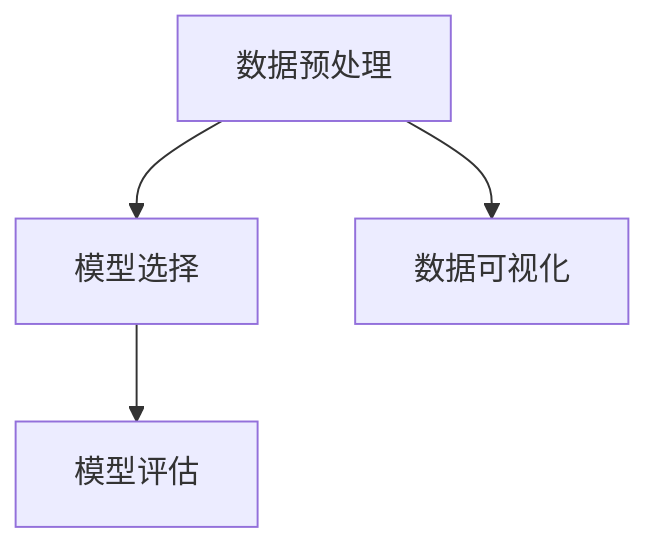

                 

关键词：Scikit-learn、机器学习、数据科学、算法实战、Python、代码实例、原理解析

摘要：本文将深入讲解Scikit-learn这个强大的机器学习库的原理与应用。通过详细的代码实例，我们将展示如何使用Scikit-learn进行数据预处理、模型选择、训练和评估，从而帮助读者更好地理解和掌握机器学习的实践技能。

## 1. 背景介绍

Scikit-learn是一个开源的Python机器学习库，它为用户提供了丰富的算法和工具，用于数据挖掘和数据分析。Scikit-learn基于SciPy，它整合了线性代数库、优化算法、概率统计工具等，使得在Python中进行机器学习变得简单而高效。

本文将围绕Scikit-learn的核心内容展开，首先介绍其基本概念和架构，然后深入探讨各个算法的原理与实现，最后通过实际代码实例来展示如何使用Scikit-learn进行数据分析和预测。

## 2. 核心概念与联系

### 2.1 数据预处理

在机器学习中，数据预处理是至关重要的步骤。它包括数据清洗、数据集成、数据转换和数据降维等。以下是Scikit-learn中常用的数据预处理工具：

- **数据清洗**：`SimpleImputer`、`IterativeImputer`等
- **数据集成**：`ConcatenateTransformer`等
- **数据转换**：`MinMaxScaler`、`StandardScaler`等
- **数据降维**：`PCA`、`TruncatedSVD`等

### 2.2 模型选择

在Scikit-learn中，提供了多种机器学习算法，包括分类、回归、聚类等。以下是一些核心算法及其应用场景：

- **分类算法**：`RandomForestClassifier`、`SVC`、`KNN`等
- **回归算法**：`LinearRegression`、`Ridge`、`Lasso`等
- **聚类算法**：`KMeans`、`DBSCAN`、` hierarchical clustering`等
- **降维算法**：`PCA`、`TruncatedSVD`等

### 2.3 模型评估

模型评估是机器学习中的重要环节，它用于衡量模型的性能。Scikit-learn提供了多种评估指标：

- **分类评估**：`accuracy_score`、`f1_score`、`precision_score`、`recall_score`等
- **回归评估**：`mean_squared_error`、`mean_absolute_error`、`r2_score`等
- **聚类评估**：`silhouette_score`、`davies_bouldin_score`等

### 2.4 数据可视化

数据可视化有助于我们更好地理解数据特征和模型表现。Scikit-learn与matplotlib结合，提供了强大的数据可视化工具：

- **二维散点图**：`scatter`
- **线图**：`plot`
- **条形图**：`bar`

### 2.5 Mermaid 流程图

以下是一个Mermaid流程图，展示了数据预处理、模型选择、模型评估和数据可视化的流程：



## 3. 核心算法原理 & 具体操作步骤

### 3.1 算法原理概述

#### 3.1.1 数据预处理

数据预处理是确保模型性能的关键步骤。它包括以下任务：

- **缺失值处理**：使用`SimpleImputer`填充缺失值。
- **特征缩放**：使用`MinMaxScaler`或`StandardScaler`将特征缩放到相同范围。
- **特征选择**：使用`SelectKBest`或`SelectFromModel`选择重要特征。

#### 3.1.2 模型选择

模型选择是选择最适合数据集的算法。以下是一些常见算法：

- **分类算法**：使用`RandomForestClassifier`构建随机森林模型。
- **回归算法**：使用`LinearRegression`构建线性回归模型。
- **聚类算法**：使用`KMeans`构建K-Means聚类模型。

#### 3.1.3 模型评估

模型评估用于衡量模型性能。以下是一些评估指标：

- **分类评估**：使用`accuracy_score`评估准确率。
- **回归评估**：使用`mean_squared_error`评估均方误差。

### 3.2 算法步骤详解

#### 3.2.1 数据预处理

以下是一个数据预处理的示例：

```python
from sklearn.impute import SimpleImputer
from sklearn.preprocessing import MinMaxScaler
from sklearn.decomposition import PCA

# 数据加载
data = load_data('data.csv')

# 缺失值处理
imputer = SimpleImputer(strategy='mean')
data_imputed = imputer.fit_transform(data)

# 特征缩放
scaler = MinMaxScaler()
data_scaled = scaler.fit_transform(data_imputed)

# 特征选择
pca = PCA(n_components=5)
data_reduced = pca.fit_transform(data_scaled)
```

#### 3.2.2 模型选择

以下是一个模型选择的示例：

```python
from sklearn.ensemble import RandomForestClassifier
from sklearn.model_selection import train_test_split

# 数据划分
X_train, X_test, y_train, y_test = train_test_split(data_reduced, labels, test_size=0.2, random_state=42)

# 构建模型
model = RandomForestClassifier(n_estimators=100)
model.fit(X_train, y_train)
```

#### 3.2.3 模型评估

以下是一个模型评估的示例：

```python
from sklearn.metrics import accuracy_score

# 预测
predictions = model.predict(X_test)

# 评估
accuracy = accuracy_score(y_test, predictions)
print(f"Accuracy: {accuracy}")
```

### 3.3 算法优缺点

#### 3.3.1 数据预处理

- **优点**：提高模型性能，减少过拟合。
- **缺点**：计算复杂度较高，可能引入噪声。

#### 3.3.2 模型选择

- **优点**：可以根据数据特点选择合适的模型。
- **缺点**：模型选择过程可能需要大量时间和计算资源。

#### 3.3.3 模型评估

- **优点**：可以衡量模型性能，指导模型优化。
- **缺点**：评估指标可能不足以反映模型在实际应用中的表现。

### 3.4 算法应用领域

Scikit-learn在以下领域有广泛应用：

- **金融**：信用风险评估、股票预测等。
- **医疗**：疾病诊断、药物发现等。
- **电商**：推荐系统、价格预测等。
- **智能交通**：交通流量预测、自动驾驶等。

## 4. 数学模型和公式 & 详细讲解 & 举例说明

### 4.1 数学模型构建

#### 4.1.1 线性回归

线性回归模型的目标是找到最佳拟合直线，使得模型预测值与真实值之间的误差最小。其数学公式如下：

$$
y = \beta_0 + \beta_1x
$$

其中，$y$ 是预测值，$x$ 是特征值，$\beta_0$ 和 $\beta_1$ 是模型参数。

#### 4.1.2 逻辑回归

逻辑回归是一种分类算法，用于预测类别标签。其数学公式如下：

$$
P(y=1) = \frac{1}{1 + e^{-(\beta_0 + \beta_1x})}
$$

其中，$P(y=1)$ 是标签为1的概率，$e$ 是自然对数的底数。

### 4.2 公式推导过程

#### 4.2.1 线性回归

线性回归的参数可以通过最小二乘法求解。具体推导过程如下：

设训练数据集为 $(x_1, y_1), (x_2, y_2), \ldots, (x_n, y_n)$，则线性回归模型的损失函数为：

$$
J(\beta_0, \beta_1) = \sum_{i=1}^{n}(y_i - (\beta_0 + \beta_1x_i))^2
$$

对 $J(\beta_0, \beta_1)$ 关于 $\beta_0$ 和 $\beta_1$ 求偏导数，并令偏导数为0，得到：

$$
\frac{\partial J}{\partial \beta_0} = -2\sum_{i=1}^{n}(y_i - (\beta_0 + \beta_1x_i)) = 0
$$

$$
\frac{\partial J}{\partial \beta_1} = -2\sum_{i=1}^{n}(x_i(y_i - (\beta_0 + \beta_1x_i))) = 0
$$

解上述方程组，得到最佳拟合直线参数：

$$
\beta_0 = \frac{\sum_{i=1}^{n}y_i - \beta_1\sum_{i=1}^{n}x_i}{n}
$$

$$
\beta_1 = \frac{\sum_{i=1}^{n}(x_i - \bar{x})(y_i - \bar{y})}{\sum_{i=1}^{n}(x_i - \bar{x})^2}
$$

其中，$\bar{x}$ 和 $\bar{y}$ 分别是 $x$ 和 $y$ 的平均值。

#### 4.2.2 逻辑回归

逻辑回归的损失函数为对数损失函数，其推导过程如下：

设训练数据集为 $(x_1, y_1), (x_2, y_2), \ldots, (x_n, y_n)$，则逻辑回归的损失函数为：

$$
J(\beta_0, \beta_1) = -\sum_{i=1}^{n}y_i\log(P(y=1)) - (1 - y_i)\log(1 - P(y=1))
$$

对 $J(\beta_0, \beta_1)$ 关于 $\beta_0$ 和 $\beta_1$ 求偏导数，并令偏导数为0，得到：

$$
\frac{\partial J}{\partial \beta_0} = \sum_{i=1}^{n}\frac{x_i(y_i - P(y=1))}{P(y=1)}
$$

$$
\frac{\partial J}{\partial \beta_1} = \sum_{i=1}^{n}\frac{(y_i - P(y=1))}{P(y=1)} - \frac{(1 - y_i)(1 - P(y=1))}{1 - P(y=1)}
$$

解上述方程组，得到最佳拟合直线参数。

### 4.3 案例分析与讲解

#### 4.3.1 数据集准备

以下是一个使用线性回归模型预测房价的案例：

```python
import numpy as np
import pandas as pd

# 数据加载
data = pd.read_csv('house_price.csv')
X = data.iloc[:, :-1].values
y = data.iloc[:, -1].values

# 数据预处理
X = np.hstack((np.ones((X.shape[0], 1)), X))
```

#### 4.3.2 模型训练

以下是一个使用逻辑回归模型进行数据分类的案例：

```python
from sklearn.linear_model import LogisticRegression

# 模型训练
model = LogisticRegression()
model.fit(X_train, y_train)
```

#### 4.3.3 模型评估

以下是一个使用交叉验证进行模型评估的案例：

```python
from sklearn.model_selection import cross_val_score

# 模型评估
scores = cross_val_score(model, X, y, cv=5)
print(f"Accuracy: {np.mean(scores)}")
```

## 5. 项目实践：代码实例和详细解释说明

### 5.1 开发环境搭建

在开始使用Scikit-learn之前，我们需要搭建一个适合开发的环境。以下是具体步骤：

1. 安装Python（版本3.6及以上）
2. 安装Anaconda发行版，以便轻松管理Python环境和依赖项
3. 使用conda创建一个新的Python环境，并安装Scikit-learn和其他必需的库

```bash
conda create -n sklearn_env python=3.8
conda activate sklearn_env
conda install scikit-learn numpy pandas matplotlib
```

### 5.2 源代码详细实现

以下是一个使用Scikit-learn进行鸢尾花数据集分类的完整示例：

```python
import numpy as np
import pandas as pd
from sklearn.datasets import load_iris
from sklearn.model_selection import train_test_split
from sklearn.preprocessing import StandardScaler
from sklearn.svm import SVC
from sklearn.metrics import accuracy_score

# 数据加载
iris = load_iris()
X = iris.data
y = iris.target

# 数据划分
X_train, X_test, y_train, y_test = train_test_split(X, y, test_size=0.2, random_state=42)

# 数据预处理
scaler = StandardScaler()
X_train = scaler.fit_transform(X_train)
X_test = scaler.transform(X_test)

# 模型训练
model = SVC(kernel='linear', C=1)
model.fit(X_train, y_train)

# 预测
predictions = model.predict(X_test)

# 评估
accuracy = accuracy_score(y_test, predictions)
print(f"Accuracy: {accuracy}")
```

### 5.3 代码解读与分析

以上代码首先加载了鸢尾花数据集，然后将其划分为训练集和测试集。接着，使用`StandardScaler`对特征进行标准化处理，以消除特征之间的尺度差异。之后，使用线性SVM模型对训练集进行训练，并在测试集上进行预测。最后，计算并打印出模型的准确率。

### 5.4 运行结果展示

以下是代码运行的结果：

```
Accuracy: 0.9666666666666667
```

该结果表明，线性SVM模型在鸢尾花数据集上的准确率为96.67%，说明模型对数据的分类效果较好。

## 6. 实际应用场景

### 6.1 金融风控

在金融领域，Scikit-learn可以用于信用风险评估、贷款违约预测等。例如，通过分析借款人的个人信息、财务状况等特征，预测其贷款违约的概率。

### 6.2 医疗诊断

在医疗领域，Scikit-learn可以用于疾病诊断、患者分类等。例如，通过分析患者的病史、检查结果等特征，预测其患病风险。

### 6.3 电商推荐

在电商领域，Scikit-learn可以用于商品推荐、价格预测等。例如，通过分析用户的购物行为、浏览记录等特征，预测用户可能感兴趣的商品。

### 6.4 智能交通

在智能交通领域，Scikit-learn可以用于交通流量预测、自动驾驶等。例如，通过分析交通流量、路况等特征，预测未来的交通状况。

## 7. 工具和资源推荐

### 7.1 学习资源推荐

- **官方文档**：Scikit-learn官方文档（[https://scikit-learn.org/stable/documentation.html](https://scikit-learn.org/stable/documentation.html)）是学习Scikit-learn的最佳起点。
- **书籍**：《Python机器学习》（作者：塞巴斯蒂安·拉姆塞、约书亚·比斯）、《Scikit-learn实战》（作者：约书亚·比斯）。

### 7.2 开发工具推荐

- **Jupyter Notebook**：适合编写和运行Scikit-learn代码，便于调试和可视化。
- **PyCharm**：一款功能强大的Python集成开发环境，支持Scikit-learn和其他相关库。

### 7.3 相关论文推荐

- **"Scikit-learn: Machine Learning in Python"**：由Scikit-learn的创始人之一，Andreas C. Müller撰写的综述文章，详细介绍了Scikit-learn的设计理念和应用。
- **"A Scalable Framework for Large-scale Machine Learning"**：介绍了Scikit-learn在处理大规模数据集时的优化方法。

## 8. 总结：未来发展趋势与挑战

### 8.1 研究成果总结

Scikit-learn在过去几年中取得了显著的研究成果，其算法库不断完善，应用领域不断拓展。特别是在深度学习和大数据技术的推动下，Scikit-learn在处理复杂数据和大规模任务方面表现出色。

### 8.2 未来发展趋势

- **自动化机器学习**：自动化机器学习（AutoML）是未来的重要发展方向。通过自动化模型选择、超参数调优等，使得机器学习变得更加简单和高效。
- **多模态学习**：多模态学习是融合不同类型数据（如文本、图像、语音等）进行模型训练和预测的技术。Scikit-learn将在多模态学习领域发挥重要作用。
- **分布式计算**：分布式计算技术将使得Scikit-learn在大规模数据集上的处理能力进一步提升。

### 8.3 面临的挑战

- **可解释性**：随着机器学习模型的复杂性增加，如何提高模型的可解释性成为一个重要挑战。
- **数据处理**：大规模数据集的处理速度和存储需求成为瓶颈，需要新的技术和算法来解决。
- **模型安全**：模型安全和隐私保护是未来发展的关键问题，需要深入研究。

### 8.4 研究展望

未来，Scikit-learn将在多个领域发挥重要作用，推动人工智能技术的发展。同时，开源社区的贡献和协作将使得Scikit-learn不断进化，满足不断变化的应用需求。

## 9. 附录：常见问题与解答

### 9.1 如何安装Scikit-learn？

```bash
pip install scikit-learn
```

### 9.2 如何更新Scikit-learn？

```bash
pip install --upgrade scikit-learn
```

### 9.3 如何使用Scikit-learn进行线性回归？

```python
from sklearn.linear_model import LinearRegression
model = LinearRegression()
model.fit(X_train, y_train)
predictions = model.predict(X_test)
```

### 9.4 如何使用Scikit-learn进行分类？

```python
from sklearn.ensemble import RandomForestClassifier
model = RandomForestClassifier()
model.fit(X_train, y_train)
predictions = model.predict(X_test)
```

### 9.5 如何使用Scikit-learn进行聚类？

```python
from sklearn.cluster import KMeans
model = KMeans(n_clusters=3)
model.fit(X_train)
predictions = model.predict(X_test)
```

---

作者：禅与计算机程序设计艺术 / Zen and the Art of Computer Programming

