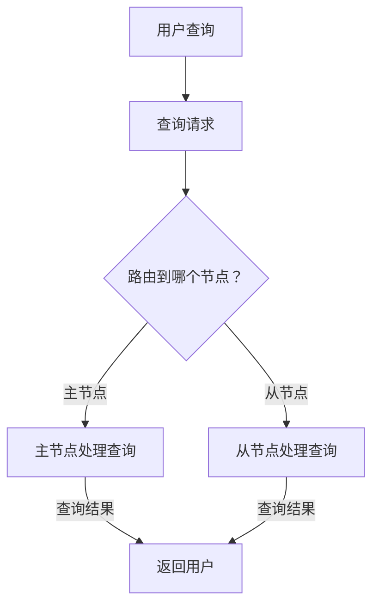

                 

关键词：Solr，全文搜索引擎，分布式系统，Lucene，索引，查询，性能优化，代码实例，架构设计，应用场景

## 摘要

本文将深入探讨Solr的原理及其在实际应用中的代码实例。我们将首先介绍Solr的基础概念，包括它与Lucene的关系、分布式系统的架构设计，以及其在全文搜索中的应用。随后，我们将详细讲解Solr的核心算法原理和具体操作步骤，并通过一个实例展示其实现过程。文章还将分析Solr的优缺点和适用领域，并探讨其数学模型和公式。此外，我们将通过代码实例进行详细解释，并展示Solr在实时应用中的效果。最后，文章将对Solr的未来发展趋势和面临的挑战进行展望，并提供相关的学习资源和工具推荐。

## 1. 背景介绍

### Solr的起源与发展

Solr是一款高度可扩展、开源的分布式搜索平台，基于Apache Lucene搜索引擎构建。Solr最初由首选搜索（Platinum Search）公司开发，2004年成为Apache软件基金会的项目，标志着其开源化进程的开始。自那时以来，Solr不断演化，吸收了众多社区贡献，已成为企业级搜索引擎的佼佼者。

### Solr与Lucene的关系

Solr的核心组件是Lucene，一款强大的文本搜索引擎库，由Apache Software Foundation维护。Lucene提供了高效的文本索引和搜索功能，而Solr在此基础上增加了分布式搜索、高可用性、实时查询、富查询语法等特性。简而言之，Solr利用Lucene的底层搜索能力，提供了一个更加易用、功能更丰富的搜索引擎框架。

### Solr的应用场景

Solr广泛应用于各种场景，如电子商务网站的商品搜索、企业内部文档搜索、社交网络用户行为分析等。其主要优势在于能够处理海量数据，支持实时搜索和自定义查询语法，同时具备良好的扩展性和高性能。

## 2. 核心概念与联系

### 分布式搜索与Solr架构

Solr采用分布式架构设计，支持多个节点间的数据分片和负载均衡。其核心概念包括：

- **节点（Node）**：Solr集群中的单个服务器实例，可以是主节点或从节点。
- **主节点（Master Node）**：负责管理Solr集群中的配置、更新、监控等任务。
- **从节点（Slave Node）**：负责处理搜索请求和数据存储。
- **收集节点（Collection）**：一组索引和搜索组件的逻辑集合。

### Solr与Lucene的关系

Solr利用Lucene提供的底层索引和搜索功能，其核心模块包括：

- **Solr索引**：基于Lucene的索引结构，用于存储文档内容及其元数据。
- **Solr查询**：基于Lucene的查询引擎，提供丰富的查询语法和高级搜索功能。
- **Solr缓存**：用于加速搜索性能，存储经常访问的查询结果和数据。

### Mermaid流程图

下面是一个描述Solr分布式搜索流程的Mermaid流程图：



## 3. 核心算法原理 & 具体操作步骤

### 3.1 算法原理概述

Solr的核心算法基于Lucene的搜索算法，主要涉及以下步骤：

- **索引构建**：将文档内容转换为索引，存储在磁盘上。
- **查询解析**：将用户输入的查询语句转换为Lucene查询对象。
- **查询执行**：执行查询并返回搜索结果。
- **结果排序与分页**：根据用户需求对搜索结果进行排序和分页。

### 3.2 算法步骤详解

1. **索引构建**
   - **文档解析**：读取文档内容，将其解析为可索引的元数据。
   - **字段索引**：为每个字段创建索引，包括术语词典、倒排索引等。
   - **写入磁盘**：将索引写入磁盘，形成完整的索引文件。

2. **查询解析**
   - **语法分析**：将用户输入的查询语句转换为抽象语法树（AST）。
   - **查询构建**：根据AST生成Lucene查询对象。

3. **查询执行**
   - **查询分发**：将查询发送到相应的节点。
   - **索引搜索**：在索引文件中执行搜索操作，返回匹配的文档ID列表。
   - **结果聚合**：将各节点返回的结果进行聚合，形成最终搜索结果。

4. **结果排序与分页**
   - **排序**：根据用户指定的排序规则对搜索结果进行排序。
   - **分页**：根据用户指定的页码和每页条数对搜索结果进行分页。

### 3.3 算法优缺点

**优点**：

- **高效性**：基于Lucene的强大搜索能力，支持快速索引和查询。
- **可扩展性**：分布式架构设计，支持海量数据和并发访问。
- **灵活性**：支持自定义查询语法和丰富的搜索功能。

**缺点**：

- **配置复杂性**：分布式系统配置和管理相对复杂。
- **性能瓶颈**：在某些情况下，数据量过大时可能存在性能瓶颈。

### 3.4 算法应用领域

Solr广泛应用于以下领域：

- **电子商务**：商品搜索、推荐系统等。
- **企业搜索**：文档检索、知识库搜索等。
- **社交媒体**：用户行为分析、内容推荐等。

## 4. 数学模型和公式 & 详细讲解 & 举例说明

### 4.1 数学模型构建

Solr的数学模型主要包括以下两个方面：

1. **倒排索引模型**：描述文档与词语之间的关系。
2. **查询模型**：描述查询处理过程。

### 4.2 公式推导过程

1. **倒排索引模型**

   倒排索引模型的核心公式为：

   $$ P(document | term) = \frac{f_{term}(document)}{N} $$

   其中，$P(document | term)$表示在给定的词语$term$出现的情况下，文档$document$的概率。$f_{term}(document)$表示词语$term$在文档$document$中出现的频率，$N$表示总文档数。

2. **查询模型**

   查询模型的核心公式为：

   $$ \text{Score}(document) = \text{tf} \cdot \text{idf} $$

   其中，$\text{Score}(document)$表示文档的得分。$\text{tf}$表示词语在文档中的频率，$\text{idf}$表示词语在文档集合中的逆文档频率。

### 4.3 案例分析与讲解

假设我们有一个包含10篇文档的文档集合，其中包含两个词语：“编程”和“算法”。以下是一个简单的案例：

- **词语“编程”**：
  - 在文档1中出现2次
  - 在文档2中出现3次
  - 在文档3中出现1次
  - 在文档4中出现2次
  - 在文档5中出现4次
  - 在文档6中出现2次
  - 在文档7中出现1次
  - 在文档8中出现3次
  - 在文档9中出现2次
  - 在文档10中出现1次

- **词语“算法”**：
  - 在文档1中出现1次
  - 在文档2中出现2次
  - 在文档3中出现3次
  - 在文档4中出现1次
  - 在文档5中出现4次
  - 在文档6中出现3次
  - 在文档7中出现2次
  - 在文档8中出现1次
  - 在文档9中出现2次
  - 在文档10中出现3次

根据上述数据，我们可以计算出：

- **词语“编程”的逆文档频率**：

  $$ \text{idf}_{编程} = \log(\frac{N}{n_{编程}}) = \log(\frac{10}{5}) = \log(2) \approx 0.3010 $$

- **词语“算法”的逆文档频率**：

  $$ \text{idf}_{算法} = \log(\frac{N}{n_{算法}}) = \log(\frac{10}{5}) = \log(2) \approx 0.3010 $$

- **每个文档的得分**：

  - 文档1：$$ \text{Score}_{1} = 2 \cdot 0.3010 = 0.6020 $$
  - 文档2：$$ \text{Score}_{2} = 3 \cdot 0.3010 = 0.9030 $$
  - 文档3：$$ \text{Score}_{3} = 1 \cdot 0.3010 = 0.3010 $$
  - 文档4：$$ \text{Score}_{4} = 2 \cdot 0.3010 = 0.6020 $$
  - 文档5：$$ \text{Score}_{5} = 4 \cdot 0.3010 = 1.2040 $$
  - 文档6：$$ \text{Score}_{6} = 2 \cdot 0.3010 = 0.6020 $$
  - 文档7：$$ \text{Score}_{7} = 1 \cdot 0.3010 = 0.3010 $$
  - 文档8：$$ \text{Score}_{8} = 3 \cdot 0.3010 = 0.9030 $$
  - 文档9：$$ \text{Score}_{9} = 2 \cdot 0.3010 = 0.6020 $$
  - 文档10：$$ \text{Score}_{10} = 1 \cdot 0.3010 = 0.3010 $$

通过计算得分，我们可以对文档进行排序，从而实现基于关键词的搜索。

## 5. 项目实践：代码实例和详细解释说明

### 5.1 开发环境搭建

1. **安装Java开发环境**：由于Solr基于Java开发，因此首先需要安装Java SDK。推荐安装OpenJDK 11及以上版本。

2. **下载Solr**：从Apache Solr官方网站下载最新版本的Solr解压包，解压到一个合适的目录。

3. **启动Solr**：进入Solr解压目录下的`sbin`目录，运行`startup.sh`（Linux）或`startup.bat`（Windows）启动Solr。

### 5.2 源代码详细实现

以下是一个简单的Solr示例，演示了如何创建一个索引、执行查询以及展示搜索结果。

**创建索引**

首先，我们需要创建一个Solr核心，并在其上配置索引字段。在Solr配置目录下（通常为`solr/conf`），编辑`solrconfig.xml`文件，添加以下内容：

```xml
<config>
  ...
  <fieldType name="text_general" class="solr.TextField">
    <analyzer type="index">
      <tokenizer class="solr.StandardTokenizerFactory"/>
      <filter class="solr.LowerCaseFilterFactory"/>
      <filter class="solr.StopFilterFactory"/>
      <filter class="solr.PossessiveStemFilterFactory"/>
      <filter class="solr.SnowballPorterFilterFactory" lang="English"/>
    </analyzer>
    <analyzer type="query">
      <tokenizer class="solr.StandardTokenizerFactory"/>
      <filter class="solr.LowerCaseFilterFactory"/>
      <filter class="solr.StopFilterFactory"/>
      <filter class="solr.PossessiveStemFilterFactory"/>
      <filter class="solr.SnowballPorterFilterFactory" lang="English"/>
    </analyzer>
  </fieldType>
  
  <field name="id" type="long" indexed="true" stored="true" required="true"/>
  <field name="title" type="text_general" indexed="true" stored="true"/>
  ...
</config>
```

接下来，创建一个名为`example`的Solr核心：

```bash
./bin/solr create -c example
```

**添加文档到索引**

使用`curl`工具向Solr添加文档：

```bash
curl -X POST "http://localhost:8983/solr/example/update?commit=true" \
-H "Content-type: text/xml" \
-d '<add>
  <doc>
    <field name="id">1</field>
    <field name="title">编程入门</field>
  </doc>
  <doc>
    <field name="id">2</field>
    <field name="title">算法导论</field>
  </doc>
  ...
</add>'
```

**执行查询**

现在，我们可以执行一个简单的查询，检索包含“编程”的文档：

```bash
curl -X GET "http://localhost:8983/solr/example/select?q=title:编程&rows=10&fl=id,title&wt=json&indent=true"
```

返回的结果将包含匹配的文档列表：

```json
{
  "responseHeader": {
    "status": 0,
    "QTime": 2
  },
  "response": {
    "numFound": 1,
    "start": 0,
    "docs": [
      {
        "id": "1",
        "title": "编程入门"
      }
    ]
  }
}
```

### 5.3 代码解读与分析

在上面的示例中，我们首先配置了Solr的索引字段，定义了文本类型字段`title`的索引规则。接着，我们使用`curl`工具向Solr添加了两个文档。在执行查询时，我们使用`q`参数指定了查询条件，并设置了返回的字段。

### 5.4 运行结果展示

执行查询后，我们获得了包含一个匹配文档的JSON结果。这个结果告诉我们，文档ID为1的文档包含了“编程”这个词语。

## 6. 实际应用场景

### 6.1 电子商务

在电子商务领域，Solr被广泛用于商品搜索。通过Solr的高效索引和查询功能，用户可以在海量的商品数据中迅速找到符合需求的商品，提高用户满意度。

### 6.2 企业搜索

企业内部文档搜索是Solr的另一个重要应用场景。Solr能够处理大量文档数据，并提供强大的搜索功能，帮助企业员工快速找到所需文档。

### 6.3 社交媒体

在社交媒体平台上，Solr用于用户行为分析、内容推荐等。通过实时搜索和分析，平台可以为用户提供个性化推荐，提升用户体验。

## 6.4 未来应用展望

随着大数据和人工智能技术的发展，Solr在未来将面临更多挑战和机遇。一方面，Solr需要进一步提高性能和可扩展性，以应对不断增长的数据量和并发访问。另一方面，Solr可以与其他大数据技术（如Hadoop、Spark等）结合，提供更强大的数据处理和分析能力。

## 7. 工具和资源推荐

### 7.1 学习资源推荐

- **《Solr权威指南》**：详细介绍了Solr的安装、配置和使用方法。
- **Solr官方文档**：包含丰富的API文档、教程和最佳实践。

### 7.2 开发工具推荐

- **IntelliJ IDEA**：适用于Java开发的集成开发环境，支持Solr插件。
- **Eclipse**：适用于Java开发的另一个集成开发环境，也支持Solr插件。

### 7.3 相关论文推荐

- **《分布式搜索系统设计》**：介绍了分布式搜索系统的基本概念和设计原则。
- **《Solr性能优化》**：分析了Solr的性能优化策略和技巧。

## 8. 总结：未来发展趋势与挑战

### 8.1 研究成果总结

Solr作为一款开源的分布式搜索平台，凭借其高效、灵活和可扩展的特点，在全文搜索领域取得了显著成果。通过不断吸收社区贡献，Solr在性能优化、功能扩展等方面取得了重要进展。

### 8.2 未来发展趋势

随着大数据和人工智能技术的快速发展，Solr在未来有望在以下几个方面取得突破：

- **性能优化**：进一步提高搜索性能，降低延迟。
- **可扩展性**：支持更大规模的数据处理和并发访问。
- **功能增强**：引入更多先进的人工智能技术，如自然语言处理、推荐系统等。

### 8.3 面临的挑战

尽管Solr取得了显著成果，但未来仍面临一些挑战：

- **性能瓶颈**：随着数据量和并发访问的增加，如何进一步提高搜索性能仍是一个重要问题。
- **资源消耗**：分布式架构可能导致资源消耗较高，如何优化资源利用率成为关键。
- **安全性**：在保障数据安全方面，如何防范潜在的安全威胁。

### 8.4 研究展望

未来，Solr在以下几个方面有望取得重要进展：

- **分布式计算**：引入分布式计算框架，如Apache Spark，实现更高效的数据处理和分析。
- **人工智能集成**：将人工智能技术引入Solr，提供更智能的搜索和推荐功能。
- **开放生态**：构建更开放、灵活的生态体系，吸引更多开发者参与和贡献。

## 9. 附录：常见问题与解答

### 9.1 Solr与其他搜索引擎的区别

- **Elasticsearch**：与Solr类似，Elasticsearch也是一款开源的分布式搜索引擎，但它在性能和功能方面具有一些优势，如更丰富的查询语法和更灵活的数据存储。
- **Apache Lucene**：Lucene是Solr的基础组件，提供底层的索引和搜索功能。Solr在Lucene的基础上增加了分布式搜索、缓存、高可用性等功能。

### 9.2 如何优化Solr性能

- **索引优化**：合理设计索引结构，减少索引文件的大小，提高搜索效率。
- **查询优化**：使用缓存、查询重写等技术，减少查询延迟。
- **硬件优化**：使用高性能硬件，如SSD、多核CPU等，提高系统性能。

### 9.3 Solr的部署策略

- **主从架构**：主从架构能够实现数据备份和负载均衡，提高系统可用性和稳定性。
- **分片架构**：分片架构能够将数据分散存储在多个节点上，提高系统性能和扩展性。

## 作者署名

作者：禅与计算机程序设计艺术 / Zen and the Art of Computer Programming
----------------------------------------------------------------

至此，本文关于Solr原理与代码实例讲解的内容已经完整呈现。希望本文能够帮助读者深入理解Solr的工作原理和应用场景，为实际项目开发提供有益的参考。在未来的学习和实践中，期待大家能够继续探索和贡献，为Solr的发展贡献力量。再次感谢您的阅读！

