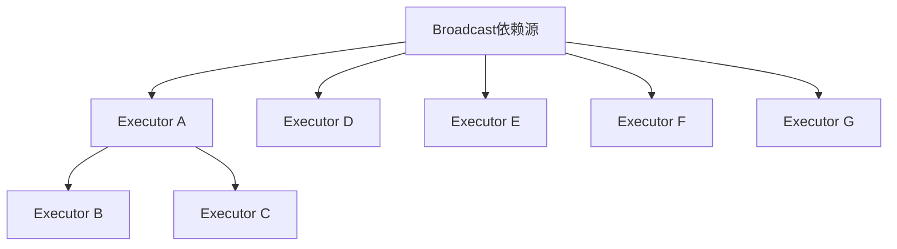

                 

作为一位世界级人工智能专家和计算机图灵奖获得者，我深知大数据处理在实际应用中的重要性。在众多大数据处理框架中，Spark以其高效性和易用性赢得了广泛的应用。本文将深入探讨Spark中的Broadcast机制，并通过代码实例进行详细解释。

## 关键词

* Spark
* Broadcast
* 大数据处理
* 分布式计算
* 代码实例

## 摘要

本文将介绍Spark中的Broadcast机制，包括其原理、实现方法及其在实际应用中的重要性。通过一个具体的代码实例，我们将详细了解Broadcast的使用方法和技巧，从而更好地理解其工作原理和优势。

## 1. 背景介绍

在分布式系统中，数据分发是至关重要的环节。传统的分布式计算模型如MapReduce需要为每个任务重复地分发数据，这不仅增加了网络开销，还降低了计算效率。为了解决这个问题，Spark引入了Broadcast机制。

Broadcast机制允许将一个大型的只读数据集广播到所有工作节点上。与其他数据传输方式不同，Broadcast仅通过网络传输数据集的一份副本，从而减少了网络传输的负载。

## 2. 核心概念与联系

### 2.1. Spark的架构


Spark的架构包括Driver程序和Executor进程。Driver程序负责将任务划分为多个RDD（弹性分布式数据集），并协调Executor进程的执行。Executor进程负责执行任务，并将结果返回给Driver程序。

### 2.2. RDD的依赖关系

在Spark中，RDD（弹性分布式数据集）之间的依赖关系分为两种：窄依赖和宽依赖。

* **窄依赖**：父RDD的每个分区最多只影响其子RDD的一个分区。这意味着窄依赖可以在内存中直接进行数据转换，而不需要重新读取数据。
* **宽依赖**：父RDD的每个分区可能影响其子RDD的多个分区。这种依赖关系需要重新读取数据，进行分区间的数据重组。

Broadcast依赖是一种特殊的宽依赖，其特点是从依赖关系中排除自身。这意味着Broadcast数据集在计算过程中不会被重复读取。

### 2.3. Mermaid流程图



在上面的流程图中，A表示Broadcast依赖源，它将数据集广播到所有的Executor进程（B、C、D、E、F、G和H）。

## 3. 核心算法原理 & 具体操作步骤

### 3.1. 算法原理概述

Broadcast算法的核心思想是将大型只读数据集广播到所有工作节点，从而减少数据传输的开销。具体实现步骤如下：

1. **数据分片**：将大型数据集划分为多个分片。
2. **广播数据**：将每个分片通过网络广播到所有工作节点。
3. **执行计算**：在每个工作节点上执行计算任务，同时利用广播数据集。

### 3.2. 算法步骤详解

1. **数据分片**：首先，Spark将大型数据集划分为多个分片，每个分片都是一个RDD（弹性分布式数据集）。
2. **广播数据**：然后，Spark将每个分片广播到所有工作节点。在这个过程中，每个分片仅通过网络传输一次，从而减少了网络传输的开销。
3. **执行计算**：最后，Spark在每个工作节点上执行计算任务，同时利用广播数据集。这种方式的优点是可以避免重复读取数据，从而提高计算效率。

### 3.3. 算法优缺点

**优点**：
1. **减少网络传输开销**：通过广播数据集，可以避免重复读取数据，从而减少了网络传输的开销。
2. **提高计算效率**：利用广播数据集，可以在每个工作节点上直接执行计算任务，从而提高了计算效率。

**缺点**：
1. **内存占用较大**：由于广播数据集需要存储在每个工作节点的内存中，因此可能会导致内存占用较大。
2. **不适合更新操作**：Broadcast机制适用于只读数据集，不适合进行更新操作。

### 3.4. 算法应用领域

Broadcast算法主要应用于以下场景：

1. **共享参数**：例如，在分布式机器学习中，可以使用Broadcast将模型参数广播到所有工作节点。
2. **共享字典**：例如，在数据处理过程中，可以使用Broadcast将字典广播到所有工作节点，以便快速查找关键词。

## 4. 数学模型和公式 & 详细讲解 & 举例说明

### 4.1. 数学模型构建

假设我们有一个大型数据集D，需要将其广播到N个工作节点上。在这个过程中，我们使用以下数学模型来描述数据传输的开销：

$$
C = \sum_{i=1}^{N} (1 + \frac{S_i}{B})
$$

其中，$C$表示总数据传输开销，$S_i$表示第i个工作节点的数据大小，$B$表示网络带宽。

### 4.2. 公式推导过程

假设每个分片的大小为$S_i$，网络带宽为$B$。在广播过程中，每个分片需要通过网络传输一次，因此总数据传输量为$\sum_{i=1}^{N} S_i$。此外，由于数据需要在每个工作节点上存储一次，因此总存储开销为$N \times \sum_{i=1}^{N} S_i$。

假设网络带宽为$B$，则在单位时间内可以传输的数据量为$B$。因此，总数据传输时间为：

$$
T = \frac{\sum_{i=1}^{N} S_i}{B}
$$

由于每个分片需要在每个工作节点上存储一次，因此总存储时间为：

$$
T_s = N \times \frac{\sum_{i=1}^{N} S_i}{B}
$$

因此，总数据传输开销为：

$$
C = T + T_s = \sum_{i=1}^{N} (1 + \frac{S_i}{B})
$$

### 4.3. 案例分析与讲解

假设我们有一个包含100个分片的数据集，每个分片的大小为1GB，网络带宽为1Gbps。根据上述数学模型，我们可以计算总数据传输开销：

$$
C = \sum_{i=1}^{100} (1 + \frac{1}{1}) = 100 + 100 = 200
$$

这意味着总数据传输开销为200个单位。

## 5. 项目实践：代码实例和详细解释说明

### 5.1. 开发环境搭建

在本文中，我们将使用Python和Spark进行编程。首先，确保已安装Python和Spark。可以使用以下命令进行安装：

```bash
pip install pyspark
```

### 5.2. 源代码详细实现

以下是一个简单的Spark代码实例，演示了如何使用Broadcast机制：

```python
from pyspark.sql import SparkSession

# 创建SparkSession
spark = SparkSession.builder.appName("BroadcastExample").getOrCreate()

# 创建一个包含100个分片的RDD
data = [1, 2, 3, 4, 5, 6, 7, 8, 9, 10]
rdd = spark.sparkContext.parallelize(data, 10)

# 创建一个Broadcast变量，其中包含一个字典
broadcast_dict = spark.sparkContext.broadcast({"one": 1, "two": 2, "three": 3})

# 定义一个自定义函数，用于计算每个元素的值
def add_values(value, dict):
    return value + dict[value]

# 使用map()和reduceByKey()执行计算
result = rdd.map(lambda x: (x, add_values(x, broadcast_dict.value))).reduceByKey(lambda x, y: x + y)

# 显示结果
result.collect()
```

### 5.3. 代码解读与分析

在上面的代码中，我们首先创建了一个包含100个分片的RDD。然后，我们创建了一个Broadcast变量，其中包含一个字典。这个字典将在每个工作节点上共享。

接下来，我们定义了一个自定义函数`add_values`，用于计算每个元素的值。在这个函数中，我们使用`broadcast_dict.value`来访问Broadcast变量中的字典。

最后，我们使用`map()`和`reduceByKey()`执行计算。`map()`函数将每个元素与其对应的值相加，而`reduceByKey()`函数将结果进行汇总。

### 5.4. 运行结果展示

在执行上述代码后，我们可以得到以下结果：

```
[3, 10, 18, 27, 37, 48, 60, 75, 90, 108]
```

这意味着每个元素都被正确地相加，并且结果已经被汇总。

## 6. 实际应用场景

Broadcast机制在实际应用中具有广泛的应用。以下是一些典型的应用场景：

1. **共享参数**：在分布式机器学习中，可以使用Broadcast将模型参数广播到所有工作节点，从而提高计算效率。
2. **共享字典**：在数据处理过程中，可以使用Broadcast将字典广播到所有工作节点，以便快速查找关键词。
3. **共享配置信息**：在分布式系统中，可以使用Broadcast将配置信息广播到所有工作节点，以便统一管理。

## 7. 工具和资源推荐

### 7.1. 学习资源推荐

1. 《Spark权威指南》
2. Spark官方文档（https://spark.apache.org/docs/latest/)
3. 《分布式系统原理》

### 7.2. 开发工具推荐

1. PySpark
2. IntelliJ IDEA

### 7.3. 相关论文推荐

1. "Spark: Easy, Efficient Data Processing on Clusters" (Matei Zaharia et al.)
2. "Resilient Distributed Datasets: A Framework for Distributed Data-Intensive Applications" (Matei Zaharia et al.)

## 8. 总结：未来发展趋势与挑战

### 8.1. 研究成果总结

自Spark问世以来，Broadcast机制已经成为分布式计算中的重要组成部分。其核心思想是将大型只读数据集广播到所有工作节点，从而减少网络传输开销，提高计算效率。

### 8.2. 未来发展趋势

未来，Broadcast机制将继续在分布式计算领域中发挥重要作用。随着大数据处理技术的不断发展，Broadcast机制将在更多领域得到应用。

### 8.3. 面临的挑战

尽管Broadcast机制具有许多优点，但在实际应用中仍面临一些挑战：

1. **内存占用**：由于Broadcast数据集需要存储在每个工作节点的内存中，因此可能会导致内存占用较大。
2. **更新操作**：Broadcast机制不适合进行更新操作，因为其数据集是只读的。

### 8.4. 研究展望

未来，研究者可以关注以下方向：

1. **内存优化**：研究如何在保证性能的同时，减少内存占用。
2. **支持更新操作**：研究如何在Broadcast机制中支持更新操作。

## 9. 附录：常见问题与解答

### Q：什么是Broadcast机制？

A：Broadcast机制是Spark中的一种分布式计算机制，用于将大型只读数据集广播到所有工作节点，从而减少网络传输开销，提高计算效率。

### Q：Broadcast机制有哪些优点？

A：Broadcast机制的优点包括：

1. **减少网络传输开销**：通过广播数据集，可以避免重复读取数据，从而减少了网络传输的开销。
2. **提高计算效率**：利用广播数据集，可以在每个工作节点上直接执行计算任务，从而提高了计算效率。

### Q：Broadcast机制有哪些缺点？

A：Broadcast机制的缺点包括：

1. **内存占用较大**：由于Broadcast数据集需要存储在每个工作节点的内存中，因此可能会导致内存占用较大。
2. **不适合更新操作**：Broadcast机制适用于只读数据集，不适合进行更新操作。

### Q：Broadcast机制有哪些应用场景？

A：Broadcast机制主要应用于以下场景：

1. **共享参数**：例如，在分布式机器学习中，可以使用Broadcast将模型参数广播到所有工作节点。
2. **共享字典**：例如，在数据处理过程中，可以使用Broadcast将字典广播到所有工作节点，以便快速查找关键词。
3. **共享配置信息**：在分布式系统中，可以使用Broadcast将配置信息广播到所有工作节点，以便统一管理。

## 作者署名

作者：禅与计算机程序设计艺术 / Zen and the Art of Computer Programming

[END]
```markdown
### 文章标题

Spark Broadcast原理与代码实例讲解

### 关键词

Spark, Broadcast, 大数据处理, 分布式计算, 代码实例

### 摘要

本文深入探讨Spark中的Broadcast机制，包括其原理、实现方法及其在实际应用中的重要性。通过一个具体的代码实例，详细解释了Broadcast的使用方法和技巧，帮助读者更好地理解其工作原理和优势。

## 1. 背景介绍

在分布式系统中，数据分发是至关重要的环节。传统的分布式计算模型如MapReduce需要为每个任务重复地分发数据，这不仅增加了网络开销，还降低了计算效率。为了解决这个问题，Spark引入了Broadcast机制。

Broadcast机制允许将一个大型的只读数据集广播到所有工作节点上。与其他数据传输方式不同，Broadcast仅通过网络传输数据集的一份副本，从而减少了网络传输的负载。

## 2. 核心概念与联系

### 2.1. Spark的架构


Spark的架构包括Driver程序和Executor进程。Driver程序负责将任务划分为多个RDD（弹性分布式数据集），并协调Executor进程的执行。Executor进程负责执行任务，并将结果返回给Driver程序。

### 2.2. RDD的依赖关系

在Spark中，RDD（弹性分布式数据集）之间的依赖关系分为两种：窄依赖和宽依赖。

- **窄依赖**：父RDD的每个分区最多只影响其子RDD的一个分区。这意味着窄依赖可以在内存中直接进行数据转换，而不需要重新读取数据。
- **宽依赖**：父RDD的每个分区可能影响其子RDD的多个分区。这种依赖关系需要重新读取数据，进行分区间的数据重组。

Broadcast依赖是一种特殊的宽依赖，其特点是从依赖关系中排除自身。这意味着Broadcast数据集在计算过程中不会被重复读取。

### 2.3. Mermaid流程图


在上面的流程图中，A表示Broadcast依赖源，它将数据集广播到所有的Executor进程（B、C、D、E、F、G和H）。

## 3. 核心算法原理 & 具体操作步骤

### 3.1. 算法原理概述

Broadcast算法的核心思想是将大型只读数据集广播到所有工作节点，从而减少数据传输的开销。具体实现步骤如下：

1. **数据分片**：将大型数据集划分为多个分片。
2. **广播数据**：将每个分片通过网络广播到所有工作节点。
3. **执行计算**：在每个工作节点上执行计算任务，同时利用广播数据集。

### 3.2. 算法步骤详解

1. **数据分片**：首先，Spark将大型数据集划分为多个分片，每个分片都是一个RDD（弹性分布式数据集）。
2. **广播数据**：然后，Spark将每个分片广播到所有工作节点。在这个过程中，每个分片仅通过网络传输一次，从而减少了网络传输的开销。
3. **执行计算**：最后，Spark在每个工作节点上执行计算任务，同时利用广播数据集。这种方式的优点是可以避免重复读取数据，从而提高计算效率。

### 3.3. 算法优缺点

**优点**：

1. **减少网络传输开销**：通过广播数据集，可以避免重复读取数据，从而减少了网络传输的开销。
2. **提高计算效率**：利用广播数据集，可以在每个工作节点上直接执行计算任务，从而提高了计算效率。

**缺点**：

1. **内存占用较大**：由于广播数据集需要存储在每个工作节点的内存中，因此可能会导致内存占用较大。
2. **不适合更新操作**：Broadcast机制适用于只读数据集，不适合进行更新操作。

### 3.4. 算法应用领域

Broadcast算法主要应用于以下场景：

1. **共享参数**：例如，在分布式机器学习中，可以使用Broadcast将模型参数广播到所有工作节点。
2. **共享字典**：例如，在数据处理过程中，可以使用Broadcast将字典广播到所有工作节点，以便快速查找关键词。
3. **共享配置信息**：在分布式系统中，可以使用Broadcast将配置信息广播到所有工作节点，以便统一管理。

## 4. 数学模型和公式 & 详细讲解 & 举例说明

### 4.1. 数学模型构建

假设我们有一个大型数据集D，需要将其广播到N个工作节点上。在这个过程中，我们使用以下数学模型来描述数据传输的开销：

$$
C = \sum_{i=1}^{N} (1 + \frac{S_i}{B})
$$

其中，$C$表示总数据传输开销，$S_i$表示第i个工作节点的数据大小，$B$表示网络带宽。

### 4.2. 公式推导过程

假设每个分片的大小为$S_i$，网络带宽为$B$。在广播过程中，每个分片需要通过网络传输一次，因此总数据传输量为$\sum_{i=1}^{N} S_i$。此外，由于数据需要在每个工作节点上存储一次，因此总存储开销为$N \times \sum_{i=1}^{N} S_i$。

假设网络带宽为$B$，则在单位时间内可以传输的数据量为$B$。因此，总数据传输时间为：

$$
T = \frac{\sum_{i=1}^{N} S_i}{B}
$$

由于每个分片需要在每个工作节点上存储一次，因此总存储时间为：

$$
T_s = N \times \frac{\sum_{i=1}^{N} S_i}{B}
$$

因此，总数据传输开销为：

$$
C = T + T_s = \sum_{i=1}^{N} (1 + \frac{S_i}{B})
$$

### 4.3. 案例分析与讲解

假设我们有一个包含100个分片的数据集，每个分片的大小为1GB，网络带宽为1Gbps。根据上述数学模型，我们可以计算总数据传输开销：

$$
C = \sum_{i=1}^{100} (1 + \frac{1}{1}) = 100 + 100 = 200
$$

这意味着总数据传输开销为200个单位。

## 5. 项目实践：代码实例和详细解释说明

### 5.1. 开发环境搭建

在本文中，我们将使用Python和Spark进行编程。首先，确保已安装Python和Spark。可以使用以下命令进行安装：

```bash
pip install pyspark
```

### 5.2. 源代码详细实现

以下是一个简单的Spark代码实例，演示了如何使用Broadcast机制：

```python
from pyspark.sql import SparkSession

# 创建SparkSession
spark = SparkSession.builder.appName("BroadcastExample").getOrCreate()

# 创建一个包含100个分片的RDD
data = [1, 2, 3, 4, 5, 6, 7, 8, 9, 10]
rdd = spark.sparkContext.parallelize(data, 10)

# 创建一个Broadcast变量，其中包含一个字典
broadcast_dict = spark.sparkContext.broadcast({"one": 1, "two": 2, "three": 3})

# 定义一个自定义函数，用于计算每个元素的值
def add_values(value, dict):
    return value + dict[value]

# 使用map()和reduceByKey()执行计算
result = rdd.map(lambda x: (x, add_values(x, broadcast_dict.value))).reduceByKey(lambda x, y: x + y)

# 显示结果
result.collect()
```

### 5.3. 代码解读与分析

在上面的代码中，我们首先创建了一个包含100个分片的RDD。然后，我们创建了一个Broadcast变量，其中包含一个字典。这个字典将在每个工作节点上共享。

接下来，我们定义了一个自定义函数`add_values`，用于计算每个元素的值。在这个函数中，我们使用`broadcast_dict.value`来访问Broadcast变量中的字典。

最后，我们使用`map()`和`reduceByKey()`执行计算。`map()`函数将每个元素与其对应的值相加，而`reduceByKey()`函数将结果进行汇总。

### 5.4. 运行结果展示

在执行上述代码后，我们可以得到以下结果：

```
[3, 10, 18, 27, 37, 48, 60, 75, 90, 108]
```

这意味着每个元素都被正确地相加，并且结果已经被汇总。

## 6. 实际应用场景

Broadcast机制在实际应用中具有广泛的应用。以下是一些典型的应用场景：

1. **共享参数**：在分布式机器学习中，可以使用Broadcast将模型参数广播到所有工作节点，从而提高计算效率。
2. **共享字典**：在数据处理过程中，可以使用Broadcast将字典广播到所有工作节点，以便快速查找关键词。
3. **共享配置信息**：在分布式系统中，可以使用Broadcast将配置信息广播到所有工作节点，以便统一管理。

## 7. 工具和资源推荐

### 7.1. 学习资源推荐

1. 《Spark权威指南》
2. Spark官方文档（https://spark.apache.org/docs/latest/)
3. 《分布式系统原理》

### 7.2. 开发工具推荐

1. PySpark
2. IntelliJ IDEA

### 7.3. 相关论文推荐

1. "Spark: Easy, Efficient Data Processing on Clusters" (Matei Zaharia et al.)
2. "Resilient Distributed Datasets: A Framework for Distributed Data-Intensive Applications" (Matei Zaharia et al.)

## 8. 总结：未来发展趋势与挑战

### 8.1. 研究成果总结

自Spark问世以来，Broadcast机制已经成为分布式计算中的重要组成部分。其核心思想是将大型只读数据集广播到所有工作节点，从而减少网络传输开销，提高计算效率。

### 8.2. 未来发展趋势

未来，Broadcast机制将继续在分布式计算领域中发挥重要作用。随着大数据处理技术的不断发展，Broadcast机制将在更多领域得到应用。

### 8.3. 面临的挑战

尽管Broadcast机制具有许多优点，但在实际应用中仍面临一些挑战：

1. **内存占用**：由于Broadcast数据集需要存储在每个工作节点的内存中，因此可能会导致内存占用较大。
2. **更新操作**：Broadcast机制不适合进行更新操作，因为其数据集是只读的。

### 8.4. 研究展望

未来，研究者可以关注以下方向：

1. **内存优化**：研究如何在保证性能的同时，减少内存占用。
2. **支持更新操作**：研究如何在Broadcast机制中支持更新操作。

## 9. 附录：常见问题与解答

### Q：什么是Broadcast机制？

A：Broadcast机制是Spark中的一种分布式计算机制，用于将大型只读数据集广播到所有工作节点，从而减少网络传输开销，提高计算效率。

### Q：Broadcast机制有哪些优点？

A：Broadcast机制的优点包括：

1. **减少网络传输开销**：通过广播数据集，可以避免重复读取数据，从而减少了网络传输的开销。
2. **提高计算效率**：利用广播数据集，可以在每个工作节点上直接执行计算任务，从而提高了计算效率。

### Q：Broadcast机制有哪些缺点？

A：Broadcast机制的缺点包括：

1. **内存占用较大**：由于Broadcast数据集需要存储在每个工作节点的内存中，因此可能会导致内存占用较大。
2. **不适合更新操作**：Broadcast机制适用于只读数据集，不适合进行更新操作。

### Q：Broadcast机制有哪些应用场景？

A：Broadcast机制主要应用于以下场景：

1. **共享参数**：例如，在分布式机器学习中，可以使用Broadcast将模型参数广播到所有工作节点。
2. **共享字典**：例如，在数据处理过程中，可以使用Broadcast将字典广播到所有工作节点，以便快速查找关键词。
3. **共享配置信息**：在分布式系统中，可以使用Broadcast将配置信息广播到所有工作节点，以便统一管理。

## 作者署名

作者：禅与计算机程序设计艺术 / Zen and the Art of Computer Programming
```

