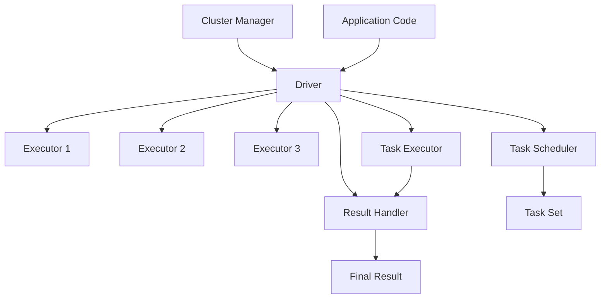

                 

 

> **关键词**：Spark Driver、分布式计算、编程模型、作业调度、任务执行、代码实例。

> **摘要**：本文深入解析了Apache Spark的核心组件之一——Driver的工作原理及其在分布式计算环境中的应用。通过详细的分析和代码实例，帮助读者理解Spark Driver在作业调度、任务分发和资源管理中的关键作用。

## 1. 背景介绍

Apache Spark是一个开源的分布式计算系统，专为大规模数据处理而设计。它提供了快速且易于使用的高级API，能够有效地处理批处理和实时流数据。Spark的核心组件包括Driver、Executor、Cluster Manager和Storage System等。在这些组件中，Driver起着至关重要的作用。

Driver是Spark应用程序的“大脑”，负责协调和管理整个作业的执行过程。它不仅负责将用户的代码转换成任务，还将这些任务分发到集群中的各个Executor节点上执行。同时，Driver还负责监控作业的执行状态，收集任务的结果，并最终生成作业的输出结果。

本文将围绕Spark Driver的工作原理、编程模型、任务调度和资源管理等方面进行深入讲解，并通过实际代码实例展示其应用场景。

## 2. 核心概念与联系

在讲解Spark Driver的工作原理之前，我们需要了解几个核心概念，包括Spark的编程模型、作业调度和资源管理。为了更加直观地展示这些概念之间的关系，我们使用Mermaid流程图来描述。



### 2.1 核心概念

- **Cluster Manager**：负责管理整个集群的资源分配和调度。常见的Cluster Manager包括YARN、Mesos和Spark自己的集群管理器。
- **Driver**：Spark应用程序的入口点，负责协调和管理整个作业的执行过程。Driver包含任务调度器（Task Scheduler）、任务执行器（Task Executor）和结果处理器（Result Handler）。
- **Executor**：在集群中的各个节点上运行，负责执行分配给它的任务，并返回结果。
- **Application Code**：用户编写的Spark应用程序，包含RDD（弹性分布式数据集）的操作和变换。
- **Task Scheduler**：负责将用户的代码转换成具体的任务，并将这些任务分配给Executor节点。
- **Task Executor**：在每个Executor节点上运行，负责执行分配给它的任务。
- **Result Handler**：负责收集和合并各个Executor节点返回的任务结果。

### 2.2 工作原理

当用户提交一个Spark应用程序时，Spark Driver会首先与Cluster Manager进行通信，请求启动Executor进程。一旦Executor启动，Driver就会开始执行以下步骤：

1. **解析用户代码**：Driver读取用户编写的Spark应用程序，将其解析为抽象的执行计划（DAG）。
2. **任务调度**：Task Scheduler将DAG转换成一系列的任务，并将这些任务分配给Executor节点。
3. **任务执行**：Executor节点上的Task Executor开始执行任务，并将结果返回给Driver。
4. **结果处理**：Result Handler负责收集和合并各个Executor节点返回的任务结果，最终生成作业的输出结果。

通过上述流程，Spark Driver在整个分布式计算过程中起到了关键作用，保证了作业的高效执行。

## 3. 核心算法原理 & 具体操作步骤

### 3.1 算法原理概述

Spark Driver的核心算法主要包括以下几个部分：

1. **DAG转换**：将用户编写的Spark应用程序转换成抽象的执行计划（DAG）。这一过程涉及到多个RDD操作和变换的解析和优化。
2. **任务调度**：Task Scheduler将DAG转换成一系列的任务，并将这些任务分配给Executor节点。调度算法需要考虑数据依赖、资源可用性等因素。
3. **任务执行**：Executor节点上的Task Executor负责执行分配给它的任务。这一过程涉及到任务的分解、执行和结果收集。
4. **结果处理**：Result Handler负责收集和合并各个Executor节点返回的任务结果，最终生成作业的输出结果。

### 3.2 算法步骤详解

#### 3.2.1 DAG转换

DAG转换是Spark Driver执行过程中的第一步。用户编写的Spark应用程序包含多个RDD操作和变换，这些操作和变换需要被解析和优化，以生成一个高效的执行计划。

具体步骤如下：

1. **解析用户代码**：Driver读取用户编写的Spark应用程序，并将其解析成抽象的执行计划（DAG）。这一过程涉及到语法解析和语义分析。
2. **优化DAG**：Spark提供了多种优化策略，如Shuffle Optimization、Pipeline Optimization等，以减少数据的交换和重计算。Driver会根据这些策略对DAG进行优化。
3. **生成执行计划**：经过解析和优化后，DAG被转换成一系列的物理执行计划，包括多个阶段（Stage）和任务（Task）。

#### 3.2.2 任务调度

任务调度是Spark Driver的核心功能之一。Task Scheduler负责将DAG转换成一系列的任务，并将这些任务分配给Executor节点。调度算法需要考虑多个因素，如数据依赖、资源可用性等。

具体步骤如下：

1. **确定阶段和任务**：根据DAG的拓扑结构，Task Scheduler将DAG划分为多个阶段（Stage），每个阶段包含多个任务（Task）。
2. **排序任务**：Task Scheduler根据任务的依赖关系对任务进行排序，以确保任务的执行顺序正确。
3. **分配任务**：Task Scheduler将任务分配给可用的Executor节点。分配策略可能包括负载均衡、数据本地性等。

#### 3.2.3 任务执行

任务执行是Spark Driver的另一个关键环节。Executor节点上的Task Executor负责执行分配给它的任务。具体步骤如下：

1. **任务初始化**：Task Executor从Driver获取任务信息，包括任务类型、输入数据、执行策略等。
2. **任务分解**：Task Executor将任务分解成多个子任务，以便在多个线程上并行执行。
3. **任务执行**：Task Executor执行子任务，并将中间结果存储在内存或磁盘上。
4. **结果收集**：Task Executor将任务的结果发送回Driver。

#### 3.2.4 结果处理

结果处理是Spark Driver执行过程中的最后一步。Result Handler负责收集和合并各个Executor节点返回的任务结果，最终生成作业的输出结果。

具体步骤如下：

1. **结果收集**：Result Handler从各个Executor节点收集任务的结果，并将其存储在内存或磁盘上。
2. **结果合并**：Result Handler对收集到的结果进行合并，以生成最终的输出结果。
3. **结果输出**：Result Handler将最终结果输出到用户指定的存储位置或处理逻辑中。

### 3.3 算法优缺点

#### 优点：

1. **高效性**：Spark Driver通过DAG转换和任务调度等算法，实现了高效的任务执行和结果处理。
2. **灵活性**：Spark提供了丰富的编程API和优化策略，使得开发者可以灵活地定制和优化作业执行过程。
3. **可扩展性**：Spark Driver支持多种Cluster Manager和资源调度策略，具有良好的可扩展性。

#### 缺点：

1. **资源依赖**：Spark Driver对Executor节点的资源依赖较高，可能会导致资源竞争和调度不均。
2. **编程门槛**：虽然Spark提供了丰富的API，但开发者仍然需要深入了解分布式计算原理和Spark内部实现，以充分利用其优势。

### 3.4 算法应用领域

Spark Driver的应用领域非常广泛，主要包括以下几个方面：

1. **大数据处理**：Spark Driver在大数据处理领域具有显著优势，能够高效处理大规模数据集。
2. **实时计算**：Spark Driver支持实时计算，适用于需要实时处理和响应的应用场景。
3. **机器学习和数据分析**：Spark Driver提供了丰富的机器学习和数据分析算法，适用于数据挖掘和预测分析等场景。

## 4. 数学模型和公式 & 详细讲解 & 举例说明

### 4.1 数学模型构建

在Spark Driver中，数学模型主要用于任务调度和资源管理。以下是一个简单的数学模型，用于描述任务调度过程：

1. **任务依赖关系**：假设有n个任务，它们之间存在依赖关系。任务i依赖于任务j，表示为 \( T_i \rightarrow T_j \)。
2. **资源分配**：假设有m个资源，每个资源可以并行执行的任务数不同，表示为 \( R_j \)。
3. **调度策略**：调度策略用于决定任务在资源上的执行顺序，常见的调度策略包括FIFO、Round-Robin等。

### 4.2 公式推导过程

基于上述数学模型，我们可以推导出调度策略的具体实现公式。以下是一个简单的例子：

1. **任务等待时间**：任务i的等待时间 \( W_i \) 表示为任务i开始执行前的总时间。
   \[ W_i = \sum_{j=1}^{i-1} (R_j + D_j) \]
   其中， \( D_j \) 表示任务j的执行时间。

2. **资源利用率**：资源j的利用率 \( U_j \) 表示为资源j被分配的时间占总时间的比例。
   \[ U_j = \frac{\sum_{i=1}^{n} R_i}{\sum_{i=1}^{n} (R_i + D_i)} \]

3. **调度策略**：以FIFO为例，任务i的执行顺序取决于它的等待时间。任务i的执行顺序为 \( S_i = W_i \)。

### 4.3 案例分析与讲解

假设有3个任务 \( T_1, T_2, T_3 \)，它们之间的依赖关系和执行时间如下表所示：

| 任务 | 依赖 | 执行时间 |
| ---- | ---- | ------- |
| \( T_1 \) | 无 | 10秒 |
| \( T_2 \) | \( T_1 \) | 5秒 |
| \( T_3 \) | \( T_1 \) | 15秒 |

根据上述数学模型和公式，我们可以计算出每个任务的等待时间和资源利用率：

1. **任务等待时间**：
   \[ W_1 = 0 \]
   \[ W_2 = R_1 + D_1 = 10 \]
   \[ W_3 = R_1 + D_1 + R_2 + D_2 = 10 + 5 + 15 = 30 \]

2. **资源利用率**：
   \[ U_1 = \frac{R_1}{R_1 + D_1} = \frac{10}{10 + 10} = 0.5 \]
   \[ U_2 = \frac{R_2}{R_2 + D_2} = \frac{5}{5 + 15} = 0.2 \]
   \[ U_3 = \frac{R_3}{R_3 + D_3} = \frac{15}{15 + 15} = 0.5 \]

根据FIFO调度策略，任务 \( T_1, T_2, T_3 \) 的执行顺序为 \( S_1 = W_1, S_2 = W_2, S_3 = W_3 \)。

## 5. 项目实践：代码实例和详细解释说明

### 5.1 开发环境搭建

在本节中，我们将搭建一个简单的Spark开发环境，用于后续的代码实践。

1. **安装Java**：由于Spark是基于Java编写的，我们需要首先安装Java环境。下载并安装最新的Java开发工具包（JDK），并设置环境变量。
2. **安装Spark**：从Apache Spark官网下载最新的Spark发行版，解压到指定的目录中。
3. **配置Spark环境**：在Spark的conf目录下，编辑`spark-env.sh`文件，配置Spark的运行参数，如内存、存储路径等。

```bash
# spark-env.sh 配置示例
export SPARK_HOME=/path/to/spark
export JAVA_HOME=/path/to/jdk
export SPARK_MASTER_HOST=localhost
export SPARK_MASTER_PORT=7077
export SPARK_WORKER_MEMORY=2g
export SPARK_DRIVER_MEMORY=2g
```

4. **启动Spark集群**：在Spark的sbin目录下，启动Spark Master和Spark Worker。

```bash
./start-master.sh
./start-worker.sh local
```

### 5.2 源代码详细实现

在本节中，我们将编写一个简单的Spark应用程序，实现Word Count功能。

```java
import org.apache.spark.api.java.JavaRDD;
import org.apache.spark.api.java.JavaPairRDD;
import org.apache.spark.api.java.function.PairFunction;
import org.apache.spark.api.java.function.Function2;
import scala.Tuple2;

public class WordCount {
    public static void main(String[] args) throws Exception {
        // 创建SparkConf对象，指定应用名称和Spark配置
        SparkConf conf = new SparkConf().setAppName("WordCount").setMaster("local[*]");

        // 创建SparkContext对象，它是Spark应用程序的入口点
        SparkContext sc = new SparkContext(conf);

        // 创建一个包含文本数据的RDD
        JavaRDD<String> lines = sc.textFile("data.txt");

        // 对文本数据进行词频统计
        JavaPairRDD<String, Integer> counts = lines.flatMap(s -> s.split(" "))
                .mapToPair(s -> new Tuple2<>(s, 1))
                .reduceByKey(Integer::sum);

        // 输出结果
        counts.saveAsTextFile("output");

        // 关闭SparkContext
        sc.stop();
    }
}
```

### 5.3 代码解读与分析

#### 5.3.1 SparkConf对象

首先，我们创建一个SparkConf对象，用于指定应用名称和Spark配置。这里我们设置了应用名称为“WordCount”和Spark Master地址为本地模式（local[*]）。

```java
SparkConf conf = new SparkConf().setAppName("WordCount").setMaster("local[*]");
```

#### 5.3.2 SparkContext对象

接着，我们创建一个SparkContext对象，它是Spark应用程序的入口点。SparkContext对象负责创建和管理工作所需的计算资源，并与Spark集群进行通信。

```java
SparkContext sc = new SparkContext(conf);
```

#### 5.3.3 创建RDD

然后，我们使用`textFile`方法创建一个包含文本数据的RDD。这里我们假设数据文件名为`data.txt`，位于本地路径。

```java
JavaRDD<String> lines = sc.textFile("data.txt");
```

#### 5.3.4 词频统计

接下来，我们使用`flatMap`和`mapToPair`方法对文本数据进行词频统计。首先，我们将文本数据按照空格分割成多个单词，然后对每个单词创建一个键值对，其中键为单词本身，值为1。

```java
JavaPairRDD<String, Integer> counts = lines.flatMap(s -> s.split(" "))
        .mapToPair(s -> new Tuple2<>(s, 1))
        .reduceByKey(Integer::sum);
```

#### 5.3.5 输出结果

最后，我们使用`saveAsTextFile`方法将结果保存到本地文件系统中。

```java
counts.saveAsTextFile("output");
```

#### 5.3.6 关闭SparkContext

最后，我们关闭SparkContext，释放计算资源。

```java
sc.stop();
```

## 6. 实际应用场景

Spark Driver在分布式计算环境中具有广泛的应用场景，以下是一些典型的应用案例：

1. **大数据处理**：Spark Driver能够高效处理大规模数据集，适用于各种大数据应用，如数据挖掘、机器学习、实时分析等。
2. **实时计算**：Spark Driver支持实时计算，适用于需要实时处理和响应的应用场景，如实时流处理、实时监控等。
3. **机器学习和数据分析**：Spark Driver提供了丰富的机器学习和数据分析算法，适用于数据挖掘、预测分析等场景。
4. **金融风控**：Spark Driver在金融风控领域具有广泛应用，能够实时处理和预测金融风险，提高风险管理能力。
5. **电子商务**：Spark Driver在电子商务领域用于实时推荐、实时分析用户行为等，提高用户满意度和转化率。

## 7. 工具和资源推荐

### 7.1 学习资源推荐

- **Apache Spark官网**：提供了详细的文档、教程和案例，是学习Spark的绝佳资源。
- **《Spark: The Definitive Guide》**：由Spark创始人Matei Zaharia撰写的权威指南，涵盖了Spark的各个方面。
- **《Spark in Action》**：通过实例讲解Spark的核心概念和应用，适合初学者和进阶者。

### 7.2 开发工具推荐

- **IntelliJ IDEA**：支持Spark开发，提供了丰富的插件和工具，方便编写、调试和运行Spark应用程序。
- **Eclipse**：也可用于Spark开发，提供了简单的Spark插件，支持代码生成和调试。

### 7.3 相关论文推荐

- **"Spark: Cluster Computing with Working Sets"**：Spark的原始论文，介绍了Spark的设计理念和核心原理。
- **"Resilient Distributed Datasets: A Benchmark"**：分析了Spark RDD的性能和可靠性，提供了详细的实验数据。
- **"GraphX: Large-scale Graph Computation on Spark"**：介绍了Spark的图处理框架GraphX，展示了其在图计算领域的应用。

## 8. 总结：未来发展趋势与挑战

### 8.1 研究成果总结

Spark Driver作为Apache Spark的核心组件，已经在分布式计算领域取得了显著成果。通过DAG转换、任务调度和结果处理等核心算法，Spark Driver实现了高效、灵活和可扩展的任务执行和管理。此外，Spark Driver在机器学习和数据分析等领域也展现出了强大的性能和潜力。

### 8.2 未来发展趋势

1. **性能优化**：随着大数据和实时计算需求的不断增长，Spark Driver将继续优化其性能，提高资源利用率和任务执行速度。
2. **编程模型**：为了满足不同领域和应用的需求，Spark Driver可能会推出更多高效的编程模型，如流处理API、图计算API等。
3. **生态系统**：Spark Driver的生态系统将持续扩展，包括与更多数据存储系统、数据库和中间件的集成，提供更丰富的功能和工具。

### 8.3 面临的挑战

1. **资源管理**：随着任务多样性和复杂性的增加，Spark Driver需要更智能的资源管理策略，以避免资源浪费和调度不均。
2. **异构计算**：随着计算设备的多样化，Spark Driver需要支持异构计算，充分利用不同类型的计算资源。
3. **易用性**：虽然Spark Driver提供了丰富的功能，但对于非专业用户来说，使用门槛较高。未来，Spark Driver需要更加友好的用户界面和易用的API。

### 8.4 研究展望

1. **高效存储**：结合存储系统的优化，提高Spark Driver的数据读写性能，降低数据传输延迟。
2. **动态调度**：引入动态调度机制，根据作业的执行状态和资源变化，实时调整任务执行策略。
3. **分布式一致性**：在分布式环境下，保证数据的一致性和可靠性，提供更完善的容错机制。

## 9. 附录：常见问题与解答

### Q1：Spark Driver如何处理任务失败？

A1：当任务执行失败时，Spark Driver会根据配置的重试策略进行重试。如果任务失败次数超过重试阈值，Spark Driver会向用户发送错误通知，并记录失败原因。

### Q2：Spark Driver如何保证作业的执行顺序？

A2：Spark Driver通过任务依赖关系和调度策略来保证作业的执行顺序。任务依赖关系决定了任务的执行顺序，而调度策略根据任务的依赖关系和资源可用性来确定具体的执行顺序。

### Q3：Spark Driver如何实现任务并行执行？

A3：Spark Driver将作业分解成多个任务，并将这些任务分配给集群中的多个Executor节点。每个Executor节点并行执行分配给它的任务，以提高作业的执行效率。

### Q4：Spark Driver如何优化任务执行？

A4：Spark Driver通过DAG转换、任务调度和资源管理等算法优化任务执行。例如，通过Shuffle Optimization减少数据传输，通过Pipeline Optimization减少任务执行过程中的等待时间。

### Q5：Spark Driver如何保证作业的容错性？

A5：Spark Driver通过Checkpoint和Recovery机制保证作业的容错性。Checkpoint可以将作业的状态保存到外部存储系统，以便在作业失败时恢复到之前的状态。Recovery机制则负责根据Checkpoint记录恢复作业的执行。

---

以上是关于Spark Driver原理与代码实例讲解的详细文章，希望对您有所帮助。在未来的研究中，我们将继续探讨Spark Driver的优化和扩展，以满足不断变化的需求。作者：禅与计算机程序设计艺术 / Zen and the Art of Computer Programming。

