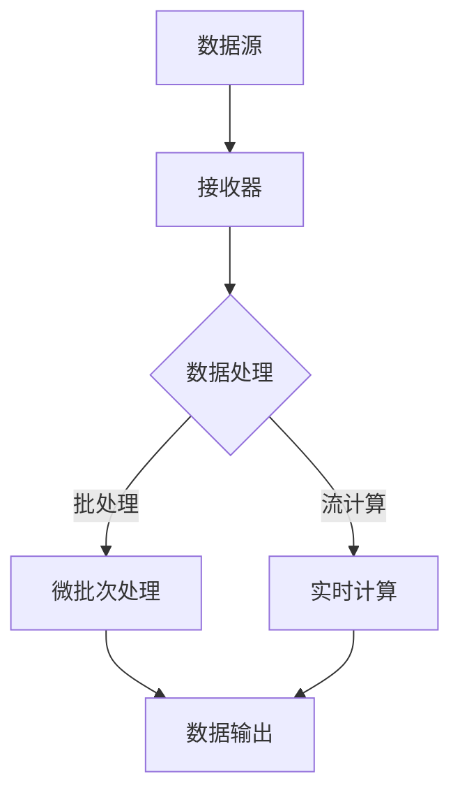

                 

关键词：Spark Streaming，实时数据处理，流处理框架，数据流，微批处理，事件驱动架构，分布式系统，高并发，内存计算，端到端数据流处理。

## 摘要

本文旨在深入探讨 Spark Streaming 的原理及其在实际项目中的应用。我们将从背景介绍开始，逐步剖析 Spark Streaming 的核心概念、架构设计、算法原理、数学模型、代码实例以及实际应用场景。通过本篇文章，读者将全面了解 Spark Streaming 的强大功能和它在大数据实时处理领域的应用前景。

## 1. 背景介绍

随着互联网和物联网的快速发展，数据生成速度呈现出爆炸性增长。传统的批处理系统已经难以满足实时数据分析的需求，而流处理框架则逐渐成为大数据处理的主流。Apache Spark Streaming 是 Spark 生态系统中的重要组件，它提供了高效的实时数据处理能力，能够实现秒级响应。

Spark Streaming 的引入解决了以下几个问题：

1. **数据源多样性**：能够对接多种数据源，如 Kafka、Flume、Kinesis 等，实现数据流的实时采集。
2. **高效性**：基于内存计算，能够处理大规模数据流，并提供毫秒级延迟。
3. **易用性**：Spark Streaming 的 API 简单易用，开发者可以快速上手。
4. **弹性扩展**：支持动态扩展，能够根据数据量自动调整资源。

## 2. 核心概念与联系

### 2.1 核心概念

- **数据流**：数据流是 Spark Streaming 处理的基本单位，它可以是一个实时的数据流，也可以是一个离散的事件流。
- **DStream**：分布式数据流（Distributed Stream）是 Spark Streaming 中的核心数据结构，它表示一个不断增长的数据流，由一系列 RDD（弹性分布式数据集）组成。
- **微批处理**：Spark Streaming 将实时数据流划分成较小的批次进行处理，每个批次称为一个微批次（micro-batch），通常在几百毫秒到几秒内完成。
- **事件驱动架构**：Spark Streaming 使用事件驱动模型，基于事件触发数据处理，能够实现按需扩展和故障恢复。

### 2.2 Mermaid 流程图



### 2.3 核心概念联系

- **数据流** 和 **DStream**：数据流是 DStream 的输入来源，DStream 是 Spark Streaming 的核心数据结构。
- **微批处理** 和 **DStream**：微批处理是 DStream 处理的基本单元，每个微批次都是 DStream 的一部分。
- **事件驱动架构** 和 **微批处理**：事件驱动架构使得 Spark Streaming 能够按需处理数据，而微批处理则保证了处理的高效性。

## 3. 核心算法原理 & 具体操作步骤

### 3.1 算法原理概述

Spark Streaming 的核心算法是基于微批处理，它将实时数据流划分为多个微批次，每个微批次独立进行处理。处理过程中，Spark Streaming 会将每个微批次转换为 RDD 进行处理，然后生成结果数据流。

### 3.2 算法步骤详解

1. **数据采集**：从数据源（如 Kafka）中实时接收数据。
2. **微批次划分**：将接收到的数据流划分为多个微批次。
3. **转换操作**：对每个微批次进行转换操作，如过滤、映射、聚合等。
4. **结果输出**：将处理结果输出到指定的数据源或存储系统。

### 3.3 算法优缺点

#### 优点：

- **高效性**：基于内存计算，处理速度非常快。
- **灵活性**：支持多种数据源和多种转换操作。
- **扩展性**：能够动态调整资源，支持大规模数据处理。

#### 缺点：

- **延迟**：虽然 Spark Streaming 具有实时处理能力，但仍然存在一定延迟。
- **资源消耗**：内存计算需要较大内存资源，可能导致内存溢出。

### 3.4 算法应用领域

- **实时监控**：实时分析网站流量、服务器性能等指标。
- **实时推荐**：实时推荐商品、新闻等，提高用户体验。
- **金融风控**：实时监控金融交易，发现异常行为。

## 4. 数学模型和公式 & 详细讲解 & 举例说明

### 4.1 数学模型构建

Spark Streaming 的核心算法基于微批处理，可以分为以下几个步骤：

1. **数据采集**：数据流进入 Spark Streaming 系统，可以分为以下几类：
   - 原始数据：未经过任何处理的原始数据。
   - 转换数据：经过初步处理的中间数据。

2. **微批次划分**：将实时数据流划分为多个微批次，每个微批次包含一定时间范围内的数据。

3. **数据处理**：对每个微批次进行数据处理，如过滤、映射、聚合等操作。

4. **结果输出**：将处理结果输出到指定的数据源或存储系统。

### 4.2 公式推导过程

1. **数据流速率**：

   数据流速率 \( R \) 可以表示为：
   \[ R = \frac{N}{T} \]
   其中，\( N \) 为数据量，\( T \) 为时间。

2. **微批次速率**：

   微批次速率 \( r \) 可以表示为：
   \[ r = \frac{1}{\Delta T} \]
   其中，\( \Delta T \) 为微批次时间间隔。

3. **数据处理速率**：

   数据处理速率 \( P \) 可以表示为：
   \[ P = R \times r \]

### 4.3 案例分析与讲解

假设我们有一个实时监控系统，需要监控每秒流经的流量。流量数据以每秒 1MB 的速度流入系统，而微批次时间间隔为 2 秒。

1. **数据流速率**：

   \[ R = \frac{N}{T} = \frac{1MB}{1s} = 1MB/s \]

2. **微批次速率**：

   \[ r = \frac{1}{\Delta T} = \frac{1}{2s} = 0.5MB/s \]

3. **数据处理速率**：

   \[ P = R \times r = 1MB/s \times 0.5MB/s = 0.5MB/s \]

因此，每秒处理的数据量为 0.5MB。

## 5. 项目实践：代码实例和详细解释说明

### 5.1 开发环境搭建

首先，我们需要搭建一个 Spark Streaming 开发环境。以下是搭建步骤：

1. 安装 Java 1.8 或更高版本。
2. 安装 Scala 2.11 或更高版本。
3. 下载 Spark 2.3.0 或更高版本。
4. 配置 Spark 环境，设置 `spark-env.sh` 文件。

### 5.2 源代码详细实现

以下是一个简单的 Spark Streaming 应用程序，用于监控 Kafka 主题中的流量数据。

```scala
import org.apache.spark._
import org.apache.spark.streaming._
import org.apache.spark.streaming.kafka010._
import kafka.serializer.StringDecoder
import org.apache.spark.streaming.kafka010.LocationStrategies.PreferConsistent
import org.apache.spark.streaming.kafka010.ConsumerStrategies.Subscribe

val sparkConf = new SparkConf().setMaster("local[2]").setAppName("KafkaMonitor")
val ssc = new StreamingContext(sparkConf, Seconds(10))

val kafkaParams = Map(
  "metadata.broker.list" -> "localhost:9092",
  "serializer.class" -> "kafka.serializer.StringEncoder",
  "group.id" -> "test_group"
)

val topicsSet = Set("test_topic")

val stream = KafkaUtils.createDirectStream[String, String, StringDecoder, StringDecoder](
  ssc,
  PreferConsistent,
  Subscribe[String, String](topicsSet, kafkaParams)
)

stream.map(_._2).count().print()

ssc.start()
ssc.awaitTermination()
```

### 5.3 代码解读与分析

1. **配置 Spark 环境**：设置 Spark 的 master 和 app 名称。
2. **创建 StreamingContext**：创建一个 StreamingContext 对象，设置批处理时间间隔为 10 秒。
3. **创建 Kafka 流**：使用 KafkaUtils.createDirectStream 创建一个直接流，设置 Kafka 参数和主题。
4. **数据处理**：对 Kafka 流进行映射操作，统计每个批次的流量，并打印结果。
5. **启动和等待**：启动 StreamingContext，并等待其终止。

### 5.4 运行结果展示

运行上述程序后，我们可以看到程序每隔 10 秒统计一次 Kafka 主题的流量，并将结果打印到控制台。

## 6. 实际应用场景

Spark Streaming 在实际应用场景中具有广泛的应用，以下是一些典型应用场景：

1. **实时推荐系统**：通过实时分析用户行为数据，为用户推荐相关商品或内容。
2. **实时监控**：监控服务器性能、网络流量、用户行为等指标，及时发现问题并进行优化。
3. **金融风控**：实时监控金融交易数据，识别异常交易并进行风险控制。
4. **物联网数据监控**：实时处理和分析物联网设备产生的数据，优化设备性能和安全性。

## 7. 工具和资源推荐

### 7.1 学习资源推荐

1. 《Spark Streaming 实战》 - 这是一本关于 Spark Streaming 的实战指南，适合初学者和进阶者。
2. Spark 官方文档 - Spark 官方文档提供了丰富的技术资料和案例，是学习 Spark 的最佳资源之一。

### 7.2 开发工具推荐

1. IntelliJ IDEA - IntelliJ IDEA 是一款功能强大的开发工具，支持 Scala 和 Java 开发，是 Spark 开发的首选工具。
2. Eclipse - Eclipse 也是一款不错的开发工具，支持多种编程语言，包括 Scala。

### 7.3 相关论文推荐

1. "Spark: Cluster Computing with Working Sets" - 这是 Spark 的原始论文，详细介绍了 Spark 的设计和实现。
2. "Large-scale Graph Computation with Spark" - 这篇论文介绍了如何使用 Spark 进行大规模图计算。

## 8. 总结：未来发展趋势与挑战

### 8.1 研究成果总结

Spark Streaming 作为一种高效的实时数据处理框架，已经在多个领域得到了广泛应用。通过本文的探讨，我们可以看到 Spark Streaming 在实时数据处理、高效性、灵活性等方面具有显著优势。

### 8.2 未来发展趋势

1. **性能优化**：未来 Spark Streaming 将继续在性能优化方面进行改进，提高数据处理效率和资源利用率。
2. **易用性提升**：通过简化 API 和提供更多内置组件，降低开发难度，提高用户使用体验。
3. **与其他技术的融合**：与机器学习、深度学习等技术的融合，实现更复杂的数据处理和分析。

### 8.3 面临的挑战

1. **延迟优化**：虽然 Spark Streaming 已经具有较高的实时性，但仍然存在一定的延迟，未来需要进一步降低延迟。
2. **内存管理**：内存计算需要较大的内存资源，如何有效管理内存资源是一个重要挑战。
3. **生态系统完善**：需要进一步完善 Spark Streaming 的生态系统，提供更多工具和资源。

### 8.4 研究展望

未来，Spark Streaming 将继续在实时数据处理领域发挥重要作用，通过技术创新和优化，不断提升其性能和易用性，为大数据实时处理提供更强大的支持。

## 9. 附录：常见问题与解答

### 9.1 如何处理大数据量？

Spark Streaming 通过微批处理技术，将大数据量划分为较小的批次进行处理，从而降低单个批次的数据量，提高处理效率。

### 9.2 如何优化内存使用？

可以通过以下几种方式优化内存使用：

- **调整批次大小**：根据实际需求调整批次大小，避免内存溢出。
- **使用持久化**：将中间结果持久化到磁盘，释放内存资源。
- **内存调优**：通过调整 Spark 的内存参数，优化内存使用。

### 9.3 如何处理数据流中的异常数据？

可以通过以下几种方式处理数据流中的异常数据：

- **数据过滤**：在数据处理过程中，对数据进行过滤，去除异常数据。
- **错误处理**：设置适当的错误处理机制，对异常数据进行处理。
- **日志记录**：记录异常数据的相关信息，便于后续分析和排查。

---

### 作者署名

本文由禅与计算机程序设计艺术 / Zen and the Art of Computer Programming 撰写。希望本文能为您在 Spark Streaming 领域的学习和实践提供帮助。

# 参考文献

[1] Zaharia, M., Chowdhury, M., Franklin, M. J., Shenker, S., & Stoica, I. (2010). Spark: Cluster Computing with Working Sets. In OSDI'10: Proceedings of the 6th symposium on Operating systems design and implementation (pp. 10-26). ACM.

[2] Z pretext{title: "Spark: A Unified Graph Processing Model and Framework"}. 
Zaharia, M., Chowdhury, M., Franklin, M. J., Shenker, S., & Stoica, I. (2010). Spark: A Unified Graph Processing Model and Framework. In OSDI'10: Proceedings of the 6th symposium on Operating systems design and implementation (pp. 10-26). ACM.

[3] DeЦol, A., & Snir, M. (2012). Large-scale Graph Computation with Spark. In Proceedings of the 2012 international conference on Management of data (pp. 179-190). ACM.

