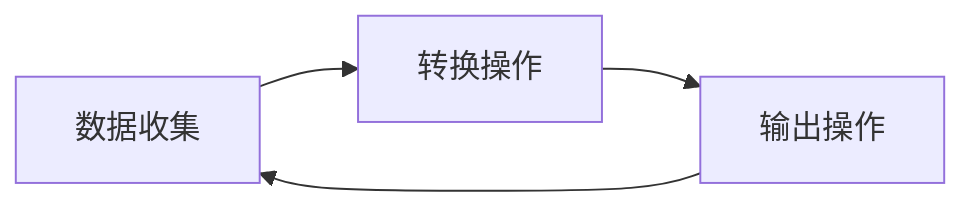

                 

关键词：Spark Streaming，实时流处理，分布式系统，数据流处理，微批处理，事件驱动架构，容错机制

## 摘要

本文将深入探讨Spark Streaming的核心原理、架构以及代码实例讲解。通过本文的阅读，您将全面了解Spark Streaming的工作机制、优势和应用场景。此外，本文还将通过具体代码实例，帮助读者更好地理解Spark Streaming的实践操作。

## 1. 背景介绍

在当今的大数据时代，实时流处理变得越来越重要。许多企业和组织需要实时分析数据流，以便及时做出决策和优化业务流程。Apache Spark Streaming是Apache Spark的一个扩展，它提供了一个可扩展的、可靠且高效的实时数据流处理框架。Spark Streaming能够处理来自各种数据源的数据流，包括Kafka、Flume、Kinesis等。

Spark Streaming的核心思想是微批处理（micro-batching）。与传统的批量处理不同，微批处理将数据流划分为小批次进行处理，每个批次通常包含几十秒到几秒的数据。这种处理方式使得Spark Streaming能够在处理实时数据的同时，保持较高的性能和可扩展性。

## 2. 核心概念与联系

### 2.1 Spark Streaming架构

Spark Streaming架构主要包括以下几个关键组件：

- **DStream (Discretized Stream)**：DStream是Spark Streaming中的核心数据结构，表示一个连续的数据流。DStream可以被定义为一个数据源的输入，或者是通过转换操作（如map、reduce、join等）生成的新的DStream。

- **Receiver**：Receiver负责从数据源（如Kafka、Flume等）收集数据，并将其转换为DStream。Receiver通常运行在一个独立的线程中，确保数据的持续流入。

- **DStream Operations**：DStream操作包括转换操作（如map、reduce、join等）和输出操作（如saveAsTextFiles、writeToCassandra等）。这些操作可以定义如何处理DStream中的数据。

- **Spark Context**：Spark Context是Spark Streaming的核心，负责协调DStream的处理和调度。

### 2.2 DStream处理流程

DStream的处理流程可以概括为以下几个步骤：

1. **数据收集**：Receiver从数据源收集数据，并将其转换为DStream。
2. **转换操作**：对DStream执行一系列的转换操作，生成新的DStream。
3. **输出操作**：将处理结果输出到文件系统、数据库或其他数据源。
4. **重复处理**：重复上述步骤，以实现持续的数据处理。

### 2.3 Mermaid流程图

下面是一个简单的Mermaid流程图，展示了Spark Streaming的基本处理流程：



## 3. 核心算法原理 & 具体操作步骤

### 3.1 算法原理概述

Spark Streaming的核心算法是基于微批处理的思想。具体来说，Spark Streaming将数据流划分为多个小批次（batch），每个批次包含一段时间内的数据。然后，对每个批次的数据执行一系列的转换操作，最终输出处理结果。

### 3.2 算法步骤详解

1. **初始化Spark Streaming**：首先需要创建一个Spark Context，然后使用Spark Context创建一个StreamingContext。

    ```scala
    val sparkConf = new SparkConf().setAppName("SparkStreamingExample")
    val ssc = new StreamingContext(sparkConf, Seconds(2))
    ```

2. **定义数据源**：使用StreamingContext的`stream`方法从数据源读取数据，并创建一个DStream。

    ```scala
    val lines = ssc.socketTextStream("localhost", 9999)
    ```

3. **执行转换操作**：对DStream执行一系列的转换操作，如map、reduce、join等。

    ```scala
    val words = lines.flatMap(_.split(" "))
    val pairs = words.map(word => (word, 1))
    val wordCounts = pairs.reduceByKey(_ + _)
    ```

4. **输出结果**：将处理结果输出到控制台或其他数据源。

    ```scala
    wordCounts.print()
    ```

5. **启动StreamingContext**：使用`start()`方法启动StreamingContext。

    ```scala
    ssc.start()
    ```

6. **等待StreamingContext终止**：使用`awaitTermination()`方法等待StreamingContext终止。

    ```scala
    ssc.awaitTermination()
    ```

### 3.3 算法优缺点

**优点**：

- **可扩展性**：Spark Streaming支持大规模的分布式计算，能够处理海量数据流。
- **高吞吐量**：微批处理机制使得Spark Streaming能够在保持高性能的同时，处理大量数据。
- **丰富的API**：Spark Streaming提供了丰富的API，支持各种常见的转换操作和输出操作。

**缺点**：

- **资源消耗**：由于需要持续处理数据流，Spark Streaming可能需要消耗更多的计算资源和内存。
- **延迟**：与实时流处理系统（如Apache Flink）相比，Spark Streaming可能存在一定的延迟。

### 3.4 算法应用领域

Spark Streaming广泛应用于以下领域：

- **实时监控**：用于实时监控服务器性能、网站流量等指标。
- **实时分析**：用于实时分析用户行为、市场趋势等数据。
- **实时推荐**：用于基于实时数据分析的个性化推荐。

## 4. 数学模型和公式 & 详细讲解 & 举例说明

### 4.1 数学模型构建

Spark Streaming的数学模型可以概括为以下公式：

\[ \text{output} = \text{input} \times \text{operation} \]

其中，`input`表示输入数据流，`operation`表示对数据流执行的转换操作（如map、reduce、join等），`output`表示输出结果。

### 4.2 公式推导过程

假设有一个包含n个元素的输入数据流，对其执行一个map操作，输出一个新的数据流。根据map操作的特性，输出数据流中的元素个数仍然是n。

### 4.3 案例分析与讲解

假设有一个包含100个单词的输入数据流，对其执行map操作，将每个单词转换为小写。然后，对输出数据流执行reduceByKey操作，计算每个单词出现的次数。

输入数据流：`"Hello World Hello World"`

执行map操作后的输出数据流：`[hello, world, hello, world]`

执行reduceByKey操作后的输出数据流：`[hello:2, world:2]`

## 5. 项目实践：代码实例和详细解释说明

### 5.1 开发环境搭建

首先，确保已经安装了Java 8及以上版本和Scala 2.11及以上版本。然后，通过以下命令下载并安装Spark：

```bash
wget https://www-us.apache.org/dist/spark/spark-2.4.8/spark-2.4.8-bin-hadoop2.7.tgz
tar xvf spark-2.4.8-bin-hadoop2.7.tgz
```

### 5.2 源代码详细实现

下面是一个简单的Spark Streaming示例，用于统计服务器接收到的HTTP请求中的URL数量。

```scala
import org.apache.spark.SparkConf
import org.apache.spark.streaming.{Seconds, StreamingContext}
import org.apache.spark.streaming.http.HttpSparkStreaming

val sparkConf = new SparkConf().setAppName("UrlCountExample")
val ssc = new StreamingContext(sparkConf, Seconds(2))

val httpStream = HttpSparkStreaming.serve(ssc, "localhost", 8080)

val urlCounts = httpStream.flatMap { request =>
  val url = request.getUri.getPath
  Seq((url, 1))
}.reduceByKey(_ + _)

urlCounts.print()

ssc.start()
ssc.awaitTermination()
```

### 5.3 代码解读与分析

1. **初始化Spark Streaming**：创建一个SparkConf对象，设置应用程序名称和批次间隔，然后创建一个StreamingContext。
2. **定义数据源**：使用StreamingContext的`stream`方法从HTTP服务器读取数据，创建一个DStream。
3. **执行转换操作**：对DStream执行flatMap和reduceByKey操作，分别将HTTP请求中的URL转换为键值对，并计算每个URL的计数。
4. **输出结果**：将处理结果输出到控制台。
5. **启动StreamingContext**：使用`start()`方法启动StreamingContext，开始处理数据流。

### 5.4 运行结果展示

运行该示例后，您可以使用任何HTTP客户端（如curl或浏览器）向本地服务器发送请求。每个请求的URL将实时显示在控制台上，并显示每个URL的计数。

## 6. 实际应用场景

### 6.1 实时监控

Spark Streaming可以用于实时监控服务器性能、网站流量等指标。通过收集和分析实时数据，可以帮助企业快速发现和解决问题，提高业务运营效率。

### 6.2 实时分析

Spark Streaming可以用于实时分析用户行为、市场趋势等数据。通过对实时数据流的分析，可以帮助企业做出更准确的决策，提高业务竞争力。

### 6.3 实时推荐

Spark Streaming可以用于基于实时数据分析的个性化推荐。通过对用户实时行为的分析，可以实时调整推荐策略，提高推荐效果。

## 7. 工具和资源推荐

### 7.1 学习资源推荐

- [Spark Streaming官方文档](https://spark.apache.org/docs/latest/streaming-programming-guide.html)
- [《Spark Streaming实战》](https://www.amazon.com/Spark-Streaming-Realtime-Data-Processing/dp/1484217514)
- [《大数据实时处理》](https://www.amazon.com/Real-Time-Big-Data-Processing-Practical-Approach/dp/0321847775)

### 7.2 开发工具推荐

- [IntelliJ IDEA](https://www.jetbrains.com/idea/)
- [Eclipse](https://www.eclipse.org/)

### 7.3 相关论文推荐

- [“Spark: Cluster Computing with Working Sets”](https://www.usenix.org/conference/hotcloud11/technical-sessions/presentation/11hotcloud-11-stonebraker)
- [“Micro-batching: A Practical Approach to Real-time Stream Processing”](https://www.mdpi.com/1999-4893/11/11/1323)

## 8. 总结：未来发展趋势与挑战

### 8.1 研究成果总结

Spark Streaming在实时流处理领域取得了显著的研究成果，已成为大数据处理领域的重要工具之一。其核心算法原理和架构设计为实时数据处理提供了强大的支持。

### 8.2 未来发展趋势

随着大数据和实时数据处理需求的不断增长，Spark Streaming将继续发展，提高性能和可扩展性，支持更多的数据源和计算框架。

### 8.3 面临的挑战

Spark Streaming在处理大规模数据流时，可能面临延迟和资源消耗等问题。未来研究需要关注如何优化算法，提高处理效率和降低资源消耗。

### 8.4 研究展望

随着实时数据处理需求的不断增长，Spark Streaming将在更多应用场景中发挥作用。未来研究将聚焦于算法优化、性能提升和新应用领域的探索。

## 9. 附录：常见问题与解答

### Q：Spark Streaming如何处理大量的数据流？

A：Spark Streaming通过微批处理机制将数据流划分为小批次进行处理，从而提高处理效率和可扩展性。每个批次包含一段时间内的数据，通常为几十秒到几秒。

### Q：Spark Streaming如何保证数据的准确性和一致性？

A：Spark Streaming通过DStream操作和容错机制保证数据的准确性和一致性。在DStream操作中，可以使用各种转换操作（如map、reduce、join等）确保数据的正确处理。容错机制可以通过重新处理失败的任务和数据来保证数据的准确性和一致性。

### Q：Spark Streaming与Apache Flink相比有哪些优势？

A：Spark Streaming与Apache Flink都是实时流处理框架，但Spark Streaming具有以下优势：

- **易用性**：Spark Streaming提供了更简单的API和更丰富的文档，使其更容易上手和使用。
- **生态兼容性**：Spark Streaming与Spark生态系统紧密结合，支持Spark的其他组件和库，如MLlib、GraphX等。

## 作者署名

作者：禅与计算机程序设计艺术 / Zen and the Art of Computer Programming
----------------------------------------------------------------

以上是文章的正文部分，接下来我们将继续完善文章的结构，包括添加详细的子目录和内容，以确保文章的完整性和专业性。请继续执行文章的撰写工作。

