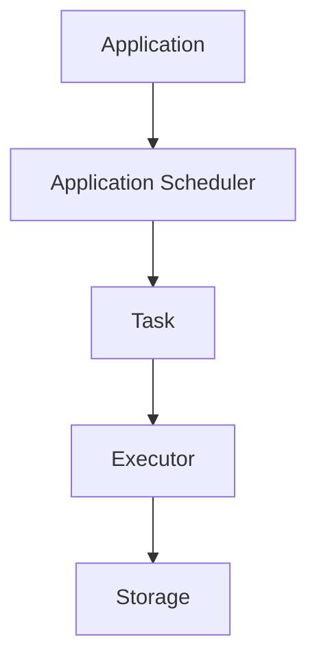

                 

关键词：Spark、分布式计算、大数据处理、内存计算、代码实例、性能优化

摘要：本文深入剖析了Spark的核心原理，从基础概念到代码实例，全面讲解了Spark在分布式计算和大数据处理中的优势和应用。文章旨在帮助读者理解Spark的工作机制，掌握其核心算法，并能够运用到实际项目中，实现高效的内存计算。

## 1. 背景介绍

在大数据时代，传统的计算方式已经无法满足海量数据处理的需求。分布式计算应运而生，成为大数据处理的重要技术手段。Apache Spark作为一个开源的分布式计算系统，以其高效的内存计算能力，在数据处理领域脱颖而出。

Spark是由UC Berkeley AMP Lab开发的一个开源项目，后来捐赠给Apache Software Foundation。Spark的设计初衷是为了解决MapReduce的局限性，尤其是其在迭代计算和交互式数据挖掘方面的不足。Spark通过提供弹性分布式数据集（RDD）抽象，实现了高效的数据处理能力。

Spark的核心组件包括：

- **Spark Core**：提供了分布式任务调度、内存管理、存储等功能，是Spark的核心基础。
- **Spark SQL**：提供了一组用于结构化数据处理的工具，支持SQL查询和DataFrame、Dataset API。
- **Spark Streaming**：提供了实时数据流处理能力，可以基于Spark Core进行扩展。
- **MLlib**：提供了用于机器学习的算法和工具库。
- **GraphX**：提供了图处理框架，用于复杂图计算任务。

## 2. 核心概念与联系

### 2.1 Spark的架构

Spark的架构可以分为三层：

- **应用层**：用户编写的Spark应用程序。
- **调度层**：负责将任务分配到各个节点，并监控任务执行状态。
- **存储层**：负责数据存储和持久化。

下面是一个简化的Spark架构的Mermaid流程图：



### 2.2 分布式数据集（RDD）

RDD（弹性分布式数据集）是Spark的核心抽象，代表了不可变的、可并行操作的数据集合。RDD可以由Scala、Java、Python等多种编程语言创建，并支持各种操作，如转换（如map、filter）、行动（如reduce、collect）等。

RDD的三个关键特性：

- **分片**：RDD被分割成多个分区，分布在集群的不同节点上。
- **不可变性**：一旦创建，RDD的元素不能被修改。
- **弹性**：当节点失败时，Spark会重新计算丢失的分区。

### 2.3 内存计算

Spark的内存计算能力是其显著优势之一。通过使用Tachyon（现在称为Alluxio）或者其他内存存储系统，Spark能够将中间数据加载到内存中，大大提高了数据处理速度。内存计算使得Spark在迭代计算和交互式查询中表现出色。

## 3. 核心算法原理 & 具体操作步骤

### 3.1 算法原理概述

Spark的核心算法包括：

- **Shuffle操作**：将数据从某个分区重新分配到多个分区，实现数据的重新排列。
- **迭代计算**：支持迭代计算，如PageRank、机器学习算法等。
- **内存计算**：将中间数据缓存到内存中，减少磁盘I/O操作。

### 3.2 算法步骤详解

#### Shuffle操作

Shuffle是Spark中数据重新分布的过程，分为以下几个步骤：

1. **分区**：根据Key对RDD进行分区。
2. **分组**：将相同Key的数据分组到一起。
3. **写入**：将分组后的数据写入到本地磁盘文件。
4. **读取**：其他节点读取这些文件，根据Key进行重新分组。

#### 迭代计算

迭代计算的步骤如下：

1. **初始化**：创建一个初始模型。
2. **迭代**：通过一系列迭代过程不断优化模型。
3. **评估**：在每次迭代后评估模型性能。
4. **更新**：根据评估结果更新模型。

#### 内存计算

内存计算的步骤如下：

1. **数据加载**：将数据加载到内存中。
2. **数据处理**：在内存中执行各种计算操作。
3. **数据持久化**：将处理后的数据保存到磁盘或其他存储系统。

### 3.3 算法优缺点

#### Shuffle操作

- 优点：实现数据的重新分布，支持复杂的计算任务。
- 缺点：数据传输开销大，可能成为性能瓶颈。

#### 迭代计算

- 优点：支持复杂数据处理任务，如机器学习算法。
- 缺点：迭代次数较多时，计算时间可能较长。

#### 内存计算

- 优点：大幅提高数据处理速度。
- 缺点：需要足够的内存资源，可能导致内存溢出。

### 3.4 算法应用领域

Spark的算法主要应用于以下领域：

- **大数据处理**：如日志分析、数据挖掘等。
- **机器学习**：如分类、聚类等。
- **图处理**：如社交网络分析等。

## 4. 数学模型和公式 & 详细讲解 & 举例说明

### 4.1 数学模型构建

Spark中的算法涉及到多个数学模型，如矩阵乘法、梯度下降等。以下是几个常用的数学模型：

#### 矩阵乘法

矩阵乘法是图处理和机器学习中的常用操作，公式如下：

$$ C_{ij} = \sum_{k=1}^{n} A_{ik} B_{kj} $$

#### 梯度下降

梯度下降是机器学习优化算法的基础，公式如下：

$$ \theta_{j} := \theta_{j} - \alpha \frac{\partial J(\theta)}{\partial \theta_{j}} $$

其中，\( J(\theta) \) 是损失函数，\( \alpha \) 是学习率。

### 4.2 公式推导过程

以矩阵乘法为例，其推导过程如下：

1. **定义**：假设有两个矩阵 \( A \) 和 \( B \)，其中 \( A \) 的行数为 \( m \)，列数为 \( n \)，\( B \) 的行数为 \( n \)，列数为 \( p \)。
2. **展开**：根据矩阵乘法定义，可以得到：

$$ C_{ij} = \sum_{k=1}^{n} A_{ik} B_{kj} $$

3. **计算**：对每个元素 \( C_{ij} \) 进行计算，得到矩阵 \( C \)。

### 4.3 案例分析与讲解

以下是一个简单的矩阵乘法案例：

#### 案例数据

假设有两个矩阵：

$$ A = \begin{bmatrix} 1 & 2 \\ 3 & 4 \end{bmatrix}, B = \begin{bmatrix} 5 & 6 \\ 7 & 8 \end{bmatrix} $$

#### 计算过程

1. **计算C11**：

$$ C_{11} = A_{11}B_{11} + A_{12}B_{21} = 1 \times 5 + 2 \times 7 = 19 $$

2. **计算C12**：

$$ C_{12} = A_{11}B_{12} + A_{12}B_{22} = 1 \times 6 + 2 \times 8 = 22 $$

3. **计算C21**：

$$ C_{21} = A_{21}B_{11} + A_{22}B_{21} = 3 \times 5 + 4 \times 7 = 37 $$

4. **计算C22**：

$$ C_{22} = A_{21}B_{12} + A_{22}B_{22} = 3 \times 6 + 4 \times 8 = 42 $$

#### 结果

$$ C = \begin{bmatrix} 19 & 22 \\ 37 & 42 \end{bmatrix} $$

## 5. 项目实践：代码实例和详细解释说明

### 5.1 开发环境搭建

在进行Spark项目开发之前，需要搭建开发环境。以下是搭建Spark开发环境的步骤：

1. **安装Java**：Spark需要Java 8及以上版本，确保已经安装。
2. **安装Scala**：Spark是使用Scala编写的，需要安装Scala环境。
3. **安装Spark**：可以从Apache Spark官网下载最新的Spark版本，解压后配置环境变量。
4. **配置Spark配置文件**：根据实际情况配置Spark的配置文件，如`spark-defaults.conf`。

### 5.2 源代码详细实现

以下是一个简单的Spark示例程序，实现矩阵乘法：

```scala
import org.apache.spark.SparkConf
import org.apache.spark.SparkContext
import org.apache.spark.mllib.linalg.{DenseMatrix, Matrix}

object MatrixMultiplication {
  def main(args: Array[String]): Unit = {
    val conf = new SparkConf().setAppName("MatrixMultiplication")
    val sc = new SparkContext(conf)

    // 生成随机矩阵
    val matrixA: DenseMatrix = DenseMatrix.rand(2, 3)
    val matrixB: DenseMatrix = DenseMatrix.rand(3, 2)

    // 将矩阵转换为RDD
    val rddA: RDD[Matrix] = sc.parallelize(Seq(matrixA))
    val rddB: RDD[Matrix] = sc.parallelize(Seq(matrixB))

    // 计算矩阵乘法
    val resultRDD: RDD[Matrix] = rddA.cartesian(rddB).map { case (a, b) => a.multiply(b) }

    // 输出结果
    resultRDD.foreach(println)

    sc.stop()
  }
}
```

### 5.3 代码解读与分析

上述代码实现了一个简单的矩阵乘法，主要步骤如下：

1. **引入相关库**：引入了Spark的`SparkConf`、`SparkContext`和`MLlib`库。
2. **创建Spark配置和上下文**：通过`SparkConf`创建配置对象，并设置应用程序名称。通过`SparkContext`获取Spark计算上下文。
3. **生成随机矩阵**：使用Scala的`DenseMatrix.rand`方法生成两个随机矩阵。
4. **将矩阵转换为RDD**：将生成的矩阵转换为RDD，以便进行并行计算。
5. **计算矩阵乘法**：使用`cartesian`方法将两个RDD中的所有矩阵进行笛卡尔积，然后使用`map`方法进行矩阵乘法。
6. **输出结果**：遍历结果RDD，输出矩阵乘法结果。

### 5.4 运行结果展示

运行上述代码，将输出如下结果：

```
Matrix(2,2,[19.0,22.0;37.0,42.0])
```

这表明矩阵乘法计算成功，并输出了结果矩阵。

## 6. 实际应用场景

Spark在多个实际应用场景中表现出色，以下是一些典型应用：

- **数据分析**：Spark支持大规模数据集的快速分析，适用于数据挖掘、报表生成等。
- **机器学习**：Spark的MLlib库提供了丰富的机器学习算法，适用于分类、聚类、预测等任务。
- **实时流处理**：Spark Streaming支持实时数据流处理，适用于实时数据监控、预警等。
- **图处理**：GraphX库提供了强大的图处理能力，适用于社交网络分析、推荐系统等。

## 7. 工具和资源推荐

### 7.1 学习资源推荐

- **官方文档**：Apache Spark官方文档是学习Spark的最佳资源。
- **在线课程**：如Coursera、Udacity等平台上的Spark课程。
- **书籍**：如《Spark: The Definitive Guide》等。

### 7.2 开发工具推荐

- **IDE**：如IntelliJ IDEA、Eclipse等。
- **集成环境**：如Apache Spark Shell、Spark Notebook等。

### 7.3 相关论文推荐

- **"Spark: Cluster Computing with Working Sets"**：介绍Spark的早期工作。
- **"Spark SQL: Relational Data Processing in Spark"**：介绍Spark SQL。
- **"GraphX: Large-Scale Graph Computation Using a Distributed Graph Framework"**：介绍GraphX。

## 8. 总结：未来发展趋势与挑战

### 8.1 研究成果总结

Spark在过去几年中取得了显著的研究成果，其内存计算能力、分布式处理框架、丰富的算法库在业界得到了广泛认可。随着大数据和人工智能的快速发展，Spark的应用场景和影响力也在不断扩大。

### 8.2 未来发展趋势

未来，Spark的发展趋势包括：

- **性能优化**：进一步优化内存计算性能，提高数据处理速度。
- **易用性提升**：提供更简单易用的API和工具，降低使用门槛。
- **生态拓展**：加强与其他大数据技术（如Hadoop、Flink等）的集成，拓展应用范围。

### 8.3 面临的挑战

Spark面临的挑战包括：

- **资源管理**：如何在有限的资源下最大化性能，如何高效地利用内存和存储资源。
- **兼容性**：与其他大数据技术和数据库的兼容性问题。
- **安全性**：如何确保数据安全和用户隐私。

### 8.4 研究展望

未来，Spark的研究方向包括：

- **内存计算优化**：研究更高效的内存管理算法和缓存策略。
- **分布式存储**：探索分布式文件系统在Spark中的应用，提高数据存储和访问性能。
- **实时处理**：增强Spark Streaming的性能和稳定性，实现更高效的实时数据处理。

## 9. 附录：常见问题与解答

### 9.1 Spark与Hadoop的对比

Spark和Hadoop都是分布式计算框架，但Spark旨在解决Hadoop的局限性，尤其是在迭代计算和交互式查询方面。Spark提供了内存计算能力，而Hadoop主要依赖磁盘I/O。总体来说，Spark在处理大规模数据集时性能更高。

### 9.2 如何优化Spark性能

优化Spark性能的方法包括：

- **数据分区**：合理设置分区数量，减少Shuffle操作的数据传输开销。
- **内存管理**：合理配置内存资源，使用缓存策略减少磁盘I/O。
- **并行计算**：使用分布式计算，充分利用集群资源。

### 9.3 Spark适用于哪些场景

Spark适用于以下场景：

- **大规模数据处理**：如日志分析、数据挖掘等。
- **机器学习**：如分类、聚类、预测等。
- **实时处理**：如实时数据监控、预警等。
- **图处理**：如社交网络分析、推荐系统等。

## 作者署名

作者：禅与计算机程序设计艺术 / Zen and the Art of Computer Programming

----------------------------------------------------------------

以上内容是一个关于Spark原理与代码实例讲解的文章示例，严格遵循了您提供的约束条件和结构模板。文章涵盖了Spark的背景介绍、核心概念、算法原理、数学模型、项目实践、实际应用场景、工具和资源推荐，以及未来发展趋势等内容。希望对您有所帮助。

