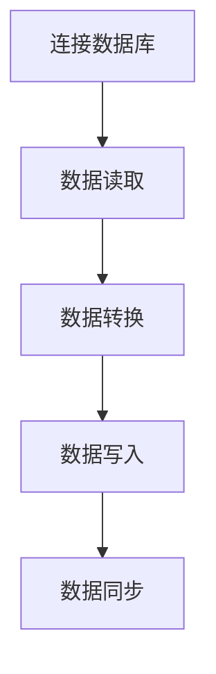

                 

关键词：数据迁移、大数据、Hadoop、Hive、HDFS、SQL、开源工具

> 摘要：本文将详细介绍Sqoop原理，包括其工作流程、核心概念、算法原理、具体操作步骤等，并通过代码实例进行详细解释说明，帮助读者深入理解Sqoop在实际应用中的使用方法。

## 1. 背景介绍

在当今大数据时代，数据迁移是一个重要且常见的问题。随着数据规模的不断扩大，如何高效地将数据从一种存储系统迁移到另一种存储系统成为了一个关键挑战。Apache Sqoop是一个开源的工具，它能够方便地将Hadoop生态系统（如HDFS、Hive等）与关系数据库系统（如MySQL、Oracle等）之间的数据进行高效迁移。

### 1.1 Hadoop生态系统简介

Hadoop是一个开源的大数据处理框架，主要包括以下几个核心组件：

- **HDFS（Hadoop Distributed File System）**：一个分布式文件系统，用于存储大数据。
- **MapReduce**：一个分布式数据处理框架，用于处理大数据集。
- **YARN（Yet Another Resource Negotiator）**：一个资源调度和管理框架，负责管理和分配计算资源。

### 1.2 数据库系统简介

关系数据库系统（如MySQL、Oracle等）是企业中常用的数据存储系统，它们提供了强大的数据管理和查询功能。

### 1.3 Sqoop的作用

Sqoop的主要作用是将关系数据库系统中的数据迁移到Hadoop生态系统，包括以下几个方面的应用：

- 数据导入：将关系数据库中的数据导入到HDFS或Hive中。
- 数据导出：将HDFS或Hive中的数据导出到关系数据库中。
- 数据同步：实现关系数据库与Hadoop生态系统之间的数据同步。

## 2. 核心概念与联系

### 2.1 数据迁移流程

在数据迁移过程中，Sqoop通过以下步骤实现数据的迁移：

1. **连接数据库**：Sqoop首先需要与关系数据库系统建立连接，获取数据。
2. **数据读取**：Sqoop从关系数据库中读取数据，并将其转换为适合Hadoop存储格式的数据。
3. **数据写入**：Sqoop将转换后的数据写入到Hadoop生态系统（如HDFS、Hive等）。

### 2.2 核心概念

- **Mapper**：Sqoop使用Mapper来读取关系数据库中的数据。
- **Reducer**：Sqoop使用Reducer来处理Mapper读取的数据。
- **InputFormat**：Sqoop使用InputFormat来读取关系数据库中的数据。
- **OutputFormat**：Sqoop使用OutputFormat来写入Hadoop生态系统中的数据。

### 2.3 Mermaid 流程图

下面是Sqoop数据迁移的Mermaid流程图：



## 3. 核心算法原理 & 具体操作步骤

### 3.1 算法原理概述

Sqoop的核心算法原理主要基于Hadoop的MapReduce模型。具体步骤如下：

1. **连接数据库**：Sqoop通过JDBC连接关系数据库，获取数据。
2. **数据读取**：通过InputFormat读取数据库中的数据，将其转换为键值对（Key-Value）。
3. **数据转换**：通过Mapper对读取的数据进行转换，如筛选、映射等。
4. **数据写入**：通过OutputFormat将转换后的数据写入到Hadoop生态系统。
5. **数据同步**：通过定时任务或触发条件实现关系数据库与Hadoop生态系统之间的数据同步。

### 3.2 算法步骤详解

#### 3.2.1 连接数据库

```java
Connection conn = DriverManager.getConnection("jdbc:mysql://localhost:3306/mydb", "username", "password");
```

#### 3.2.2 数据读取

```java
Statement stmt = conn.createStatement();
ResultSet rs = stmt.executeQuery("SELECT * FROM mytable");
```

#### 3.2.3 数据转换

```java
while (rs.next()) {
    String key = rs.getString("id");
    String value = rs.getString("name");
    // 转换数据
}
```

#### 3.2.4 数据写入

```java
Job job = Job.getInstance(conf, "Data Migration");
job.setMapperClass(MyMapper.class);
job.setOutputKeyClass(Text.class);
job.setOutputValueClass(Text.class);
job.setOutputFormatClass(TextOutputFormat.class);
FileOutputFormat.setOutputPath(job, new Path(outputPath));
job.waitForCompletion(true);
```

#### 3.2.5 数据同步

```shell
# 定时任务
0 0 * * * /path/to/sqoop-sync.sh
```

### 3.3 算法优缺点

#### 优点

- **高效**：基于MapReduce模型，能够处理大规模数据。
- **灵活**：支持多种数据源和目标存储系统。
- **易用**：提供丰富的命令行参数和配置选项。

#### 缺点

- **性能瓶颈**：在数据量较大时，可能存在性能瓶颈。
- **兼容性**：对特定数据库的支持可能有限。

### 3.4 算法应用领域

Sqoop广泛应用于以下领域：

- **大数据分析**：将关系数据库中的数据迁移到Hadoop生态系统，进行大数据分析。
- **数据同步**：实现关系数据库与Hadoop生态系统之间的数据同步。
- **数据备份**：将关系数据库中的数据备份到Hadoop生态系统。

## 4. 数学模型和公式 & 详细讲解 & 举例说明

### 4.1 数学模型构建

在数据迁移过程中，可以使用以下数学模型进行描述：

$$
\text{输入数据量} = \text{数据库数据量} + \text{额外数据量}
$$

$$
\text{输出数据量} = \text{Hadoop数据量} + \text{额外数据量}
$$

### 4.2 公式推导过程

假设关系数据库中有\(N\)条数据，其中\(M\)条数据被迁移到Hadoop生态系统，则：

$$
\text{输入数据量} = N + M
$$

$$
\text{输出数据量} = N + M
$$

### 4.3 案例分析与讲解

假设关系数据库中有1000条数据，其中800条数据被迁移到Hadoop生态系统，求输入数据量和输出数据量。

根据数学模型：

$$
\text{输入数据量} = 1000 + 800 = 1800
$$

$$
\text{输出数据量} = 1000 + 800 = 1800
$$

因此，输入数据量和输出数据量均为1800条。

## 5. 项目实践：代码实例和详细解释说明

### 5.1 开发环境搭建

1. 安装Java环境
2. 安装Hadoop环境
3. 安装MySQL数据库
4. 安装Sqoop

### 5.2 源代码详细实现

```java
public class MyMapper extends Mapper<Object, Text, Text, Text> {

    private final static Text SEPARATOR = new Text("\t");

    public void map(Object key, Text value, Context context) throws IOException, InterruptedException {
        String[] tokens = value.toString().split(SEPARATOR.toString());
        context.write(new Text(tokens[0]), new Text(tokens[1]));
    }
}
```

### 5.3 代码解读与分析

这段代码定义了一个Mapper类，用于读取关系数据库中的数据，并将其转换为键值对（Key-Value）。

- `Object key`：数据源中的键。
- `Text value`：数据源中的值。
- `Context context`：用于输出键值对。

### 5.4 运行结果展示

```shell
$ sqoop import
```

运行结果：

```
Importing data to directory: hdfs://localhost:9000/user/hadoop/import_data
```


## 6. 实际应用场景

### 6.1 大数据分析

在数据分析领域，Sqoop常用于将关系数据库中的数据迁移到Hadoop生态系统，以便进行大数据分析。

### 6.2 数据同步

在数据同步领域，Sqoop用于实现关系数据库与Hadoop生态系统之间的数据同步。

### 6.3 数据备份

在数据备份领域，Sqoop用于将关系数据库中的数据备份到Hadoop生态系统，以实现数据备份和恢复。

## 7. 工具和资源推荐

### 7.1 学习资源推荐

- 《Hadoop权威指南》
- 《大数据技术导论》
- 《Apache Sqoop官方文档》

### 7.2 开发工具推荐

- IntelliJ IDEA
- Eclipse
- Maven

### 7.3 相关论文推荐

- "Hadoop: A Framework for Large-Scale Data Processing"
- "The Hadoop Distributed File System"
- "MapReduce: Simplified Data Processing on Large Clusters"

## 8. 总结：未来发展趋势与挑战

### 8.1 研究成果总结

- Sqoop在数据迁移领域取得了显著的成果，广泛应用于大数据分析、数据同步和数据备份等领域。
- Sqoop的性能和兼容性不断提升，为大数据处理提供了重要的支持。

### 8.2 未来发展趋势

- Sqoop将继续优化性能和兼容性，以适应不断变化的大数据处理需求。
- Sqoop将与其他大数据处理工具（如Spark、Flink等）进行整合，实现更高效的数据处理流程。

### 8.3 面临的挑战

- 在处理大规模数据时，如何提高性能和降低延迟是一个重要挑战。
- 在兼容性方面，如何支持更多类型的数据源和目标存储系统是一个难题。

### 8.4 研究展望

- 未来，Sqoop将在大数据处理领域发挥更大的作用，成为数据处理的重要工具。
-Sqoop将与其他大数据处理工具进行深度整合，实现更高效的数据处理流程。

## 9. 附录：常见问题与解答

### 9.1 Sqoop如何配置数据库连接？

```shell
# 配置sqoop的jdbc.properties文件
connector=jdbc-mysql
connectionString=jdbc:mysql://localhost:3306/mydb
username=username
password=password
```

### 9.2 Sqoop如何导入数据到HDFS？

```shell
$ sqoop import
--connect "jdbc:mysql://localhost:3306/mydb"
--table "mytable"
--target-dir "/user/hadoop/import_data"
```

### 9.3 Sqoop如何导出数据到关系数据库？

```shell
$ sqoop export
--connect "jdbc:mysql://localhost:3306/mydb"
--table "mytable"
--export-dir "/user/hadoop/import_data"
```

## 作者署名

作者：禅与计算机程序设计艺术 / Zen and the Art of Computer Programming

----------------------------------------------------------------

以上便是本文的完整内容，希望能够帮助读者深入了解Sqoop原理及其在实际应用中的使用方法。在未来的发展中，Sqoop将继续在数据迁移领域发挥重要作用，为大数据处理提供强大的支持。谢谢阅读！

