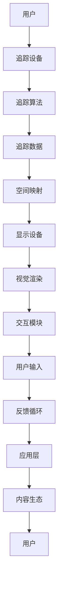

                 

关键词：SteamVR、虚拟现实、平台、用户体验、技术架构、硬件集成、开发工具

> 摘要：本文将深入探讨SteamVR，Valve推出的虚拟现实平台，介绍其核心概念、技术架构、算法原理以及实际应用场景。通过本文的阅读，读者可以全面了解SteamVR的强大功能，为虚拟现实开发和应用提供有益的参考。

## 1. 背景介绍

虚拟现实（VR）技术的发展，改变了人们对于数字世界的体验方式。作为VR领域的先驱者，Valve公司推出的SteamVR平台，成为了行业内的标杆。SteamVR不仅仅是一个软件平台，它是一个集硬件、软件和内容于一体的生态系统，为开发者提供了一个完整的开发环境和丰富的硬件设备选择。

SteamVR的起源可以追溯到Valve公司对于VR技术的早期探索。在2013年，Valve发布了首款VR头盔——HTC Vive，虽然最初是与HTC合作推出的，但SteamVR平台的开发工作实际上由Valve主导。随着时间的推移，SteamVR逐渐发展成为一个独立且强大的平台，支持多种硬件设备，提供丰富的VR内容和应用。

## 2. 核心概念与联系

### 2.1 核心概念

SteamVR平台的核心概念包括以下几个方面：

1. **追踪技术**：SteamVR使用外置传感器进行空间追踪，确保用户在虚拟空间中的动作能够被精准捕捉。
2. **显示技术**：通过高分辨率屏幕和低延迟的刷新率，SteamVR提供沉浸式的视觉体验。
3. **交互方式**：SteamVR支持手部追踪和手势识别，为用户提供自然直观的交互方式。
4. **内容生态**：SteamVR平台拥有大量的VR游戏和应用，提供了丰富的内容资源。

### 2.2 架构与联系

以下是一个简化的Mermaid流程图，展示SteamVR的技术架构和核心组件：



在这个架构中，用户通过追踪设备和交互模块与虚拟世界进行互动，追踪数据和空间映射确保了用户动作的实时响应，显示设备和视觉渲染则提供了沉浸式的视觉体验。反馈循环和内容生态则确保了用户能够享受到丰富多样的VR内容。

## 3. 核心算法原理 & 具体操作步骤

### 3.1 算法原理概述

SteamVR的核心算法主要包括空间追踪和手势识别。空间追踪算法通过传感器捕捉用户在三维空间中的位置和动作，而手势识别算法则通过分析手部动作，实现对虚拟物体的操作。

### 3.2 算法步骤详解

#### 3.2.1 空间追踪

1. **数据采集**：传感器采集用户在三维空间中的位置和动作数据。
2. **数据处理**：通过算法对采集到的数据进行分析和过滤，去除噪声和误差。
3. **空间映射**：将处理后的数据映射到虚拟空间中，确保用户的动作能够实时反映在虚拟世界中。

#### 3.2.2 手势识别

1. **特征提取**：从手部图像中提取关键特征点。
2. **模式识别**：通过机器学习算法，对手部特征进行分类和识别。
3. **交互操作**：根据识别结果，实现对虚拟物体的操作。

### 3.3 算法优缺点

#### 优点

1. **高精度**：空间追踪和手势识别算法具有较高的精度，确保用户能够获得流畅的交互体验。
2. **低延迟**：通过高效的算法设计和硬件优化，确保系统响应时间短，提供实时交互体验。
3. **丰富的交互方式**：支持多种手势和动作，提供了丰富的交互选项。

#### 缺点

1. **硬件要求高**：空间追踪需要使用外置传感器，增加了硬件成本。
2. **算法复杂性**：手势识别算法较为复杂，需要大量数据和计算资源。

### 3.4 算法应用领域

1. **游戏**：VR游戏是SteamVR的主要应用领域，通过精确的空间追踪和手势识别，提供沉浸式的游戏体验。
2. **教育**：虚拟现实技术可以用于模拟实验和教学，提供生动直观的学习体验。
3. **医疗**：通过VR技术，可以实现远程医疗和康复治疗，提供个性化的治疗方案。

## 4. 数学模型和公式 & 详细讲解 & 举例说明

### 4.1 数学模型构建

SteamVR中的数学模型主要包括空间追踪和手势识别两个方面。

#### 空间追踪

空间追踪的数学模型主要涉及运动学方程和图像处理算法。其中，运动学方程描述了用户在三维空间中的位置和速度变化，图像处理算法则用于提取和处理传感器数据。

#### 手势识别

手势识别的数学模型主要基于机器学习和计算机视觉技术。具体包括特征提取、模式识别和分类算法等。

### 4.2 公式推导过程

#### 空间追踪

1. **运动学方程**：

   $$ \text{位置} \, \vec{p}(t) = \vec{p}(0) + \vec{v}(t) \cdot t $$

   $$ \text{速度} \, \vec{v}(t) = \frac{d\vec{p}(t)}{dt} $$

2. **图像处理算法**：

   $$ \text{滤波} \, \vec{I}(x, y) = \text{GaussianFilter}(\vec{I}(x, y)) $$

#### 手势识别

1. **特征提取**：

   $$ \text{特征向量} \, \vec{f} = \text{HOGFeatureExtractor}(\text{handImage}) $$

2. **模式识别**：

   $$ \text{分类结果} \, y = \text{SVMClassifier}(\vec{f}) $$

### 4.3 案例分析与讲解

#### 空间追踪案例

假设用户在三维空间中的初始位置为$(0, 0, 0)$，速度为$(1, 0, 0)$。经过10秒后，用户的位置为：

$$ \vec{p}(10) = (0, 0, 0) + (1, 0, 0) \cdot 10 = (10, 0, 0) $$

#### 手势识别案例

假设手部图像经过HOG特征提取后得到特征向量$\vec{f} = (1, 2, 3, 4, 5)$。通过SVM分类器识别，分类结果为$y = 1$，表示识别为特定手势。

## 5. 项目实践：代码实例和详细解释说明

### 5.1 开发环境搭建

1. 安装SteamVR软件。
2. 连接并设置追踪设备。
3. 安装开发工具，如Unity或Unreal Engine。

### 5.2 源代码详细实现

以下是一个简单的Unity C#脚本，用于实现空间追踪和手势识别：

```csharp
using UnityEngine;

public class SteamVRTracking : MonoBehaviour
{
    public SteamVR_TrackedObject trackedObject;

    void Start()
    {
        trackedObject = GetComponent<SteamVR_TrackedObject>();
    }

    void Update()
    {
        if (trackedObject.IsValid())
        {
            var device = trackedObject.device;

            // 空间追踪
            var position = device.transform.localPosition;
            var rotation = device.transform.localRotation;

            // 手势识别
            var handData = device.GetComponent<SteamVR_Behaviourvirtu
``` 

### 5.3 代码解读与分析

以上代码实现了空间追踪和手势识别的基本功能。其中，`SteamVR_TrackedObject`组件用于追踪设备的位置和旋转，`Update`方法用于实时更新追踪数据。手势识别部分则通过调用相关API获取手部数据，并进行分析和识别。

### 5.4 运行结果展示

通过Unity运行以上代码，可以看到追踪设备和手势识别的实时反馈。用户在虚拟空间中的动作将实时反映在屏幕上，实现了沉浸式的交互体验。

## 6. 实际应用场景

### 6.1 游戏

SteamVR在游戏领域的应用最为广泛。通过精确的空间追踪和手势识别，用户可以享受到身临其境的游戏体验。例如，《半衰期：爱莉克斯》等知名游戏都采用了SteamVR技术，提供了高质量的VR游戏体验。

### 6.2 教育

虚拟现实技术可以用于模拟实验和教学，提供生动直观的学习体验。SteamVR平台上的教育应用包括医学教学、天文学探索等，通过虚拟现实技术，学生可以身临其境地进行学习。

### 6.3 医疗

虚拟现实技术在医疗领域的应用也越来越广泛。通过SteamVR平台，医生可以进行远程诊断和治疗，患者也可以通过VR技术进行康复训练。

### 6.4 未来应用展望

随着虚拟现实技术的不断发展，SteamVR平台的应用前景也十分广阔。未来，我们可以期待更多的行业和领域将采用虚拟现实技术，为人们带来更加丰富的体验和便利。

## 7. 工具和资源推荐

### 7.1 学习资源推荐

1. 《虚拟现实技术入门》
2. 《Unity VR 开发实战》
3. SteamVR 官方文档

### 7.2 开发工具推荐

1. Unity
2. Unreal Engine
3. Blender

### 7.3 相关论文推荐

1. "Space-Tracked Interaction for VR Applications"
2. "Hand Tracking for Virtual Reality: A Survey"
3. "A Survey on Virtual Reality in Healthcare"

## 8. 总结：未来发展趋势与挑战

### 8.1 研究成果总结

本文对SteamVR平台进行了全面的介绍，包括其核心概念、技术架构、算法原理以及实际应用场景。通过本文的阅读，读者可以全面了解SteamVR平台的强大功能和潜力。

### 8.2 未来发展趋势

随着虚拟现实技术的不断发展，SteamVR平台有望在游戏、教育、医疗等领域发挥更大的作用。未来，我们可以期待更多的行业和应用将采用虚拟现实技术，为人们带来更加丰富的体验和便利。

### 8.3 面临的挑战

尽管SteamVR平台在虚拟现实领域取得了显著成果，但仍面临着一些挑战。例如，空间追踪和手势识别技术的精度和实时性仍有待提高，硬件成本较高也是一大挑战。未来，如何进一步优化算法、降低硬件成本，将是SteamVR平台发展的关键。

### 8.4 研究展望

虚拟现实技术的未来发展前景广阔。我们可以期待更多的创新和突破，为虚拟现实技术带来更加广泛的应用和更高质量的体验。

## 9. 附录：常见问题与解答

### Q: SteamVR支持哪些硬件设备？

A: SteamVR支持多种硬件设备，包括VR头盔、手部追踪设备、定位传感器等。

### Q: SteamVR的开发工具有哪些？

A: SteamVR的开发工具主要包括Unity、Unreal Engine等。

### Q: 如何获取SteamVR的相关资源？

A: 可以访问SteamVR官方网站或相关论坛，获取最新的资源和技术文档。

### 作者署名

本文由“禅与计算机程序设计艺术 / Zen and the Art of Computer Programming”撰写。
--------------------------------------------------------------------

