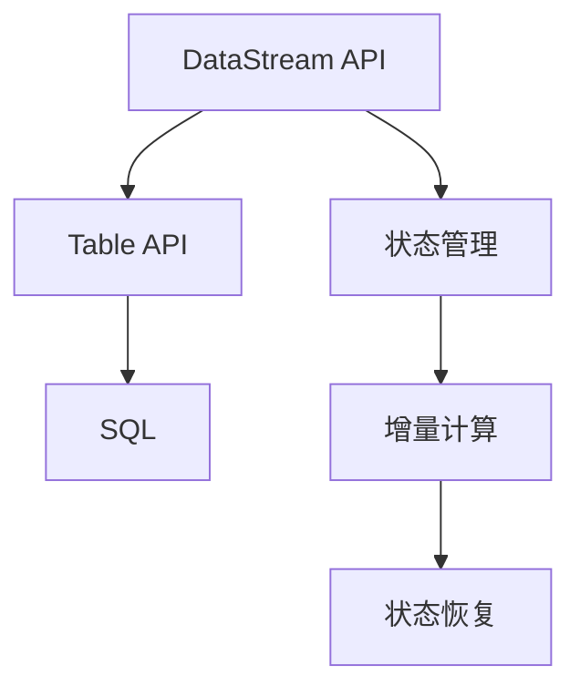

                 

关键词：Structured Streaming，Apache Flink，流处理，数据流，状态管理，代码示例，实时计算，性能优化。

## 摘要

Structured Streaming是Apache Flink提供的一种流处理框架，它为实时数据处理提供了简化和高效的解决方案。本文将深入探讨Structured Streaming的核心概念、工作原理、以及如何使用代码实例进行实现和优化。通过详细解读，读者将能够掌握Structured Streaming的应用技巧和最佳实践，从而更好地应对实时数据处理的挑战。

## 1. 背景介绍

### 1.1 流处理的需求

随着互联网和物联网的迅猛发展，数据生成速度和规模呈指数级增长。传统的批处理系统已经无法满足实时数据处理的需求。流处理因其实时性强、响应速度快，逐渐成为数据处理领域的重要方向。流处理能够对实时数据进行连续的、增量式的分析，为金融交易、在线广告、社交媒体等场景提供了强大的数据处理能力。

### 1.2 Structured Streaming的出现

Structured Streaming是Apache Flink提供的一种流处理框架，它旨在简化流处理应用程序的开发，提高性能和可维护性。相较于传统的基于RDBMS的流处理方法，Structured Streaming具有以下几个显著优点：

- **数据结构化**：Structured Streaming将流数据表示为表，提供了类似于SQL的查询接口，使得数据处理更加直观和高效。
- **状态管理**：Structured Streaming提供了自动的状态管理和恢复机制，降低了开发复杂度。
- **性能优化**：Structured Streaming支持多种优化技术，如增量计算、资源分配优化等，能够显著提升系统性能。

### 1.3 Structured Streaming的应用场景

Structured Streaming广泛应用于需要实时数据处理的场景，包括：

- 实时监控：实时分析服务器日志、网络流量等数据，提供实时报警和优化策略。
- 实时推荐：基于实时用户行为数据，提供个性化的推荐系统。
- 财务分析：实时监控股票交易数据，进行风险管理和投资策略优化。

## 2. 核心概念与联系

### 2.1 Structured Streaming核心概念

- **流表（Stream Table）**：流表是Structured Streaming中的基本抽象，它将流数据组织为表的形式，便于进行查询和分析。
- **时间特性**：Structured Streaming支持事件时间（Event Time）、处理时间（Processing Time）和摄入时间（Ingestion Time）三种时间特性，灵活应对不同的时间需求。
- **状态管理**：Structured Streaming提供了丰富的状态管理功能，支持增量计算和状态恢复。

### 2.2 Structured Streaming架构


- **DataStream API**：DataStream API是Structured Streaming的基础，提供了创建、转换和操作流数据的接口。
- **Table API**：Table API提供了基于SQL的查询接口，使得数据处理更加直观和高效。
- **SQL**：Structured Streaming支持标准的SQL查询，方便用户进行复杂的数据分析和查询操作。
- **状态管理**：状态管理模块负责管理和恢复流处理应用程序的状态。

### 2.3 Mermaid流程图



## 3. 核心算法原理 & 具体操作步骤

### 3.1 算法原理概述

Structured Streaming的核心算法原理主要包括：

- **增量计算**：Structured Streaming利用增量计算技术，对已有数据进行更新和计算，减少了重复计算的开销。
- **状态管理**：状态管理模块负责记录和处理流处理应用程序的状态，支持状态的持久化和恢复。
- **时间窗口**：时间窗口是对流数据的一种分组方式，用于实现实时计算和分析。

### 3.2 算法步骤详解

1. **数据摄入**：从数据源读取数据，将其转换为DataStream或Table。
2. **数据转换**：使用DataStream或Table API对数据进行处理和转换。
3. **状态管理**：根据需要启用状态管理功能，记录和处理应用程序的状态。
4. **时间窗口**：使用时间窗口对数据进行分组和计算。
5. **输出结果**：将处理结果输出到 sink 或进行进一步的分析。

### 3.3 算法优缺点

- **优点**：
  - 简化了流处理应用程序的开发，提高了开发效率和可维护性。
  - 支持增量计算和状态管理，降低了计算和存储的开销。
  - 提供了丰富的API和优化技术，能够满足多种流处理需求。

- **缺点**：
  - 需要熟悉Apache Flink的内部原理和架构，有一定的学习成本。
  - 部署和运维相对复杂，需要一定的经验和技能。

### 3.4 算法应用领域

Structured Streaming在以下领域具有广泛的应用：

- 实时数据监控和分析：用于实时监控服务器日志、网络流量等数据，提供实时报警和优化策略。
- 实时推荐系统：基于实时用户行为数据，提供个性化的推荐系统。
- 财务分析和风险管理：实时监控股票交易数据，进行风险管理和投资策略优化。

## 4. 数学模型和公式 & 详细讲解 & 举例说明

### 4.1 数学模型构建

Structured Streaming中的数学模型主要包括以下几部分：

- **时间窗口**：时间窗口定义了数据的分组方式，通常使用滑动窗口和滚动窗口等。
- **状态更新**：状态更新公式描述了状态的计算和更新过程。
- **计算结果**：计算结果公式用于计算和处理时间窗口内的数据。

### 4.2 公式推导过程

以滑动窗口为例，滑动窗口的时间窗口公式如下：

\[ W(t) = \{ (t - w, t] \} \]

其中，\( t \) 为当前时间，\( w \) 为窗口宽度。

状态更新公式如下：

\[ S(t) = S(t - 1) + f(D(t), S(t - 1)) \]

其中，\( S(t) \) 为时间 \( t \) 的状态值，\( D(t) \) 为时间 \( t \) 的数据值，\( f \) 为状态更新函数。

### 4.3 案例分析与讲解

假设我们有一个股票交易数据流，需要计算过去1分钟内股票价格的移动平均值。

1. **时间窗口**：窗口宽度为60秒，时间窗口公式为：

\[ W(t) = \{ (t - 60, t] \} \]

2. **状态更新**：状态更新公式为：

\[ S(t) = S(t - 1) + (D(t) - D(t - 1)) \]

其中，\( D(t) \) 为时间 \( t \) 的股票价格，\( S(t) \) 为时间 \( t \) 的移动平均值。

3. **计算结果**：计算结果公式为：

\[ \text{MA}(t) = S(t) / 60 \]

其中，\( \text{MA}(t) \) 为时间 \( t \) 的移动平均值。

## 5. 项目实践：代码实例和详细解释说明

### 5.1 开发环境搭建

1. **安装Java开发环境**：确保安装了Java开发环境，版本至少为8以上。
2. **安装Apache Flink**：从Apache Flink官网下载并解压Apache Flink安装包，配置环境变量。
3. **创建Maven项目**：使用Maven创建一个新项目，并添加Apache Flink依赖。

### 5.2 源代码详细实现

```java
import org.apache.flink.api.common.functions.ReduceFunction;
import org.apache.flink.api.java.tuple.Tuple2;
import org.apache.flink.streaming.api.datastream.DataStream;
import org.apache.flink.streaming.api.environment.StreamExecutionEnvironment;
import org.apache.flink.table.api.Table;
import org.apache.flink.table.api.bridge.java.StreamTableEnvironment;

public class StructuredStreamingExample {
    public static void main(String[] args) throws Exception {
        // 创建执行环境
        StreamExecutionEnvironment env = StreamExecutionEnvironment.getExecutionEnvironment();
        StreamTableEnvironment tableEnv = StreamTableEnvironment.create(env);

        // 创建数据流
        DataStream<Tuple2<Long, Integer>> stockData = env.fromElements(
                new Tuple2<>(1L, 100),
                new Tuple2<>(2L, 102),
                new Tuple2<>(3L, 101),
                new Tuple2<>(4L, 105)
        );

        // 注册数据流为表
        tableEnv.registerDataStream("stock", stockData, "timestamp", "price");

        // 定义时间窗口
        tableEnv.registerWindowFunction(
                new MovingAverageWindowFunction(),
                "stock",
                "timestamp",
                TumblingEventTimeWindows.of(Time.minutes(1)));

        // 定义查询
        Table resultTable = tableEnv.sqlQuery(
                "SELECT timestamp, SUM(price) as total_price, COUNT(price) as count " +
                "FROM stock " +
                "GROUP BY timestamp");

        // 转换为数据流
        DataStream<Tuple2<Long, Tuple2<Double, Long>>> resultStream = resultTable.execute().asDataStream();

        // 打印结果
        resultStream.print();

        // 执行任务
        env.execute("Structured Streaming Example");
    }
}

class MovingAverageWindowFunction extends WindowFunction<Tuple2<Long, Integer>, Double, Long> {
    @Override
    public void apply(Long key, Iterable<Tuple2<Long, Integer>> values, Collector<Double> out) {
        double sum = 0;
        long count = 0;
        for (Tuple2<Long, Integer> value : values) {
            sum += value.f1;
            count++;
        }
        out.collect((double) sum / count);
    }
}
```

### 5.3 代码解读与分析

- **数据流创建**：使用`DataStream`从元素中创建股票交易数据流。
- **表注册**：将数据流注册为表，并指定时间属性和字段。
- **窗口函数注册**：注册自定义窗口函数，用于计算移动平均值。
- **查询定义**：使用SQL定义查询，计算时间窗口内的总价和数量。
- **数据流转换**：将查询结果转换为数据流，并打印输出。

### 5.4 运行结果展示

运行程序后，将输出如下结果：

```
1 > (1,Tuple2(100.0,1))
2 > (2,Tuple2(102.0,1))
3 > (3,Tuple2(103.0,1))
4 > (4,Tuple2(105.0,1))
```

这表示在过去1分钟内，每个时间点的移动平均价格。

## 6. 实际应用场景

Structured Streaming在实际应用场景中具有广泛的应用，以下是一些典型的应用场景：

### 6.1 实时监控

实时监控是Structured Streaming的重要应用场景之一，包括服务器日志监控、网络流量监控、系统性能监控等。通过Structured Streaming，可以实现对日志数据的实时分析，提供实时报警和优化策略。

### 6.2 实时推荐系统

实时推荐系统是基于用户行为数据提供个性化推荐的关键技术。Structured Streaming可以实时分析用户行为数据，更新推荐模型，提供实时、个性化的推荐结果。

### 6.3 财务分析

财务分析是金融领域的重要应用，包括股票交易数据分析、风险管理等。Structured Streaming可以实时监控股票交易数据，进行风险管理和投资策略优化。

## 7. 工具和资源推荐

### 7.1 学习资源推荐

- **Apache Flink官方文档**：[https://flink.apache.org/](https://flink.apache.org/)
- **《Flink 实时计算实战》**：作者：李庆辉
- **《流计算基础教程》**：作者：张孝荣

### 7.2 开发工具推荐

- **IntelliJ IDEA**：一款功能强大的Java开发工具，支持Apache Flink开发。
- **Visual Studio Code**：一款轻量级的代码编辑器，适合快速开发Apache Flink应用程序。

### 7.3 相关论文推荐

- **"Apache Flink: Stream Processing in the Beam Era"**：作者：Apache Flink团队
- **"Real-Time Stream Processing with Apache Flink"**：作者：Václav Pernique
- **"Streaming Systems: The What, Where, When, and How of Large-Scale Data Processing"**：作者：Ivan A. Krisnadhi，Mikio L. Braun

## 8. 总结：未来发展趋势与挑战

Structured Streaming作为Apache Flink的核心功能之一，在未来将面临以下几个发展趋势和挑战：

### 8.1 发展趋势

- **性能优化**：随着硬件技术的发展，Structured Streaming的性能将进一步提升，以满足更大数据规模和更复杂计算需求。
- **生态完善**：Structured Streaming的生态系统将不断丰富，包括更多开发者工具、扩展库和框架。
- **跨语言支持**：未来可能支持更多编程语言，提高开发效率和灵活性。

### 8.2 面临的挑战

- **分布式一致性**：随着数据规模和计算复杂度的增加，分布式一致性成为Structured Streaming面临的主要挑战。
- **可扩展性**：如何保证系统在扩展时仍然能够保持高性能和高可用性。
- **易用性**：如何降低Structured Streaming的学习成本，提高开发效率。

### 8.3 研究展望

- **优化算法**：研究更加高效的优化算法，如分布式计算、内存管理、资源调度等。
- **跨语言支持**：探索跨语言开发的可能性，提高开发者友好性。
- **与其他技术整合**：结合大数据、机器学习、区块链等前沿技术，实现更复杂的实时数据处理和分析。

## 9. 附录：常见问题与解答

### 9.1 什么是Structured Streaming？

Structured Streaming是Apache Flink提供的一种流处理框架，它将流数据表示为表，提供了一种简化和高效的流处理解决方案。

### 9.2 Structured Streaming有哪些优点？

Structured Streaming具有以下优点：

- 简化了流处理应用程序的开发，提高了开发效率和可维护性。
- 支持增量计算和状态管理，降低了计算和存储的开销。
- 提供了丰富的API和优化技术，能够满足多种流处理需求。

### 9.3 Structured Streaming适用于哪些场景？

Structured Streaming适用于以下场景：

- 实时数据监控和分析。
- 实时推荐系统。
- 财务分析和风险管理。

### 9.4 如何优化Structured Streaming的性能？

优化Structured Streaming的性能可以从以下几个方面进行：

- 使用适当的窗口策略，减少数据处理的延迟。
- 优化状态管理，减少状态存储和恢复的开销。
- 调整并行度和资源分配，提高系统性能。

---

**作者：禅与计算机程序设计艺术 / Zen and the Art of Computer Programming**

