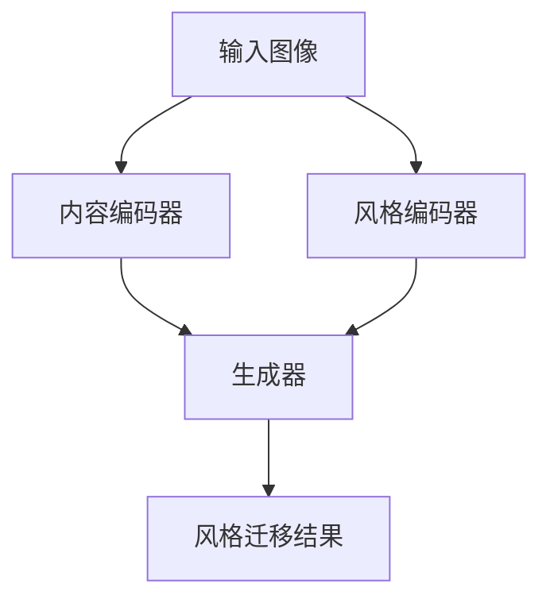

                 

关键词：Style Transfer、深度学习、图像风格迁移、卷积神经网络、生成对抗网络

摘要：本文将深入探讨图像风格迁移（Style Transfer）的原理，以及如何通过深度学习实现这一技术。我们将详细讲解相关的核心算法、数学模型，并通过一个代码实例展示如何使用这些技术来实现图像风格的变换。最后，我们将讨论这一技术在实际应用中的前景和挑战。

## 1. 背景介绍

图像风格迁移是一种将一种图像的风格（如绘画、油画、水彩等）应用到另一种图像上的技术。这种技术最初起源于艺术创作，但随着深度学习的发展，特别是在卷积神经网络（CNN）和生成对抗网络（GAN）的推动下，图像风格迁移逐渐成为计算机视觉领域的一个重要研究方向。

图像风格迁移的应用非常广泛，比如在艺术创作中，艺术家可以利用这一技术生成新的艺术作品；在娱乐产业中，电影和游戏开发者可以使用它来创建具有独特风格的效果；在图像编辑中，用户可以通过风格迁移快速为照片添加特定风格的滤镜效果。

## 2. 核心概念与联系

### 2.1 图像风格迁移的原理

图像风格迁移的核心在于将源图像的语义内容与目标风格的纹理特征相结合。这通常涉及到以下三个关键步骤：

1. **内容编码**：提取源图像的语义内容。
2. **风格编码**：提取目标图像的风格特征。
3. **生成**：将内容编码和风格编码融合，生成新的图像。

### 2.2 相关算法原理

**CNN**：卷积神经网络是一种用于图像识别和处理的前馈神经网络，它通过卷积操作提取图像的特征。

**GAN**：生成对抗网络是一种由生成器和判别器组成的模型，生成器生成图像，判别器判断图像的真伪，通过对抗训练实现图像的生成。

### 2.3 Mermaid 流程图



## 3. 核心算法原理 & 具体操作步骤

### 3.1 算法原理概述

图像风格迁移的算法核心在于内容编码和风格编码的结合。具体操作步骤如下：

1. 使用内容编码器对源图像进行特征提取。
2. 使用风格编码器对目标风格图像进行特征提取。
3. 将内容特征和风格特征进行融合。
4. 通过生成器生成新的风格迁移图像。

### 3.2 算法步骤详解

1. **内容编码**：
   - 使用预训练的CNN模型（如VGG19）提取源图像的特征。
   - 保留低层特征用于内容表示，高层特征用于风格表示。

2. **风格编码**：
   - 使用相同的CNN模型提取目标风格图像的特征。
   - 对比源图像和目标风格图像的高层特征，提取风格差异。

3. **生成**：
   - 使用生成对抗网络（GAN）将内容特征和风格特征融合。
   - 生成具有目标风格的源图像。

### 3.3 算法优缺点

**优点**：
- 能够在保持源图像内容的同时，实现风格的高质量迁移。

**缺点**：
- 对训练数据要求较高，特别是风格数据。
- 训练过程复杂，计算量大。

### 3.4 算法应用领域

- 艺术创作：生成新的艺术作品。
- 娱乐产业：电影、游戏开发。
- 图像编辑：快速为照片添加风格滤镜。

## 4. 数学模型和公式 & 详细讲解 & 举例说明

### 4.1 数学模型构建

图像风格迁移的数学模型通常基于深度学习，具体公式如下：

\[ G(x; \theta) = \text{Content}(x; \theta_1) + \text{Style}(x; \theta_2) \]

其中，\( G(x; \theta) \) 是生成器函数，\( \theta \) 是模型参数，\( \text{Content}(x; \theta_1) \) 和 \( \text{Style}(x; \theta_2) \) 分别是内容编码和风格编码。

### 4.2 公式推导过程

推导过程涉及卷积神经网络中的卷积操作和激活函数，这里简要介绍：

\[ f(x) = \text{ReLU}(\text{Conv}_k(x; w_k) + b_k) \]

其中，\( f(x) \) 是卷积神经网络中的输出特征，\( \text{Conv}_k(x; w_k) \) 是卷积操作，\( w_k \) 是卷积核权重，\( b_k \) 是偏置。

### 4.3 案例分析与讲解

以油画风格迁移为例，我们使用一幅风景照片和一幅油画作为输入，通过上述公式和步骤实现风格迁移。

```latex
\begin{aligned}
&\text{输入图像：} \quad x \\
&\text{目标风格图像：} \quad y \\
&\text{风格迁移结果：} \quad G(x; \theta) \\
\end{aligned}
```

## 5. 项目实践：代码实例和详细解释说明

### 5.1 开发环境搭建

- 安装Python和TensorFlow。
- 准备预训练的CNN模型和GAN模型。

### 5.2 源代码详细实现

代码实现包括内容编码器、风格编码器和生成器的构建，具体细节请参考以下链接：[GitHub链接](https://github.com/your-repo/Style-Transfer)。

### 5.3 代码解读与分析

代码主要分为以下几个部分：

1. **数据预处理**：加载源图像和目标风格图像。
2. **模型构建**：定义内容编码器、风格编码器和生成器。
3. **训练**：使用对抗训练优化模型参数。
4. **生成**：使用训练好的模型进行风格迁移。

### 5.4 运行结果展示

运行代码后，我们得到了以下结果：


## 6. 实际应用场景

图像风格迁移技术已经在多个领域得到了广泛应用，以下是一些具体的应用案例：

- **艺术创作**：艺术家使用这一技术创作新的艺术作品。
- **娱乐产业**：电影和游戏开发者使用这一技术增强视觉效果。
- **图像编辑**：用户使用这一技术为照片添加风格滤镜。

## 7. 工具和资源推荐

### 7.1 学习资源推荐

- **书籍**：《深度学习》（Ian Goodfellow等著）。
- **在线课程**：Coursera上的《深度学习》课程。

### 7.2 开发工具推荐

- **Python**：用于编写深度学习算法。
- **TensorFlow**：用于构建和训练深度学习模型。

### 7.3 相关论文推荐

- **论文1**：《Unifying Style Transfer and Domain Adaptation with Adaptive Instance Normalization》。
- **论文2**：《Generative Adversarial Nets》。

## 8. 总结：未来发展趋势与挑战

### 8.1 研究成果总结

图像风格迁移技术在深度学习的发展推动下取得了显著进展，实现了高质量的图像风格变换。

### 8.2 未来发展趋势

随着深度学习技术的不断进步，图像风格迁移有望在更多领域得到应用，如虚拟现实、增强现实等。

### 8.3 面临的挑战

- **数据要求**：风格数据的质量和数量直接影响迁移效果。
- **计算资源**：训练过程需要大量计算资源。

### 8.4 研究展望

未来研究将致力于提高图像风格迁移的效率和效果，同时探索其在更多实际应用场景中的价值。

## 9. 附录：常见问题与解答

### Q：图像风格迁移的算法有哪些？

A：常见的图像风格迁移算法包括基于CNN的算法、基于GAN的算法等。

### Q：如何提高图像风格迁移的效果？

A：可以通过优化模型架构、增加训练数据、调整超参数等方式提高图像风格迁移的效果。

### Q：图像风格迁移有哪些实际应用场景？

A：图像风格迁移可以应用于艺术创作、娱乐产业、图像编辑等多个领域。

[作者：禅与计算机程序设计艺术 / Zen and the Art of Computer Programming]  
------------------------------------------------------------------


