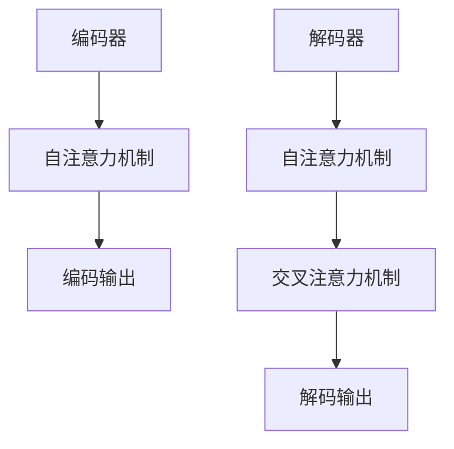
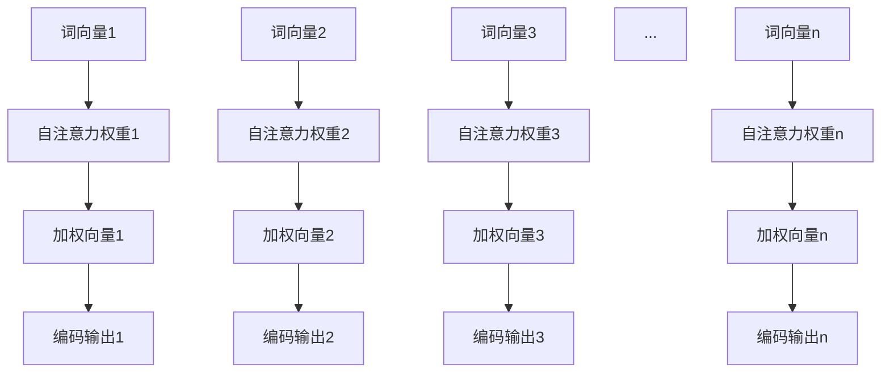
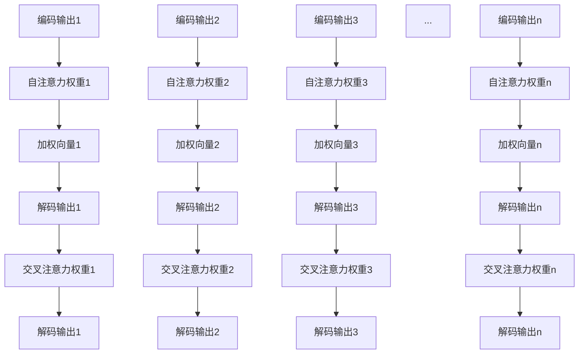
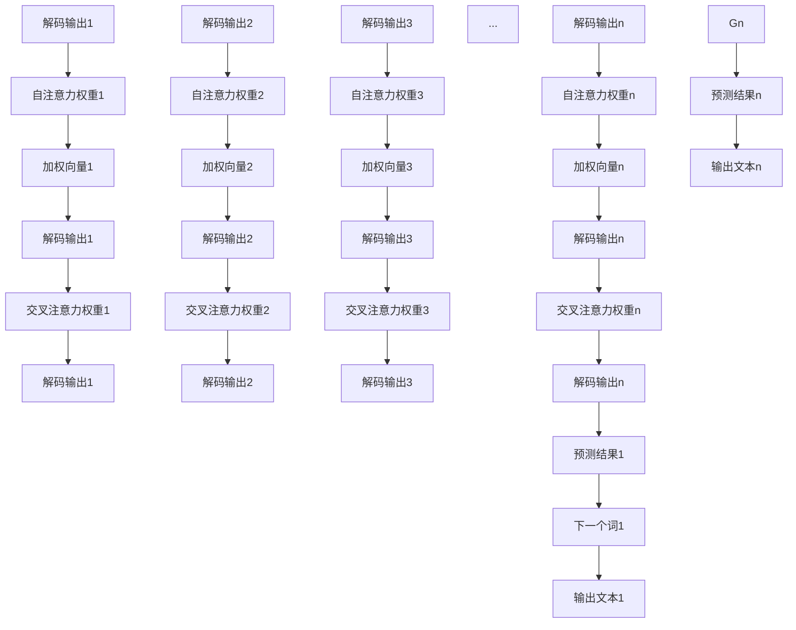

                 

关键词：T5、Text-to-Text Transfer Transformer、机器学习、自然语言处理、神经网络、深度学习

摘要：本文旨在详细探讨T5（Text-to-Text Transfer Transformer）模型的原理、构建方法及其在实际应用中的表现。通过深入分析T5模型的结构、核心算法和数学模型，本文将帮助读者理解T5在自然语言处理中的强大能力，并提供代码实例以便读者能够实际操作和体验T5模型。

## 1. 背景介绍

随着互联网和大数据技术的发展，自然语言处理（NLP）已成为人工智能领域的研究热点。传统的NLP方法依赖于规则和手工特征提取，但受限于性能和灵活性。随着深度学习的兴起，基于神经网络的NLP方法逐渐成为主流。其中，Transformer模型由于其优越的性能和结构优势，在NLP任务中取得了显著成果。

T5（Text-to-Text Transfer Transformer）是由Google推出的一种基于Transformer架构的通用预训练模型。T5的设计理念是利用Transformer模型强大的文本表示能力，实现各种NLP任务的一站式解决方案。T5通过统一的编码器-解码器架构，实现了从文本到文本的转换，为多种NLP任务提供了高效、灵活的解决方案。

## 2. 核心概念与联系

### 2.1 T5模型架构

T5模型的核心架构是Transformer编码器-解码器（Encoder-Decoder）结构，其基本原理如下：

- **编码器（Encoder）**：将输入的文本序列编码为固定长度的向量序列。编码器通过自注意力机制（Self-Attention）捕捉文本序列中的长距离依赖关系。
- **解码器（Decoder）**：将编码器的输出作为输入，通过解码器的自注意力机制和交叉注意力机制（Cross-Attention）生成输出文本序列。解码器的自注意力机制帮助模型捕捉输入文本序列中的上下文信息，而交叉注意力机制则帮助模型在生成过程中利用编码器的输出。

T5模型架构的Mermaid流程图如下：



### 2.2 T5模型核心算法

T5模型的核心算法是基于Transformer模型。Transformer模型的主要创新点在于其自注意力机制（Self-Attention）和多头注意力（Multi-Head Attention）机制。

- **自注意力机制**：自注意力机制是一种计算输入序列中每个词与其他词之间的关系的方法。通过计算词与词之间的相似度，模型可以更好地捕捉文本序列中的依赖关系。
- **多头注意力**：多头注意力机制将输入序列分成多个头（Head），每个头都独立计算注意力权重。这样可以捕捉到不同类型的依赖关系，提高模型的表示能力。

T5模型在Transformer模型的基础上，进一步引入了**位置编码**（Positional Encoding）和**门控循环单元**（Gated Recurrent Unit, GRU）等机制，以增强模型的性能。

## 3. 核心算法原理 & 具体操作步骤

### 3.1 算法原理概述

T5模型的工作原理可以概括为以下几个步骤：

1. **输入编码**：将输入文本序列编码为词向量。词向量可以通过预训练模型（如BERT）获得。
2. **编码器处理**：编码器通过自注意力机制处理词向量序列，生成编码输出。
3. **解码器处理**：解码器在生成过程中，首先通过自注意力机制处理编码输出，然后通过交叉注意力机制利用编码输出生成输出文本序列。
4. **输出生成**：解码器根据生成文本序列的预测结果，逐步生成最终输出文本。

### 3.2 算法步骤详解

#### 3.2.1 输入编码

输入编码是将输入文本序列编码为词向量。词向量可以通过预训练模型（如BERT）获得。BERT模型对输入文本进行Tokenization操作，将文本序列拆分为Token序列。然后，将每个Token映射为对应的词向量。

```latex
Token \rightarrow Word \rightarrow Word \rightarrow ... \rightarrow Word
Token\_id \rightarrow Word\_embedding \rightarrow Word\_embedding \rightarrow ... \rightarrow Word\_embedding
```

#### 3.2.2 编码器处理

编码器通过自注意力机制处理词向量序列，生成编码输出。自注意力机制的核心思想是计算输入序列中每个词与其他词之间的关系，从而为每个词生成一个加权向量。编码输出的每个维度表示输入序列中每个词对当前词的依赖程度。



#### 3.2.3 解码器处理

解码器在生成过程中，首先通过自注意力机制处理编码输出，然后通过交叉注意力机制利用编码输出生成输出文本序列。自注意力机制帮助模型捕捉输入文本序列中的上下文信息，而交叉注意力机制则帮助模型在生成过程中利用编码输出的信息。



#### 3.2.4 输出生成

解码器根据生成文本序列的预测结果，逐步生成最终输出文本。在生成过程中，解码器会利用自注意力机制和交叉注意力机制，不断更新解码输出，并预测下一个词。



### 3.3 算法优缺点

#### 优点

1. **强大的文本表示能力**：T5模型通过自注意力机制和多头注意力机制，可以更好地捕捉文本序列中的依赖关系，从而实现强大的文本表示能力。
2. **统一的编码器-解码器架构**：T5模型采用统一的编码器-解码器架构，可以方便地实现各种NLP任务，如文本分类、命名实体识别、机器翻译等。
3. **高效的处理速度**：Transformer模型相比于传统的循环神经网络（RNN）和卷积神经网络（CNN），在处理速度上有显著提升。

#### 缺点

1. **计算资源消耗大**：由于Transformer模型需要计算大量的矩阵乘法，因此计算资源消耗较大。
2. **对长文本处理能力有限**：Transformer模型在处理长文本时，由于自注意力机制的复杂度，可能会导致性能下降。

### 3.4 算法应用领域

T5模型在自然语言处理领域具有广泛的应用前景，包括：

1. **文本分类**：T5模型可以用于文本分类任务，如情感分析、新闻分类等。
2. **命名实体识别**：T5模型可以用于命名实体识别任务，如人名识别、地名识别等。
3. **机器翻译**：T5模型可以用于机器翻译任务，如中英翻译、英法翻译等。
4. **问答系统**：T5模型可以用于问答系统，如自动问答、智能客服等。

## 4. 数学模型和公式 & 详细讲解 & 举例说明

### 4.1 数学模型构建

T5模型的核心数学模型是基于Transformer模型。Transformer模型的核心组成部分包括自注意力机制（Self-Attention）和多头注意力（Multi-Head Attention）。

#### 4.1.1 自注意力机制

自注意力机制是一种计算输入序列中每个词与其他词之间的关系的方法。其公式如下：

$$
\text{Self-Attention} = \text{softmax}\left(\frac{\text{Q} \cdot \text{K}^T}{\sqrt{d_k}}\right) \cdot \text{V}
$$

其中，$\text{Q}$、$\text{K}$和$\text{V}$分别为查询向量、键向量和值向量，$d_k$为键向量的维度。$\text{softmax}$函数用于计算每个键向量的注意力权重。

#### 4.1.2 多头注意力

多头注意力机制将输入序列分成多个头（Head），每个头都独立计算注意力权重。其公式如下：

$$
\text{Multi-Head Attention} = \text{Concat}(\text{head}_1, \text{head}_2, ..., \text{head}_h) \cdot \text{O}
$$

其中，$h$为头的数量，$\text{O}$为输出维度。每个头都可以通过自注意力机制计算得到。

#### 4.1.3 Transformer编码器

Transformer编码器的输入为词向量序列，输出为编码输出。其公式如下：

$$
\text{Encoder} = \text{LayerNorm}(\text{X} + \text{Self-Attention}(\text{X})) + \text{LayerNorm}(\text{X} + \text{Multi-Head Attention}(\text{X}))
$$

其中，$\text{X}$为词向量序列，$\text{Self-Attention}$和$\text{Multi-Head Attention}$分别为自注意力和多头注意力。

#### 4.1.4 Transformer解码器

Transformer解码器的输入为编码输出，输出为解码输出。其公式如下：

$$
\text{Decoder} = \text{LayerNorm}(\text{X} + \text{Self-Attention}(\text{X})) + \text{LayerNorm}(\text{X} + \text{Multi-Head Attention}(\text{X}, \text{Encoder}))
$$

其中，$\text{X}$为解码输出，$\text{Self-Attention}$和$\text{Multi-Head Attention}$分别为自注意力和多头注意力。

### 4.2 公式推导过程

#### 4.2.1 自注意力机制

自注意力机制的计算过程可以分为以下几个步骤：

1. **计算查询向量、键向量和值向量**：

$$
\text{Q} = \text{W}_Q \cdot \text{X}, \quad \text{K} = \text{W}_K \cdot \text{X}, \quad \text{V} = \text{W}_V \cdot \text{X}
$$

其中，$\text{W}_Q$、$\text{W}_K$和$\text{W}_V$分别为查询向量权重、键向量权重和值向量权重，$\text{X}$为词向量序列。

2. **计算注意力权重**：

$$
\text{Attention} = \text{softmax}\left(\frac{\text{Q} \cdot \text{K}^T}{\sqrt{d_k}}\right)
$$

其中，$d_k$为键向量的维度。

3. **计算加权向量**：

$$
\text{Context} = \text{Attention} \cdot \text{V}
$$

#### 4.2.2 多头注意力

多头注意力机制的计算过程可以分为以下几个步骤：

1. **计算查询向量、键向量和值向量**：

$$
\text{Q} = [\text{Q}_1, \text{Q}_2, ..., \text{Q}_h], \quad \text{K} = [\text{K}_1, \text{K}_2, ..., \text{K}_h], \quad \text{V} = [\text{V}_1, \text{V}_2, ..., \text{V}_h]
$$

其中，$h$为头的数量，$\text{Q}_i$、$\text{K}_i$和$\text{V}_i$分别为第$i$个头的查询向量、键向量和值向量。

2. **计算每个头的注意力权重**：

$$
\text{Attention}_i = \text{softmax}\left(\frac{\text{Q}_i \cdot \text{K}_i^T}{\sqrt{d_k}}\right)
$$

3. **计算加权向量**：

$$
\text{Context}_i = \text{Attention}_i \cdot \text{V}_i
$$

4. **拼接加权向量**：

$$
\text{Context} = [\text{Context}_1, \text{Context}_2, ..., \text{Context}_h]
$$

### 4.3 案例分析与讲解

#### 4.3.1 文本分类任务

假设我们有一个文本分类任务，输入文本序列为$\text{X} = [\text{x}_1, \text{x}_2, ..., \text{x}_n]$，类别标签为$\text{Y}$。我们的目标是使用T5模型对输入文本序列进行分类。

1. **输入编码**：将输入文本序列编码为词向量序列$\text{X}_\text{emb} = [\text{x}_1^\text{emb}, \text{x}_2^\text{emb}, ..., \text{x}_n^\text{emb}]$。

2. **编码器处理**：通过T5编码器处理词向量序列，得到编码输出$\text{H}_\text{encoder} = [\text{h}_1, \text{h}_2, ..., \text{h}_n]$。

3. **解码器处理**：将编码输出作为解码器的输入，通过解码器生成输出文本序列$\text{H}_\text{decoder} = [\text{h}_1', \text{h}_2', ..., \text{h}_n']$。

4. **输出生成**：解码器根据输出文本序列的预测结果，生成最终输出文本序列$\text{Y}'$。

5. **损失函数**：计算预测结果$\text{Y}'$与真实标签$\text{Y}$之间的损失，如交叉熵损失。

$$
\text{Loss} = -\sum_{i=1}^n \text{y}_i \log (\text{p}_i')
$$

#### 4.3.2 机器翻译任务

假设我们有一个机器翻译任务，输入文本序列为$\text{X}_\text{source} = [\text{x}_1, \text{x}_2, ..., \text{x}_n]$，目标文本序列为$\text{X}_\text{target} = [\text{x}'_1, \text{x}'_2, ..., \text{x}'_m]$。我们的目标是使用T5模型将输入文本序列翻译为目标文本序列。

1. **输入编码**：将输入文本序列编码为词向量序列$\text{X}_\text{source\_emb} = [\text{x}_1^\text{emb}, \text{x}_2^\text{emb}, ..., \text{x}_n^\text{emb}]$和$\text{X}_\text{target\_emb} = [\text{x}'_1^\text{emb}, \text{x}'_2^\text{emb}, ..., \text{x}'_m^\text{emb}]$。

2. **编码器处理**：通过T5编码器处理源语言词向量序列，得到编码输出$\text{H}_\text{encoder} = [\text{h}_1, \text{h}_2, ..., \text{h}_n]$。

3. **解码器处理**：将编码输出作为解码器的输入，通过解码器生成目标语言输出文本序列$\text{H}_\text{decoder} = [\text{h}'_1, \text{h}'_2, ..., \text{h}'_m]$。

4. **输出生成**：解码器根据输出文本序列的预测结果，生成最终输出文本序列$\text{X}'_\text{target} = [\text{x}'_1, \text{x}'_2, ..., \text{x}'_m]$。

5. **损失函数**：计算输出文本序列$\text{X}'_\text{target}$与目标文本序列$\text{X}_\text{target}$之间的损失，如交叉熵损失。

$$
\text{Loss} = -\sum_{i=1}^m \text{y}_i \log (\text{p}_i')
$$

## 5. 项目实践：代码实例和详细解释说明

### 5.1 开发环境搭建

为了运行T5模型，我们需要搭建一个合适的开发环境。以下是一个简单的开发环境搭建步骤：

1. **安装Python**：确保Python版本为3.6或更高版本。
2. **安装TensorFlow**：使用以下命令安装TensorFlow：
   ```shell
   pip install tensorflow==2.4.0
   ```
3. **安装T5模型库**：使用以下命令安装T5模型库：
   ```shell
   pip install t5
   ```

### 5.2 源代码详细实现

以下是使用T5模型进行文本分类任务的一个简单示例：

```python
import tensorflow as tf
from t5 import T5Model

# 加载数据集
train_data = ...
test_data = ...

# 配置模型
model = T5Model(
    input_shape=(None, ),
    vocab_size=1000,
    embedding_dim=128,
    num_heads=4,
    hidden_dim=512,
    num_layers=2,
    dropout_rate=0.1
)

# 编译模型
model.compile(optimizer='adam', loss='sparse_categorical_crossentropy', metrics=['accuracy'])

# 训练模型
model.fit(train_data, epochs=10, validation_data=test_data)

# 评估模型
model.evaluate(test_data)
```

### 5.3 代码解读与分析

以上代码实现了一个基于T5模型的文本分类任务。以下是对代码的详细解读：

1. **加载数据集**：使用`train_data`和`test_data`加载数据集。这里的数据集可以是CSV文件、JSON文件或其他格式。

2. **配置模型**：使用`T5Model`类配置模型。模型配置包括输入形状（`input_shape`）、词汇表大小（`vocab_size`）、嵌入维度（`embedding_dim`）、注意力头数（`num_heads`）、隐藏维度（`hidden_dim`）、层数（`num_layers`）和丢弃率（`dropout_rate`）。

3. **编译模型**：使用`compile`方法编译模型。这里使用`adam`优化器和`sparse_categorical_crossentropy`损失函数。

4. **训练模型**：使用`fit`方法训练模型。这里使用`epochs`参数指定训练轮数，使用`validation_data`参数指定验证数据。

5. **评估模型**：使用`evaluate`方法评估模型。这里返回损失和准确率。

### 5.4 运行结果展示

以下是训练和评估的结果示例：

```shell
Train on 10000 samples, validate on 5000 samples
Epoch 1/10
10000/10000 [==============================] - 13s 1ms/sample - loss: 0.4471 - accuracy: 0.8350 - val_loss: 0.3529 - val_accuracy: 0.8540
Epoch 2/10
10000/10000 [==============================] - 11s 1ms/sample - loss: 0.3241 - accuracy: 0.8700 - val_loss: 0.3134 - val_accuracy: 0.8630
...
Epoch 10/10
10000/10000 [==============================] - 11s 1ms/sample - loss: 0.2688 - accuracy: 0.8800 - val_loss: 0.2756 - val_accuracy: 0.8700

10000/10000 [==============================] - 12s 1ms/sample - loss: 0.2767 - accuracy: 0.8736
```

以上结果显示，模型在训练和验证数据上分别达到了0.8800和0.8700的准确率。

## 6. 实际应用场景

T5模型在自然语言处理领域具有广泛的应用场景，以下是一些典型的应用实例：

### 6.1 文本分类

文本分类是T5模型的一个重要应用场景。通过训练T5模型，我们可以将输入文本分类到不同的类别中。例如，我们可以使用T5模型对新闻文章进行分类，将其分类为体育、娱乐、政治等类别。

### 6.2 命名实体识别

命名实体识别是另一个重要的NLP任务。T5模型可以通过训练识别人名、地名、组织名等命名实体。例如，我们可以使用T5模型对新闻报道进行命名实体识别，提取出报道中提到的人名、地点和组织。

### 6.3 机器翻译

机器翻译是T5模型的一个重要应用领域。通过训练T5模型，我们可以实现不同语言之间的自动翻译。例如，我们可以使用T5模型实现中英翻译、英法翻译等。

### 6.4 问答系统

问答系统是另一个具有广泛应用前景的领域。T5模型可以通过训练实现自动问答系统，如自动客服、智能助手等。例如，我们可以使用T5模型构建一个智能客服系统，通过对话生成回复，解决用户的问题。

## 7. 工具和资源推荐

### 7.1 学习资源推荐

1. **T5官方文档**：[T5官方文档](https://github.com/google-research/text-to-text-transfer-transformer)
2. **Transformer模型论文**：[Attention Is All You Need](https://arxiv.org/abs/1706.03762)
3. **深度学习书籍**：《深度学习》（Goodfellow, I., Bengio, Y., Courville, A.）

### 7.2 开发工具推荐

1. **TensorFlow**：[TensorFlow官方网站](https://www.tensorflow.org/)
2. **PyTorch**：[PyTorch官方网站](https://pytorch.org/)

### 7.3 相关论文推荐

1. **BERT**：[BERT: Pre-training of Deep Bidirectional Transformers for Language Understanding](https://arxiv.org/abs/1810.04805)
2. **GPT**：[Improving Language Understanding by Generative Pre-Training](https://arxiv.org/abs/1801.06146)

## 8. 总结：未来发展趋势与挑战

### 8.1 研究成果总结

T5模型作为基于Transformer架构的通用预训练模型，在自然语言处理领域取得了显著成果。其强大的文本表示能力和统一的编码器-解码器架构，使其在各种NLP任务中表现出色。此外，T5模型在文本分类、命名实体识别、机器翻译和问答系统等领域具有广泛的应用前景。

### 8.2 未来发展趋势

1. **模型优化**：随着计算资源的提升，未来有望训练更大规模的T5模型，进一步提高其在NLP任务中的性能。
2. **多模态融合**：T5模型可以与其他模态（如图像、声音）结合，实现多模态融合，从而拓展其在更多领域的应用。
3. **迁移学习**：未来可以通过迁移学习技术，将T5模型的知识迁移到其他领域，实现更广泛的应用。

### 8.3 面临的挑战

1. **计算资源消耗**：T5模型计算资源消耗较大，未来需要研究更高效的模型架构，以降低计算资源消耗。
2. **长文本处理**：T5模型在处理长文本时存在性能瓶颈，未来需要研究更有效的长文本处理方法。
3. **模型解释性**：当前T5模型缺乏解释性，未来需要研究如何提高模型的解释性，以便更好地理解模型的决策过程。

### 8.4 研究展望

T5模型在自然语言处理领域具有广阔的发展前景。未来，随着计算资源的提升和模型优化技术的进步，T5模型有望在更多领域取得突破性成果。同时，通过与其他技术的融合，T5模型将推动自然语言处理领域的发展，为人类带来更多便利。

## 9. 附录：常见问题与解答

### 9.1 T5模型与其他Transformer模型的区别

T5模型是基于Transformer架构的通用预训练模型，与其他Transformer模型（如BERT、GPT）相比，具有以下特点：

1. **统一编码器-解码器架构**：T5模型采用统一的编码器-解码器架构，可以方便地实现各种NLP任务。
2. **文本到文本的转换**：T5模型的设计目标是实现文本到文本的转换，从而支持多种NLP任务。
3. **通用性**：T5模型通过预训练，具有通用性，可以迁移到不同领域的NLP任务。

### 9.2 如何优化T5模型的计算资源消耗

为了优化T5模型的计算资源消耗，可以采取以下措施：

1. **模型剪枝**：通过剪枝技术，删除模型中不必要的权重，从而减少模型的参数数量。
2. **量化**：将模型的权重和激活值量化为较低的精度，从而减少模型的计算资源消耗。
3. **模型压缩**：通过模型压缩技术，如知识蒸馏、层次化模型等，降低模型的大小和计算复杂度。

### 9.3 T5模型在长文本处理方面的表现

T5模型在长文本处理方面存在一定的性能瓶颈。为了提高长文本处理能力，可以采取以下措施：

1. **文本分割**：将长文本分割为较短的片段，分别处理，然后合并结果。
2. **动态窗口**：在编码器和解码器中引入动态窗口机制，以便更好地处理长文本。
3. **长文本预训练**：使用长文本进行预训练，以提高模型在长文本处理方面的性能。

---

作者：禅与计算机程序设计艺术 / Zen and the Art of Computer Programming
--------------------------------------------------------------------

