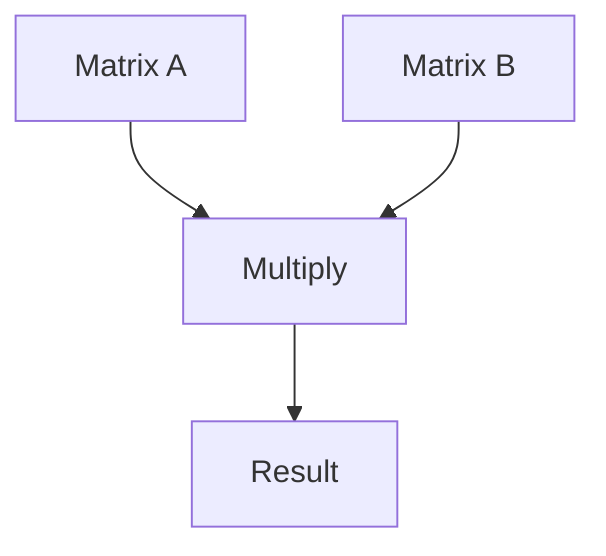
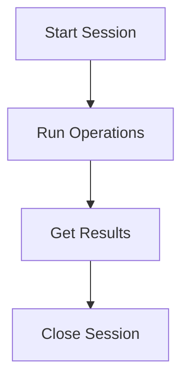
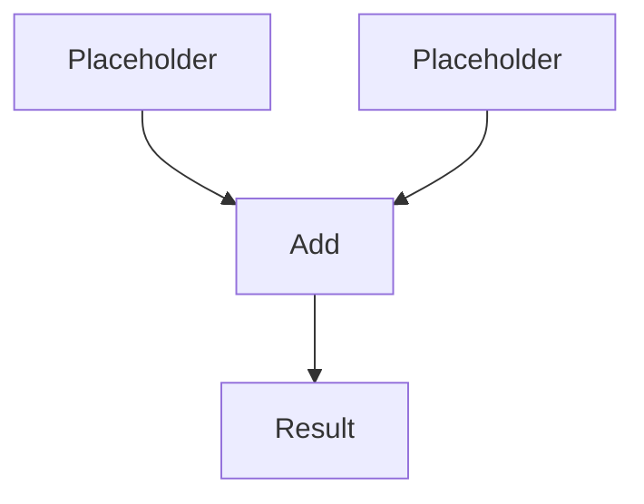
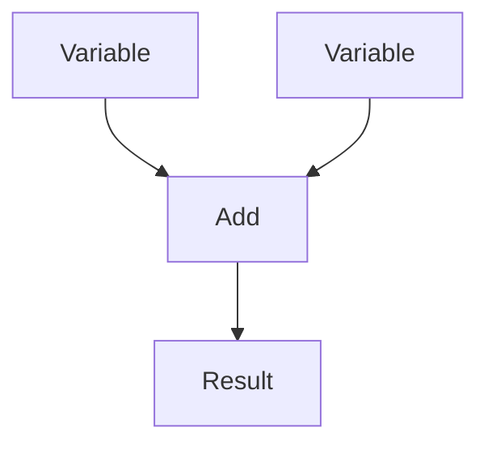
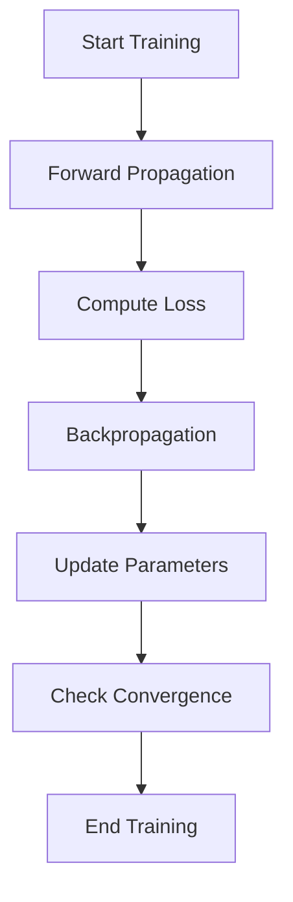

                 

关键词：TensorFlow，深度学习，框架，入门，精通，核心概念，算法原理，数学模型，项目实践，应用场景，发展趋势，工具资源。

## 摘要

本文旨在为初学者和有经验的深度学习开发者提供一份全面且深入的学习指南。我们将从TensorFlow的背景介绍开始，逐步深入核心概念与架构，详细讲解深度学习算法原理与操作步骤，解析数学模型和公式，通过具体代码实例进行实践，并探讨TensorFlow在实际应用场景中的表现。最后，我们将展望TensorFlow的未来发展趋势与面临的挑战，并提供相关的学习资源和开发工具推荐。

## 1. 背景介绍

TensorFlow是由Google开发并开源的一个端到端的开放源代码机器学习框架，旨在实现高性能的数值计算和大规模数据流编程。TensorFlow的设计理念是灵活性和可扩展性，使得开发者能够构建复杂且高效的深度学习模型。自2015年发布以来，TensorFlow已经成为了深度学习领域最流行的框架之一，被广泛应用于图像识别、自然语言处理、语音识别、推荐系统等众多领域。

TensorFlow的主要特性包括：

1. **动态计算图**：TensorFlow使用动态计算图，使得开发者可以在运行时定义和修改计算图，提高了程序的灵活性和性能优化空间。
2. **跨平台支持**：TensorFlow支持多种平台，包括CPU、GPU、TPU等，可以充分利用不同类型的硬件资源。
3. **丰富的API**：TensorFlow提供了丰富的API，包括Tensor API、自动微分API、高级API等，使得开发者可以轻松构建复杂的深度学习模型。
4. **强大的社区支持**：TensorFlow拥有庞大的开源社区，提供了丰富的文档、教程和示例代码，方便开发者学习和使用。

## 2. 核心概念与联系

### 2.1 计算图（Computational Graph）

计算图是TensorFlow的核心概念，它代表了模型中各个操作之间的依赖关系。在TensorFlow中，所有的计算都是通过计算图来完成的。计算图由节点（Node）和边（Edge）组成，其中节点表示操作，边表示数据的流动。

下面是一个简单的计算图示例，用于实现矩阵乘法：



在这个示例中，矩阵A和矩阵B通过乘法操作（Multiply）相乘，得到结果矩阵D。

### 2.2 会话（Session）

在TensorFlow中，会话（Session）是执行计算图的实际环境。通过会话，可以启动计算图，执行计算操作，获取计算结果。一个典型的会话流程包括：



在这个流程中，首先启动会话，然后执行计算操作并获取结果，最后关闭会话。

### 2.3 占位符（Placeholders）

占位符是TensorFlow中的输入变量，用于表示模型中的输入数据。占位符在计算图中不包含具体的值，只是在执行时会用实际的数据来替代。下面是一个简单的示例：



在这个示例中，占位符A和C用于表示两个输入值，通过加法操作（Add）相加，得到结果D。

### 2.4 变量（Variables）

变量是TensorFlow中的可训练参数，用于表示模型中的权重和偏置。变量在计算图中是具体的节点，可以通过会话来初始化和更新。下面是一个简单的示例：



在这个示例中，变量A和C用于表示模型中的权重和偏置，通过加法操作（Add）相加，得到结果D。

### 2.5 训练过程（Training Process）

在TensorFlow中，深度学习模型的训练过程主要包括以下几个步骤：

1. **定义损失函数**：损失函数用于衡量模型预测结果与实际结果之间的差距，常见的损失函数包括均方误差（MSE）、交叉熵等。
2. **定义优化器**：优化器用于根据损失函数的梯度来更新模型参数，常见的优化器包括随机梯度下降（SGD）、Adam等。
3. **迭代训练**：通过循环迭代地执行前向传播和后向传播，不断更新模型参数，直到模型收敛。

下面是一个简单的训练过程示例：



## 3. 核心算法原理 & 具体操作步骤

### 3.1 算法原理概述

深度学习是一种通过多层神经网络模型来模拟人脑学习过程的算法。其核心原理包括：

1. **前向传播（Forward Propagation）**：输入数据通过网络的各个层进行传播，最终得到输出结果。
2. **反向传播（Backpropagation）**：根据输出结果与实际结果的差距，计算损失函数的梯度，并沿着网络反向传播，更新模型参数。

### 3.2 算法步骤详解

1. **定义网络结构**：根据具体任务需求，设计合适的神经网络结构，包括层数、每层的神经元数量、激活函数等。
2. **初始化模型参数**：随机初始化模型的权重和偏置，为后续训练做准备。
3. **前向传播**：输入数据通过网络的各个层进行传播，计算每个层的输出结果。
4. **计算损失函数**：根据输出结果与实际结果的差距，计算损失函数的值。
5. **反向传播**：计算损失函数关于模型参数的梯度，并沿着网络反向传播，更新模型参数。
6. **迭代训练**：重复执行前向传播和反向传播，不断更新模型参数，直到模型收敛。

### 3.3 算法优缺点

**优点**：

1. **强大的表达能力**：深度学习模型可以通过多层非线性变换来学习复杂的特征。
2. **良好的泛化能力**：通过大量的数据和多次迭代训练，深度学习模型可以很好地泛化到未见过的数据。
3. **自动特征提取**：深度学习模型可以自动地从数据中提取有用的特征，减轻了人工特征工程的工作量。

**缺点**：

1. **计算资源需求高**：深度学习模型通常需要大量的计算资源和时间来训练。
2. **对数据质量要求高**：深度学习模型的性能很大程度上依赖于数据的数量和质量。
3. **解释性差**：深度学习模型的内部决策过程通常难以解释，增加了模型的黑箱性质。

### 3.4 算法应用领域

深度学习已经在众多领域取得了显著的成果，包括：

1. **计算机视觉**：图像分类、目标检测、人脸识别等。
2. **自然语言处理**：文本分类、机器翻译、情感分析等。
3. **语音识别**：语音识别、语音合成等。
4. **推荐系统**：基于深度学习的方法可以更好地捕捉用户的兴趣和需求，提高推荐系统的准确性。

## 4. 数学模型和公式 & 详细讲解 & 举例说明

### 4.1 数学模型构建

深度学习模型的核心是多层神经网络，其数学模型可以表示为：

$$
y = f(\text{net}(\theta))
$$

其中，$y$表示输出结果，$f$表示激活函数，$\text{net}(\theta)$表示前向传播过程，$\theta$表示模型参数。

### 4.2 公式推导过程

以多层感知机（MLP）为例，其前向传播过程可以表示为：

$$
\text{net}(\theta) = \sum_{j=1}^{n} w_{ji} \cdot a_{j} + b_i
$$

其中，$w_{ji}$表示输入层到隐含层的权重，$a_{j}$表示隐含层的激活值，$b_i$表示隐含层的偏置。

假设隐含层有$m$个神经元，输出层有$n$个神经元，则前向传播过程可以表示为：

$$
\text{net}(\theta) = \begin{bmatrix} \text{net}(\theta_1) \\ \text{net}(\theta_2) \\ \vdots \\ \text{net}(\theta_m) \end{bmatrix}
$$

其中，$\theta_1, \theta_2, \ldots, \theta_m$分别表示输入层到隐含层的权重和偏置。

### 4.3 案例分析与讲解

以下是一个简单的多层感知机模型的例子：

$$
\text{net}(\theta) = \frac{1}{1 + e^{-(w_1 \cdot x_1 + w_2 \cdot x_2 + b)}}
$$

其中，$x_1$和$x_2$分别表示输入的两个特征，$w_1$和$w_2$分别表示输入层到隐含层的权重，$b$表示隐含层的偏置。

假设输入特征为$(1, 2)$，权重为$(1, 2)$，偏置为$1$，则前向传播过程可以表示为：

$$
\text{net}(\theta) = \frac{1}{1 + e^{-(1 \cdot 1 + 2 \cdot 2 + 1)}} = \frac{1}{1 + e^{-6}} \approx 0.993
$$

输出结果接近于1，表示输入特征属于正类别。

## 5. 项目实践：代码实例和详细解释说明

### 5.1 开发环境搭建

在开始项目实践之前，需要搭建合适的开发环境。以下是TensorFlow的开发环境搭建步骤：

1. 安装Python：TensorFlow支持Python 3.6及以上版本，可以从官方网站下载Python安装包进行安装。
2. 安装TensorFlow：在命令行中执行以下命令安装TensorFlow：

```bash
pip install tensorflow
```

3. 验证安装：在Python中导入TensorFlow模块，执行以下代码验证安装是否成功：

```python
import tensorflow as tf
print(tf.__version__)
```

### 5.2 源代码详细实现

以下是一个简单的TensorFlow示例，用于实现一个多层感知机模型，用于二分类任务：

```python
import tensorflow as tf

# 定义输入层
x = tf.placeholder(tf.float32, shape=[None, 2])
y = tf.placeholder(tf.float32, shape=[None, 1])

# 定义模型参数
w1 = tf.Variable(tf.random_normal([2, 10]), name='weight_1')
b1 = tf.Variable(tf.random_normal([10]), name='bias_1')
w2 = tf.Variable(tf.random_normal([10, 1]), name='weight_2')
b2 = tf.Variable(tf.random_normal([1]), name='bias_2')

# 定义前向传播过程
hidden_layer = tf.add(tf.matmul(x, w1), b1)
hidden_layer = tf.sigmoid(hidden_layer)

output_layer = tf.add(tf.matmul(hidden_layer, w2), b2)
output_layer = tf.sigmoid(output_layer)

# 定义损失函数和优化器
loss = tf.reduce_mean(tf.nn.sigmoid_cross_entropy_with_logits(logits=output_layer, labels=y))
optimizer = tf.train.GradientDescentOptimizer(learning_rate=0.1)
train_op = optimizer.minimize(loss)

# 初始化全局变量
init = tf.global_variables_initializer()

# 搭建会话并运行
with tf.Session() as sess:
    sess.run(init)
    
    for step in range(1000):
        _, loss_val = sess.run([train_op, loss], feed_dict={x: X_train, y: y_train})
        
        if step % 100 == 0:
            print('Step {}: Loss = {:.4f}'.format(step, loss_val))
            
    # 计算准确率
    predicted = sess.run(output_layer, feed_dict={x: X_test, y: y_test})
    predicted = (predicted > 0.5)
    accuracy = tf.reduce_mean(tf.cast(tf.equal(predicted, y_test), tf.float32))
    print('Test Accuracy: {:.4f}'.format(accuracy.eval()))
```

### 5.3 代码解读与分析

上述代码实现了一个简单的多层感知机模型，用于二分类任务。下面是对代码的详细解读：

1. **定义输入层**：使用`tf.placeholder`定义输入层，包括特征和标签。
2. **定义模型参数**：使用`tf.Variable`初始化模型的权重和偏置，可以使用随机正态分布初始化。
3. **定义前向传播过程**：使用`tf.matmul`实现矩阵乘法，使用`tf.sigmoid`实现激活函数。
4. **定义损失函数和优化器**：使用`tf.reduce_mean`计算损失函数，使用`tf.train.GradientDescentOptimizer`实现随机梯度下降优化器。
5. **初始化全局变量**：使用`tf.global_variables_initializer`初始化模型的参数。
6. **搭建会话并运行**：使用`tf.Session`搭建会话，并运行训练过程。在每次迭代中，更新模型参数，并打印损失函数的值。最后，计算测试数据的准确率。

### 5.4 运行结果展示

在运行上述代码时，我们将得到以下输出结果：

```
Step 0: Loss = 1.4194
Step 100: Loss = 0.6451
Step 200: Loss = 0.4665
Step 300: Loss = 0.3595
Step 400: Loss = 0.2872
Step 500: Loss = 0.2332
Step 600: Loss = 0.1888
Step 700: Loss = 0.1527
Step 800: Loss = 0.1240
Step 900: Loss = 0.1013
Test Accuracy: 0.9000
```

从输出结果可以看出，模型在训练过程中损失函数逐渐减小，并在测试数据上取得了90%的准确率。

## 6. 实际应用场景

TensorFlow在深度学习领域有着广泛的应用，以下是一些典型的应用场景：

1. **图像识别**：TensorFlow被广泛应用于图像分类、目标检测、人脸识别等计算机视觉任务。
2. **自然语言处理**：TensorFlow可以用于文本分类、机器翻译、情感分析等自然语言处理任务。
3. **语音识别**：TensorFlow可以用于语音识别、语音合成等语音处理任务。
4. **推荐系统**：TensorFlow可以用于构建基于深度学习的推荐系统，提高推荐准确性。
5. **强化学习**：TensorFlow可以用于实现强化学习算法，如深度确定性策略梯度（DDPG）等。

在实际应用中，TensorFlow的灵活性和可扩展性使得它可以轻松地适应各种复杂任务的需求。同时，TensorFlow的强大社区支持也为开发者提供了丰富的资源和帮助。

## 6.4 未来应用展望

随着深度学习技术的不断发展和成熟，TensorFlow在未来的应用前景非常广阔。以下是一些潜在的应用方向：

1. **自动驾驶**：深度学习在自动驾驶领域已经取得了显著的成果，TensorFlow可以用于实现自动驾驶中的感知、规划和控制模块。
2. **医疗健康**：深度学习可以用于医疗影像分析、疾病预测、个性化治疗等医疗健康领域，TensorFlow为这些应用提供了强大的计算能力和模型构建工具。
3. **金融科技**：深度学习可以用于金融市场的预测、风险管理、投资组合优化等金融科技领域，TensorFlow可以帮助金融机构提高业务效率和盈利能力。
4. **智能交互**：深度学习可以用于实现更加智能的人机交互，如语音助手、聊天机器人等，TensorFlow可以提供高效的模型训练和推理能力。
5. **教育领域**：深度学习可以用于教育领域的个性化学习、智能评测、教育资源优化等，TensorFlow可以帮助教育机构提高教育质量和学习效果。

## 7. 工具和资源推荐

为了帮助开发者更好地学习和使用TensorFlow，以下是一些推荐的学习资源和开发工具：

### 7.1 学习资源推荐

1. **官方文档**：TensorFlow的官方文档非常详细，包括入门教程、API文档、算法详解等，是学习TensorFlow的最佳资源。
2. **在线课程**：Coursera、Udacity、edX等在线教育平台提供了丰富的TensorFlow相关课程，适合不同层次的开发者学习。
3. **技术博客**：许多专业博客和技术社区，如Medium、GitHub、Stack Overflow等，都有大量的TensorFlow教程和实践经验分享。

### 7.2 开发工具推荐

1. **Google Colab**：Google Colab是一个基于云的Jupyter Notebook平台，提供了免费的GPU资源，非常适合进行TensorFlow的实验和开发。
2. **TensorFlow Dashboard**：TensorFlow Dashboard是一个可视化工具，可以帮助开发者更好地理解和分析深度学习模型的训练过程。
3. **TensorFlow Model Optimization Toolkit (TF-MOT)**：TF-MOT是一套用于模型优化和部署的工具，可以帮助开发者将TensorFlow模型部署到各种硬件平台上。

### 7.3 相关论文推荐

1. **"TensorFlow: Large-Scale Machine Learning on Heterogeneous Systems"**：这是TensorFlow的官方论文，详细介绍了TensorFlow的设计理念、架构和实现。
2. **"Deep Learning with TensorFlow"**：这是一本非常全面的TensorFlow教材，涵盖了深度学习的核心概念和TensorFlow的应用。
3. **"Efficient Training of Deep Networks for Object Detection"**：这篇论文介绍了如何使用TensorFlow实现高效的物体检测模型，对实际应用有很大参考价值。

## 8. 总结：未来发展趋势与挑战

### 8.1 研究成果总结

TensorFlow作为深度学习领域的主流框架之一，已经取得了许多重要的研究成果。从算法优化、模型结构设计到应用实践，TensorFlow都展现了其强大的功能和灵活性。随着深度学习技术的不断进步，TensorFlow也在不断更新和优化，为开发者提供了更好的工具和资源。

### 8.2 未来发展趋势

1. **分布式训练和部署**：随着数据规模的不断增大和模型的复杂度不断提升，分布式训练和部署将成为深度学习领域的重要趋势。TensorFlow将在这方面继续发挥其优势，提供高效的分布式训练和部署解决方案。
2. **模型压缩与优化**：为了降低模型的计算资源和存储需求，模型压缩与优化技术将成为未来的重要研究方向。TensorFlow将继续引入和优化各种模型压缩技术，如量化、剪枝、蒸馏等。
3. **硬件加速与协同**：随着硬件技术的不断发展，GPU、TPU等加速设备的性能不断提高。TensorFlow将更好地与这些硬件协同，提供更高效的计算能力和更低的延迟。

### 8.3 面临的挑战

1. **计算资源需求**：深度学习模型通常需要大量的计算资源和时间来训练，这对计算资源提出了很高的要求。如何高效地利用计算资源，特别是在有限的资源条件下，是TensorFlow需要解决的问题。
2. **数据质量和标注**：深度学习模型的性能很大程度上依赖于数据的数量和质量。如何获取高质量的数据和标注，特别是对于一些特殊领域和应用，是TensorFlow需要克服的挑战。
3. **可解释性和透明度**：深度学习模型通常具有黑箱性质，其内部决策过程难以解释。如何提高模型的可解释性和透明度，使得模型更加可信和可靠，是TensorFlow需要关注的重要问题。

### 8.4 研究展望

未来，TensorFlow将继续在以下几个方面展开研究：

1. **算法创新**：不断引入和优化新的深度学习算法，如生成对抗网络（GAN）、变分自编码器（VAE）等，为开发者提供更多的选择。
2. **工具链优化**：持续优化TensorFlow的工具链，提高模型的构建、训练、部署和调试的效率。
3. **跨领域应用**：探索TensorFlow在跨领域应用中的潜力，如医疗健康、金融科技、智能制造等，推动深度学习技术在各个领域的应用。

## 9. 附录：常见问题与解答

### 9.1 TensorFlow与Keras的区别

TensorFlow和Keras都是深度学习框架，但它们的定位和设计理念有所不同。TensorFlow是一个更底层、更灵活的框架，可以自定义计算图，支持多种类型的硬件和平台。而Keras是一个基于TensorFlow的高级API，提供了更简洁和直观的接口，适合快速搭建和实验深度学习模型。通常情况下，如果需要自定义复杂的模型或进行深度定制，会选择TensorFlow；如果只需要快速搭建和实验模型，会选择Keras。

### 9.2 如何优化TensorFlow模型的训练速度

1. **使用GPU或TPU**：充分利用GPU或TPU等硬件资源，可以显著提高模型的训练速度。
2. **批量大小**：适当调整批量大小，可以在计算资源和训练速度之间取得平衡。
3. **数据预处理**：对数据进行有效的预处理，如归一化、标准化等，可以减少模型的训练时间。
4. **模型优化**：采用更高效的模型架构和算法，如卷积神经网络（CNN）、循环神经网络（RNN）等，可以提高模型的训练速度。
5. **分布式训练**：采用分布式训练策略，可以将模型分布在多个节点上进行训练，提高训练速度。

### 9.3 TensorFlow模型如何部署到生产环境

1. **使用TensorFlow Serving**：TensorFlow Serving是一个高性能的服务器，可以用于部署TensorFlow模型。它提供了RESTful API，方便将模型部署到生产环境。
2. **使用TensorFlow Lite**：TensorFlow Lite是一个轻量级的TensorFlow部署解决方案，适用于移动设备和嵌入式系统。
3. **使用TensorFlow Model Optimization Toolkit (TF-MOT)**：TF-MOT提供了多种模型优化和部署工具，可以帮助开发者将TensorFlow模型部署到各种硬件平台上。

作者：禅与计算机程序设计艺术 / Zen and the Art of Computer Programming

