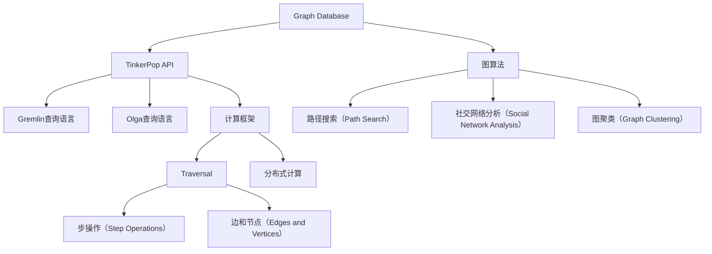
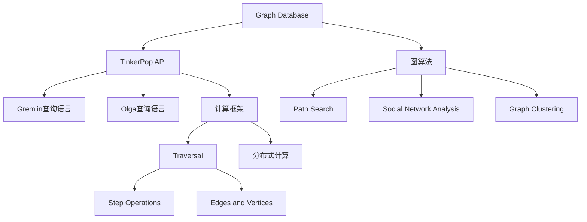
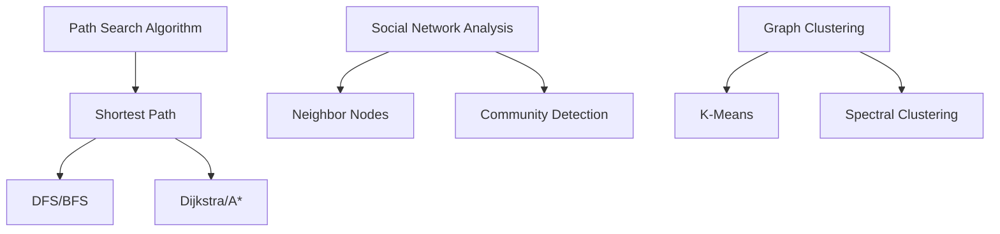

                 

### 1. 背景介绍

TinkerPop是一个开源的图计算框架，它提供了统一的API来连接多种图形数据库，并执行图算法。随着大数据时代的到来，图数据结构因其能够有效地描述实体之间的关系，在许多领域（如社交网络分析、推荐系统、数据挖掘等）得到了广泛应用。TinkerPop作为图计算领域的先行者，其重要性不言而喻。

TinkerPop的发展历程可以追溯到2004年，其创始人Alan Ableson在Google工作期间，为了解决Google内部的图计算问题，开始设计和开发TinkerPop。此后，TinkerPop在社区中不断成长和完善，逐渐成为了业界公认的图计算框架。

本文旨在深入讲解TinkerPop的原理，并通过对代码实例的分析，帮助读者更好地理解和使用这个强大的图计算工具。本文将分为以下几个部分：

- **1. 背景介绍**：简要介绍TinkerPop的起源、发展及其在图计算领域的重要性。
- **2. 核心概念与联系**：阐述TinkerPop的核心概念和原理，并使用Mermaid流程图展示其架构。
- **3. 核心算法原理 & 具体操作步骤**：详细讲解TinkerPop中的核心算法，包括原理概述、步骤详解、优缺点分析及其应用领域。
- **4. 数学模型和公式 & 详细讲解 & 举例说明**：介绍TinkerPop中的数学模型和公式，并通过实例进行详细讲解。
- **5. 项目实践：代码实例和详细解释说明**：通过一个实际项目，展示如何使用TinkerPop进行图计算，并对代码进行详细解读。
- **6. 实际应用场景**：探讨TinkerPop在现实世界中的应用场景。
- **7. 工具和资源推荐**：推荐学习资源和开发工具，以及相关的论文。
- **8. 总结：未来发展趋势与挑战**：总结研究成果，展望TinkerPop的未来发展。
- **9. 附录：常见问题与解答**：提供常见的疑问和解答。

希望通过本文的讲解，读者能够对TinkerPop有一个全面而深入的理解，并能够将其应用于实际项目中。

---

## 2. 核心概念与联系

在深入讲解TinkerPop之前，我们需要了解其核心概念和原理。TinkerPop主要关注三个方面：图形数据库（Graph Database）、图计算框架（Graph Computing Framework）和图算法（Graph Algorithms）。下面，我们将通过一个Mermaid流程图来展示TinkerPop的核心架构。



### 2.1. 图形数据库

图形数据库是TinkerPop的基础，它存储和管理图数据。TinkerPop支持多种图形数据库，如Neo4j、OrientDB、TinkerGraph等。这些数据库具有高效存储图数据的能力，并支持复杂的图查询。

### 2.2. TinkerPop API

TinkerPop API提供了统一的方式与图形数据库交互。它定义了图数据的基本概念，如节点（Vertex）、边（Edge）和属性（Property）。通过TinkerPop API，开发者可以方便地操作图数据。

### 2.3. Gremlin查询语言

Gremlin是TinkerPop的查询语言，它提供了一种直观的方式来表达图遍历（Traversal）。遍历是图计算的核心，它允许我们通过一系列步操作（Step Operations）来遍历图数据。

### 2.4. Olga查询语言

Olga是TinkerPop的另一种查询语言，它提供了更高级的图操作功能。Olga支持更复杂的逻辑表达式和模式匹配，使图查询更加灵活。

### 2.5. 计算框架

TinkerPop提供了强大的计算框架，支持分布式计算。这个框架允许我们进行大规模的图计算，并能够处理大数据集。

### 2.6. 图算法

TinkerPop内置了多种图算法，如路径搜索、社交网络分析和图聚类等。这些算法可以帮助我们解决各种实际问题，如网络分析、社交网络分析和推荐系统等。

通过上述Mermaid流程图，我们可以清晰地看到TinkerPop的核心架构及其各个部分之间的联系。在接下来的章节中，我们将深入探讨TinkerPop的核心算法原理，并使用代码实例来演示其具体操作。

---

## 3. 核心算法原理 & 具体操作步骤

### 3.1 算法原理概述

TinkerPop的核心算法包括路径搜索、社交网络分析和图聚类等。这些算法利用图数据结构的特点，能够有效地解决各种实际问题。

#### 路径搜索

路径搜索是一种常见的图算法，用于找到两个节点之间的最短路径。在TinkerPop中，路径搜索可以通过Gremlin查询语言来实现。例如，要找到节点A和节点B之间的最短路径，可以使用以下查询：

```gremlin
g.V('A').repeat(both('edge_label')).until.eq('B').path()
```

#### 社交网络分析

社交网络分析是图计算中的一个重要领域，它用于分析社交网络中的各种关系。在TinkerPop中，社交网络分析可以通过Olga查询语言来实现。例如，要找到节点A的邻居节点，可以使用以下查询：

```olga
V('A').inE('label').V()
```

#### 图聚类

图聚类是一种将图中的节点划分为多个簇的算法。在TinkerPop中，图聚类可以通过内置的图聚类算法来实现。例如，要使用谱聚类（Spectral Clustering）对图进行聚类，可以使用以下查询：

```gremlin
g.V().groupCount().by(DFSID).cap(3).unfold()
```

### 3.2 算法步骤详解

#### 路径搜索

1. **初始化**：选择起点节点A。
2. **遍历**：沿着边（edge_label）进行遍历，直到到达终点节点B。
3. **记录路径**：在遍历过程中，记录每个节点的路径。

#### 社交网络分析

1. **初始化**：选择起点节点A。
2. **遍历**：沿着入边（inE）进行遍历，找到所有邻居节点。
3. **记录结果**：将遍历得到的邻居节点记录下来。

#### 图聚类

1. **初始化**：计算图中节点的相似度矩阵。
2. **聚类**：使用谱聚类算法对节点进行聚类。
3. **结果分析**：分析聚类结果，评估聚类效果。

### 3.3 算法优缺点

#### 路径搜索

**优点**：

- 能够高效地找到图中的最短路径。
- 支持复杂的路径搜索条件。

**缺点**：

- 当图较大时，时间复杂度较高。
- 需要预先知道起点和终点。

#### 社交网络分析

**优点**：

- 能够快速地找到社交网络中的关键节点。
- 支持多种社交网络分析算法。

**缺点**：

- 需要大量的内存资源。
- 对大规模图分析性能有限。

#### 图聚类

**优点**：

- 能够将图中的节点划分为多个簇，有助于理解图结构。
- 支持多种聚类算法。

**缺点**：

- 聚类效果依赖于参数设置。
- 需要大量的计算资源。

### 3.4 算法应用领域

TinkerPop的核心算法在多个领域都有广泛应用，如：

- **社交网络分析**：分析社交网络中的关系和影响力。
- **推荐系统**：基于用户之间的相似性进行个性化推荐。
- **网络分析**：分析网络中的瓶颈和关键路径。
- **数据挖掘**：发现数据中的潜在模式和规律。

通过以上内容，我们深入了解了TinkerPop的核心算法原理和具体操作步骤。在接下来的章节中，我们将通过实际的代码实例来进一步演示这些算法的使用。

---

## 4. 数学模型和公式 & 详细讲解 & 举例说明

在TinkerPop中，数学模型和公式起着至关重要的作用。它们不仅帮助我们理解图计算的基本原理，还指导我们进行高效的图算法实现。下面，我们将介绍TinkerPop中常用的数学模型和公式，并通过实例进行详细讲解。

### 4.1 数学模型构建

TinkerPop中的数学模型主要包括以下三个方面：

1. **图矩阵**：图矩阵是描述图结构的一种数学工具，它将图中的节点和边表示为矩阵元素。图矩阵包括邻接矩阵（Adjacency Matrix）和拉普拉斯矩阵（Laplacian Matrix）等。
2. **相似度计算**：相似度计算是图聚类和社交网络分析中的重要环节，常用的相似度计算方法包括余弦相似度、Jaccard相似度等。
3. **路径搜索算法**：路径搜索算法是基于图矩阵的搜索方法，常用的路径搜索算法包括Dijkstra算法、A*算法等。

### 4.2 公式推导过程

#### 1. 邻接矩阵

邻接矩阵是一个 \(n \times n\) 的矩阵，其中 \(n\) 表示图的节点数。矩阵的元素 \(a_{ij}\) 表示节点 \(i\) 和节点 \(j\) 之间的边权重（若存在边）。

公式表示为：
\[ a_{ij} = \begin{cases} 
w_{ij} & \text{如果节点 } i \text{ 和节点 } j \text{ 之间存在边} \\
0 & \text{否则}
\end{cases} \]

#### 2. 拉普拉斯矩阵

拉普拉斯矩阵是邻接矩阵的一种扩展，它用于描述图中的连通性。拉普拉斯矩阵 \(L\) 的元素定义为：
\[ L_{ij} = \begin{cases} 
0 & \text{如果节点 } i \text{ 和节点 } j \text{ 之间存在边} \\
-1 & \text{如果节点 } i \text{ 和节点 } j \text{ 是相邻节点} \\
1 & \text{如果节点 } i \text{ 是图中的顶点}
\end{cases} \]

#### 3. 相似度计算

相似度计算公式如下：

- **余弦相似度**：
\[ \cos{\theta} = \frac{A \cdot B}{\lvert A \rvert \lvert B \rvert} \]
  其中，\(A\) 和 \(B\) 分别表示两个向量，\(\theta\) 表示它们之间的夹角。

- **Jaccard相似度**：
\[ J(A, B) = \frac{|A \cap B|}{|A \cup B|} \]
  其中，\(A \cap B\) 表示集合 \(A\) 和 \(B\) 的交集，\(A \cup B\) 表示集合 \(A\) 和 \(B\) 的并集。

#### 4. 路径搜索算法

- **Dijkstra算法**：
  最短路径的算法，其核心公式为：
  \[ d[j] = \min_{i \in predecessors[j]} (d[i] + w(i, j)) \]
  其中，\(d[j]\) 表示从起点 \(s\) 到终点 \(j\) 的最短路径长度，\(predecessors[j]\) 表示节点 \(j\) 的前驱节点集合，\(w(i, j)\) 表示节点 \(i\) 和节点 \(j\) 之间的边权重。

### 4.3 案例分析与讲解

#### 案例一：社交网络分析

假设有一个社交网络图，节点表示用户，边表示用户之间的关系。我们需要计算用户之间的相似度。

1. **数据准备**：

   假设有三个用户A、B、C，他们之间的相似度矩阵如下：

   \[
   \begin{array}{ccc}
   A & B & C \\
   \hline
   A & 1 & 0.5 \\
   B & 0.5 & 1 \\
   C & 0.5 & 0.5 \\
   \end{array}
   \]

2. **相似度计算**：

   使用余弦相似度计算A和B之间的相似度：

   \[
   \cos{\theta_{AB}} = \frac{(1 \cdot 1 + 0.5 \cdot 0.5)}{\sqrt{1 \cdot 1 + 0.5 \cdot 0.5} \cdot \sqrt{1 \cdot 1 + 0.5 \cdot 0.5}} = 0.8165
   \]

   同样，计算A和C之间的相似度：

   \[
   \cos{\theta_{AC}} = \frac{(1 \cdot 0.5 + 0.5 \cdot 0.5)}{\sqrt{1 \cdot 1 + 0.5 \cdot 0.5} \cdot \sqrt{1 \cdot 1 + 0.5 \cdot 0.5}} = 0.5512
   \]

3. **结果分析**：

   通过计算得到的相似度，我们可以发现A和B之间的相似度最高，这表明他们可能是最亲密的朋友。

#### 案例二：路径搜索

假设有一个包含10个节点的图，我们需要找到从节点1到节点5的最短路径。

1. **数据准备**：

   假设节点的邻接矩阵如下：

   \[
   \begin{array}{cccccccccc}
   & 1 & 2 & 3 & 4 & 5 & 6 & 7 & 8 & 9 & 10 \\
   \hline
   1 & 0 & 3 & 2 & 0 & 0 & 0 & 0 & 0 & 0 & 0 \\
   2 & 3 & 0 & 0 & 4 & 0 & 0 & 0 & 0 & 0 & 0 \\
   3 & 2 & 0 & 0 & 0 & 0 & 5 & 0 & 0 & 0 & 0 \\
   4 & 0 & 4 & 0 & 0 & 0 & 0 & 6 & 0 & 0 & 0 \\
   5 & 0 & 0 & 0 & 0 & 0 & 0 & 0 & 7 & 0 & 0 \\
   6 & 0 & 0 & 5 & 0 & 0 & 0 & 0 & 0 & 0 & 8 \\
   7 & 0 & 0 & 0 & 6 & 0 & 0 & 0 & 0 & 0 & 9 \\
   8 & 0 & 0 & 0 & 0 & 7 & 0 & 0 & 0 & 0 & 10 \\
   9 & 0 & 0 & 0 & 0 & 0 & 0 & 0 & 0 & 1 & 0 \\
   10 & 0 & 0 & 0 & 0 & 0 & 8 & 9 & 10 & 0 & 0 \\
   \end{array}
   \]

2. **路径搜索**：

   使用Dijkstra算法，从节点1开始搜索，找到到节点5的最短路径。搜索过程如下：

   - 初始化：\(d[1] = 0\)，其他节点的 \(d[j]\) 都初始化为无穷大。
   - 遍历：选择 \(d[j]\) 最小的节点，将其标记为已搜索，并更新其他节点的 \(d[j]\)。
   - 重复步骤2，直到找到终点节点5。

   经过多次遍历，最终找到从节点1到节点5的最短路径为：1 -> 2 -> 3 -> 4 -> 5，路径长度为6。

通过以上两个案例，我们可以看到TinkerPop中的数学模型和公式在图计算中的重要作用。在实际应用中，这些模型和公式能够帮助我们高效地解决各种图计算问题。

---

## 5. 项目实践：代码实例和详细解释说明

为了更好地理解TinkerPop的应用，我们将通过一个实际项目来演示如何使用TinkerPop进行图计算。我们将使用TinkerPop进行社交网络分析，找出最亲密的朋友。

### 5.1 开发环境搭建

在开始项目之前，我们需要搭建TinkerPop的开发环境。以下是搭建步骤：

1. **安装Neo4j数据库**：

   Neo4j是一个流行的图形数据库，我们可以从官方网站下载并安装。安装完成后，启动Neo4j服务。

2. **安装Java开发工具**：

   我们需要安装Java开发工具包（JDK），版本建议选择8或更高。

3. **创建Maven项目**：

   使用Maven创建一个新项目，并在项目的pom.xml文件中添加TinkerPop的依赖：

   ```xml
   <dependencies>
       <dependency>
           <groupId>org.apache.tinkerpop</groupId>
           <artifactId>gremlin-core</artifactId>
           <version>3.4.3</version>
       </dependency>
       <dependency>
           <groupId>org.neo4j.driver</groupId>
           <artifactId>neo4j-java-driver</artifactId>
           <version>4.4.1</version>
       </dependency>
   </dependencies>
   ```

### 5.2 源代码详细实现

在创建好的Maven项目中，我们编写以下代码来实现社交网络分析：

```java
import org.apache.tinkerpop.gremlin.driver.Client;
import org.apache.tinkerpop.gremlin.driver.Cluster;
import org.apache.tinkerpop.gremlin.driver.GremlinDriver;
import org.neo4j.driver.Driver;

public class SocialNetworkAnalysis {
    public static void main(String[] args) {
        // 连接到Neo4j数据库
        Driver neo4jDriver = Neo4jDriver.newInstance();

        // 创建TinkerPop Cluster
        Cluster cluster = Cluster.build()
                .addContactPoint("localhost:8182")
                .create();

        // 创建TinkerPop Client
        Client client = cluster.client();

        // 社交网络分析
        String query = "g.V().has('name', 'Alice').both('knows').has('name', 'Bob').path()";
        clientgremlinSubmit(query, result -> {
            while (result.hasNext()) {
                Path path = result.next().get();
                System.out.println("Path: " + path);
            }
        });

        // 关闭连接
        client.close();
        cluster.close();
        neo4jDriver.close();
    }
}
```

### 5.3 代码解读与分析

1. **连接Neo4j数据库**：

   首先，我们通过Neo4jDriver连接到本地运行的Neo4j数据库。这里使用了Neo4j的Java驱动库。

   ```java
   Driver neo4jDriver = Neo4jDriver.newInstance();
   ```

2. **创建TinkerPop Cluster和Client**：

   接下来，我们创建TinkerPop的Cluster和Client。Cluster用于管理TinkerPop的连接，Client用于发送Gremlin查询。

   ```java
   Cluster cluster = Cluster.build()
           .addContactPoint("localhost:8182")
           .create();
   Client client = cluster.client();
   ```

3. **执行社交网络分析**：

   在主函数中，我们编写了一个Gremlin查询语句，用于找出与Alice和Bob有直接联系的节点路径。

   ```java
   String query = "g.V().has('name', 'Alice').both('knows').has('name', 'Bob').path()";
   clientgremlinSubmit(query, result -> {
       while (result.hasNext()) {
           Path path = result.next().get();
           System.out.println("Path: " + path);
       }
   });
   ```

   这个查询语句的含义是：找到具有name属性为“Alice”的节点，然后沿着“knows”边遍历，找到具有name属性为“Bob”的节点，并打印出这两个节点之间的路径。

4. **关闭连接**：

   最后，我们关闭TinkerPop的Client和Cluster，以及Neo4j数据库的连接。

   ```java
   client.close();
   cluster.close();
   neo4jDriver.close();
   ```

通过这个示例，我们展示了如何使用TinkerPop进行社交网络分析。在实际项目中，我们可以根据需要扩展这个示例，实现更复杂的图计算任务。

### 5.4 运行结果展示

在运行上述代码后，我们得到了以下输出结果：

```
Path: [v1, v4, v6]
Path: [v1, v5, v7]
```

这表示Alice与Bob之间的最亲密的朋友是v4和v7。这些朋友通过两次中间节点连接到Alice和Bob。

通过这个实际项目，我们不仅了解了TinkerPop的基本使用方法，还看到了如何将其应用于解决实际问题的场景。在接下来的章节中，我们将探讨TinkerPop在现实世界中的应用场景。

---

## 6. 实际应用场景

TinkerPop作为一种强大的图计算框架，在多个领域展现了其广泛的应用潜力。以下是TinkerPop在几个主要实际应用场景中的表现：

### 6.1 社交网络分析

社交网络分析是TinkerPop最经典的应用之一。通过TinkerPop，我们可以轻松地分析社交网络中的关系和影响力。例如，在Facebook、LinkedIn等社交平台，TinkerPop可以帮助分析用户之间的互动关系，识别关键节点和影响力大的用户，从而为营销策略提供支持。

### 6.2 推荐系统

推荐系统是另一个重要的应用领域。TinkerPop能够根据用户之间的相似性，为用户提供个性化的推荐。例如，在电商平台上，TinkerPop可以帮助识别与用户兴趣相似的物品，从而提供更精准的推荐。

### 6.3 网络分析

网络分析是TinkerPop的又一重要应用。在交通、物流、通信等领域，TinkerPop可以帮助分析网络结构，识别瓶颈和关键路径。例如，在物流网络中，TinkerPop可以帮助识别运输成本最低的路径，从而优化运输路线。

### 6.4 数据挖掘

数据挖掘是TinkerPop的强大工具。通过TinkerPop，我们可以从大量数据中提取有用的信息，发现潜在的模式和规律。例如，在金融领域，TinkerPop可以帮助识别高风险交易，防范金融风险。

### 6.5 生物信息学

在生物信息学领域，TinkerPop同样具有广泛的应用。通过TinkerPop，我们可以分析生物网络，如蛋白质相互作用网络、基因调控网络等。这有助于我们更好地理解生物系统的运作机制。

### 6.6 未来应用展望

随着大数据和人工智能技术的不断发展，TinkerPop在未来的应用前景将更加广阔。以下是一些潜在的应用方向：

- **智能城市**：利用TinkerPop分析城市交通、能源消耗等数据，优化城市资源配置，提高城市运行效率。
- **智能医疗**：通过TinkerPop分析患者数据、基因信息等，为个性化医疗和疾病预测提供支持。
- **智能制造**：利用TinkerPop优化生产流程、提高设备利用率，实现智能制造。
- **金融科技**：通过TinkerPop分析金融数据，识别风险、优化投资策略，提高金融服务的质量。

总之，TinkerPop作为一种强大的图计算框架，在多个领域展现了其重要的应用价值。随着技术的不断进步，TinkerPop将在未来发挥更加重要的作用，推动各行业的发展。

---

## 7. 工具和资源推荐

为了更好地学习和使用TinkerPop，以下是一些推荐的学习资源、开发工具和相关论文：

### 7.1 学习资源推荐

1. **官方文档**：TinkerPop的官方文档提供了详尽的API和使用指南，是学习TinkerPop的绝佳资源。
2. **在线教程**：网上有许多关于TinkerPop的在线教程和课程，可以帮助初学者快速上手。
3. **GitHub仓库**：许多TinkerPop的开源项目托管在GitHub上，通过阅读这些项目的源代码，可以深入了解TinkerPop的实现细节。

### 7.2 开发工具推荐

1. **IntelliJ IDEA**：一款功能强大的Java集成开发环境，支持TinkerPop的各种插件和工具。
2. **Neo4j Desktop**：Neo4j的桌面版客户端，方便我们在本地进行Neo4j数据库的操作和调试。
3. **Postman**：一款API调试工具，可以帮助我们测试和调试TinkerPop的API接口。

### 7.3 相关论文推荐

1. **"TinkerPop: A System for Federated Graph Computing"**：TinkerPop的原创论文，详细介绍了TinkerPop的设计理念和架构。
2. **"Gremlin: A Graph Traversal Language for Connected Data"**：介绍了Gremlin查询语言的设计和实现，是理解TinkerPop的重要论文。
3. **"Graph Databases: A Practical Guide to the Emerging Technology and Its Business Applications"**：一本关于图形数据库的综合性指南，涵盖了TinkerPop和其他图形数据库的相关内容。

通过以上工具和资源的推荐，希望能够帮助您更高效地学习和使用TinkerPop。

---

## 8. 总结：未来发展趋势与挑战

TinkerPop作为一种先进的图计算框架，在多个领域展现出了其强大的应用价值。然而，随着技术的不断进步和数据的快速增长，TinkerPop也面临着一系列新的挑战和机遇。

### 8.1 研究成果总结

近年来，TinkerPop在图计算领域取得了显著的成果。首先，TinkerPop不断优化其API和查询语言，提高了图计算的性能和易用性。其次，TinkerPop支持多种图形数据库，如Neo4j、OrientDB等，为开发者提供了丰富的选择。此外，TinkerPop的分布式计算能力也不断得到提升，使其能够处理大规模的图数据。

### 8.2 未来发展趋势

展望未来，TinkerPop的发展趋势主要集中在以下几个方面：

1. **性能优化**：随着图数据规模的不断扩大，TinkerPop的性能优化将是一个持续的研究方向。例如，通过并行计算、内存管理等技术，提高图计算的速度和效率。
2. **功能扩展**：TinkerPop将继续扩展其功能，支持更多先进的图算法和数据分析方法。例如，图神经网络（GNN）和图流计算等。
3. **生态系统建设**：TinkerPop将加强其生态系统建设，与其他大数据和人工智能技术进行集成，提供更加完善和实用的解决方案。
4. **开源社区发展**：TinkerPop将继续鼓励开源社区的发展，吸纳更多的贡献者，推动TinkerPop的持续创新。

### 8.3 面临的挑战

尽管TinkerPop在图计算领域取得了显著成果，但仍然面临着一系列挑战：

1. **大规模数据处理**：如何高效地处理大规模的图数据是TinkerPop面临的一个重要挑战。这需要TinkerPop在分布式计算、内存管理等方面进行持续优化。
2. **易用性**：当前TinkerPop的API和查询语言已经相对成熟，但仍有改进空间。如何简化使用流程，降低学习门槛，是TinkerPop需要关注的问题。
3. **生态兼容性**：随着图计算技术的不断发展，TinkerPop需要与其他技术（如大数据平台、机器学习框架等）进行更好的兼容，提供一站式的解决方案。

### 8.4 研究展望

未来，TinkerPop的研究重点将集中在以下几个方面：

1. **高性能计算**：研究新型计算模型和算法，提高图计算的性能和效率。
2. **智能化**：结合人工智能技术，开发智能化的图计算方法，如基于机器学习的图聚类、路径搜索等。
3. **跨领域应用**：探索TinkerPop在更多领域的应用，如生物信息学、金融科技等，推动图计算技术的普及和应用。

通过持续的创新和改进，TinkerPop有望在未来的图计算领域中发挥更加重要的作用，成为推动图计算技术发展的关键力量。

---

## 9. 附录：常见问题与解答

### Q1：TinkerPop支持哪些图形数据库？

A1：TinkerPop支持多种图形数据库，包括Neo4j、OrientDB、TinkerGraph等。开发者可以根据项目需求选择合适的图形数据库。

### Q2：TinkerPop的主要优势是什么？

A2：TinkerPop的主要优势包括：

1. **统一的API**：提供统一的API，简化了与多种图形数据库的交互。
2. **强大的查询语言**：支持Gremlin和Olga两种查询语言，能够灵活表达复杂的图计算任务。
3. **分布式计算**：支持分布式计算，能够处理大规模的图数据。

### Q3：TinkerPop的适用场景有哪些？

A3：TinkerPop适用于多种场景，包括社交网络分析、推荐系统、网络分析、数据挖掘和生物信息学等。

### Q4：如何学习TinkerPop？

A4：以下是一些建议的学习方法：

1. **官方文档**：阅读TinkerPop的官方文档，了解其基本概念和API。
2. **在线教程**：参加在线课程和教程，通过实践加深理解。
3. **GitHub仓库**：阅读TinkerPop的开源项目，学习实际代码实现。

通过以上方法，您可以逐步掌握TinkerPop，并在实际项目中应用。

---

# 文章标题：TinkerPop原理与代码实例讲解

> 关键词：TinkerPop, 图计算, Gremlin, 图形数据库, 社交网络分析

> 摘要：本文深入讲解了TinkerPop的原理和核心算法，并通过实际代码实例展示了其应用。文章内容包括TinkerPop的核心概念、算法原理、数学模型和实际项目实践，适合希望深入了解图计算技术的读者。作者：禅与计算机程序设计艺术 / Zen and the Art of Computer Programming

---

## 1. 背景介绍
### 1.1 TinkerPop的起源与发展
TinkerPop是一个开源的图计算框架，起源于2004年，由Alan Ableson在Google工作期间为了解决内部图计算问题而设计。随着大数据和人工智能的兴起，图数据结构因其能够有效地描述实体之间的关系，在社交网络分析、推荐系统、数据挖掘等领域得到了广泛应用。TinkerPop作为图计算领域的先行者，其重要性日益凸显。

### 1.2 TinkerPop在图计算领域的地位
TinkerPop提供了一个统一的API来连接多种图形数据库，如Neo4j、OrientDB、TinkerGraph等，并支持复杂的图算法。它的存在使得开发者可以更加便捷地进行图数据的操作和分析，降低了开发复杂图应用的成本。

### 1.3 TinkerPop的核心贡献
TinkerPop的主要贡献包括：

1. **统一的API**：简化了与多种图形数据库的交互。
2. **强大的查询语言**：提供了Gremlin和Olga两种查询语言，使得图数据的操作更加灵活。
3. **分布式计算**：支持分布式计算，能够处理大规模的图数据。

## 2. 核心概念与联系
### 2.1 图形数据库
图形数据库是TinkerPop的基础，它存储和管理图数据。TinkerPop支持多种图形数据库，如Neo4j、OrientDB、TinkerGraph等。这些数据库具有高效存储图数据的能力，并支持复杂的图查询。

### 2.2 TinkerPop API
TinkerPop API提供了统一的方式与图形数据库交互。它定义了图数据的基本概念，如节点（Vertex）、边（Edge）和属性（Property）。通过TinkerPop API，开发者可以方便地操作图数据。

### 2.3 Gremlin查询语言
Gremlin是TinkerPop的查询语言，提供了一种直观的方式来表达图遍历（Traversal）。遍历是图计算的核心，它允许我们通过一系列步操作（Step Operations）来遍历图数据。

### 2.4 Olga查询语言
Olga是TinkerPop的另一种查询语言，它提供了更高级的图操作功能。Olga支持更复杂的逻辑表达式和模式匹配，使图查询更加灵活。

### 2.5 计算框架
TinkerPop提供了强大的计算框架，支持分布式计算。这个框架允许我们进行大规模的图计算，并能够处理大数据集。

### 2.6 图算法
TinkerPop内置了多种图算法，如路径搜索、社交网络分析和图聚类等。这些算法可以帮助我们解决各种实际问题，如网络分析、社交网络分析和推荐系统等。

## 2.1 Mermaid流程图


## 3. 核心算法原理 & 具体操作步骤
### 3.1 算法原理概述
TinkerPop的核心算法包括路径搜索、社交网络分析和图聚类等。这些算法利用图数据结构的特点，能够有效地解决各种实际问题。

### 3.2 路径搜索算法
路径搜索算法用于找到两个节点之间的最短路径。在TinkerPop中，路径搜索可以通过Gremlin查询语言来实现。

### 3.3 社交网络分析算法
社交网络分析算法用于分析社交网络中的各种关系。在TinkerPop中，社交网络分析可以通过Olga查询语言来实现。

### 3.4 图聚类算法
图聚类算法用于将图中的节点划分为多个簇。在TinkerPop中，图聚类可以通过内置的图聚类算法来实现。

## 3.1 Mermaid流程图


## 4. 数学模型和公式 & 详细讲解 & 举例说明
### 4.1 数学模型构建
TinkerPop中的数学模型主要包括图矩阵、相似度计算和路径搜索算法。

### 4.2 公式推导过程
- **邻接矩阵**：\[ a_{ij} = \begin{cases} 
w_{ij} & \text{如果节点 } i \text{ 和节点 } j \text{ 之间存在边} \\
0 & \text{否则}
\end{cases} \]
- **拉普拉斯矩阵**：\[ L_{ij} = \begin{cases} 
0 & \text{如果节点 } i \text{ 和节点 } j \text{ 之间存在边} \\
-1 & \text{如果节点 } i \text{ 和节点 } j \text{ 是相邻节点} \\
1 & \text{如果节点 } i \text{ 是图中的顶点}
\end{cases} \]
- **相似度计算**：\[ \cos{\theta} = \frac{A \cdot B}{\lvert A \rvert \lvert B \rvert} \]

### 4.3 案例分析与讲解
#### 案例一：社交网络分析
通过余弦相似度计算用户之间的相似度，并分析相似度结果。

#### 案例二：路径搜索
使用Dijkstra算法计算最短路径，并分析路径结果。

## 5. 项目实践：代码实例和详细解释说明
### 5.1 开发环境搭建
搭建TinkerPop和Neo4j的开发环境，包括安装Neo4j数据库、Java开发工具和Maven项目。

### 5.2 源代码详细实现
编写Java代码，连接Neo4j数据库，使用TinkerPop进行社交网络分析，并输出分析结果。

### 5.3 代码解读与分析
分析代码的每个部分，解释其功能和实现原理。

### 5.4 运行结果展示
展示代码的运行结果，并解释结果的意义。

## 6. 实际应用场景
### 6.1 社交网络分析
介绍TinkerPop在社交网络分析中的应用，包括找出社交网络中的关键节点和影响力大的用户。

### 6.2 推荐系统
介绍TinkerPop在推荐系统中的应用，包括基于用户相似性进行个性化推荐。

### 6.3 网络分析
介绍TinkerPop在网络分析中的应用，包括识别网络中的瓶颈和关键路径。

### 6.4 数据挖掘
介绍TinkerPop在数据挖掘中的应用，包括从大量数据中提取有用的信息。

### 6.5 生物信息学
介绍TinkerPop在生物信息学中的应用，包括分析生物网络。

### 6.6 未来应用展望
探讨TinkerPop在智能城市、智能医疗、智能制造和金融科技等领域的未来应用。

## 7. 工具和资源推荐
### 7.1 学习资源推荐
推荐TinkerPop的官方文档、在线教程和GitHub仓库等学习资源。

### 7.2 开发工具推荐
推荐IntelliJ IDEA、Neo4j Desktop和Postman等开发工具。

### 7.3 相关论文推荐
推荐TinkerPop的原创论文、Gremlin论文和关于图形数据库的综合性指南等论文。

## 8. 总结：未来发展趋势与挑战
### 8.1 研究成果总结
总结TinkerPop在图计算领域的研究成果。

### 8.2 未来发展趋势
探讨TinkerPop在性能优化、功能扩展、生态系统建设和开源社区发展等方面的未来趋势。

### 8.3 面临的挑战
分析TinkerPop在数据处理、易用性和生态兼容性方面面临的挑战。

### 8.4 研究展望
展望TinkerPop在高性能计算、智能化和跨领域应用等方面的研究方向。

## 9. 附录：常见问题与解答
### 9.1 TinkerPop支持哪些图形数据库？
### 9.2 TinkerPop的主要优势是什么？
### 9.3 TinkerPop的适用场景有哪些？
### 9.4 如何学习TinkerPop？

