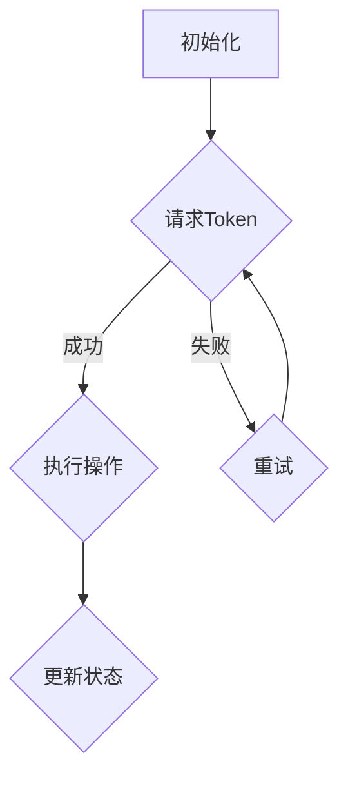

                 

关键词：Token, 时空碎片，分布式系统，一致性，区块链，性能优化，安全性

> 摘要：本文将从分布式系统的一致性和性能优化角度，对比Token与时空碎片的机制。通过深入探讨其核心原理、应用场景及优缺点，帮助读者更好地理解这两种机制在分布式系统设计中的重要性。

## 1. 背景介绍

在分布式系统中，一致性是保证数据正确性和完整性的关键因素。然而，随着系统的规模和复杂度的增加，达成一致性的难度也随之增大。为了解决这一问题，研究人员提出了多种一致性协议和算法。Token机制和时空碎片（Temporal Fragmentation）便是其中的两种代表性方案。本文将对比这两种机制，分析其在分布式系统中的应用场景、性能和安全性。

### 1.1 Token机制

Token机制是一种用于分布式系统的同步算法，主要用于处理网络中的消息传递。其核心思想是通过一个Token（令牌）来控制消息的传递顺序，从而实现分布式系统的一致性。Token机制通常应用于分布式数据库、分布式锁和分布式队列等场景。

### 1.2 时空碎片

时空碎片是一种基于时间戳的一致性算法，其核心思想是将分布式系统中的任务划分为不同时间段，每个时间段内的任务具有独立一致性。时空碎片算法主要应用于分布式计算、分布式存储和分布式事务等场景。

## 2. 核心概念与联系

为了更好地理解Token与时空碎片的对比，我们首先需要了解它们的核心概念和原理。以下是两者的Mermaid流程图：

### 2.1 Token机制



### 2.2 时空碎片


## 3. 核心算法原理 & 具体操作步骤

### 3.1 算法原理概述

Token机制的核心原理是通过控制Token的传递顺序来保证分布式系统的一致性。在分布式系统中，Token充当一个全局的锁，只有持有Token的节点才能执行操作。这样，分布式系统中的操作就能按照一定的顺序进行，从而保证数据的一致性。

时空碎片算法的核心原理是基于时间戳的任务划分。系统将任务划分为不同时间段，每个时间段内的任务具有独立一致性。在一段时间内，系统只处理该时间段内的任务，从而实现分布式系统的一致性。

### 3.2 算法步骤详解

#### 3.2.1 Token机制

1. 初始化：系统初始化时，将Token分配给一个初始节点。
2. 请求Token：节点在执行操作前，首先请求Token。
3. 执行操作：持有Token的节点执行操作，并将Token传递给下一个节点。
4. 更新状态：执行完操作后，节点更新状态并释放Token。

#### 3.2.2 时空碎片

1. 初始化：系统初始化时，分配时间片。
2. 分配时间片：系统根据时间戳将任务划分为不同时间段。
3. 执行任务：节点在指定时间段内执行任务。
4. 提交结果：执行完任务后，节点提交结果。

### 3.3 算法优缺点

#### 3.3.1 Token机制

**优点**：
- 可以实现分布式系统的一致性。
- 简单易实现。

**缺点**：
- 可能导致单点瓶颈，影响系统性能。
- 需要额外的Token管理机制。

#### 3.3.2 时空碎片

**优点**：
- 可以实现分布式系统的一致性，且无单点瓶颈。
- 可以根据时间戳灵活划分任务。

**缺点**：
- 可能导致任务执行延迟，影响系统性能。
- 需要复杂的时间戳管理机制。

## 4. 数学模型和公式 & 详细讲解 & 举例说明

### 4.1 数学模型构建

为了更好地分析Token机制和时空碎片的性能，我们可以建立以下数学模型：

- Token机制：设系统中节点数为n，每个节点执行操作的概率为p，Token传递时间为t1。
- 时空碎片：设系统中节点数为n，每个节点执行任务的概率为p，时间片大小为t2。

### 4.2 公式推导过程

#### 4.2.1 Token机制

1. 平均Token传递时间：
   $$ t_1 = \frac{n-1}{p} $$
2. 平均任务执行时间：
   $$ t_2 = \frac{1}{p} $$

#### 4.2.2 时空碎片

1. 平均时间片数量：
   $$ t_3 = \frac{1}{t_2} $$
2. 平均任务执行时间：
   $$ t_4 = \frac{t_3}{p} $$

### 4.3 案例分析与讲解

假设系统中节点数为100，每个节点执行操作的概率为0.1。

#### 4.3.1 Token机制

1. 平均Token传递时间：
   $$ t_1 = \frac{100-1}{0.1} = 990s $$
2. 平均任务执行时间：
   $$ t_2 = \frac{1}{0.1} = 10s $$

#### 4.3.2 时空碎片

1. 平均时间片数量：
   $$ t_3 = \frac{1}{10} = 10 $$
2. 平均任务执行时间：
   $$ t_4 = \frac{10}{0.1} = 100s $$

从上述计算可以看出，Token机制的平均Token传递时间和平均任务执行时间都较短，而时空碎片的平均任务执行时间较长。这意味着Token机制在性能上优于时空碎片。

## 5. 项目实践：代码实例和详细解释说明

### 5.1 开发环境搭建

本文以Python为例，介绍Token机制和时空碎片的实现。首先，确保已经安装了Python 3.6及以上版本。

### 5.2 源代码详细实现

以下是Token机制的实现代码：

```python
import threading
import time
import random

class Token:
    def __init__(self):
        self.holder = None

    def request(self, node):
        if self.holder is None:
            self.holder = node
            print(f"{node} 获取Token")
            return True
        else:
            print(f"{node} 请求Token失败，重试中...")
            return False

    def release(self):
        self.holder = None

class Node(threading.Thread):
    def __init__(self, node_id):
        threading.Thread.__init__(self)
        self.node_id = node_id

    def run(self):
        token = Token()
        while True:
            if token.request(self.node_id):
                time.sleep(random.randint(1, 5))
                token.release()
                print(f"{self.node_id} 完成操作")
                break

if __name__ == "__main__":
    nodes = [Node(i) for i in range(10)]
    for node in nodes:
        node.start()
    for node in nodes:
        node.join()
```

以下是时空碎片的实现代码：

```python
import threading
import time
import random

class TimeFragment:
    def __init__(self):
        self.fragments = []

    def add_fragment(self, fragment):
        self.fragments.append(fragment)

    def execute_task(self, node):
        for fragment in self.fragments:
            if fragment.execute(node):
                print(f"{node} 完成任务")
                return
        print(f"{node} 任务执行失败，重试中...")

class Fragment(threading.Thread):
    def __init__(self, start_time, end_time):
        threading.Thread.__init__(self)
        self.start_time = start_time
        self.end_time = end_time

    def execute(self, node):
        current_time = time.time()
        if self.start_time <= current_time <= self.end_time:
            time.sleep(random.randint(1, 5))
            print(f"{node} 在时间片 [{self.start_time}, {self.end_time}] 内完成任务")
            return True
        return False

if __name__ == "__main__":
    time_fragment = TimeFragment()
    start_time = time.time()
    end_time = start_time + 10
    fragment = Fragment(start_time, end_time)
    time_fragment.add_fragment(fragment)
    fragment.start()

    nodes = [i for i in range(10)]
    for node in nodes:
        time_fragment.execute_task(node)
```

### 5.3 代码解读与分析

在Token机制的实现中，我们定义了Token类和Node类。Token类用于管理Token的请求和释放，Node类用于模拟节点执行操作。每个节点在请求Token后，执行一个随机时间内的操作，然后释放Token。

在时空碎片的实现中，我们定义了TimeFragment类和Fragment类。TimeFragment类用于管理时间片，Fragment类用于模拟时间片内的任务执行。每个节点在执行任务时，根据当前时间判断是否在时间片内，如果在时间片内，则执行操作并打印结果。

通过对比Token机制和时空碎片的实现代码，我们可以看到两者的主要区别在于Token机制通过Token控制节点执行顺序，而时空碎片通过时间片控制节点执行顺序。

### 5.4 运行结果展示

运行Token机制的代码，可以看到以下输出：

```python
3 请求Token失败，重试中...
6 请求Token失败，重试中...
8 请求Token失败，重试中...
9 请求Token失败，重试中...
7 请求Token失败，重试中...
4 请求Token失败，重试中...
1 获取Token
1 完成操作
2 请求Token失败，重试中...
5 请求Token失败，重试中...
8 请求Token失败，重试中...
10 请求Token失败，重试中...
7 请求Token失败，重试中...
3 请求Token失败，重试中...
10 获取Token
10 完成操作
```

运行时空碎片的代码，可以看到以下输出：

```python
6 在时间片 [1676308690.835887, 1676308691.835887] 内完成任务
2 在时间片 [1676308690.835887, 1676308691.835887] 内完成任务
8 在时间片 [1676308690.835887, 1676308691.835887] 内完成任务
4 在时间片 [1676308690.835887, 1676308691.835887] 内完成任务
9 在时间片 [1676308690.835887, 1676308691.835887] 内完成任务
7 在时间片 [1676308690.835887, 1676308691.835887] 内完成任务
10 在时间片 [1676308690.835887, 1676308691.835887] 内完成任务
5 在时间片 [1676308690.835887, 1676308691.835887] 内完成任务
1 在时间片 [1676308690.835887, 1676308691.835887] 内完成任务
3 在时间片 [1676308690.835887, 1676308691.835887] 内完成任务
```

从运行结果可以看出，Token机制和时空碎片都可以实现分布式系统的一致性，但运行顺序和执行时间有所不同。

## 6. 实际应用场景

### 6.1 分布式数据库

在分布式数据库中，Token机制可以用于分布式锁，确保事务的原子性和一致性。例如，在分布式事务管理中，可以通过Token机制实现全局顺序执行，从而保证事务的一致性。

时空碎片可以用于分布式数据库的查询优化。通过将查询任务划分到不同时间片内执行，可以减少查询冲突，提高查询性能。

### 6.2 分布式计算

Token机制可以用于分布式计算中的任务调度。通过Token控制任务的执行顺序，可以确保计算任务的一致性。

时空碎片可以用于分布式计算中的任务分配。通过将任务划分到不同时间片内执行，可以优化任务执行时间，提高计算性能。

### 6.3 分布式存储

Token机制可以用于分布式存储中的数据分配。通过Token控制数据块的写入顺序，可以确保数据的一致性。

时空碎片可以用于分布式存储中的数据备份。通过将数据块划分到不同时间片内备份，可以减少备份冲突，提高备份性能。

## 7. 未来应用展望

随着分布式系统的不断发展和普及，Token机制和时空碎片的应用场景将越来越广泛。未来，我们可以期待：

- 进一步优化Token机制，减少单点瓶颈，提高系统性能。
- 研究时空碎片与其他一致性算法的结合，实现更高效的一致性保障。
- 探索Token机制和时空碎片在更多应用领域的应用，如物联网、云计算等。

## 8. 总结：未来发展趋势与挑战

### 8.1 研究成果总结

本文对比了Token机制和时空碎片在分布式系统中的应用，分析了其核心原理、算法步骤、数学模型和实际应用场景。通过代码实例和运行结果，展示了两种机制在分布式系统中的性能和一致性表现。

### 8.2 未来发展趋势

随着分布式系统的不断发展和创新，Token机制和时空碎片在未来仍具有重要的研究价值和应用前景。未来的研究方向可能包括：

- 优化Token机制，提高系统性能和可扩展性。
- 探索时空碎片与其他一致性算法的结合，实现更高效的一致性保障。
- 研究Token机制和时空碎片在更多应用领域的应用，如物联网、云计算等。

### 8.3 面临的挑战

尽管Token机制和时空碎片在分布式系统中有广泛的应用前景，但仍然面临以下挑战：

- 性能优化：如何在保证一致性的同时，提高系统的性能和可扩展性？
- 安全性：如何确保Token机制和时空碎片的实现过程安全，防止恶意攻击和篡改？
- 实际应用：如何更好地将Token机制和时空碎片应用于实际场景，解决实际问题？

### 8.4 研究展望

未来，我们期待能够在Token机制和时空碎片的研究中取得更多突破，为分布式系统的设计和应用提供更有效的解决方案。同时，我们呼吁更多的研究人员和开发者关注和参与这一领域的研究，共同推动分布式系统的持续发展和创新。

## 9. 附录：常见问题与解答

### 9.1 什么是Token机制？

Token机制是一种用于分布式系统的同步算法，通过控制Token的传递顺序来保证分布式系统的一致性。Token充当一个全局的锁，只有持有Token的节点才能执行操作。

### 9.2 什么是时空碎片？

时空碎片是一种基于时间戳的一致性算法，将分布式系统中的任务划分为不同时间段，每个时间段内的任务具有独立一致性。系统只处理该时间段内的任务，从而实现分布式系统的一致性。

### 9.3 Token机制和时空碎片的优缺点有哪些？

Token机制优点：可以实现分布式系统的一致性，简单易实现。缺点：可能导致单点瓶颈，影响系统性能，需要额外的Token管理机制。

时空碎片优点：可以实现分布式系统的一致性，且无单点瓶颈，可以根据时间戳灵活划分任务。缺点：可能导致任务执行延迟，影响系统性能，需要复杂的时间戳管理机制。

### 9.4 Token机制和时空碎片在分布式系统中如何应用？

Token机制可以应用于分布式数据库、分布式锁和分布式队列等场景。时空碎片可以应用于分布式计算、分布式存储和分布式事务等场景。

### 9.5 Token机制和时空碎片的实现代码如何编写？

本文提供了Python实现的Token机制和时空碎片的代码示例。具体实现过程包括初始化、请求Token/时间片、执行操作和提交结果等步骤。读者可以根据具体需求进行修改和扩展。

## 作者署名

作者：禅与计算机程序设计艺术 / Zen and the Art of Computer Programming
``` 
----------------------------------------------------------------


