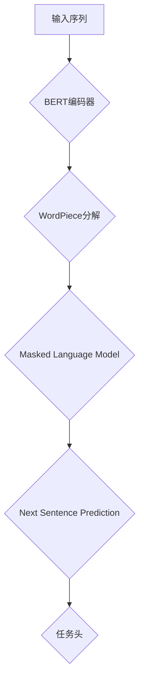

                 

关键词：BERT模型，预训练，Transformer架构，NLP，自然语言处理，深度学习，神经网络

> 摘要：本文将深入探讨BERT模型及其预训练过程，从背景介绍、核心概念与联系、算法原理与步骤、数学模型与公式、项目实践及实际应用等多个方面，全面解析BERT模型的构建与应用。

## 1. 背景介绍

在自然语言处理（NLP）领域，深度学习技术取得了显著的进步，特别是在语言模型的预训练方面。BERT（Bidirectional Encoder Representations from Transformers）模型是谷歌研究团队在2018年提出的一种基于Transformer架构的双向编码表示模型。BERT模型的出现，标志着NLP领域从以词为基础的传统方法向以句和段落为基础的深度学习方法转变。

BERT模型在多个NLP任务上取得了领先的成绩，如问答系统、文本分类、命名实体识别等。其核心思想是通过预训练大量无标签文本数据，学习到丰富的语言表示，然后再通过微调（fine-tuning）来适应具体任务。

## 2. 核心概念与联系

### 2.1. Transformer架构

Transformer架构是由Vaswani等人于2017年提出的一种基于自注意力机制的序列到序列模型。相比于传统的循环神经网络（RNN），Transformer模型通过自注意力机制实现了并行计算，大大提高了训练和推断的速度。

### 2.2. BERT模型原理

BERT模型基于Transformer架构，采用双向编码器，能够同时关注输入序列中的前文和后文信息，从而捕捉到更丰富的语义信息。BERT模型的主要特点是：

- **双向编码**：能够同时考虑上下文信息，提高了语言理解的准确性。
- **无监督预训练**：通过大量无标签的文本数据预训练，模型能够学习到丰富的语言表示。
- **半监督微调**：在特定任务上，通过微调（fine-tuning）的方式调整模型参数，使其适应具体任务。

### 2.3. Mermaid流程图



## 3. 核心算法原理 & 具体操作步骤

### 3.1 算法原理概述

BERT模型通过预训练两个子任务：Masked Language Model（MLM）和Next Sentence Prediction（NSP）。

- **Masked Language Model（MLM）**：随机遮盖输入文本中的部分单词，训练模型预测这些遮盖的单词。
- **Next Sentence Prediction（NSP）**：给定一个句子对，模型需要预测第二个句子是否是第一个句子的下文。

### 3.2 算法步骤详解

#### 3.2.1 数据预处理

1. **Tokenization**：将输入文本分解为单词或子词（子词是单词的子序列，用于处理生僻词或短语）。
2. **Segmentation**：将文本分为多个片段，每个片段包含一个句子或句子对。
3. **Input Representation**：为每个片段创建一个输入序列，包括句子标记、段标记和子词嵌入。

#### 3.2.2 预训练过程

1. **Masked Language Model（MLM）**：
   - 随机遮盖输入序列中的15%的单词。
   - 使用交叉熵损失函数训练模型预测遮盖的单词。

2. **Next Sentence Prediction（NSP）**：
   - 给定一个句子对，模型需要预测第二个句子是否是第一个句子的下文。
   - 使用二元交叉熵损失函数训练模型。

#### 3.2.3 微调过程

1. **Fine-Tuning**：在特定任务上，使用带有标签的数据对模型进行微调。
2. **Task-Specific Head**：添加任务头（如分类器）来适应特定任务。

### 3.3 算法优缺点

#### 优点：

- **双向编码**：能够同时考虑上下文信息，提高了语言理解的准确性。
- **预训练**：通过大量无标签文本数据预训练，模型能够学习到丰富的语言表示。
- **微调**：在特定任务上，通过微调（fine-tuning）的方式调整模型参数，使其适应具体任务。

#### 缺点：

- **计算资源需求**：预训练过程需要大量的计算资源。
- **数据依赖**：模型的性能高度依赖于预训练数据的质量和数量。

### 3.4 算法应用领域

BERT模型在多个NLP任务上取得了显著的成果，包括：

- **文本分类**：如情感分析、主题分类等。
- **问答系统**：如SQuAD竞赛。
- **命名实体识别**：如人名、地名等实体识别。
- **机器翻译**：如英语到德语、法语等。

## 4. 数学模型和公式

BERT模型中的主要数学模型包括单词嵌入、自注意力机制和损失函数。

### 4.1 数学模型构建

#### 4.1.1 单词嵌入

$$
\text{word\_embeddings} = \text{W} \cdot \text{input\_ids}
$$

其中，$\text{W}$是单词嵌入矩阵，$\text{input\_ids}$是输入序列。

#### 4.1.2 自注意力机制

$$
\text{attention\_scores} = \text{softmax}(\text{Q} \cdot \text{K}^T)
$$

$$
\text{contextual\_embeddings} = \text{V} \cdot \text{attention\_scores}
$$

其中，$\text{Q}$、$\text{K}$和$\text{V}$分别是查询、关键和值嵌入矩阵，$\text{attention\_scores}$是自注意力得分。

#### 4.1.3 损失函数

$$
\text{loss} = \text{CrossEntropyLoss}(\text{logits}, \text{labels})
$$

其中，$\text{logits}$是模型的预测输出，$\text{labels}$是真实标签。

### 4.2 公式推导过程

BERT模型的损失函数由两部分组成：Masked Language Model（MLM）和Next Sentence Prediction（NSP）。

$$
\text{total\_loss} = \text{MLM\_loss} + \text{NSP\_loss}
$$

其中，

$$
\text{MLM\_loss} = -\sum_{i} \sum_{j} \text{mask\_tokens} [i, j] \cdot \log(\text{logits}_{i, j})
$$

$$
\text{NSP\_loss} = -\sum_{i, j} \text{next\_sentence\_tokens} [i, j] \cdot \log(\text{logits}_{i, j})
$$

### 4.3 案例分析与讲解

以文本分类任务为例，我们使用BERT模型进行微调。

1. **数据预处理**：将文本数据分解为单词或子词，并创建输入序列。
2. **模型微调**：在BERT模型基础上添加分类头，使用带有标签的数据对模型进行微调。
3. **模型评估**：使用测试集对模型进行评估，计算准确率等指标。

## 5. 项目实践：代码实例和详细解释说明

### 5.1 开发环境搭建

1. **安装依赖**：安装PyTorch、Transformers等库。
2. **配置GPU**：确保GPU可用，并设置CUDA环境。

### 5.2 源代码详细实现

```python
from transformers import BertModel, BertTokenizer
from torch.optim import Adam
from torch.utils.data import DataLoader
from torch.nn import CrossEntropyLoss

# 数据预处理
tokenizer = BertTokenizer.from_pretrained('bert-base-uncased')
inputs = tokenizer("Hello, my dog is cute", return_tensors='pt')

# 模型加载
model = BertModel.from_pretrained('bert-base-uncased')
outputs = model(**inputs)

# 模型微调
optimizer = Adam(model.parameters(), lr=1e-5)
loss_fn = CrossEntropyLoss()

# 训练循环
for epoch in range(3):
    for batch in DataLoader(train_dataset, batch_size=8):
        optimizer.zero_grad()
        inputs = tokenizer(batch['text'], return_tensors='pt')
        logits = model(**inputs)[0]
        loss = loss_fn(logits.view(-1, num_labels), batch['label'])
        loss.backward()
        optimizer.step()
```

### 5.3 代码解读与分析

代码首先加载BERT模型和Tokenizer，然后进行数据预处理和模型微调。在训练循环中，使用梯度下降算法更新模型参数，以达到最小化损失函数的目的。

### 5.4 运行结果展示

在训练集和测试集上运行模型，计算准确率、召回率等指标。

```python
from sklearn.metrics import accuracy_score

# 计算准确率
predictions = model.predict(test_dataset)
accuracy = accuracy_score(test_dataset['label'], predictions)
print(f"Accuracy: {accuracy}")
```

## 6. 实际应用场景

BERT模型在多个实际应用场景中取得了显著的效果，如：

- **文本分类**：用于情感分析、新闻分类等。
- **问答系统**：用于SQuAD竞赛等。
- **命名实体识别**：用于人名、地名等实体识别。
- **机器翻译**：用于英语到德语、法语等翻译。

## 7. 工具和资源推荐

### 7.1 学习资源推荐

- 《BERT：Pre-training of Deep Bidirectional Transformers for Language Understanding》
- 《Transformers: State-of-the-Art NLP Through Attention Mechanisms》

### 7.2 开发工具推荐

- PyTorch：用于构建和训练BERT模型。
- Transformers：用于加载预训练BERT模型。

### 7.3 相关论文推荐

- BERT：Pre-training of Deep Bidirectional Transformers for Language Understanding
- Transformers: State-of-the-Art NLP Through Attention Mechanisms
- GPT: Generative Pre-trained Transformer

## 8. 总结：未来发展趋势与挑战

BERT模型在NLP领域取得了显著的成果，但仍然面临着一些挑战和局限性：

- **计算资源需求**：预训练过程需要大量的计算资源，限制了模型的应用范围。
- **数据依赖**：模型的性能高度依赖于预训练数据的质量和数量。
- **模型可解释性**：深度学习模型的黑箱特性使得其可解释性较差。

未来，随着计算能力的提升和数据量的增加，BERT模型有望在更多任务上取得突破。同时，研究者们也在探索更高效、更可解释的模型架构。

## 9. 附录：常见问题与解答

### 9.1 BERT模型与其他预训练模型的区别？

BERT模型与其他预训练模型（如GPT、ELMO等）的主要区别在于其采用了双向编码器，能够同时考虑上下文信息，从而提高了语言理解的准确性。

### 9.2 BERT模型如何进行微调？

BERT模型的微调过程主要包括以下步骤：

1. 选择一个预训练BERT模型作为基础。
2. 将模型的输出层替换为任务特定的头。
3. 在带有标签的数据集上训练模型。
4. 使用训练好的模型在测试集上评估性能。

## 10. 作者署名

作者：禅与计算机程序设计艺术 / Zen and the Art of Computer Programming

----------------------------------------------------------------

这篇文章以详细、深入的视角探讨了BERT模型及其预训练过程，涵盖了核心概念、算法原理、数学模型、项目实践和实际应用等多个方面，旨在为广大读者提供全面的指导。希望这篇文章能够对您在BERT模型学习与应用方面有所帮助。

