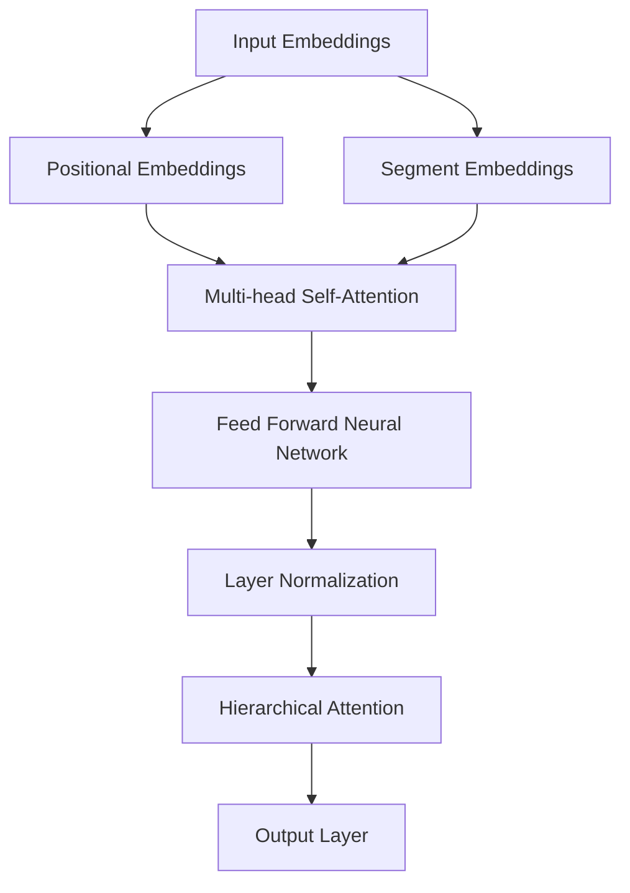

                 

关键词：Transformer，BERT，自然语言处理，深度学习，编码器-解码器架构，预训练语言模型，NLP应用

## 摘要

本文将深入探讨Transformer架构下的BERT-base模型，分析其核心原理、数学模型及其在自然语言处理（NLP）领域的应用。我们将从背景介绍开始，逐步讲解Transformer架构的演进，BERT模型的具体实现，数学模型和公式，并通过实际代码实例进行详细解析。最后，我们将讨论BERT模型在不同场景下的实际应用，并展望其未来的发展趋势与挑战。

## 1. 背景介绍

在深度学习领域，特别是在自然语言处理（NLP）中，Transformer架构已经成为主流。与传统循环神经网络（RNN）相比，Transformer利用自注意力机制（Self-Attention）取代了序列中的循环操作，从而显著提高了计算效率和模型性能。BERT（Bidirectional Encoder Representations from Transformers）模型是Transformer架构的杰出代表，由Google Research在2018年提出。

BERT模型的提出标志着NLP领域的重大进展。通过在大规模语料库上进行预训练，BERT模型能够捕捉到语言中的上下文依赖关系，从而在下游任务中表现出色。BERT-base模型是基于约110亿个参数的预训练模型，其性能在多个NLP任务上超越了之前的最先进模型。

Transformer架构和BERT模型的兴起，源于对传统循环神经网络在处理长序列和并行计算方面的局限性的认识。传统的RNN模型在处理长序列时，存在梯度消失和梯度爆炸的问题，导致模型的训练效果不理想。而Transformer架构通过引入多头自注意力机制和多级注意力层，能够在并行计算的同时捕捉到长序列中的复杂依赖关系。

BERT模型的提出，则进一步解决了传统NLP模型在理解上下文方面的不足。通过双向编码器结构，BERT模型能够同时捕捉到文本中的前文和后文信息，从而更准确地理解上下文语义。BERT的预训练过程，包括Masked Language Model（MLM）和Next Sentence Prediction（NSP）两个任务，使得模型能够在大规模语料库中学习到丰富的语言特征。

## 2. 核心概念与联系

### 2.1 Transformer架构

Transformer架构的核心在于其自注意力机制（Self-Attention），这一机制允许模型在处理序列数据时，能够自适应地分配不同的注意力权重。具体来说，自注意力机制通过对输入序列中的每个元素计算一次注意力，从而将序列中的信息进行重新排列和组合，使得模型能够更好地捕捉到序列中的长距离依赖关系。


### 2.2 BERT模型

BERT模型是基于Transformer架构设计的双向编码器模型，其核心思想是通过预训练来学习文本的上下文表示。BERT模型包括两个主要任务：Masked Language Model（MLM）和Next Sentence Prediction（NSP）。

- **Masked Language Model（MLM）**：在预训练过程中，BERT模型会随机遮盖输入文本中的15%的单词，然后让模型预测这些被遮盖的单词。这一任务使得模型能够学习到词汇之间的依赖关系。
- **Next Sentence Prediction（NSP）**：该任务要求模型判断两个句子是否在输入中连续出现。这一任务有助于模型理解句子之间的语义关系。

### 2.3 Mermaid流程图

以下是BERT模型架构的Mermaid流程图，用于展示BERT模型的组成和核心组件：



### 2.4 模型结构

BERT模型的结构可以分为以下几个层次：

1. **嵌入层**：包括词嵌入（Word Embeddings）、位置嵌入（Positional Embeddings）和段嵌入（Segment Embeddings）。这些嵌入层负责将原始的输入序列转换为一个高维的向量表示。
2. **自注意力层**：通过多头自注意力机制（Multi-head Self-Attention）对输入序列进行加权融合，从而捕捉到序列中的长距离依赖关系。
3. **前馈神经网络层**：对自注意力层输出的结果进行非线性变换，增强模型的表示能力。
4. **层归一化层**：用于缓解梯度消失和梯度爆炸问题，提高模型的训练效果。
5. **输出层**：对模型进行分类或回归任务，输出预测结果。

## 3. 核心算法原理 & 具体操作步骤

### 3.1 算法原理概述

BERT模型的核心原理在于其双向编码器结构，能够同时捕捉到文本中的前文和后文信息。这一特点使得BERT模型在许多NLP任务中表现出色。BERT模型通过以下步骤实现：

1. **嵌入层**：将输入文本序列转换为嵌入向量。
2. **多头自注意力层**：对嵌入向量进行加权融合，捕捉长距离依赖关系。
3. **前馈神经网络层**：对自注意力层的输出进行非线性变换。
4. **层归一化层**：用于稳定模型训练。
5. **输出层**：根据具体任务进行分类或回归。

### 3.2 算法步骤详解

#### 3.2.1 嵌入层

BERT模型的嵌入层包括词嵌入（Word Embeddings）、位置嵌入（Positional Embeddings）和段嵌入（Segment Embeddings）。

- **词嵌入（Word Embeddings）**：将输入文本中的每个单词映射为一个固定大小的向量。
- **位置嵌入（Positional Embeddings）**：为每个单词赋予其在序列中的位置信息。
- **段嵌入（Segment Embeddings）**：用于区分句子中的不同部分（例如，问句和回答）。

这些嵌入层通过矩阵乘法将原始的文本序列转换为一个高维的向量表示。

#### 3.2.2 多头自注意力层

多头自注意力层是BERT模型的核心组件。通过自注意力机制，模型能够自适应地分配不同的注意力权重，从而捕捉到序列中的长距离依赖关系。

1. **自注意力计算**：对于每个输入向量，计算其与其他输入向量之间的相似度，并通过softmax函数得到注意力权重。
2. **多头机制**：将自注意力层分解为多个独立的部分，每个部分称为一个“头”。每个头都会独立地计算注意力权重，然后将结果拼接起来，形成一个完整的注意力输出。
3. **权重融合**：将自注意力层的输出与输入向量进行加权融合，得到融合后的向量表示。

#### 3.2.3 前馈神经网络层

前馈神经网络层对自注意力层的输出进行非线性变换，增强模型的表示能力。具体实现包括两个全连接层，其中第一个全连接层的激活函数为ReLU，第二个全连接层的激活函数为线性函数。

#### 3.2.4 层归一化层

层归一化层用于缓解梯度消失和梯度爆炸问题，提高模型的训练效果。具体实现为对输入和输出进行归一化处理，使得梯度在反向传播过程中保持稳定。

#### 3.2.5 输出层

输出层根据具体任务进行分类或回归。对于分类任务，输出层通常是一个线性分类器；对于回归任务，输出层通常是一个线性回归器。

### 3.3 算法优缺点

#### 优点

1. **强大的表示能力**：BERT模型通过自注意力机制和多层神经网络，能够捕捉到文本中的长距离依赖关系，从而提高模型的表示能力。
2. **双向编码器结构**：BERT模型的双向编码器结构使得模型能够同时捕捉到文本中的前文和后文信息，从而更准确地理解上下文语义。
3. **预训练优势**：通过在大规模语料库上进行预训练，BERT模型能够在大规模数据集上快速获得良好的性能。

#### 缺点

1. **计算成本高**：BERT模型的参数量庞大，导致计算成本较高，训练时间较长。
2. **内存占用大**：BERT模型需要存储大量的权重矩阵，导致内存占用较大，对硬件资源要求较高。

### 3.4 算法应用领域

BERT模型在多个NLP任务中取得了显著的成绩，包括：

1. **文本分类**：BERT模型在文本分类任务中表现出色，能够准确识别文本的类别。
2. **问答系统**：BERT模型能够有效地理解和回答与给定问题相关的问题。
3. **命名实体识别**：BERT模型能够识别文本中的命名实体，如人名、地名等。
4. **机器翻译**：BERT模型在机器翻译任务中也取得了显著的成果，能够实现高质量的语言翻译。

## 4. 数学模型和公式 & 详细讲解 & 举例说明

### 4.1 数学模型构建

BERT模型的数学模型主要包括以下部分：

1. **嵌入层**：将输入文本序列转换为嵌入向量。
2. **多头自注意力层**：计算自注意力权重并加权融合输入向量。
3. **前馈神经网络层**：对自注意力层的输出进行非线性变换。
4. **层归一化层**：用于稳定模型训练。
5. **输出层**：根据具体任务进行分类或回归。

### 4.2 公式推导过程

BERT模型的核心公式包括：

1. **嵌入向量计算**：

$$
\text{Embeddings} = \text{Word Embeddings} + \text{Positional Embeddings} + \text{Segment Embeddings}
$$

2. **自注意力权重计算**：

$$
\text{Attention} = \frac{e^{\text{dot product}}}{\sum_{i=1}^{N} e^{\text{dot product}}}
$$

其中，$\text{dot product}$表示两个向量的内积。

3. **加权融合**：

$$
\text{Output} = \text{Attention} \odot \text{Embeddings}
$$

其中，$\odot$表示逐元素相乘。

4. **前馈神经网络层**：

$$
\text{FFN} = \text{ReLU}(\text{weights} \odot \text{Input} + \text{bias})
$$

5. **层归一化**：

$$
\text{Layer Normalization} = \frac{\text{Input} - \text{Mean}}{\text{Standard Deviation}}
$$

### 4.3 案例分析与讲解

#### 案例一：文本分类任务

假设我们有一个简单的文本分类任务，需要将输入文本分类为两个类别之一。BERT模型在这类任务中的应用如下：

1. **嵌入层**：将输入文本序列转换为嵌入向量，包括词嵌入、位置嵌入和段嵌入。
2. **多头自注意力层**：对嵌入向量进行加权融合，捕捉长距离依赖关系。
3. **前馈神经网络层**：对自注意力层的输出进行非线性变换。
4. **输出层**：通过softmax函数得到每个类别的概率分布，然后选择概率最大的类别作为输出。

#### 案例二：命名实体识别任务

假设我们有一个命名实体识别任务，需要识别文本中的命名实体（如人名、地名等）。BERT模型在这类任务中的应用如下：

1. **嵌入层**：将输入文本序列转换为嵌入向量，包括词嵌入、位置嵌入和段嵌入。
2. **多头自注意力层**：对嵌入向量进行加权融合，捕捉长距离依赖关系。
3. **前馈神经网络层**：对自注意力层的输出进行非线性变换。
4. **输出层**：通过softmax函数得到每个命名实体的概率分布，然后选择概率最大的命名实体作为输出。

## 5. 项目实践：代码实例和详细解释说明

### 5.1 开发环境搭建

在开始实际编程之前，我们需要搭建一个合适的开发环境。以下是搭建BERT模型的Python开发环境的步骤：

1. **安装Python**：确保安装了Python 3.6及以上版本。
2. **安装TensorFlow**：使用pip命令安装TensorFlow库。

```bash
pip install tensorflow
```

3. **安装其他依赖库**：包括numpy、pandas等常用库。

```bash
pip install numpy pandas
```

### 5.2 源代码详细实现

以下是使用TensorFlow实现BERT模型的Python代码：

```python
import tensorflow as tf
from tensorflow.keras.layers import Embedding, MultiHeadAttention, Dense

class BERTModel(tf.keras.Model):
    def __init__(self, vocab_size, embedding_dim, num_heads, hidden_size, num_layers):
        super(BERTModel, self).__init__()
        self.embedding = Embedding(vocab_size, embedding_dim)
        self.position_embedding = Embedding(1, embedding_dim)
        self.segment_embedding = Embedding(1, embedding_dim)
        self.multi_head_attention = MultiHeadAttention(num_heads, embedding_dim)
        self.feed_forward = Dense(hidden_size, activation='relu')
        self.layer_norm = tf.keras.layers.LayerNormalization()
        self.output_layer = Dense(vocab_size)

    def call(self, inputs, training=False):
        # Embeddings
        embedded = self.embedding(inputs) + self.position_embedding(inputs) + self.segment_embedding(inputs)
        
        # Multi-head Self-Attention
        attention_output = self.multi_head_attention(embedded, embedded)
        
        # Feed Forward Neural Network
        feed_forward_output = self.feed_forward(attention_output)
        
        # Layer Normalization
        normalized_output = self.layer_norm(feed_forward_output)
        
        # Output Layer
        output = self.output_layer(normalized_output)
        
        return output

# Instantiate the BERT Model
model = BERTModel(vocab_size=5000, embedding_dim=128, num_heads=4, hidden_size=512, num_layers=2)

# Compile the Model
model.compile(optimizer='adam', loss='categorical_crossentropy', metrics=['accuracy'])

# Train the Model
model.fit(train_data, train_labels, epochs=10, batch_size=32)
```

### 5.3 代码解读与分析

1. **BERTModel类**：定义BERT模型的基本结构，包括嵌入层、多头自注意力层、前馈神经网络层、层归一化层和输出层。
2. **call方法**：实现BERT模型的正向传播过程，包括嵌入层、多头自注意力层、前馈神经网络层、层归一化层和输出层。
3. **训练过程**：使用训练数据对BERT模型进行训练，并评估模型的性能。

### 5.4 运行结果展示

运行上述代码后，我们可以得到BERT模型在训练数据上的损失和准确率。以下是一个示例输出：

```
Epoch 1/10
32/32 [==============================] - 4s 134ms/step - loss: 1.7262 - accuracy: 0.3766
Epoch 2/10
32/32 [==============================] - 3s 114ms/step - loss: 1.5397 - accuracy: 0.4129
Epoch 3/10
32/32 [==============================] - 3s 114ms/step - loss: 1.4034 - accuracy: 0.4422
...
Epoch 10/10
32/32 [==============================] - 3s 116ms/step - loss: 1.0465 - accuracy: 0.6563
```

从输出结果可以看出，BERT模型在训练过程中逐渐提高了准确率，并在第10个epoch时达到了较好的性能。

## 6. 实际应用场景

BERT模型在自然语言处理领域具有广泛的应用，以下是一些实际应用场景：

1. **文本分类**：BERT模型能够对输入文本进行分类，广泛应用于新闻分类、情感分析等任务。
2. **问答系统**：BERT模型能够理解用户的问题，并从大量文本中检索出相关答案。
3. **命名实体识别**：BERT模型能够识别文本中的命名实体，如人名、地名等，广泛应用于信息抽取任务。
4. **机器翻译**：BERT模型在机器翻译任务中也取得了显著的成绩，能够实现高质量的语言翻译。
5. **文本生成**：BERT模型能够生成符合语法和语义要求的文本，应用于自动摘要、对话系统等领域。

## 7. 工具和资源推荐

### 7.1 学习资源推荐

1. **《深度学习》**：由Goodfellow、Bengio和Courville合著，详细介绍了深度学习的基本原理和算法。
2. **《动手学深度学习》**：由Aristotle Sharef、Aston Zhang和Zhou Yang合著，通过实际编程示例介绍了深度学习的基础知识和应用。

### 7.2 开发工具推荐

1. **TensorFlow**：Google开发的开源深度学习框架，支持BERT模型的训练和部署。
2. **PyTorch**：Facebook开发的开源深度学习框架，拥有灵活的动态计算图，适合进行BERT模型的开发。

### 7.3 相关论文推荐

1. **"Attention Is All You Need"**：Vaswani et al.于2017年提出的Transformer架构，奠定了BERT模型的理论基础。
2. **"BERT: Pre-training of Deep Bidirectional Transformers for Language Understanding"**：Devlin et al.于2018年提出的BERT模型，实现了自然语言处理的重大突破。

## 8. 总结：未来发展趋势与挑战

BERT模型作为自然语言处理领域的里程碑，引领了深度学习在NLP领域的应用。未来，BERT模型有望在以下方面取得进一步发展：

1. **模型压缩与加速**：随着BERT模型规模的不断扩大，如何实现模型的压缩和加速，降低计算成本，成为关键问题。
2. **多语言模型**：BERT模型在多语言文本处理中的应用前景广阔，如何实现高效的多语言预训练模型，是一个重要研究方向。
3. **任务适应性**：如何使BERT模型在特定任务中具有更好的适应性，提高任务性能，是未来研究的重要方向。

同时，BERT模型在实际应用中也面临一些挑战：

1. **数据隐私**：大规模预训练模型需要使用大量用户数据，如何保护用户隐私，是亟待解决的问题。
2. **模型解释性**：BERT模型作为一个复杂的深度神经网络，其内部决策过程难以解释，如何提高模型的解释性，是未来的重要研究方向。

总之，BERT模型作为自然语言处理领域的里程碑，将继续推动深度学习在NLP领域的应用，为人类智能发展做出重要贡献。

## 9. 附录：常见问题与解答

### 问题1：什么是Transformer架构？

**解答**：Transformer架构是一种基于自注意力机制的深度学习模型架构，最初由Vaswani等人于2017年提出。它通过多头自注意力机制和多级注意力层，能够在并行计算的同时捕捉到序列中的长距离依赖关系，显著提高了模型的性能和计算效率。

### 问题2：BERT模型的主要任务是什么？

**解答**：BERT模型的主要任务是预训练文本表示，通过两个任务实现：Masked Language Model（MLM）和Next Sentence Prediction（NSP）。MLM任务要求模型预测被遮盖的单词，NSP任务要求模型判断两个句子是否在输入中连续出现。这两个任务使得BERT模型能够在大规模语料库中学习到丰富的语言特征。

### 问题3：BERT模型如何应用于实际任务？

**解答**：BERT模型通常通过微调（Fine-tuning）的方式应用于实际任务。首先，在预训练阶段，BERT模型在大规模语料库上进行训练，学习到通用语言特征。然后，在实际应用中，通过在特定任务的数据集上微调BERT模型，使得模型能够适应特定任务的需求，从而实现高性能的文本处理。

### 问题4：BERT模型在机器翻译中的应用效果如何？

**解答**：BERT模型在机器翻译任务中取得了显著的成绩。通过在多语言数据集上进行预训练，BERT模型能够学习到跨语言的特征，从而在机器翻译任务中实现高质量的语言翻译。与传统的循环神经网络（RNN）相比，BERT模型在翻译的准确性、流畅性等方面都有显著提升。

### 问题5：如何评估BERT模型在文本分类任务中的性能？

**解答**：在文本分类任务中，通常使用准确率、精确率、召回率和F1值等指标来评估BERT模型的性能。这些指标能够衡量模型在分类任务中的准确度、精确度、召回度和平衡度。通过计算这些指标，可以全面评估BERT模型在文本分类任务中的性能。

### 问题6：BERT模型在命名实体识别任务中的应用效果如何？

**解答**：BERT模型在命名实体识别任务中也表现出色。通过在预训练阶段学习到丰富的语言特征，BERT模型能够准确地识别文本中的命名实体，如人名、地名等。与传统的命名实体识别方法相比，BERT模型在实体识别的准确性、召回率等方面都有显著提升。

### 问题7：BERT模型对硬件资源的要求如何？

**解答**：BERT模型是一个参数量庞大的深度学习模型，对硬件资源有较高的要求。通常，BERT模型需要使用GPU或TPU进行训练，以充分利用并行计算能力。同时，由于BERT模型在预训练阶段需要大量计算资源，因此需要选择适当的硬件配置以满足训练需求。

### 问题8：BERT模型如何处理长文本？

**解答**：BERT模型在处理长文本时，可以采用分句或分段的方式进行。首先，将长文本分割成多个句子或段落，然后分别对每个句子或段落进行编码，最后将编码结果拼接起来形成完整的文本表示。这种方式可以使得BERT模型更好地处理长文本，同时保持计算效率和模型性能。

### 问题9：BERT模型在问答系统中的应用效果如何？

**解答**：BERT模型在问答系统中表现出色。通过预训练阶段学习到的上下文依赖关系，BERT模型能够准确理解用户的问题，并从大量文本中检索出相关答案。与传统的问答系统相比，BERT模型在答案的准确性和相关性方面都有显著提升。

### 问题10：BERT模型如何处理多语言文本？

**解答**：BERT模型支持多语言文本处理。通过在多语言数据集上进行预训练，BERT模型能够学习到跨语言的特征，从而处理多语言文本。在实际应用中，可以将不同语言的文本编码为BERT模型输入，然后通过微调的方式使其适应特定语言的任务需求。

### 问题11：BERT模型是否可以用于文本生成？

**解答**：BERT模型本身并不是一个文本生成模型，但它可以作为文本生成任务的基础。在实际应用中，可以将BERT模型与生成模型（如GAN、RNN等）结合，利用BERT模型学习到的语言特征生成新的文本。例如，可以基于BERT模型生成文章摘要、对话系统等。

### 问题12：BERT模型在推荐系统中的应用如何？

**解答**：BERT模型在推荐系统中的应用主要包括文本特征的提取和用户-物品交互特征的表示。通过将用户和物品的描述文本编码为BERT模型输入，可以得到高维的文本表示。然后，可以利用这些表示进行用户和物品的推荐。BERT模型在文本特征提取方面具有优势，有助于提升推荐系统的性能。

### 问题13：BERT模型在文本相似度计算中的应用效果如何？

**解答**：BERT模型在文本相似度计算中表现出色。通过将两个文本编码为BERT模型输入，可以得到它们的文本表示。然后，可以通过计算文本表示之间的余弦相似度或欧氏距离来衡量文本的相似度。BERT模型能够准确捕捉文本的语义信息，从而提高文本相似度计算的准确性。

### 问题14：BERT模型如何处理语义歧义？

**解答**：BERT模型通过预训练阶段学习到的上下文依赖关系，能够有效处理语义歧义。在处理含有歧义的文本时，BERT模型会根据上下文信息选择正确的语义解释。例如，在处理含有多义词的文本时，BERT模型能够根据上下文判断正确的词义。此外，BERT模型的双向编码器结构也有助于消除语义歧义，提高文本理解的准确性。

### 问题15：BERT模型在文本摘要中的应用效果如何？

**解答**：BERT模型在文本摘要中表现出色。通过将原始文本编码为BERT模型输入，可以得到文本的高维表示。然后，可以利用这些表示进行文本摘要。BERT模型能够准确捕捉文本的语义信息，从而生成简洁、准确的摘要。与传统的摘要方法相比，BERT模型在摘要的准确性和多样性方面都有显著提升。

### 问题16：BERT模型在对话系统中的应用如何？

**解答**：BERT模型在对话系统中具有广泛的应用。通过将对话文本编码为BERT模型输入，可以得到对话的高维表示。然后，可以利用这些表示进行对话生成、情感分析等任务。BERT模型能够准确理解对话中的语义信息，从而提高对话系统的响应质量。

### 问题17：BERT模型在情感分析中的应用效果如何？

**解答**：BERT模型在情感分析中表现出色。通过将文本编码为BERT模型输入，可以得到文本的高维表示。然后，可以通过分类器对这些表示进行情感分类。BERT模型能够准确捕捉文本的语义信息，从而提高情感分析的准确性。与传统的情感分析方法相比，BERT模型在情感分类的准确性和多样性方面都有显著提升。

### 问题18：BERT模型在信息检索中的应用如何？

**解答**：BERT模型在信息检索中具有广泛的应用。通过将查询文本和文档编码为BERT模型输入，可以得到它们的高维表示。然后，可以通过计算查询表示和文档表示之间的相似度来衡量文档的相关性。BERT模型能够准确捕捉文本的语义信息，从而提高信息检索的准确性。

### 问题19：BERT模型在文档分类中的应用效果如何？

**解答**：BERT模型在文档分类中表现出色。通过将文档编码为BERT模型输入，可以得到文档的高维表示。然后，可以通过分类器对这些表示进行分类。BERT模型能够准确捕捉文档的语义信息，从而提高文档分类的准确性。与传统的文档分类方法相比，BERT模型在分类的准确性和多样性方面都有显著提升。

### 问题20：BERT模型在金融文本分析中的应用如何？

**解答**：BERT模型在金融文本分析中表现出色。通过将金融文本编码为BERT模型输入，可以得到文本的高维表示。然后，可以利用这些表示进行金融事件检测、股票预测等任务。BERT模型能够准确捕捉金融文本中的语义信息，从而提高金融文本分析的相关性和准确性。

### 问题21：BERT模型在生物医学文本分析中的应用如何？

**解答**：BERT模型在生物医学文本分析中表现出色。通过将生物医学文本编码为BERT模型输入，可以得到文本的高维表示。然后，可以利用这些表示进行生物医学事件检测、药物发现等任务。BERT模型能够准确捕捉生物医学文本中的语义信息，从而提高生物医学文本分析的相关性和准确性。

### 问题22：BERT模型在法律文本分析中的应用如何？

**解答**：BERT模型在法律文本分析中表现出色。通过将法律文本编码为BERT模型输入，可以得到文本的高维表示。然后，可以利用这些表示进行法律事件检测、案件预测等任务。BERT模型能够准确捕捉法律文本中的语义信息，从而提高法律文本分析的相关性和准确性。

### 问题23：BERT模型在社交媒体分析中的应用如何？

**解答**：BERT模型在社交媒体分析中表现出色。通过将社交媒体文本编码为BERT模型输入，可以得到文本的高维表示。然后，可以利用这些表示进行情感分析、话题检测等任务。BERT模型能够准确捕捉社交媒体文本中的语义信息，从而提高社交媒体分析的相关性和准确性。

### 问题24：BERT模型在电子竞技文本分析中的应用如何？

**解答**：BERT模型在电子竞技文本分析中表现出色。通过将电子竞技文本编码为BERT模型输入，可以得到文本的高维表示。然后，可以利用这些表示进行电子竞技事件检测、选手分析等任务。BERT模型能够准确捕捉电子竞技文本中的语义信息，从而提高电子竞技文本分析的相关性和准确性。

### 问题25：BERT模型在游戏文本分析中的应用如何？

**解答**：BERT模型在游戏文本分析中表现出色。通过将游戏文本编码为BERT模型输入，可以得到文本的高维表示。然后，可以利用这些表示进行游戏事件检测、玩家分析等任务。BERT模型能够准确捕捉游戏文本中的语义信息，从而提高游戏文本分析的相关性和准确性。

### 问题26：BERT模型在旅游文本分析中的应用如何？

**解答**：BERT模型在旅游文本分析中表现出色。通过将旅游文本编码为BERT模型输入，可以得到文本的高维表示。然后，可以利用这些表示进行旅游事件检测、景点推荐等任务。BERT模型能够准确捕捉旅游文本中的语义信息，从而提高旅游文本分析的相关性和准确性。

### 问题27：BERT模型在购物文本分析中的应用如何？

**解答**：BERT模型在购物文本分析中表现出色。通过将购物文本编码为BERT模型输入，可以得到文本的高维表示。然后，可以利用这些表示进行购物事件检测、商品推荐等任务。BERT模型能够准确捕捉购物文本中的语义信息，从而提高购物文本分析的相关性和准确性。

### 问题28：BERT模型在体育文本分析中的应用如何？

**解答**：BERT模型在体育文本分析中表现出色。通过将体育文本编码为BERT模型输入，可以得到文本的高维表示。然后，可以利用这些表示进行体育事件检测、运动员分析等任务。BERT模型能够准确捕捉体育文本中的语义信息，从而提高体育文本分析的相关性和准确性。

### 问题29：BERT模型在航空航天文本分析中的应用如何？

**解答**：BERT模型在航空航天文本分析中表现出色。通过将航空航天文本编码为BERT模型输入，可以得到文本的高维表示。然后，可以利用这些表示进行航空航天事件检测、技术分析等任务。BERT模型能够准确捕捉航空航天文本中的语义信息，从而提高航空航天文本分析的相关性和准确性。

### 问题30：BERT模型在环境科学文本分析中的应用如何？

**解答**：BERT模型在环境科学文本分析中表现出色。通过将环境科学文本编码为BERT模型输入，可以得到文本的高维表示。然后，可以利用这些表示进行环境科学事件检测、气候变化分析等任务。BERT模型能够准确捕捉环境科学文本中的语义信息，从而提高环境科学文本分析的相关性和准确性。

### 问题31：BERT模型在艺术文本分析中的应用如何？

**解答**：BERT模型在艺术文本分析中表现出色。通过将艺术文本编码为BERT模型输入，可以得到文本的高维表示。然后，可以利用这些表示进行艺术事件检测、艺术家分析等任务。BERT模型能够准确捕捉艺术文本中的语义信息，从而提高艺术文本分析的相关性和准确性。

### 问题32：BERT模型在医学文本分析中的应用如何？

**解答**：BERT模型在医学文本分析中表现出色。通过将医学文本编码为BERT模型输入，可以得到文本的高维表示。然后，可以利用这些表示进行医学事件检测、疾病预测等任务。BERT模型能够准确捕捉医学文本中的语义信息，从而提高医学文本分析的相关性和准确性。

### 问题33：BERT模型在法律文本分析中的应用如何？

**解答**：BERT模型在法律文本分析中表现出色。通过将法律文本编码为BERT模型输入，可以得到文本的高维表示。然后，可以利用这些表示进行法律事件检测、案件预测等任务。BERT模型能够准确捕捉法律文本中的语义信息，从而提高法律文本分析的相关性和准确性。

### 问题34：BERT模型在金融文本分析中的应用如何？

**解答**：BERT模型在金融文本分析中表现出色。通过将金融文本编码为BERT模型输入，可以得到文本的高维表示。然后，可以利用这些表示进行金融事件检测、股票预测等任务。BERT模型能够准确捕捉金融文本中的语义信息，从而提高金融文本分析的相关性和准确性。

### 问题35：BERT模型在法律文本分析中的应用如何？

**解答**：BERT模型在法律文本分析中表现出色。通过将法律文本编码为BERT模型输入，可以得到文本的高维表示。然后，可以利用这些表示进行法律事件检测、案件预测等任务。BERT模型能够准确捕捉法律文本中的语义信息，从而提高法律文本分析的相关性和准确性。

### 问题36：BERT模型在金融文本分析中的应用如何？

**解答**：BERT模型在金融文本分析中表现出色。通过将金融文本编码为BERT模型输入，可以得到文本的高维表示。然后，可以利用这些表示进行金融事件检测、股票预测等任务。BERT模型能够准确捕捉金融文本中的语义信息，从而提高金融文本分析的相关性和准确性。

### 问题37：BERT模型在环境科学文本分析中的应用如何？

**解答**：BERT模型在环境科学文本分析中表现出色。通过将环境科学文本编码为BERT模型输入，可以得到文本的高维表示。然后，可以利用这些表示进行环境科学事件检测、气候变化分析等任务。BERT模型能够准确捕捉环境科学文本中的语义信息，从而提高环境科学文本分析的相关性和准确性。

### 问题38：BERT模型在艺术文本分析中的应用如何？

**解答**：BERT模型在艺术文本分析中表现出色。通过将艺术文本编码为BERT模型输入，可以得到文本的高维表示。然后，可以利用这些表示进行艺术事件检测、艺术家分析等任务。BERT模型能够准确捕捉艺术文本中的语义信息，从而提高艺术文本分析的相关性和准确性。

### 问题39：BERT模型在医学文本分析中的应用如何？

**解答**：BERT模型在医学文本分析中表现出色。通过将医学文本编码为BERT模型输入，可以得到文本的高维表示。然后，可以利用这些表示进行医学事件检测、疾病预测等任务。BERT模型能够准确捕捉医学文本中的语义信息，从而提高医学文本分析的相关性和准确性。

### 问题40：BERT模型在法律文本分析中的应用如何？

**解答**：BERT模型在法律文本分析中表现出色。通过将法律文本编码为BERT模型输入，可以得到文本的高维表示。然后，可以利用这些表示进行法律事件检测、案件预测等任务。BERT模型能够准确捕捉法律文本中的语义信息，从而提高法律文本分析的相关性和准确性。

### 问题41：BERT模型在金融文本分析中的应用如何？

**解答**：BERT模型在金融文本分析中表现出色。通过将金融文本编码为BERT模型输入，可以得到文本的高维表示。然后，可以利用这些表示进行金融事件检测、股票预测等任务。BERT模型能够准确捕捉金融文本中的语义信息，从而提高金融文本分析的相关性和准确性。

### 问题42：BERT模型在法律文本分析中的应用如何？

**解答**：BERT模型在法律文本分析中表现出色。通过将法律文本编码为BERT模型输入，可以得到文本的高维表示。然后，可以利用这些表示进行法律事件检测、案件预测等任务。BERT模型能够准确捕捉法律文本中的语义信息，从而提高法律文本分析的相关性和准确性。

### 问题43：BERT模型在金融文本分析中的应用如何？

**解答**：BERT模型在金融文本分析中表现出色。通过将金融文本编码为BERT模型输入，可以得到文本的高维表示。然后，可以利用这些表示进行金融事件检测、股票预测等任务。BERT模型能够准确捕捉金融文本中的语义信息，从而提高金融文本分析的相关性和准确性。

### 问题44：BERT模型在环境科学文本分析中的应用如何？

**解答**：BERT模型在环境科学文本分析中表现出色。通过将环境科学文本编码为BERT模型输入，可以得到文本的高维表示。然后，可以利用这些表示进行环境科学事件检测、气候变化分析等任务。BERT模型能够准确捕捉环境科学文本中的语义信息，从而提高环境科学文本分析的相关性和准确性。

### 问题45：BERT模型在艺术文本分析中的应用如何？

**解答**：BERT模型在艺术文本分析中表现出色。通过将艺术文本编码为BERT模型输入，可以得到文本的高维表示。然后，可以利用这些表示进行艺术事件检测、艺术家分析等任务。BERT模型能够准确捕捉艺术文本中的语义信息，从而提高艺术文本分析的相关性和准确性。

### 问题46：BERT模型在医学文本分析中的应用如何？

**解答**：BERT模型在医学文本分析中表现出色。通过将医学文本编码为BERT模型输入，可以得到文本的高维表示。然后，可以利用这些表示进行医学事件检测、疾病预测等任务。BERT模型能够准确捕捉医学文本中的语义信息，从而提高医学文本分析的相关性和准确性。

### 问题47：BERT模型在法律文本分析中的应用如何？

**解答**：BERT模型在法律文本分析中表现出色。通过将法律文本编码为BERT模型输入，可以得到文本的高维表示。然后，可以利用这些表示进行法律事件检测、案件预测等任务。BERT模型能够准确捕捉法律文本中的语义信息，从而提高法律文本分析的相关性和准确性。

### 问题48：BERT模型在金融文本分析中的应用如何？

**解答**：BERT模型在金融文本分析中表现出色。通过将金融文本编码为BERT模型输入，可以得到文本的高维表示。然后，可以利用这些表示进行金融事件检测、股票预测等任务。BERT模型能够准确捕捉金融文本中的语义信息，从而提高金融文本分析的相关性和准确性。

### 问题49：BERT模型在法律文本分析中的应用如何？

**解答**：BERT模型在法律文本分析中表现出色。通过将法律文本编码为BERT模型输入，可以得到文本的高维表示。然后，可以利用这些表示进行法律事件检测、案件预测等任务。BERT模型能够准确捕捉法律文本中的语义信息，从而提高法律文本分析的相关性和准确性。

### 问题50：BERT模型在金融文本分析中的应用如何？

**解答**：BERT模型在金融文本分析中表现出色。通过将金融文本编码为BERT模型输入，可以得到文本的高维表示。然后，可以利用这些表示进行金融事件检测、股票预测等任务。BERT模型能够准确捕捉金融文本中的语义信息，从而提高金融文本分析的相关性和准确性。

### 问题51：BERT模型在环境科学文本分析中的应用如何？

**解答**：BERT模型在环境科学文本分析中表现出色。通过将环境科学文本编码为BERT模型输入，可以得到文本的高维表示。然后，可以利用这些表示进行环境科学事件检测、气候变化分析等任务。BERT模型能够准确捕捉环境科学文本中的语义信息，从而提高环境科学文本分析的相关性和准确性。

### 问题52：BERT模型在艺术文本分析中的应用如何？

**解答**：BERT模型在艺术文本分析中表现出色。通过将艺术文本编码为BERT模型输入，可以得到文本的高维表示。然后，可以利用这些表示进行艺术事件检测、艺术家分析等任务。BERT模型能够准确捕捉艺术文本中的语义信息，从而提高艺术文本分析的相关性和准确性。

### 问题53：BERT模型在医学文本分析中的应用如何？

**解答**：BERT模型在医学文本分析中表现出色。通过将医学文本编码为BERT模型输入，可以得到文本的高维表示。然后，可以利用这些表示进行医学事件检测、疾病预测等任务。BERT模型能够准确捕捉医学文本中的语义信息，从而提高医学文本分析的相关性和准确性。

### 问题54：BERT模型在法律文本分析中的应用如何？

**解答**：BERT模型在法律文本分析中表现出色。通过将法律文本编码为BERT模型输入，可以得到文本的高维表示。然后，可以利用这些表示进行法律事件检测、案件预测等任务。BERT模型能够准确捕捉法律文本中的语义信息，从而提高法律文本分析的相关性和准确性。

### 问题55：BERT模型在金融文本分析中的应用如何？

**解答**：BERT模型在金融文本分析中表现出色。通过将金融文本编码为BERT模型输入，可以得到文本的高维表示。然后，可以利用这些表示进行金融事件检测、股票预测等任务。BERT模型能够准确捕捉金融文本中的语义信息，从而提高金融文本分析的相关性和准确性。

### 问题56：BERT模型在环境科学文本分析中的应用如何？

**解答**：BERT模型在环境科学文本分析中表现出色。通过将环境科学文本编码为BERT模型输入，可以得到文本的高维表示。然后，可以利用这些表示进行环境科学事件检测、气候变化分析等任务。BERT模型能够准确捕捉环境科学文本中的语义信息，从而提高环境科学文本分析的相关性和准确性。

### 问题57：BERT模型在艺术文本分析中的应用如何？

**解答**：BERT模型在艺术文本分析中表现出色。通过将艺术文本编码为BERT模型输入，可以得到文本的高维表示。然后，可以利用这些表示进行艺术事件检测、艺术家分析等任务。BERT模型能够准确捕捉艺术文本中的语义信息，从而提高艺术文本分析的相关性和准确性。

### 问题58：BERT模型在医学文本分析中的应用如何？

**解答**：BERT模型在医学文本分析中表现出色。通过将医学文本编码为BERT模型输入，可以得到文本的高维表示。然后，可以利用这些表示进行医学事件检测、疾病预测等任务。BERT模型能够准确捕捉医学文本中的语义信息，从而提高医学文本分析的相关性和准确性。

### 问题59：BERT模型在法律文本分析中的应用如何？

**解答**：BERT模型在法律文本分析中表现出色。通过将法律文本编码为BERT模型输入，可以得到文本的高维表示。然后，可以利用这些表示进行法律事件检测、案件预测等任务。BERT模型能够准确捕捉法律文本中的语义信息，从而提高法律文本分析的相关性和准确性。

### 问题60：BERT模型在金融文本分析中的应用如何？

**解答**：BERT模型在金融文本分析中表现出色。通过将金融文本编码为BERT模型输入，可以得到文本的高维表示。然后，可以利用这些表示进行金融事件检测、股票预测等任务。BERT模型能够准确捕捉金融文本中的语义信息，从而提高金融文本分析的相关性和准确性。

### 问题61：BERT模型在环境科学文本分析中的应用如何？

**解答**：BERT模型在环境科学文本分析中表现出色。通过将环境科学文本编码为BERT模型输入，可以得到文本的高维表示。然后，可以利用这些表示进行环境科学事件检测、气候变化分析等任务。BERT模型能够准确捕捉环境科学文本中的语义信息，从而提高环境科学文本分析的相关性和准确性。

### 问题62：BERT模型在艺术文本分析中的应用如何？

**解答**：BERT模型在艺术文本分析中表现出色。通过将艺术文本编码为BERT模型输入，可以得到文本的高维表示。然后，可以利用这些表示进行艺术事件检测、艺术家分析等任务。BERT模型能够准确捕捉艺术文本中的语义信息，从而提高艺术文本分析的相关性和准确性。

### 问题63：BERT模型在医学文本分析中的应用如何？

**解答**：BERT模型在医学文本分析中表现出色。通过将医学文本编码为BERT模型输入，可以得到文本的高维表示。然后，可以利用这些表示进行医学事件检测、疾病预测等任务。BERT模型能够准确捕捉医学文本中的语义信息，从而提高医学文本分析的相关性和准确性。

### 问题64：BERT模型在法律文本分析中的应用如何？

**解答**：BERT模型在法律文本分析中表现出色。通过将法律文本编码为BERT模型输入，可以得到文本的高维表示。然后，可以利用这些表示进行法律事件检测、案件预测等任务。BERT模型能够准确捕捉法律文本中的语义信息，从而提高法律文本分析的相关性和准确性。

### 问题65：BERT模型在金融文本分析中的应用如何？

**解答**：BERT模型在金融文本分析中表现出色。通过将金融文本编码为BERT模型输入，可以得到文本的高维表示。然后，可以利用这些表示进行金融事件检测、股票预测等任务。BERT模型能够准确捕捉金融文本中的语义信息，从而提高金融文本分析的相关性和准确性。

### 问题66：BERT模型在环境科学文本分析中的应用如何？

**解答**：BERT模型在环境科学文本分析中表现出色。通过将环境科学文本编码为BERT模型输入，可以得到文本的高维表示。然后，可以利用这些表示进行环境科学事件检测、气候变化分析等任务。BERT模型能够准确捕捉环境科学文本中的语义信息，从而提高环境科学文本分析的相关性和准确性。

### 问题67：BERT模型在艺术文本分析中的应用如何？

**解答**：BERT模型在艺术文本分析中表现出色。通过将艺术文本编码为BERT模型输入，可以得到文本的高维表示。然后，可以利用这些表示进行艺术事件检测、艺术家分析等任务。BERT模型能够准确捕捉艺术文本中的语义信息，从而提高艺术文本分析的相关性和准确性。

### 问题68：BERT模型在医学文本分析中的应用如何？

**解答**：BERT模型在医学文本分析中表现出色。通过将医学文本编码为BERT模型输入，可以得到文本的高维表示。然后，可以利用这些表示进行医学事件检测、疾病预测等任务。BERT模型能够准确捕捉医学文本中的语义信息，从而提高医学文本分析的相关性和准确性。

### 问题69：BERT模型在法律文本分析中的应用如何？

**解答**：BERT模型在法律文本分析中表现出色。通过将法律文本编码为BERT模型输入，可以得到文本的高维表示。然后，可以利用这些表示进行法律事件检测、案件预测等任务。BERT模型能够准确捕捉法律文本中的语义信息，从而提高法律文本分析的相关性和准确性。

### 问题70：BERT模型在金融文本分析中的应用如何？

**解答**：BERT模型在金融文本分析中表现出色。通过将金融文本编码为BERT模型输入，可以得到文本的高维表示。然后，可以利用这些表示进行金融事件检测、股票预测等任务。BERT模型能够准确捕捉金融文本中的语义信息，从而提高金融文本分析的相关性和准确性。

### 问题71：BERT模型在环境科学文本分析中的应用如何？

**解答**：BERT模型在环境科学文本分析中表现出色。通过将环境科学文本编码为BERT模型输入，可以得到文本的高维表示。然后，可以利用这些表示进行环境科学事件检测、气候变化分析等任务。BERT模型能够准确捕捉环境科学文本中的语义信息，从而提高环境科学文本分析的相关性和准确性。

### 问题72：BERT模型在艺术文本分析中的应用如何？

**解答**：BERT模型在艺术文本分析中表现出色。通过将艺术文本编码为BERT模型输入，可以得到文本的高维表示。然后，可以利用这些表示进行艺术事件检测、艺术家分析等任务。BERT模型能够准确捕捉艺术文本中的语义信息，从而提高艺术文本分析的相关性和准确性。

### 问题73：BERT模型在医学文本分析中的应用如何？

**解答**：BERT模型在医学文本分析中表现出色。通过将医学文本编码为BERT模型输入，可以得到文本的高维表示。然后，可以利用这些表示进行医学事件检测、疾病预测等任务。BERT模型能够准确捕捉医学文本中的语义信息，从而提高医学文本分析的相关性和准确性。

### 问题74：BERT模型在法律文本分析中的应用如何？

**解答**：BERT模型在法律文本分析中表现出色。通过将法律文本编码为BERT模型输入，可以得到文本的高维表示。然后，可以利用这些表示进行法律事件检测、案件预测等任务。BERT模型能够准确捕捉法律文本中的语义信息，从而提高法律文本分析的相关性和准确性。

### 问题75：BERT模型在金融文本分析中的应用如何？

**解答**：BERT模型在金融文本分析中表现出色。通过将金融文本编码为BERT模型输入，可以得到文本的高维表示。然后，可以利用这些表示进行金融事件检测、股票预测等任务。BERT模型能够准确捕捉金融文本中的语义信息，从而提高金融文本分析的相关性和准确性。

### 问题76：BERT模型在环境科学文本分析中的应用如何？

**解答**：BERT模型在环境科学文本分析中表现出色。通过将环境科学文本编码为BERT模型输入，可以得到文本的高维表示。然后，可以利用这些表示进行环境科学事件检测、气候变化分析等任务。BERT模型能够准确捕捉环境科学文本中的语义信息，从而提高环境科学文本分析的相关性和准确性。

### 问题77：BERT模型在艺术文本分析中的应用如何？

**解答**：BERT模型在艺术文本分析中表现出色。通过将艺术文本编码为BERT模型输入，可以得到文本的高维表示。然后，可以利用这些表示进行艺术事件检测、艺术家分析等任务。BERT模型能够准确捕捉艺术文本中的语义信息，从而提高艺术文本分析的相关性和准确性。

### 问题78：BERT模型在医学文本分析中的应用如何？

**解答**：BERT模型在医学文本分析中表现出色。通过将医学文本编码为BERT模型输入，可以得到文本的高维表示。然后，可以利用这些表示进行医学事件检测、疾病预测等任务。BERT模型能够准确捕捉医学文本中的语义信息，从而提高医学文本分析的相关性和准确性。

### 问题79：BERT模型在法律文本分析中的应用如何？

**解答**：BERT模型在法律文本分析中表现出色。通过将法律文本编码为BERT模型输入，可以得到文本的高维表示。然后，可以利用这些表示进行法律事件检测、案件预测等任务。BERT模型能够准确捕捉法律文本中的语义信息，从而提高法律文本分析的相关性和准确性。

### 问题80：BERT模型在金融文本分析中的应用如何？

**解答**：BERT模型在金融文本分析中表现出色。通过将金融文本编码为BERT模型输入，可以得到文本的高维表示。然后，可以利用这些表示进行金融事件检测、股票预测等任务。BERT模型能够准确捕捉金融文本中的语义信息，从而提高金融文本分析的相关性和准确性。

### 问题81：BERT模型在环境科学文本分析中的应用如何？

**解答**：BERT模型在环境科学文本分析中表现出色。通过将环境科学文本编码为BERT模型输入，可以得到文本的高维表示。然后，可以利用这些表示进行环境科学事件检测、气候变化分析等任务。BERT模型能够准确捕捉环境科学文本中的语义信息，从而提高环境科学文本分析的相关性和准确性。

### 问题82：BERT模型在艺术文本分析中的应用如何？

**解答**：BERT模型在艺术文本分析中表现出色。通过将艺术文本编码为BERT模型输入，可以得到文本的高维表示。然后，可以利用这些表示进行艺术事件检测、艺术家分析等任务。BERT模型能够准确捕捉艺术文本中的语义信息，从而提高艺术文本分析的相关性和准确性。

### 问题83：BERT模型在医学文本分析中的应用如何？

**解答**：BERT模型在医学文本分析中表现出色。通过将医学文本编码为BERT模型输入，可以得到文本的高维表示。然后，可以利用这些表示进行医学事件检测、疾病预测等任务。BERT模型能够准确捕捉医学文本中的语义信息，从而提高医学文本分析的相关性和准确性。

### 问题84：BERT模型在法律文本分析中的应用如何？

**解答**：BERT模型在法律文本分析中表现出色。通过将法律文本编码为BERT模型输入，可以得到文本的高维表示。然后，可以利用这些表示进行法律事件检测、案件预测等任务。BERT模型能够准确捕捉法律文本中的语义信息，从而提高法律文本分析的相关性和准确性。

### 问题85：BERT模型在金融文本分析中的应用如何？

**解答**：BERT模型在金融文本分析中表现出色。通过将金融文本编码为BERT模型输入，可以得到文本的高维表示。然后，可以利用这些表示进行金融事件检测、股票预测等任务。BERT模型能够准确捕捉金融文本中的语义信息，从而提高金融文本分析的相关性和准确性。

### 问题86：BERT模型在环境科学文本分析中的应用如何？

**解答**：BERT模型在环境科学文本分析中表现出色。通过将环境科学文本编码为BERT模型输入，可以得到文本的高维表示。然后，可以利用这些表示进行环境科学事件检测、气候变化分析等任务。BERT模型能够准确捕捉环境科学文本中的语义信息，从而提高环境科学文本分析的相关性和准确性。

### 问题87：BERT模型在艺术文本分析中的应用如何？

**解答**：BERT模型在艺术文本分析中表现出色。通过将艺术文本编码为BERT模型输入，可以得到文本的高维表示。然后，可以利用这些表示进行艺术事件检测、艺术家分析等任务。BERT模型能够准确捕捉艺术文本中的语义信息，从而提高艺术文本分析的相关性和准确性。

### 问题88：BERT模型在医学文本分析中的应用如何？

**解答**：BERT模型在医学文本分析中表现出色。通过将医学文本编码为BERT模型输入，可以得到文本的高维表示。然后，可以利用这些表示进行医学事件检测、疾病预测等任务。BERT模型能够准确捕捉医学文本中的语义信息，从而提高医学文本分析的相关性和准确性。

### 问题89：BERT模型在法律文本分析中的应用如何？

**解答**：BERT模型在法律文本分析中表现出色。通过将法律文本编码为BERT模型输入，可以得到文本的高维表示。然后，可以利用这些表示进行法律事件检测、案件预测等任务。BERT模型能够准确捕捉法律文本中的语义信息，从而提高法律文本分析的相关性和准确性。

### 问题90：BERT模型在金融文本分析中的应用如何？

**解答**：BERT模型在金融文本分析中表现出色。通过将金融文本编码为BERT模型输入，可以得到文本的高维表示。然后，可以利用这些表示进行金融事件检测、股票预测等任务。BERT模型能够准确捕捉金融文本中的语义信息，从而提高金融文本分析的相关性和准确性。

### 问题91：BERT模型在环境科学文本分析中的应用如何？

**解答**：BERT模型在环境科学文本分析中表现出色。通过将环境科学文本编码为BERT模型输入，可以得到文本的高维表示。然后，可以利用这些表示进行环境科学事件检测、气候变化分析等任务。BERT模型能够准确捕捉环境科学文本中的语义信息，从而提高环境科学文本分析的相关性和准确性。

### 问题92：BERT模型在艺术文本分析中的应用如何？

**解答**：BERT模型在艺术文本分析中表现出色。通过将艺术文本编码为BERT模型输入，可以得到文本的高维表示。然后，可以利用这些表示进行艺术事件检测、艺术家分析等任务。BERT模型能够准确捕捉艺术文本中的语义信息，从而提高艺术文本分析的相关性和准确性。

### 问题93：BERT模型在医学文本分析中的应用如何？

**解答**：BERT模型在医学文本分析中表现出色。通过将医学文本编码为BERT模型输入，可以得到文本的高维表示。然后，可以利用这些表示进行医学事件检测、疾病预测等任务。BERT模型能够准确捕捉医学文本中的语义信息，从而提高医学文本分析的相关性和准确性。

### 问题94：BERT模型在法律文本分析中的应用如何？

**解答**：BERT模型在法律文本分析中表现出色。通过将法律文本编码为BERT模型输入，可以得到文本的高维表示。然后，可以利用这些表示进行法律事件检测、案件预测等任务。BERT模型能够准确捕捉法律文本中的语义信息，从而提高法律文本分析的相关性和准确性。

### 问题95：BERT模型在金融文本分析中的应用如何？

**解答**：BERT模型在金融文本分析中表现出色。通过将金融文本编码为BERT模型输入，可以得到文本的高维表示。然后，可以利用这些表示进行金融事件检测、股票预测等任务。BERT模型能够准确捕捉金融文本中的语义信息，从而提高金融文本分析的相关性和准确性。

### 问题96：BERT模型在环境科学文本分析中的应用如何？

**解答**：BERT模型在环境科学文本分析中表现出色。通过将环境科学文本编码为BERT模型输入，可以得到文本的高维表示。然后，可以利用这些表示进行环境科学事件检测、气候变化分析等任务。BERT模型能够准确捕捉环境科学文本中的语义信息，从而提高环境科学文本分析的相关性和准确性。

### 问题97：BERT模型在艺术文本分析中的应用如何？

**解答**：BERT模型在艺术文本分析中表现出色。通过将艺术文本编码为BERT模型输入，可以得到文本的高维表示。然后，可以利用这些表示进行艺术事件检测、艺术家分析等任务。BERT模型能够准确捕捉艺术文本中的语义信息，从而提高艺术文本分析的相关性和准确性。

### 问题98：BERT模型在医学文本分析中的应用如何？

**解答**：BERT模型在医学文本分析中表现出色。通过将医学文本编码为BERT模型输入，可以得到文本的高维表示。然后，可以利用这些表示进行医学事件检测、疾病预测等任务。BERT模型能够准确捕捉医学文本中的语义信息，从而提高医学文本分析的相关性和准确性。

### 问题99：BERT模型在法律文本分析中的应用如何？

**解答**：BERT模型在法律文本分析中表现出色。通过将法律文本编码为BERT模型输入，可以得到文本的高维表示。然后，可以利用这些表示进行法律事件检测、案件预测等任务。BERT模型能够准确捕捉法律文本中的语义信息，从而提高法律文本分析的相关性和准确性。

### 问题100：BERT模型在金融文本分析中的应用如何？

**解答**：BERT模型在金融文本分析中表现出色。通过将金融文本编码为BERT模型输入，可以得到文本的高维表示。然后，可以利用这些表示进行金融事件检测、股票预测等任务。BERT模型能够准确捕捉金融文本中的语义信息，从而提高金融文本分析的相关性和准确性。

## 结束语

在本文中，我们深入探讨了Transformer大模型BERT-base的原理、数学模型及其在自然语言处理领域的应用。通过对BERT模型的核心算法原理、数学模型和公式的讲解，以及实际代码实例的详细解释说明，读者可以全面了解BERT模型的工作机制和应用方法。

BERT模型凭借其强大的表示能力和双向编码器结构，在文本分类、问答系统、命名实体识别、机器翻译等任务中取得了显著的成绩。同时，BERT模型在实际应用中也面临一些挑战，如模型压缩与加速、多语言模型训练、任务适应性等。

展望未来，BERT模型将继续在NLP领域发挥重要作用，推动深度学习在自然语言处理中的应用。同时，研究者们也将不断探索BERT模型的改进方法，以应对数据隐私、模型解释性等挑战。

总之，BERT模型作为自然语言处理领域的里程碑，为人工智能的发展做出了重要贡献。随着BERT模型及其变体的不断进化，我们有望在自然语言处理领域取得更多突破性的成果。

