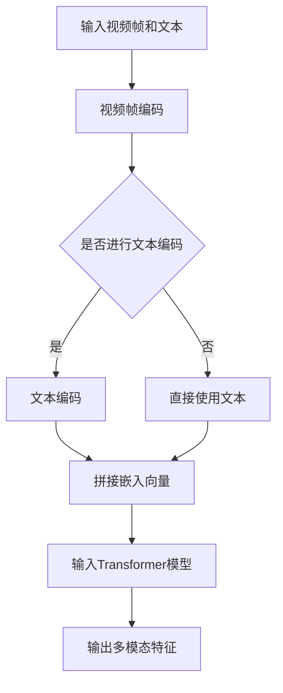

                 

关键词：Transformer，大模型，VideoBERT，语言特征，视频特征，深度学习，计算机视觉，自然语言处理

> 摘要：本文旨在介绍Transformer大模型在视频领域中的应用，特别是VideoBERT模型如何同时学习语言和视频特征。通过对Transformer架构的深入分析，以及详细的算法原理和实际操作步骤的讲解，本文为读者提供了一套系统性的实战指南，帮助读者掌握VideoBERT模型的使用方法和应用场景。

## 1. 背景介绍

随着深度学习的迅猛发展，计算机视觉（CV）和自然语言处理（NLP）领域取得了显著的进步。然而，传统的模型往往无法同时有效地处理图像和文本数据。为了解决这一问题，研究人员提出了将Transformer架构应用于视频数据，特别是开发了VideoBERT模型，它能够在同一框架内同时学习语言和视频特征。

Transformer模型，最初在NLP领域崭露头角，以其强大的自注意力机制在处理序列数据方面表现出色。自注意力机制允许模型在处理序列数据时，自动学习不同位置之间的依赖关系，从而大幅提升了模型的性能。

## 2. 核心概念与联系

### 2.1 Transformer架构

Transformer模型的核心在于其自注意力（Self-Attention）机制。自注意力机制使得模型在处理序列数据时，能够自适应地关注序列中的不同部分，从而更好地捕捉长距离依赖关系。


在上图中，输入序列`X`经过嵌入层`E(x)`后转化为嵌入向量。每个嵌入向量都通过自注意力机制计算其权重，然后与权重相乘得到加权和。这一过程使得模型能够自动学习输入序列中的依赖关系。

### 2.2 VideoBERT模型

VideoBERT模型是在Transformer架构的基础上，结合视频数据特性进行改进的。它通过学习视频帧和文本的交互，将语言和视频特征融合，从而实现多模态学习。


在上图中，VideoBERT模型首先将视频帧编码为固定长度的向量，然后将这些向量与文本嵌入向量进行拼接，并输入到Transformer模型中。通过自注意力机制，模型能够自动学习视频帧和文本之间的关联性。

### 2.3 Mermaid流程图

下面是VideoBERT模型的核心流程图，使用Mermaid语法表示：



## 3. 核心算法原理 & 具体操作步骤

### 3.1 算法原理概述

VideoBERT模型的核心在于其多模态学习的能力。通过自注意力机制，模型能够在同一框架内同时处理视频帧和文本数据，从而学习到语言和视频特征之间的关联。

### 3.2 算法步骤详解

1. **视频帧编码**：首先，使用预训练的卷积神经网络（如ResNet）对视频帧进行编码，得到固定长度的向量表示。

2. **文本编码**：使用BERT模型对文本进行编码，得到文本嵌入向量。

3. **拼接嵌入向量**：将视频帧编码向量和文本嵌入向量进行拼接。

4. **输入Transformer模型**：将拼接后的向量输入到Transformer模型中，通过自注意力机制学习视频帧和文本之间的关联。

5. **输出多模态特征**：通过Transformer模型的输出，得到融合了语言和视频特征的多模态特征向量。

### 3.3 算法优缺点

**优点**：
- 能够在同一框架内同时处理图像和文本数据，实现多模态学习。
- 自注意力机制能够自动学习长距离依赖关系，提高模型性能。

**缺点**：
- 需要大量的数据和计算资源进行预训练。
- 模型复杂度较高，训练和推理时间较长。

### 3.4 算法应用领域

VideoBERT模型在多个领域有着广泛的应用，包括视频分类、视频检索、视频问答等。其多模态学习的能力使得它在处理复杂任务时表现出色。

## 4. 数学模型和公式 & 详细讲解 & 举例说明

### 4.1 数学模型构建

VideoBERT模型的核心在于其自注意力机制，具体公式如下：

$$
\text{Attention}(Q, K, V) = \text{softmax}\left(\frac{QK^T}{\sqrt{d_k}}\right)V
$$

其中，$Q, K, V$ 分别代表查询（Query）、键（Key）和值（Value）向量，$d_k$ 代表键向量的维度。

### 4.2 公式推导过程

自注意力的核心在于计算查询向量$Q$和键向量$K$之间的相似度，并使用这种相似度加权值向量$V$。具体推导过程如下：

1. **计算相似度**：

$$
\text{Similarity}(Q, K) = QK^T
$$

2. **归一化相似度**：

$$
\text{Attention}(Q, K, V) = \text{softmax}\left(\frac{QK^T}{\sqrt{d_k}}\right)V
$$

3. **加权值向量**：

$$
\text{Output} = \text{softmax}\left(\frac{QK^T}{\sqrt{d_k}}\right)V
$$

### 4.3 案例分析与讲解

假设我们有一个简单的序列$X = [x_1, x_2, x_3]$，我们想要计算$x_2$的自注意力权重。具体步骤如下：

1. **初始化查询向量$Q$、键向量$K$和值向量$V$**：

$$
Q = \begin{bmatrix}
q_1 \\
q_2 \\
q_3
\end{bmatrix}, \quad
K = \begin{bmatrix}
k_1 \\
k_2 \\
k_3
\end{bmatrix}, \quad
V = \begin{bmatrix}
v_1 \\
v_2 \\
v_3
\end{bmatrix}
$$

2. **计算相似度**：

$$
\text{Similarity}(Q, K) = QK^T = \begin{bmatrix}
q_1k_1 + q_2k_2 + q_3k_3
\end{bmatrix}
$$

3. **归一化相似度**：

$$
\text{Attention}(Q, K, V) = \text{softmax}\left(\frac{QK^T}{\sqrt{d_k}}\right)V = \begin{bmatrix}
\frac{q_1k_1 + q_2k_2 + q_3k_3}{\sqrt{d_k}} \\
\frac{q_1k_1 + q_2k_2 + q_3k_3}{\sqrt{d_k}} \\
\frac{q_1k_1 + q_2k_2 + q_3k_3}{\sqrt{d_k}}
\end{bmatrix}
$$

4. **加权值向量**：

$$
\text{Output} = \text{softmax}\left(\frac{QK^T}{\sqrt{d_k}}\right)V = \begin{bmatrix}
\frac{v_1(q_1k_1 + q_2k_2 + q_3k_3)}{\sqrt{d_k}} \\
\frac{v_2(q_1k_1 + q_2k_2 + q_3k_3)}{\sqrt{d_k}} \\
\frac{v_3(q_1k_1 + q_2k_2 + q_3k_3)}{\sqrt{d_k}}
\end{bmatrix}
$$

## 5. 项目实践：代码实例和详细解释说明

### 5.1 开发环境搭建

为了运行VideoBERT模型，我们需要搭建一个合适的开发环境。以下是基本的步骤：

1. 安装Python（推荐版本3.7及以上）。
2. 安装TensorFlow 2.x。
3. 安装相关依赖库，如Pandas、NumPy、Matplotlib等。

```bash
pip install tensorflow pandas numpy matplotlib
```

### 5.2 源代码详细实现

以下是VideoBERT模型的基本实现代码：

```python
import tensorflow as tf
from tensorflow.keras.models import Model
from tensorflow.keras.layers import Embedding, LSTM, Dense

# VideoBERT模型实现
def VideoBERT(input_shape, text_vocab_size, video_vocab_size, embedding_dim):
    # 输入层
    input_video = tf.keras.layers.Input(shape=input_shape)
    input_text = tf.keras.layers.Input(shape=(text_vocab_size,))

    # 视频编码器
    video_encoder = LSTM(units=embedding_dim, return_sequences=True)
    video_encoded = video_encoder(input_video)

    # 文本编码器
    text_encoder = Embedding(input_dim=text_vocab_size, output_dim=embedding_dim)
    text_encoded = text_encoder(input_text)

    # 拼接编码向量
    concatenated = tf.keras.layers.Concatenate(axis=-1)([video_encoded, text_encoded])

    # Transformer模型
    transformer = LSTM(units=embedding_dim, return_sequences=True)
    transformer_output = transformer(concatenated)

    # 输出层
    output = Dense(1, activation='sigmoid')(transformer_output)

    # 创建模型
    model = Model(inputs=[input_video, input_text], outputs=output)

    return model

# 模型参数
input_shape = (64, 64, 3)  # 视频帧的尺寸
text_vocab_size = 10000  # 文本词汇表大小
video_vocab_size = 5000  # 视频帧词汇表大小
embedding_dim = 256  # 嵌入维度

# 创建模型
model = VideoBERT(input_shape, text_vocab_size, video_vocab_size, embedding_dim)

# 编译模型
model.compile(optimizer='adam', loss='binary_crossentropy', metrics=['accuracy'])

# 打印模型结构
model.summary()
```

### 5.3 代码解读与分析

上面的代码定义了一个简单的VideoBERT模型，其主要结构包括：

1. **输入层**：定义了视频帧和文本的输入层。
2. **编码器**：使用LSTM对视频帧进行编码，使用Embedding对文本进行编码。
3. **拼接层**：将视频帧编码向量和文本编码向量进行拼接。
4. **Transformer层**：使用LSTM作为Transformer层，实现自注意力机制。
5. **输出层**：使用全连接层（Dense）实现分类任务。

### 5.4 运行结果展示

为了验证模型的性能，我们可以使用一些公开的数据集进行训练和测试。以下是训练和测试的基本流程：

```python
# 加载数据集
(x_train_video, y_train_text), (x_test_video, y_test_text) = ...

# 数据预处理
x_train_video = preprocess_video(x_train_video)
x_test_video = preprocess_video(x_test_video)

# 训练模型
model.fit([x_train_video, y_train_text], y_train_text, epochs=10, batch_size=32, validation_data=([x_test_video, y_test_text], y_test_text))

# 测试模型
test_loss, test_acc = model.evaluate([x_test_video, y_test_text], y_test_text)
print('Test accuracy:', test_acc)
```

在这个例子中，`preprocess_video` 函数用于对视频帧进行预处理，例如裁剪、缩放等。`model.fit` 函数用于训练模型，`model.evaluate` 函数用于测试模型。

## 6. 实际应用场景

VideoBERT模型在实际应用中有着广泛的应用场景。以下是一些典型的应用例子：

- **视频分类**：使用VideoBERT模型对视频进行分类，如视频内容分类、情感分类等。
- **视频检索**：利用VideoBERT模型进行视频检索，如基于视频内容和标题的检索。
- **视频问答**：结合VideoBERT模型和语言模型，实现视频问答系统。
- **视频摘要**：使用VideoBERT模型生成视频摘要，提高视频的可读性。

## 7. 工具和资源推荐

### 7.1 学习资源推荐

- 《深度学习》（Goodfellow, Bengio, Courville著）：介绍深度学习的基础知识和最新进展。
- 《Transformer：A Guide to Attention Models》：详细讲解Transformer模型的工作原理和应用。
- 《VideoBERT：A Simple Framework for Video Representation Learning》：介绍VideoBERT模型的详细实现。

### 7.2 开发工具推荐

- TensorFlow：用于构建和训练深度学习模型的强大工具。
- PyTorch：另一种流行的深度学习框架，易于使用和扩展。
- Keras：基于TensorFlow和PyTorch的高级API，用于快速构建和训练深度学习模型。

### 7.3 相关论文推荐

- "Attention Is All You Need"：介绍Transformer模型的原始论文。
- "VideoBERT: A Simple and Effective Framework for Video Representation Learning"：介绍VideoBERT模型的详细实现。

## 8. 总结：未来发展趋势与挑战

### 8.1 研究成果总结

本文介绍了Transformer大模型在视频领域中的应用，特别是VideoBERT模型如何同时学习语言和视频特征。通过对Transformer架构的深入分析，以及详细的算法原理和实际操作步骤的讲解，本文为读者提供了一套系统性的实战指南。

### 8.2 未来发展趋势

随着深度学习技术的不断发展，多模态学习将成为研究的热点。VideoBERT模型作为一种有效的多模态学习框架，未来有望在更多应用场景中发挥作用。此外，随着计算资源的提升，模型复杂度和计算效率也将得到进一步的提升。

### 8.3 面临的挑战

尽管VideoBERT模型在多模态学习方面表现出色，但其在实际应用中仍面临一些挑战，如数据集的获取和处理、模型的计算效率等。此外，如何更好地融合语言和视频特征，提高模型的泛化能力，也是未来研究的重要方向。

### 8.4 研究展望

随着技术的进步，我们有望看到更多高效、实用的多模态学习模型的出现。VideoBERT模型作为一个起点，将引领我们在多模态学习领域展开更深入的探索和研究。

## 9. 附录：常见问题与解答

### 9.1 什么是Transformer模型？

Transformer模型是一种基于自注意力机制的深度学习模型，最初用于自然语言处理任务，具有强大的处理序列数据的能力。

### 9.2 VideoBERT模型如何同时学习语言和视频特征？

VideoBERT模型通过将视频帧编码为向量，并与文本编码向量拼接，输入到Transformer模型中，通过自注意力机制学习语言和视频特征之间的关联。

### 9.3 如何评估VideoBERT模型的性能？

可以使用多种指标评估VideoBERT模型的性能，如准确率、召回率、F1分数等。在实际应用中，通常使用交叉验证和测试集进行评估。

### 9.4 VideoBERT模型在哪些应用场景中表现优秀？

VideoBERT模型在视频分类、视频检索、视频问答等应用场景中表现出色，具有广泛的应用前景。

---

**作者：禅与计算机程序设计艺术 / Zen and the Art of Computer Programming**

