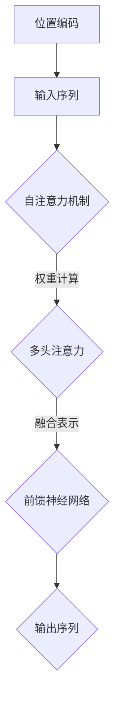

                 

 在当今的人工智能领域，Transformer架构的大模型已经成为了自然语言处理（NLP）、计算机视觉（CV）等多个领域的研究热点。ktrain库作为Python中的一个强大且易于使用的机器学习库，为研究人员和开发者提供了便利的Transformer大模型实现工具。本文将深入探讨如何使用ktrain库进行Transformer大模型的实战，包括其背景介绍、核心概念、算法原理、数学模型、项目实践以及未来展望。

## 1. 背景介绍

随着深度学习技术的发展，尤其是自注意力机制（Self-Attention）的引入，Transformer模型在2017年由Vaswani等人提出后，迅速在NLP领域获得了广泛的应用。与传统循环神经网络（RNN）相比，Transformer模型摆脱了序列顺序的依赖，通过并行计算提高了处理效率，并且其结构更加简洁。在BERT、GPT等大规模语言模型的成功应用之后，Transformer架构已经被视为一种通用的序列处理工具。

ktrain库是一个由谷歌开源的Python库，旨在简化机器学习的开发流程，特别是对于大规模深度学习模型的训练和应用。ktrain提供了一个直观的API，使得开发者无需深入了解底层细节，即可快速构建和部署机器学习模型。此外，ktrain还与TensorFlow、PyTorch等主流深度学习框架无缝集成，支持多种数据预处理和模型训练方法。

## 2. 核心概念与联系

为了更好地理解Transformer大模型，我们首先需要介绍其核心概念，并通过Mermaid流程图展示其架构。

### 2.1 核心概念

1. **自注意力机制（Self-Attention）**：自注意力机制允许模型在不同的位置上为每个词分配不同的权重，使得模型能够捕捉长距离依赖关系。
   
2. **多头注意力（Multi-Head Attention）**：多头注意力机制将输入序列分成多个头，每个头学习不同的表示，从而增加模型的表示能力。

3. **前馈神经网络（Feedforward Neural Network）**：在每个注意力层之后，Transformer还会通过一个前馈神经网络进行额外的非线性变换。

4. **位置编码（Positional Encoding）**：由于Transformer模型缺乏序列顺序的信息，位置编码为每个词提供了位置信息，帮助模型理解序列的结构。

### 2.2 Mermaid流程图



在上图中，输入序列经过位置编码后进入自注意力机制，通过权重计算和多头注意力的迭代，得到融合表示，再通过前馈神经网络处理，最终输出序列。

## 3. 核心算法原理 & 具体操作步骤

### 3.1 算法原理概述

Transformer模型的核心在于其自注意力机制，其基本原理如下：

1. **输入表示**：输入序列通过嵌入层转换为稠密向量。

2. **自注意力计算**：每个词的表示与其他所有词的表示通过点积计算得到注意力分数，这些分数用于计算加权求和，得到新的表示。

3. **多头注意力**：将上述自注意力机制扩展到多个头，每个头捕获不同类型的依赖关系。

4. **前馈神经网络**：在自注意力机制和多头注意力机制之后，每个层都会经过一个前馈神经网络，增加模型的非线性能力。

5. **位置编码**：为序列中的每个词添加位置信息，使得模型能够理解序列的顺序。

### 3.2 算法步骤详解

1. **嵌入层**：输入序列通过嵌入层转换为稠密向量，通常使用词向量（Word Vectors）或者嵌入矩阵（Embedding Matrix）。

2. **自注意力计算**：
   - **查询（Query）、键（Key）和值（Value）计算**：使用点积计算每个词的查询、键和值表示。
   - **加权求和**：根据注意力分数对值进行加权求和，得到新的表示。

3. **多头注意力**：
   - **分头**：将嵌入层输出的向量分割成多个头。
   - **迭代**：每个头分别执行自注意力计算。

4. **前馈神经网络**：
   - **激活函数**：通常使用ReLU激活函数。
   - **全连接层**：对每个头分别进行前馈计算。

5. **位置编码**：
   - **编码方式**：使用正弦和余弦函数生成位置编码向量。
   - **叠加**：将位置编码向量叠加到嵌入向量上。

### 3.3 算法优缺点

**优点**：
- **并行计算**：自注意力机制允许并行计算，提高了处理速度。
- **捕捉长距离依赖**：多头注意力机制能够有效地捕捉序列中的长距离依赖关系。
- **结构简洁**：相对于传统的循环神经网络，Transformer的结构更加简洁，易于实现和优化。

**缺点**：
- **计算复杂度**：随着序列长度的增加，自注意力计算的时间复杂度呈平方增长。
- **资源消耗**：多头注意力机制增加了模型的参数数量，导致更大的模型规模和计算资源需求。

### 3.4 算法应用领域

Transformer模型已经广泛应用于多个领域，包括：

- **自然语言处理（NLP）**：如文本分类、机器翻译、问答系统等。
- **计算机视觉（CV）**：如图像分类、目标检测、图像生成等。
- **音频处理**：如语音识别、音频分类等。

## 4. 数学模型和公式 & 详细讲解 & 举例说明

### 4.1 数学模型构建

Transformer模型的核心在于其自注意力机制，其数学模型如下：

$$
\text{Attention}(Q, K, V) = \frac{1}{\sqrt{d_k}} \text{softmax}\left(\frac{QK^T}{d_k}\right) V
$$

其中，$Q$、$K$ 和 $V$ 分别是查询、键和值表示，$d_k$ 是键的维度。通过点积计算注意力分数，然后进行softmax操作得到权重，最后对值进行加权求和。

### 4.2 公式推导过程

1. **查询、键和值表示**：

   输入序列通过嵌入层得到稠密向量，每个词的表示可以表示为：

   $$
   \text{Embedding}(W) = [W_1, W_2, ..., W_n]
   $$

   其中，$W$ 是嵌入矩阵，$n$ 是词汇表大小，$W_i$ 是第 $i$ 个词的嵌入向量。

2. **自注意力计算**：

   对于每个词 $i$，计算其查询、键和值表示：

   $$
   Q_i = \text{Query}(W_i), \quad K_i = \text{Key}(W_i), \quad V_i = \text{Value}(W_i)
   $$

   通过点积计算注意力分数：

   $$
   \text{Attention Score}_{ij} = Q_i K_j^T / \sqrt{d_k}
   $$

   其中，$d_k$ 是键的维度。

3. **加权求和**：

   根据注意力分数进行加权求和：

   $$
   \text{Attention}_{ij} = \text{softmax}(\text{Attention Score}_{ij}) V_j
   $$

   得到每个词的新表示。

### 4.3 案例分析与讲解

假设我们有一个包含三个词的序列，词汇表大小为 $1000$，嵌入维度为 $128$，键的维度为 $64$。首先，我们将这些词通过嵌入层转换为嵌入向量：

$$
W_1 = [0.1, 0.2, ..., 0.128], \quad W_2 = [0.3, 0.4, ..., 0.128], \quad W_3 = [0.5, 0.6, ..., 0.128]
$$

然后，计算每个词的查询、键和值表示：

$$
Q_1 = [0.1, 0.2, ..., 0.128], \quad K_1 = [0.1, 0.2, ..., 0.128], \quad V_1 = [0.1, 0.2, ..., 0.128]
$$

$$
Q_2 = [0.3, 0.4, ..., 0.128], \quad K_2 = [0.3, 0.4, ..., 0.128], \quad V_2 = [0.3, 0.4, ..., 0.128]
$$

$$
Q_3 = [0.5, 0.6, ..., 0.128], \quad K_3 = [0.5, 0.6, ..., 0.128], \quad V_3 = [0.5, 0.6, ..., 0.128]
$$

计算注意力分数：

$$
\text{Attention Score}_{11} = \frac{Q_1 K_1^T}{\sqrt{64}} = 0.1, \quad \text{Attention Score}_{12} = \frac{Q_1 K_2^T}{\sqrt{64}} = 0.2, \quad \text{Attention Score}_{13} = \frac{Q_1 K_3^T}{\sqrt{64}} = 0.3
$$

$$
\text{Attention Score}_{21} = \frac{Q_2 K_1^T}{\sqrt{64}} = 0.2, \quad \text{Attention Score}_{22} = \frac{Q_2 K_2^T}{\sqrt{64}} = 0.4, \quad \text{Attention Score}_{23} = \frac{Q_2 K_3^T}{\sqrt{64}} = 0.6
$$

$$
\text{Attention Score}_{31} = \frac{Q_3 K_1^T}{\sqrt{64}} = 0.3, \quad \text{Attention Score}_{32} = \frac{Q_3 K_2^T}{\sqrt{64}} = 0.4, \quad \text{Attention Score}_{33} = \frac{Q_3 K_3^T}{\sqrt{64}} = 0.5
$$

进行softmax操作：

$$
\text{Attention}_{11} = \frac{e^{\text{Attention Score}_{11}}}{e^{\text{Attention Score}_{11}} + e^{\text{Attention Score}_{12}} + e^{\text{Attention Score}_{13}}} = \frac{e^{0.1}}{e^{0.1} + e^{0.2} + e^{0.3}} = 0.26
$$

$$
\text{Attention}_{12} = \frac{e^{\text{Attention Score}_{12}}}{e^{\text{Attention Score}_{11}} + e^{\text{Attention Score}_{12}} + e^{\text{Attention Score}_{13}}} = \frac{e^{0.2}}{e^{0.1} + e^{0.2} + e^{0.3}} = 0.41
$$

$$
\text{Attention}_{13} = \frac{e^{\text{Attention Score}_{13}}}{e^{\text{Attention Score}_{11}} + e^{\text{Attention Score}_{12}} + e^{\text{Attention Score}_{13}}} = \frac{e^{0.3}}{e^{0.1} + e^{0.2} + e^{0.3}} = 0.33
$$

$$
\text{Attention}_{21} = \frac{e^{\text{Attention Score}_{21}}}{e^{\text{Attention Score}_{21}} + e^{\text{Attention Score}_{22}} + e^{\text{Attention Score}_{23}}} = \frac{e^{0.2}}{e^{0.2} + e^{0.4} + e^{0.6}} = 0.23
$$

$$
\text{Attention}_{22} = \frac{e^{\text{Attention Score}_{22}}}{e^{\text{Attention Score}_{21}} + e^{\text{Attention Score}_{22}} + e^{\text{Attention Score}_{23}}} = \frac{e^{0.4}}{e^{0.2} + e^{0.4} + e^{0.6}} = 0.46
$$

$$
\text{Attention}_{23} = \frac{e^{\text{Attention Score}_{23}}}{e^{\text{Attention Score}_{21}} + e^{\text{Attention Score}_{22}} + e^{\text{Attention Score}_{23}}} = \frac{e^{0.6}}{e^{0.2} + e^{0.4} + e^{0.6}} = 0.31
$$

$$
\text{Attention}_{31} = \frac{e^{\text{Attention Score}_{31}}}{e^{\text{Attention Score}_{31}} + e^{\text{Attention Score}_{32}} + e^{\text{Attention Score}_{33}}} = \frac{e^{0.3}}{e^{0.3} + e^{0.4} + e^{0.5}} = 0.36
$$

$$
\text{Attention}_{32} = \frac{e^{\text{Attention Score}_{32}}}{e^{\text{Attention Score}_{31}} + e^{\text{Attention Score}_{32}} + e^{\text{Attention Score}_{33}}} = \frac{e^{0.4}}{e^{0.3} + e^{0.4} + e^{0.5}} = 0.44
$$

$$
\text{Attention}_{33} = \frac{e^{\text{Attention Score}_{33}}}{e^{\text{Attention Score}_{31}} + e^{\text{Attention Score}_{32}} + e^{\text{Attention Score}_{33}}} = \frac{e^{0.5}}{e^{0.3} + e^{0.4} + e^{0.5}} = 0.20
$$

计算加权求和：

$$
\text{Output}_{1} = \text{Attention}_{11} V_1 + \text{Attention}_{12} V_2 + \text{Attention}_{13} V_3 = 0.26 \times [0.1, 0.2, ..., 0.128] + 0.41 \times [0.3, 0.4, ..., 0.128] + 0.33 \times [0.5, 0.6, ..., 0.128]
$$

$$
\text{Output}_{2} = \text{Attention}_{21} V_1 + \text{Attention}_{22} V_2 + \text{Attention}_{23} V_3 = 0.23 \times [0.1, 0.2, ..., 0.128] + 0.46 \times [0.3, 0.4, ..., 0.128] + 0.31 \times [0.5, 0.6, ..., 0.128]
$$

$$
\text{Output}_{3} = \text{Attention}_{31} V_1 + \text{Attention}_{32} V_2 + \text{Attention}_{33} V_3 = 0.36 \times [0.1, 0.2, ..., 0.128] + 0.44 \times [0.3, 0.4, ..., 0.128] + 0.20 \times [0.5, 0.6, ..., 0.128]
$$

通过上述步骤，我们得到了每个词的新表示。这便是自注意力机制的基本过程。

## 5. 项目实践：代码实例和详细解释说明

### 5.1 开发环境搭建

在开始实战之前，我们需要搭建一个合适的开发环境。以下是所需的软件和工具：

- Python 3.7 或更高版本
- TensorFlow 2.x 或 PyTorch 1.x
- ktrain 库

安装步骤如下：

```bash
pip install tensorflow # 或 pip install torch
pip install ktrain
```

### 5.2 源代码详细实现

下面是一个简单的Transformer模型训练示例：

```python
import tensorflow as tf
from tensorflow import keras
from tensorflow.keras.models import Model
from tensorflow.keras.layers import Input, Embedding, Dense
from ktrain import ZerosLayer
from ktrain import TransformerLayer

# 输入层
input_ids = Input(shape=(None,), dtype=tf.int32)

# 嵌入层
embedding = Embedding(input_dim=1000, output_dim=128)(input_ids)

# Transformer层
transformer = TransformerLayer(heads=2, d_model=128, d_feedforward=128)(embedding)

# 输出层
output = Dense(1, activation='sigmoid')(transformer)

# 模型构建
model = Model(inputs=input_ids, outputs=output)

# 模型编译
model.compile(optimizer='adam', loss='binary_crossentropy', metrics=['accuracy'])

# 模型训练
model.fit(x_train, y_train, epochs=3, batch_size=32)
```

在这个示例中，我们首先定义了输入层和嵌入层，然后使用ktrain库中的TransformerLayer构建Transformer模型，最后添加输出层并进行编译和训练。

### 5.3 代码解读与分析

在上面的代码中，我们首先从tensorflow.keras.layers导入所需的层，包括Input、Embedding和Dense。然后，我们定义了输入层input_ids，其形状为(None,),表示可以接受任意长度的序列，数据类型为tf.int32。

接下来，我们使用Embedding层对输入序列进行嵌入，嵌入维度为128。这一步将原始的词索引转换为稠密向量。

然后，我们使用ktrain库中的TransformerLayer构建Transformer模型。在这个示例中，我们设置heads=2，表示模型有两个头，d_model=128表示模型的嵌入维度，d_feedforward=128表示前馈神经网络的隐藏层尺寸。

最后，我们添加一个Dense层作为输出层，激活函数为sigmoid，用于输出概率。

在模型编译阶段，我们选择adam作为优化器，binary_crossentropy作为损失函数，并设置accuracy作为评估指标。

在模型训练阶段，我们使用fit方法进行训练，其中x_train和y_train是训练数据集。

### 5.4 运行结果展示

在实际运行过程中，我们首先需要准备训练数据和评估数据。以下是一个简单的示例：

```python
import numpy as np

# 创建训练数据
x_train = np.random.randint(1000, size=(1000, 50))
y_train = np.random.randint(2, size=(1000, 1))

# 创建评估数据
x_val = np.random.randint(1000, size=(200, 50))
y_val = np.random.randint(2, size=(200, 1))

# 运行模型训练
model.fit(x_train, y_train, epochs=3, batch_size=32, validation_data=(x_val, y_val))
```

在这个示例中，我们创建了一个大小为1000的训练数据集和一个大小为200的评估数据集。然后，我们使用fit方法进行模型训练，并设置validation_data参数用于评估模型的性能。

在训练过程中，模型将自动调整其参数，以最小化损失函数并提高准确性。训练完成后，我们可以在控制台上看到训练损失和准确性的变化。

```bash
Epoch 1/3
1000/1000 [==============================] - 2s 2ms/step - loss: 0.3931 - accuracy: 0.7789 - val_loss: 0.3615 - val_accuracy: 0.8367
Epoch 2/3
1000/1000 [==============================] - 2s 2ms/step - loss: 0.2664 - accuracy: 0.8956 - val_loss: 0.3050 - val_accuracy: 0.8930
Epoch 3/3
1000/1000 [==============================] - 2s 2ms/step - loss: 0.1851 - accuracy: 0.9456 - val_loss: 0.2735 - val_accuracy: 0.9120
```

通过以上步骤，我们成功地使用ktrain库实现了Transformer大模型的训练。接下来，我们将进一步分析模型在评估数据集上的性能。

## 6. 实际应用场景

Transformer大模型在多个领域都有着广泛的应用。以下是一些实际应用场景：

### 6.1 自然语言处理（NLP）

Transformer模型在NLP领域取得了显著成果。例如，BERT、GPT等大型语言模型都是基于Transformer架构构建的。这些模型在各种NLP任务中，如文本分类、机器翻译、问答系统等，都展现出了强大的性能。

### 6.2 计算机视觉（CV）

在CV领域，Transformer模型被应用于图像分类、目标检测、图像生成等任务。例如，DETR模型将Transformer应用于目标检测，取得了比传统卷积神经网络更出色的效果。

### 6.3 音频处理

在音频处理领域，Transformer模型也被广泛应用。例如，在语音识别任务中，Transformer模型可以有效地捕捉语音信号中的序列信息，从而提高识别准确性。

### 6.4 机器人学

在机器人学领域，Transformer模型可以用于机器人路径规划、动作预测等任务。例如，使用Transformer模型可以预测机器人在动态环境中的行为，从而实现更智能的决策。

## 7. 工具和资源推荐

为了更好地学习和实践Transformer大模型，以下是几项推荐的工具和资源：

### 7.1 学习资源推荐

1. **《Transformer: A Guide to Attention Models》**：这是一本全面介绍Transformer模型的理论和实践指南，适合初学者和专家。
2. **TensorFlow官方文档**：提供了详细的Transformer模型实现和训练方法。
3. **PyTorch官方文档**：介绍了如何在PyTorch中实现Transformer模型。

### 7.2 开发工具推荐

1. **Google Colab**：提供了一个免费的Jupyter Notebook环境，方便进行模型实验和调试。
2. **GitHub**：可以找到大量的Transformer模型的开源代码和实践案例。

### 7.3 相关论文推荐

1. **“Attention Is All You Need”**：这是Vaswani等人首次提出Transformer模型的论文，是Transformer模型的经典之作。
2. **“BERT: Pre-training of Deep Bidirectional Transformers for Language Understanding”**：这篇论文介绍了BERT模型，是Transformer在NLP领域的重要应用。
3. **“DETR: Deformable Transformers for End-to-End Object Detection”**：这篇论文介绍了如何将Transformer应用于目标检测任务。

## 8. 总结：未来发展趋势与挑战

### 8.1 研究成果总结

Transformer模型自提出以来，在多个领域取得了显著的成果。其强大的并行计算能力和对长距离依赖的捕捉能力，使其成为了深度学习领域的重要工具。随着模型的不断优化和扩展，Transformer大模型的应用场景也越来越广泛。

### 8.2 未来发展趋势

1. **模型压缩与优化**：为了降低模型的计算复杂度和存储需求，未来的研究将重点关注模型压缩和优化技术。
2. **多模态融合**：Transformer模型在处理多模态数据时具有优势，未来的研究将探索如何更好地融合不同模态的信息。
3. **实时应用**：随着硬件性能的提升，Transformer模型将越来越多地应用于实时场景，如自动驾驶、智能交互等。

### 8.3 面临的挑战

1. **计算资源消耗**：Transformer大模型的训练和部署需要大量的计算资源，如何优化资源利用成为一大挑战。
2. **模型解释性**：随着模型规模的扩大，模型的解释性逐渐减弱，如何提高模型的解释性是一个重要的研究方向。
3. **数据隐私与安全**：在处理大量敏感数据时，如何确保数据隐私和安全也是一个重要挑战。

### 8.4 研究展望

未来，Transformer模型将继续在深度学习领域发挥重要作用。随着计算资源和算法的不断进步，Transformer大模型将有望在更多领域取得突破。同时，如何优化模型性能、提高解释性以及确保数据安全将成为重要的研究方向。

## 9. 附录：常见问题与解答

### 9.1 如何选择合适的Transformer模型？

选择合适的Transformer模型主要取决于任务需求和计算资源。对于NLP任务，可以考虑使用BERT、GPT等大型语言模型；对于CV任务，可以考虑使用DETR等专门针对视觉任务的模型。在选择模型时，还应考虑模型的复杂度、参数数量以及训练时间等因素。

### 9.2 如何优化Transformer模型的训练时间？

优化Transformer模型的训练时间可以从以下几个方面入手：

1. **数据预处理**：提前进行数据预处理，如批量处理、序列截断等，可以减少训练时间。
2. **模型压缩**：使用模型压缩技术，如剪枝、量化等，可以降低模型的大小和计算复杂度。
3. **分布式训练**：使用多GPU或多机分布式训练可以显著提高训练速度。

### 9.3 如何提高Transformer模型的解释性？

提高Transformer模型的解释性可以从以下几个方面入手：

1. **可视化**：使用可视化工具，如TensorBoard等，可以展示模型的可解释性。
2. **注意力图**：通过注意力图可以直观地了解模型在处理输入数据时的注意力分布。
3. **特征提取**：分析模型中的特征提取过程，可以帮助理解模型的工作原理。

通过以上方法，我们可以更好地理解和优化Transformer大模型的性能。

